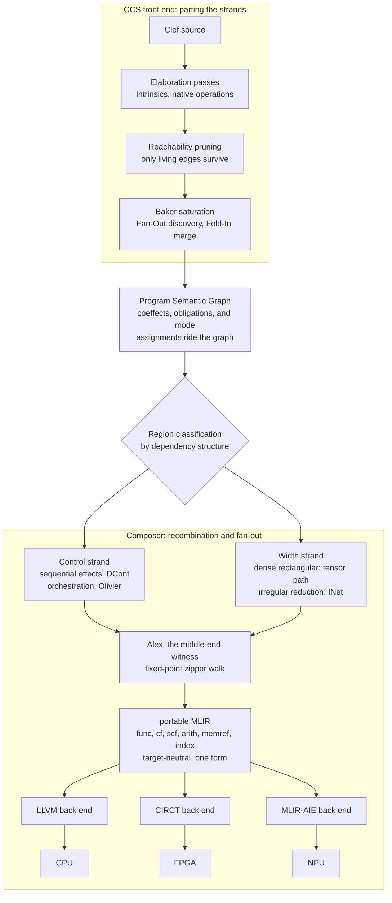
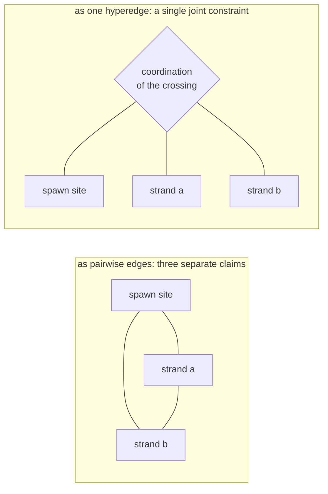
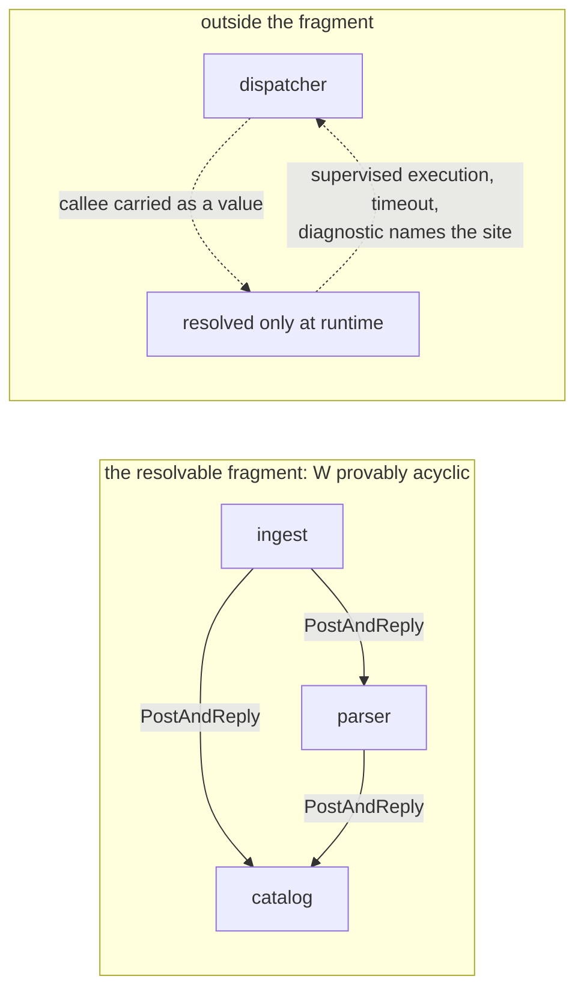

The field has a shelf of terms for the portion of computation that 'comes apart' cleanly. 

- map
- SIMD/SIMT
- confluent
- data-parallel
- referentially transparent
- Embarrassingly parallel

Each names a mechanic whose elements do not depend on others, so an application can run them separately with no coordination.

> Now consider terms that cover the *adjacent* case...

...a program that spawns work from inside a sequential process, waits for the results, and uses them to decide what happens next. That has a 'shelf' of its own:

- loops
- forks
- joins
- futures
- promises
- async/await
- continuations

Each of these names the control act or its bookkeeping: the repetition, the spawn and its join, the pending handle, the suspension and its resumption. However, a cohesive term for the full construction, the interleave of control and width carried as one object with its crossings intact, is a matter of *assembly*. 

The nearest name on record for that conjunction is [braided parallelism](https://ieeexplore.ieee.org/document/6272260/), coined in the GPGPU era for a single-source model that interleaves task and data parallelism, with the game engine as the standing example. We are going to take the word and run with it, on one property: a braid comes apart if a strand is cut. The structure taken from that paper is *the crossing*. The parallel component cannot be lifted out, run as embarrassingly parallel, and stapled back on afterward, because the places where the strands cross are where the work resides. 

Real programs are braided in exactly this sense. They spawn parallel work out of sequential control, and the act of spawning is a control act with a return point, a place the computation comes back to and threads the result through what comes next. That return point is ***the crossing***. A substrate that gives it no first-class place cannot hold the braid, however well it holds the strand. And that capacity varies across processor types. Which forms of braided parallelism a processor can take differs by class, and the GPU, the hardware the word was coined for, is narrow against the variety of cases garden-variety code expresses as a matter of course. Spanning CPU and other accelerators with a coherent language surface is part of the reason we're building the Fidelity Framework.

> **Width, in this post.** The parallel extent of a program's dependency structure: how many pieces of work are mutually independent at a given point. In order-theoretic terms that is the size of the largest antichain in the dependency graph, and Dilworth's theorem pairs it with the minimum number of sequential chains needed to cover the same structure. The parallelism a structure admits and the sequencing it forces are one number seen from two sides, which is the formal statement of the braid this post is about.
>
> Where the distinction matters we write ***dependency width*** for that quantity and ***bit width*** for the representation width that [width inference](/docs/design/types/width-inference/) settles for a value. Both answer "how much fits across here," one across a value's representation and one across a program's dependency structure, and they are otherwise unrelated.

## A workload that will not unweave

Our position would benefit from a solid example before we carry forward the argument. Dependency resolution is one of the plainest:

```fsharp
// the frontier for round n+1 does not exist until
// round n's parallel width has come back through the fold
let resolve (root: PackageId) = async {
    let mutable resolved = Map.empty
    let mutable frontier = [ root ]
    while not (List.isEmpty frontier) do
        let! manifests = Registry.fetchAll frontier    // control: one round of I/O
        let solved = query {
            // width: every manifest independent
            for m in manifests do
            select (m.Id, Solver.constraintsOf m)
        }
        resolved <- Map.merge solved resolved
        frontier <- nextFrontier resolved solved       // the crossing: width decides control
    return resolved
}
```

Inside a round, the parsing and constraint-solving of each manifest is a clean *strand*: no manifest depends on another, and the dependency width is real. Between rounds, the program is control: the fetch is an effect, and the frontier assignment decides whether the loop runs again and *over **what***. The crossing is the line where `frontier` is rebuilt from the width's results. In compiler parlance, the width cannot be 'hoisted' ahead of the control, because the set of manifests to parse is an output of the loop it would be hoisted *out of*. And the additional wrinkle: the control cannot run ahead of the width, because the frontier is computed from results that do not exist yet. Serializing everything preserves the crossings and gives up the machine. The parallel reading exists round by round, and only there. Our [flow loss analysis](/docs/design/structure-and-performance/flow-loss-analysis/) measures that round-by-round gap between a program's ideal parallel reading and what a serialized lowering keeps.

That snippet is the measure for the substrates below, ours included. The code is deliberately ordinary: the same shape reads as everyday F#, with shades of Python, TypeScript and others reflected in it. Each of those toolchains already has some method for dealing with this, at different levels of complexity and computational cost. 

On .NET, the `async` block runs its awaits on the thread pool and the query stays sequential. Parallelism is a library the developer reaches for, `Async.Parallel` or PLINQ, and once invoked, placement belongs to the runtime scheduler, with no analysis of what the parallel lambdas share. Python's `asyncio` overlaps the fetches while the interpreter's global lock keeps the per-manifest solving on one core. Escaping to processes buys real width and pays for it in serialization at every boundary. TypeScript overlaps the fetches on its event loop and runs every solve on that same single thread, with worker threads a separate API and message-passing at its edge. Three ecosystems, one common answer: the width is opt-in, the placement belongs to the runtime or the developer. Nothing checks what the parallel version shares or whether the interleave can stall, and the arrangement is written against one processor class. Moving the same program to a GPU or an NPU is a rewrite, often with a different API surface or separate language altogether.

Our answer starts from the same ordinary code, with nothing marked by hand. The reliance is on a more principled, more intelligent compiler. CCS and Baker would classify the regions off the dependency structure of the graph; the width would lower to lanes chosen for the processor actually being targeted through Fidelity.Platform capability predicates; and the crossings would ride the graph as checked structure: escape-classified for memory, and rank-checked for liveness wherever synchronous actor calls enter. The material difference is where the work is characterized. Shape, control, width, and crossings alike would be our compiler's object, and the developer's part "stops" (more or less) with writing the source code. Our position across the Fidelity framework has been for the compilation discipline to match the shape by design, and make it a province of the lowering pipeline and maintain safety, efficiency and correctness.

## Standing Art in Other Ecosystems

Through our research we've taken time to survey several frameworks which built their foundations on the 'clean strand', which on its own is significant work. But the signals that a pattern can be 'over-read' emerges: a narrow but potent idea's elegance gets taken as evidence of general breadth. In many cases, the demonstration chosen to show off the new capability is of a similarly narrow 'happy path' variety, where the limitations start to show when the real-world cases start to line up.

One question runs through all four of them, and it is the practical one for anyone deciding what to build on. The braid does not come apart, so a substrate with no place for the crossing does not remove the crossing. It relocates it. What a reader has at stake in each case is where the crossing ends up. It goes into a runtime that pays for it on every pass, or into code the developer writes and maintains by hand. The cost becomes visible after the substrate is chosen, when the workload stops looking like the demo.

Interaction nets are the sharpest instance, and we admit them as part of our own lowering design. The focused implementations, HVM and its successor [HVM2](https://github.com/HigherOrderCO/HVM), are committed parallel interaction-net runtimes, including on GPU. In some cases the model is right for irregular, sharing-heavy reduction. Its limited reach is also a signal. One cannot make everything in computation into a *net* in the interaction net sense, because real-world programs spawn parallel work out of **sequential** control, and that *spawn* is a continuation by any other name, for which the interaction net has no first-class role. The net carries no continuation capture, no sequencing, and no central scheduler. The same austerity that makes it fast on the independent strand *leaves the crossing **beyond** its reach*. So HVM ships a runtime host to do the scheduling the net has no way to express, and that host runs on every crossing for the life of the program. The speedups you see published measure the reduction itself. The scheduling the host does around it is a separate cost, paid every time the program crosses from parallel work back to control.

Verse takes a different route to the same problem. Its core calculus extends the lambda calculus with logical variables, unification, and choice, and its central decision is to treat choice as data: `all` turns a choice into a tuple, indexing a tuple with an unbound variable turns it back into a choice, and the calculus never commits to a branch. The result is determinism, which functional logic languages generally give up.

That identification is the part this post has a stake in. Control becomes a data structure. Our own position holds that control and dependency width are different kinds, and that the crossings between them are where the work sits, so an identification that turns one into the other has no crossing left to hold. What takes its place is a runtime that can undo an ordering after the fact, and the path from one to the other is short.

Because `all` makes the order of results observable, every rewrite rule has to preserve left-to-right order, and the authors call the machinery that does it unsatisfying. Because order is preserved everywhere, determinism "pretty much rules out laziness and parallel first-come first-returned search strategies," which is their sentence and not ours. And a rewrite that can duplicate or relocate a branch requires any effect inside one to be undoable.

Two of those consequences touch our own mechanisms directly. The first is laziness. A thunk is the deferred computation laziness produces, and a [flat closure](/spec/draft/closure-representation/) in the MLKit tradition is what captures its environment. Both are first-class objects in our lowering, with a representation the back end reads directly, and [incremental computation](/docs/design/structure-and-performance/incremental-computation/) is built on top of them. Deferral does not disappear when a language gives it up. It comes back as something the developer writes: a memo table, a cached property, a `useMemo` call. A compiler looking at hand-rolled deferral sees a heap object it cannot reason about, where one that owns the thunk decides whether the value escapes, whether it fits on the stack, and what has to be recomputed when an input changes. The second is recursion, which their confluence proof sets aside in order to go through. Composer's middle end walks the program graph with a fixed-point combinator, and the [Fixed-Point Scaffolding pre-print](https://arxiv.org/abs/2606.02854) argues that the walk is what carries a compilation guarantee from one lowering pass to the next.

That last requirement, undoable effects, is not a bill the calculus handed them. In his POPL keynote in 2006, seventeen years before the calculus was published, Sweeney called transactions "the only plausible solution to concurrent mutable state." The rewrite semantics agrees with a position Epic had already held for most of two decades. Transactional semantics are now the headline of the Unreal Engine 6 roadmap announced at State of Unreal in June 2026: wrap gameplay logic so state changes are recoverable, and let the runtime synchronize and save global program state across every running instance, which reduces saving a player's progress to a single map from player to saved state. Persistence without plumbing, for persistent multiplayer worlds, is a real product and a deliberate purchase. And therefore the contrast with our own position is a design difference and not a matter of taste. Verse keeps the ability to roll back an ordering that turns out wrong, and carries a runtime equal to that job. Composer is being built to settle the ordering before the program runs, with the [tiered verification posture](/docs/internals/verification/) deciding how much of that settlement is proven and how much is supervised.

The hardware version of the over-tailored tell comes from the reconfigurable-dataflow world. The CGRA processor, a coarse-grained reconfigurable array, is a fabric of compute tiles onto which a dataflow graph is spatially mapped, and the advantage is direct: let the program's dataflow become the machine's layout, and the instruction stream falls away. The demonstration that fronts this class of hardware is GUPS, giga-updates per second, a benchmark that scatters read-modify-write updates across a huge table at random indices. As a stress of memory-level parallelism it is honest work. As a showcase it is chosen because every update is independent of every other, no result ever steers control, and the benchmark's rules tolerate a small fraction of lost updates, so even atomicity is negotiable. That is *"the strand"* in its purest form, all width and no crossing, the workload with the "hard part" conspicuously absent. A fabric that headlines with GUPS has demonstrated bandwidth on independent updates. Now hand it the resolver. Round n's manifests come back, the frontier for round n+1 has to be computed from them, and the fabric has no construct that makes that decision, so it hands control to a host CPU and waits for an answer.

Anyone who has profiled a GPU workload has already met this shape. The kernel itself is fast, and the program spends its time going back and forth to the host that decides what to run next. It is the same round trip that dominates game frame times and AI inference, and it is why batching exists. A dataflow fabric inherits that bill wherever one round's results steer the next round, and GUPS was chosen as the showcase because it has no round that steers anything. 

> The demonstration is chosen for the case without a crossing.

These examples share a pattern: the idea is good, and the demonstration is selected to minimize the generality gap. We're grateful for the work they've each produced, and each was useful study as our designs took shape.

A fourth example, Modular's MAX, belongs in a different slot: it makes no attempt to claim the role of universal substrate. MAX is a graph-compiled inference engine that targets CUDA, ROCm, and Apple Metal from one [Mojo](/blog/musing-on-mojo/) kernel codebase. It is MLIR-native and the product of significant engineering effort. By its competitors' own accounts it pulls ahead on dense models at high concurrency. Its programming model is explicitly the grid, thread blocks mapped onto one-, two-, or three-dimensional blocks grouped into a grid, and that model is the right answer for dense, feed-forward tensor workloads, where the computation shape is fixed before the first request and every lane does the same work. MAX is a first-class example in the grid-scoped category. Its scope boundary is legible in its own roadmap, and yet, the gaps *still* surface under a closer look. Mixture-of-experts architectures are an acknowledged gap, and MoE is exactly where inference stops being a clean *dense* grid and acquires **routing**: data-dependent dispatch to experts, a conditional decision about which sub-networks fire on this input. That routing is control arriving inside the inference workload. The braid shows up at the honest edge of a selected scope, and the routing decision has to run somewhere: on the host, between kernel launches, while the grid holds. In a mixture-of-experts model, most parameters sit in experts a given token never activates, so the routing decision runs once per token and each one is a host round trip. This is the [Uncomfortable Truth](https://speakez.tech/blog/uncomfortable-truth/) detailed in the SpeakEZ Technologies blog.

Two things keep this fair, and both are the same discipline applied to our own framework. MAX, Mojo, and our Composer compiler each use MLIR (Multi-Level Intermediate Representation) to varying degrees, and MAX reached that infrastructure for their own purposes. Shared infrastructure carries only what the originating source language exposes to it, though, a point our [musings on Mojo](/blog/musing-on-mojo/) developed at length. Mojo's surface carries Python's imperative roots, from mutation-heavy idiom to the def/fn split, so the braid's raw material, which regions depend on which, what is pure enough to reorder, where a crossing begins and ends, has to be recovered from code whose semantics work *against* the analysis. 

By contrast, Clef is a concurrent language by design, using an ML-family semantic core where immutability and explicit data flow map directly onto MLIR's SSA form, and the same structure arrives at the infrastructure *already **legible***. How much of the braid MLIR can carry for a toolchain is a product of what's *above* MLIR, in the language semantics and the front end of compilation. The boundary of MAX's chosen scope is exactly where inference begins to braid, and that boundary is already visible in its own gaps. When we approach that same territory it is through typed domain models whose membership is [settled by grade before a request arrives](/docs/design/constrained-machine-learning/the-constellation/), where a mixture of experts learns it as routing weights. The net effect shows a different answer to us, and whether that routing can be made reliable is a question we take seriously. It's a primary motivator for our reliance on a well-principled semantic graph *above* MLIR, to make those determinations before we engage the scaffolding that carries them through lowering to hardware.

Across all four, a substrate carries only the structures its shape admits, and dependency width is the structure each of them holds best. None of these substrates lacks power in the Church-Turing sense. Each of them can express a resolver, because equipotence is settled and no substrate escapes or extends the class. What differs is where a program's structure ends up: in a first-class construct of the model, or in an encoding the developer is forced to maintain or a runtime is hamstrung into supporting with makeshift mechanisms. This 'braid' construct described in this entry frames a distinct, common computational structure that has to land ***somewhere***. Our position is to put it at the **center** of our design model, because a runtime that leaves memory safety, thread safety, and deadlock freedom to run time carries a hidden cost, and it stays hidden until the failure modes emerge. That maintenance spiral is its own form of ongoing engineering cost, operational burden and efficiency sink that we specifically seek to avoid with our architecture.

The taxonomy, consolidated:

| Substrate | Founding shape | Right for | Where the braid arrives |
|---|---|---|---|
| HVM / HVM2 | interaction nets: confluent, local rewriting | irregular reduction whose parallelism is real but not rectangular | the spawn's return point, which has no first-class place in the net |
| Verse core calculus (VC) | choice arranged in the term's syntax, never committed to a branch | deterministic functional logic search | the parallel case its determinism "forecloses": first-come first-returned |
| CGRA dataflow demos (GUPS) | the dataflow graph spatially mapped onto a tile fabric | bandwidth-bound work with independent updates | the coordination the flagship demo removed |
| Modular MAX | the grid: blocks over a shape fixed before launch | dense feed-forward inference, correctly scoped | MoE routing: data-dependent dispatch inside the inference pass |

Put on a runtime hat and run the resolver against the first and last rows. A grid requires its iteration space fixed before launch, and the resolver's round n+1 frontier does not exist until round n returns. So a grid executes it as one kernel launch per round with the loop living on the host, and the host loop is precisely the control the model excludes. The program's structure sits in the seam between launches, past the edge of what the grid carries. A net runs each round's width beautifully. The round boundary is a sequencing act: gather every result, merge against `resolved`, choose the next frontier. Encoding that into the net is scheduling by hand-built encoding, the bookkeeping HVM pays a runtime host to do dynamically. Both substrates hold the strand. Holding the ***crossing*** falls to a layer above.

The terms on those opening 'shelves' each carry weight, several of them as technologies in service, and each is valuable inside its remit. So a fair reader can ask: with this much standing art, does Clef have anything to bring? Our answer is the assembly. Regions have to be found in ordinary code. Each region has to be matched to what the processor at hand can take. And the crossings between them have to be carried as checked structure to the backend handoff. Each term names a part, and Clef and Composer are being built to fit those parts together across processors that would otherwise need separate programming surfaces.

## Polarity

Now we switch to "the compiler hat". Control-first and net-first look interchangeable from a distance: pick either as the foundation, host the other on top. The hosting works in one direction only, and two type signatures show why. Our [DCont/INet duality](/docs/design/concurrency/dcont-inet-duality/) rides the monad/applicative axis, and the axis is a pair of shapes:

$$
\begin{aligned}
\mathrm{bind} &: M\,\alpha \to (\alpha \to M\,\beta) \to M\,\beta \\
\mathrm{pair} &: M\,\alpha \to M\,\beta \to M\,(\alpha \times \beta)
\end{aligned}
$$

In `bind`, the second computation is a function that receives the first computation's value. The crossing is written into the type: what runs next depends on what just arrived. In `pair`, both computations are already whole before either runs. Nothing passes between them, so they compose in parallel. And the containment goes one way. `pair` is derivable from `bind`:

$$
\mathrm{pair}\ a\ b \;=\; \mathrm{bind}\ a\ \big(\lambda x.\ \mathrm{bind}\ b\ (\lambda y.\ \mathrm{return}\ (x, y))\big)
$$

Running the construction backward, from `pair` to `bind`, is where it stops: pair's arguments arrive as finished computations, closed to each other's values, and no composition of finished computations produces a dependency. Every monad determines an applicative, and the derivation runs one way.

Control-first can contain a net: a confluent monoidal reduction can be hosted underneath a control regime, handed the independent width, and left to reduce in any order, because the control regime waits at a defined point for the width to come back. Net-first cannot contain control: a control regime hosted underneath a confluent reduction breaks the confluence, because control-ordering is the thing confluence assumes away. That asymmetry ordered the duality. A mere partition would have left the two sides level. Delimited continuation is the foundation because it is the substrate that manages the crossing, the shift-and-resume that suspends a computation and threads the spawned result back through what follows. Interaction nets are the guest on the typed other side of that boundary, supplying reorderable width to be woven in, and running the net all at once is justified by a confluence theorem established once over the rule system, a property of the logic that no individual program has to carry.

The duality doc uses "braiding" for one of the monoidal laws, the commutativity \(a \otimes b \equiv b \otimes a\) that lets the compiler reorder two independent operations for locality. That categorical braiding describes *freedom **inside*** the independent strand: it says work can be rearranged, and it does not say the work can run at once. It marks a strand as separable, its pieces free to commute. The braid of this post is the opposite property, the non-separable weave of two strands *together*, the crossing the compiler has to hold because it should not come apart. One law describes reordering inside a strand, and this post is about the crossings ***between*** strands. The formal treatment of that non-separable crossing, as a proposed non-abelian sheaf whose free projection leaves ordinary parallelism untouched, is developed in [the braid as a fourth sheaf](/docs/design/categorical-foundations/braid-as-a-fourth-sheaf/).

## Server Sessions

The polarity argument settles the mechanism and leaves the object unnamed. A delimited continuation is how a crossing gets carried, and the type for what it carries appears in a paper written for reasons that had nothing to do with us.

Qian, Kavvos, and Birkedal published [*Client-Server Sessions in Linear Logic*](https://arxiv.org/abs/2010.13926) in 2021, introducing a family of connectives they call coexponentials. Their concern was proof-theoretic. They wanted a type for a stateful server handling an unbounded pool of clients, expressed inside Classical Linear Logic, and they wanted it without reaching for the Mix rule. Mix is poison in their setting: it forces the conflation \(\otimes = ⅋\), and Atkey and colleagues trace deadlock to that conflation directly.

The server side of the construction is a rule with three premises:

```
⊢ Γ, B        ⊢ B⊥, ∆        ⊢ B⊥, A, B
────────────────────────────────────────
              ⊢ Γ, ∆, ¡A
```

Read alongside the prose that accompanies it, the rule describes a stateful server with an internal protocol `B`: a process that produces a `B` while interacting along `Γ`, a process that consumes a `B` when the server finishes, and a process that takes a `B`, serves one client with interface `A`, and hands back the next `B`. The dual connective `¿A` is the client pool, and the calculus treats two orderings of the same pool as the same derivation, so the server may take any client from it.

An Olivier actor satisfies those three premises with nothing annotated. Here is the shape our [three-layer contract](/docs/design/concurrency/the-three-layer-actor-contract/) describes, with the premises marked in the comments:

```fsharp
type CatalogState = { entries: Map<PackageId, Entry>; pending: int }

let catalog = Olivier.actor {
    // ⊢ Γ, B : initialization produces the first state
    let mutable state = { entries = Map.empty; pending = 0 }

    let rec serve () = actor {
        match! Actor.receive () with
        // ⊢ B⊥, A, B : consume state, serve one client, produce next state
        | Commit batch ->
            state <- { state with entries = Map.merge batch state.entries }
            return! serve ()
        | Snapshot reply ->
            reply.Reply state.entries
            return! serve ()
        // ⊢ B⊥, ∆ : finalization
        | Shutdown ->
            return state.entries
    }
    return! serve ()
}
```

`CatalogState` is the state type a developer declares anyway. The receive loop is the loop they write anyway. The mailbox is the client pool `¿A`, and the actor's conversation over its lifetime is `¡A`. None of that appears in the source and none of it is asked for.

The metatheory is where the correspondence pays. A well-typed process in their system is always either finished or able to take another step, which is the guarantee a progress theorem gives, and a stuck composition is what it rules out. The `⊢ B⊥, A, B` premise reads linearly, one state consumed and one produced per client served, so a branch that returns without threading the update fails it. The permutation quotient asserts that any serving order gives the same result.

Deadlock, silent state loss, and order dependence are the three failure modes actor systems discover at run time today. All three are timing-dependent, which is the class testing covers worst.

> Three runtime failure modes, settled at design time, with nothing added to the source.

Whether any of this is reachable turns on one feature of the rule. `B` appears in all three premises and in no part of the conclusion, so an observer outside the actor sees the client interface and not the state type. The paper records what the free choice of `B` costs them: a reduced proof can mention types that appear nowhere in what it set out to prove. Anyone reconstructing the type from behavior faces that cost squarely, because the goal gives no bound on what `B` could be. An Olivier actor declares its state type. `B` is read from the source and the three premises are checked, which leaves the analysis one job: recover the client interface `A` from the receive loop's match cases.

Olivier's contract was not designed against a linear-logic rule. The three-part shape came from supervision being tractable and from [an arena belonging to its actor](/docs/design/memory-management/), and it is the shape actor runtimes before ours arrived at under the same pressures. We recognized the correspondence afterward. That is the same order our [Fixed-Point Scaffolding pre-print](https://arxiv.org/abs/2606.02854) reports along the compilation axis, where the combinator was built to sequence lowering passes and turned out to be the operational form of Ohori's machine-code proof theory, a sequence the paper states in its own conclusion.

## Two Braids

*Literal* braiding of hair starts with separation, then a controlled crossing, then recombination. Part the strands, cross them in a chosen order, bring them back together. That is also a description of a [nanopass compiler](). Isolate one concern per pass, operate on it while the others are held apart, then recombine through lowering. So there are two braids here, and they are dual without being identical. In our Clef Compiler Services [Baker component](/docs/internals/pipeline/baker-saturation-engine/), we refer to **"fan out, fold in"** for passes that can run concurrently. There is the computation braid, the running program's woven interleave, which is non-separable and executes as a whole. And there is the compilation braid, the nanopass method, which separates and recombines in order to produce the artifact. These two rhyme: the compiler pieces the program out in order to produce a computation that is itself a braid, and the method fits the material because both are separation, then *re*combination.

The two are close enough to blur. "The compiler takes the braid apart" describes the method, and it is true. The compiler separates the strands to assign each one to the appropriate substrate, and the crossings ride through that separation intact, and the developer benefits from intelligent compiler design. 

## The Compilation Braid

Here is the compilation braid as mechanism: strands parted, crossings recorded, strands rejoined.



The outer bands of that figure are shipped mechanics. The strand assignment in the middle band is the design direction the [duality doc](/docs/design/concurrency/dcont-inet-duality/) sets out. Elaboration passes handle intrinsics and native operations first, the platform I/O and the extern bindings that map to a machine instruction. Then Baker, our saturation engine, runs after reachability analysis has pruned the graph to the living edges and expands the language constructs that have no single machine instruction, with closure placement and escape analysis computed alongside, saturating each site into the sub-graph of primitives that expresses its intent. Baker does this through a Fan-Out that discovers saturation sites in parallel and a Fold-In that merges the generated sub-graphs back into the [Program Semantic Graph](/docs/internals/pipeline/baker-saturation-engine/) serially, which is the separation-and-recombination shape appearing at the scale of a single pass.

The design folds the mode assignment into the same separation: which region is control-first, the sequential effects that lower through delimited continuations and the actor orchestration the [Olivier model](/docs/design/concurrency/the-three-layer-actor-contract/) supervises, and which region carries stateless reorderable dependency width, the dense rectangular work that lowers to the tensor path and the irregular reduction that lowers to interaction nets. The classifier is the region's dependency structure, read off the graph. The computation-expression keyword the developer writes is only a hint at it. In the resolver, that classification would part the `query` body from the loop that feeds it, with neither marked by hand.

Classification would also be where the shelf contributes in parts. Finding the regions that can go to SIMD lanes on a CPU or SIMT warps on a GPU will be an intrinsic part of our pass structure, and it is a layout question as much as a shape question. Our [cache-aware compilation](/docs/internals/hardware/cache-aware-compilation-cpu/) design rests on the position that layout awareness is semantic awareness: BAREWire's deterministic layouts make access patterns something the compiler calculates and maps directly, and the [GPU companion](/docs/internals/hardware/cache-aware-compilation-gpu/) applies the same discipline to coalescing and warp divergence. The context comes from [Fidelity.Platform](/docs/design/types/bcl-to-ntu/): each target is admitted with its capabilities as compile-time predicates, `has_avx2`, `has_neon`, and their kin, so CCS and Baker elaborate and saturate against the processor actually being targeted, and the hyperedges that record a crossing's coordination would carry that context forward so the witness to MLIR reaches into the correct processor substrate. Those listed terms enter this design as its vocabulary of parts.

The crossings are recorded on the graph. Dimensions, grades, coeffects, and reversibility ride the [Program Semantic Graph as hypergraph](/docs/internals/pipeline/hyping-hypergraphs/) with annotations on nodes. As the structure grows toward a hypergraph, some of those annotations would ride as hyperedges that bind several nodes at once, because some constraints are genuinely multi-way:



Co-location of several values on one hardware tile is a meaningful claim of this 'joint' kind. So is the *join* of several geometric elements. Along with that is the coordination structure of spawned work: the crossings of the braid are *exactly* the relationship the hyperedge form exists to hold. And held jointly, the coordination ***stays legible*** to the passes downstream. The proof obligations ride the same graph, discharged at design time and, in our planned pipeline, re-checked through lowering, so a verified property stays adjacent to the code it constrains, through to the back end that manages the final lowering to the targeted hardware.

The recombination happens in the middle end and the 'fold-in'. A fixed-point combinator, a Huet-style zipper, walks the saturated graph. The walk is passive, witnessing an order the graph construction already decided. Alex, our [middle-end component](/docs/internals/pipeline/learning-to-walk/), resolves the platform-specific elements and emits portable MLIR, the target-neutral dialects `func`, `cf`, `scf`, `arith`, `memref`, and `index`. Committing that IR to a particular hardware substrate is a separate step, and it happens in a per-target back end: LLVM for CPU, CIRCT for FPGA, MLIR-AIE for the NPU, with further back ends under design. Because each strand would arrive with its substrate assignment and its obligations attached, the recombination is designed to carry the crossings into whichever back end claims the region instead of re-deriving them there.

Two things share the name MLIR in this picture, and the [backend lowering architecture](/spec/draft/backend-lowering-architecture/) draws the line clearly. The MLIR Alex emits is intended to be fully portable, one target-neutral form that any target can adapt. The MLIR a back end target dialect produces is committed, specialized to the substrate it lowers to. Our FPGA case with CIRCT clarifies it: CIRCT is MLIR, so the boundary runs between portable MLIR and committed MLIR, at the point where the choice of substrate is made. The [CIRCT back end is demonstrated here](https://github.com/FidelityFramework/HelloArty): the same portable IR reaches an Artix-7 bitstream through Vivado place-and-route with the dimensional and coeffect guarantees intact into hardware. That deferral *is* the inversion we articulate here. Common practice reconstructs a program's structure once per target, a different programming surface and a fresh translation for each substrate. Here one generic middle end holds the structure once and each back end reaches its own substrate from it, so a variety of processors is served by one language and a unified approach to concurrency. A new substrate is then a new back end, and the front end above it does not move.

As a focal point for the inner workings of our compilation pipeline, the [Fixed-Point Scaffolding pre-print](https://arxiv.org/abs/2606.02854) grounds three of the claims stated here. In a proof theoretic sense, the fixed-point combinator is the operational form of Ohori's machine-code proof theory along the compilation axis. Each lowering pass is eligible to be a proof transformer, type-preserving by substitution, so a certified edge has nothing left to re-check and the composite preserves what it carries. A principled pipeline is a stronger and more efficient one through the compiler's inner workings.

The obligations that ride the graph are checked per edge. Our pipeline is one *functor* with a compositionality equation. A cellular-sheaf result reduces verifying the global property to checking the local structure-map equations on the graph's edges, and the SMT dialect discharges those local obligations for the passes not yet certified as proof transformers.

Those edge obligations sit in a decidable fragment: quantifier-free linear integer arithmetic for the workhorse cases, with quantifier-free linear real arithmetic beside it now that [negative and fractional types](https://arxiv.org/abs/2606.04352) carry rational dimensional exponents. Combining dimensions stays addition of exponents, and addition stays linear however many reciprocals are stacked, so widening from the integers to the rationals reaches into the reals inside the linear, polynomial-time region the sheaf edges are checked in. Our coeffect mechanism is the checkable difference between *carrying* structure and recapturing it through lowering after a semantic loss.

The combinator and the escape-driven allocation are in the middle end today. Our current focus is the SMT-dialect obligation as an in-IR operation, the DCont and INet lowering passes, and the mode-shift objects as first-class.

## Trust Boundary

Our claim on verification is about preservation of computational integrity to the backend. The invariants, the static ones and the concurrency ones alike, would be carried across every pass our Composer compiler owns, up to the handoff to an established vendor or industry backend. For the static properties the fence is clean: a dimensional fact or a grade would be settled at the native-AST level [before any MLIR lowering](/docs/internals/verification/proofs-to-silicon/), with the planned pipeline carrying it into the IR and re-checking it through lowering by per-edge translation validation in the SMT dialect, so each optimization would preserve MLIR semantics. 

For the concurrency properties the fence sits closer in. Take deadlock freedom, the focus here and the one easiest to overclaim. For the fragment of an actor system where every callee is a statically resolvable actor reference, the wait-for relation \(W\) is a finite directed graph, and [deadlock freedom reduces to acyclicity of that graph](/docs/design/concurrency/deadlock-freedom-as-an-obligation/). Acyclicity encodes as a rank constraint:

$$
\forall (u \to v) \in W.\;\; r(u) < r(v)
$$

The constraint is satisfiable exactly when the relation is acyclic. Over a finite edge set it is QF_LIA, and the same solver path that checks interval and bound obligations would discharge it, with the satisfying assignment serving as the rank. The edge accounting is visible at the call site:

```fsharp
let! ack = catalog.PostAndReply(Commit batch)   // suspends the caller: adds a wait-for edge
parser.Tell(Discard batch)                      // posts and returns: adds no edge
 
```

Where the callee is genuinely dynamic, carried as a value or chosen by content-based routing, acyclicity over such routing is undecidable in general. By design, the compiler should neither forbid the site nor admit it silently: we aim for it to produce a diagnostic on which call dropped out of the resolvable fragment and why. The call would fall back to supervised execution with a timeout.



Clef aims to be deadlock-free the way it is `unsafe`-free: ***by construction***. Inside the resolvable fragment, acyclicity is proven and the proof is silent. Outside it, the current design attempts to contain what the proof cannot reach: the dynamic call runs supervised, a blocked wait is bounded by its timeout, and the diagnostic names the site for the developer to place the timer. The boundary the developer sees and steers separates proven from supervised, and both sides are checked in the object sense. This is an exception path we're keen to keep narrow so as to minimize the potential for it to become a recurring workflow interruption. Our position is that a supervised timeout is a failure-mode monitor in waiting, and a design that falls into it too easily has traded analysis for structural integrity. There's no metric on how often a genuinely dynamic callee arises, or how much of that population analyzers and development guidance could steer back into the provable fragment. Working that remainder down is part of weaving the braid too, and the proven side grows as the program graph carries more of the wait-for structure in its built-in scaffold.

A second mechanism is available to that remainder, and it reaches ground the rank check cedes. Acyclicity needs an enumerable callee list. The coexponential needs none, because an unbounded pool determined at run time is the case it was constructed for. A dispatcher fanning work to a pool behind one endpoint sits in the dashed box above today, and it falls inside the fragment the server rule types.

| Mechanism | Covers | Cedes |
|---|---|---|
| Wait-for acyclicity | statically resolvable callees, per-program rank check | dynamic dispatch, which falls to supervised timeout |
| Coexponential correspondence | one endpoint, unbounded pool, state threaded through | circular wait structure, fixed reused worker pools |

Neither subsumes the other, and the floor stays where it is. The wait-for rank is computed whether or not any session shape is established, so a program that establishes none performs as it would with no session work at all.

Two things stay open on that second mechanism and we would rather name them than let a reader find them. The permutation quotient asserts that any serving order gives the same result, which for an actor requires the state update to commute over the messages that can be pending at once. A handler expressed as a monoid operation discharges structurally: `Map.merge`, a counter increment, a set union. A handler with order-sensitive branching does not, and the response there is a diagnostic naming that handler. Separately, QKB list termination first among their own open questions, and progress rules out a stuck composition without ruling out livelock.

There is a piece of this the static analysis leaves open, and we state it here. The acyclicity proof rules out deadlock for the *resolvable* fragment, and rules it out identically on every target. Runtime progress needs one thing *more*: a scheduler that keeps advancing the actors that are ready to run. That assumption lives per target, in each target's trusted base:

| Target | Progress rests on |
|---|---|
| Native | Prospero, our supervisor on an elevated thread |
| Conclave | the durable-object platform's scheduler |
| .NET fallback | the managed runtime's scheduler |

Deadlock freedom is target-independent. This is an area of interest for us to either automate in the compiler or establish supportive analyzers to streamline the design-time experience. 

## The Unseen

Go back to what we're imagining for the resolver. The developer would write a `while` loop, an async bind, a `query` body, and two mutable locals. There would be no spawn annotation marking the width, no lifetime tick threading the manifests through the rounds, no wait-for bookkeeping on the fetch. `let mutable` is [ordinary syntax](/docs/design/language/managed-mutability/), and the classification of what escapes a round and what stays local to it is a fact the analysis would derive in Clef Compiler Services and Baker's elaboration and saturation. The braid is irreducible, and very little of the machinery above should shift its complexity onto the developer. The crossings would be the compiler's work by design: the developer would write garden-variety code, with Composer navigating the crossing without significant intervention at design-time.

This is the same inversion we have argued for [correctness](/blog/fearless-concurrency-gets-real/) and for [performance](/blog/counting-the-cost-of-coordination/) in concurrency. On lifetimes: Rust's borrow checker resolves one function at a time, and at the boundary of that single-function view the lifetime question returns to the developer, as annotations to thread or a structure to redesign.

```rust
struct Resolver<'a> {
    registry: &'a Registry,
    resolved: HashMap<PackageId, Entry>,
}

impl<'a> Resolver<'a> {
    fn round<'b>(&'b mut self, frontier: &'b [PackageId])
        -> impl Iterator<Item = Solved> + 'b
    where
        'a: 'b,
    { /* ... */ }
}
```

Four lifetime tokens and an outlives-bound, and none of them describe dependency resolution. They describe the borrow checker's view of the program, a point Rust's own advocates have made in interviews with rather more hand-waving than self-effacement. Clef's escape analysis lives in a program graph that spans functions and actors, resolved *inside* the lowering pipeline, so a value crossing a call boundary is the same value the graph was already tracking.

Haskell's version of that trade lands somewhere else. Effect composition is encoded in the shape of a type constructor, ahead of the first resolved package:

```haskell
newtype ResolverT m a = ResolverT
  { runResolverT ::
      ReaderT Registry (StateT ResolveState (ExceptT ResolveError m)) a }
  deriving ( Functor, Applicative, Monad
           , MonadReader Registry
           , MonadState  ResolveState
           , MonadError  ResolveError
           , MonadIO )
```

Stack order determines whether an error discards accumulated state or preserves it. That is a genuine semantic choice, made and encoded before the resolver is written. Then `lift` appears at the seams. Soundness reached through syntactic sprawl accounts for a good deal of why Haskell's guarantees have travelled less far than their quality warrants.

Both trades are defensible and both languages are candid about making them. What they share is the formalism sitting in the developer's hands. With an actor it sits elsewhere: a developer reaches for one because concurrent state has to stay correct, and teams across decades and language families have arrived at the same shape under the same pressure. The correspondence in [Server Sessions](#server-sessions) is downstream of code written for reasons that have nothing to do with linear logic, and the developer's side of it stays a state type and a receive loop.

On Rust's memory placement: in shared-reference practice, the developer remembers the alignment and confirms the isolation with a profiler after the fact. However in our Olivier model, an arena belongs to its actor, so cache isolation is a consequence of the structure, a placement decision Composer is being built to make over a deterministic memory layout. Both of our designed outcomes are a *'natural'* positive consequence of centering the framework on a concurrent programming model. We believe that addressing this concern as a central component of design will lead to a better engineering experience: safer code and more performant, more reliable systems.

In our framework, verified properties will be discharged at design time and carried on the graph. The [tiered verification posture](/docs/internals/verification/) pays off exactly here: the strongest properties are the ones the developer will **never** be forced to deal with directly, because they will be settled where the compiler internals carry the decision with efficiency and transparency.

## A Consistent Weave

Clef's concurrent programming model, with Composer being built around it, is designed to automate braided parallelism [across processor types](), within the capabilities each target provides. That weave now [reaches into the operating system itself](), where one verified eBPF program runs across every core and maps carry the crossings. A braid survives compilation when the compiler's own operations embrace those constructs: ***part, cross, rejoin***. Our nanopass architecture is designed to part the strands and lower each one against the substrate it matches, and lowering is designed to recombine them with the crossings and the obligations still attached. The process will yield a cohesive design-time and build-time experience that will make putting workloads on a variety of processors more performant and more efficient.

The terms listed at the top of this post are working parts in our design, each carrying the piece of structure it names. Underneath them is the same interaction between control flow and data flow, and real problems fall out of how the two meet. We are building Clef and Composer against that meeting point, and we will keep reporting on the work as the braid moves from design to demonstration.
