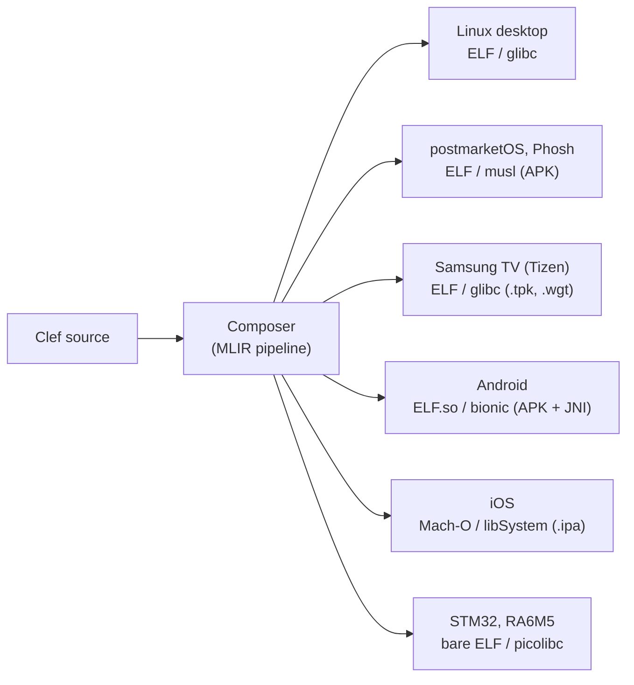

Most developers approaching mobile deployment take the cross-platform framework 'shortcut'. React Native, Flutter, Kotlin Multiplatform, .NET MAUI, Capacitor, and Cordova abstract the platform-native binding surfaces behind a uniform runtime, and the developer's main language stays at the door in exchange for targeting handheld and wearable devices. Native compilation modes (Flutter's AOT, React Native's Hermes, Kotlin/Native, .NET MAUI's NativeAOT) arrived later in each of those solutions as ersatz optimizations on top of the existing runtime compromises, and the contract is what shapes the developer's day-to-day experience.

That contract made sense when the binding surfaces underneath felt inaccessible to anyone outside the platform vendor. They are no longer hidden. Android exposes the NDK with bionic libc, ELF shared objects, and direct JNI access to the kernel beneath the Java framework. iOS apps are Mach-O binaries linked against libSystem and Apple's frameworks; Swift and Objective-C are the conventional languages, and the binary format and ABI are open. Samsung's Tizen applications may be `.tpk`-packaged native ELF with full Wayland compositor access. Linux mobile distributions like postmarketOS expose a standard Linux toolchain and a Wayland session on the handset itself. The native binding surface is, on every modern mobile target, the substrate the platform vendor's own applications run on, and the surface remains available to a compiler that has the intelligence and tooling to target it directly.

In contrast to the mobile runtime ecosystems for mobile, our approach to mobile and embedded programming was built from **the *other* direction**. We embrace the solution space with direct, native compilation across heterogeneous platforms. The compiler architecture and binding tooling were chosen because they support producing native artifacts for various targets without a bulky runtime substrate in between. Mobile, in this view, is one of the targets the native compilation path reaches without a boutique runtime or other intermediary technologies. What follows walks through our early design decisions that reveal our unique approach to truly broad cross-platform native capability. Back end reach such as with LLVM platform tuples serve as the low-level substrate, with two adjacent UI patterns our framework supports today. Along with per-platform packaging, we share our design for a language and framework mechanism that lets one design ethos satisfy multiple platform targets, and the honest costs and sizable benefits the approach carries.



The wrapper around each artifact is what differs across the platform set; the binary inside is what Composer produces from substantially shared Clef source code and deft handling of the compilation back end.

## The Conventional Path and Its Costs

Common cross-platform mobile frameworks each ship a runtime as the foundation of a deployed application. React Native applications carry approximately 25 MB of runtime before any user code, comprising the JavaScript engine (Hermes or JavaScriptCore), the bridge, and the React Native libraries. Flutter ships its Skia rendering engine and the Dart VM, typically 6 to 8 MB compressed in a release build. Kotlin Multiplatform applications retain `kotlin.native.runtime` even on the K/N path. The numbers compound across a device's installed application set; a user with thirty React Native applications installed carries roughly 750 MB of duplicated runtime resident in storage, since each application bundles its own copy. And that's before you get into version pinning and security concerns of those standing dependencies.

Working-set memory follows the same shape. A typical React Native application maintains a 150 to 200 MB working set on iOS; Flutter is somewhat better at 80 to 120 MB. The user experience consequence is direct: cold-started applications feel sluggish even when the application's own compute is small, because the launch cost the user feels is dominated by the runtime's bring-up.

The security surface is the third axis. A JIT-compiled or interpreted runtime presents a substantially larger attack surface than a native binary that contains no runtime. JIT-spray attacks, garbage collector observability side-channels, the general property that any code path can be re-executed under attacker-controlled conditions, and the difficulty of formally auditing a runtime that may itself be patched after deployment, are concerns intrinsic to the runtime model. For applications with cryptographic obligations or constant-time requirements, this is the gating consideration. Any constant-time claim a developer might want is contingent on the runtime's behavior, and the runtime is free to reschedule, recompile, or interpret at moments outside the developer's control.

These costs are the price of the runtime model. The trade is non-trivial: the runtime model accepts these costs in exchange for a uniform deployment story, the promise of a "single language" across platforms, and an iteration loop that includes hot reload. Naming the costs serves a specific purpose. The alternative path has to recover the conveniences the runtime model bundles together, and the alternative path opens properties that exist only on a binary the verifier reasoned about end-to-end. The remainder of this post is about both halves of that exchange.

## The Day-One Design Decision

### MLIR as the intermediate representation

The choice of MLIR as our intermediate representation was made because native compilation across heterogeneous targets requires an IR that can express both high-level language semantics and low-level platform specifics across the lowering pathway. MLIR's dialect system supports progressive lowering to multiple distinct backends without forcing a uniform runtime contract on the upper layers. The Composer pipeline lowers Clef source through nanopass transformations that successively rewrite the program from language-level dialects to platform-specific elaboration, and the final emission is whatever LLVM (or a non-LLVM backend such as JSIR) can target. The choice of MLIR over Java bytecode, WASM, or a .NET CLR-style IL was made specifically to keep the platform space open. ([MLIR's Hello World, lowered to native](https://clef-lang.com/docs/internals/mlir/hello-world-goes-native/) walks the lowering in detail; the rationale for MLIR over the alternatives is in [Why Clef Fits MLIR](https://clef-lang.com/docs/design/compilation/why-clef-fits-mlir/).)

### Nanopass lowering

Our nanopass discipline (many small passes, each preserving a stated invariant) makes per-platform divergence tractable. Different targets share the upper passes and diverge in the lower passes; the divergence is localized to the passes that need it. The tree-shaking pipeline is the most visible payoff. [HelloWayland](https://github.com/FidelityFramework/HelloWayland), our 19-line Clef program that draws an SVG-rendered native window on Wayland, generates approximately 19,500 PSG nodes from its declared transitive dependencies and reduces to approximately 1,450 reachable nodes after tree-shaking. The ratio is roughly 13:1, and the reduction is the direct cause of the resulting binary's compact size and low startup cost. ([Intelligent tree-shaking](https://clef-lang.com/docs/internals/pipeline/intelligent-tree-shaking/), [Nanopass navigation](https://clef-lang.com/docs/internals/concepts/nanopass-navigation/), and [Hyping Hypergraphs](https://clef-lang.com/docs/internals/pipeline/hyping-hypergraphs/) cover the mechanism and the Program Hypergraph counting that produces these numbers.)

### Module signatures with platform-specific implementations

The language-level feature that operationalizes the cross-platform claim is [signature conformance](https://clef-lang.com/spec/draft/namespace-and-module-signatures/#signature-conformance). A worked example with three platform-specific implementations appears in the module signatures section later in this post.

### Memory model designed for arena and region allocation

Our memory model is free of garbage collection by design. Memory regions are explicit and lifetimes are inferred at compile time through Clef's coeffect tracking ([The native memory management design](https://clef-lang.com/docs/design/memory/native-memory-management/) elaborates). On mobile, working-set memory tracks the application's actual data footprint, and the cold-start budget belongs to the application's own initialization and its HAL.

### Coeffect tracking for resource invariants

Constant-time execution, allocation discipline, IO discipline, and syscall discipline are all coeffect properties expressible in Clef's compiler service and verified at design time through our coeffect-aware process ([Context-Aware Compilation](https://clef-lang.com/docs/internals/mlir/context-aware-compilation/) documents the mechanism). These properties are stated as preconditions, checked at compile time, and preserved through every nanopass to the emitted binary. Native compilation is the precondition that makes coeffect claims hold all the way to the loader; on every Fidelity target, mobile included, coeffect-tracked properties reach binary. This is the operational link between the mobile compilation account in this post and the broader verification story in [Cryptographic Certainty](https://clef-lang.com/blog/cryptographic-certainty/ "Cryptographic Certainty").

All five were in place before mobile compilation was a question, and each of them is non-trivial to retrofit into an existing runtime-first framework.

## The Platform Tuple as Compilation Substrate

A platform tuple in our framework is the triple (architecture, libc, packaging). Composer reads the target tuple, selects matching module-signature implementations, routes through the appropriate LLVM backend, and emits an artifact in the platform's native format. The matrix today covers six platform classes:

| Platform                  | Architecture(s)               | Libc                   | Output format | Packaging wrapper       | UI substrate(s)                                  |
|---------------------------|------------------------------|------------------------|---------------|-------------------------|--------------------------------------------------|
| Linux desktop             | x86_64, aarch64              | glibc                  | ELF           | none (or .deb, .rpm)    | Wayland direct, GTK4, system WebView            |
| postmarketOS / Phosh      | aarch64, armv7               | musl                   | ELF           | apk                     | Wayland direct, GTK4, WebKitGTK                 |
| Samsung TV (Tizen)        | aarch64 (some armv7, x86_64) | glibc                  | ELF           | .tpk or .wgt            | Wayland, EFL, system WebKit                      |
| Android                   | aarch64, armv7, x86_64       | bionic                 | ELF (.so)     | APK with JNI shim       | NativeActivity, Compose host, System WebView    |
| iOS                       | aarch64                      | libSystem              | Mach-O        | .ipa with Swift shim    | Metal direct, UIKit / SwiftUI host, WKWebView   |
| STM32, RA6M5              | armv7m, armv8m               | musl static, picolibc  | bare ELF      | bootloader image        | LVGL, framebuffer direct, none                   |

Our framework treats libc as a compilation parameter. The Fidelity.Libc bindings are abstracted through module signatures, and the implementation selected for any given build is the one whose ABI matches the target tuple. The bindings themselves are generated by [Farscape](https://clef-lang.com/blog/farscape/) from each library's headers via clang AST extraction, which means new targets reduce to acquiring the headers and adding a target tuple.

Three binary formats appear. Linux, Android, and most embedded targets emit ELF. Deep-embedded targets emit bare ELF without dynamic linking, linked statically against the chosen runtime. iOS and macOS emit Mach-O. Composer routes ELF and bare-ELF through LLVM's existing backend coverage. The iOS Mach-O path is designed to use a Swift-native-style compilation route. The resulting binary is built to link against libSystem and Apple's framework set, conforming to the ABI Apple's loader expects. Every artifact lands on its platform in the platform's standard format.

The packaging wrapper is platform-specific glue around an unmodified binary. Each wrapper in the matrix is a metadata envelope plus a small amount of platform-native shim code. An APK with a JNI shim is roughly 100 lines of Kotlin plus a manifest. An iOS `.ipa` with a Swift shim is roughly 50 to 150 lines of Swift plus the project file. A Tizen `.tpk` is the manifest, the icon set, the signatures, and the ELF binary. A `.desktop` file for Linux is a key-value text file. The wrapper surrounds the Fidelity-compiled artifact and supplies the platform-specific metadata the loader looks for.

The signing model varies across platforms, and the binary inside each wrapper has the same shape as the binary the platform's own toolchain would produce. Our contribution is to compile to that shape natively, with the same dialect-aware pipeline that compiles to STM32 or to Linux desktop.

## The UI Strategy: Two Reference Implementations

Our framework supports two UI architectures today, each grounded in a published reference implementation. The two are complementary; neither subsumes the other, and the choice between them is operational, not ideological.

### The HelloWayland pattern: native widgets, direct surface

[HelloWayland](https://github.com/FidelityFramework/HelloWayland) is our published reference for the native-widget pattern. The Clef program is 19 lines. It produces an ELF binary that links against `wayland-client`, `libdrm`, `libgbm`, and `resvg`. The UI primitives (`label`, `svgImage`, `withColor`, `App.run`) are Fidelity.UI types compiled directly into the binary, sharing no code with GTK, Qt, or any platform UI toolkit.

The architectural commitment of the HelloWayland pattern is to own the widget toolkit and to draw to the compositor's surface directly. The widget lifecycle and the event loop are Fidelity-owned, and lowering produces direct compositor calls. The advantage is binary footprint, startup latency, and the ability to satisfy our own coeffect constraints (constant-time, allocation-free, syscall-free) end-to-end through the UI code, because the event loop is part of the verified compilation unit instead of a foreign toolkit's runtime.

The pattern maps across the platform matrix. On Linux desktop, the pattern works as published with Wayland. On postmarketOS and Phosh, the same pattern applies with the mobile-specific Wayland protocols added (`wlr-layer-shell` for status bars and notification rolls, `input-method-v2` and `text-input-v3` for on-screen keyboards, `wl_touch` for touch input); the compositor on a Phosh device is a Wayland compositor, and the surface contract is the same. On Samsung TV with Tizen, Wayland surfaces are accessible to `.tpk` native applications, and the pattern works with Tizen's compositor and `.tpk` packaging. On Android, `NativeActivity` (or `GameActivity` for the higher-level API) provides a single full-screen `ANativeWindow` surface, and Fidelity.UI primitives lower to Vulkan or OpenGL ES instead of to Wayland; the host shim is a small Kotlin or Java `Activity`. On iOS, an `MTKView` is hosted by a thin `UIViewController`, and Fidelity.UI primitives lower to Metal; the host shim is a small Swift class. On STM32 and RA6M5, LVGL is the target.

That last case is where this post intersects most directly with [Leveraging Fabulous for Native UI](https://clef-lang.com/blog/leveraging-fabulous-for-native-ui/ "Leveraging Fabulous for Native UI"). The compile-time UI lowering strategy described there (runtime widget diffing becomes compile-time widget resolution, runtime event-handler closures become static function pointers with explicit context) is the same compile-time lowering strategy that produces Metal calls on an iPhone and Vulkan calls on an Android phone, parameterized by the target tuple. The microcontroller and the smartphone are the same kind of compilation problem to Composer.

### The WRENHello pattern: system WebView with native backend

[WRENHello](https://github.com/FidelityFramework/WRENHello) is our published reference for the WREN-stack pattern. The architecture has four parts: a SolidJS frontend compiled via Fable to JavaScript, a native backend compiled via Composer to a platform ELF or Mach-O, [BAREWire](https://clef-lang.com/blog/getting-the-signal-with-barewire/ "Getting the Signal with BAREWire") over localhost WebSocket between the two, and the system WebView as the frontend's host. The HTML and frontend assets are embedded in the binary's `.rodata` section. The resulting binary is 2 to 10 MB depending on frontend assets, compared with Electron's typical 150 to 300 MB.

The pattern is documented in detail in the [WREN Stack](https://clef-lang.com/blog/wren-stack/ "WREN Stack") post. The relevant property for the present discussion is that the boundary between frontend and backend is uniform across all platforms. The `Shared/Protocol.fs` types compile to both Fable (JavaScript for the WebView) and Composer (native machine code for the backend), and the same BAREWire schema describes the wire format in each direction. The platform-specific code is the WebView host integration, which is what each platform's UI substrate is built around anyway.

Each platform's WebView host substitutes for the GTK4 host on Linux: WebKitGTK on Linux desktop and postmarketOS, Tizen's WebKit (with the backend as a separate `.tpk` Service Application and Tizen message ports as the BAREWire transport), Android System WebView (with the backend as a foreground Service and AIDL or local socket carrying BAREWire), and `WKWebView` on iOS (with the backend in-process and `WKScriptMessageHandler` carrying BAREWire, since iOS does not permit user-installable background services). The per-platform mechanics appear in the Per-Platform Walkthrough below.

### When to use which pattern

The choice between the HelloWayland (native) and WRENHello (WebView) patterns is at the UI substrate, not at the language or compiler level. Both patterns share the same backend compilation pipeline and the same BAREWire interchange. The guidance:

Use the **HelloWayland pattern** when the UI is the computational artifact (signal visualization, custom renderer, high resolution instrument panel); when binary footprint is a hard constraint (embedded, kiosk, panel applet); when the application has security-relevant constant-time requirements that conflict with running inside a JavaScript engine; or when the deployment target lacks a system WebView (deep embedded, bare-metal).

Use the **WRENHello pattern** when the UI is form-driven, list-driven, or settings-driven (the majority of business applications); when responsive design across phone, tablet, and desktop is a requirement and CSS handles it without further effort; when the team's UI expertise is web-shaped and SolidJS or a similar reactive framework is the productive tool; or when the deployment target has a system WebView readily available, which these days means every modern mobile target worth targeting.

## Per-Platform Walkthrough

The walkthrough below assumes a technical appetite; its purpose is to differentiate what the platform-specific work actually consists of for each row in the matrix.

### Linux desktop

The Fidelity-compiled ELF is the deliverable, with no further wrapping required. An optional `.desktop` file would provide menu integration for desktop environments; an optional `.deb` or `.rpm` package wraps the binary with distribution-standard metadata for the package manager. This is the baseline against which the other platforms add their packaging overhead.

### postmarketOS and Phosh

Alpine APK packaging. The musl target tuple would be used because Alpine's libc is musl. WebKitGTK is pre-built against musl in Alpine's community repository, and GTK4 is similarly available. Its Phosh app metadata follows the standard Linux desktop conventions with a small set of mobile-specific hints (`X-Purism-FormFactor` for the legacy Phosh stack, mobile-friendly markers for newer revisions). Distribution would be through F-Droid for community-maintained applications or through Alpine's repository system for distribution-curated applications. The postmarketOS device support matrix is wider than commercial Linux phone offerings; our Phosh target aspires to reach every device on which postmarketOS runs Phosh, which today covers several years of mainstream Android hardware.

### Samsung TV (Tizen)

Two packaging paths exist: `.tpk` for native applications and `.wgt` for web applications. A native `.tpk` is a manifest, the Fidelity-compiled ARM ELF binary, the icon set, the resource directory, and the signature, signed with author and distributor certificates. The `.wgt` is the WREN-stack analogue: a packaged frontend with a Tizen manifest. Combining a `.wgt` frontend with a `.tpk` Service Application, communicating through Tizen message ports, gives the full WREN-on-Tizen deployment. Distribution would be through Samsung's Seller Office.

### Android

This is an APK packaging story. The wrapper is a thin Kotlin or Java `Application` and at least one `Activity`. For HelloWayland-pattern applications, the `Activity` is typically a `NativeActivity` (or `GameActivity`) that gives the native code direct access to a single full-screen `ANativeWindow`. For WRENHello-pattern applications, the `Activity` would host an Android System WebView starting a foreground Service that would own the native backend. The Fidelity-compiled binary would be placed at `lib/<abi>/libfidelity.so` inside the APK, compiled for `arm64-v8a`, `armeabi-v7a`, and `x86_64` as needed for the target device set. The bionic libc target tuple applies, and Farscape would generate the JNI bridge stubs from the platform's `jni.h` headers. Signing uses any Android keystore the developer controls.

### iOS

Our wrapper would use a Swift `AppDelegate` and at least one `UIViewController`. For HelloWayland-pattern applications, the controller hosts an `MTKView` and forwards lifecycle events to Fidelity-compiled callbacks. For WRENHello-pattern applications, the controller hosts a `WKWebView` and registers `WKScriptMessageHandler` instances that exchange BAREWire payloads with the in-process native backend. The Fidelity-compiled binary would be a Swift-native-compatible Mach-O for `arm64`. The compilation path is designed to match what Apple's own toolchain produces. The artifact links against libSystem and the framework set declared in the project (UIKit, Metal, QuartzCore, Foundation, and so on).

### Embedded (STM32, RA6M5)

The artifact is a flashable image. It is produced by linking statically against the runtime the target tolerates and emitting raw ELF for the bootloader. The runtime selection is per-target. The libc surface is musl-static or picolibc, depending on flash budget. Vendor HAL bindings are brought in through Farscape from each vendor's headers: CMSIS for Cortex-M cores, Renesas FSP for the RA family, ST's HAL for STM32. The choice of libc and HAL is dictated by the flash budget, the peripheral set, and the runtime requirements ([Fidelity on STM32](https://clef-lang.com/docs/internals/hardware/fidelity-on-stm32/) walks the constraints).

## The Module Signatures That Make It Work

Cross-platform native compilation in our framework follows directly from a language-level mechanism: writing a single Clef module signature for a platform-dependent capability, binding that signature to multiple implementations, and letting Composer select the implementation matching the target tuple at compile time. The mechanism is the [signature conformance](https://clef-lang.com/spec/draft/namespace-and-module-signatures/#signature-conformance) feature in the Clef specification.

A concrete example illustrates. Our Fidelity.UI native surface abstraction declares its contract once:

```fsharp
// Fidelity.UI.Native.fsi (signature)
namespace Fidelity.UI.Native

module Surface =
    type SurfaceHandle
    type SurfaceConfig

    val create  : config: SurfaceConfig -> SurfaceHandle
    val present : handle: SurfaceHandle -> unit
    val destroy : handle: SurfaceHandle -> unit
```

The platform-specific implementations satisfy that contract. The Wayland implementation is used on Linux desktop, postmarketOS, and Tizen:

```fsharp
// Fidelity.UI.Native.Wayland.fs (Linux, Phosh, Tizen)
namespace Fidelity.UI.Native

module Surface =
    open Bindings.WaylandClient
    open Bindings.Drm
    open Bindings.Gbm

    type SurfaceHandle =
        { Display: wl_display
          Surface: wl_surface
          Buffer:  wl_buffer }
    type SurfaceConfig =
        { Width: int; Height: int; Format: uint32 }

    let create  config = ...   // wl_compositor_create_surface, gbm_bo_create
    let present handle = ...   // wl_surface_attach, wl_surface_commit
    let destroy handle = ...   // wl_surface_destroy, gbm_bo_destroy
```

The Metal implementation is used on iOS:

```fsharp
// Fidelity.UI.Native.Metal.fs (iOS)
namespace Fidelity.UI.Native

module Surface =
    open Bindings.Metal
    open Bindings.QuartzCore

    type SurfaceHandle =
        { Layer:    CAMetalLayer
          Drawable: CAMetalDrawable
          Device:   MTLDevice }
    type SurfaceConfig =
        { Width: int; Height: int; PixelFormat: MTLPixelFormat }

    let create  config = ...   // CAMetalLayer alloc, drawable acquisition
    let present handle = ...   // currentDrawable.present
    let destroy handle = ...   // layer release, drawable release
```

The Vulkan implementation is used on Android:

```fsharp
// Fidelity.UI.Native.Vulkan.fs (Android)
namespace Fidelity.UI.Native

module Surface =
    open Bindings.Vulkan
    open Bindings.AndroidNative

    type SurfaceHandle =
        { Instance:  VkInstance
          Surface:   VkSurfaceKHR
          Swapchain: VkSwapchainKHR }
    type SurfaceConfig =
        { Width: int; Height: int; Format: VkFormat }

    let create  config = ...   // vkCreateAndroidSurfaceKHR
    let present handle = ...   // vkQueuePresentKHR
    let destroy handle = ...   // vkDestroySurfaceKHR
```

The consuming code is the same across platforms:

```fsharp
open Fidelity.UI.Native

let runUi config =
    let surface = Surface.create config
    // application rendering logic using Surface.present
    Surface.destroy surface
```

Composer selects the implementation by target tuple. When the tuple specifies `aarch64-apple-ios`, the Metal implementation is selected. When it specifies `aarch64-linux-android`, the Vulkan implementation is selected. When it specifies `aarch64-unknown-linux-musl` for postmarketOS or `aarch64-tizen-linux-gnu` for Samsung TV, the Wayland implementation is selected. The conformance check runs at compile time and verifies that each implementation satisfies the signature's type and arity contract.

The arity property quoted from the specification is load-bearing: "Arities in a signature must be equal to or shorter than the corresponding arities in an implementation, and the prefix must match... function arity affects compilation. Clef functions with known arity compile to direct function calls, while function values require closure allocation. Signatures must contain enough information to reveal the desired arity for efficient native code generation." The consequence is that the cross-platform substitution does not introduce virtual dispatch, closure allocation, or runtime indirection; every call resolves to a direct platform-specific function call in the emitted binary.

Signature-and-structure separation is a well-established ML-family mechanism, in place since Standard ML in the 1980s and exercised at scale by OCaml's functor system for decades. What our framework adds is the use of that mechanism as the load-bearing selector for platform-specific lowering, with the target tuple as the selection key, and the requirement that the conformance check produce direct native calls in the lowered IR.

## Honest Tradeoffs

The architectural account above presents the cross-platform native path in its most direct form. The path has measurable costs, and an honest treatment must name them. The structure of this section follows the template established by the "What the Type System Catches and What It Does Not" section in [Cryptographic Certainty](https://clef-lang.com/blog/cryptographic-certainty/ "Cryptographic Certainty").

### Per-platform shim code is real and not zero

A WREN-style application needs platform-specific WebView host integration: Kotlin or Java on Android, Swift on iOS, GTK4 with WebKitGTK on Linux, a Tizen manifest with message-port handling on Tizen. A HelloWayland-style application needs the equivalent surface host: a `NativeActivity` on Android, a `UIViewController` hosting `MTKView` on iOS, a Wayland display connection on Linux. The shim is small, typically 50 to 200 lines per platform for a representative application, and it is not free. 

### iOS specifically requires macOS for the build

Apple owns this constraint. The SDK requires Xcode, and Xcode requires macOS. A Fidelity-on-iOS build pipeline needs Mac hardware or a Mac cloud build service (MacStadium, GitHub Actions macOS runners, or an equivalent). The dependency is limited to the iOS target; every other target in the matrix builds on Linux or Windows. This is the only hard infrastructure constraint our framework inherits from a platform vendor, and it is durable because Apple owns the toolchain back end.

### No hot-reload story comparable to Flutter's

Native compilation has real trade-offs. The iteration loop is compile, deploy, run. For UI iteration specifically, the WREN-stack pattern partially recovers the fast loop by hot-reloading the frontend with Vite or a similar tool while the backend runs on a "cold" reboot cycle. This is most of what Flutter's hot reload provides in practice for UI development. For pure-native HelloWayland-pattern work, the iteration loop is the compile-and-run loop, faster than C++ on the same hardware because Composer's incremental compilation is fast, and slower than a JavaScript runtime's hot reload. The honest characterization is that the framework offers incremental native rebuilds, and we anticipate that the cycle for backend work will measure in seconds, not the sub-second feedback an HMR engine provides. This is something we'll look to improve as time and technology progress.

### App Store review may be more cautious on first submission

App Store review for certain targets may be slower or more opinionated for a novel binary architecture. Fidelity-compiled Mach-O is structurally identical to Swift Mach-O at the loader level, but the metadata and the symbol table may be visibly different. We anticipate some additional review time on the first submissions that uses our framework. Subsequent submissions within the same application's lifecycle should pass at normal review pace once the reviewers have the application's pattern on file.

We see these costs as bounded, and are acceptable initial costs of the choices we've made. The benefits compound across the platform matrix and across the verification story; the costs scale with the number of platforms targeted and have a logarithmic scaling factor that will eventually level off.

## Strategic Implications

### Device fleet longevity

The working-set numbers from the Conventional Path section are not abstract. For a productivity application, the gap between a small native footprint and a 150 MB runtime is the difference between feeling responsive and feeling sluggish. For a credentialing application, it is the difference between sub-second handshake completion and a five-second cold-start handshake. Device fleet longevity, in the field, is dominated by working-memory pressure. Reducing that pressure extends the useful life of the install base.

### Security surface

A native binary with no JIT, no garbage collector, no interpreter, and a small dependency set is a tractable target for formal-methods auditing. For our broader commercial thesis, this property is load-bearing. A [QuantumCredential](https://speakez.tech/portfolio/quantumcredential/) client running natively on an iPhone preserves the constant-time and side-channel-resistance properties that our coeffect verifier reasoned about, because the binary on the device is the binary the verifier saw.  Constant-time is a pillar of any verification stack, and it depends on the executing binary matching the audited code.

### Cross-cutting verification across all targets

The four-tier verification architecture from [Cryptographic Certainty](https://clef-lang.com/blog/cryptographic-certainty/ "Cryptographic Certainty") rides on the same substrate as the coeffect tracking described earlier: Tier 1 structural correctness, Tier 2 range and inequality reasoning over QF_LIA and QF_BV, Tier 3 rejection-sampling termination through library-instantiated probabilistic lemmas, and Tier 4 relational reasoning checked against a Rocq-proved rule library. Every tier emits to the same Composer pipeline, and the pipeline emits to every row in the platform matrix. Mobile inherits the full verifier reach because mobile is a row.

### Where mobile lands on this roadmap

Linux desktop and embedded targets are working today, and the HelloWayland UI is exhibit A in that arc. Linux mobile (primarily postmarketOS) and even Tizen TV are scoped and tractable additions to the target tuple matrix. the `libc` and packaging differences are real, and the architectural work is within reach. Android and iOS are the next tier up in platform-specific shim tooling; the architecture supports them inherently, and the Composer pipeline is built to produce the right output formats. The path forward is tooling and certificate logistics, with the compiler set up to provide full coverage.

In the Fidelity Framework, native goes where Composer's IR reaches, and that reach was part of the design from the start.
