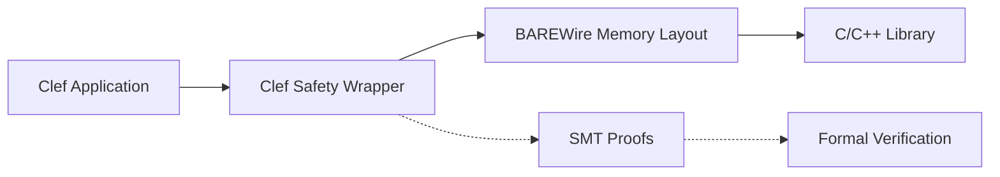

> This article was originally published on the
> [SpeakEZ Technologies blog](https://speakez.tech) as part of our early
> design work on the Fidelity Framework. It has been updated to reflect
> the Clef language naming and current project structure.

The cybersecurity landscape has shifted dramatically in recent years, with memory safety vulnerabilities accounting for approximately 70% of critical security issues in systems software. This reality has prompted governments and industries to mandate transitions to memory-safe languages for critical infrastructure. Yet the economics of wholesale rewrites are daunting: decades of refined C and C++ code represent trillions of dollars in intellectual property and domain expertise. What if, instead of rewriting everything, we could wrap existing code in provably safe interfaces?

## The Architectural Vision

The Fidelity Framework enables a different approach to the memory safety challenge. Rather than treating existing C/C++ code as technical debt to be eliminated, we can view it as a valuable asset to be protected. Our architecture creates thin, verifiable safety wrappers around native libraries, providing memory safety guarantees without touching the underlying implementation. Today, Farscape already generates `[<FidelityExtern>]` attributed [Clef](https://clef-lang.com) binding stubs (Layer 1) and idiomatic safety wrappers (Layer 2) from C headers, forming the foundation for this vision.

Consider this architectural pattern:



The wrapper serves multiple architectural purposes. First, it provides type-safe interfaces that make illegal states un-representable. Second, it uses BAREWire's compile-time memory layout verification to ensure all data crossing the language boundary follows strict safety rules. Third, compiler pipeline can carry formal proofs of correctness using SMT verification attributes.

## Shadow APIs for Drop-in Safety

One of the most powerful aspects of the Fidelity Framework's approach is the concept of "shadow APIs" that maintain exact compatibility with existing C interfaces while adding safety guarantees. This means organizations can replace unsafe libraries without changing a single line of calling code.

C and C++ developers are intimately familiar with functions like this:

```c
// Traditional C API - multiple safety hazards
int process_data(char* buffer, int size, char* output, int output_size);

// Caller must ensure:
// - buffer is not NULL
// - size accurately reflects buffer length
// - output buffer is large enough
// - output_size is correct
```

The Fidelity shadow API preserves this exact interface:

```fsharp
// Clef shadow API - same name, same signature, added safety
[<DllExport("process_data")>]
[<BAREWire.MemoryLayout>]
let process_data (buffer: nativeptr<byte>) (size: int) 
                 (output: nativeptr<byte>) (output_size: int) : int =
    // Safety checks that the original C code probably should have had
    if buffer = NativePtr.nullPtr || output = NativePtr.nullPtr then
        -1  // Same error code as original API
    elif size < 0 || output_size < 0 then
        -1  
    else
        // Create safe memory views for the actual operation
        let inputSpan = Span<byte>(buffer |> NativePtr.toVoidPtr, size)
        let outputSpan = Span<byte>(output |> NativePtr.toVoidPtr, output_size)
        
        // Call the original C implementation through safe wrappers
        Native.process_data_impl(inputSpan, outputSpan)
```

It's worthwhile to note that C code calling `process_data` continues to work exactly as before. The function name is identical, the parameters are identical, and even the error codes remain the same. But now the function includes safety checks that prevent common vulnerabilities like null pointer dereferences and buffer overruns.

This shadow API approach extends to complex scenarios involving callbacks, structures, and even global variables. Every aspect of the original C API can be preserved while adding a layer of safety that operates invisibly beneath the surface. It's like replacing the brakes of a car with more reliable pads and rotors while keeping the same pedals and steering wheel - the driver's experience remains unchanged, but the vehicle becomes much safer to operate.

## Zero-Cost Safety Abstractions

A critical aspect of this architecture is that safety comes without runtime overhead. The Clef wrapper compiles away to nothing in release builds, leaving only the safety invariants enforced at compile time. This is possible because:

1. **BAREWire** generates exact memory layouts matching C structures
2. **Composer** compiles Clef to native code without runtime overhead
3. **Tree shaking** removes any wrapper code not directly involved in the safety transformation

What makes Clef particularly powerful for this approach is its sophisticated handling of type information throughout the compilation pipeline. Unlike C++ templates that generate new code for each type instantiation, or Rust's monomorphization that can lead to code bloat, Clef uses a more nuanced approach. The type information flows through the entire compilation pipeline - from Clef through MLIR to LLVM - where it enables powerful optimizations and safety verifications. Only at the final stage, when generating machine code, does type erasure occur.

This design is crucial for safety wrappers. Throughout the MLIR transformations, type information enables sophisticated analyses that verify memory safety properties. LLVM's typed intermediate representation then uses this information for aggressive optimizations that would be impossible with untyped code. The types guide the compiler in eliminating bounds checks that can be proven unnecessary, optimizing memory access patterns, and ensuring calling conventions match exactly. Yet none of this type information appears in the final binary - it has served its purpose and vanishes, leaving behind only the optimized machine code.

For C and C++ developers accustomed to choosing between void pointers (unsafe but efficient) and templates (safe but potentially bloated), this approach offers something genuinely different. Your generic safety wrappers don't multiply into specialized versions, yet the compiler has full type information to verify safety and optimize aggressively. The compiled code operates directly on memory without any type tags, virtual tables, or runtime type information.

The result is a binary that runs at a substantially similar speed as the original C/C++ code but with compile-time safety guarantees that would be impractical to achieve in the original language.

## Formal Verification Potential

The architecture's true power emerges when we consider formal verification. By annotating our shadow APIs with SMT proof obligations, we can create mathematically verified safety properties while maintaining exact API compatibility:

```fsharp
[<DllExport("array_access")>]
[<SMT Requires("index < arr.Length")>]
[<SMT Ensures("Option.isSome result ==> Option.get result = arr.Data.[int index]")>]
[<SMT Ensures("Option.isNone result ==> index >= arr.Length")>]
let array_access (arr: nativeptr<byte>) (arr_len: uint32) (index: uint32) : int =
    // Shadow API maintains C convention: -1 for error, value for success
    if arr = NativePtr.nullPtr || index >= arr_len then
        -1
    else
        int (NativePtr.get arr (int index))

// More complex verification for buffer operations matching memcpy signature
[<DllExport("memcpy")>]
[<SMT Requires("dst <> null && src <> null")>]
[<SMT Requires("n >= 0")>]
[<SMT Ensures("result = dst")>]
[<SMT Ensures("forall i in 0..n-1. (NativePtr.get dst i) = (NativePtr.get src i)")>]
let memcpy (dst: nativeptr<byte>) (src: nativeptr<byte>) (n: unativeint) : nativeptr<byte> =
    if dst = NativePtr.nullPtr || src = NativePtr.nullPtr then
        NativePtr.nullPtr
    else
        let srcSpan = Span<byte>(src |> NativePtr.toVoidPtr, int n)
        let dstSpan = Span<byte>(dst |> NativePtr.toVoidPtr, int n)
        srcSpan.CopyTo(dstSpan)
        dst  // Return dst to match standard memcpy
```

For mission-critical systems in aerospace, medical devices, or financial infrastructure, these proofs provide a level of assurance that goes beyond traditional testing. The wrapper doesn't just claim to be safe; it comes with machine-checkable proofs of its safety properties, all while maintaining complete compatibility with existing C APIs.

## Economic Implications

This architectural approach opens significant economic opportunities. Organizations with large C/C++ codebases face an impossible choice: accept the security risks of memory-unsafe code or spend billions on rewrites that might introduce new bugs. Safety wrappers offer a third path: incremental safety improvements that preserve existing investments.

> Rather than treating existing C/C++ code as technical debt to be eliminated, we can view it as a valuable asset to be protected.

The cost model is compelling. A safety wrapper might be 1% the size of the library it protects, yet it provides 100% of the safety guarantees needed for certification. For a million-line C++ trading system, a few thousand lines of Clef wrapper code could mean the difference between regulatory compliance and obsolescence.

## Looking Forward

As we continue developing the Fidelity Framework, the safety wrapper architecture represents more than just a technical solution. It's a pragmatic recognition that the future of systems programming isn't about choosing sides in the safety versus performance debate. Instead, it's about building bridges between the valuable code we have and the safety guarantees we need.

The combination of Clef's type safety, BAREWire's memory layout verification, and Composer's zero-overhead compilation creates a unique capability: the ability to retrofit safety onto existing systems without significant rewrites or major performance penalties. As memory safety requirements become mandatory across critical infrastructure, this architectural pattern could become the standard approach for protecting our vast investment in C and C++ code while meeting modern safety requirements.

For developers and organizations looking ahead, the message is clear: your existing code isn't obsolete, it just needs protection. The Fidelity Framework aims to provide that protection through an architecture that respects both the past and the future of systems programming.
