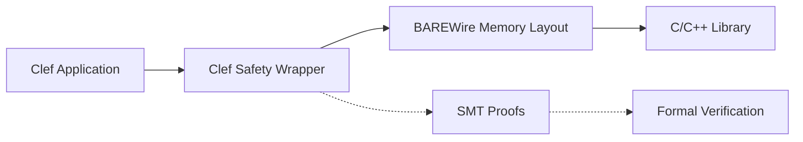

The cybersecurity landscape has shifted dramatically in recent years, with memory safety vulnerabilities accounting for approximately 70% of critical security issues in systems software. This reality has prompted governments and industries to mandate transitions to memory-safe languages for critical infrastructure. Yet the economics of wholesale rewrites are daunting: decades of refined C and C++ code represent trillions of dollars in intellectual property and domain expertise. What if, instead of rewriting everything, we could wrap existing code in provably safe interfaces?

## The Architectural Vision

Our Fidelity framework takes a different approach to the memory safety challenge. Rather than treating existing C and C++ code as technical debt to be eliminated, we can view it as a valuable asset to be protected. The architecture creates thin, verifiable safety wrappers around native libraries, adding memory safety at the boundary without touching the underlying implementation. Today, Farscape already generates `[<FidelityExtern>]` attributed [Clef](https://clef-lang.com) binding stubs (Layer 1) and idiomatic safety wrappers (Layer 2) from C headers. That generation gives this design its foundation.

Consider this architectural pattern:


```mermaid
graph LR
    APP[Clef Application] --> WRAPPER[Clef Safety Wrapper]
    WRAPPER --> BARE[BAREWire Memory Layout]
    BARE --> CLIB[C/C++ Library]
    
    WRAPPER -.-> PROOF[SMT Proofs]
    PROOF -.-> VERIFY[Formal Verification]
    
```

The wrapper serves several purposes. First, it provides type-safe interfaces that make illegal states un-representable. Second, it uses our BAREWire compile-time memory layout verification to ensure all data crossing the language boundary follows strict safety rules. Third, the compiler pipeline can carry formal proofs of correctness using SMT verification attributes.

## Shadow APIs for Drop-in Safety

A central part of our approach is the concept of "shadow APIs" that maintain exact compatibility with existing C interfaces while adding safety checks at the boundary. An organization can replace an unsafe library without changing a single line of calling code.

C and C++ developers are intimately familiar with functions like this:

```c
// Traditional C API - multiple safety hazards
int process_data(char* buffer, int size, char* output, int output_size);

// Caller must ensure:
// - buffer is not NULL
// - size accurately reflects buffer length
// - output buffer is large enough
// - output_size is correct
```

The Fidelity shadow API preserves this exact interface:

```fsharp
// Clef shadow API - same name, same signature, added safety
[<DllExport("process_data")>]
[<BAREWire.MemoryLayout>]
let process_data (buffer: nativeptr<byte>) (size: int) 
                 (output: nativeptr<byte>) (output_size: int) : int =
    // Safety checks that the original C code probably should have had
    if buffer = NativePtr.nullPtr || output = NativePtr.nullPtr then
        -1  // Same error code as original API
    elif size < 0 || output_size < 0 then
        -1  
    else
        // Create safe memory views for the actual operation
        let inputSpan = Span<byte>(buffer |> NativePtr.toVoidPtr, size)
        let outputSpan = Span<byte>(output |> NativePtr.toVoidPtr, output_size)
        
        // Call the original C implementation through safe wrappers
        Native.process_data_impl(inputSpan, outputSpan)
```

It's worthwhile to note that C code calling `process_data` continues to work exactly as before. The function name is identical, the parameters are identical, and even the error codes remain the same. But now the function includes safety checks that prevent common vulnerabilities like null pointer dereferences and buffer overruns.

This shadow API approach extends to scenarios involving callbacks, structures, and even global variables. Every aspect of the original C API can be preserved while adding a layer of safety beneath the surface. It is like replacing the brakes of a car with more reliable pads and rotors while keeping the same pedals and steering wheel. The driver's experience stays the same, and the vehicle becomes safer to operate.

## Zero-Cost Safety Abstractions

A central goal of this architecture is that safety should come without runtime overhead. As we conceive it, the Clef wrapper compiles away to nothing in release builds, leaving only the safety invariants enforced at compile time. The design rests on three pieces:

1. **BAREWire** generates exact memory layouts matching C structures
2. **Composer** compiles Clef to native code without runtime overhead
3. **Tree shaking** removes any wrapper code not directly involved in the safety transformation

What suits Clef to this approach is how it carries type information through the compilation pipeline. C++ templates generate new code for each type instantiation, and Rust's monomorphization can lead to code bloat. Clef takes a different route. The type information flows through the entire compilation pipeline, from Clef through MLIR to LLVM, where it drives optimizations and safety verifications. Only at the final stage, when generating machine code, does type erasure occur.

This design matters for safety wrappers. Throughout the MLIR transformations, type information drives analyses that verify memory safety properties. LLVM's typed intermediate representation then uses this information for optimizations that would not be available on untyped code. The types guide the compiler in eliminating bounds checks that can be proven unnecessary, optimizing memory access patterns, and matching calling conventions exactly. None of this type information appears in the final binary. It has served its purpose by the time the compiler emits machine code, leaving behind only the optimized result.

For C and C++ developers accustomed to choosing between void pointers (unsafe but efficient) and templates (safe but potentially bloated), this approach offers something genuinely different. Your generic safety wrappers don't multiply into specialized versions, yet the compiler has full type information to verify safety and optimize aggressively. The compiled code operates directly on memory without any type tags, virtual tables, or runtime type information.

The result we are designing toward is a binary that runs at a substantially similar speed to the original C and C++ code, carrying compile-time safety guarantees that would be impractical to achieve in the original language.

## Formal Verification Potential

The architecture reaches further when we consider formal verification. By annotating a shadow API with SMT proof obligations, we can attach machine-checkable safety properties to it while holding exact API compatibility:

```fsharp
[<DllExport("array_access")>]
[<SMT Requires("arr <> null")>]
[<SMT Ensures("index < arr_len ==> result = int (NativePtr.get arr (int index))")>]
[<SMT Ensures("index >= arr_len ==> result = -1")>]
let array_access (arr: nativeptr<byte>) (arr_len: uint32) (index: uint32) : int =
    // C convention: -1 for error, value for success
    if arr = NativePtr.nullPtr || index >= arr_len then
        -1
    else
        int (NativePtr.get arr (int index))

[<DllExport("memcpy")>]
[<SMT Requires("dst <> null && src <> null")>]
[<SMT Requires("n >= 0")>]
[<SMT Ensures("result = dst")>]
[<SMT Ensures("forall i in 0..n-1. (NativePtr.get dst i) = (NativePtr.get src i)")>]
let memcpy (dst: nativeptr<byte>) (src: nativeptr<byte>) (n: unativeint) : nativeptr<byte> =
    if dst = NativePtr.nullPtr || src = NativePtr.nullPtr then
        NativePtr.nullPtr
    else
        let srcSpan = Span<byte>(src |> NativePtr.toVoidPtr, int n)
        let dstSpan = Span<byte>(dst |> NativePtr.toVoidPtr, int n)
        srcSpan.CopyTo(dstSpan)
        dst  // Return dst to match standard memcpy
```

For mission-critical systems in aerospace, medical devices, or financial infrastructure, these proofs provide a level of assurance that goes beyond traditional testing. The wrapper doesn't just claim to be safe; it comes with machine-checkable proofs of its safety properties, all while maintaining complete compatibility with existing C APIs.

## Economic Implications

This architectural approach opens significant economic opportunities. Organizations with large C/C++ codebases face an impossible choice: accept the security risks of memory-unsafe code or spend billions on rewrites that might introduce new bugs. Safety wrappers offer a third path: incremental safety improvements that preserve existing investments.

> Rather than treating existing C/C++ code as technical debt to be eliminated, we can view it as a valuable asset to be protected.

The cost model favors this path. A safety wrapper might be 1% the size of the library it protects, yet it provides 100% of the safety guarantees needed for certification. For a million-line C++ trading system, a few thousand lines of Clef wrapper code could mean the difference between regulatory compliance and obsolescence.

## Looking Forward

We see the safety wrapper architecture as a way to keep the C and C++ code an organization already trusts while adding the memory safety its regulators now require. The trillions of dollars of refined native code in service today does not have to be rewritten to be protected.

Three pieces of our framework carry this design. Clef's type safety makes illegal states un-representable at the boundary. Our BAREWire layout verification fixes the memory layout that crosses it. Composer is meant to compile the wrapper away in release builds. Together they let us retrofit safety onto an existing system without a wholesale rewrite or a large performance penalty. As memory safety requirements become mandatory across critical infrastructure, we expect this pattern to be one of the practical paths for protecting the investment in C and C++ while meeting the new requirements.

We have found no other representative implementations of this wrapping approach in the standing literature we have reviewed. Farscape already generates the binding and wrapper layers today, and the SMT-annotated shadow APIs are the direction we will keep building toward as the rest of the framework comes into place.
