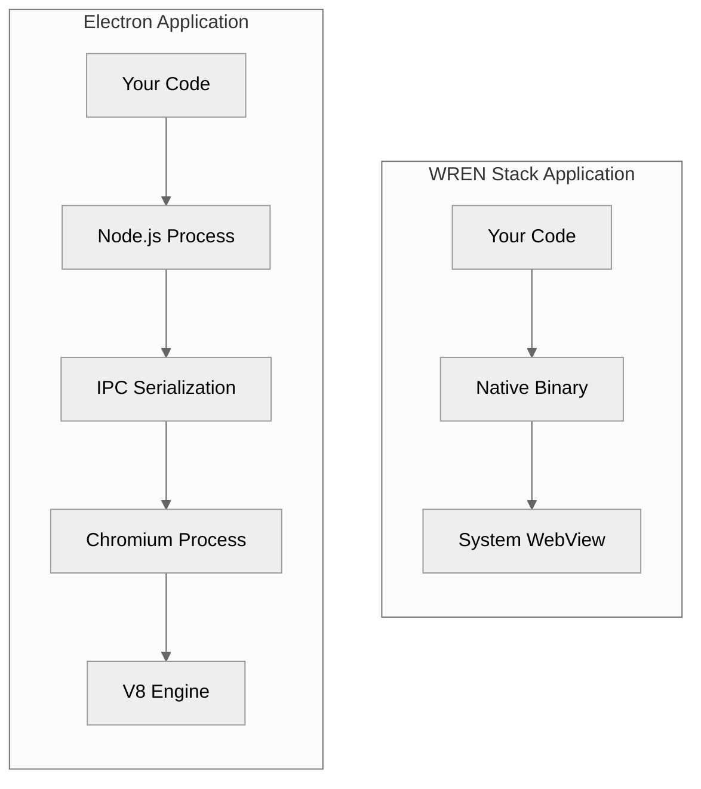
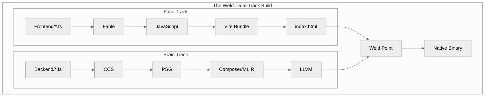
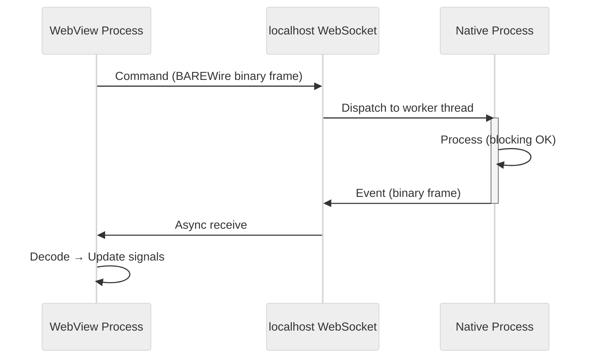

> This article was originally published on the
> [SpeakEZ Technologies blog](https://speakez.tech) as part of our early
> design work on the Fidelity Framework. It has been updated to reflect
> the Clef language naming and current project structure.

There's a particular kind of frustration that comes from watching a progress bar crawl across your screen while an Electron app loads its bundled Chromium instance. Somewhere in those three-plus seconds of initialization, a complete web browser is waking up, allocating its 200 megabytes of baseline memory, spawning its constellation of processes, all so you can run what amounts to a glorified file picker. The frustration isn't about the seconds themselves. It's about knowing that the underlying operation, reading a directory and displaying a list, should take microseconds, not seconds.

This mismatch between what desktop applications *could* be and what they've become isn't a new complaint. Developers have grumbled about Electron's weight since it first appeared. But the grumbling rarely produces alternatives. The web development ecosystem is simply too good: DaisyUI's component library, Tailwind's utility classes, SolidJS's fine-grained reactivity. These tools represent decades of collective innovation in user interface design. Abandoning them for Qt or GTK means abandoning that innovation, trading the expressiveness of modern CSS for the rigidity of native widget toolkits.

Here we offer a new hybrid concept - the WREN Stack

- **W** ebView  
- **R** eactive  
- **E** mbedded  
- **N** ative

---

## The False Dichotomy

The conventional wisdom often only presents two paths for desktop development. You can have web technologies, but you pay for the convenience with Electron's bloat. Or you can have native performance, close to the metal, but often developers are forced to write imperative widget code that hasn't evolved much since the 1990s. The up-front burden is non-trivial and the maintenance of that crufty surface only grows as time marches on.

This framing assumes that web technologies require a web runtime. That if you want CSS and JavaScript reactivity, the assumption is that you must bundle a browser engine and accept its overhead. But the assumption is wrong. Every modern desktop operating system already ships with a web rendering engine. macOS has WKWebView. Windows has WebView2. Linux has WebKitGTK. These aren't foreign components that need to be bundled; they're already present, already maintained, already consuming zero additional memory until your application needs them.

The realization that unlocks the WREN Stack is simple: use the system's WebView as a rendering surface, but run application logic as native code compiled by Composer. The WebView displays your Partas.Solid components, styled with DaisyUI, rendered with the full power of a modern browser engine. But the "backend" that drives those components isn't JavaScript running in Node.js. It's [Clef](https://clef-lang.com) compiled to native machine code, communicating through typed binary messages over a local WebSocket connection.

The distinction matters. In Electron, your application bundles an entire Chromium browser: hundreds of megabytes of code that duplicates what the operating system already provides. A WREN Stack application uses the *system's* WebView, already installed, already maintained, already sharing memory with other applications that use it. The binary footprint drops from hundreds of megabytes to single digits. And while the WebView does run in a separate process (all modern WebViews use multi-process architectures for security and stability[^webview-processes]), the communication between your native logic and the UI uses BAREWire over localhost WebSockets, the same efficient binary protocol pattern that works across any IPC boundary.



## The Acronym

The acronym names what the architecture achieves: **W**ebview as the rendering surface, **R**eactive UI through Partas.Solid, **E**mbedded assets frozen into the binary's read-only memory, and **N**ative Clef logic compiled by Composer. Like its namesake, the small bird known for its speed and resilience, WREN Stack applications are designed to be lightweight and quick to start.

The embedded assets deserve particular attention. In a traditional web application, the browser fetches HTML, CSS, and JavaScript from a server or the filesystem. These fetches take time. The page appears white while resources load. Scripts parse and execute. Only then does the interface appear.

The WREN Stack eliminates this startup latency entirely. During the build process, Composer triggers Fable to compile your Partas.Solid components to JavaScript, then runs Vite to bundle everything into a single HTML string. The CSS is purged to only the Tailwind classes you actually use. Images, icons, and fonts are inlined as Base64 data URLs, frozen directly into the markup. The result is a completely self-contained HTML document with no external references.

This string becomes a Clef literal, and Composer compiles it directly into the `.rodata` section of the native binary. When your application starts, `WebView.setHtml` passes a pointer to read-only memory. The UI doesn't load from anywhere; it wakes up from RAM. Every image, every icon, every font glyph is already present in the binary. There are no fetches, no cache misses, no 404s.

The practical effect is immediate appearance. Users click your application icon and see the interface without delay. There's no white flash, no loading spinner, no visible initialization. The UI appears as fast as the operating system can composite a window.

## Two Perspectives, One Binary

The most significant conceptual shift in the WREN Stack is nuancing the "frontend/backend" concept. In web development, frontend and backend are easy-to-distinguish separate deployments, separate processes, often separate systems. They communicate through highly layered network protocols. This separation makes sense when the frontend runs in a user's browser and the backend runs on a server.

A unified desktop application experience doesn't have thes constraints. The user's machine runs everything. And yet most desktop frameworks preserve a 'hard' separation, often because they evolved from web frameworks (like Electron) or because they assume network-based architectures by default. Here we're keeping some of the design-time conventions, for clarity, and in other ways we're doing something truly unique that unifies "the two worlds" of frontend and backend.

The WREN Stack maintains two perspectives at design time to create a single executable. Your Partas.Solid code, compiled by Fable, defines the visual interface and its reactive behavior. Your Composer code defines the native logic that responds to user actions, interacts with the filesystem, and communicates with hardware. Both compile to the same binary. The "communication" between them is message passing through a local WebSocket, but the overhead is minimal: binary frames over localhost, decoded directly into typed structures on both sides. No JSON parsing, no string escaping, no schema negotiation. Just bytes that both sides understand at compile time.

The shared vocabulary lives in a `Shared` project that both sides reference. You define your message types once, in ordinary Clef discriminated unions and records. Fable compiles these types to each component's representations. Composer compiles them to native structs. BAREWire ensures binary compatibility between the two representations. When the UI sends a `LoadFile` command, it's sending the same bytes that the native handler will interpret as a `LoadFile` command. There's no string parsing, no field name matching, no runtime type checking.

```fsharp
// This file is compiled by both Fable and Composer
type Command =
    | LoadFile of path: string
    | SaveFile of path: string * content: byte[]
    | QueryHardware

type Event =
    | FileLoaded of content: byte[] * metadata: FileMetadata
    | FileSaved of success: bool
    | HardwareStatus of status: HardwareInfo
```

The type definitions look like ordinary Clef because they ***are*** idiomatic. The magic happens at compile time. Fable produces JavaScript with codecs for these types. Composer produces native code with matching codecs. When the UI sends a command, it's sending bytes that the native handler decodes directly; no JSON parsing, no runtime schema validation. How those bytes travel between the two worlds is the "nervous system" we'll examine shortly. The schema itself is simply the source code, shared between both perspectives.

## The Weld

Composer's build process for WREN Stack projects coordinates two parallel tracks. The first track runs Fable on your frontend project, producing JavaScript, then runs Vite to bundle the result with your CSS and any static assets. The second track runs the Composer pipeline on your backend project, producing MLIR, then LLVM IR, then a native object file.

The tracks merge in what we call the "weld." Composer reads the bundled `index.html` produced by Vite and embeds it as a string literal in the native code. This isn't a file read at runtime; it's a compile-time inclusion, like `#include` in C but for complete web assets. Composer places the string in the `.rodata` section alongside other static data. The linker produces a single executable containing both the native logic and the embedded UI.



The result is a standalone binary with no runtime dependencies beyond the system WebView. You can copy it to another machine and run it directly. There's no installer, no framework prerequisites, no `node_modules` directory that somehow grew to 500 megabytes. Just an executable.

## The Nervous System

Communication between the UI and native logic happens through BAREWire over a local WebSocket connection. When the application starts, the native code spawns a WebSocket server bound to localhost. The JavaScript side connects with the standard `WebSocket` API. From that point forward, the two sides exchange binary frames directly.

This architecture leverages a capability that every modern WebView provides: full WebSocket support, including binary messages. The BAREWire-encoded bytes flow directly onto the wire as `ArrayBuffer` frames on the JavaScript side and raw byte buffers on the native side. There's no JSON serialization, no Base64 encoding, no string escaping. Binary in, binary out.

BAREWire itself is a serialization framework designed for efficiency and type safety. If you've worked with Protocol Buffers or Cap'n Proto, the concept is familiar: define your message schemas, generate encoders and decoders, pass binary payloads instead of text. But BAREWire differs from these systems in one crucial respect: the schema is ordinary Clef code. You don't write `.proto` files or learn a schema DSL. You write discriminated unions and records in Clef, and BAREWire derives the binary format from the type definitions. This means your types work normally in both the frontend and backend code. Pattern matching, field access, type inference; all the Clef conveniences apply.

The binary encoding is compact. A `LoadFile` command with a typical file path encodes to perhaps 50 bytes, compared to 100+ bytes for a JSON equivalent with its field names, quotes, and colons. More importantly, the decoding is essentially free on the native side. BAREWire decodes directly into stack-allocated structs without heap allocation or parsing overhead. The WebSocket layer adds minimal framing, and because everything stays on localhost, there's no network latency to speak of.

## Threading Without Tears

JavaScript's single-threaded nature is both its curse and its blessing. The curse is obvious: block the main thread and the UI freezes. The blessing is subtler: single-threaded code doesn't have race conditions.

Modern WebViews run in separate processes from your application, an architectural choice that provides security isolation and crash protection.[^webview-processes] The WREN Stack embraces this separation rather than fighting it. The WebView's UI process handles rendering and JavaScript execution. Your native binary handles application logic, file I/O, hardware access, and compute-intensive work. The two communicate through BAREWire over a localhost WebSocket connection.

This might sound like overhead, but it's actually a feature. The same BAREWire protocol that connects your UI to your native logic is the *same pattern* that connects microservices, IPC channels, and distributed systems throughout the Fidelity ecosystem. The localhost socket adds negligible latency (sub-millisecond round trips) while providing a clean async boundary that prevents either side from blocking the other.

Your Partas.Solid components run in the WebView's JavaScript context, updating the DOM through SolidJS's fine-grained reactivity. This context must never block. When you need to read a file, query a database, or poll a hardware device, you send a BAREWire command over the WebSocket and continue rendering. The native side receives the command on a worker thread, processes it without concern for UI responsiveness, and sends the response back asynchronously.

The result is the same 60fps responsiveness, but achieved through clean async IPC rather than shared-memory threading. Progress bars update smoothly. Cancel buttons respond instantly. The user never sees the spinning beachball of death because the WebSocket's async nature prevents either side from waiting on the other.



```fsharp
let processLargeFile (conn: WebSocket) (path: string) =
    // This runs on a logic thread, not the UI thread
    let data = Sys.readFile path |> Result.get
    let total = data.Length

    let mutable processed = 0
    for chunk in data |> Array.chunkBySize 4096 do
        processChunk chunk
        processed <- processed + chunk.Length

        // Non-blocking send to UI
        WebSocket.send conn (ProgressUpdated (float processed / float total))

    WebSocket.send conn (ProcessingComplete total)
```

The `WebSocket.send` function is non-blocking by design. It hands the binary frame to the OS kernel's socket buffer and returns immediately. The logic thread never waits for the UI to acknowledge receipt, and the UI processes incoming frames asynchronously through its WebSocket `onmessage` handler. Both sides run at their own pace, synchronized only by the natural flow of messages.

## Close to the Metal

The native logic in a WREN Stack application isn't a thin wrapper around .NET APIs. It's genuine native code, compiled through MLIR to LLVM IR to machine instructions. When you call `Sys.readFile`, you're not invoking a .NET method that eventually calls a Windows API. You're executing a syscall wrapper that the compiler generated specifically for your target platform.

This matters for more than performance. Native code can access hardware directly. WREN Stack applications can read thermal sensors, communicate over serial ports, enumerate USB devices, and interact with GPIO pins, all through CCS intrinsics that compile to the appropriate platform primitives. A .NET application would need P/Invoke declarations, marshaling attributes, and careful memory management. A WREN Stack application just calls the function.

```fsharp
// These aren't .NET APIs. They're CCS intrinsics
// compiled to platform syscalls.
let temp = Hardware.getCpuTemp ()
let serial = Serial.open "/dev/ttyUSB0" 115200
let devices = USB.enumerate ()
```

The absence of a garbage collector is equally significant. Memory in a WREN Stack application is either stack-allocated (for local variables and small structures) or explicitly managed through arenas. There are no GC pauses, no unpredictable latency spikes, no background threads consuming CPU cycles to compact heaps. The application runs exactly when you expect it to run and stops exactly when you expect it to stop.

For applications that interact with real-time systems, whether hardware protocols, audio processing, or high-frequency trading, this determinism isn't a nice-to-have. It's a requirement.

## The Face

Partas.Solid brings the expressiveness of SolidJS to Clef, compiled through Fable to JavaScript. If you've used React, the component model will feel familiar: functions that return virtual DOM trees, composed from smaller components, styled with utility classes. If you haven't, the learning curve is gentle. Components are functions. State is signals. Updates are reactive.

```fsharp
[<SolidComponent>]
let Counter () =
    let count, setCount = createSignal 0

    div [ class' "p-4" ] [
        p [ class' "text-xl mb-2" ] [
            text (sprintf "Count: %d" (count()))
        ]
        button [
            class' "btn btn-primary"
            onClick (fun _ -> setCount (count() + 1))
        ] [ text "Increment" ]
    ]
```

The `createSignal` function returns a getter and a setter. The getter is a function because signals in SolidJS track their dependencies at call time. When `count()` appears inside the `text` helper, SolidJS notes that this text node depends on the `count` signal. When `setCount` updates the signal, only that text node re-renders. The button doesn't re-render. The containing div doesn't re-render. SolidJS updates the minimal DOM slice necessary to reflect the new state.

This fine-grained reactivity is fundamentally different from React's virtual DOM diffing. React re-renders entire component subtrees and diffs the result against the current DOM. SolidJS tracks the graph of signal dependencies and updates precisely the nodes that changed. For complex UIs with many dynamic elements, the performance difference is substantial.

The styling comes from DaisyUI, a component library built on Tailwind CSS. The `btn btn-primary` classes in the example produce a styled button without writing any CSS. Tailwind's purge process, run during the Vite build, eliminates any classes you don't use, so the final CSS payload contains only what your application needs.

## Pages Without Page Loads

A common concern when building desktop applications is navigation. Users expect to move between different views: a file browser, a settings panel, a detail view, a dashboard. In traditional web development, these might be separate HTML pages. In a single-page application, they're components swapped by a router. The WREN Stack follows the SPA model, but with a twist that makes it even more natural for desktop contexts.

Solid Router, the navigation library for SolidJS, provides the familiar abstraction of routes mapping to components. During development, you organize your code into logical pages:

```fsharp
// Routes defined at the application root
[<SolidComponent>]
let App () =
    Router [
        Route [ path "/"; component' Dashboard ]
        Route [ path "/files"; component' FileBrowser ]
        Route [ path "/files/:id"; component' FileDetail ]
        Route [ path "/settings"; component' Settings ]
    ]
```

Each "page" is a separate component, often in its own file, developed and reasoned about independently. The mental model mirrors traditional multi-page development: Dashboard.fs handles the dashboard, Settings.fs handles settings, and so on.

But there's no server to route requests. There's no browser URL bar to display paths. In a WebView, "routes" are really application states. Solid Router can operate in memory mode, where navigation updates internal state rather than browser history. The user clicks a sidebar link, the router swaps the active component, and the transition feels like moving between pages. Under the hood, it's a signal update that triggers fine-grained DOM changes.

The implications for the WREN Stack are significant. Every "page" of your application is already loaded in memory. Navigation is instantaneous because there's nothing to fetch. The router simply unmounts one component tree and mounts another. With SolidJS's transition primitives, you can animate between views, creating a polished experience that feels native despite running in a WebView.

This architecture also simplifies state management. Since the entire application lives in one JavaScript context, shared state is just shared signals. A user preference set in Settings is immediately visible in Dashboard. There's no need for the elaborate state synchronization mechanisms that plague traditional multi-page applications.

## When the Stack Applies

The WREN Stack shines in applications that need native capabilities wrapped in modern UI. System utilities that monitor hardware, configure services, or manage files. Hardware interfaces for USB devices, serial terminals, or IoT dashboards. Specialized tools for data analysis, scientific visualization, or industrial control. Kiosk applications for point-of-sale, digital signage, or self-service terminals.

The common thread is applications where the "backend" needs direct access to the system and the "frontend" needs to look good. The WREN Stack provides both without the overhead of Electron or the complexity of cross-platform native toolkits.

There are applications where the WREN Stack is less are appropriate. Some detailed editing benefits from native controls with platform-specific behaviors. And while WebGPU is a tantalizing possibility, right now we see high performance Games needing direct access to graphics APIs that WebView can't provide efficiently. And of course for applications outside of the desktop, where WebView is not available, this 'stack' it at its boundary.

But for the broad middle ground, desktop applications that need more than a command line but less than a full native visual engine, the WREN Stack offers a compelling option.

## The Comparison

The numbers tell part of the story. An Electron application starts with 150-300 megabytes of bundled Chromium, 100-200 megabytes of baseline memory consumption, and 2-5 seconds of cold start time. A WREN Stack application starts with 2-10 megabytes on disk, 10-30 megabytes of memory, and 50-200 milliseconds to first paint.

These aren't theoretical projections. They're the natural consequence of using system components instead of bundling them. WebKitGTK on Linux, WebView2 on Windows, and WKWebView on macOS are already present, already loaded into memory for other applications, already maintained by the operating system vendor. WREN Stack applications add only their own code and embedded assets.

Both the WREN Stack and Electron use multi-process architectures; WebViews isolate rendering in separate processes for the same security and stability reasons that Chromium does. The difference is what you *bundle*. Electron ships its own Chromium, its own V8, its own Node.js. The WREN Stack ships only your application logic and embedded assets. The WebView comes from the operating system, shared with every other application that uses it, updated by the platform vendor, consuming zero additional disk space in your distribution.

## Looking Forward

The WREN Stack extends the pattern established by SAFE and SPEC. The SAFE stack pioneered the "shared library" model where Clef code compiles to both server (.NET) and client (Fable/JavaScript) from the same source. The SPEC stack adapted this model for edge computing, targeting Cloudflare Workers instead of traditional servers. The WREN Stack brings the model to the desktop, targeting native binaries instead of cloud runtimes.

The shared vocabulary, types defined once and compiled for multiple targets, becomes increasingly powerful as the Fidelity ecosystem matures. An application might use the same domain types across a WREN Stack desktop client, a SPEC edge API, and a SAFE server backend. The schemas stay synchronized because they're the same source files. The binary formats stay compatible because BAREWire derives them consistently.

This isn't a vision for the distant future. It's the architecture the framework implements today. The WebView bindings exist. The BAREWire dual-targeting works. The Composer build process coordinates the Fable and native compilation tracks. WREN Stack applications compile and run.

What remains is the ordinary work of any framework: expanding the API surface, polishing the developer experience, documenting the patterns, and building the community of practice. The foundation is solid. The architecture scales. The rest is iteration.

---

*The WREN Stack: Small, native, and incredibly fast. The fusion of high-level design and low-level precision.*

[^webview-processes]: All modern WebView implementations use multi-process architectures for security and stability. See: [WebView2 Process Model](https://learn.microsoft.com/en-us/microsoft-edge/webview2/concepts/process-model) (Windows), [WKWebView Architecture](https://developer.apple.com/documentation/webkit/wkwebview) (macOS), and [WebKit2 Design](https://docs.webkit.org/Deep%20Dive/Architecture/WebKit2.html) (Linux/WebKitGTK).
