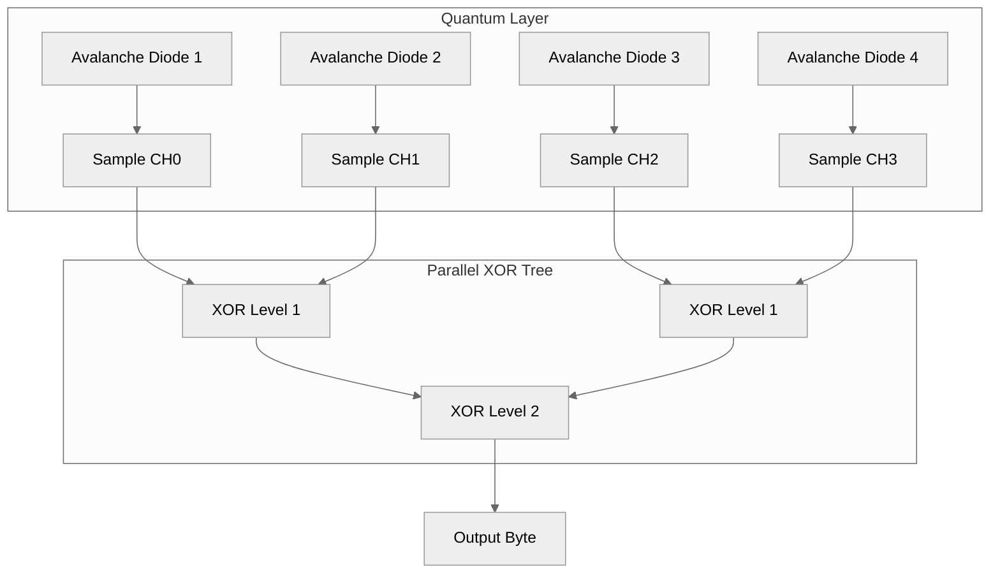
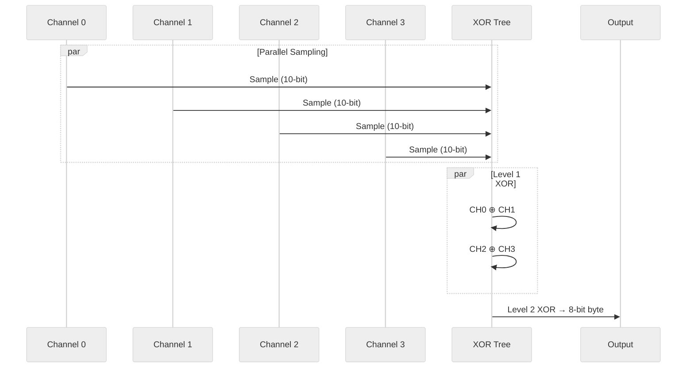
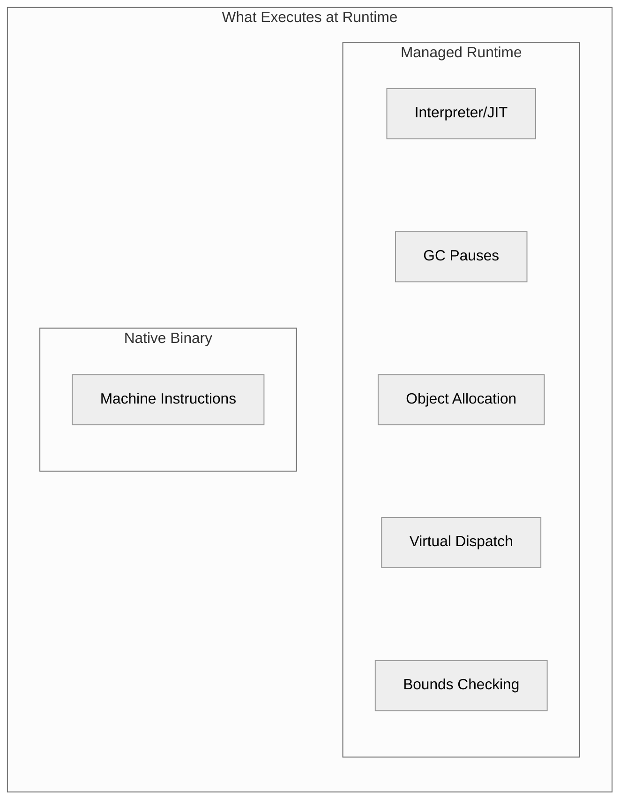

> This article was originally published on the
> [SpeakEZ Technologies blog](https://speakez.tech) as part of our early
> design work on the Fidelity Framework. It has been updated to reflect
> the Clef language naming and current project structure.

In a [universally contested future](/blog/safety-in-a-universally-contested-future/), every cryptographic operation rests on a single foundation: entropy. The keys that protect communications, the nonces that prevent replay attacks, the seeds that initialize secure protocols; all derive their strength from randomness that adversaries cannot predict or influence. When that foundation weakens, everything built upon it becomes vulnerable to harvest-now-decrypt-later strategies that patient adversaries are already executing.

This isn't an abstract concern. Post-quantum cryptography demands larger keys and more entropy. Air-gapped systems cannot rely on network-based entropy sources. Embedded devices in contested environments face active attempts to bias or destabilize their random number generation. The question of where random numbers come from, long ignored by application developers who simply call a function and move on, becomes existential when the security of critical infrastructure depends on the answer.

This case study examines what appears to be a narrow problem: generating 4,096 bytes of cryptographic-quality random data from hardware entropy sources. The solution reveals principles that extend far beyond this specific application. Mathematical properties of the XOR operation, combined with hardware/software co-design and native compilation, produce results that managed runtimes cannot match. The methodology demonstrated here, using mathematics to guide both hardware architecture and software implementation, establishes patterns for building systems where security guarantees are provable.

---

## From Quantum Physics to Usable Bytes

### The Spectrum of Randomness

Not all random numbers are created equal. Understanding the hierarchy of randomness sources reveals why this case study matters for security-critical applications.

**Pseudo-Random Number Generators (PRNGs)** form the foundation of most software randomness. .NET developers encounter these through `System.Random`, which implements a deterministic algorithm seeded by an initial value. Given the same seed, a PRNG produces the identical sequence every time. This determinism is useful for reproducible simulations and testing, but it creates a false sense of security when developers assume the output is unpredictable.

```csharp
// The vulnerability: time-based seeding is guessable
var rng1 = new Random();  // Seeded from Environment.TickCount
var rng2 = new Random();  // Same millisecond = same seed
// rng1.Next() == rng2.Next() - not random at all!

// An attacker who knows when your service started
// can try seeds around that time and find your sequence
```

The limitation isn't implementation quality. It's mathematical certainty. PRNGs are finite state machines with small internal state. For `System.Random`, knowing the seed means knowing the entire infinite sequence. The default constructor seeds from system uptime in milliseconds: roughly \(2^{25}\) possibilities for a system that's been running less than a year. An attacker can try all of them in seconds.

**Cryptographically Secure PRNGs (CSPRNGs)** improve on basic PRNGs by using cryptographic primitives and continuously mixing in environmental entropy. .NET's `RandomNumberGenerator.Create()` delegates to operating system facilities: CryptGenRandom on Windows, /dev/urandom on Linux. These systems harvest entropy from various sources (keyboard timing, mouse movements, disk I/O patterns, network packet arrival times) and use it to re-seed cryptographic algorithms.

```csharp
// .NET CSPRNG - cryptographically secure but still algorithmic
using var rng = RandomNumberGenerator.Create();
var bytes = new byte[32];
rng.GetBytes(bytes);  // Draws from OS entropy pool
```

CSPRNGs are adequate for most security applications, but they have subtle weaknesses. The entropy sources are environmental, not fundamental. An attacker who controls or observes the environment (a virtual machine host, a compromised kernel, a system shortly after boot before entropy accumulates) may be able to predict or influence the "random" values. The cryptographic algorithms that expand entropy into output bytes are public; only the entropy inputs provide unpredictability.

**Hardware True Random Number Generators (TRNGs)** found in modern microcontrollers represent a significant improvement. ARM Cortex-M4 and M7 processors often include dedicated TRNG peripherals that sample physical noise sources: thermal noise in resistors, shot noise in transistors, or oscillator jitter. These provide non-deterministic values rooted in physical processes, not algorithms.

```c
// ARM TRNG peripheral access
uint32_t random_value;
HAL_RNG_GenerateRandomNumber(&hrng, &random_value);
```

Hardware TRNGs are genuinely unpredictable, but they're not immune to attack. The physical noise sources can be influenced by environmental factors: temperature changes, electromagnetic interference, power supply manipulation. Sophisticated attackers have demonstrated that hardware TRNGs can be biased or destabilized through fault injection attacks. The fundamental issue is that thermal and electrical noise, while unpredictable under normal conditions, are classical physical phenomena susceptible to classical manipulation.

**Quantum Random Number Generators (QRNGs)** occupy the top of the hierarchy. They derive randomness from quantum mechanical processes that are unpredictable not merely in practice but in principle. The uncertainty isn't due to our ignorance of hidden variables; it's a fundamental property of quantum mechanics, confirmed by Bell test experiments that rule out local hidden variable theories.

### Avalanche Noise: Quantum Randomness in a Diode

Avalanche noise diodes exploit quantum mechanical effects to generate truly random electrical signals. When a specially biased semiconductor junction operates in avalanche breakdown, electrons exhibit unpredictable behavior governed by quantum mechanics. This isn't pseudo-randomness derived from algorithms; it's genuine physical randomness rooted in the fundamental uncertainty of quantum processes.

The avalanche process works as follows: a strong electric field across the semiconductor junction accelerates electrons to high energies. These energetic electrons collide with atoms in the crystal lattice, liberating additional electrons through impact ionization. Each liberated electron can trigger further ionization, creating a cascade or "avalanche" of charge carriers.

The quantum nature emerges at the trigger point. Whether a particular electron gains enough energy to ionize an atom depends on quantum mechanical scattering processes. The exact moment of ionization, the direction of scattered particles, and the cascade multiplication factor are all fundamentally indeterminate. No amount of information about the system's prior state can predict the precise outcome.

This distinguishes avalanche noise from thermal noise (which is quantum in origin but statistically predictable in aggregate) and from oscillator jitter (which derives from chaotic but deterministic dynamics). Avalanche breakdown provides a direct window into quantum indeterminacy, converted to electrical current variations that an ADC can sample.

For applications where randomness quality matters (cryptographic keys, secure protocol initialization, unpredictable tokens), quantum-derived entropy will provide assurance that no algorithmic or environmental analysis can compromise. The randomness is guaranteed by physics, not by computational assumptions.

### The Engineering Challenge

The challenge is converting this analog quantum phenomenon into digital bytes that software can use. An analog-to-digital converter samples the noise voltage, producing numeric values. But these raw samples aren't immediately suitable for cryptographic use. They may exhibit bias (more ones than zeros, or vice versa), correlation between successive samples, or other statistical imperfections that an attacker could potentially exploit.

Traditional approaches address these imperfections through algorithmic post-processing:

**Von Neumann debiasing** reads pairs of samples and discards pairs where both samples are the same. When they differ, one ordering produces a zero, the other produces a one. This guarantees unbiased output but discards roughly 75% of samples, severely reducing throughput.

**Cryptographic whitening** applies hash functions like SHA-256 to spread entropy across output bits. This adds computational overhead and introduces algorithmic complexity that may itself harbor vulnerabilities.

Both approaches treat the hardware as a black box that produces imperfect data requiring software correction. But what if we could design the hardware and software together, using mathematics to guide both?

## XOR as Entropy Combiner

The exclusive-or (XOR) operation has a property that makes it ideal for combining entropy sources:

> **If either input to XOR is random, the output is random.**

This isn't intuition or approximation. It's mathematical fact. Consider two bit sources A and B, where A is perfectly random (50% ones, 50% zeros) and B is heavily biased (90% ones). The XOR of A and B remains perfectly random:

- When A equals zero (50% of the time), the output equals B
- When A equals one (50% of the time), the output equals NOT B

Since A acts as a random selector between B and its complement, any bias in B is masked. The randomness of A "protects" the output from B's imperfections.

This property means XOR never degrades entropy. It can only preserve or improve it.

### Quantifying Bias Reduction

Let epsilon (\(\varepsilon\)) represent deviation from perfect balance. A source with bias \(\varepsilon\) produces ones with probability \(0.5 + \varepsilon\) and zeros with probability \(0.5 - \varepsilon\). For example, \(\varepsilon = 0.05\) means 55% ones and 45% zeros.

When two independent sources with bias \(\varepsilon\) are XOR'd, the output bias can be calculated:

\[
\begin{aligned}
P(A \oplus B = 1) &= P(A{=}1) \times P(B{=}0) + P(A{=}0) \times P(B{=}1) \\[0.5em]
&= (0.5 + \varepsilon)(0.5 - \varepsilon) + (0.5 - \varepsilon)(0.5 + \varepsilon) \\[0.5em]
&= 2 \times (0.25 - \varepsilon^2) \\[0.5em]
&= 0.5 - 2\varepsilon^2
\end{aligned}
\]

The output bias is \(2\varepsilon^2\), significantly smaller than \(\varepsilon\) for any reasonable bias level. A 5% bias (\(\varepsilon = 0.05\)) becomes 0.5% after XOR'ing two sources.

This mathematical relationship guides the hardware design: instead of one entropy source requiring algorithmic correction, use multiple independent sources and let XOR's mathematical properties provide the correction.

## The Four-Channel Architecture

Extending from two channels to four provides exponential bias reduction through a parallel tree structure:



The tree structure matters. Level 1 performs two independent XOR operations in parallel:
- \(\text{CH0} \oplus \text{CH1}\) produces output with bias \(2\varepsilon^2\)
- \(\text{CH2} \oplus \text{CH3}\) produces output with bias \(2\varepsilon^2\)

Level 2 combines these results:
- \((\text{CH0} \oplus \text{CH1}) \oplus (\text{CH2} \oplus \text{CH3})\) has bias \(2 \times (2\varepsilon^2)^2 = 8\varepsilon^4\)

Starting with 5% bias per channel, the four-channel tree reduces it to 0.005%: a factor of 1000 improvement. But this understates what's actually possible.

### The Co-Design Advantage

The \(8\varepsilon^4\) formula has a notable implication: the starting bias \(\varepsilon\) is raised to the fourth power. This means small reductions in per-channel bias yield enormous improvements in output quality. Reducing \(\varepsilon\) from 5% to 2% doesn't sound dramatic, but the final bias drops from 0.005% to 0.00001%. That represents a 400× improvement from a 2.5× change in input quality.

This is where hardware/software co-design proves its value. The mathematics tells us exactly where hardware optimization matters most. Each channel can be individually tuned:

- **Bias current adjustment**: Resistor selection affects the avalanche operating point, shifting the noise distribution toward balance
- **Capacitor filtering**: Per-channel decoupling shapes the frequency response, emphasizing the most random components
- **ADC timing**: Sample rate tuning ensures each read captures independent avalanche events

With careful tuning, each channel can achieve 1-2% natural bias (compared to 5% from an unoptimized circuit). The XOR tree then reduces this to bias levels below \(10^{-7}\), exceeding cryptographic requirements without any algorithmic post-processing. The hardware provides quality; the mathematics provides certainty.

### Why Independence Matters

The mathematical analysis assumes the four channels are statistically independent. If two channels were correlated (producing similar values at similar times), their XOR wouldn't achieve the full bias reduction.

This requirement guides hardware design. Each channel needs:
- Its own avalanche diode (not a shared noise source)
- Isolated bias circuitry (no common current paths)
- Independent power filtering (decoupling capacitors per channel)

When mathematics dictates the hardware architecture, hardware tuning multiplies the guarantees.

## The Parallel Computation Model

The XOR tree maps naturally to parallel computation. The two Level 1 XOR operations have no data dependency and can execute simultaneously. Only Level 2 must wait for both Level 1 results.

This parallelism extends to the sampling itself. Reading four ADC channels is logically parallel: four independent physical processes producing four independent values. Even if hardware constraints serialize the actual reads, expressing the logical parallelism enables compilers to optimize scheduling and prepares for hardware that supports true parallel sampling.



### MLIR's scf.parallel Dialect

The Fidelity framework will express this parallelism through MLIR's Structured Control Flow (SCF) dialect. The `scf.parallel` operation declares logically parallel iterations with a reduction operation:

```mlir
func.func @generateEntropyByte() -> i8 {
    %c0 = arith.constant 0 : index
    %c4 = arith.constant 4 : index
    %c1 = arith.constant 1 : index
    %init = arith.constant 0 : i8

    %result = scf.parallel (%ch) = (%c0) to (%c4) step (%c1)
              init(%init) -> i8 {

        // Read ADC channel (logically parallel)
        %sample = func.call @adc_read(%ch) : (index) -> i32

        // Extract lower 8 bits
        %mask = arith.constant 255 : i32
        %masked = arith.andi %sample, %mask : i32
        %byte = arith.trunci %masked : i32 to i8

        // XOR reduction
        scf.reduce(%byte : i8) {
        ^bb0(%a: i8, %b: i8):
            %xor = arith.xori %a, %b : i8
            scf.reduce.return %xor : i8
        }
    }

    return %result : i8
}
```

The `scf.reduce` with `arith.xori` expresses that XOR is the combining operation. Because XOR is associative and commutative, the compiler can structure the reduction as a parallel tree automatically.

This isn't just documentation of intent. MLIR's lowering passes can transform this high-level parallel specification into optimal code for the target architecture: interleaved reads, pipelined execution, or truly parallel operations depending on hardware capabilities.

### Standard Dialects as Stepping Stone

The Fidelity framework's broader vision involves custom MLIR transforms through the Alex compiler component, expressing computation through the [INet/DCont duality](/blog/dcont-inet-duality/) that emerges from [referential transparency](/blog/seeking-referential-transparency/). These custom transforms will enable direct expression of parallel and sequential computation patterns, with the compiler automatically selecting optimal strategies based on semantic properties.

For this initial entropy generation application, standard MLIR dialects like `scf.parallel` and `arith` provide sufficient runway. They express the essential parallelism and reduction semantics without requiring custom infrastructure. This pragmatic approach proves the hardware/software co-design methodology while establishing patterns that will transition naturally to custom transforms as the compiler matures. The XOR reduction expressed here in `scf.reduce` will eventually map to INet's native parallel combination semantics; the sequential channel reads will map to DCont's continuation-based sequencing. Standard dialects today; purpose-built custom transforms tomorrow.

## Why Managed Runtimes Fall Short

Developers comfortable with Python, .NET, or Node.js might wonder why this matters. Can't you just read four values and XOR them in any language?

The answer involves understanding what happens beneath the API surface.

### The Python Reality

Python's `spidev` library provides ADC access, but each read involves:

1. Python interpreter overhead for function dispatch
2. C extension boundary crossing
3. Kernel system call for SPI transaction
4. Return through the same layers
5. Python object allocation for the result

Benchmarking reveals Python achieves roughly 3,000 samples per second for single-channel reads. For 4,096 bytes requiring 16,384 samples (four channels × 4,096 cycles), this translates to approximately 5.5 seconds.

But the overhead isn't merely slowness. Python's Global Interpreter Lock prevents true parallel execution. The garbage collector may pause execution unpredictably. The interpreted nature means every operation carries fixed overhead regardless of how simple the underlying computation.

### The .NET Reality

.NET improves on Python through JIT compilation and value types, but introduces its own overhead:

```csharp
// Typical .NET approach
var random = new byte[4096];
using var rng = RandomNumberGenerator.Create();
rng.GetBytes(random);
```

This delegates to operating system entropy sources (CryptGenRandom on Windows, /dev/urandom on Linux), which are designed for security but not for the specific performance characteristics of custom hardware. The managed runtime adds:

- Object allocation for byte arrays
- Virtual dispatch for the RNG implementation
- Potential garbage collection pauses
- No ability to express hardware-specific parallelism

But the deeper issue is structural: **.NET copies data everywhere**. The managed heap model requires marshaling data between managed and unmanaged contexts. Each crossing copies bytes. Reading from hardware? Copy into a managed array. Passing to a cryptographic function? Copy to ensure the GC doesn't relocate the buffer mid-operation. Returning results? Another copy.

For cryptographic materials, this isn't just inefficient; it's a security liability. Every copy creates another location in memory where sensitive data resides. Each copy expands the attack surface: more places for memory dumps to capture, more opportunities for side-channel observation, more locations that must be explicitly zeroed. Developers must maintain constant vigilance, carefully marshaling data and manually clearing buffers, hoping they haven't missed a copy the runtime created implicitly.

Fidelity's zero-copy architecture eliminates this entire class of concerns. Data flows from hardware registers through computation to output without intermediate copies. There's no managed heap to marshal across, no GC relocating buffers, no implicit copies hiding sensitive material in unexpected memory locations. The attack surface shrinks to the essential minimum: the data exists in exactly the locations the code specifies, and nowhere else.

More fundamentally, managed runtimes abstract away the hardware. They can't express "read these four ADC channels in parallel" because they don't acknowledge that ADC channels exist.

### The Native Compilation Advantage

Fidelity's native compilation approach eliminates these layers:

```fsharp
// Clef with Fidelity - compiles to native code
let generateEntropyByte () : byte =
    let s0 = Platform.Bindings.ADC.readChannel 0
    let s1 = Platform.Bindings.ADC.readChannel 1
    let s2 = Platform.Bindings.ADC.readChannel 2
    let s3 = Platform.Bindings.ADC.readChannel 3

    let b0 = byte (s0 &&& 0xFFus)
    let b1 = byte (s1 &&& 0xFFus)
    let b2 = byte (s2 &&& 0xFFus)
    let b3 = byte (s3 &&& 0xFFus)

    (b0 ^^^ b1) ^^^ (b2 ^^^ b3)
```

For readers unfamiliar with [Clef](https://clef-lang.com)'s bitwise operators: `^^^` is XOR, `&&&` is AND, `|||` is OR, and `~~~` is NOT. The triple-character syntax distinguishes bitwise operations from boolean operators (`&&`, `||`). These operators are less commonly seen in typical Clef application code but essential for systems programming.

This compiles through MLIR to native ARM64 instructions. No interpreter. No garbage collector. No virtual dispatch. The XOR operations become single `eor` instructions. The ADC reads become direct register manipulation.

The parallelism expressed in the source maps to hardware capabilities. On a processor with multiple execution units, the two Level 1 XORs can execute in the same cycle. On hardware with DMA-capable ADC interfaces, all four channel reads could occur simultaneously.

## Performance Projection

The mathematical model projects performance based on hardware capabilities. These figures represent targets for the prototype implementation:

| Approach | Samples/sec | Time for 4096 bytes | Overhead Source |
|----------|-------------|---------------------|-----------------|
| Python + Von Neumann | ~200 | 15+ seconds | Interpreter + 75% discard |
| Python + LSB extraction | ~3,000 | ~5.5 seconds | Interpreter |
| .NET managed | ~10,000 | ~1.6 seconds | Runtime + GC |
| Native (conservative) | ~40,000 | ~410 ms | Hardware only |
| Native (optimized) | ~100,000 | ~160 ms | Pipelined |

The native compilation advantage isn't a percentage improvement; it's an order of magnitude. And unlike algorithmic optimizations that eventually hit diminishing returns, hardware-aware compilation scales with hardware capability.

## Mathematics as Design Guide

This case study illustrates a methodology that extends beyond random number generation:

1. **Start with mathematical properties**: XOR's entropy-preserving behavior isn't discovered through experimentation. It's proven from first principles. Understanding the mathematics reveals what's possible.

2. **Let mathematics guide hardware**: The requirement for independent channels follows directly from the statistical analysis. The parallel tree structure emerges from XOR's associativity. The hardware architecture implements mathematical requirements.

3. **Express parallelism explicitly**: Even when hardware serializes operations, expressing logical parallelism preserves optimization opportunities. Tomorrow's hardware may parallelize what today's serializes.

4. **Compile to the hardware, not around it**: Managed runtimes abstract hardware away. Native compilation embraces it. The difference compounds across millions of operations.



The contrast is stark: managed runtimes execute layers of abstraction on every operation. Native compilation resolves those abstractions once, at compile time, leaving only the essential computation at runtime.

## Entropy Integrity Through the Pipeline

A critical consideration in cryptographic applications is maintaining entropy integrity: ensuring that the randomness present in physical processes survives through to the final output without degradation or predictable transformation.

The XOR approach provides mathematical guarantees about entropy preservation. Each bit of output depends on all four input channels. No single channel failure compromises output randomness (the other three still provide entropy). No algorithmic transformation introduces predictable patterns.

Compare this with cryptographic whitening, which applies deterministic functions to input data. While whitening spreads entropy effectively, it also transforms it through known algorithms. An attacker who knows the whitening function and can observe outputs has more information than one observing pure XOR combinations.

The Fidelity compilation model extends this integrity guarantee through the software layer. The Clef source expresses the mathematical operation directly. MLIR preserves the operation's semantics through lowering. Native code executes exactly what was specified. No interpreter reordering, no JIT optimization surprises, no garbage collector interference.

## Fault Tolerance Through Independence

The four-channel architecture provides defense in depth against hardware failures:

- **One channel fails**: Three remaining channels still XOR to produce random output with \(\varepsilon^3\) bias
- **Two channels fail**: Two remaining channels produce \(\varepsilon^2\) bias
- **Three channels fail**: Single channel provides original \(\varepsilon\) bias

Complete entropy failure requires all four independent quantum processes to fail simultaneously. For properly isolated circuits, this probability is negligible.

### Defense Against Active Attacks

Beyond passive failures, the four-channel architecture provides defense against active electromagnetic attacks. Single-channel entropy generators, whether avalanche-based or modular noise designs, share a common vulnerability: an attacker with a remote EM source can potentially bias the output.

For avalanche generators, the attack vector is the sensitive diode output operating at micro-ampere levels. Stray currents induced by external EM fields can superimpose a repetitive or fixed waveform on the noise signal. If the system uses a simple 1-bit discriminator, this bias can force the generator into a "stuck" state, producing predictable output.

Modular noise generators face a similar threat through a different mechanism. While the noise amplifier indiscriminately amplifies all noise sources (shot noise, thermal noise, EM interference, crosstalk), an attacker who can correlate EM timing to the generator's sampling period may influence the comparator's voltage reference. Repetitive stray currents on this node can bias the comparator's decisions, correlating output entropy to the external EM field until the generator enters a stuck state.

The four-channel XOR architecture defeats both attack modes. An attacker would need to simultaneously bias all four independent channels with coherent EM interference. The channels operate from separate diodes with separate bias networks; influencing one provides no leverage over the others. The XOR combination means that even if an attacker succeeds in biasing three channels completely, the fourth channel's quantum randomness still propagates to the output.

Physical mitigations remain straightforward for defense in depth: shielding, filtering, and physical separation. But the mathematical structure of four-channel XOR provides a layer of protection that single-channel designs fundamentally cannot match.

## Synthesis

Generating 4,096 bytes of cryptographic entropy might seem like a narrow problem, but it illuminates principles that apply broadly:

**Mathematical foundations matter.** The XOR operation's entropy-preserving property isn't a clever hack; it's a theorem. Building on proven mathematics provides guarantees that testing alone cannot.

**Hardware and software co-design multiplies effectiveness.** Treating hardware as an abstract resource to be accessed through layers of abstraction leaves performance on the table. Designing hardware and software together, guided by shared mathematical understanding, achieves results neither could alone.

**Software-only solutions carry hidden costs.** Von Neumann debiasing, the classical algorithmic approach to entropy correction, discards at least 50% of sampled data and typically 75% or more. This might seem like a minor inefficiency, but it betrays a deeper problem: the software-only perspective accepts waste as inevitable, never questioning the system design that created it. The four-channel XOR architecture uses every sample, discarding nothing, because the hardware was designed with the mathematics in mind. In the coming era where [cryptographically certified post-quantum security will emerge as a mandatory requirement](/blog/safety-in-a-universally-contested-future/), the integrity of the entire entropy generation process matters. Cryptographic assurance cannot rest solely on algorithmic innovation; it requires end-to-end verification from quantum source through native code to final output. Hardware/software co-design is essential for systems where security guarantees must be provable.

**Parallelism is semantic, not just performance.** Expressing that four channels are logically independent documents system architecture, enables compiler optimization, and prepares for hardware evolution. Serial execution is an implementation detail, not a design constraint.

**Native compilation enables hardware-awareness.** Managed runtimes provide convenience and safety, but they abstract away the hardware characteristics that determine real-world performance. For applications where hardware interaction dominates, native compilation provides access to capabilities that higher-level approaches cannot reach.

The XOR entropy combiner demonstrates these principles in a compact, verifiable system. The same methodology will apply to signal processing, sensor fusion, real-time control, and anywhere that physical processes meet digital computation. Mathematics shows the path; hardware-aware compilation will walk it.

---

## Further Reading

- [Fidelity Framework: A Primer](/blog/fidelity-framework-a-primer/): Overview of the native Clef compilation approach
- [Cache-Conscious Memory Management](/blog/cache-aware-compilation-cpu/): Hardware-aware optimization strategies
- [Delimited Continuations: Fidelity's Turning Point](/blog/delimited-continuations-fidelitys-turning-point/): How mathematical abstractions guide compiler architecture
- [The DCont/Inet Duality](/blog/dcont-inet-duality/): Parallel vs sequential computation patterns
- [Getting the Signal with BAREWire](/blog/getting-the-signal-with-barewire/): Zero-copy data handling for hardware interfaces

### Technical References

- [A Statistical Test Suite for Random Number Generators](https://csrc.nist.gov/publications/detail/sp/800-22/rev-1a/final): NIST SP 800-22
- [Avalanche Noise as Entropy Source](https://betrusted.io/avalanche-noise.html): Hardware design considerations
- [MLIR: Multi-Level Intermediate Representation](https://mlir.llvm.org/): The compilation infrastructure underlying Fidelity

### Intellectual Property

The quantum entropy generation and distribution architecture described in this case study implements technology protected by pending patents from SpeakEZ Technologies:

| Application | Title |
|-------------|-------|
| US 63/780,027 | Air-Gapped Dual Network Architecture for QRNG Cryptographic Certificate Distribution via QR Code and Infrared Transfer in WireGuard Overlay Networks |
| US 63/780,055 | Quantum-Resistant Hardware Security Module with Decentralized Identity Capabilities |

These patents cover the end-to-end architecture: from quantum entropy harvesting through avalanche noise, to air-gapped credential distribution, to post-quantum cryptographic operations. The hardware/software co-design principles explored here will form the foundation for systems where cryptographic integrity must be verifiable from physical source to final output.
