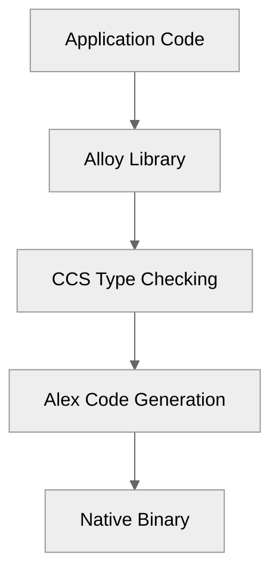
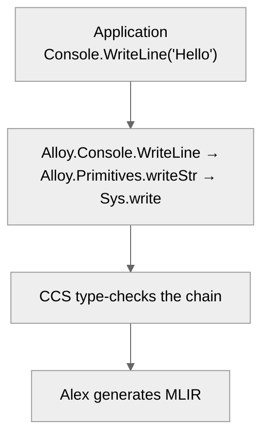
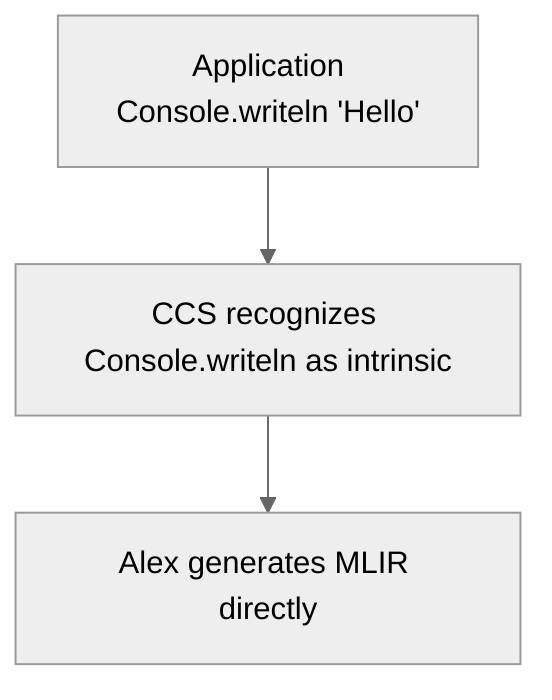
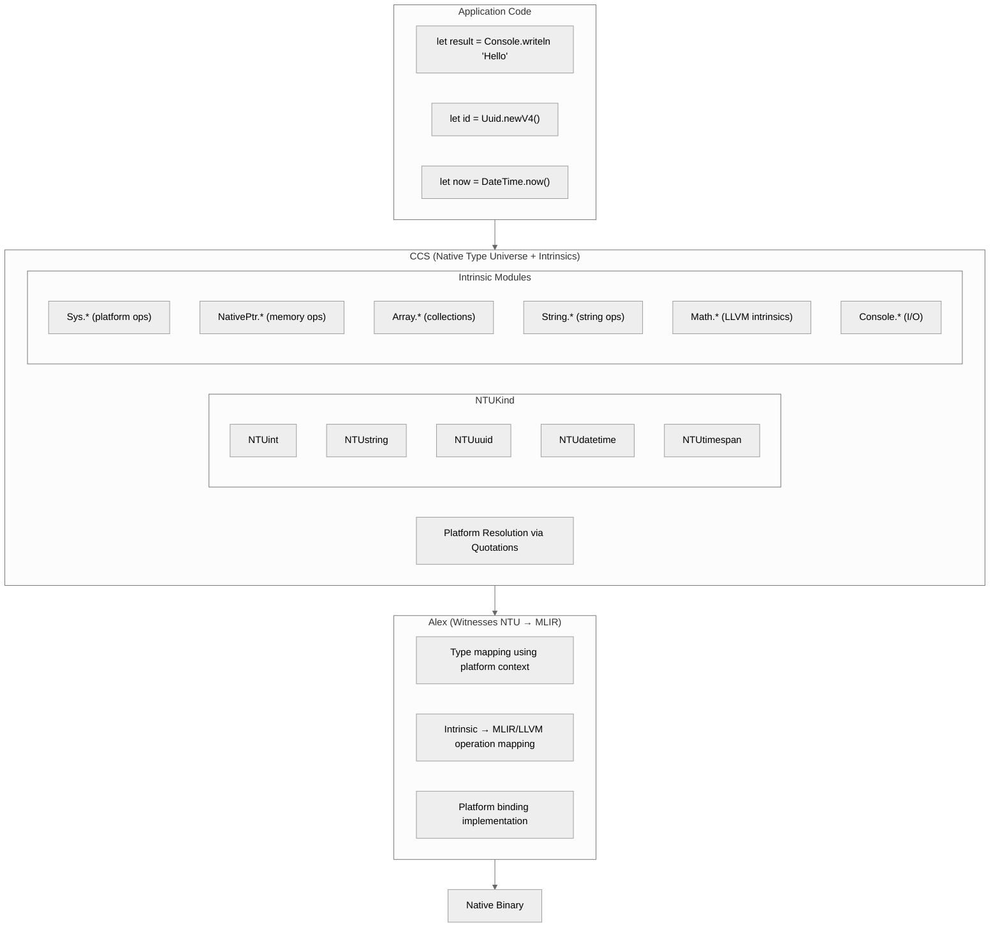

> This article was originally published on the
> [SpeakEZ Technologies blog](https://speakez.tech) as part of our early
> design work on the Fidelity Framework. It has been updated to reflect
> the Clef language naming and current project structure.

In March 2025, we published [Building Composer With Alloy](https://speakez.tech/blog/building-firefly-with-alloy/), describing a BCL-free Clef standard library that would provide native type implementations. The vision was compelling: preserve familiar APIs like `Console.WriteLine` while compiling to fat pointers and stack allocations instead of GC-tracked heap objects. Alloy would be to Fidelity what the BCL is to .NET.

> That vision was a stepping stone, not a destination.

Over the months that followed, as we deepened our understanding of ML-family languages, studied production MLIR frameworks and refined the Native Type Universe architecture, a realization crystallized: **types belong in the compiler, not in a library**. This may seem obvious to software engineers that "live" in other ecosystems, but for us it was a matter of ensuring that it was an emergent property and not to just a reflexive withdrawal from 'current art' in the .NET ecosystem.

## The Library Pattern: A Familiar Approach

When we designed Alloy, we followed a well-established pattern. Just as .NET has the Base Class Library, Rust has its standard library, and OCaml has its Core modules, we would provide a library of native types and operations for Clef code targeting native compilation.

The architecture seemed clean:



Alloy would define `NativeStr` as a struct with `Pointer` and `Length` fields. Alloy would implement `Console.Write` as calls to `Sys.write`. CCS would type-check Alloy code like any other Clef code. Alex would generate MLIR for Alloy's platform bindings.

It worked. Our HelloWorld samples compiled and ran without issues. The tests all passed. The dependency graph made sense. We had achieved BCL-free Clef compilation.

> But still, something nagged at us.

## The Realization: Types ARE the Language

In late 2025, while exploring reference implementations for the nanopass architecture, we spent time with [the Scheme-based nanopass framework](https://github.com/nanopass/nanopass-framework-scheme) and its `define-language` form. The pattern was striking: in nanopass, you don't *import* a library of types. You *define* the language's types as part of the compiler itself.

```scheme
(define-language L0
  (terminals
    (variable (x))
    (constant (c)))
  (Expr (e)
    (var x)
    (const c)
    (primapp prim (e ...))
    (app e0 e1)
    (lambda (x ...) e)))
```

The types `Expr`, `var`, `const` aren't imported from a library. They ARE the language. The compiler doesn't consume them; the compiler defines them.

We also spent some time in review of [Triton-CPU, a reference MLIR implementation](https://github.com/triton-lang/triton-cpu). Its approach was similar: types are defined in TableGen dialect specifications, not in a separate library:

```tablegen
def Triton_PointerType : Triton_Type<"pointer", "ptr"> {
  let parameters = (ins
    "Type":$pointeeType,
    "int":$addressSpace
  );
}
```

The `ptr` type isn't imported from a Triton standard library. It's intrinsic to the Triton dialect. The compiler owns it completely.

And then we looked at what we had already built.

## We Had Already Done It

The irony was that over time our CCS (Clef Compiler Services) emerged to contain most of what we were seeking. The NTUKind discriminated union *already* defined the native type universe:

```fsharp
type NTUKind =
    // Platform-dependent (resolved via quotations)
    | NTUint      // Platform word, signed
    | NTUuint     // Platform word, unsigned
    | NTUstring   // Fat pointer (ptr + length)
    | NTUptr      // Pointer type
    | NTUbool     // Boolean
    | NTUunit     // Unit type

    // Fixed width (platform-independent)
    | NTUint8 | NTUint16 | NTUint32 | NTUint64
    | NTUuint8 | NTUuint16 | NTUuint32 | NTUuint64
    | NTUfloat32 | NTUfloat64
```

CCS already had intrinsic modules for essential operations:

- `NativePtr.*` for pointer manipulation
- `Sys.*` for platform operations (write, read, exit, etc.)
- `Array.*` for collection operations
- `NativeStr.*` for string operations

The types weren't coming from Alloy and flowing through CCS. CCS was *defining* the types. Alloy was just providing aliases and wrapper functions that eventually resolved to CCS intrinsics anyway.

> We were maintaining two layers where one would suffice.

## The Absorption

The absorption of Alloy into CCS follows from this realization. Rather than having:



We now have:



The intermediate library layer disappears. Types and operations are compiler intrinsics from the start.

### Less is More

The architectural simplification delivers a concrete benefit that deserves emphasis: **the compilation pipeline no longer performs extensive reachability analysis and pruning**.

With Alloy as a library, compilation followed a subtractive model. The compiler loaded all of Alloy's type definitions, wrapper functions, and platform bindings, then analyzed which portions were actually reachable from the application code. Unreachable code was pruned. This is the same pattern .NET uses with the BCL, and it carries the same computational cost: the compiler must process everything before determining what to discard.

With intrinsics, compilation follows an additive model. When CCS encounters `Console.writeln`, it recognizes an intrinsic and includes exactly what's needed for that operation. Nothing more. There's no library to load, no dependency graph to traverse, no pruning pass to execute.

The difference is dramatic. In our HelloWorld samples, reachability analysis previously processed the entire Alloy typed tree before pruning over 90% of it. That analysis now simply doesn't happen. The compiler includes `Console.writeln`'s implementation and moves on.

This isn't a micro-optimization. It's a fundamental simplification of the compilation pipeline:

| Model | Process | Cost |
|-------|---------|------|
| **Subtractive** (Alloy) | Load all → Analyze reachability → Prune unused | O(library size) |
| **Additive** (Intrinsics) | Include what's referenced | O(application size) |

For small programs, the reduction is proportionally enormous. For large programs, the baseline is simply lower. Either way, less work means faster compilation and a simpler compiler implementation.

Some reachability analysis remains necessary for platform binding libraries, where user-defined code may have unused paths. But for the core type system and intrinsic operations, the question "is this reachable?" no longer needs to be asked. If the compiler emits it, it's needed.

### New Intrinsic Modules

CCS now provides comprehensive intrinsic modules:

| Module | Purpose | Example Operations |
|--------|---------|-------------------|
| **Sys.*** | Platform operations | write, read, exit, clock_gettime |
| **NativePtr.*** | Pointer manipulation | get, set, add, stackalloc |
| **Array.*** | Collection operations | length, get, set, create |
| **String.*** | String operations | concat, substring, length |
| **Math.*** | Mathematical functions | sin, cos, sqrt (→ LLVM intrinsics) |
| **Bits.*** | Bit manipulation | popcount, clz, ctz (→ LLVM intrinsics) |
| **Console.*** | I/O operations | write, writeln, readln |
| **Uuid.*** | UUID generation | newV4, parse, toString |
| **DateTime.*** | Time operations | now, utcNow, addDays |

### New NTU Types

The type universe expands to include types that Alloy previously defined:

```fsharp
type NTUKind =
    // ... existing types ...

    /// 128-bit UUID (RFC 4122) - platform entropy for generation
    | NTUuuid

    /// DateTime - ticks with platform clock resolution
    | NTUdatetime

    /// TimeSpan - duration in ticks
    | NTUtimespan
```

UUID generation and DateTime operations use platform quotations for resolution, the same mechanism that resolves `NTUint` to 32 or 64 bits based on target architecture. The platform-specific entropy source (getrandom on Linux, BCryptGenRandom on Windows) is part of the platform binding, not the type definition.

## Familiar Surface, Native Core

A reasonable concern at this point: does absorbing Alloy into the compiler mean F# developers need to learn a new API? The answer is no. The design-time experience largely remains idiomatic Clef.

```fsharp
// Application code looks exactly like standard Clef
let main () =
    let greeting = "Hello, World!"
    Console.writeln greeting

    let id = Uuid.newV4()
    let now = DateTime.now()

    sprintf "Generated %O at %O" id now
    |> Console.writeln
```

This code uses familiar patterns: `let` bindings, string interpolation, module-qualified function calls. A Clef developer reading this code sees familiar syntax, not some domain-specific language for native compilation. The types (`string`, `Uuid`, `DateTime`) behave as expected. The functions (`Console.writeln`, `Uuid.newV4`, `DateTime.now`) follow standard naming conventions.

The difference surfaces only when building platform libraries, the code that bridges Clef's type system to platform-specific implementations. Here, quotations become first-class citizens:

```fsharp
// Platform library code - where quotations drive resolution
module Platform.Console =

    let writeln (s: string) : unit =
        <@ fun (str: NTUstring) ->
            let ptr, len = NativeStr.toParts str
            Sys.write Sys.stdout ptr len
            Sys.write Sys.stdout (NativePtr.ofArray "\n"B) 1n
        @>
```

The quotation `<@ ... @>` captures the implementation as data, allowing the compiler to inspect it, transform it based on platform context, and generate appropriate MLIR. On Linux x86_64, `Sys.write` becomes a syscall with arguments in specific registers. On ARM64, the calling convention differs. On bare-metal embedded targets, it might become a UART write sequence.

This separation preserves a clean division of concerns:

| Layer | Sees | Writes |
|-------|------|--------|
| **Application developers** | Familiar Clef APIs | Standard Clef code |
| **Platform library authors** | Quotation-based bindings | Platform-specific implementations |
| **Compiler (CCS + Alex)** | NTU types + quotations | MLIR operations |

Most Clef developers never need to write platform bindings. They consume intrinsic modules (`Console.*`, `Uuid.*`, `DateTime.*`) the same way they'd consume any Clef library. The quotation machinery is an implementation detail, invisible unless you're extending the platform. The biggest everyday difference is no more `open System` calls, and much smaller executables with faster execution.

This was always the goal: native compilation without abstruse syntax.

> The absorption of Alloy doesn't change the developer experience; it changes where the implementation lives.

Types and operations that previously resolved through library indirection now resolve directly in the compiler, but the surface API remains unchanged.

## A View With Gratitude

Looking back at [Building Composer With Alloy](https://speakez.tech/blog/building-firefly-with-alloy/), the thinking was reasonable for its time. We were coming from a .NET perspective where the BCL/runtime separation is fundamental to the developer experience. With our new direction we sought opportunities to preserve a familiar pattern for users coming from a .NET background.

More importantly, Alloy served as a *discovery mechanism*. By implementing `NativeStr`, `Console`, and `Memory` as library code, we confirmed many of our expectations for native primitives:

1. **What native types needed to look like** - Fat pointers, stack buffers, value-type options
2. **What operations needed to exist** - Platform-independent APIs with platform-specific implementations
3. **How SRTP could drive compile-time resolution** - Inline functions with type constraints
4. **Where the BCL assumptions lived** - String encoding, GC integration, object hierarchies

> Alloy revealed over time that 'BCL-free Clef' was not only possible, it is *optimal*.

This process gave us the vocabulary and patterns that CCS now embodies directly.

But a stepping stone is not the destination. Having learned what we needed from Alloy, we could absorb those lessons into the compiler itself.

## What We Kept: F# Leverage

CCS leverages F#'s existing infrastructure in ways that other languages cannot contemplate:

**Quotations for Platform Binding Resolution**

F# quotations are a unique language feature that provide type-carrying, compile-time code inspection. Unlike string-based or JSON-based code representations where types are opaque metadata that must be parsed and validated separately, quotations preserve the compiler's type information as first-class data.

When Alex needs to generate a syscall, it doesn't parse a string to discover that `buffer` is a `nativeptr<byte>`; that information is structurally present in the quotation, verified by the same type checker that validated the original code.

When CCS encounters a platform binding, it uses quotations to resolve the platform-specific implementation:

```fsharp
// Platform binding signature
let write (fd: int) (buffer: nativeptr<byte>) (count: int) : int =
    platform_binding  // Quotation-resolved

// Resolved at compile time via platform descriptor
// Linux x86_64: syscall 1, args in rdi/rsi/rdx
// ARM64: svc 0x40, args in x0/x1/x2
```

**Active Patterns for Type Matching**

F# active patterns enable elegant type decomposition in the compiler:

```fsharp
let (|FatPointer|_|) (ty: NativeType) =
    match ty with
    | TApp(conRef, _) when conRef.Layout = TypeLayout.FatPointer ->
        Some conRef
    | _ -> None
```

**SRTP for Compile-Time Polymorphism**

Statically resolved type parameters drive generic operations without runtime cost:

```fsharp
let inline add (x: ^T) (y: ^T) : ^T
    when ^T : (static member (+) : ^T * ^T -> ^T) = x + y
```

These aren't features we invented. They're F# features that Alloy helped us understand how to leverage for native compilation.

## The New Architecture

The post-absorption architecture is cleaner:



The intermediate library layer is gone. Application code calls intrinsics. CCS recognizes them as intrinsics. Alex generates MLIR.

## The Alloy Repository

The Alloy repository remains as a historical artifact, a testament to our commitment to forging our own path. For a short time it will be:

1. **Preserved** with a README explaining its absorbed status
2. **Made read-only** after a transition period
3. **Kept as reference** for the patterns it established

We don't delete our stepping stones. We acknowledge them and move forward.

## New Art

Taking some measure of ML, Rust, and Triton-CPU, the Fidelity framework now embodies a clean, unified principle: **types and operations ARE the language, not library imports**.

CCS defines the Native Type Universe as Fidelity framework requires. CCS provides intrinsic modules for essential operations. Platform-specific details resolve via quotations at compile time. The Alex component inside the Composer compiler witnesses NTU types to MLIR.

No external library. No intermediate layer. No BCL equivalent needed.

This is what we mean by "new art" in compiler design for Clef. The lessons from .NET are valuable, but they're lessons about what we came FROM, not where we're going. The Fidelity framework charts its own course.

## Looking Forward

When we started this journey, we were conscious of the assumptions inherited from years of .NET development. The BCL as a 'mental model' felt comfortable. Alloy represented our attempt to follow that convention; a familiar pattern while pursuing a unique approach native compilation.

> It's now easy to see *that* dichotomy was on borrowed time from the very start.

It was a reasonable hypothesis: keep the architecture that fellow developers might expect, and just swap out the runtime semantics. For a time, it worked well enough that we didn't question it. But the nanopass literature and MLIR dialect patterns crystallized ideas that were part our long-term vision. And we realized we'd be much better off implementing them *now* rather than later.

In a native type ecosystem the language doesn't consume type definitions. From our view, the language *is* type definitions plus evaluation rules. The distinction between "the compiler" and "the standard library" dissolves because there was never a principled boundary there to begin with. It's a vestige of a decision made 25+ years ago.

This realization changes how we think about Fidelity's future. We're not building a .NET alternative with native compilation bolted on. We're building a native-first framework that happens to use F# syntax because F#'s ML heritage provides exactly the right abstractions: algebraic data types, pattern matching, quotations for metaprogramming, and statically resolved type parameters for zero-cost generics.

The absorption of Alloy into CCS is one manifestation of this shift. There will be others. Each time we find ourselves recreating a .NET pattern, we now ask: is this pattern load-bearing, or is it scaffolding we can remove once we have a firm grasp of what's needed for this framework?

Alloy was scaffolding. It helped us climb to a vantage point where we could see our new architecture clearly. From here, the next step forward doesn't require being beholden to the path we used to get here.

The good news is that now the Fidelity framework is simpler. The compilation path is cleaner; no more processing an entire library only to prune 90% of it. And the architecture finally reflects what was true from the beginning: in a native-first world, the compiler doesn't consume types from a library. The compiler *defines* the types, and everything else follows.

---

**Cross-References:**

- [Building Composer With Alloy](https://speakez.tech/blog/building-firefly-with-alloy/) - The previous understanding
- [Clef: From IL to NTU](https://speakez.tech/blog/fsharp-native-from-il-to-ntu/) - The type architecture
- [Baker: A Key Ingredient](https://speakez.tech/blog/baker-a-key-ingredient-to-firefly/) - Type resolution in the pipeline
- [Hello World Goes Native](/docs/design/hello-world-goes-native/) - Sample programs updated for CCS
