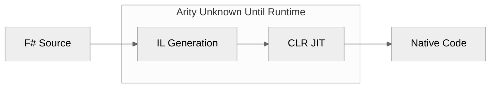
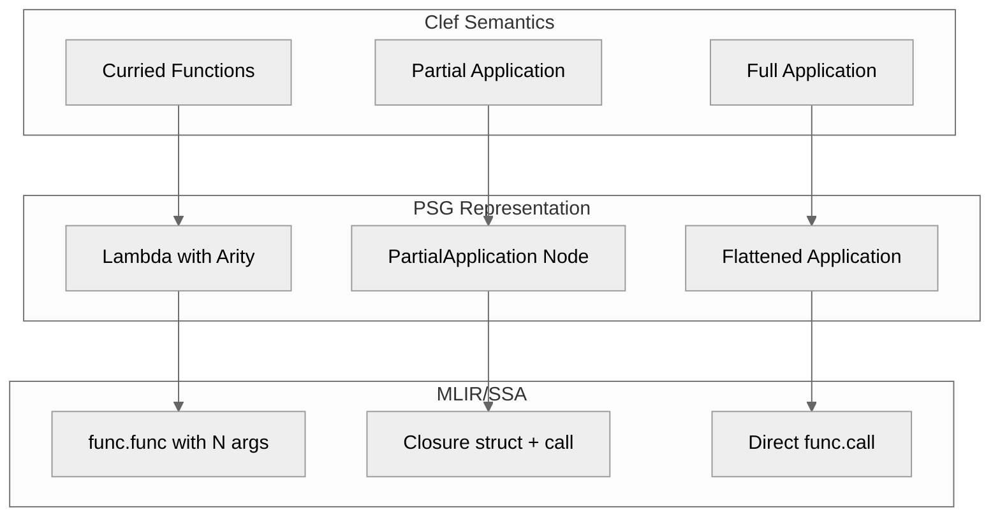

> This article was originally published on the
> [SpeakEZ Technologies blog](https://speakez.tech) as part of our early
> design work on the Fidelity Framework. It has been updated to reflect
> the Clef language naming and current project structure.

When Haskell Curry formalized the technique that now bears his name, he established a principle that would shape functional programming for decades: every function takes exactly one argument. What appears to be a multi-parameter function is actually a chain of single-parameter functions, each returning another function until all arguments are consumed. This insight, elegant in its simplicity, became foundational to the ML family of languages.

F# inherits this tradition directly. Every multi-parameter function is, under the hood, a chain of single-parameter functions:

```fsharp
let add x y = x + y
// Desugars to: let add = fun x -> fun y -> x + y
```

This is fundamental to ML-family languages. It's not syntax sugar; it's the computational model. Partial application falls out naturally: `add 5` returns a function waiting for one more argument. The elegance compounds: higher-order functions compose effortlessly, pipelines read left-to-right, and function signatures become self-documenting contracts.

Yet this elegance carries an implementation burden. When functions are truly curried, every partial application produces a new function value. In a theoretical lambda calculus, this is immaterial. In a compiler targeting real hardware, it raises immediate questions about representation, allocation, and lifetime.

In .NET, currying is essentially ignored. The CLR sees `add` as a method with two parameters. Partial application creates a closure object on the managed heap. The garbage collector handles the rest. Simple, if you have a garbage collector.

> Fidelity doesn't need or want a managed runtime or garbage collector.

## The Arity Question

When compiling Clef to native code without a runtime, we face a fundamental question: **how do we represent function arity?**

Consider this code from our sample applications:

```fsharp
let greet prefix name =
    Console.writeln $"{prefix}, {name}!"

let hello prefix =
    Console.readln() |> greet prefix
```

The expression `greet prefix` is a partial application. In .NET, this silently allocates a closure object. In native compilation, we need to decide: what IS this value?

## The .NET Model: Runtime Decides

.NET's approach is to defer arity decisions to the runtime:



The compiler emits IL that creates delegate objects. The JIT compiles these on demand. Partial application? Allocate a closure. Full application? Still might allocate (the JIT doesn't always optimize this away). The runtime handles everything dynamically.

This works when you have:
- A garbage collector to reclaim closures
- JIT compilation to optimize hot paths
- Runtime type information for reflection

Fidelity has none of these. We need arity to be explicit at compile time.

## The OCaml Model: Arity Is Explicit

OCaml, F#'s main progenitor, takes a fundamentally different approach. In OCaml's Lambda intermediate representation, **every function carries its arity explicitly**.

```ocaml
(* OCaml Lambda IR - arity is part of the representation *)
Lfunction { kind = Curried; params = [x; y]; body = ... }
```

OCaml's native compiler (`ocamlopt`) then makes a critical optimization based on observation: **most function calls are saturated**. That is, most calls provide exactly the number of arguments the function expects.

| Call Pattern | OCaml Treatment |
|-------------|-----------------|
| `add 5 3` (saturated) | Direct call, register passing |
| `add 5` (partial) | Allocate closure struct |

The insight is statistical: in real code, saturated calls dominate. By tracking arity explicitly, OCaml can generate optimal code for the common case while still supporting partial application when needed.

### The "Arity Curtain"

OCaml developers speak of the "arity curtain," the phenomenon where abstractions hide function arity from the compiler.

```ocaml
let apply_to_three f = f 3    (* Compiler sees f as arity 1 *)

let result = apply_to_three (add 5)  (* But add has arity 2! *)
```

When a function passes through an abstraction boundary, its arity becomes opaque. The compiler can no longer optimize saturated calls because it doesn't know how many arguments the function ultimately expects.

This is a fundamental tension in ML compilation. OCaml accepts it as a tradeoff: optimize what you can see, fall back to closures for what you can't.

## Fidelity's Approach: Principled Arity Tracking

For Fidelity, we've adopted the OCaml model, but with the benefit of Clef's type system providing additional information.

### Arity in the PSG

Our Program Semantic Graph (PSG) now carries explicit arity for all function bindings:

```fsharp
type BindingInfo = {
    Name: string
    Type: NativeType
    IsMutable: bool
    Arity: int option  // Known arity, or None for opaque functions
    // ...
}
```

When CCS (Clef Compiler Services) encounters a function definition, it records the arity:

```fsharp
// let greet prefix name = ...
// Arity = Some 2
```

### Saturation Detection

During PSG construction, CCS now detects saturated calls through partial applications:

```fsharp
// Source: Console.readln() |> greet prefix

// Without arity tracking: nested Applications
App(App(greet, prefix), readln())  // Alex doesn't know how to emit this

// With arity tracking: flattened when saturated
App(greet, [prefix; readln()])     // Direct 2-arg call
```

The key insight: `greet` has arity 2. We provide 2 arguments (prefix and readln result). This is a saturated call that should compile to a direct function call, not closure creation.

### Closure Representation When Needed

For genuinely escaping partial applications, we create explicit closure nodes.

```fsharp
let partial = greet "Hello"  // Escapes, bound to a name

// PSG represents this as:
PartialApplication(greet, ["Hello"], remainingArity=1)
```

Alex witnesses this and generates a closure struct on the stack:

```mlir
// Closure struct: { funcPtr, captured_arg0 }
%closure = memref.alloca() : memref<2xi64>
memref.store %greet_ptr, %closure[0] : memref<2xi64>
memref.store %hello_str, %closure[1] : memref<2xi64>
```

When this closure is later applied, we load the captured argument and make a direct call.

## Why This Matters for Fidelity

The arity-aware approach gives us several benefits:

### 1. Optimal Code for Common Patterns

Most Clef code uses saturated calls. With explicit arity tracking, these compile to direct function calls with no closure overhead:

```fsharp
// This is the common case
List.map (fun x -> x + 1) items  // map has arity 2, fully applied
```

### 2. Stack-Allocated Closures

When partial application does occur, our closures are stack-allocated by default. There is no heap allocation and no GC pressure.

```fsharp
let addFive = add 5  // Closure on stack, lives in this frame
items |> List.map addFive  // Closure doesn't escape
```

### 3. Predictable Performance

Unlike .NET where closure allocation is implicit and unpredictable, Fidelity makes the cost visible. The PSG explicitly represents `PartialApplication` nodes, and developers can see exactly where closures are created.

### 4. SSA ≅ Functional

MLIR's SSA form is fundamentally functional: values are immutable and scope follows dominance. Clef's computational model maps directly to SSA without reconstruction. Explicit arity tracking preserves this alignment:



## The Path Forward

With arity tracking in place, our sample applications now compile correctly. The curried function patterns that are idiomatic in Clef work without special handling:

```fsharp
// All of these now compile to efficient native code
items |> List.map transform
data |> filter predicate |> map projection
result |> Option.map processValue
```

The next steps involve:
- **Arity propagation through higher-order functions**: When possible, infer arity through abstractions
- **Closure escape analysis**: Warn when closures escape their stack frame
- **Defunctionalization for closed sets**: When all uses of a higher-order function are known, eliminate closures entirely

## Conclusion

Fidelity's name isn't accidental. We're committed to preserving Clef's semantics faithfully through the entire compilation pipeline. Currying isn't an obstacle to native compilation; it's a feature that maps beautifully to SSA when handled with care.

By following the ML tradition of explicit arity tracking, we get:
- Optimal code for saturated calls (the common case)
- Principled representation for partial application
- Predictable, stack-allocated closures
- Direct alignment with MLIR's functional model

The result is Clef code that compiles to tight, predictable native binaries while preserving the compositional elegance that makes its concurrent programming model such a rewarding experience.

---

*This post is part of a series on Fidelity's compiler architecture. See also [Absorbing Alloy](/docs/design/absorbing-alloy/) for how types became intrinsic to CCS, and [Why Clef Is A Natural Fit for MLIR](/docs/design/why-clef-fits-mlir/) for the SSA-functional correspondence.*
