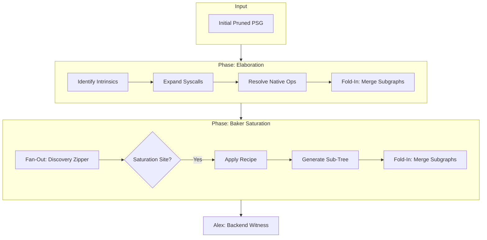

> This article was originally published on the
> [SpeakEZ Technologies blog](https://speakez.tech) as part of our early
> design work on the Fidelity Framework. It has been updated to reflect
> the Clef language naming and current project structure.

Gerard Huet's [1997 paper](https://www.st.cs.uni-saarland.de/edu/seminare/2005/advanced-fp/docs/huet-zipper.pdf) on "The Zipper" introduced a method for navigating immutable tree structures by carrying context during traversal. For years many have viewed this as a purely functional curiosity. But in the architecture of Composer, it solves a problem that often baffles developers coming from managed runtimes or imperative systems programming: bridging the gap between high-level intent and low-level execution while maintaining what is essential to both.

For the .NET developer, the "floor" of abstraction is often the Intermediate Language (IL). You trust the JIT to handle the messy details of memory and registers. For the Rust or Go developer, you are accustomed to seeing the metal, but often at the cost of the expressiveness that functional programming offers.

Composer seeks to lower that floor while keeping the ceiling high. SpeakEZ Technologies has take a view to bring the rich, expressive syntax of F#, with its pattern matching, higher-order functions (HOFs), and discriminated unions, and translate it into a representation that is not just "executable," but semantically complete. The Fidelity framework is the embodiment of the belief that the future of computing is not just 'full stack', but ***multi-stack***.

And the development of the Baker component within the Composer compiler exemplifies a progression tied to our vision. Early iterations relied on a complex "two-tree zipper" to manually correlate the F# abstract syntax tree (AST) with the typed tree. This architecture has evolved. The manual correlation of trees has been superseded by a native type universe (NTU) and a robust **nanopass infrastructure**. Baker is now our **Saturation Engine**; it applies semantic meaning using a model of Recipes and Ingredients.

## The Landscape: Elaboration and Saturation

To understand Baker, we must first look at where it sits in the pipeline. In programming language theory (PLT) circles, the venacular often includes talk of "Elaboration", essentially, the process of making implicit semantics explicit.

In Composer, we distinguish between **Elaboration** (handling intrinsics) and **Saturation** (handling language constructs). The saturation element, separate from elaboration, and where Baker really shines. The point of *saturation* is to find those points in the program's semantic graph and determine which sub-graph of composed intrinsics fully express the intent of the higher order function or similar construct.



Before Baker even wakes up, our **Elaboration** nanopasses have already run. These passes look for "intrinsic" operations, things like platform I/O calls or specific `[<FidelityExtern>]` bindings. They expand these calls into the specific system calls or library bindings required by the target architecture. This is akin to how a C compiler might expand a macro; we are making the external world visible to the graph.

**Baker** takes the baton from there. Its job is not to bind to the outside world, but to explain the *internal* world of Clef. When you write a `List.map` or a recursive `match` expression, there is no single machine instruction that performs that task. Baker must "saturate" the graph with the algorithm that fully implements that feature with no user intervention.

## The Nanopass Infrastructure

One of the major architectural decisions that have led to many hard-forked projects in the F# ecosystem is a move away from recursive patterns that weave many compiler pipeline. This is a vestige of older designs and while it serves its purpose it also means that "piercing the veil" is very difficult. Instead, we use a **nanopass infrastructure**, which is more stratified, more testable and easier to reason through the pipeline. This approach allows us to write focused transformations that are direct to reason about and much easier to test.

Baker executes within the PSGSaturation stage using a **Fan-Out / Fold-In** pattern:

1.  **Fan-Out (Discovery):** A specialized zipper, our navigator, traverses the reachable compute graph. It identifies "saturation sites" where things like HOFs (higher order functions), sequence expressions, match statements or similar constructs require expansion. **Saturation:** Baker applies a "Recipe" to each site. This generates a sub-graph of primitives that **compose *up*** to satisfy the inent of the HOF or similar construct. This step occurs in parallel; each decomposition is isolated, therefore is labeled "fan out".
2.  **Fold-In:** The generated sub-graphs merge into the main PSG. This step establishes parent-child relationships and updates references. Because of common/spanning concerns like node ID numbering and graph "edge" connections this must be done serially.

This separation of discovery and application versus 'folding in' is crucial. It means our "Recipes" don't need to know about the global state of the compiler; they just need to know, in keeping with the metaphor, how to cook ***that*** specific dish.

> This is one of the many affordances that a nanopass compilation strategy offers; the potential for embarassingly parallel compilation stages.

## A Functional Kitchen

Baker embraces a consistent hierarchy for code generation built on **XParsec** parser combinators. The metaphor may be considered a bit cute by some, but we feel like it deserves a bit of color; using "ingredients" and "recipes" perfectly fits the model of composition we are establishing.

We eschew imperative and functional "push" code for PSG node construction. There is no `graph.AddNode(...)` scattered through the pipeline. Instead, **Saturation Combinators** allow the assembly of complex logic using declarative patterns. This makes the code both reusable and more concise in reasoning through the transforms.

### 1. The Ingredients (Primitives)
Ingredients are the elemental building blocks. They wrap the lowest-level PSG operations, like `cons`, `head`, `tail`, or `ifThenElse`, into type-safe, semantic units.

Architectural discipline dictates that *only* Ingredients may modify the graph structure. An Ingredient looks something like this:

```fsharp
// An Ingredient: Safe, atomic wrapper around a primitive
let cons head tail elemTy =
    saturation {
        // 'emitPrimitive' is the internal builder
        let! node = emitPrimitive "cons" [head; tail] elemTy
        return node
    }
```

### 2. The Recipes (Abstractions)
Recipes are compositions of Ingredients. They typically require only 5 to 15 lines of code. A Recipe implements a high-level feature by chaining Ingredients together.

Because we use XParsec as the binding layer, a Recipe for `List.map` resembles the recursive algorithm itself, rather than a sequence of opaque API calls. It reads like a description of the behavior:

```fsharp
// A Baker Recipe: Composing Ingredients to implement List.map
let listMapRecipe mapper list elemTy =
    foldRight
        (emptyList elemTy)           // Base case: empty list
        (fun head recurse ->         // Recursive step
            saturation {
                // Apply the mapper function
                let! mapped = app1 mapper head
                // Cons the result onto the recursive tail
                return! cons mapped recurse
            })
        list
```

This code doesn't "run" the map; it generates the graph nodes that *perform* the map. It is a meta-program that describes the shape of the computation.

## Only Pay For What You Use

This architecture plays in harmony with our **reachability analysis**. In the .NET ecosystem, pulling in a library often feels like inviting a guest who brings their entire extended family, their pets, and their furniture. A single function call might drag in metadata for hundreds of types you never use, bloating your binary with "everything and the kitchen sink."

Composer operates on a Stroustrup style "only pay for what you use" philosophy. Baker runs **post-reachability**, and this timing is everything. We first prune the graph to include *only* the code paths your application actually traverses.

If your program uses `List.map` but never touches `List.sort`, the logic for sorting is never saturated. It never enters the graph. Baker behaves like a personal chef who cooks only the specific dishes you ordered, rather than catering a generic buffet where most of the food is wasted.

This results in a targeted optimization where **Reachability** removes the dead code, and **Baker** saturates only the living edges of the graph. The final native binaries are concise, containing only the code, memory patterns, and computational logic required for the tasks at hand. This is how we approach the density of C with the expressiveness of Clef, by ensuring that abstraction never carries a cost you didn't agree to pay.

## Pipeline Evolution

The "two-tree zipper" was a useful tool for exploration during our early prototypes; its removal marks the architectural maturity of the Fidelity framework. Manual synchronization of AST and Typed Tree representations is no longer necessary. It was a non-trivial amount of work to pivot to the **Native Type Universe (NTU)**. But in doing so we also were able to wed the AST to the `NativeTypedTree` construct and produce a connected, cohesive initial semantic graph. Post reachability analysis, the PSG provides a unified context that flows throughout the nanopass pipeline, carrying the type information we need without any adverse structural overhead.

We still employ a **coeffect strategy** to compute metadata about the graph, such as SSA assignment and mutability, but this now happens alongside the saturation process.

Baker has transformed from a complex correlation mechanism into a streamlined engine that facilitates the early stages of tranforming functional abstraction into direct native computation. It completes full, detailed, deterministic semantic meaning to fulfill the Fidelity framework's promise: high-level expressiveness with the performance and footprint of hand-tuned native code.

## Related Reading

For more on the Composer compiler and Fidelity framework:

- [Why Clef Fits MLIR](/docs/design/why-clef-fits-mlir/) - The theoretical foundation connecting functional programming to modern compilation
- [Static and Dynamic Library Binding](https://speakez.tech/blog/library-binding-in-fidelity-framework/) - How FidelityExtern flows through the compilation pipeline
- [Getting the Signal with BAREWire](https://speakez.tech/blog/getting-the-signal-with-barewire/) - Schema-driven binary serialization for native memory layouts
- [Intelligent Tree Shaking](https://speakez.tech/blog/intelligent-tree-shaking/) - Type-aware dead code elimination for minimal native executables
- [Hyping Hypergraphs](https://speakez.tech/blog/hyping-hypergraphs/) - The evolution from PSG to Program Hypergraph and targeting post-Von Neumann architectures
- [Context-Aware Compilation](https://speakez.tech/blog/context-aware-compilation/) - Coeffects and their role in optimization decisions
- [The Return of the Compiler](https://speakez.tech/blog/the-return-of-the-compiler/) - Why native compilation is displacing virtual machines
- [Seeing Beyond Assemblies](https://speakez.tech/blog/seeing-beyond-assemblies/) - Source-based package management in the Fidelity ecosystem
