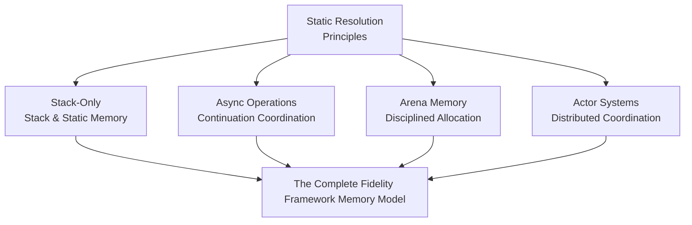
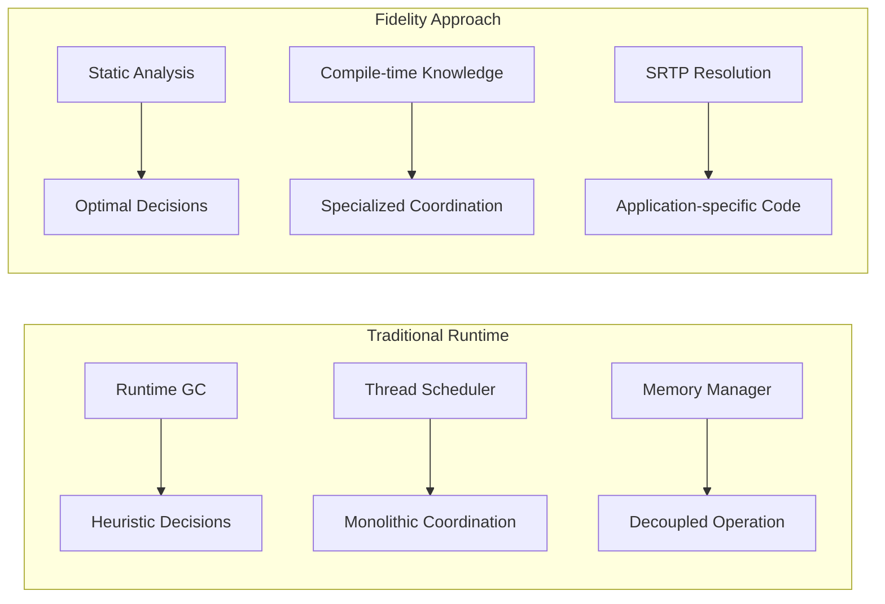
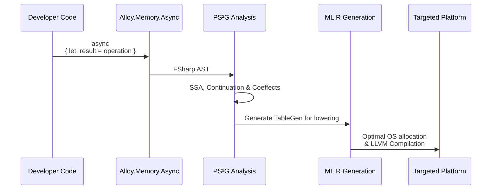
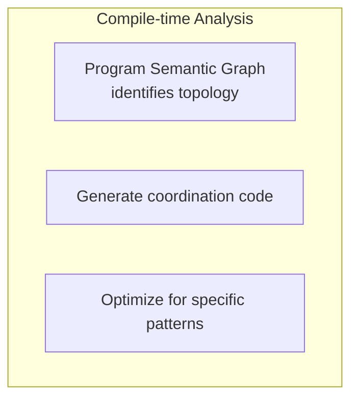
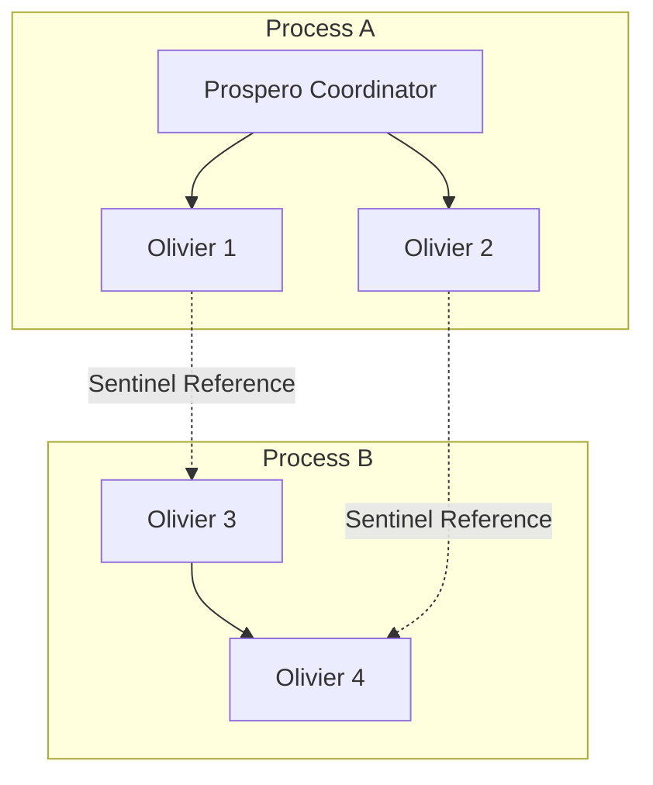

> This article was originally published on the
> [SpeakEZ Technologies blog](https://speakez.tech) as part of our early
> design work on the Fidelity Framework. It has been updated to reflect
> the Clef language naming and current project structure.

The journey of building the Fidelity Framework has taught us that meaningful changes require careful conceptual positioning alongside technical innovation. When we first introduced the design of Composer's deterministic memory management capabilities, we established a foundational principle that continues to guide our architectural decisions: functional programming should compile to efficient native code without runtime dependencies. Today, we want to explore how this foundation extends naturally into our roadmap for memory management, and is consistent with the core principles that make Fidelity unique.

Fidelity starts with stack-only allocation to illustrate, as other frameworks have shown, that functional programming doesn't need managed runtimes. With this full roadmap we extend static resolution principles to solve problems that benefit from heap allocation, but with compile-time elegance as opposed to falling back on the inherent compromises of a managed runtime. This progression represents the foundations we stand on to address the full spectrum of systems programming challenges.

This approach differs from both Rust and C++, though each language addresses memory management in ways that continue to evolve. Rust provides memory safety through its borrow checker, a significant achievement that has influenced the broader systems programming community. C++ offers manual control with ongoing efforts through smart pointers and static analysis tools to reduce common errors. Fidelity charts a different course: static analysis at compile time determines optimal allocation strategies automatically, and the actor model provides natural ownership boundaries. Rather than requiring pervasive lifetime annotations or relying on programmer discipline, we aim for safety that emerges structurally from the architecture. This is not a critique of other approaches but recognition that different design foundations lead to different solutions.



## Understanding the Philosophical Foundation

The deterministic memory management baseline of Fidelity serves multiple purposes that extend far beyond simply avoiding heap allocation. At its core, stack-only compilation demonstrates that sophisticated functional programming patterns can compile to efficient native code using only stack memory and static data structures. This capability breaks the mental model that associates F# with reflexive tethering to .NET, Mono or Fable's JavaScript runtimes.

However, the deeper purpose lies in establishing the compilation principles that make advanced memory management patterns possible. As we achieve deterministic memory control through Statically Resolved Type Parameters (SRTP) and compile-time analysis, we plan to build the infrastructure that will enable optimal code generation for a broad range of memory management strategies.



###

The Fidelity framework approach inverts the standard relationship by providing complete program knowledge at compile time, enabling memory management decisions that are optimal for each specific application. Whether that optimal strategy involves stack-only allocation, arena allocation, or distributed coordination depends on the problem domain. But the fundamental approach remains consistent:

> Comprehensive static analysis enables optimal code generation.

## The Static Resolution Foundation

What unlocks this progression is recognizing that SRTPs and static resolution are fundamentally about compile-time knowledge and optimization capabilities, not about specific allocation strategies. When we establish SRTPs as our baseline with stack-only allocation, we demonstrate that static resolution enables optimal compilation regardless of what that compilation needs to accomplish.

Consider how our platform abstraction pattern scales across different complexity levels. Here's how the same memory operation looks when targeting different platforms, starting with familiar Clef code:

```fsharp
// Stack-based data processing - familiar F# patterns
let processNumbers input =
    use buffer = stackBuffer<int> 1024
    let span = buffer.AsSpan()

    input
    |> Array.iteri (fun i value ->
        if i < span.Length then
            span[i] <- value * 2)

    // All processing happens on stack - no heap allocation
    span.Slice(0, min input.Length span.Length)
```

*Behind the scenes* this same Clef application code draws from different platform-optimized implementations depending on the deployment target:

```fsharp
// On Windows: Uses Microsoft's _alloca with stdcall convention
#if WINDOWS
let allocaImport = {
    LibraryName = "msvcrt"
    FunctionName = "_alloca"
    CallingConvention = StdCall    // Windows C runtime convention
}
#endif

// On Linux: Uses POSIX alloca with cdecl convention
#if LINUX
let allocaImport = {
    LibraryName = "libc.so.6"
    FunctionName = "alloca"
    CallingConvention = Cdecl      // Standard C calling convention
}
#endif
```

This difference might seem small, but it illustrates a fundamental principle about how compile-time platform selection works. The same high-level operation (stack allocation) maps to different low-level implementations that are optimized for each platform's conventions and available system services.

Think about why this matters from a systems programming perspective. On Windows, the Microsoft C runtime has specific optimizations and memory alignment requirements that differ from the GNU C library used on most Linux distributions. The calling conventions affect how parameters are passed and how the stack is managed.

When you write `use buffer = stackBuffer<byte> 256` in your Clef code, the static resolution system analyzes your target platform and generates the most efficient possible native code for that specific environment. You get Windows-optimized code when targeting Windows and Linux-optimized code when targeting Linux, but you never have to think about these differences as a developer.

The sophistication lies behind the scenes in the compilation process, in Composer's compiler navigating platform nuances, optimizing closure environments, and generating optimal code automatically, without forcing developers to manage platform differences manually or accepting lowest-common-denominator performance across all hosts.

## Async Operations as Continuation Coordination

The async capabilities we are building for Fidelity illustrate how sophisticated control flow patterns can emerge from the same static resolution principles that enable deterministic memory management. When developers write idiomatic Clef async code, they work with familiar computation expressions and standard async patterns. The underlying implementation uses compile-time analysis to generate efficient continuations.

Here's how async coordination looks with normal Clef patterns:

```fsharp
// Familiar async code that coordinates through continuations
let processFileAsync filename = async {
    use buffer = stackBuffer<byte> 4096

    let! fileData = File.readAllBytesAsync filename
    let! processedData = async {
        // Process in chunks using stack-allocated workspace
        let workspace = buffer.AsSpan()
        return fileData |> Array.chunkBySize workspace.Length
                        |> Array.map processChunk
                        |> Array.concat
    }

    let! result = Database.saveAsync processedData
    return result
}
```



###

This approach maintains the developer experience that Clef programmers expect while providing the performance characteristics that systems programming demands. The async operations compile to native code with no runtime dependencies, but they coordinate complex execution patterns through OS-level mechanisms when the problem domain requires it.

Consider how this differs from traditional managed async implementations. In managed runtimes, async operations rely on runtime services for task scheduling, continuation management, and coordination. Our async implementation inverts this relationship by analyzing the complete async computation graph at compile time, including closure capture patterns, and generating specialized coordination code for each application. This inversion puts some burden of knowledge on the developer, even if it's general additional awareness of the targeted system. But we believe that the trade is well worth the exchange by **not** having to undercut an application's design in order to adapt to a managed runtime's costs and constraints.

None of these languages stand still; Rust and C++ continue evolving to address these complex issues in their own ways. Rust's async ecosystem has matured considerably, with tokio emerging as a de facto standard, though the fundamental tension between async lifetimes and the borrow checker remains an active area of language design discussion. C++20 coroutines represent significant progress toward zero-overhead async, and future standards will likely refine the model further. We acknowledge this ongoing work while noting that Fidelity takes a materially different approach: rather than retrofitting async onto an existing ownership model, our delimited continuation design makes continuation boundaries explicit in the semantic graph from the start. This enables compile-time analysis that emerges naturally from the architecture rather than being layered on afterward. The result is not necessarily "better" in absolute terms, but it offers a distinct solution path that we anticipate will prove valuable for systems where compile-time determinism is paramount.

## Arena Memory and Disciplined Allocation

Arena memory management represents a novel implementation for F# developers accustomed to .NET standard application code. It's an example of how a simple syntactic addition to Clef creates sophisticated memory patterns that can emerge from static resolution principles. Arena allocation provides controlled, efficient memory management for scenarios where stack allocation is insufficient but full garbage collection is unnecessary.

```fsharp
// Developer writes clean arena-based code
let processLargeDataset data =
    use arena = Arena.create(capacity = 10_000_000)

    let processedItems =
        data
        |> Array.map (Arena.allocate arena >> processItem)
        |> Array.filter isValid

    // Arena automatically cleaned up at scope exit
    processedItems
```

Arena allocation in Fidelity is not a runtime service but a compile-time strategy that generates optimal code for specific allocation patterns. When we implement arena memory through SRTP-disciplined types, the compiler gains complete knowledge of allocation patterns, lifetime requirements, and coordination protocols, including the optimal management of closure environments that would traditionally require heap allocation for captured variables.

Arena allocation is not unique to Fidelity; C++ developers have long used arena patterns for performance-critical code, and Rust's bumpalo crate provides similar capabilities. The distinction lies in integration depth. In C++ and Rust, arenas are libraries that developers opt into explicitly, requiring manual attention to ensure allocations occur in the correct arena and that arena lifetimes encompass all references. Fidelity's approach integrates arena semantics with the actor model at the language level: each actor's arena is implicit in its type, and the compiler verifies that allocations respect arena boundaries. This shifts arena management from a discipline problem to a structural guarantee.

## Actor Systems and Distributed Coordination

The actor model capabilities we are developing represent the most sophisticated application of static resolution principles to complex coordination problems. Actor systems traditionally require substantial runtime infrastructure for message passing, lifecycle management, and failure coordination. Our approach generates this coordination capability through compile-time analysis and RAII-based memory management.





When we implement actor systems through RAII integration and cross-process sentinels, our design will establish coordination capabilities that are optimized for each specific application's actor topology and communication patterns. Each actor receives a dedicated memory arena that is deterministically cleaned up when the actor terminates, eliminating the need for runtime memory scanning or collection pauses. The compile-time analysis determines optimal message passing strategies, generates efficient supervision hierarchies, and coordinates memory management with actor lifetimes through automatic resource cleanup patterns.

Actor frameworks exist for both C++ (CAF, SObjectizer) and Rust (Actix, Bastion), each bringing valuable patterns to their respective ecosystems. These frameworks demonstrate that actor models can work well in systems languages. Fidelity's contribution is integrating actor semantics with memory management at the compiler level rather than the library level. Where existing frameworks must work within their language's existing ownership and lifetime rules, Fidelity designs these rules around actor boundaries from the start. The actor becomes the fundamental unit of resource ownership, with capabilities flowing through message channels; this is a design choice that requires language-level integration to express cleanly.

## The Complete Memory Model Architecture

The progression we have outlined creates a unified memory model that addresses the full spectrum of systems programming requirements while maintaining consistent principles throughout. Each layer builds upon the static resolution foundation, creating increasingly sophisticated coordination capabilities without compromising performance or adding runtime dependencies.

This complete memory model positions Fidelity as a platform that can address everything from embedded firmware to distributed systems using consistent programming abstractions and compilation techniques. The same Clef code can compile to efficient executables across radically different deployment environments, with the coordination complexity handled through compile-time specialization as opposed to bloated runtime services.

## Coherence Across Complexity Levels

The implementation strategy maintains coherence across all complexity levels by using consistent abstractions and compilation techniques. The platform abstraction pattern demonstrated in our Time implementation provides the template for how sophisticated coordination capabilities can be implemented through compile-time platform selection and static resolution.

The PS²G analysis provides the program understanding that makes this scaling possible. By analyzing complete call graphs and symbol relationships, including closure dependency graphs, the PS²G identifies coordination patterns, resource requirements, and optimization opportunities that enable optimal code generation for each specific application. XParsec then translates the analyzed program structure into MLIR operations using standard dialect operations composed in sophisticated ways.

## Compile-Time Elegance in Memory Management

The journey from stack-only allocation to sophisticated coordination patterns reveals how foundational principles can scale to address complex problems without compromising core commitments. By establishing static resolution and compile-time optimization as our fundamental approach, we have created a platform that provides sophisticated coordination capabilities while maintaining the performance predictability that systems programming demands.

Fidelity demonstrates that the choice between performance and expressiveness is not binary. Through careful architectural design and sophisticated compilation techniques, we provide both the systems programming capabilities needed for high-performance applications and the functional programming abstractions that make complex software manageable and maintainable.

The memory model we have outlined represents not just a technical achievement, but a philosophical statement about how programming languages can evolve to meet the demands of modern computing. By prioritizing compile-time analysis over runtime services, static resolution over dynamic coordination, and application-specific optimization over general-purpose abstractions, we create a platform that adapts to each application's specific requirements while maintaining consistent principles and developer experience.

This approach positions Fidelity uniquely in the landscape of programming platforms, providing a genuine alternative that combines the best aspects of systems programming and concurrent programming without the compromises typically associated with either approach. The result is a platform that can truly serve as a language for all seasons, from embedded devices to distributed systems, unified by an approach to memory management that adapts to each environment while preserving the safety and expressiveness that developers expect from modern programming languages.

*This article represents our current designs surrounding the Fidelity memory model as we continue to develop and refine these concepts. We welcome feedback and discussion as we work to bring these ideas from concept to practical implementation.*
