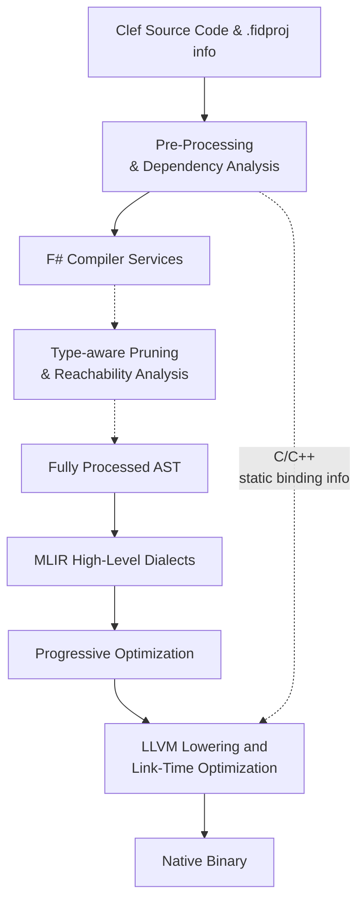
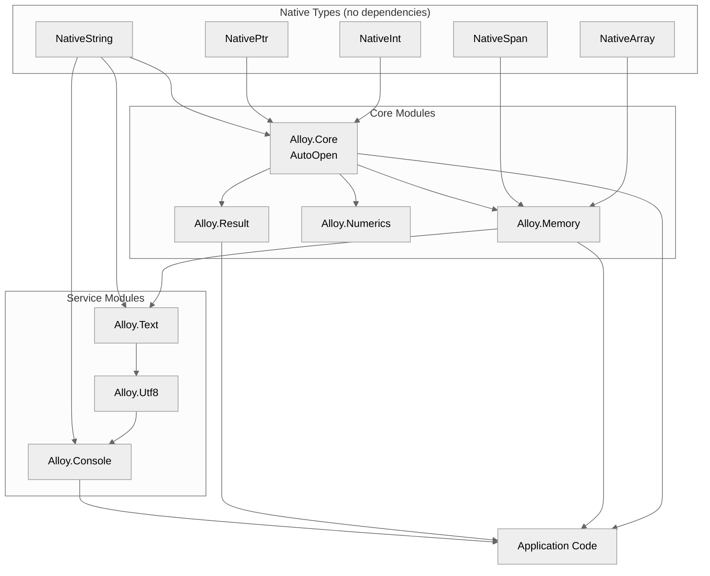

> This article was originally published on the
> [SpeakEZ Technologies blog](https://speakez.tech) as part of our early
> design work on the Fidelity Framework. It has been updated to reflect
> the Clef language naming and current project structure.

> **January 2026:** This article has been retired. Alloy's functionality has been absorbed into CCS (Clef Compiler Services) as compiler intrinsics. The code examples show early LLVM dialect usage in the MiddleEnd (fat pointer structs like `!llvm.struct<(ptr, i64)>`), which has been replaced with portable MLIR `memref` types (`memref<?xi8>` for strings). See [Absorbing Alloy](/docs/design/absorbing-alloy/) for the rationale and updated architecture.

The promise of functional programming has always been apparent: write code that expresses a process to an end result, not how the machine should perform those actions. Yet for decades, this elegance came with a tax - runtime overhead, garbage collection pauses, and the implicit assumption that "real" systems programming belonged to C and its descendants. The Fidelity Framework challenges this assumption by asking a different question:

> What if we could preserve Clef's expressiveness, safety and precision while compiling to native code that rivals hand-written C in efficiency?

## Zero-Cost Functional Programming

The Composer compiler represents the technical heart of the Fidelity Framework - a vision of how functional code becomes machine code. Unlike traditional F# compilation to .NET bytecode, Composer orchestrates a sophisticated lowering process through multiple intermediate representations, each preserving critical type information while progressively approaching native platform instructions.



What makes this approach revolutionary isn't just the elimination of runtime overhead - it's the preservation of Clef's rich type information throughout the compilation pipeline. Types guide optimization decisions, enable safety verifications, and ensure memory layouts match exactly what native code expects, all while compiling away to nothing in the final binary. This is what is meant by "zero cost abstraction". All of that structure is preserved throughout compilation until it's no longer needed at the final stages of "lowering".

## A Tale of Four Programs

To understand how Composer transforms functional elegance into native efficiency, let's follow four variations of a simple "Hello World" program. Each version introduces new challenges that reveal how the compiler handles increasingly sophisticated F# idioms - and more importantly, how Alloy's API design preserves familiar patterns while enabling native compilation.

### Level 1: Direct Module Calls

Our journey begins with `01_HelloWorldDirect.clef`, the minimal starting point:

```fsharp
module Examples.HelloWorldDirect

open Alloy

[<EntryPoint>]
let main argv =
    Console.WriteStr "Hello, World!"
    Console.WriteStrLn ""
    0
```

This stripped-down example tests the fundamental compilation pipeline: static string output with no variables, no input, no complex control flow. The `Console.WriteStr` and `Console.WriteStrLn` calls compile directly to system calls - `write()` on POSIX systems, appropriate syscalls on freestanding targets.

The simplicity is intentional. Before tackling complex functional patterns, the compiler must prove it can handle the basics: module resolution, function calls, string literals, and entry point generation. The MLIR output is correspondingly direct:

```mlir
func.func @main() -> i32 {
    %str = llvm.mlir.addressof @.str.hello : !llvm.ptr
    %len = arith.constant 13 : i64
    func.call @Console_WriteStr(%str, %len) : (!llvm.ptr, i64) -> ()
    // ... WriteStrLn for newline
    %zero = arith.constant 0 : i32
    return %zero : i32
}
```

Each F# expression maps directly to MLIR operations. String literals become global constants with known lengths - the fat pointer representation (`!llvm.ptr` + `i64` length) appears even at this basic level.

### Level 2: BCL-Sympathetic APIs

The second version, `02_HelloWorldSaturated.clef`, introduces user interaction with deliberately familiar APIs:

```fsharp
module Examples.HelloWorldSaturated

open Alloy

let hello() =
    Console.Write "Enter your name: "
    let name = Console.ReadLine()
    Console.WriteLine $"Hello, {name}!"

[<EntryPoint>]
let main argv =
    hello()
    0
```

This is where Alloy's design philosophy becomes visible. Notice the API: `Console.Write`, `Console.ReadLine`, `Console.WriteLine` - these mirror the BCL's `System.Console` exactly. An F# developer glancing at this code might not even realize it's targeting native compilation. That familiarity is intentional.

The term "saturated" refers to function application: all arguments are provided at once, no partial application or currying. `Console.WriteLine $"Hello, {name}!"` is a single, fully-applied call. This matters for compilation because saturated calls map directly to function invocations without closure creation.

Behind the familiar API, the implementation differs fundamentally:
- `Console.ReadLine()` returns a `NativeStr` (fat pointer), not a heap-allocated `System.String`
- The interpolated string `$"Hello, {name}!"` compiles to stack-based formatting
- No garbage collector involvement, no object headers, no virtual dispatch

```mlir
func.func @hello() {
    // Console.Write "Enter your name: "
    %prompt = llvm.mlir.addressof @.str.prompt : !llvm.ptr
    func.call @Console_Write(%prompt, %prompt_len) : (!llvm.ptr, i64) -> ()

    // let name = Console.ReadLine()
    %name = func.call @Console_ReadLine() : () -> !llvm.struct<(ptr, i64)>

    // Console.WriteLine with interpolation
    %format = llvm.mlir.addressof @.str.greeting : !llvm.ptr
    func.call @Console_WriteLine_Formatted(%format, %name) : (!llvm.ptr, !llvm.struct<(ptr, i64)>) -> ()
    return
}
```

The compiler translates BCL-like syntax to native-compatible operations while preserving the developer's mental model.

### Level 3: Pipelines and Native Types

`03_HelloWorldHalfCurried.clef` introduces F#'s beloved pipeline operator alongside explicit native type usage:

```fsharp
module Examples.HelloWorldHalfCurried

open Alloy
open Alloy.NativeTypes

let greet (name: NativeStr) : unit =
    Console.WriteLine $"Hello, {name}!"

let hello() =
    Console.Write "Enter your name: "

    Console.ReadLine()
    |> greet

[<EntryPoint>]
let main argv =
    hello()
    0
```

Two significant things happen here. First, the pipeline operator (`|>`) appears - F#'s signature syntax for flowing data through function chains. This is syntactic sugar for function application, but it represents idiomatic F# that any developer expects to work.

Second, and more subtly, `NativeStr` appears explicitly in the type annotation. Where Level 2 hid the native types behind BCL-like APIs, Level 3 shows them directly. The `greet` function declares it takes a `NativeStr` - signaling to both the compiler and the reader that this code knows it's working with native representations.

This is the "half-curried" pattern: we're using pipelines (a functional idiom) but each function is still fully applied at each step. `Console.ReadLine()` produces a `NativeStr`, which flows into `greet`, which formats and outputs it. No partial application, no closures - just data flowing through functions.

```mlir
func.func @greet(%name: !llvm.struct<(ptr, i64)>) {
    %format = llvm.mlir.addressof @.str.greeting : !llvm.ptr
    func.call @Console_WriteLine_Formatted(%format, %name) : (!llvm.ptr, !llvm.struct<(ptr, i64)>) -> ()
    return
}

func.func @hello() {
    %prompt = llvm.mlir.addressof @.str.prompt : !llvm.ptr
    func.call @Console_Write(%prompt, %prompt_len) : (!llvm.ptr, i64) -> ()

    %name = func.call @Console_ReadLine() : () -> !llvm.struct<(ptr, i64)>
    func.call @greet(%name) : (!llvm.struct<(ptr, i64)>) -> ()
    return
}
```

The pipeline compiles away entirely - it's just function calls in sequence. But the pattern validates that F#'s compositional style works with native types.

### Level 4: Full Functional Flow

The final version, `04_HelloWorldFullCurried.clef`, combines everything into idiomatic functional F#:

```fsharp
module Examples.HelloWorldFullCurried

open Alloy

let hello greetingFormat =
    use buffer = stackBuffer<byte> 256
    Prompt "Enter your name: "

    readInto buffer
    |> Result.map (fun length ->
        buffer.AsReadOnlySpan(0, length)
        |> spanToString)
    |> Result.defaultValue "Unknown Person"
    |> fun name -> sprintf greetingFormat name
    |> WriteLine

[<EntryPoint>]
let main argv =
    match argv with
    | [|greetingFormat|] -> hello greetingFormat
    | _ -> hello "Hello, %s!"

    0
```

This example pulls together everything: novel stack allocation (`stackBuffer<byte> 256`), the `use` binding for deterministic cleanup, `Result` type for error handling, lambda expressions, multiple pipeline stages, pattern matching on arrays, and parameterized formatting. While it doesn't look like code you'd write for a .NET F# application, all of the syntax is idiomatic F#.

Notice what *isn't* different. The `Result.map` and `Result.defaultValue` functions work exactly as they do in standard F#. The `sprintf` formatting works exactly as expected. The `use` binding ensures cleanup exactly as F# developers expect. Alloy preserves these idioms because they're essential to F#'s character - changing them would mean changing the language itself.

What does differ is the underlying implementation:
- `stackBuffer<byte> 256` allocates on the stack, not the heap - the `use` binding doesn't trigger GC finalization, it marks the end of the buffer's lifetime for the compiler's analysis
- `readInto buffer` returns a `Result<int, Error>` where both success and error cases are stack-allocated value types
- `buffer.AsReadOnlySpan(0, length)` creates a view without copying - just pointer arithmetic
- `spanToString` converts the span to a `NativeStr` fat pointer
- `sprintf` formats into a stack buffer, returning a `NativeStr`

The compilation challenge here is substantial:

1. **Lambda lifting**: The lambda `fun length -> buffer.AsReadOnlySpan(0, length) |> spanToString` closes over `buffer`. The compiler must either inline the lambda or lift it to a function with `buffer` as an explicit parameter - without heap-allocating a closure object.

2. **Result inlining**: `Result.map` and `Result.defaultValue` are higher-order functions. For native compilation, they should inline to eliminate function call overhead, transforming the pipeline into direct control flow.

3. **Stack lifetime**: The `buffer` is stack-allocated with a `use` binding. The compiler must prove that no references to the buffer escape beyond its lifetime - and if they do, that's a compile-time error, not a runtime crash.

4. **Pattern matching**: The `match argv with` on an array compiles to bounds checking and indexed access, not object-oriented virtual dispatch.

## Native Type Specifications: The Foundation

Before diving into static resolution patterns, it's worth understanding the fundamental types that make native compilation possible. Alloy defines a set of native types that differ fundamentally from their BCL counterparts - not as wrappers, but as entirely distinct representations designed for deterministic memory management. These types work in concert with [BAREWire](https://speakez.tech/blog/getting-the-signal-with-barewire/), our binary serialization framework that provides schema-driven memory layouts for cross-platform data exchange.

### Fat Pointers: A Different Memory Model

The most significant architectural decision in Alloy is the use of **fat pointers** - structures that combine a raw pointer with length metadata. This contrasts sharply with BCL types that carry object headers, GC tracking information, and virtual dispatch tables.

| Type | Alloy Representation | MLIR Type | BCL Equivalent |
|------|---------------------|-----------|----------------|
| **NativeStr** | `(nativeptr<byte>, int)` | `!llvm.struct<(ptr, i64)>` | `System.String` |
| **NativeArray<'T>** | `(nativeptr<'T>, int)` | `!llvm.struct<(ptr, i64)>` | `System.Array` |
| **NativeSpan<'T>** | `(nativeptr<'T>, int)` | `!llvm.struct<(ptr, i64)>` | `System.Span<'T>` |
| **NativePtr<'T>** | `nativeptr<'T>` | `!llvm.ptr` | `System.IntPtr` |

These aren't implementation details - they're the foundation of how Fidelity achieves zero-cost abstractions. A `NativeStr` is exactly 16 bytes on 64-bit systems: an 8-byte pointer and an 8-byte length. No object header, no method table pointer, no sync block. Just data.

```fsharp
// NativeStr in Alloy - a fat pointer struct
type NativeStr = {
    Pointer: nativeptr<byte>
    Length: int
}

// Operations compile to direct memory access
let inline length (s: NativeStr) = s.Length
let inline byteAt (i: int) (s: NativeStr) = NativePtr.get s.Pointer i
```

### Fixed-Width Integer Types

Alloy provides explicit type aliases that map directly to LLVM integer types:

```fsharp
type I8  = sbyte      // LLVM i8
type U8  = byte       // LLVM i8 (unsigned)
type I16 = int16      // LLVM i16
type U16 = uint16     // LLVM i16 (unsigned)
type I32 = int32      // LLVM i32
type U32 = uint32     // LLVM i32 (unsigned)
type I64 = int64      // LLVM i64
type U64 = uint64     // LLVM i64 (unsigned)
type ISize = nativeint   // Pointer-width signed
type USize = unativeint  // Pointer-width unsigned
```

These aren't just aliases for readability - they signal intent to the compiler about target-specific behavior. Operations like `popcount`, `clz` (count leading zeros), `ctz` (count trailing zeros), and saturating arithmetic compile directly to LLVM intrinsics.

### Type Validation: An Architectural Guarantee

The Composer compiler includes a validation pass that enforces native type compliance as a *compile-time architectural guarantee*. This isn't optional runtime checking - it's a hard gate that prevents compilation if non-native types leak into the code path.

**Allowed types** (native-compatible):
- All Alloy native types (`NativeStr`, `NativeArray<'T>`, `NativePtr<'T>`, etc.)
- F# primitives (`int`, `byte`, `bool`, `float`, etc.)
- `nativeptr<'T>`, `nativeint`, `voption`
- FSharp.Core.Operators and Microsoft.FSharp.NativeInterop

**Disallowed types** (require .NET runtime):
- `System.Object.*` methods
- `System.String.*` (except where Alloy provides shadows)
- `System.Console.*` (replaced by Alloy.Console)
- `System.Collections.*`
- Any `System.*` requiring runtime allocation or GC

When the validator encounters a disallowed type, compilation halts with a clear error. This isn't a limitation - it's a feature. The error indicates one of three things: Alloy is missing an implementation that needs to be added, user code is accidentally using BCL directly, or FCS resolved to BCL instead of Alloy's replacement. In each case, the fix is clear and the failure is early.

## Static Resolution in Alloy

A conscious design goal for Alloy is *API compatibility* with both the BCL and idiomatic F# patterns. When a developer writes `Console.WriteLine`, `Result.map`, or `sprintf`, they should get the behavior they expect. The innovation happens underneath - in the implementation, not the interface.

What many .NET developers don't realize is that F# already contains all the tools necessary to describe a "bare metal world" through features like `FSharp.NativeInterop`. The Alloy library leverages these capabilities to create a BCL-sympathetic foundation that compiles to native code with deterministic memory management. This is our "innovation budget" at work - preserving familiar idioms at the application level while embracing the broader spectrum of F# syntax for static resolution underneath.

Consider how dependencies flow through a typical Alloy application:



This dependency graph reveals the "iceberg model" in action. At the surface - the application code - we see familiar F# patterns: pipelines, Result types, and string formatting. But beneath that surface lies a layered architecture where native types form the foundation, core modules provide essential abstractions, and service modules deliver platform capabilities - all resolving statically at compile time.

### The Art of Static Resolution

The Alloy library demonstrates patterns that, while perfectly valid F#, aren't commonly seen in typical .NET applications:

```fsharp
// In Alloy.Core - Statically resolved operators
let inline (=) (x: ^T) (y: ^T) : bool
    when ^T : equality =
    FSharp.Core.Operators.(=) x y

// In Alloy.Memory - Stack-based buffer management
type INativeBuffer<'T when 'T : unmanaged> =
    abstract member Pointer : nativeptr<'T>
    abstract member Length : int
    abstract member Item : int -> 'T with get, set

// In Alloy.Numerics - Compile-time arithmetic resolution
let inline add (x: ^T) (y: ^T) : ^T
    when ^T : (static member (+) : ^T * ^T -> ^T) =
    x + y
```

These patterns leverage F#'s statically resolved type parameters (SRTPs) to ensure all operations resolve at compile time. No virtual dispatch, no interface lookups, no runtime type checks. Every operation compiles down to direct machine instructions.

### A BCL "Shadow" Shedding Light On Native

The Alloy library serves as a "shadow API" to familiar BCL operations. The goal isn't to flex on something new. Our design goal is to (as much as possible) provide the APIs developers already know while changing what happens "under the covers" at compile time:

```fsharp
// BCL style - looks the same, compiles differently
Console.WriteLine $"Hello, {name}!"   // Alloy: NativeStr, stack formatting
Console.Write "Enter your name: "     // Alloy: direct syscall
let input = Console.ReadLine()        // Alloy: NativeStr return

// F# idioms - preserved while applying to targets
result |> Result.map transform        // Alloy: inlined, no closure allocation
sprintf "Value: %d" count             // Alloy: stack buffer formatting
use buffer = stackBuffer<byte> 256    // Alloy: stack allocation with scope
```

The left side of these expressions looks like standard F#/.NET code. The difference is entirely in compilation - heap allocations often become stack or arena allocations, GC-tracked objects become fat pointers, runtime dispatch becomes direct calls.

Alloy will eventually emerge as Fidelity framework's full replacement for .NET Base Class Library capabilities, with an emphasis on deterministic memory management. We expect it to grow into a super-set of BCL APIs simply because of the remit for the Fidelity framework is much broader than .NET. Unlike the BCL's object-oriented hierarchy with its deep namespace nesting and heap-based abstractions, Alloy aspires to provide a flat, functional API where modules will map directly to system capabilities. This design philosophy extends throughout the framework, making common operations more discoverable while ensuring every function compiles to predictable native code with compile-time controlled allocation.

The current version of the Alloy library is organized in dependency order, with native types forming the foundation:

**Native Types (foundation layer - no dependencies)**
- `NativeInt` - Fixed-width integers with bit manipulation, overflow-checked and saturating arithmetic
- `NativePtr` - Type-safe pointer operations mapping directly to `!llvm.ptr`
- `NativeSpan` / `ReadOnlySpan` - Fat pointer views over contiguous memory
- `NativeArray` - Owned arrays as fat pointers `!llvm.struct<(ptr, i64)>`
- `NativeString` - UTF-8 strings as fat pointers, enabling stack-allocated string literals

**Core Modules (building on native types)**
- `Alloy.Core` - Fundamental operations with `ValueOption` (stack-allocated option) and basic operators
- `Alloy.Memory` - Stack-based memory management through `StackBuffer<'T>` types
- `Alloy.Numerics` - Type classes for arithmetic operations via SRTP constraints
- `Alloy.Math` - Mathematical operations through `Functions` and `Operators` submodules
- `Alloy.Text` - Zero-copy UTF-8 encoding, decoding, and string-to-bytes conversions
- `Alloy.Console` - Console I/O compiling to direct system calls with NativeStr support

**Specialized Modules**
- `Alloy.Binary` - Binary serialization operations
- `Alloy.UUID` - Native UUID implementation without BCL dependency
- `Alloy.Fsil` - Zero-cost SRTP operations for type-level computation

Each module carefully uses F# features that might seem esoteric to application developers but are essential for systems programming: inline functions, SRTPs, native pointers, and stack-allocated buffers with compile-time bounds checking.

Again, many of these modules and namespaces will be transparent to the developer at design time. Part of the role of this library structure is to provide the underlying compute graph to aid native compilation without significantly overrunning the "innovation budget" of developers at design time.

### Semantic Primitives: Intent Over Implementation

A key design principle in Alloy is expressing *intent* rather than *implementation*. Consider string concatenation:

```fsharp
// Semantic primitive - expresses intent
val concat : dest:nativeptr<byte> -> parts:NativeStr list -> NativeStr

// The compiler sees "concatenate these strings into this buffer"
// NOT "loop through bytes copying one at a time"
```

This distinction matters because the same high-level operation might compile to vastly different implementations depending on the target:
- On x86-64: vectorized `memcpy` with AVX instructions
- On ARM: NEON-optimized copy loops
- On embedded: simple byte-by-byte copy to minimize code size
- On systems with DMA: offloaded memory transfer

By capturing intent at the Alloy level, Composer (via the "Library of Alexandria" Alex component) can make target-aware optimization decisions that would be impossible if the code were already expressed as a single pattern.

### Output Kinds: From Console to Embedded

Native types enable Composer to target multiple output kinds without BCL dependency:

```fsharp
type OutputKind =
    | Console       // Standard console app - uses libc, main is entry point
    | Freestanding  // No libc - generates _start wrapper, exit syscall
    | Embedded      // Microcontroller target - no OS, custom startup
    | Library       // Shared/static library - no entry point
```

The same Alloy code compiles to all targets. A `NativeStr` is the same 16-byte fat pointer whether you're targeting a Linux server or an ARM Cortex-M microcontroller. What changes is how operations like `Console.WriteLine` are lowered - to libc `write()` on Console, to a raw syscall on Freestanding, or to UART output on Embedded.

Over time the community will help shape and expand these library modules into a proper balance of "shadow API" versus new convenience patterns for native compilation. The goal here isn't to make a replacement for .NET (or Fable for that matter). The objective of providing Alloy is to balance familiarity with new levels of accessibility to target a much wider variety of systems and compute architectures.

To be clear, "leaning into" F#'s origins makes sense in this early stage of the framework. When boundary cases become evident then the Composer compiler and Fidelity framework *writ large* will take on its own characterization of Clef that fits this emergent operational model. The idea is to do as much as possible to manage the "innovation budget" around this framework to ease adoption in what may *at first* be considered a radical departure from runtime-managed application design.

## The Guiding Hand: From AST to Silicon

What makes Composer unique isn't just that it compiles Clef to native code - it's how it guides the transformation through multiple representations via a [nanopass architecture](/docs/design/baker-saturation-engine/), each phase with explicit preconditions and postconditions:

### F# Compiler Services: Two Trees, One Truth

FCS produces two distinct representations: the *AST* (syntax tree capturing structural relationships) and the *typed tree* (FSharpExpr with fully resolved types). These aren't redundant - the AST knows what calls what and how expressions compose, while the typed tree knows the concrete type of every expression, which overload was selected, and importantly for Fidelity framework how SRTP constraints must be resolved.

The [Baker](/docs/design/baker-saturation-engine/) component correlates these representations, but the novel element is how Alloy's dependency structure and SRTP patterns create a *compute graph that maps directly to abstracted machine operations*. When Baker resolves an SRTP call like `Console.Write`, the dependency chain terminates at native types - `NativeStr`, `NativePtr`, stack buffers - not BCL abstractions. The resulting semantic graph (PSG) describes a computation where every node has a deterministic memory layout and every edge represents data flow through known-size values. There's no indirection through object headers, no runtime type dispatch, no GC roots to track - just operations on structures like fat pointers and fixed-width integers that lower directly to LLVM, and in the future, other back end targets.

### MLIR: Early Lowering Through Standard Dialects

Alex (the "Library of Alexandria" code generation component) currently focuses Baker's enriched PSG to emit MLIR via Alex using standard dialects - `func`, `cf`, `llvm`, `memref`, and others - rather than custom Clef dialects. This matters because it leverages MLIR's mature optimization infrastructure while representing Clef concepts through composition:

```mlir
// High-level: Clef concepts preserved using standard MLIR dialects
func.func @process_result(%input: !llvm.struct<(i1, i64, !llvm.ptr)>) -> !llvm.ptr {
  // Extract discriminator for Result type
  %is_ok = llvm.extractvalue %input[0] : !llvm.struct<(i1, i64, !llvm.ptr)>

  // Pattern match using control flow dialect
  cf.cond_br %is_ok, ^ok_case, ^error_case

^ok_case:
  %value = llvm.extractvalue %input[1] : !llvm.struct<(i1, i64, !llvm.ptr)>
  %template = llvm.mlir.addressof @.str.greeting : !llvm.ptr

  // Curried function represented as nested calls
  %buffer = memref.alloca() : memref<256xi8>
  %result = func.call @format(%template, %value, %buffer) : (!llvm.ptr, i64, memref<256xi8>) -> !llvm.ptr
  cf.br ^exit(%result : !llvm.ptr)

^error_case:
  %err_ptr = llvm.extractvalue %input[2] : !llvm.struct<(i1, i64, !llvm.ptr)>
  cf.br ^exit(%err_ptr : !llvm.ptr)

^exit(%final: !llvm.ptr):
  return %final : !llvm.ptr
}

// After lowering: Closer to machine representation
llvm.func @process_result(%input: !llvm.ptr) -> !llvm.ptr {
  // Load discriminator from Result struct
  %is_ok_ptr = llvm.getelementptr %input[0, 0] : (!llvm.ptr) -> !llvm.ptr
  %is_ok = llvm.load %is_ok_ptr : !llvm.ptr -> i1

  llvm.cond_br %is_ok, ^ok, ^error

^ok:
  %value_ptr = llvm.getelementptr %input[0, 1] : (!llvm.ptr) -> !llvm.ptr
  %value = llvm.load %value_ptr : !llvm.ptr -> i64
  %template = llvm.mlir.addressof @.str.greeting : !llvm.ptr

  // Direct sprintf call after currying is resolved
  %buffer = llvm.alloca %c256 x i8 : (i64) -> !llvm.ptr
  %formatted = llvm.call @sprintf(%buffer, %template, %value) : (!llvm.ptr, !llvm.ptr, i64) -> i32
  llvm.br ^exit(%buffer : !llvm.ptr)

^error:
  %err_ptr = llvm.getelementptr %input[0, 2] : (!llvm.ptr) -> !llvm.ptr
  %err = llvm.load %err_ptr : !llvm.ptr -> !llvm.ptr
  llvm.br ^exit(%err : !llvm.ptr)

^exit(%result: !llvm.ptr):
  llvm.return %result : !llvm.ptr
}
```

It also significantly simplifies the pipeline into LLVM, which is an early "pick your battles carefully" strategy we're still employing through this phase of work.

### LLVM: Where Abstractions Disappear

By the time MLIR lowers to LLVM IR, the transformation is complete: discriminated unions have become tagged structs, pattern matches are branch tables, curried functions are direct calls, and `NativeStr` fat pointers are just `{ptr, i64}` pairs. LLVM's mature optimization passes - inlining, vectorization, other transforms - can selectively improve what remains because the semantic heavy lifting happened in earlier phases. The type information that guided every transformation has done its job and compiled away to nothing.

## The Early Payoff: Zero-Cost Abstractions

The goal of this elaborate compilation pipeline isn't academic - it's to achieve something previously thought impossible: functional programming abstractions that produce efficient executables. When Composer successfully compiles the full curried HelloWorld, the resulting assembly code will be substantially similar to what a C compiler would produce for equivalent imperative code, full type and memory safety "for free" in an execution context. Of course as shown here F# provides many approaches to achieve a given goal, and the Fidelity framework seeks to preserve as many of those options as possible within the wide range of idioms available within the F# lexicon.

The end result? No runtime types to track. No "boxing" overhead. No heap allocations to wrangle. Just clean, memory-safe machine code that respects the metal while preserving the elegance of functional programming for the developer.

## Looking Forward: Beyond Hello World

These four HelloWorld examples represent more than variations on a theme - they're milestones on a deliberate progression. Each level tests specific compiler capabilities while demonstrating Alloy's commitment to preserving familiar patterns:

- **Level 1**: Direct module calls - validates basic compilation, string literals, and syscall generation
- **Level 2**: BCL-sympathetic APIs - proves that `Console.Write`, `Console.ReadLine`, `Console.WriteLine` work exactly as developers expect, with native implementations underneath
- **Level 3**: F# idioms with native types - confirms that pipelines, function composition, and explicit `NativeStr` usage integrate naturally
- **Level 4**: Full functional power - validates that `Result.map`, lambda expressions, pattern matching, and parameterized functions all compile to efficient native code

The progression is intentional. We don't ask developers to learn a new language or abandon familiar patterns. Instead, we meet them where they are: `Console.WriteLine` should just work. `Result.map` should just work. `sprintf` should just work. The complexity lives in Alloy and Composer, not in application code. This won't last forever, as hardware targeting eventually begs for optimized edge cases. But for as long as is practical, we're staying on an idiomatic path.

This is the innovation budget well spent - complexity where it matters (in the compiler and base libraries) to preserve simplicity (at least initially) where developers work daily. A Clef developer should within limits be able to write code that looks like an idiomatic Clef application and using Alloy expect it to compile to native binaries suitable for embedded systems, servers, or everything in between.

As we continue developing Composer, each challenge we overcome brings us closer to a future where choosing a technology stack isn't about trading expressiveness for performance. With the Fidelity framework, we're working to make having both a practical balance - with the same APIs, the same idioms, and the same mental model that Clef developers already enjoy. The journey from Clef to native code isn't about creating something new to learn. It's about making what developers already know work in places it couldn't go before.
