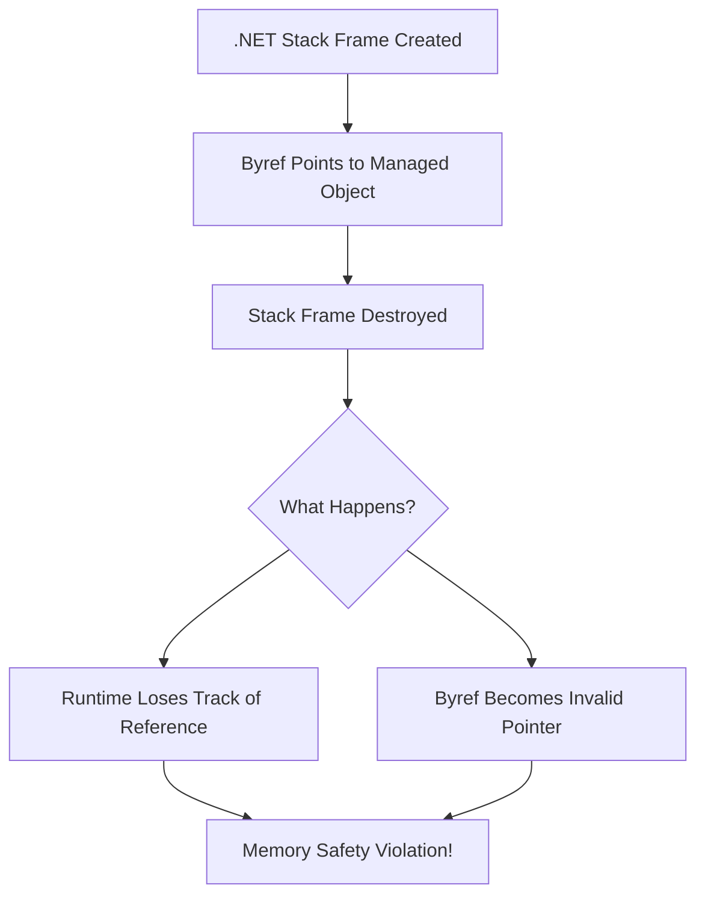
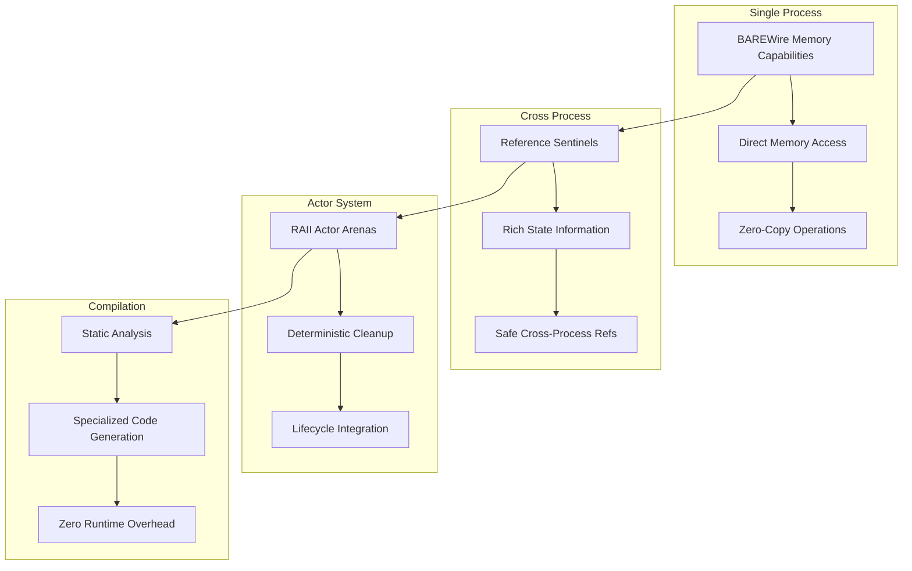
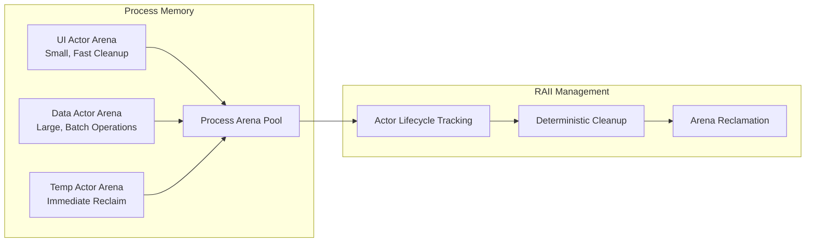
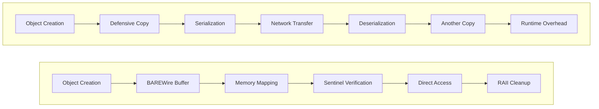

> This article was originally published on the
> [SpeakEZ Technologies blog](https://speakez.tech) as part of our early
> design work on the Fidelity Framework. It has been updated to reflect
> the Clef language naming and current project structure.

The "byref problem" in .NET represents one of the most fundamental performance bottlenecks in managed programming languages. While seemingly technical, this limitation cascades through entire application architectures, not only hijacking developer productivity but also forcing them into defensive copying patterns that can devastate performance in memory-intensive applications. The Fidelity framework doesn't just solve this problem; our designs transform the limitation into the foundation for an entirely new approach to systems programming that maintains expressive elegance while delivering hardware-level performance.

## Byref Restrictions in .NET

This situation currently exists in .NET because of a fundamental mismatch between how developers want to work with memory and how managed runtimes need to track object lifetimes. The core issue stems from .NET's requirement that all references must be trackable by the runtime for memory safety.

Consider this seemingly simple scenario that demonstrates the core limitation:

```fsharp
// This works fine - byref stays within the same stack frame
let processArrayInPlace (arr: int[]) =
    for i = 0 to arr.Length - 1 do
        let mutable item = &arr.[i]  // byref to array element
        item <- item * 2             // modify in place

// But this doesn't compile - trying to "escape" the byref
let getBiggestElementRef (arr: int[]) =
    let mutable maxIndex = 0
    for i = 1 to arr.Length - 1 do
        if arr.[i] > arr.[maxIndex] then
            maxIndex <- i
    &arr.[maxIndex]  // ERROR: Cannot return a byref from this function
```

The compiler rejects the second example because byref values cannot outlive their creating stack frame. This isn't an arbitrary restriction; it's a necessary limitation in managed runtimes. Byref values are essentially raw pointers that exist only on the stack. If you could store a byref in a heap object or return it from a function, you'd create interior pointers that the runtime cannot safely track.



## The Performance Cascade

The byref restriction forces developers into defensive copying patterns that can cripple performance in real-world applications. This problem becomes particularly acute in three scenarios: large data structures, async operations, and high-frequency updates.

### Large Data Structures

```fsharp
// Performance problem: Unnecessary copying in financial computing
type LargeStruct = {
    Data: float[]   // Imagine this is 1MB of market data
    Metadata: Map<string, obj>
}

// You want to modify the struct in place, but can't get a safe byref
let updateStruct (large: LargeStruct) (newValue: float) =
    // Forced to copy the entire structure
    { large with Data = Array.copy large.Data |> Array.map (fun x -> x + newValue) }

// What you really wanted was direct modification
let updateStructInPlace (large: byref<LargeStruct>) (newValue: float) =
    // This would be ideal but isn't safely possible in .NET
    for i = 0 to large.Data.Length - 1 do
        large.Data.[i] <- large.Data.[i] + newValue
```

### The Async Amplification Effect

The byref problem becomes particularly acute with async code because async transformations in .NET create state machines that live on the heap:

```fsharp
// This doesn't work because async creates a heap-allocated state machine
let asyncProcessArray (arr: int[]) = async {
    let elementRef = &arr.[0]  // ERROR: Cannot capture byref in async
    do! Async.Sleep(100)       // State machine needs to store everything
    elementRef <- 42           // byref can't be stored in heap object
}

// So you're forced to use indices instead of direct references
let asyncProcessArrayWithIndex (arr: int[]) = async {
    let index = 0              // Store index instead of reference
    do! Async.Sleep(100)
    arr.[index] <- 42          // Dereference using index - extra indirection
}
```

This pattern forces developers to pass indices around instead of direct memory references, adding indirection overhead and making code more error-prone.

## Fidelity's Revolutionary Solution

The Fidelity framework solves the byref problem through a sophisticated multi-layered approach that fundamentally changes the relationship between memory lifetime and access permissions. Rather than treating this as a single technical challenge, Fidelity recognizes that the byref problem manifests differently at different scales of system architecture.



### Layer 1: Capability-Based Memory Management

BAREWire solves the byref problem within a single address space by fundamentally changing the relationship between memory lifetime and access permissions. Instead of the CLR's "lifetime equals accessibility" model, BAREWire uses a capability-based approach that separates buffer ownership from access rights.

```fsharp
// BAREWire separates buffer lifetime from access capabilities
let processLargeData() =
    // Create a buffer with explicit lifetime management
    let buffer = BAREWire.createBuffer<LargeStruct> 1

    // Get a capability that can be passed around safely
    let writeCapability = buffer.GetWriteAccess()

    // This capability can be passed to async functions!
    let processAsync (capability: WriteCapability<LargeStruct>) = async {
        do! Async.Sleep(100)  // State machine on heap is fine

        // Direct memory access without copying
        let struct = capability.GetDirectAccess()
        struct.UpdateInPlace(newValue)  // Zero-copy modification

        return capability  // Can even return capabilities!
    }

    // Compose operations without fear of the byref problem
    let result = async {
        let! cap1 = processAsync writeCapability
        let! cap2 = processOtherData cap1
        return cap2
    }
```

BAREWire tracks buffer ownership separately from access permissions. The buffer itself has an explicit lifetime managed through scope analysis, while capabilities can be safely passed around, stored in heap objects, and used in async contexts.

#### Hardware-Enforced Safety

BAREWire maintains memory safety through hardware memory protection rather than runtime tracking:

```fsharp
// Buffer ownership is explicit and transferable
let buffer = BAREWire.createBuffer<float> 1024

// Create multiple access capabilities with different permissions
let readOnlyAccess = buffer.GetReadAccess()
let writeAccess = buffer.GetWriteAccess()

// Share with another process via memory mapping
let sharedAccess = buffer.ShareWithProcess(targetProcessId)

// The compiler automatically handles cleanup at scope boundaries
// through delimited continuations - no manual disposal needed
```

This approach provides the memory safety guarantees developers expect from F#, but through hardware enforcement rather than runtime restrictions.

### Layer 2: Sentinels for Cross-Process Safety

Where BAREWire solved the byref problem within a single address space, Reference Sentinels solve the distributed version: how do you safely reference resources across process boundaries when those processes might terminate, restart, or become unreachable?

Traditional systems use null references, but Sentinels provide rich state information about why a reference might be invalid:

```fsharp
// Traditional approach: null references tell you nothing
let tryCallActor (actorRef: ActorRef option) message =
    match actorRef with
    | Some actor -> actor.Tell(message)  // Might fail at runtime
    | None -> ()  // But why is it None? Process crashed? Network issue?

// Sentinel approach: Rich failure information
let callActorWithSentinel (actorRef: ActorRef) message =
    match actorRef.Sentinel with
    | None ->
        actorRef.Tell(message)

    | Some sentinel ->
        // Cross-process - verify through sentinel
        match verifySentinel sentinel with
        | Valid ->
            // Actor is confirmed alive and reachable
            BAREWire.send sentinel.TargetProcessId message

        | Terminated ->
            // Actor terminated cleanly - handle gracefully
            DeadLetterOffice.Tell(ActorTerminated(actorRef, message))

        | ProcessUnavailable ->
            // Process is down - might restart, queue for retry
            RetryQueue.Schedule(actorRef, message, TimeSpan.FromSeconds(5.0))

        | Unknown ->
            // Cannot determine state - investigate or fail fast
            handleAmbiguousState actorRef message
```

#### Batch Verification for Performance

One of the most innovative aspects of the Sentinel system is batch verification, which solves a classic distributed systems problem: you want to verify references frequently for safety, but individual verification calls create too much overhead:

```fsharp
// Batch verification reduces IPC calls dramatically
let efficientApproach actors messages =
    // Group by target process
    let byProcess =
        List.zip actors messages
        |> List.groupBy (fun (actor, _) -> actor.Sentinel.TargetProcessId)

    // Single IPC call per process
    for processId, actorMessages in byProcess do
        let sentinels = actorMessages |> List.map (fun (actor, _) -> actor.Sentinel)
        let results = BAREWire.batchVerifyActors processId sentinels

        // Update all sentinels and deliver messages
        for (actor, message), state in List.zip actorMessages results do
            actor.Sentinel.State <- state
            actor.Sentinel.LastVerified <- getCurrentTimestamp()

            match state with
            | Valid -> deliverMessage actor message
            | _ -> handleFailedDelivery actor message
```

This batch approach means you can have thousands of cross-process references while making only a handful of verification calls.

### Layer 3: RAII-Based Actor Memory Management

The integration of RAII principles with the actor model represents perhaps the most sophisticated aspect of Fidelity's approach to the byref problem. Rather than relying on runtime memory scanning, RAII provides deterministic memory management where each actor's lifecycle directly controls its memory region.



#### Process-Actor Memory Architecture

Each process manages a pool of arenas with RAII semantics, allocating dedicated arenas to actors based on their workload characteristics:

```fsharp
// Each process gets arenas configured for its workload
let createProcessWithOptimizedArenas workloadType =
    let arenaConfig = match workloadType with
                    | UIWorkload -> {
                        ArenaSize = 50 * MB
                        PoolSize = 10  // Multiple small arenas
                        AllocationStrategy = FastRelease
                        CleanupTrigger = OnActorTermination
                    }
                    | DataWorkload -> {
                        ArenaSize = 500 * MB
                        PoolSize = 4   // Fewer large arenas
                        AllocationStrategy = BulkOperations
                        CleanupTrigger = OnArenaFull
                    }
                    | RealtimeWorkload -> {
                        ArenaSize = 8 * MB
                        PoolSize = 20  // Many tiny arenas
                        AllocationStrategy = Predictable
                        CleanupTrigger = Immediate
                    }

    Arena.createProcessPool arenaConfig
```

#### Actor Arena Management with RAII

Within each process, actors receive dedicated arenas that are automatically cleaned up when the actor terminates:

```fsharp
module RAIIActorIntegration =
    type PaymentProcessor() =
        inherit Actor<PaymentMessage>()

        // RAII collections allocated in actor's arena
        let transactionCache = Dictionary<TransactionId, Transaction>()

        override this.Receive message =
            match message with
            | ProcessPayment payment ->
                // Allocation happens in actor's arena automatically
                let validated = validatePayment payment
                transactionCache.[payment.Id] <- validated

        // No disposal code needed - the compiler handles all cleanup
        // through delimited continuations at actor termination
```

The RAII approach ensures that when an actor terminates, its entire memory arena is immediately reclaimed without any scanning or collection pauses. This provides predictable performance and eliminates the overhead of runtime memory management, all handled automatically by the compiler.

### Layer 4: Static Compilation and Zero-Runtime Optimization

The final layer of Fidelity's byref solution involves compile-time transformation that eliminates runtime overhead entirely. The Composer compiler analyzes actor topologies and generates specialized memory management code for each application:

```fsharp
// What you write: Simple actor code
type DataProcessor() =
    inherit Actor<DataMessage>()

    let mutable cache = Map.empty<string, ProcessedData>

    override this.Receive message =
        match message with
        | Process data ->
            let result = performComplexProcessing data
            cache <- Map.add data.Id result cache

// The compiler automatically:
// 1. Identifies actor lifetime boundaries
// 2. Inserts arena allocation in the MLIR lowering
// 3. Adds cleanup at actor termination points
// 4. Optimizes based on static analysis
// All invisible to the developer!
```

This compilation strategy provides sophisticated memory management without runtime overhead. The compiler generates optimal RAII code based on static analysis of actor behavior patterns, with all cleanup handled through delimited continuations and scope analysis.

## Solving the Byref Problem with the Native Type System

While the full Fidelity stack represents a revolutionary approach to memory management, developers may wonder if it's possible to solve the byref problem within the constraints of the current F# compiler. The answer is yes, and the native type system already demonstrates a viable path forward without requiring any F# compiler modifications.

### Region-Based Memory Management

The region-based type system using F#'s units of measure already provides a mechanism to enforce memory safety without relying on byref restrictions:

```fsharp
// Define region types using F# units of measure
[<Measure>] type heap
[<Measure>] type stack

// Memory operations with region safety
let updateWithCapability (mem: Memory<int, 'region>) (idx: int<offset>) (value: int) =
    Memory.write mem idx value  // Can be captured safely in closures
```

This approach provides the same performance characteristics as direct byref usage while enabling functional composition patterns that byrefs prohibit.

### Safe Capabilities with Standard F#

The capability pattern from BAREWire can be implemented using F#'s struct types and static resolution:

```fsharp
// Core capability type implemented as a struct
type WriteCapability<'T, 'region> = struct
    val private buffer: Memory<'T, 'region>

    // Direct access methods that pass F# compiler checks
    member this.Modify(f: 'T -> 'T) : unit =
        let current = Memory.read this.buffer 0<offset>
        Memory.write this.buffer 0<offset> (f current)
end

// Extension methods for memory access
type Memory<'T, 'region> with
    member this.GetWriteAccess() : WriteCapability<'T, 'region> =
        WriteCapability<'T, 'region>(buffer = this)

    // Safe functional composition pattern
    member this.WithWriteAccess<'R>(f: WriteCapability<'T, 'region> -> 'R) : 'R =
        let capability = this.GetWriteAccess()
        f capability
```

We see this design as compatible with the standard F# compiler while providing the essential capabilities of BAREWire. Of course "the proof of the pudding is in the eating" so we'll make assessments and adjustments as our designs meet reality.

### Async-Safe Memory Operations

One of the biggest challenges with byrefs is their incompatibility with async code. CCS solves this by encapsulating the operation rather than the reference:

```fsharp
// This works with standard F# - no special compiler needed
let asyncModifyMemory (mem: Memory<int, 'region>) = async {
    // No byref needed - we capture the memory capability instead
    let capability = mem.GetWriteAccess()

    do! Async.Sleep(100)  // Can safely yield without losing reference

    // When we resume, we still have safe access
    capability.Modify(fun x -> x + 1)
}
```

Combined with Composer's compilation pipeline, these patterns compile down to the same efficient code as direct memory manipulation would, but with the safety and composability that F# developers expect.

## Potential F# Language Evolution

While the native type system demonstrates that we can solve the byref problem with standard F# today, we also recognize the value of enhancing the F# language itself to better support these patterns. We're considering submitting an RFC (Request for Comments) to the F# language design process that would propose extensions to F#'s type system to better accommodate capability-based memory safety.

Such an RFC would propose:

1. Explicit compiler recognition of capability types for byrefs
2. Extended safety checking that understands the guarantees provided by the capability pattern
3. Potential syntax sugar to reduce boilerplate in common patterns

This approach would maintain backward compatibility while enhancing F#'s ability to express high-performance memory access patterns safely.

## Eliminating the Copy Tax

The combined effect of these solutions is dramatic. Traditional distributed systems face a constant "copy tax" where every boundary crossing requires data serialization. Fidelity's approach eliminates this tax:



The performance difference becomes exponential with data size and system complexity. Where traditional systems might make 4-6 copies of data for a single service call, Fidelity systems can operate with zero copies while maintaining stronger safety guarantees.

## A Complete Solution to the Byref Problem

The Fidelity framework solves the byref problem through a comprehensive set of complementary techniques that work together across all scales of system architecture:

### Core Techniques Used:

**1. Capability-Based Memory Management (BAREWire)**
- Separates buffer lifetime from access permissions
- Enables safe passage of memory access through async boundaries
- Uses hardware memory protection for enforcement
- Supports zero-copy operations within address spaces

**2. Reference Sentinels**
- Provides rich state information for cross-process references
- Eliminates the need for null references in distributed systems
- Enables batch verification for performance optimization
- Supports sophisticated failure handling strategies

**3. RAII-Based Actor Memory Management**
- Provides deterministic memory cleanup tied to actor lifecycles
- Eliminates runtime overhead through immediate arena reclamation
- Coordinates actor termination with memory release automatically
- Enables predictable performance without collection pauses

**4. Static Compilation and Specialization**
- Analyzes actor topologies at compile time
- Generates specialized memory management code
- Eliminates runtime overhead through compile-time transformation
- Provides zero-runtime memory safety guarantees

**5. Process Architecture Design**
- Organizes actors into processes with appropriate memory strategies
- Enables fault isolation while maintaining efficient communication
- Supports scaling from embedded to distributed deployments
- Coordinates memory management across process boundaries

**6. Hardware Integration**
- Leverages memory mapping for zero-copy data sharing
- Uses hardware memory protection for safety enforcement
- Exploits processor features for efficient memory management
- Provides deterministic performance characteristics

### Revolutionary Impact

This multi-layered approach doesn't just solve the byref problem; it transforms it into a performance and competitive advantage. Applications built with the Fidelity framework can:

- **Eliminate defensive copying** that plagues traditional .NET applications
- **Scale efficiently** from embedded devices to distributed clusters
- **Maintain safety guarantees** without runtime overhead
- **Achieve predictable performance** through deterministic memory management
- **Compose complex systems** without accumulating performance debt

"The byref problem", which has constrained .NET developers for decades, becomes the foundation for a new paradigm in systems programming where expressive elegance meets hardware-level performance. This represents nothing less than a transformation of Clef into a true systems programming platform, capable of competing with C and Rust while maintaining the safety and expressiveness that makes F# such a powerful foundation for building robust, maintainable systems.

Through careful design and innovative compilation techniques, the Fidelity framework demonstrates that Clef code can run efficiently everywhere, from embedded sensors to distributed cloud services, without compromise.
