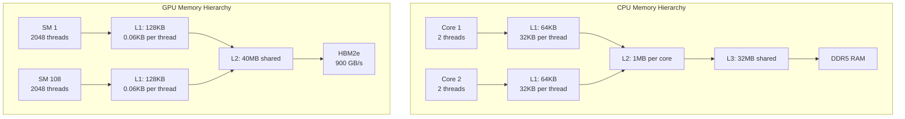
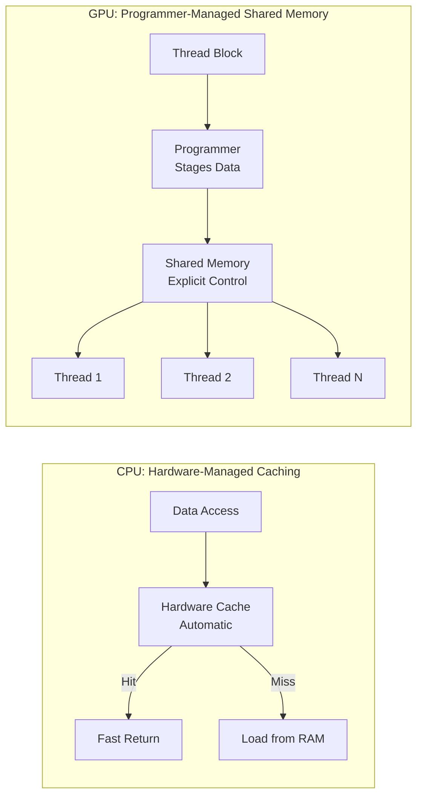
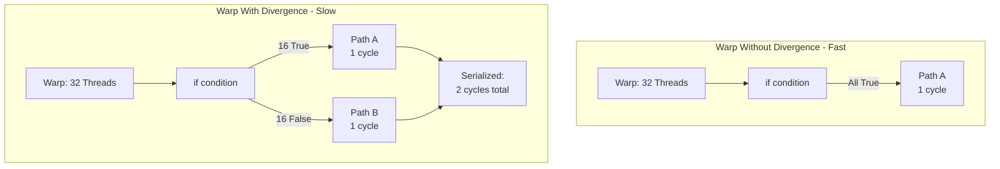
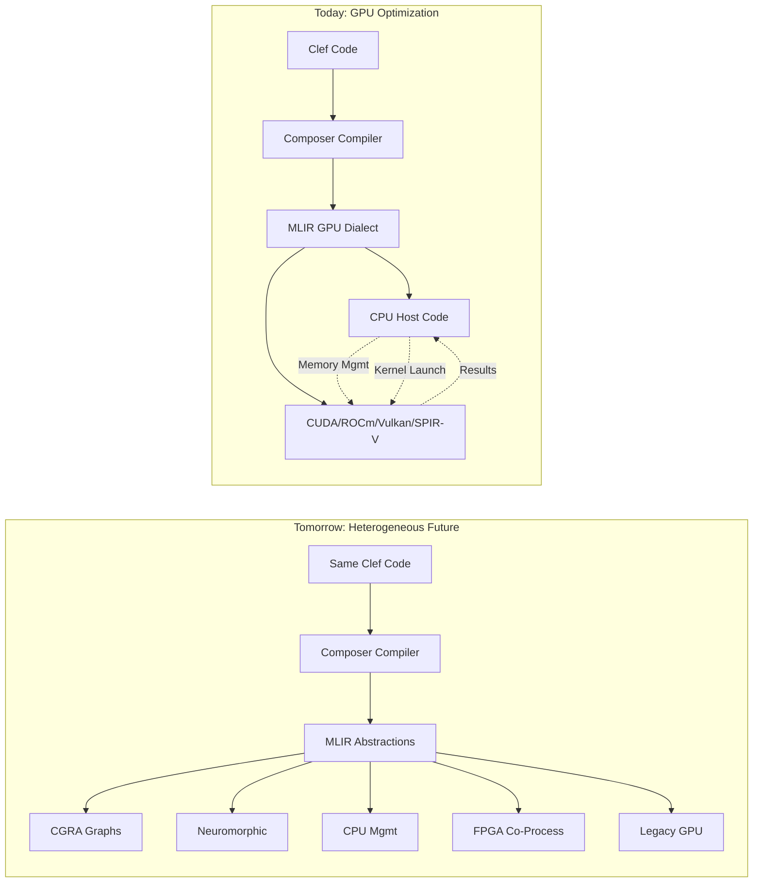

> This article was originally published on the
> [SpeakEZ Technologies blog](https://speakez.tech) as part of our early
> design work on the Fidelity Framework. It has been updated to reflect
> the Clef language naming and current project structure.

As we explored in our [companion piece on CPU cache optimization](https://speakez.tech/blog/cache-aware-compilation-cpu/), the Composer compiler is being designed to perform sophisticated transformations that would align Clef code with hardware memory hierarchies. When we consider GPU architectures, we encounter a fundamentally different memory landscape that would require equally different optimization strategies.

While GPUs currently dominate parallel computing workloads, we view them as a necessary bridge to more efficient architectures. As discussed in ["The Uncomfortable Truth of Comfortable Dysfunction"](https://speakez.tech/blog/uncomfortable-truth/), the industry's reliance on GPU architectures represents both a practical reality we must address and an architectural compromise we're working to transcend. This exploration examines how Composer could adapt to these challenges while maintaining our vision of unified heterogeneous computing that extends beyond current limitations.

## Understanding the GPU Memory Challenge

To appreciate why GPU memory optimization would differ so fundamentally from CPU optimization, we need to understand what makes GPUs unique. While a modern CPU might have 8 to 64 cores, each optimized for sequential performance with sophisticated branch prediction and out-of-order execution, a GPU contains thousands of simpler cores designed for parallel execution of identical operations.

Consider an NVIDIA A100 GPU: it contains 6,912 CUDA cores organized into 108 Streaming Multiprocessors. Each multiprocessor can manage up to 2,048 concurrent threads. This massive parallelism creates memory access patterns unlike anything we see in CPU programming. Where a CPU cache miss might stall one or two threads, poor memory access patterns on a GPU can cripple thousands of threads simultaneously.



The memory hierarchy itself reflects these different design goals. A CPU's L1 cache might be 32-64KB per core, optimized for low latency with sophisticated prefetching. A GPU's L1 cache is similarly sized at 128KB per multiprocessor, but it serves potentially 2,048 threads rather than one or two. This radically different ratio of cache to active threads means that traditional caching strategies often fail completely on GPUs.

Recent architectures have improved this situation somewhat. NVIDIA's Hopper architecture (H100) expanded L2 cache to 50MB and introduced the Transformer Engine with dedicated tensor memory accelerator paths. The trend continues toward larger caches and smarter prefetching, but the fundamental ratio problem remains: GPUs trade per-thread cache capacity for thread count.

More intriguingly, GPU architects recognized this limitation and added a programmer-controlled cache called "shared memory" that can be explicitly managed by kernels. This shared memory, which sits at the same level as L1 cache, can be configured to be larger or smaller depending on the workload's needs. It's a recognition that automatic caching often fails for highly parallel workloads and that giving programmers explicit control can yield better results.

These architectural characteristics - the massive thread count, the limited cache per thread, the need for explicit memory management - stem from GPUs' origins as graphics processors rather than general-purpose compute devices. The von Neumann architecture at their core, with its fundamental separation of memory and compute, creates inherent inefficiencies that no amount of optimization can fully overcome. Data must constantly move between memory and compute units, consuming energy and time. As we explore in ["Escaping the Steamcar Era"](https://speakez.tech/blog/escaping-the-steamcar-era/), these movement costs increasingly dominate both performance and power consumption in modern AI workloads.

### A Different Coherency Model

One distinction between CPU and GPU memory hierarchies deserves explicit attention: GPUs do not suffer from false sharing in the same way CPUs do.

On a CPU, false sharing occurs when independent data items reside on the same cache line and different cores modify them concurrently. The MESI protocol invalidates the entire cache line on each modification, causing coherency traffic that devastates performance. This problem emerges from the MIMD (Multiple Instruction Multiple Data) execution model where each core operates independently.

GPUs employ SIMT (Single Instruction Multiple Thread) execution. A warp of 32 threads executes the same instruction in lockstep. They cannot simultaneously write to the same memory location because they execute the same instruction on different data elements. Different warps process different regions of data by design; the programming model itself prevents the access patterns that cause CPU false sharing.

This does not mean GPU memory access is simple. The problems are different: non-coalesced access patterns (addressed in the next section), shared memory bank conflicts, warp divergence on conditional branches, and occupancy limitations from register pressure. These pathologies require different analysis and different solutions than CPU cache optimization.

The Composer compiler's GPU analysis focuses on these GPU-specific concerns rather than attempting to apply CPU cache intuitions. BAREWire's deterministic layouts enable static analysis of coalescing patterns, while Composer's control flow analysis identifies potential warp divergence. The underlying principles transfer: compile-time analysis of access patterns produces runtime performance. The specific patterns differ entirely.

This architectural difference has implications for code portability. C and C++ code written with CPU assumptions about cache coherency can fail subtly when ported to GPU execution. The programmer's mental model, shaped by years of CPU development, leads them astray. CUDA and OpenCL provide warnings and best practices, but nothing in the type system prevents the errors. Our designs lead us toward explicit memory space annotations in the type system, making it impossible to accidentally apply CPU coherency assumptions to GPU memory. The compiler catches what experience alone cannot.

## The Coalescing Imperative

Perhaps the most critical difference between CPU and GPU memory optimization is the concept of memory coalescing. When 32 GPU threads (a "warp" in NVIDIA terminology) execute in lockstep, their memory accesses can either be combined into a single transaction or fragment into many separate ones.

Imagine 32 threads each reading a single floating-point value. If these values are consecutive in memory, the hardware can fetch all 32 values in a single 128-byte transaction. But if each thread reads from a random location, the hardware might need 32 separate transactions, reducing memory bandwidth by 32x. This is why data layout transformation would become so critical for GPU performance in our design.

```fsharp
// CPU-friendly: Array of structures (good cache locality per item)
type Particle = { X: float32; Y: float32; Z: float32; Mass: float32 }
let particles: Particle array = Array.init 1000000 (fun i -> ...)

// Processing on CPU - excellent cache usage
let updateCPU (particles: Particle array) =
    particles |> Array.map (fun p ->
        { p with X = p.X + 0.1f })  // All particle data in cache line

// GPU-friendly: Structure of arrays (coalesced memory access)
type ParticlesSOA = {
    X: float32 array
    Y: float32 array
    Z: float32 array
    Mass: float32 array
}

// Processing on GPU - coalesced memory access
// Thread 0 reads X[0], Thread 1 reads X[1], etc. - single transaction
let updateGPU (particles: ParticlesSOA) =
    particles.X |> Array.mapi (fun i x -> x + 0.1f)
```

The Composer compiler would recognize these patterns in Clef code and transform data structures accordingly. When it encounters an array of records being processed in parallel, it might transform this "array of structures" into a "structure of arrays," ensuring that when parallel threads access fields, they hit consecutive memory locations. This transformation, which would provide marginal benefits on a CPU, could improve GPU performance by orders of magnitude.

It's worth noting that the need for such elaborate transformations is itself a symptom of the von Neumann bottleneck. In a dataflow architecture where computation moves to data rather than data to computation, coalescing becomes irrelevant. But while GPUs remain dominant, these optimizations remain necessary for achieving acceptable performance.

## Shared Memory Programming Model

The concept of explicitly managed shared memory represents a fundamental departure from CPU programming models. On a CPU, the hardware manages cache entirely; programmers have little direct control beyond access patterns. On a GPU, shared memory acts as a programmer-controlled cache that can dramatically accelerate algorithms with data reuse.



Consider a convolution operation, common in image processing and neural networks. Each output pixel depends on multiple input pixels in a neighborhood. If each thread independently loads these pixels from global memory, we'll reload the same data many times. By collaboratively loading data into shared memory, threads can share data efficiently.

```fsharp
// CPU approach - relies on hardware caching
let convolveCPU (image: float32[,]) (kernel: float32[,]) =
    Array2D.mapi (fun y x ->
        let mutable sum = 0.0f
        for dy in -1..1 do
            for dx in -1..1 do
                // Hardware cache hopefully has image[y+dy, x+dx]
                sum <- sum + image.[y+dy, x+dx] * kernel.[dy+1, dx+1]
        sum) image

// GPU approach - explicit shared memory staging
let convolveGPU_concept (blockDim: int) =
    // Conceptual - Composer would generate this pattern
    """
    __shared__ float tile[18][18];  // Block size + borders

    // Collaborative load - all threads in block participate
    int tid = threadIdx.y * blockDim + threadIdx.x;
    if (tid < 18*18) {
        tile[tid/18][tid%18] = image[...];
    }
    __syncthreads();  // Ensure all data loaded

    // Now compute using shared memory - 100x faster than global
    float sum = 0;
    for(dy = -1; dy <= 1; dy++)
        for(dx = -1; dx <= 1; dx++)
            sum += tile[ty+dy][tx+dx] * kernel[dy+1][dx+1];
    """
```

Our vision for Composer includes identifying these opportunities for shared memory optimization by analyzing data access patterns. When it detects that multiple threads would access overlapping data regions, it could generate code that stages data through shared memory. This wouldn't be just a simple optimization; it would require coordinating threads to load data collaboratively and inserting synchronization barriers to ensure data is available before use.

### GPU Memory Ordering

Memory ordering on GPUs differs fundamentally from CPU models. Where CPUs provide strong ordering guarantees (x86's TSO model, for instance, ensures stores become visible in program order), GPUs employ a relaxed memory model where writes may become visible to other threads in any order unless explicit barriers enforce ordering.

CUDA provides several fence primitives:

- `__syncthreads()`: Barrier synchronization within a thread block; all threads in the block must reach this point before any proceed, and all writes become visible to all threads in the block
- `__threadfence_block()`: Memory fence within a thread block; ensures prior writes are visible to subsequent reads in the same block
- `__threadfence()`: Device-wide memory fence; ensures prior writes are visible to all threads on the device
- `__threadfence_system()`: System-wide fence including host memory; required for CPU-GPU synchronization

The weaker memory model reflects GPU architecture priorities. Thousands of threads cannot efficiently maintain the strict ordering guarantees that CPUs provide for a handful of cores. Instead, the programming model pushes synchronization decisions to the programmer or, in our case, to the compiler.

Composer's generated GPU code inserts appropriate fences based on data dependency analysis. When code writes data that another thread block will read, the compiler generates the necessary `__threadfence()` calls. This automatic fence insertion distinguishes Fidelity from raw GPU programming where missing fences cause subtle, hardware-dependent bugs. The compiler knows the access patterns from BAREWire's deterministic layouts; it can determine precisely where ordering constraints apply.

C++ Parallel STL and SYCL face this challenge directly: how do you provide portable abstractions over fundamentally different memory models? The current answer involves extensive documentation, careful programming, and hope. Race conditions that cannot occur on CPU due to strong ordering become possible on GPU with its relaxed model. We anticipate that Fidelity's approach, with memory ordering semantics encoded in the type system and appropriate fences inserted automatically by the compiler, will eliminate this class of portability bugs. The same Clef code compiles correctly for both targets because the compiler knows what each target requires.

## The Symphony of CPU and GPU Cooperation

Modern computing increasingly involves CPU and GPU working in concert, which introduces another layer of complexity. Data must move between CPU and GPU memory spaces, and this movement often becomes the bottleneck that dominates performance.

This is where our planned work on [zero-copy memory architectures](https://speakez.tech/blog/next-generation-memory-coherence/) would become crucial. Technologies like NVIDIA's Unified Memory, AMD's heterogeneous system architecture (HSA), and emerging standards like CXL (Compute Express Link) are breaking down the walls between CPU and GPU memory spaces. Composer is being designed to leverage these capabilities when available while gracefully falling back to explicit memory transfers when necessary.

When Composer analyzes a Clef async workflow, it wouldn't just look for parallelism; it would look for opportunities to overlap computation and communication. A sophisticated transformation might split a computation pipeline so that while the GPU processes one batch of data, the CPU prepares the next batch, and previously completed results transfer back to CPU memory. This orchestration, which would be hidden behind Clef's elegant async abstractions, could achieve near-perfect utilization of both CPU and GPU resources.

### The Actor Model Advantage

The actor model provides a coherent framework for heterogeneous computing that neither raw GPU programming nor systems like Rust's borrow checker can match.

Consider the challenge: data must flow between CPU and GPU, potentially across multiple GPUs, while maintaining correctness guarantees. Traditional approaches require explicit memory management at every boundary. Rust's borrow checker provides memory safety but cannot reason about GPU memory; developers manually track which data resides where and when transfers occur. CUDA's unified memory provides automatic migration but sacrifices control and predictability.

Fidelity's actor model addresses this through capability-based ownership. Each actor owns its arena; messages transfer ownership through well-defined channels. When an actor sends data to a GPU-resident actor, the type system encodes this transfer. The receiving actor gains exclusive access; the sender cannot access the data until a response arrives. This capability model supersedes the borrow checker's compile-time lifetime analysis with something more powerful: structural guarantees about data locality and transfer that extend across heterogeneous memory spaces.

```fsharp
// Actor on CPU prepares work
let cpuActor = Actor.spawn (fun () ->
    let data = prepareWorkload()
    // Ownership transfers with the message
    gpuActor.Send(ProcessBatch data)
    // Cannot access 'data' here; ownership transferred
    let result = receive<ProcessedResult>()
    // Ownership returns with the response
    consumeResult result
)

// Actor on GPU processes work
let gpuActor = Actor.spawnOnDevice GPU (fun () ->
    let batch = receive<ProcessBatch>()
    // Data arrives in GPU memory; actor owns it exclusively
    let result = gpuKernel batch.data
    sender.Reply(ProcessedResult result)
    // Ownership transfers back with the reply
)
```

The compiler verifies these ownership transfers at compile time. Memory safety across CPU-GPU boundaries emerges from the type system, not from runtime checks or developer discipline. This structural integrity propagates to cache behavior: actors cannot access each other's arenas, so false sharing between actors is structurally impossible regardless of which device hosts them.

The limitations of C and C++ become acute in heterogeneous computing. Neither language was designed for systems where memory exists in multiple address spaces with different characteristics. CUDA's unified memory and OpenCL's shared virtual memory provide runtime solutions, but the type systems of C and C++ cannot express the constraints that make these solutions safe. A pointer that was valid on the CPU may not be valid on the GPU; nothing prevents the programmer from using it incorrectly. Manual tracking of which pointers are valid where becomes another source of bugs in systems already burdened by memory safety concerns. Our designs lead us toward a capability model where the type system itself tracks memory residency, making invalid cross-device access a compile-time error rather than a runtime crash.

## MLIR: The Universal Translator

Our planned flexibility for Composer lies in its intended use of MLIR's GPU dialect as an intermediate representation. Rather than generating CUDA code directly, Composer would generate abstract GPU operations that could be lowered to multiple targets: CUDA for NVIDIA GPUs, ROCm for AMD GPUs, SPIR-V for Vulkan and OpenCL, or Metal for Apple Silicon. This multi-target capability is powered by Alex, our "Library of Alexandria" component that maintains comprehensive knowledge of each GPU architecture's memory hierarchies, warp sizes, shared memory configurations, and optimal access patterns.

This abstraction would be more than convenience; it represents strategic positioning for a heterogeneous future that moves beyond GPU dominance. As we explored in our discussions of [emerging architectures](https://speakez.tech/blog/hardware-lessons-from-lisp/), the landscape of accelerators is diversifying rapidly. Dataflow processors from companies like SambaNova and Cerebras, CGRAs from NextSilicon, neuromorphic chips from Intel, and other novel architectures each bring fundamentally different approaches to parallel computation. As these architectures mature, Alex's repository will expand to encompass their optimization patterns, ensuring that Fidelity applications could target these emerging platforms without being locked into the GPU paradigm.

The GPU dialect in MLIR provides abstractions for the common patterns across different GPU architectures: thread hierarchies (grids, blocks, threads), memory spaces (global, shared, private), and synchronization primitives. Our design envisions Composer's transformations targeting these abstractions rather than vendor-specific features, though it could leverage specific capabilities when they provide significant benefits. Critically, the same MLIR infrastructure that would generate GPU code today could generate dataflow graphs for more efficient architectures tomorrow.

## Warp-Level Thinking

One of the most sophisticated aspects of GPU optimization involves understanding warp-level execution. In NVIDIA GPUs, 32 threads execute in lockstep as a warp. This SIMD-style execution means that branch divergence, where different threads in a warp take different paths, serializes execution and destroys performance.



Our architectural vision includes Composer analyzing control flow to minimize divergence. When it encounters conditional logic in parallel operations, it might restructure the code to group threads with similar behavior. More subtly, it could leverage warp-level primitives like shuffle instructions that allow threads within a warp to exchange data without going through shared memory.

```fsharp
// Naive reduction - uses shared memory
let reduceNaive (values: float32 array) =
    // Each thread loads to shared memory, synchronizes, reduces
    values |> Array.reduce (+)

// Warp-optimized - uses shuffle instructions
let reduceWarpOptimized_concept =
    """
    // Warp-level reduction without shared memory
    float val = myValue;
    val += __shfl_down_sync(0xffffffff, val, 16);  // Add from lane+16
    val += __shfl_down_sync(0xffffffff, val, 8);   // Add from lane+8
    val += __shfl_down_sync(0xffffffff, val, 4);   // Add from lane+4
    val += __shfl_down_sync(0xffffffff, val, 2);   // Add from lane+2
    val += __shfl_down_sync(0xffffffff, val, 1);   // Add from lane+1
    // Lane 0 now has the sum of all 32 values
    """
```

These planned warp-level optimizations would be particularly powerful for reduction operations. A naive parallel reduction might use shared memory and multiple kernel launches. Composer could potentially generate code that uses warp shuffle instructions to perform the reduction entirely in registers, avoiding memory altogether for the first several levels of the reduction tree. This kind of optimization would require deep understanding of the hardware execution model, knowledge that we plan to encode in Composer's transformation rules.

## The Streaming Pipeline

Modern GPUs support asynchronous execution through streams or command queues, allowing overlap of memory transfers and computation. Clef's async computational expressions map naturally to this model, but the translation would be far from trivial.

When Composer encounters an async workflow that processes a sequence of data batches, we envision it wouldn't simply translate each operation to a GPU kernel. Instead, it would analyze the entire pipeline to identify opportunities for overlap. It might generate code that uses multiple streams, where one stream handles memory transfers from host to device, another performs computation, and a third transfers results back.

This streaming approach could extend to multi-GPU configurations. With technologies like [RDMA and GPUDirect](https://speakez.tech/blog/rdma-accelerating-network-comms/), data can flow directly between GPUs without CPU involvement. Our design for Composer includes recognizing patterns where data naturally flows between different accelerators and generating code that could leverage these peer-to-peer capabilities.

## Tensor Cores and Specialized Units

Modern GPUs increasingly include specialized units beyond general-purpose cores. NVIDIA's Tensor Cores accelerate matrix operations, while AMD's Matrix Cores provide similar capabilities. These units offer dramatic speedups but require data to be arranged in specific layouts and sizes.

Our vision for Composer's pattern recognition extends to identifying opportunities for these specialized units. When it would encounter matrix operations in Clef code, it could analyze dimensions and data types to determine if Tensor Cores could be leveraged. This might involve padding matrices to preferred dimensions or restructuring algorithms to expose more matrix multiplication opportunities.

However, we maintain a pragmatic view of these specialized units. As discussed in our exploration of [post-transformer architectures](https://speakez.tech/blog/beyond-transformers/), the industry's fixation on matrix multiplication as the fundamental operation of intelligence represents a historical accident rather than an optimal design choice. The emergence of BitNet and other ternary models demonstrates that intelligence doesn't require floating-point matrix multiplication at all. While our design would have Composer optimize for these units when beneficial, it wouldn't force algorithms into matrix multiplication patterns when other approaches might be more natural or efficient. The Tensor Cores that dominate modern GPU design may ultimately be seen as a evolutionary dead end, optimizing for yesterday's algorithms while tomorrow's models move in entirely different directions.

## Memory Access as First-Class Concerns

Composer would treat memory access patterns as first-class concerns during compilation, not afterthoughts. When transforming Clef expressions, it would maintain metadata about how data will be accessed: sequential, strided, random, or broadcast patterns would each trigger different optimization strategies.

This pattern-aware compilation could extend to data structure choices. A list in Clef might be transformed to an array for GPU execution to ensure contiguous memory. A tree structure might be flattened into an array with index calculations. These transformations would preserve semantic equivalence while potentially improving memory access efficiency dramatically.

The sophistication of these planned transformations becomes apparent when dealing with irregular data structures. Sparse matrices, graphs, and adaptive data structures challenge GPU memory systems. Our design envisions Composer employing various strategies: segmented operations for variable-length data, compression for sparse structures, and careful load balancing to avoid thread divergence.

## The Unified Memory Vision

Looking forward, the distinction between CPU and GPU memory is becoming increasingly blurred. Technologies like CXL promise cache-coherent memory across different processor types. Apple's unified memory architecture in M-series chips shows this integration at the chip level. Intel's Ponte Vecchio combines multiple types of compute tiles with unified memory access.

Composer is being designed for this unified future. While it would generate optimized memory access patterns for today's discrete CPU-GPU systems, we're preparing it for architectures where the distinction disappears. The same analysis that would identify opportunities for shared memory optimization on current GPUs could identify opportunities for cache-line sharing in unified architectures.

This vision extends to our planned work with [BAREWire](https://speakez.tech/blog/toward-a-tranformerless-future/), our zero-copy protocol. As memory becomes truly unified, the explicit memory copies that dominate current GPU programming would become unnecessary. Our design anticipates Composer's transformations shifting from optimizing memory transfers to optimizing memory access patterns across heterogeneous compute elements sharing the same memory space.

## Verification and Profiling

The compile-time guarantees Composer provides for GPU code require runtime verification, just as CPU cache optimizations do. GPU vendors provide sophisticated profiling tools that map performance metrics back to source code.

### NVIDIA Nsight Compute

For CUDA targets, Nsight Compute provides detailed kernel analysis:

- Memory throughput efficiency (achieved versus theoretical bandwidth)
- Cache hit rates at L1 and L2
- Warp occupancy and register pressure
- Shared memory bank conflicts
- Memory coalescing efficiency

When Composer claims that an AoS-to-SoA transformation produces coalesced access, Nsight Compute's memory throughput metrics confirm it. A well-coalesced kernel approaches theoretical memory bandwidth; a poorly coalesced one achieves a fraction.

```bash
# Profile a specific kernel
ncu --set full ./my_program

# Focus on memory metrics
ncu --metrics l1tex__t_sectors_pipe_lsu_mem_global_op_ld.sum,\
              l1tex__t_sectors_pipe_lsu_mem_global_op_st.sum \
    ./my_program
```

### AMD ROCm Profiler

For AMD GPUs, rocprof provides equivalent capabilities:

- Memory bandwidth utilization
- Cache statistics
- Wavefront occupancy
- LDS (Local Data Share) efficiency

The metrics differ in name but measure the same underlying concerns. Composer's MLIR abstraction targets both platforms; the verification workflow adapts to whichever profiler the target provides.

### The Verification Cycle

The pattern mirrors CPU verification: compile-time analysis produces predictions about memory behavior; runtime profiling confirms or refutes them. For GPU code, the predictions concern coalescing efficiency, shared memory utilization, and occupancy. The tools measure these directly.

This cycle has particular value during development. A developer writes high-level Clef code; Composer transforms it for GPU execution; profiling reveals whether the transformations achieved their goals. When metrics fall short of expectations, the developer can adjust data layouts or algorithm structure at the Clef level rather than hand-tuning generated GPU code.

The verification workflow integrates with development tools. Profiling results can flow back to the editor as diagnostics: "kernel X achieves 45% memory bandwidth; consider restructuring to improve coalescing." This feedback loop, connecting compile-time analysis to runtime measurements to developer guidance, represents a significant advance over traditional GPU development where performance tuning requires deep vendor-specific expertise.

## Performance in Perspective

While GPU optimization can yield dramatic speedups, we maintain perspective on when GPU acceleration would make sense. Not all parallel code benefits from GPU execution. The overhead of memory transfers, kernel launch latency, and the requirement for massive parallelism mean that GPUs excel at specific workload patterns.

Our design for Composer would include cost models that estimate whether GPU execution would provide benefits. These models would consider data size, computational intensity, memory access patterns, and available hardware. For small datasets or algorithms with irregular parallelism, Composer might choose CPU execution even when GPU is available. This selectivity becomes even more important when we consider the energy costs of GPU execution - moving data to and from GPU memory can consume more energy than the computation itself.

This selective acceleration could become more sophisticated in heterogeneous systems. Some operations might run on the CPU while others execute on GPU. Some might leverage FPGA accelerators or specialized AI chips. We envision Composer orchestrating this heterogeneous execution, ensuring data flows efficiently between different compute elements. As more efficient architectures become available, these cost models would naturally shift away from GPUs toward processors that can achieve the same results with less energy and data movement.

## Beyond Current Constraints

The GPU optimizations we plan to implement in Composer would be sophisticated responses to current architectural constraints. The need for memory coalescing, the management of shared memory, the careful orchestration of CPU-GPU cooperation; these are all symptoms of a computing model where memory and compute are artificially separated. Every optimization we implement for GPUs is fundamentally a workaround for architectural decisions made decades ago for graphics rendering, not general computation.

Future architectures, particularly dataflow processors and processing-in-memory designs, promise to eliminate many of these constraints. Companies like Groq, SambaNova, and Cerebras are already demonstrating that when computation can happen where data resides, many of the elaborate memory optimizations become unnecessary. The energy spent moving data between memory hierarchies in GPUs - which can account for over 90% of total energy consumption - simply vanishes in dataflow architectures. Yet the analytical capabilities we're developing for Composer's GPU optimization approach - understanding data access patterns, recognizing parallelism, orchestrating heterogeneous execution - would remain valuable regardless of the underlying architecture.

Our support for GPU optimization in Composer should therefore be understood as pragmatic bridge-building. We optimize for GPUs not because we believe they represent the future of computing, but because they dominate the present. By providing excellent GPU support while maintaining architectural flexibility through MLIR, we ensure developers can leverage today's hardware while remaining prepared for the more efficient architectures that are emerging.

## Conclusion

Our vision for the Composer compiler's approach to GPU cache-aware compilation represents both tactical excellence and strategic preparation. By understanding the unique challenges of GPU memory hierarchies, from coalescing requirements to shared memory management, we plan for Composer to generate code that could achieve significant performance improvements on current hardware. This support is essential - GPUs dominate today's parallel computing landscape, and developers need their Clef code to run efficiently on available hardware.



More importantly, by designing these optimizations at the MLIR level and treating memory patterns as first-class concerns, we aim to ensure that Fidelity applications could adapt to the rapidly evolving landscape of parallel computing. The same infrastructure that would optimize for GPU memory hierarchies today could target dataflow architectures, processing-in-memory systems, or other emerging paradigms tomorrow. Alex's extensible architecture knowledge base ensures that as new accelerators emerge, their optimization patterns can be catalogued and leveraged without restructuring the compiler. Whether the future brings unified memory architectures, CGRAs, neuromorphic processors, or quantum accelerators, the principles of memory-aware compilation that we're building into Composer - guided by Alex's comprehensive architectural knowledge - should continue to deliver value.

The envisioned journey from Clef source code to optimized GPU kernels would involve numerous transformations, each carefully designed to respect both the elegance of concurrent programming and the realities of current hardware constraints. Through Composer, we aim to bridge these worlds, allowing developers to express their intent clearly while achieving performance that could rival hand-optimized code.

This dual focus - excellence in optimizing for today's dominant but flawed architectures while preparing for tomorrow's more efficient designs - defines our approach to heterogeneous computing in the Fidelity framework. We build bridges not because we plan to live on them, but because they help us reach better destinations.
