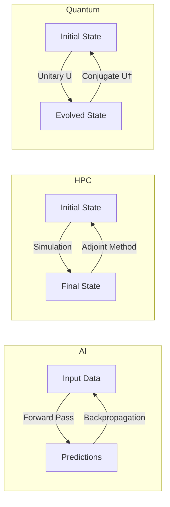

## Recognition, Not Invention

A personal note is warranted here. When I encountered the position paper ["Categorical Deep Learning is an Algebraic Theory of All Architectures"](https://arxiv.org/pdf/2402.15332) by Gavranović et al., the experience was one of recognition. The mathematical foundations for design decisions I had been making in the Fidelity framework already existed, formalized in a language I had been approaching from the engineering side.

A significant credit belongs to [Paul Snively](https://www.youtube.com/watch?v=Cq_IstGhUv4), whose decades of experience with functional programming and formal verification served as a force multiplier. Paul's [polyglot perspective](https://podcasts.apple.com/us/podcast/37-the-future-of-everything-with-paul-snively/id1531666706?i=1000531977557) accelerated many of the connections between practical framework design and formal category theory. The synthesis described in this entry owes much to those conversations; mistakes and omissions remain my own.

## The CDL Thesis

Gavranović et al. make a specific claim: neural networks are morphisms in a 2-category. This is a formal statement with precise content. A 2-category has objects, morphisms between objects (1-cells), and morphisms between morphisms (2-cells). In the CDL formulation:

- **Objects** are parameterized types (the spaces over which computation operates)
- **1-morphisms** are learners (functions from parameter spaces to loss landscapes)
- **2-morphisms** are updates and reparameterizations (gradient transformations that modify the learning process)

Backpropagation, in this framing, is the canonical 2-cell: the morphism that transforms forward computation into parameter updates via the chain rule. This is not a metaphor. The composition laws, associativity conditions, and naturality constraints of 2-categories describe the algebraic structure that backpropagation must satisfy.

## The Adjoint Correspondence

The CDL paper's deepest insight is that every differentiable function gives rise to an adjunction. For a function *f: A → B*, there exists a forward functor Fwd and a backward functor Bwd such that:

> Fwd ⊣ Bwd : Para(A) ⇌ Para(B)

This adjoint pair satisfies the triangle identities: the unit and counit compose to give the identity on each side. The forward pass and backward pass are not independent computations; they are two halves of a single algebraic structure constrained by the adjunction laws.

This observation is not specific to neural networks. The same adjoint structure appears in three domains that have historically been treated as separate disciplines:

In high-performance computing, the adjoint method computes sensitivities of simulation outputs with respect to input parameters. A computational fluid dynamics solver runs forward to produce a flow field, then the adjoint solver runs backward to determine how each input parameter affects the output. The mathematical structure is identical to backpropagation: a forward functor paired with a backward functor satisfying the adjunction laws.

In quantum mechanics, every unitary operator *U* has a conjugate *U†* such that *UU† = U†U = I*. This is the quantum instance of the adjoint correspondence: forward evolution paired with its inverse, constrained by unitarity (the quantum analogue of the triangle identities).

The mathematics are identical. The substrate differs.

## What This Means for Fidelity

The Fidelity framework's Program Semantic Graph (PSG) already tracks forward and backward relationships as coeffect pairs. When a value is created (forward), the escape analysis determines where and how long it persists (the "backward" constraint that flows from use sites to creation sites). When dimensional annotations propagate through the compilation graph, they follow the same chain-rule composition that governs gradient flow.

This alignment is not accidental, but it was not originally designed from categorical first principles either. The PSG was designed to carry semantic information through multi-stage compilation, and the coeffect discipline was designed to unify dimensional correctness with memory management. The CDL paper provides the algebraic justification for why this design works: the PSG's structure is an instance of the parameterized category construction that the CDL paper formalizes.

Concretely, the DTS/DMM paper ([arXiv, forthcoming](/publications/dts-dmm/)) establishes three properties that map directly to the CDL framework:

1. **Dimensional type inference as functorial composition.** The chain rule for dimensions (Section 2.2 of DTS/DMM) is a special case of functorial composition in the dimensional 2-category. Dimensional constraints compose along the same algebraic lines as gradient flow.

2. **Escape analysis as coeffect propagation.** The lifetime ordering (stack < arena < heap < static) and its interaction with escape classification (Section 3.2) is a coeffect discipline in the sense of Petricek et al. [6]. The CDL paper's parameterized category construction provides the 2-categorical context in which this discipline operates.

3. **Semantic preservation through compilation.** The PSG's five-stage compilation pipeline (Section 2.3) preserves annotations through lowering. In categorical terms, each compilation stage is a functor that preserves the relevant structure. The claim that "dimensions never influence control flow" is a statement about the functor's properties: it preserves the forward/backward adjunction while changing the representation.

## What This Does Not Mean

The categorical framework does not, by itself, produce faster code or more efficient training. It provides a formal language for describing computation that is already happening, and it constrains the design space in ways that prevent certain classes of errors. Specifically:

- It does not eliminate the engineering effort of implementing compilation backends for specific hardware targets
- It does not make quantum computation practical on current hardware (see [The Quantum Substrate](/blog/quantum-substrate-categorical-structure/) for honest scoping)
- It does not replace benchmarking, profiling, or the tedious work of performance optimization on real workloads

What it does provide is a principled design framework that ensures the components of a heterogeneous compilation system compose correctly. When the PSG tracks dimensional annotations through MLIR lowering, the categorical framework guarantees that the composition is sound. When escape analysis interacts with representation selection across multiple hardware targets, the adjoint correspondence ensures that the forward and backward information flows are consistent.

## Looking Forward

The CDL paper's 2-categorical formalization opens several specific directions for Fidelity:

**Verified composition of heterogeneous morphisms.** When a computation spans CPU, FPGA, and NPU targets, each target implements a different instance of the forward/backward pair. The categorical framework provides the composition laws that govern how these instances interact at target boundaries. The [DTS/DMM paper's future work](/publications/dts-dmm/) identifies this as the motivation for the Program Hypergraph (PHG) generalization.

**Differentiable programming as a first-class coeffect.** Section 6.7 of the DTS/DMM paper identifies forward-mode automatic differentiation as a specific coeffect signature. The CDL framework provides the 2-categorical context for extending this to a general differentiable programming discipline, where the compiler tracks gradient flow as a structural property of the compilation graph.

**Domain-specific categorical structures.** Physics-informed neural networks, digital twins, and hybrid HPC/AI systems all exhibit domain-specific categorical structure (conservation laws as natural transformations, symmetry groups as equivariance constraints). The CDL framework provides the vocabulary for expressing these constraints in the type system and verifying them at compile time.

These directions are research objectives, not shipping features. The foundational work described in the DTS/DMM paper, dimensional type systems, deterministic memory management, semantic preservation through MLIR, establishes the infrastructure on which categorical composition will be built. The CDL paper provides the mathematical assurance that the infrastructure is pointed in the right direction.
