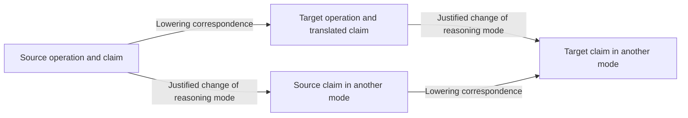

## Recognition

Our Fidelity framework grew from engineering decisions about keeping a computation's meaning available through compilation. When I encountered Gavranović et al.'s [*Categorical Deep Learning is an Algebraic Theory of All Architectures*](https://arxiv.org/abs/2402.15332), the experience was one of recognition. We had been working toward a compiler that retains a model's constraints as it chooses an implementation. Here was a mathematical account of how architectural constraints can guide the construction of learning systems. It gave us a way to examine our engineering choices in a broader setting, with precise relationships to establish.

[Paul Snively's experience with programming languages and reliable software](https://www.youtube.com/watch?v=Cq_IstGhUv4) helped us develop many of these connections. His [polyglot perspective](https://podcasts.apple.com/us/podcast/37-the-future-of-everything-with-paul-snively/id1531666706?i=1000531977557) brought practical compiler work and formal verification into the same conversations. The synthesis here owes much to that collaboration. Mistakes and omissions remain my own.

A model's constraints should remain available when we compose operations, differentiate them, and choose target implementations. The [companion blog entry](/blog/categorical-deep-learning/) develops this through physical learning examples.

## The CDL Thesis

Consider two layers that share a set of weights. Sharing is part of the model: updating a weight must affect both uses. Giving each layer an independent copy with the same initial value changes the model as soon as training begins. We want the compiler's storage and update decisions to preserve that distinction.

In [CDL's parameterized construction](https://arxiv.org/html/2402.15332#S3.SS1), that structure is explicit. Objects are those of the base category. A 1-cell \(A\to B\) is a parameter space \(P\) together with \(f:P\times A\to B\): the layer takes both its parameters and an input to produce an output. The 2-cells are reparameterizations satisfying the required compatibility with these maps. Backpropagation has a separate account through reverse differentiation.

Suppose \(f:P\times A\to B\) and \(g:Q\times B\to C\). Their composite has parameters from both layers:

\[
h((p,q),a)=g(q,f(p,a)).
\]

For two layers sharing a parameter space, a diagonal map \(p\mapsto(p,p)\) expresses shared weights. The notation makes their common origin explicit, giving the compiler a relationship to preserve when it constructs parameter storage and updates.

The CDL paper relates such implementations to architectural constraints, including symmetry and recurrence. For our framework, an applicable construction would let a domain library expose both the permitted operations and the laws their composition must respect.

## The Adjoint Correspondence

A learning system uses a loss calculation to determine how changing a weight would affect its result. An engineer running a simulation may want to know how changing an input would affect an observed quantity. Reverse differentiation supplies a common structure for those sensitivity calculations, using information from the forward calculation. For a smooth finite-dimensional map \(f:A\to B\), write

\[
R[f](a,\bar b)=D f(a)^*\bar b,
\]

where \(\bar b\) is a covector at the output and \(D f(a)^*\) pulls it back to the input. With chosen Euclidean coordinates, this is multiplication by the Jacobian transpose. For a composite,

\[
R[g\circ f](a,\bar c)
=R[f]\bigl(a,R[g](f(a),\bar c)\bigr).
\]

[Cruttwell et al.](https://arxiv.org/html/2103.01931#S2.Thmtheorem7) describe in Proposition 2.7 a functor from a Cartesian reverse differential category into its lens category, pairing \(f\) with \(R[f]\). Their [parametric-lens treatment](https://arxiv.org/html/2103.01931#S2.SS3) also accounts for parameters and their reverse information. Lens composition supplies the reverse chain rule.

An HPC sensitivity calculation and a learning system's reverse derivative can therefore share derivative structure. For example, the map \(x\mapsto x^2\) has reverse derivative \((x,\bar y)\mapsto 2x\bar y\). It requires the primal value \(x\), which memory analysis may retain or arrange to recompute.

These connections also give us a useful vocabulary for separating the jobs a compiler must do. Propagating a sensitivity, undoing an operation, and translating a proof context each need their own relationship:

| Structure | Required relationship | Engineering use |
|---|---|---|
| Reverse derivative | Pullback of sensitivities through the derivative, obeying the reverse chain rule | Differentiate a model or simulation |
| Dagger | An operation reversing arrows with its stated involution and composition laws | Express adjoints, such as conjugate transpose on complex linear maps |
| Unitary operator | Both \(U^\dagger U=I\) and \(UU^\dagger=I\) | Justify inverse evolution for a unitary quantum operation |
| Categorical adjunction | Functors \(F\dashv G\) with a unit and counit satisfying triangle identities | Relate constructions or reasoning contexts through a specified correspondence |

For functors \(F:\mathcal C\to\mathcal D\) and \(G:\mathcal D\to\mathcal C\), the unit and counit have types

\[
\eta:\mathrm{Id}\Rightarrow GF,
\qquad
\varepsilon:FG\Rightarrow\mathrm{Id}.
\]

The triangle laws are

\[
\varepsilon_{FA}\circ F(\eta_A)=\mathrm{id}_{FA},
\qquad
G(\varepsilon_B)\circ\eta_{GB}=\mathrm{id}_{GB}.
\]

These equations constrain composites involving the unit and counit. Invertibility would require additional properties. A claim that a compiler analysis or lowering forms an adjunction needs its actual categories, functors, and correspondence specified. The derivative construction supplies a concrete foundation for differentiation, while the [mode-shift design](/docs/internals/verification/mode-shifts/) considers changes in reasoning context.

## What This Means for Fidelity

For an engineer using a learned physical model, the practical goal is continuity: the model's quantities, shared parameters, and established laws should remain recognizable as the compiler transforms it. Our PSG is intended to carry those joint constraints and the evidence attached to their applications. Its PHG structure makes dependencies involving several operations explicit. The categorical account helps us specify how a transformation should preserve those dependencies.

### Quantities, Ranges, and Representation

Clef's dimensions follow [Abelian-group measure equality](/spec/draft/units-of-measure/). A multiplication combines dimensions, while an addition requires compatible quantities. Numeric kind and dimension belong to source-level identity. Ranges arise from values and justified constraints. Width and representation are later coeffects, informed by platform declarations and [numeric selection](/spec/draft/numeric-selection/).

For a differentiated quantity, the derivative's units follow the output-to-input ratio. That dimensional check establishes compatibility within an update. Numerical accuracy, derivative correctness, and convergence each require their own applicable premises.

A quire can support exact accumulation of represented products within a checked finite capacity. Its contract must cover intermediate sums as well as the final result. The selected realization also needs layout and target support. Forward-mode differentiation changes the lifetime pattern of derivative state, while the number of tangent directions and the optimizer determine additional storage and arithmetic costs. These choices are part of our continuing work on [Adaptive Domain Models](https://arxiv.org/abs/2603.18104).

### Lifetime and Boundary Contracts

Our [closure representation](/spec/draft/closure-representation/#33-escape-analysis) separates lifetime requirements from physical placement. Its scope, region, program, and dynamic classes describe requirements the implementation must satisfy. Stack, arena, static, and other storage choices have target-dependent realizations.

A flat closure environment exposes a finite set of capture fields. Immutable captures can be copied as values. Shared mutable captures require a cell whose lifetime covers the relevant uses. Captured references retain obligations about their referents. Field layout also requires the captured types and target facts to be known at the point of allocation.

BAREWire applies these concerns to memory layout, IPC, and network contracts. Crossing a boundary can require compatible layouts, a capability transfer, or an explicit conversion. A source type's dimensional identity should remain traceable through the operation that realizes that boundary.

### Lowering and Reasoning Modes

We intend to connect two axes of transformation. Lowering changes the representation of a program. A change of reasoning mode changes the rules or semantic structure used to establish a claim. At each stage, the relevant evidence concerns an operation and its retained premises.

```mermaid
flowchart LR
    A[Source operation and claim] -->|Lowering correspondence| B[Target operation and translated claim]
    A -->|Justified change of reasoning mode| C[Source claim in another mode]
    B -->|Justified change of reasoning mode| D[Target claim in another mode]
    C -->|Lowering correspondence| D
```

When both paths apply, a witness should relate the claim proved before lowering to its translated form afterward. A two-categorical or fibered model would specify the contexts over stages, the translations between them, and the laws governing these comparisons. Our [mode-shift design](/docs/internals/verification/mode-shifts/) and [compilation sheaf design](/docs/design/categorical-foundations/the-compilation-sheaf/) develop this account for the compiler.

The witness may relate proofs in different forms. Lowering can also release type metadata after its structural purpose has been discharged. A native instruction need not carry a dimensional runtime tag when the compiler has preserved and checked the required correspondence.

## Implementation and Evidence

A useful implementation test follows one operation across these boundaries. Its source-level measure and range justify an arithmetic representation. Layout facts justify the required addresses. A transformation records how its output corresponds to that source operation. The target-level obligation then checks the property appropriate to the realized arithmetic and storage.

Our temporary external verification ledger supports comparison while the PSG's proof-carrying mechanism is established. The graph's joint constraints are the canonical home for these relationships. Obligation identity, discharge status, and premise provenance must remain distinguishable so that an edited or transformed program cannot reuse stale evidence.

The compiler also needs operational tests: incompatible measures must remain distinct, an uncovered known range must prevent representation commitment, and a proof application must be reconsidered when its premises change. Performance evaluation measures the resulting implementation on the declared target. Categorical laws specify relationships for that implementation to establish.

## Looking Forward

Our heterogeneous target design includes conventional processors and specialized arithmetic or dataflow devices. Each implementation would supply capabilities and boundary contracts that the compiler can check against the source operation. Quantum targets additionally require the semantics of state preparation, unitary evolution, and measurement to remain distinct. JavaScript lowering may realize memory responsibilities through a runtime, while native paths resolve them through explicit placement and access decisions.

Domain libraries can make this machinery available through ordinary operations. A library author establishes a spanning lemma, and an application supplies its parameters and premises. The intended analyzer can suggest that application in a region of code and dispatch the resulting obligations when the developer accepts it. A folded annotation can leave a marker showing its scope and whether its evidence remains current.

For a learned physical model, that workflow would let an engineer retain a conservation or covariance law while adapting parameters within its permitted domain. The model's evidence and the program's realization would remain available for inspection at the point where a new target or operating condition requires another decision.
