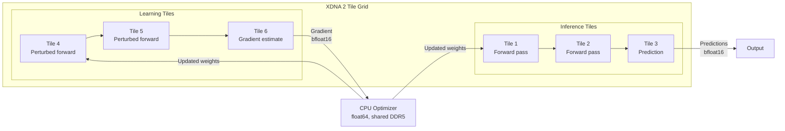

## The Phase Boundary

Contemporary machine learning operates on a strict phase separation. Training happens on GPU clusters with large memory pools, reverse-mode automatic differentiation, and batch-oriented data pipelines. Inference happens on edge devices, mobile processors, or cloud endpoints, with frozen model weights and no gradient computation. The two phases share a model architecture but share almost nothing else: different hardware, different numeric representations, different memory profiles, different deployment infrastructure.

This separation is not a mathematical requirement. It is an engineering consequence of reverse-mode AD's memory profile. Backpropagation requires the activation tape, an O(*L* · *B*) auxiliary memory buffer that stores intermediate activations from the forward pass for consumption during the backward pass. That memory obligation anchors training to high-memory hardware. Once the obligation is removed, the engineering rationale for the phase boundary weakens considerably.

The [forward gradient entry](/blog/forward-gradients-exact-accumulation/) established that forward-mode AD eliminates the activation tape. The [posit arithmetic entry](/blog/posit-arithmetic-dimensional-type-systems/) established that b-posits with quire accumulators provide exact gradient accumulation in a 512-bit footprint. The [target architectures entry](/blog/target-architectures-compilation-strategy/) established that spatial dataflow processors and neuromorphic hardware offer reconfigurable computation at the tile level.

This entry examines what happens when these three properties converge: a system where gradient computation has the same resource profile as inference, deployed on hardware that can reconfigure its computational role at runtime.

## The Memory Argument

The phase boundary rests on a resource asymmetry. Inference requires O(1) auxiliary memory per layer: the activations of the current layer, consumed immediately by the next. Training via reverse-mode requires O(*L* · *B*): every layer's activations, retained for the backward pass.

Forward-mode AD collapses this asymmetry. The directional derivative ⟨∇*f*(θ), *v*⟩ is computed in a single forward pass with O(1) auxiliary memory per layer, the same profile as inference. The gradient estimate is unbiased; the variance is controllable through perturbation sampling [1]. The tradeoff is statistical, not structural.

In the Fidelity framework's coeffect system, this means the escape analysis for a forward gradient pass is identical to the escape analysis for an inference pass. Every intermediate value is StackScoped. Every allocation is `memref.alloca`. No value escapes its creating scope. The compiler sees the same coeffect signature for both workloads.

If the coeffect signatures are identical, the hardware requirements are identical. A device that can run inference can run forward-mode gradient computation, given sufficient arithmetic throughput. The distinction between "inference hardware" and "training hardware" becomes a throughput question, not a capability question.

## Channels-Last and Spatial Reconfigurability

The XDNA 2 NPU in AMD's Strix Halo processors arranges AI Engine tiles in a two-dimensional grid [2]. Each tile has local memory (64 KB L1), a fixed-width datapath supporting `bfloat16`, `int8`, and `int4`, and configurable DMA routes to adjacent tiles and shared DDR5. The channels-last data layout organizes activations so that the channel dimension is contiguous in memory, enabling per-channel operations without gather/scatter overhead.

This layout has a consequence for continuous learning. In channels-last, each tile processes a contiguous slice of the channel dimension. Reconfiguring which tiles perform inference and which tiles compute directional derivatives is a DMA route configuration change, not a data reorganization. The activations are already laid out for per-channel access; the gradient computation accesses the same data in the same order, with an additional perturbation vector and an inner product accumulation.

On a spatial processor, this means the inference/training boundary can be a spatial partition. Some tiles run the forward pass and produce predictions. Adjacent tiles run the same forward pass with a perturbation vector and produce gradient estimates. The two workloads share the same data flow, the same activation layout, and the same tile-level memory profile. The Composer's tile assignment determines which tiles do which job; the coeffect system verifies that both configurations are resource-compatible.

The APU integration in Strix Halo strengthens this further. CPU, GPU, and NPU share DDR5 on the same die. Values do not cross a PCIe boundary; they are accessible from any compute unit through the shared memory controller. A gradient estimate computed on NPU tiles is consumable by a CPU-side optimizer without serialization or transport overhead. The transfer fidelity cost is limited to representation conversion (bfloat16 on the NPU, float64 on the CPU), which the DTS framework quantifies at compile time.

## B-Posits and Representation Continuity

The representation selection problem changes character when training and inference share hardware. In the conventional model, training uses float32 or bfloat16 on GPUs; inference uses int8 or int4 on edge devices. The transition from training to inference requires quantization, a lossy compression step that discards precision and introduces quantization-aware training as a separate engineering concern.

B-posits offer an alternative. The tapered precision profile concentrates bits near unity, where neural network activations and gradients cluster. The compiler's representation selection function, driven by DTS dimensional range analysis, can select a b-posit width that serves both inference and gradient computation on the same hardware. The quire provides exact accumulation for the inner products that forward-mode computes, in 512 bits mapped to fabric or tile resources by the synthesis tool or tile allocator.

The key property is representational continuity: the same numeric format serves both workloads without a quantization step. A b-posit value carrying a prediction is also a b-posit value eligible for gradient computation. The dimensional annotation tracks it through both uses. The coeffect system tracks the quire requirement when gradient computation is active and omits it when only inference is needed.

This eliminates quantization as a separate engineering phase. The model does not need to be compressed for deployment; it was compiled for the target's native representation from the start, and that representation supports both prediction and learning.

## The Neuromorphic Case

Neuromorphic processors make the strongest version of this argument, because they already operate without a phase boundary. Spike-timing-dependent plasticity (STDP) modifies synaptic weights in response to spike patterns during normal operation [3]. There is no separate training phase. The network learns as it infers.

This is structurally similar to forward-mode gradient computation. STDP is a local learning rule: each synapse updates based on the timing relationship between its pre-synaptic and post-synaptic spikes. No global backward pass is required. No activation tape is stored. The update is immediate, local, and bounded in memory.

The DTS/DMM model can express this. The synaptic weight update is a coeffect: a contextual requirement that the computation imposes on its environment. The weight's dimensional annotation (e.g., a dimensionless coupling strength, or a conductance with dimensions of siemens) persists through the update. The escape analysis classifies the weight update as scoped to the synapse's local state, with no escape beyond the neuromorphic core.

The capability coeffect for neuromorphic targets already tracks what the hardware cannot do (no exact accumulation, no wide accumulators). It can equally track what the hardware does natively: local weight updates, spike-driven computation, event-triggered learning. A continuous learning workload that fits within these constraints compiles to neuromorphic hardware without the phase boundary that Von Neumann architectures impose.

## The Coeffect Signature of Continuous Learning

The convergence can be stated as a coeffect property. A continuous learning system has the following signature:

| Property | Inference Only | Continuous Learning |
|---|---|---|
| Auxiliary memory | O(1) per layer | O(1) per layer |
| Escape classification | All StackScoped | All StackScoped |
| Gradient computation | None | Forward-mode directional derivative |
| Accumulation | Not required | Quire (where available) or target-native |
| Weight update | None | Local, scoped to parameter |
| Representation | Target-selected | Same (representational continuity) |

The two signatures differ only in the presence of gradient computation and weight updates. Both additions are local, bounded, and stack-eligible. The coeffect system treats continuous learning as inference with two additional annotations, not as a fundamentally different workload class.

This is the formal content of the claim: the DTS/DMM model, combined with forward-mode AD and target-aware representation selection, provides a framework where the inference/training boundary is a coeffect configuration, not an infrastructure partition.

## The Spatial Partition Model

On spatial dataflow hardware, continuous learning maps to a concrete physical arrangement:

The inference tiles and learning tiles share the same model weights (via shared DDR5 or tile-to-tile DMA). The inference tiles produce predictions. The learning tiles produce gradient estimates. The CPU optimizer consumes the gradients, updates the weights, and distributes them back. The entire loop operates continuously; there is no offline training phase.

The Composer's tile assignment determines the ratio of inference to learning tiles. This ratio is a deployment parameter, not an architectural constraint. An application that needs rapid adaptation allocates more tiles to learning. An application that needs maximum throughput allocates more to inference. The coeffect system verifies that both allocations are resource-valid.

## Limitations and Honest Scoping

The forward gradient's variance scales with parameter count [1]. For very large models (billions of parameters), the statistical cost of forward-mode may exceed the memory savings, even with exact quire accumulation reducing numerical noise to zero. Variance reduction techniques (multiple perturbation vectors, antithetic sampling) add computational overhead that partially offsets the memory advantage.

The spatial partition model assumes that the learning workload fits within the tile grid's capacity. For large models, the tile count may be insufficient to simultaneously serve inference and gradient computation at acceptable throughput. The model applies most naturally to moderate-sized networks deployed on spatial hardware, not to frontier-scale language models.

STDP and other local learning rules are not equivalent to gradient descent. They approximate gradient-based learning under specific conditions but produce different dynamics for deep networks. The claim is not that neuromorphic continuous learning replaces backpropagation for all workloads; it is that the DTS/DMM model can express both, and the coeffect system provides a formal framework for reasoning about their resource requirements and correctness properties.

The channels-last layout and spatial partitioning depend on the XDNA 2 architecture's specific capabilities. Other spatial dataflow processors may have different tile sizes, connectivity topologies, and DMA configurations. The model generalizes to the extent that the underlying hardware supports independent tile configuration and shared memory access; the specifics of tile assignment are target-dependent.

These are genuine constraints. The contribution is the formal observation that the inference/training phase boundary is an engineering artifact of reverse-mode AD's memory profile, not a fundamental property of learning systems, and that the DTS/DMM framework provides the machinery to express and verify systems that operate without it.

## References

[1] A. G. Baydin, B. A. Pearlmutter, D. Syme, F. Wood, and P. Torr, "Gradients without Backpropagation," arXiv:2202.08587, 2022.

[2] A. Rico, S. Pareek, J. Cabezas, D. Clarke, et al., "AMD XDNA NPU in Ryzen AI Processors," *IEEE Micro*, vol. 44, no. 6, pp. 73-83, 2024.

[3] W. Gerstner, R. Kempter, J. L. van Hemmen, and H. Wagner, "A neuronal learning rule for sub-millisecond temporal coding," *Nature*, vol. 383, pp. 76-78, 1996.
