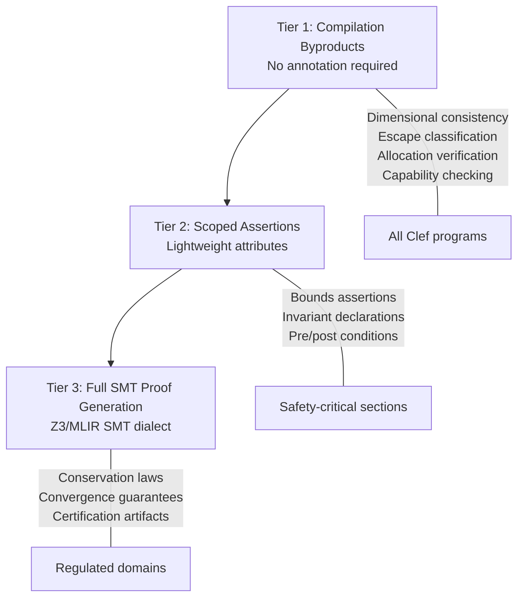

## The Verification Spectrum

Formal verification carries a reputation for cost. The perception, grounded in real experience with tools like Coq, Isabelle, and full dependent type systems, is that proofs require annotation budgets measured in lines-of-proof-per-line-of-code ratios of 5:1 or higher. For many engineering teams, this cost is prohibitive.

The Fidelity framework takes a different position. The compiler already computes properties during normal elaboration that constitute useful verification results: dimensional consistency, escape classification, allocation strategy, lifetime bounds, and target-specific capability requirements. These properties are recorded in the Program Semantic Graph (PSG) as coeffect annotations. They are not separate from compilation; they are compilation.

The question is how far up the verification spectrum this "free" verification extends, and where the transition to explicit annotation begins.

## What the Compiler Provides for Free

The PSG's elaboration and saturation phases compute several categories of properties that are verifiable at compile time without any annotation from the engineer:

**Dimensional consistency.** Every arithmetic operation in a DTS-annotated program generates a dimensional constraint. These constraints form a system of linear equations over \(\mathbb{Z}\) solved by Gaussian elimination. The result is either a consistent assignment (the program is dimensionally correct) or an inconsistency (the program has a dimensional error). No annotation is required; the inference is complete and principal. This is the content of [Section 2.2 of the DTS/DMM paper](/publications/dts-dmm/).

**Escape classification.** The coeffect system classifies every value's escape behavior into one of four categories: StackScoped, ClosureCapture(\(t\)), ReturnEscape, or ByRefEscape. Each classification determines an allocation strategy and lifetime bound. The classification is computed during PSG elaboration from the program's structure; the engineer does not annotate escape behavior. This is [Section 3.2 of the DTS/DMM paper](/publications/dts-dmm/).

**Allocation strategy verification.** Given the escape classification, the compiler determines where each value is allocated (stack, arena, heap, hardware-specific region) and verifies that the allocation is consistent with the value's lifetime. A value that outlives its allocation scope is detected and reported with the full escape chain.

**Target capability checking.** When a computation requires a capability that a target does not provide (exact accumulation on neuromorphic hardware, posit arithmetic on a CPU without software emulation), the coeffect system detects the failure and reports it. No annotation is required; the capability requirements are inferred from the computation's structure and the target's specification.

**Cross-target transfer fidelity.** When a value crosses a hardware boundary, the compiler evaluates the precision conversion and reports the fidelity profile. This analysis uses the dimensional range and the representation specifications of both targets.

These properties are all computed during normal compilation. The language server displays them at design time. The engineer receives verification feedback without writing a single annotation.

## The Three Tiers

The verification spectrum in the Fidelity framework divides into three tiers, corresponding to increasing annotation cost and increasing assurance level.



### Tier 1: Compilation Byproducts

Every Clef program receives Tier 1 verification. The properties listed above are computed as part of standard compilation. The cost is zero: no annotations, no separate analysis tools, no additional build steps. The engineer writes standard functional code, and the compiler reports dimensional errors, escape promotions, allocation decisions, and capability failures as part of the normal feedback loop.

This tier corresponds roughly to MISRA-C-class safety for the properties it covers. Dimensional consistency prevents unit confusion errors (the Mars Climate Orbiter class of failure). Escape classification prevents use-after-free and dangling pointer errors. Allocation verification prevents memory leaks for arena-scoped values. These are useful guarantees for any codebase, regardless of domain.

### Tier 2: Scoped Assertions

When the engineer needs assurance beyond what inference provides, lightweight attributes declare specific properties:

```fsharp
[<Ensures("positive_definite(result.Covariance)")>]
[<Invariant("energy_conserved(state)")>]
[<Bounds("0.0 < temperature && temperature < 1000.0<celsius>")>]
let updateState (state: SimulationState) : SimulationState =
    // ...
```

These attributes would declare properties for the compiler to verify. The intended verification mechanism depends on the property:

- **Bounds assertions** are checked by the SMT solver (Z3) against the dimensional range analysis and the computation's structure
- **Invariant declarations** are checked at each mutation point within the annotated scope
- **Pre/post conditions** are checked at function boundaries

The annotation cost is modest: one attribute per property, attached to the function or scope where the property must hold. The engineer chooses which functions warrant this level of assurance. A web application might use no Tier 2 annotations. A financial calculation might annotate key invariants. An avionics controller might annotate every function in the safety-critical path.

### Tier 3: Full SMT Proof Generation

For regulated domains that require certification artifacts (DO-178C for avionics, ISO 26262 for automotive, FIPS 140-3 for cryptographic modules, IEC 62443 for industrial security), the Fidelity framework targets full SMT proof generation. The design-time phase uses Z3 over the QF_LIA theory for dimensional and coeffect verification; the compile-time phase uses MLIR's SMT dialect for translation validation. For domains requiring dependent-type proofs, integration with F* or similar proof assistants is a candidate path.

At this tier, the compiler would generate machine-readable certificates as compilation byproducts. A certificate would contain:

- **The proof obligation:** what property was verified, expressed as an SMT formula
- **The evidence:** the solver's proof witness, including the decision procedure trace
- **The scope:** which PSG nodes (identified by the hyperedge in the compilation graph) the proof covers
- **The metadata:** tool version, input hash, timestamp, and any assumptions the proof depends on

This is the distinction identified in our earlier analysis of proof-carrying compilation: the hyperedge defines the proof's scope ("these operations, on this tile, under these constraints"), the proof is an external artifact (a document the auditor reads and the certification body evaluates), and the compiler generates the obligation and the evidence. Three distinct roles, three distinct outputs.

The annotation cost at this tier is significant. The engineer must declare the properties to be certified, provide sufficient type-level information for the solver to discharge the obligations, and review the generated certificates for correctness. This cost is justified only in domains where regulatory compliance requires it.

## The Graduated Adoption Model

The three tiers are not separate systems. They are layers within the same compilation pipeline. Tier 1 properties are computed for every program. Tier 2 attributes add solver queries to specific functions. Tier 3 certificates are generated when the build configuration requests them.

An engineering team can adopt verification incrementally:

1. **Start with standard Clef.** Write functional code. Receive dimensional consistency, escape classification, and allocation verification as compilation feedback. No annotations required.

2. **Add assertions where risk concentrates.** Annotate safety-critical functions with bounds, invariants, and pre/post conditions. The solver verifies these properties at compile time.

3. **Generate certificates for regulated components.** Enable full proof generation for the modules that require certification. The compiler produces the artifacts; the engineer reviews them.

The transition between tiers is granular. A single codebase can have modules at different tiers. A web service's HTTP handler operates at Tier 1. The same service's cryptographic key management operates at Tier 3. The compilation pipeline handles both without configuration changes beyond the annotations themselves.

## Proofs as Optimization Enablers

A persistent misconception is that verification imposes runtime cost. In the Fidelity framework, the opposite is true: verification *enables* optimizations that would be unsafe without proofs.

When the compiler can prove that an array access is within bounds (from dimensional constraints or explicit assertions), it eliminates the bounds check. When it can prove that a value does not escape its scope, it allocates on the stack and omits the deallocation. When it can prove that a loop invariant holds, it hoists computations out of the loop and vectorizes aggressively.

These optimizations are standard compiler transformations. What the verification infrastructure provides is the *permission* to apply them. A compiler without proofs must be conservative: it inserts bounds checks because the access *might* be out of bounds, allocates on the heap because the value *might* escape, and avoids hoisting because the invariant *might* not hold. A compiler with proofs eliminates the uncertainty and applies the transformation.

The effect is measurable in specific cases. Eliminating bounds checks in a tight inner loop can reduce cycle count by 10-20% for array-intensive computations. Stack allocation vs. heap allocation eliminates allocation overhead and improves cache locality. Loop hoisting reduces redundant computation proportional to the loop iteration count.

These are not multiplicative performance claims. They are specific, measurable transformations applied when the compiler has sufficient proof to justify them. The aggregate effect depends on the workload, the proportion of code that benefits, and the baseline compiler's conservatism.

## The MLIR Integration

Proof metadata flows through the MLIR pipeline as operation and function attributes. MLIR's pass infrastructure already supports preserving unknown attributes through transformations; proof attributes use this mechanism without requiring MLIR modifications.

At the MLIR level, satisfied proof obligations transform into optimization constraints:

- A conservation law verified by Z3 becomes an affine constraint in the `affine` dialect and a `llvm.loop.invariant` metadata node in LLVM IR
- A convergence guarantee becomes a barrier to certain MLIR transformations and an `llvm.assume` intrinsic that enables safe optimizations
- A bounds proof becomes the absence of a bounds check in the generated code

The mathematical properties guide the lowering without requiring MLIR or LLVM to understand the proofs themselves. MLIR respects the attributes as constraints; LLVM respects the metadata as optimization hints. The proof infrastructure is a producer of constraints that the compilation pipeline consumes.

## Standards-Body Compliance

For domains that require external certification, the proof certificates must meet specific formatting, review, and acceptance criteria established by the relevant standards body:

| Standard | Domain | What the Compiler Produces | What the Auditor Reviews |
|---|---|---|---|
| DO-178C | Avionics | Traceability from requirements to object code | Proof certificates linking PSG nodes to verification conditions |
| ISO 26262 | Automotive | ASIL-rated verification evidence | SMT proof witnesses for safety-critical functions |
| FIPS 140-3 | Cryptography | Algorithm correctness proofs | Certificates for cryptographic primitive implementations |
| IEC 62443 | Industrial security | Security property verification | Proof that security invariants hold across target boundaries |

The compiler would generate the evidence; the certification process evaluates it. The framework's role is to make evidence generation a compilation byproduct, reducing the manual effort required for certification without reducing the rigor of the evaluation.

From a practical standpoint, a compiler that generates compliance certificates as a compilation byproduct could integrate directly into existing procurement workflows for certification tooling. Standards bodies already have evaluation processes for tools that produce verification evidence; the Fidelity framework's proof infrastructure is designed with this integration in mind.

## Current Status and Honest Scoping

Tier 1 verification (compilation byproducts) is architectural: the PSG computes these properties as part of standard elaboration and saturation. The language server displays them. This is the layer closest to implementation.

Tier 2 verification (scoped assertions) requires SMT solver integration. The Z3 solver is available; the integration with the Clef attribute syntax and the PSG's coefficient infrastructure is in design. The attribute syntax shown in this entry is design-target, not yet implemented.

Tier 3 verification (full proof generation) requires SMT proof generation and, for dependent-type proofs, potential integration with proof assistants such as F*. Certificate generation in standards-compliant formats adds additional engineering surface. This is the most distant layer. The architecture accommodates it; the implementation is future work.

The graduated model is deliberate. Each tier delivers value independently. Tier 1 is useful for every program. Tier 2 is useful for safety-conscious engineering teams. Tier 3 is useful for regulated industries. An engineering team can begin with Tier 1 and add tiers as their domain requires, without rewriting their codebase or changing their development workflow.
