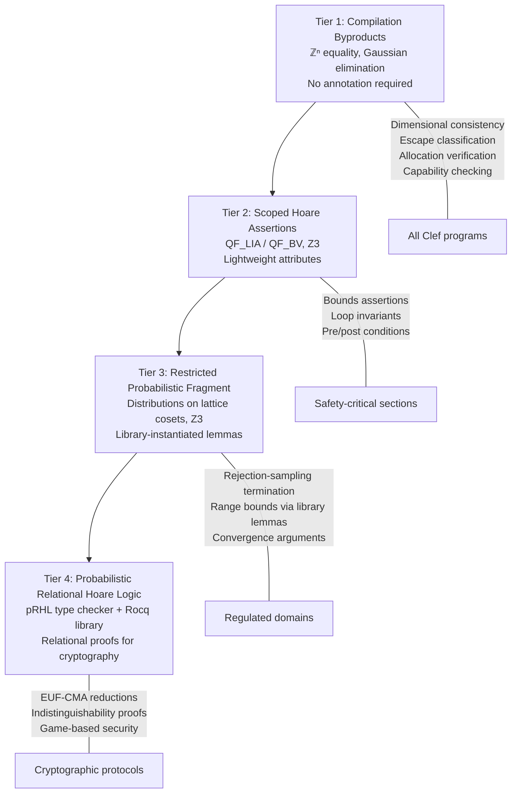

## The Verification Spectrum

Formal verification carries a reputation for cost. The perception, grounded in real experience with tools like Coq, Isabelle, and full dependent type systems, is that proofs require annotation budgets measured in lines-of-proof-per-line-of-code ratios of 5:1 or higher. For many engineering teams, this cost is prohibitive.

The Fidelity framework takes a different position. The compiler already computes properties during normal elaboration that constitute useful verification results: dimensional consistency, escape classification, allocation strategy, lifetime bounds, and target-specific capability requirements. These properties are recorded in the Program Semantic Graph (PSG) as coeffect annotations during compilation, as part of compilation itself.

The question is how far up the verification spectrum this "free" verification extends, and where the transition to explicit annotation begins.

## What the Compiler Provides for Free

The PSG's elaboration and saturation phases compute several categories of properties that are verifiable at compile time without any annotation from the engineer:

**Dimensional consistency.** Every arithmetic operation in a DTS-annotated program generates a dimensional constraint. These constraints form a system of linear equations over \(\mathbb{Z}\) solved by Gaussian elimination. The result is either a consistent assignment (the program is dimensionally correct) or an inconsistency (the program has a dimensional error). No annotation is required; the inference is complete and principal. This is the content of [Section 2.2 of the DTS/DMM paper](/publications/dts-dmm/).

**Escape classification.** The coeffect system classifies every value's escape behavior into one of four categories: StackScoped, ClosureCapture(\(t\)), ReturnEscape, or ByRefEscape. Each classification determines an allocation strategy and lifetime bound. The classification is computed during PSG elaboration from the program's structure; the engineer does not annotate escape behavior. This is [Section 3.2 of the DTS/DMM paper](/publications/dts-dmm/).

**Allocation strategy verification.** Given the escape classification, the compiler determines where each value is allocated (stack, arena, heap, hardware-specific region) and verifies that the allocation is consistent with the value's lifetime. A value that outlives its allocation scope is detected and reported with the full escape chain.

**Target capability checking.** When a computation requires a capability that a target does not provide (exact accumulation on neuromorphic hardware, posit arithmetic on a CPU without software emulation), the coeffect system detects the failure and reports it. No annotation is required; the capability requirements are inferred from the computation's structure and the target's specification.

**Cross-target transfer fidelity.** When a value crosses a hardware boundary, the compiler evaluates the precision conversion and reports the fidelity profile. This analysis uses the dimensional range and the representation specifications of both targets.

These properties are all computed during normal compilation. The language server displays them at design time. The engineer receives verification feedback without writing a single annotation.

## The Four Tiers

The verification spectrum in the Fidelity framework divides into four tiers, organized by the logical fragment of the obligations they discharge and the decision procedure that handles them. The tiers also correspond to increasing annotation cost and assurance level, but the logical organization is the load-bearing one: each tier names a specific decidable (or type-checkable) subset of program properties, and the cost ordering follows from the complexity of the corresponding decision procedure.



The trusted computing base for Tiers 1 through 3 is Z3 alone. Rocq enters the TCB only at Tier 4, where the pRHL rule library is the foundational dependency that the type checker consults.

### Tier 1: Compilation Byproducts

Every Clef program receives Tier 1 verification. The properties listed above are computed as part of standard compilation. The cost is zero: no annotations, no separate analysis tools, no additional build steps. The engineer writes standard functional code, and the compiler reports dimensional errors, escape promotions, allocation decisions, and capability failures as part of the normal feedback loop.

This tier corresponds roughly to MISRA-C-class safety for the properties it covers. Dimensional consistency prevents unit confusion errors (the Mars Climate Orbiter class of failure). Escape classification prevents use-after-free and dangling pointer errors. Allocation verification prevents memory leaks for arena-scoped values. These are useful guarantees for any codebase, regardless of domain.

### Tier 2: Scoped Hoare Assertions

When the engineer needs assurance beyond what inference provides, lightweight attributes declare specific properties:

```fsharp
[<Ensures("positive_definite(result.Covariance)")>]
[<Invariant("energy_conserved(state)")>]
[<Bounds("0.0 < temperature && temperature < 1000.0<celsius>")>]
let updateState (state: SimulationState) : SimulationState =
    // ...
```

These attributes are *mid-computation Hoare assertions*. Each one names a precondition or postcondition that must hold at a specific program point, and the compiler discharges the implication using Z3 over QF_LIA. The intended verification mechanism depends on the property:

- **Bounds assertions** narrow the postcondition at branch joins (Hoare's conjunction rule), letting Z3 verify that the asserted bound is implied by both incoming branches against the dimensional range analysis
- **Invariant declarations** state a loop invariant in Hoare's sense (\(\{P \wedge B\}\, C\, \{P\}\) implies \(\{P\}\, \text{while } B \text{ do } C\, \{P \wedge \neg B\}\)) and Z3 discharges the local preservation check at each iteration boundary
- **Pre/post conditions** are checked at function boundaries via Hoare's sequential composition rule, with the called function's postcondition becoming a precondition for the caller's continuation

The annotation cost is modest: one attribute per property, attached to the function or scope where the property must hold. The engineer chooses which functions warrant this level of assurance. A web application might use no Tier 2 annotations. A financial calculation might annotate key invariants. An avionics controller might annotate every function in the safety-critical path. The [decidability sweet spot document](/docs/internals/verification/decidability-sweet-spot/) treats the design-time pass as weakest-precondition computation and the compile-time MLIR re-discharge as the consequence rule, which is the precise Hoare-logic vocabulary for the dual-pass architecture.

### Tier 3: Restricted Probabilistic Fragment

Some verification obligations exceed QF_LIA / QF_BV but remain decidable inside a restricted probabilistic fragment that the framework supports through library-instantiated lemmas. The clearest example is rejection-sampling termination: a rejection-sampling loop's exit is governed by an acceptance probability \(p\) that is computable from Tier 2 facts, the geometric series convergence is a QF_LIA argument over \(p\), and the support equality of uniform distributions over lattice cosets is an abelian-group argument discharged by Gaussian elimination. The lemma that combines these into a single termination guarantee lives in `Fidelity.Lemmas.Mathematics`, proved once and parameterized over its inputs. The compiler instantiates the lemma from the specific values present in the PSG and discharges the resulting obligation through Z3.

This tier is also where conservative findings from Tier 2 range propagation get resolved when the gap requires more than a local annotation. When Tier 2 range analysis returns a conservative bound for a transcendental function or a nonlinear recurrence, the resolution is not a Tier 2 annotation (the engineer cannot honestly assert a tighter range without invoking a real-analysis fact); the resolution is a Tier 3 lemma parameterized over the interval, proved once in Rocq, and instantiated automatically by the compiler. A conservative finding reported today corresponds to a lemma not yet present in `Fidelity.Lemmas.Mathematics`, not to a structural limitation of the analysis. The conservative region shrinks monotonically as the lemma library grows.

Tier 3 still discharges through Z3 alone. The lemma library provides the *parameterized obligation*; Z3 instantiates and verifies it. Rocq is not in the trusted computing base at this tier.

### Tier 4: Probabilistic Relational Hoare Logic

For cryptographic protocols and other settings where the property of interest is not "what value does the program compute" but "are two programs computationally indistinguishable," the obligations are probabilistic relational. A pRHL judgment of the form \(\{\Phi\}\, C_1 \sim C_2\, \{\Psi\}\) asserts that for any two initial states satisfying \(\Phi\), the executions of \(C_1\) and \(C_2\) produce final states satisfying \(\Psi\) with overwhelming probability. The structural derivation of such judgments is a typed proof term in the pRHL rule language, type-checked by the Composer's pRHL type checker against a foundational rule library proved once in Rocq.

Z3 still handles the arithmetic leaves of each pRHL derivation. The structural pRHL proof itself is verified by the type checker, not by Z3. The Tier 4 lemmas are parameterized over Tier 3 facts (acceptance probability, norm bound, distribution support) and the lemma body is proved in the abstract over the parameter types; the framework instantiates them with the values established at Tier 3.

The trusted computing base for Tier 4 includes Rocq's kernel as a foundational library dependency. For Tiers 1 through 3 it does not. This is a load-bearing distinction: a deployment that cares about cryptographic indistinguishability accepts Rocq as part of its TCB, while a deployment that only cares about safety-critical arithmetic, range proofs, and rejection-sampling termination does not.

### Certificates

At Tiers 3 and 4 the compiler would generate machine-readable certificates as compilation byproducts. A certificate would contain:

- **The tier:** which logical fragment the obligation lives in (Tier 1, 2, 3, or 4), so the reconciliation tool knows which verification mechanism applies
- **The proof obligation:** what property was verified, expressed as an SMT formula or a pRHL judgment
- **The evidence:** the solver's proof witness, the decision procedure trace, or the type-checked pRHL derivation
- **The scope:** which PSG nodes (identified by the hyperedge in the compilation graph) the proof covers
- **The metadata:** tool version, input hash, timestamp, and any assumptions the proof depends on

This is the distinction identified in our earlier analysis of proof-carrying compilation: the hyperedge defines the proof's scope ("these operations, on this tile, under these constraints"), the proof is an external artifact (a document the auditor reads and the certification body evaluates), and the compiler generates the obligation and the evidence. The tier label tells the reconciliation tool which trusted computing base the certificate depends on, which matters for procurement workflows where Rocq-in-TCB and Z3-only deployments have different acceptance criteria.

The annotation cost at Tiers 3 and 4 is significant. The engineer must declare the properties to be certified, provide sufficient type-level information for the solver or type checker to discharge the obligations, and review the generated certificates for correctness. This cost is justified only in domains where regulatory compliance or cryptographic security requires it.

## The Graduated Adoption Model

The four tiers are layers within the same compilation pipeline. Tier 1 properties are computed for every program. Tier 2 attributes add solver queries to specific functions. Tier 3 lemmas instantiate against the PSG when the build requests them. Tier 4 pRHL derivations attach to cryptographic modules that require relational security proofs.

An engineering team can adopt verification incrementally:

1. **Start with standard Clef.** Write functional code. Receive dimensional consistency, escape classification, and allocation verification as compilation feedback. No annotations required.

2. **Add assertions where risk concentrates.** Annotate safety-critical functions with bounds, invariants, and pre/post conditions. The solver verifies these properties at compile time.

3. **Invoke the lemma library where the analysis is conservative.** When Tier 2 range propagation cannot tighten a bound through linear arithmetic alone, instantiate a Tier 3 lemma from `Fidelity.Lemmas.Mathematics` against the relevant interval. The compiler discharges the lemma's parameterized obligation through Z3.

4. **Generate certificates for regulated and cryptographic components.** Enable proof generation for modules that require certification or game-based security. The compiler produces the artifacts; the engineer reviews them.

The transition between tiers is granular. A single codebase can have modules at different tiers. A web service's HTTP handler operates at Tier 1. The same service's cryptographic key management operates at Tier 4. The compilation pipeline handles both without configuration changes beyond the annotations themselves.

## Proofs as Optimization Enablers

A persistent misconception is that verification imposes runtime cost. In the Fidelity framework, the opposite is true: verification *enables* optimizations that would be unsafe without proofs.

When the compiler can prove that an array access is within bounds (from dimensional constraints or explicit assertions), it eliminates the bounds check. When it can prove that a value does not escape its scope, it allocates on the stack and omits the deallocation. When it can prove that a loop invariant holds, it hoists computations out of the loop and vectorizes aggressively.

These optimizations are standard compiler transformations. What the verification infrastructure provides is the *permission* to apply them. A compiler without proofs must be conservative: it inserts bounds checks because the access *might* be out of bounds, allocates on the heap because the value *might* escape, and avoids hoisting because the invariant *might* not hold. A compiler with proofs eliminates the uncertainty and applies the transformation.

The effect is measurable in specific cases. Eliminating bounds checks in a tight inner loop can reduce cycle count by 10-20% for array-intensive computations. Stack allocation vs. heap allocation eliminates allocation overhead and improves cache locality. Loop hoisting reduces redundant computation proportional to the loop iteration count.

These are specific, measurable transformations applied when the compiler has sufficient proof to justify them. The aggregate effect depends on the workload, the proportion of code that benefits, and the baseline compiler's conservatism.

## The MLIR Integration

Proof metadata flows through the MLIR pipeline as operation and function attributes. MLIR's pass infrastructure already supports preserving unknown attributes through transformations; proof attributes use this mechanism without requiring MLIR modifications.

At the MLIR level, satisfied proof obligations transform into optimization constraints:

- A conservation law verified by Z3 becomes an affine constraint in the `affine` dialect and a `llvm.loop.invariant` metadata node in LLVM IR
- A convergence guarantee becomes a barrier to certain MLIR transformations and an `llvm.assume` intrinsic that enables safe optimizations
- A bounds proof becomes the absence of a bounds check in the generated code

The mathematical properties guide the lowering without requiring MLIR or LLVM to understand the proofs themselves. MLIR respects the attributes as constraints; LLVM respects the metadata as optimization hints. The proof infrastructure is a producer of constraints that the compilation pipeline consumes.

## Standards-Body Compliance

For domains that require external certification, the proof certificates must meet specific formatting, review, and acceptance criteria established by the relevant standards body:

| Standard | Domain | What the Compiler Produces | What the Auditor Reviews |
|---|---|---|---|
| DO-178C | Avionics | Traceability from requirements to object code | Proof certificates linking PSG nodes to verification conditions |
| ISO 26262 | Automotive | ASIL-rated verification evidence | SMT proof witnesses for safety-critical functions |
| FIPS 140-3 | Cryptography | Algorithm correctness proofs | Certificates for cryptographic primitive implementations |
| IEC 62443 | Industrial security | Security property verification | Proof that security invariants hold across target boundaries |

The compiler would generate the evidence; the certification process evaluates it. The framework's role is to make evidence generation a compilation byproduct, reducing the manual effort required for certification without reducing the rigor of the evaluation.

From a practical standpoint, a compiler that generates compliance certificates as a compilation byproduct could integrate directly into existing procurement workflows for certification tooling. Standards bodies already have evaluation processes for tools that produce verification evidence; the Fidelity framework's proof infrastructure is designed with this integration in mind.

## Current Status and Honest Scoping

Tier 1 verification (compilation byproducts) is architectural: the PSG computes these properties as part of standard elaboration and saturation. The language server displays them. This is the layer closest to implementation.

Tier 2 verification (scoped Hoare assertions) requires SMT solver integration. The Z3 solver is available; the integration with the Clef attribute syntax and the PSG's coefficient infrastructure is in design. The attribute syntax shown in this entry is design-target, not yet implemented.

Tier 3 verification (restricted probabilistic fragment) requires the same Z3 integration plus the lemma library that supplies parameterized obligations for rejection-sampling termination, transcendental bounds, and nonlinear recurrences. The lemma library grows incrementally; each new lemma shrinks the conservative-finding region for every program whose PSG annotations fall within the lemma's parameter types.

Tier 4 verification (probabilistic relational Hoare logic) requires the pRHL type checker and its Rocq-proved foundational rule library. Certificate generation in standards-compliant formats adds additional engineering surface. This is the most distant layer. The architecture accommodates it; the implementation is future work.

The graduated model is deliberate. Each tier delivers value independently. Tier 1 is useful for every program. Tier 2 is useful for safety-conscious engineering teams. Tier 3 is useful for regulated industries that need range proofs and termination guarantees. Tier 4 is useful for cryptographic protocol implementations that need game-based security proofs. An engineering team can begin with Tier 1 and add tiers as their domain requires, without rewriting their codebase or changing their development workflow.

The [compilation sheaf design document](/docs/design/categorical-foundations/the-compilation-sheaf/) treats the four tiers as four sheaves over the same compilation poset, distinguished by their stalk categories. The dual-pass architecture is the witnessing mechanism for global sections of each sheaf, and the consequence rule applied at every lowering pass is what makes the verification compose across the pipeline.
