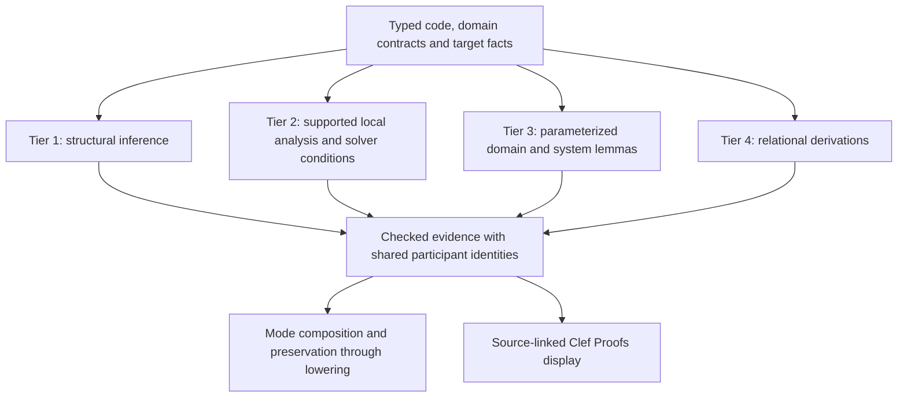

## The Verification Spectrum

Fidelity's intended verification workflow begins with information the program already supplies: typed operations, resource relationships, domain contracts and target declarations. The compiler retains that information in the Program Semantic Graph (PSG), generates supported obligations and dispatches the evidence needed to establish them.

The common application workflow remains the same as coverage grows. Framework and domain-library authors establish reusable laws; application developers receive automatic instances through ordinary code. A new domain requirement may need to be stated, but theorem authoring is not an escalating obligation imposed on every user of a higher tier.

[Proof Composition and Tooling](/docs/internals/verification/proof-composition-and-tooling/) explains the reusable Rocq foundations and their integration boundaries. [Composer's architecture](https://github.com/FidelityFramework/Composer/blob/main/docs/Proof_Composition_Architecture.md) is the engineering record. This article summarizes the design, not completed coverage for every operation and target.

## What the Compiler Provides for Free

“For free” describes the absence of an additional proof-authoring step in the supported application workflow. Inference, elaboration and evidence checking have implementation and execution costs.

Dimensional inference solves measure equations under the declared algebra. Integer exponents require integer-preserving reasoning, including divisibility conditions; ordinary elimination over rationals is insufficient. Resource, lifetime, representation and layout facts have their own rules. A dimensional result does not itself prove a memory bound, numerical accuracy or a target capability.

The PSG connects these facts to their participants and consumers. An automatically derived layout condition can use BAREWire's actual storage plan and Fidelity.Platform's declared capacity. A checked fact about one allocation cannot justify an unrelated access with a similar type.

## The Four Tiers

The tiers organize reasoning roles. They are neither a fixed sequence of tool invocations nor a scale of mandatory source annotations.

```mermaid
flowchart TD
    P["Typed code, domain contracts and target facts"] --> T1["Tier 1: structural inference"]
    P --> T2["Tier 2: supported local analysis and solver conditions"]
    P --> T3["Tier 3: parameterized domain and system lemmas"]
    P --> T4["Tier 4: relational derivations"]
    T1 --> E["Checked evidence with shared participant identities"]
    T2 --> E
    T3 --> E
    T4 --> E
    E --> M["Mode composition and preservation through lowering"]
    E --> V["Source-linked Clef Proofs display"]
```

### Tier 1: Compilation Byproducts

Admitted structural rules establish properties such as dimensional compatibility. Grade support, escape classification and ownership require their respective interpretations and transfer laws; none inherits a blanket principal-inference result merely by sharing the graph.

### Tier 2: Scoped Hoare Assertions

The compiler generates local conditions from operations and their contracts. cvc5 handles supported encodings such as linear integer arithmetic, linear real arithmetic and bit vectors. A local range or layout check often fits here without a user-authored assertion.

An explicitly requested bound remains an obligation to establish. Matrix positive definiteness, general energy conservation and arbitrary loop invariants cannot simply be sent to `QF_LIA` because they appear in attributes. Each needs an appropriate model, rule and supported encoding. [The decidability discussion](/docs/internals/verification/decidability-sweet-spot/) supplies the surrounding staged-checking account.

### Tier 3: Parameterized Domain and System Lemmas {#tier-3-restricted-probabilistic-fragment}

Reusable theorems extend coverage to supported resource transfers, protocol invariants, fault-model preservation and restricted probabilistic or termination results. The compiler instantiates a registered law with the actual graph participants and discharges its premises. A conservative range can sometimes be improved by a deterministic domain theorem; it need not become a probabilistic claim.

A rejection-sampling theorem, for example, requires the stated assumptions about successive trials and acceptance. Arithmetic facts about an acceptance parameter alone do not prove the probabilistic theorem. If Rocq establishes the reusable law, that foundation remains in its evidence dependencies even when cvc5 checks the numerical premises at each use.

### Tier 4: Relational Judgments {#tier-4-probabilistic-relational-hoare-logic}

Relational reasoning compares executions, distributions or realizations. Fidelity's compiler-relational (`cRHL`) and probabilistic-relational (`pRHL`) work needs the corresponding semantics and sound rule libraries. Probabilistic relational judgments can express couplings under stated preconditions; computational indistinguishability additionally requires the appropriate observations, adversary model and quantitative security argument. It is not the meaning of every pRHL judgment.

The intended application path is automatic elaboration of supported derivations and automatic discharge of their leaves. Rocq-founded libraries such as selected Iris/Clutch developments are reuse candidates, subject to checked semantic correspondence. They are not drop-in implementations of every Fidelity relational judgment.

### Certificates

A useful evidence record identifies:

- The proposition, program participants, source snapshot and compilation stage.
- The rule or theorem instance, actual parameters and checked premises.
- The retained proof or derivation, its checking mechanism and semantic mapping.
- The permitted axiom basis, remaining environment hypotheses and transitive checking dependencies.
- The dependencies whose changes invalidate the result.

An emitted certificate is distinct from a checked certificate. An imported result is a proved lemma, never an axiom added because a solver returned success. The tier label alone does not determine the trusted computing base. These requirements are stated in [Conformance §6.1](/spec/draft/conformance/#61-verification-evidence-and-composition).

## The Graduated Adoption Model

Coverage grows through admitted operations, domain contracts and reusable laws. The initial authoring community can be small: a law developed for one concrete framework need can serve subsequent applications automatically.

An application may combine a Tier 2 buffer bound, a Tier 3 handoff invariant and a Tier 4 refinement. Mode shifts retain their justifications and participant identities. An optional editor suggestion may introduce an additional requirement or repair, but required checking cannot depend on accepting a suggestion or displaying proof annotations.

## Proofs as Optimization Enablers

An established bound can permit removal of a redundant dynamic check. A lifetime result can justify a storage choice. Parallel reassociation requires the applicable numerical and dependency laws, including their target assumptions. A proof of one property does not authorize every optimization in the region.

These are opportunities to measure on the realized target. Verification does not imply a universal speedup, nor eliminate validation at external boundaries whose inputs remain unknown before execution.

## The MLIR Integration

The graph's evidence must remain connected to actual operations through lowering. Copying an attribute is not a preservation proof. A pass needs a sound preservation rule for the property or a re-check that relates the transformed program to its contract. Unsupported translations remain explicit obligations.

Arithmetic solver leaves and structured relational proofs have different roles. A conservation theorem cannot automatically become an affine constraint, and an `llvm.assume` instruction cannot establish the truth of its operand. The [compilation sheaf account](/docs/design/categorical-foundations/the-compilation-sheaf/) describes the proposed relationship between reasoning modes and compilation stages.

## Standards-Body Compliance

Source-linked, checked evidence can support external assurance work by making a claim and its dependencies reviewable. Acceptance depends on the requirements of the relevant process and the actual evidence. This architecture does not itself establish certification or automatic regulatory acceptance.

## Current Status and Honest Scoping

Composer's [Lattice integration record](https://github.com/FidelityFramework/Composer/blob/main/docs/Lattice_Integration.md) documents implemented source obligations and cvc5 dispatch, along with specific layout/lowering checks and their limits. General theorem-package admission, cross-mode certificate import, the proposed concurrent/distributed library adapters and broad Tier 4 automation remain engineering work.

The [proof-composition gates](https://github.com/FidelityFramework/Composer/blob/main/docs/Proof_Composition_Architecture.md#engineering-gates-and-permitted-claims) require an explicit semantic bridge, checked imports, a composed example with negative cases, measured editor dispatch and independent substrate realizations. This is how the architecture can grow useful coverage while keeping each reported guarantee precise.
