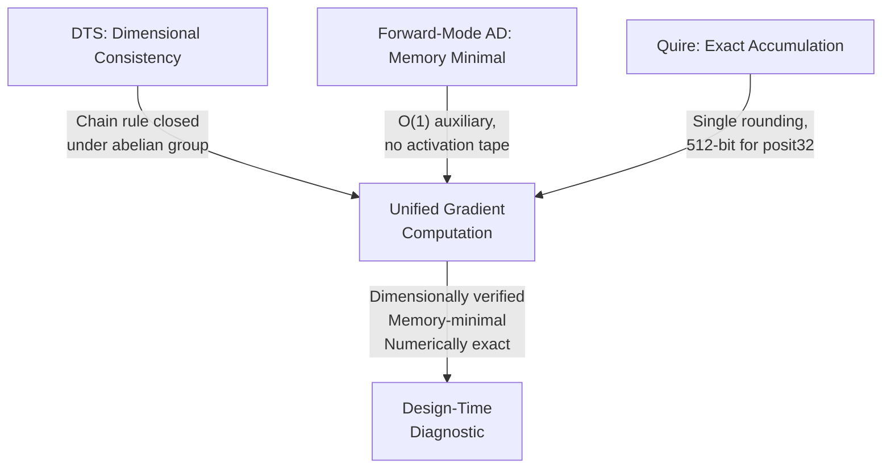

## The Activation Tape Problem

Reverse-mode automatic differentiation (backpropagation) has a well-known memory cost. To compute gradients during the backward pass, the system must retain intermediate activations from the forward pass. For a network with \(L\) layers and batch size \(B\), this imposes an \(O(L \cdot B)\) auxiliary memory requirement. The activations must persist from their creation during the forward pass until their consumption during the backward pass; their lifetime spans the entire training step.

This is not an implementation detail. It is a structural property of reverse-mode AD. The backward pass requires the intermediate values as a contextual resource, which in the Fidelity framework's terminology makes it a coeffect. The activation tape is a memory obligation that the computation imposes on its environment.

Gradient checkpointing and other memory-reduction techniques trade compute for memory, recomputing activations during the backward pass to avoid storing them. These techniques reduce the constant factor but do not change the fundamental structure: reverse-mode AD requires either storing or recomputing intermediate values.

## The Forward Gradient

Baydin, Pearlmutter, Syme, Wood, and Torr [1] demonstrated a different approach. The *forward gradient* is an unbiased estimate of the gradient computed via forward-mode automatic differentiation. For a random perturbation vector \(v\), the forward gradient computes the directional derivative:

\[\nabla_v f(\theta) = \langle \nabla f(\theta), v \rangle\]

This is evaluated in a single forward pass. There is no backward pass. There is no activation tape.

The gradient estimate is unbiased: its expectation over random perturbation vectors equals the true gradient. The variance depends on the perturbation distribution and can be controlled through standard variance reduction techniques. The tradeoff is statistical: exact gradients via reverse-mode vs. unbiased estimates via forward-mode, with the forward approach eliminating the memory obligation entirely.

## The Coeffect Signature

In the Fidelity framework's coeffect system, these two approaches have distinct signatures:

| Property | Reverse-Mode | Forward-Mode [1] |
|---|---|---|
| Auxiliary memory | \(O(L \cdot B)\) | \(O(1)\) per layer |
| Gradient quality | Exact (full Jacobian transpose) | Unbiased estimate (directional derivative) |
| Activation tape | Required; lifetime spans full backward pass | Not required |
| Escape analysis | Intermediate values escape layer scope | No intermediate values escape layer scope |

The forward-mode signature is significant for the escape analysis described in [Section 3.2 of the DTS/DMM paper](/publications/dts-dmm/). When no intermediate values escape their creating scope, every allocation is stack-eligible. The escape classification for every intermediate value is *StackScoped*; the allocation strategy is `memref.alloca`; the lifetime bound is the lexical scope of the layer computation.

This is a verifiable compile-time property. Given a computation graph annotated with AD mode, the Fidelity framework's lifetime analysis can confirm that forward-mode imposes no lifetime obligations beyond the current layer's scope. The coeffect system does not need heuristics or runtime checks; it follows from the structure of forward-mode evaluation.

## The Quire Connection

Forward-mode computes directional derivatives via inner products. The inner product \(\langle \nabla f(\theta), v \rangle\) is an accumulation of products, exactly the operation the posit quire makes exact.

The quire holds intermediate multiply-add results without rounding. For posit32, the quire occupies \(n^2/2 = 512\) bits = 64 bytes, exactly one cache line. Rounding occurs once, when the final accumulated result is converted back to a posit value [2]. This single-rounding property is significant for gradient accumulation: the directional derivative computation accumulates across all parameters in a layer, and any per-step rounding error compounds across millions of parameters during training.

The quire's coeffect profile in this context:

- **Allocation:** 64 bytes on stack (CPU) or 512-bit fabric pipeline (FPGA)
- **Lifetime:** bounded by the forward pass through one layer; no escape
- **Capability:** available on CPU (software emulation, ~50 cycles/FMA) and FPGA (hardware pipeline, 1 cycle/FMA); unavailable on neuromorphic targets without exact accumulation support

The quire's lifetime aligns with the forward gradient's memory profile. Both are scoped to a single layer's computation. Neither requires persistence beyond the layer boundary. The coeffect system tracks both through the same inference pipeline, and the design-time diagnostic shows them together:

```
gradient_estimate: float<loss · param⁻¹>
  AD mode: forward (Baydin et al. [1])
  Accumulation: Quire (exact, single rounding)
  ├─ x86_64:  stack, 64 bytes, ~50 cycles/fma, O(1) auxiliary memory
  ├─ xilinx:  512-bit fabric pipeline, 1 cycle/fma, O(1) auxiliary
  └─ Memory:  no activation tape, no escape, fully stack-eligible
```

## Dimensional Consistency Under Differentiation

The third property is dimensional. The DTS framework's dimensional algebra is closed under differentiation. If \(f\) maps values with dimension \(d_1\) to values with dimension \(d_2\), then the derivative \(\partial f / \partial x\) carries dimension \(d_2 \cdot d_1^{-1}\). This follows from the abelian group structure: differentiation is division in the dimensional algebra, and division is closed in \(\mathbb{Z}^n\).

For gradient computation, this means:

- The gradient of a loss function with dimension \(\langle\text{loss}\rangle\) with respect to a parameter with dimension \(\langle d \rangle\) carries dimension \(\langle\text{loss} \cdot d^{-1}\rangle\)
- Gradient accumulation across parameters with different dimensions is dimensionally constrained: a gradient with dimension \(\langle\text{N} / \text{m}\rangle\) cannot be accumulated with a gradient of dimension \(\langle\text{J} / \text{s}\rangle\) without a dimensional error
- The chain rule preserves dimensional consistency through the computation graph; each gradient node inherits a dimension from the chain rule, verified by the same Gaussian elimination that verifies the forward pass

This verification is decidable, requires no annotation beyond the physical dimensions already present in the forward computation, and has zero runtime cost. The inference algorithm from [Section 2.2 of the DTS/DMM paper](/publications/dts-dmm/) extends to auto-differentiation graphs without modification.

## Physics-Informed Loss Terms

The dimensional verification has a concrete application in physics-informed neural networks [3]. A loss term that penalizes violations of Newton's second law computes \(F - ma\) and minimizes the squared residual. DTS can verify at compile time that \(F\), \(m\), and \(a\) carry dimensions \(\langle\text{N}\rangle\), \(\langle\text{kg}\rangle\), and \(\langle\text{m} \cdot \text{s}^{-2}\rangle\) respectively, and that the subtraction \(F - ma\) is dimensionally consistent.

This is a structural check on the loss function's definition, not a runtime constraint on the model's outputs. It ensures that the physics constraints imposed during training are dimensionally well-formed. Existing ML frameworks cannot provide this verification because dimensional information is never encoded in the type system and is not available at any stage of the compilation pipeline.

## The Composition

Three independently established properties compose in the PSG:



- **DTS** verifies dimensional consistency of the gradient graph, including through the chain rule, at compile time
- **Forward-mode AD** eliminates the activation tape coeffect, making gradient computation stack-eligible
- **The quire** provides exact accumulation for the inner products that forward-mode computes

Each property is established independently in the literature ([1] for forward gradients, [2] for quire accumulation, [Section 2 of DTS/DMM](/publications/dts-dmm/) for dimensional type systems). Their composition within the PSG is the contribution: a system where gradient computation is simultaneously dimensionally verified, memory-minimal, and numerically exact, with all three properties visible and verifiable at design time.

## Representation Selection for Training

The representation selection framework from [the companion entry on posit arithmetic](/blog/posit-arithmetic-dimensional-type-systems/) applies directly to training workloads. Neural network activations and gradients have well-characterized value distributions, typically concentrated near zero with heavy tails. The dimensional range of activations in a specific layer is inferrable from training statistics or from dimensional constraints on the input domain.

Given this range, the compiler's representation selection function can choose posit widths that concentrate precision where the values cluster. The quire provides exact gradient accumulation regardless of the chosen posit width, eliminating the rounding errors that compound across millions of parameters.

This connection between DTS (which provides the dimensional range), posit arithmetic (which provides domain-matched precision), and DMM (which tracks the quire's allocation and lifetime) is an instance of the representation selection framework applied to a specific computational domain. The analysis is the same; the domain is different.

## Current Status and Limitations

The forward gradient method has known limitations. The variance of the gradient estimate increases with parameter count, and variance reduction techniques add computational overhead. For very large models, the statistical cost may exceed the memory savings. The optimal tradeoff between reverse-mode and forward-mode is an empirical question that depends on model architecture, hardware memory constraints, and acceptable training time.

The quire's exact accumulation eliminates one source of numerical error but does not address the statistical noise inherent in the forward gradient estimate. The combination reduces *numerical* error to zero (via exact accumulation) while accepting *statistical* error (from the directional derivative estimate). Whether this tradeoff is favorable depends on the specific workload.

The dimensional verification for physics-informed loss terms is sound but narrow: it catches dimensional inconsistencies in the loss function's definition, not errors in the model's learned representations. A dimensionally consistent loss term can still produce a model that makes incorrect predictions; dimensional correctness is necessary but not sufficient for physical fidelity.

These limitations are real and should inform expectations. The contribution is not that forward gradients + quires + DTS solve machine learning; it is that three independently valuable properties compose naturally within the PSG, and the composition can be verified at compile time.

## References

[1] A. G. Baydin, B. A. Pearlmutter, D. Syme, F. Wood, and P. Torr, "Gradients without Backpropagation," arXiv:2202.08587, 2022.

[2] Posit Working Group, "Standard for Posit Arithmetic (2022)," posithub.org, 2022.

[3] M. Raissi, P. Perdikaris, and G. E. Karniadakis, "Physics-informed neural networks: A deep learning framework for solving forward and inverse problems involving nonlinear partial differential equations," *Journal of Computational Physics*, vol. 378, pp. 686-707, 2019.
