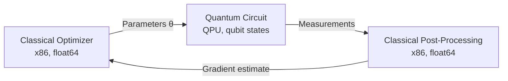

## The Categorical Structure of Quantum Mechanics

Quantum mechanics has been categorical since before computer scientists adopted the vocabulary. Abramsky and Coecke's work on categorical quantum mechanics [1] formalized what physicists had been using informally: quantum processes compose as morphisms in a dagger compact category, a monoidal category with a contravariant involution that captures the adjoint (conjugate transpose) operation on Hilbert spaces (\(\dagger\)-compact category).

In concrete terms:

- **Objects** are Hilbert spaces (the state spaces of quantum systems)
- **Morphisms** are completely positive maps (quantum channels, including unitary evolution and measurement)
- **The dagger** (\(\dagger\)) assigns to each morphism its adjoint: if \(U\) is a unitary gate, then \(U^\dagger\) is its conjugate transpose, satisfying \(UU^\dagger = U^\dagger U = I\)
- **The monoidal structure** (\(\otimes\)) captures tensor products: the state space of a composite quantum system is the tensor product of its components

This is the same adjoint structure that appears in [the CDL paper's treatment of neural networks](/blog/categorical-deep-learning-adjoint-correspondence/) and in the HPC adjoint method. The forward/backward duality that unifies backpropagation with sensitivity analysis has a third instance in quantum mechanics: unitary evolution paired with its conjugate.

The mathematics is not an analogy. The composition laws, naturality conditions, and coherence constraints are identical across all three domains. The substrate differs; the algebraic structure does not.

## The Q# Lineage

Microsoft Research's Q# language provides concrete evidence of the alignment between ML-family languages and quantum computation. John Azariah [documented the design process](https://johnazariah.github.io/2018/12/04/tale-of-two-languages.html) of building Q# from F#, and the result is instructive: F#'s computation expressions, algebraic data types, and type inference translated naturally to quantum circuit construction because the categorical structures are compatible.

This is not unique to F#. Any ML-family language with higher-order functions and algebraic data types can express quantum circuits. The relevant property is that the language supports composition of typed morphisms, which is the categorical structure that quantum circuits exhibit.

For our Fidelity framework, the implication is specific: our PSG's mechanisms for tracking forward/backward relationships, propagating coeffects, and verifying composition at target boundaries are architecturally compatible with quantum circuit compilation. A quantum target would slot into the existing multi-target compilation as another backend, with its own representation profile (qubit states, gate fidelities, error rates) and its own transfer boundary analysis (classical/quantum interface).

## The Hardware Maturity Gap

The categorical compatibility between our software infrastructure and quantum computation does not mean that quantum compilation is imminent. The gap between mathematical structure and practical hardware is substantial, and honest accounting requires stating it plainly.

**Gate fidelities.** Current superconducting qubit systems (IBM Eagle, Google Sycamore) achieve two-qubit gate fidelities in the 99.7-99.9% range for specific gate types, and trapped-ion platforms (IonQ, Quantinuum) have reported fidelities above 99.9%. For algorithms requiring thousands of sequential gate operations, the cumulative error still renders the output unreliable without error correction, though the per-gate baseline has improved materially since this post was first written in September 2025.

**Error correction overhead.** Fault-tolerant quantum computing requires quantum error correction codes that encode each *logical* qubit in many *physical* qubits. As of this post's original writing in September 2025, the commonly cited overhead for near-term fault tolerance was approximately 1,000 physical qubits per logical qubit, derived from surface-code analyses at the physical error rates of that era. A useful computation requiring 100 logical qubits would have needed approximately 100,000 physical qubits under that baseline, while the largest systems then available held on the order of 1,000 to 1,100 physical qubits total.

The overhead baseline compressed substantially over the months that followed, across multiple decoder families and physical substrates. Work on neural decoders for bivariate bicycle codes in the qLDPC family, specifically the [[144, 12, 12]] Gross code, demonstrated utility-scale logical error rates (around \(10^{-10}\)) at physical error rates of 0.1% when the decoder is a geometry-aware convolutional model trained against the code's noise distribution. That configuration encodes 12 logical qubits in 144 physical qubits, a 12:1 ratio against the 1,000:1 surface-code baseline. [IonQ's April 2026 walking-cat specification](https://arxiv.org/abs/2604.19481) compresses further on the trapped-ion substrate: their Q70 code encodes 22 logical qubits in 70 physical qubits, a 3.2:1 ratio, with a three-tier decoder stack (belief propagation, relay belief propagation, mixed-integer programming) that reaches 98.6%, 99.93%, and 100% convergence across the tabulated error regimes as successive tiers engage. Oratomic has reported a 5:1 ratio for their neutral-atom system. These numbers sit more than two orders of magnitude below where the September 2025 baseline placed them. The compression is confined to specific parameter regimes and is conditional on the decoder being a learned or multi-stage component with empirical validation against the noise distribution; with classical BP-OSD decoding alone, the ratio collapse does not hold. The practical consequence, and the one that matters for the CRQC timeline framing, is that the threshold where fault-tolerant quantum computing becomes resource-feasible has moved closer in both the physical and logical qubit counts required for specific problem classes. Taken together with [Google's March 2026 ECDLP resource estimates](/blog/cryptographic-certainty/#update-april-2026) and the [Cain et al. neutral-atom result](https://arxiv.org/abs/2603.28627) referenced in that same update, the trajectory is the one our [Mosca Moment](https://speakez.tech/blog/the-mosca-moment-quantum-y2k/) analysis predicted: a CRQC horizon that narrows faster in practice than the early estimates assumed.

**Decoherence timescales.** The constraint depends strongly on the physical modality. Superconducting qubits maintain coherence for approximately 100 microseconds with gate operations in the 20 to 100 nanosecond range, which limits circuit depth to roughly 1,000 to 5,000 gates before decoherence dominates. Trapped-ion systems maintain coherence on the order of seconds to minutes, which is why the IonQ walking-cat architecture can specify circuits that execute over hours: the April 2026 paper tabulates a 23-hour schedule for 30-bit integer factoring. Neutral-atom systems sit between the two, with coherence times in the tens of seconds. The modality choice determines which error-correction regime and which algorithm class are viable on a given device.

**Connectivity constraints.** The constraint has shifted since September 2025 as trapped-ion and neutral-atom architectures have matured. Superconducting systems remain largely nearest-neighbor on a 2D grid, with arbitrary qubit interactions routed through SWAP gates that increase circuit depth and error accumulation. Trapped-ion architectures with engineered transport, including the IonQ walking-cat design, provide long-range connectivity directly through the transport layer: ions physically move between zones, and two qubits that need to interact meet in a shared gate zone and couple directly. Neutral-atom systems provide native all-to-all connectivity through optical shuttling. Both architectures make qLDPC codes viable (bivariate bicycle codes, the Gross code) because those codes rely on the non-local connectivity that the transport layer supplies.

These constraints are hardware limitations, not software limitations. They are being actively addressed by the quantum computing community through improved qubit designs, better error correction codes, and alternative physical substrates (trapped ions, photonic systems, topological qubits). Progress is real but incremental.

Our cellular sheaf framework, developed in [the compilation sheaf design document](/docs/design/categorical-foundations/the-compilation-sheaf/), gives a precise vocabulary for what quantum error correction is doing, and it identifies a research direction that the framework's structure makes tractable to pursue. Gate errors in a quantum circuit produce local inconsistencies in the circuit sheaf: the stalk at a noisy gate carries an error component that is not consistent with what the structure maps from upstream and downstream gates expect. This is a non-trivial \(H^1\) obstruction to extending the local stalks into a global section over the entire circuit. Quantum error correction codes are algorithms for resolving these obstruction classes by encoding logical qubits in many physical qubits and computing syndromes that identify which obstruction class is present. The surface code and other topological codes are, in our reading, algorithms for finding cocycle witnesses that kill specific \(H^1\) classes of the noisy circuit sheaf.

Our framing positions QEC as a target the compilation-sheaf machinery is structurally aligned with. The compilation sheaf already supports stalks of arbitrary categories, structure maps that may have non-trivial kernels, and a dual-pass discharge mechanism that witnesses global sections at every edge of the compilation poset. A quantum target would slot into this machinery as another stalk category (qubit states with completely positive maps as morphisms), and the QEC layer would sit at the boundary where our formally verified fragments hand off to an empirically validated decoder. Each code (surface code, color code, bivariate bicycle code) has an algebraic part the compiler can reason about directly and a decoder part that depends on the full error distribution rather than on the code's algebraic structure alone. The algebraic part fits our parameterized-lemma pattern: specify the code, the noise model, and the connectivity graph, and the compiler instantiates a cocycle witness against them. The decoder part is a learned function whose coefficients come from training against the noise distribution, and the compilation sheaf's role there is to carry the input specifications and the output bounds across the interface rather than to derive the decoder's behavior from the algebraic structure. Writing the algebraic layer would require collaboration between formal methods researchers, quantum information theorists, and hardware specialists. The decoder layer is an empirical research program in its own right, and the compilation sheaf's contribution there is the structural discipline that keeps the interface between the algebraic and empirical layers honest.

The practical consequence is that improving the physical-to-logical ratio is split between hardware work (lowering physical error rates), algebraic work (designing better codes with favorable distance and rate properties), and empirical work (training decoders to exploit the full error distribution rather than the minimum-weight representatives). Our compilation sheaf assigns each of those to a distinct stalk: the algebraic work instantiates a code stalk the compiler reasons about as a cocycle witness, the empirical work instantiates a decoder stalk whose coefficients come from training against the noise distribution, and the hardware work parameterizes the noise model both stalks resolve against. The structure maps between the stalks carry the bounds the decoder produces into the certificate the algebraic layer requires. That is what the cohomological framing provides: a place for the QEC layer to sit inside the framework's categorical scaffolding when the hardware is ready, with the algebraic discipline on one side and the empirical decoder discipline on the other, both connected by the sheaf's structure-map vocabulary. The compression from the 1,000:1 surface-code baseline to the 12:1 BB-code configuration and then to the 3.2:1 walking-cat configuration is evidence that the decoder stalk carries as much of the cohomological burden as the code stalk. The walking-cat decoder stack is a concrete example: belief propagation, relay belief propagation, and mixed-integer programming each handle a different regime of the convergence curve, and the compilation sheaf's tier structure keeps the algebraic layer (where formal verification applies) and the learned-and-staged decoder layer (where empirical validation against the noise distribution applies) on separate verification tracks connected by the structure-map interface.

## Quantum Compilation as Spatial Lowering

The IonQ walking-cat paper lays out its compilation stack explicitly: application level, compiler instruction set, logical architecture, micro-architecture, device instruction set, device. Each stage is architecture-specific, each stage lowers the representation toward the physical substrate, and the effective "ISA" is the trap geometry itself. That shape tracks FPGA compilation more closely than CPU compilation. An FPGA flow runs from HDL through synthesis, technology mapping, placement, and routing to a bitstream, with each stage architecture-specific and with the fabric itself as the ISA. The walking-cat micro-architecture is a placement-and-routing problem under a different substrate: which ions occupy which trap zones, which junctions they traverse, how ring-transport schedules interleave with gate operations.

The resource-factory structure in the IonQ paper's execution schedule is a dataflow-scheduling problem. Memory blocks, magic factories, cat factories, Bell factories, and qubit factories each produce and consume resources on different timescales, and the architecture coordinates heterogeneous production lines whose outputs feed the main computation at different rates under device-geometry constraints. The decomposition from the logical instruction set through the physical instruction set to the device instruction set is a lowering pass whose specifics depend on the target: logical operations (block preparation, destructive measurement, in-block measurement, inter-block measurement, magic state preparation) resolve into physical operations (Viterbi measurement, error-detected measurement, cat-based measurement, cat state production, cat state stitching, physical rotation, H-state preparation), and the resolution is architecture-specific at every level.

Our Fidelity framework's multi-target compilation architecture handles this kind of lowering pipeline directly. As a companion example, our Program Semantic Graph (PSG) can target FPGA hardware through the CIRCT dialect, and the same representation profile system and coeffect tracking for connectivity and timing apply to a quantum backend. Prospero's orchestration and the Olivier actor model coordinate heterogeneous resource flows, which maps onto the factory-scheduling problem the walking-cat paper describes. The quantum compiler problem is structurally a spatial compilation problem, with qubits where LUTs sit on an FPGA and ion transport where interconnect routing sits.

## What "Quantum-Ready" Means

Given the hardware maturity gap, what does it mean for a software framework to be "quantum-ready"? The answer is modest but specific.

**Architectural compatibility.** Our PSG's multi-target compilation architecture does not need structural modification to accommodate a quantum backend. The mechanisms for target-specific representation selection, coeffect tracking, and cross-target transfer analysis generalize to quantum targets. When the compiler selects representations for a quantum target, it evaluates gate decompositions and qubit connectivity constraints using the same optimization framework that selects posit widths for FPGA targets.

**Transfer boundary analysis.** The classical/quantum interface is a transfer boundary with specific characteristics: classical data must be encoded into quantum states (preparation), quantum computation produces classical outcomes (measurement), and the encoding/decoding has a fidelity profile that our DTS can analyze. This is structurally identical to the FPGA/CPU transfer boundary, where posit32 values encode to float64 with quantifiable precision loss.

**Verification infrastructure.** Our coeffect system's capability tracking could express quantum hardware constraints: qubit count, connectivity topology, gate set, coherence time, and error rates. A computation that requires more qubits than available, or deeper circuits than coherence permits, would produce a capability coeffect failure, just as a computation requiring exact accumulation produces a failure on neuromorphic targets.

What "quantum-ready" does *not* mean is that we implement quantum circuit compilation today, or that quantum backends will produce useful results on current hardware. The framework accommodates quantum as an eventual target without requiring architectural rework. This is a property of the design, not a shipping feature.

## The Hybrid Computing Model

The more immediate value of categorical compatibility is in hybrid classical/quantum workflows, where a classical optimizer drives a quantum subroutine (the variational quantum eigensolver pattern). In this model:

The classical components run on conventional targets with conventional numeric representations. The quantum component executes a parameterized circuit and returns measurement outcomes. Our PSG tracks the full loop: parameter preparation (classical), circuit execution (quantum), measurement (classical/quantum boundary), and gradient estimation (classical).

Our dimensional type system verifies consistency across the loop. Parameters with physical dimensions (energy in Hartrees, distance in Bohr radii) must maintain dimensional consistency through the quantum circuit and back. The coeffect system tracks the transfer boundary: which values cross the classical/quantum interface, what encoding is used, and what measurement fidelity is expected. The transfer edge is carried in practice by our [BAREWire](/blog/getting-the-signal-with-barewire/) protocol, a zero-copy CXL memory-mapping layer that preserves type structure across the boundary as a provable invariant, which is the integrity guarantee that makes a hybrid workflow tractable as a first-class target; narrowly scoped QPU-only or codec-only research efforts leave the classical/quantum bridge as a downstream integration problem. While we are interested in the categorical foundations of our work, we also recognize that those foundations are in service of solving real engineering problems on sound footing.

This hybrid model is tractable on near-term quantum hardware because the quantum component is a subroutine with bounded depth, not an entire computation. The error correction overhead is reduced because the circuit depth is short. The classical components handle the optimization loop, gradient estimation, and error mitigation, all of which benefit from our DTS/DMM infrastructure regardless of whether the quantum component is simulated or runs on physical hardware.

## Timeline Expectations

For the Fidelity framework specifically:

**Present.** Our PSG architecture supports multi-target compilation. CPU and FPGA targets compile through the MLIR pipeline. And we consider our categorical foundation to make it amenable to quantum backends. Quantum circuit simulation can be targeted as a classical computation with standard compilation. Our [BAREWire](/blog/getting-the-signal-with-barewire/) protocol already ships as the zero-copy bridge across the CXL memory boundary, which is the same bridge a hybrid classical/quantum workflow needs at the QPU interface.

**Near-term** Hybrid classical/quantum workflows remain the practical frontier for most users, and the resource estimates that have landed since the original writing of this post have compressed the near-term envelope by roughly a year. Our transfer boundary analysis applies to the classical/quantum interface, and variational algorithms with shallow quantum circuits are the target use case. The qLDPC and learned-decoder compression discussed above means that some fault-tolerant subroutines now fit inside the near-term window for specific problem sizes, which would not have been the case under the surface-code baseline. The IonQ walking-cat paper is a complete engineering specification for a fault-tolerant system with concrete resource tables, which puts the medium-term horizon much closer to the near-term boundary than it sat six months ago.

**Medium-term** Fault-tolerant quantum computing with sufficient logical qubits for genuine algorithmic advantage over classical computation, for the specific problem classes the BB-code and walking-cat configurations favor (quantum chemistry, optimization, sampling, and cryptographically relevant integer factoring at the scales the IonQ resource tables address). The boundary between near-term and medium-term depends on which decoder architecture the deployed hardware supports and which physical substrate reaches production first. Classical BP-OSD pipelines on superconducting systems keep the boundary at the earlier surface-code estimate; geometry-aware learned decoders and multi-stage decoder stacks on trapped-ion and neutral-atom systems move it substantially closer. Our framework's role is the same in both cases, which is what makes the categorical compatibility claim robust to the specific hardware timeline.

**Long-term** Our categorical foundation provides the theoretical guarantee that quantum targets compose with classical targets through the same algebraic structure. The infrastructure we built for classical multi-target compilation transfers to quantum/classical hybrid systems without architectural rework.

This framing marks waypoints for the framework's quantum capabilities developing real-world utility, conditional on hardware and decoder developments outside our control. The collapsing horizon our [Mosca Moment](https://speakez.tech/blog/the-mosca-moment-quantum-y2k/) analysis predicted has begun to materialize through parallel advances in algebraic code design, learned and multi-stage decoder architectures, and substrate engineering (trapped-ion transport, neutral-atom shuttling). The IonQ walking-cat specification turns what was a physics proposal into an engineering roadmap with concrete resource tables, and the earlier-than-expected arrival of fault-tolerant subroutines for specific problem classes is the practical evidence that the compression is real.

## References

[1] S. Abramsky and B. Coecke, "A categorical semantics of quantum protocols," in *Proc. 19th Annual IEEE Symposium on Logic in Computer Science*, pp. 415-425, 2004.
