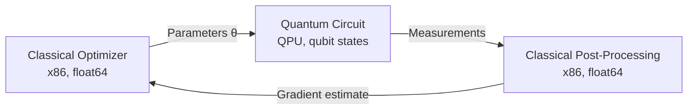

Quantum compilation is a prospective application of Clef's general systems foundation. The [four-tier model in Quantum Optionality](/blog/quantum-optionality/#the-foundation-four-tiers-automatic-dispatch) starts with automatic inference from types, then obligations derived from graph coeffects, reusable laws for joint concerns retained by PSG hyperedges, and supported cRHL/pRHL relations. Application developers receive the coverage of admitted rules without adding proof attributes to every operation. Quantum-specific unitarity and boundary laws would extend that foundation through domain-library work.

## The Categorical Structure of Quantum Mechanics

Quantum mechanics has been categorical since before computer scientists adopted the vocabulary. Abramsky and Coecke's work on categorical quantum mechanics [1] formalized what physicists had been using informally: quantum processes compose as morphisms in a dagger compact category, a monoidal category with a contravariant involution that captures the adjoint (conjugate transpose) operation on Hilbert spaces (\(\dagger\)-compact category).

In concrete terms:

- **Objects** are Hilbert spaces (the state spaces of quantum systems)
- **Morphisms** are completely positive maps (quantum channels, including unitary evolution and measurement)
- **The dagger** (\(\dagger\)) assigns to each morphism its adjoint: if \(U\) is a unitary gate, then \(U^\dagger\) is its conjugate transpose, satisfying \(UU^\dagger = U^\dagger U = I\)
- **The monoidal structure** (\(\otimes\)) captures tensor products: the state space of a composite quantum system is the tensor product of its components

This is the same adjoint structure that appears in [the CDL paper's treatment of neural networks](/docs/design/categorical-foundations/categorical-deep-learning-adjoint-correspondence/) and in the HPC adjoint method. The forward/backward duality that unifies backpropagation with sensitivity analysis has a third instance in quantum mechanics: unitary evolution paired with its conjugate.

These domains offer useful compositional structures, but their semantics and preservation laws must be established separately. The presence of an adjoint in each does not establish a shared implementation proof.

## The Q# Lineage

Microsoft Research's Q# language provides concrete evidence of the alignment between ML-family languages and quantum computation. John Azariah [documented the design process](https://johnazariah.github.io/2018/12/04/tale-of-two-languages.html) of building Q# from F#: F#'s computation expressions, algebraic data types, and type inference translated naturally to quantum circuit construction because the categorical structures are compatible.

This is not unique to F#. Any ML-family language with higher-order functions and algebraic data types can express quantum circuits. The relevant property is that the language supports composition of typed morphisms, which is the categorical structure that quantum circuits exhibit.

For our Fidelity Framework, these connections motivate investigating how the PSG could retain quantum composition laws, resource requirements, and transfer boundaries. A quantum backend would need a domain interpretation, representation and device profiles, and checked lowering rules. Existing mechanisms for coeffects and joint constraints provide an architectural starting point.

## The Hardware Maturity Gap

The categorical compatibility between our software infrastructure and quantum computation does not mean that quantum compilation is imminent. The gap between mathematical structure and practical hardware is substantial, and honest accounting requires stating it plainly.

**Gate fidelities.** Current superconducting qubit systems (IBM Eagle, Google Sycamore) achieve two-qubit gate fidelities in the 99.7-99.9% range for specific gate types, and trapped-ion platforms (IonQ, Quantinuum) have reported fidelities above 99.9%. For algorithms requiring thousands of sequential gate operations, the cumulative error still renders the output unreliable without error correction, though the per-gate baseline has improved materially since this post was first written in September 2025.

**Error correction overhead.** Fault-tolerant quantum computing requires quantum error correction codes that encode each *logical* qubit in many *physical* qubits. As of this post's original writing in September 2025, the commonly cited overhead for near-term fault tolerance was approximately 1,000 physical qubits per logical qubit, derived from surface-code analyses at the physical error rates of that era. A useful computation requiring 100 logical qubits would have needed approximately 100,000 physical qubits under that baseline, while the largest systems then available held on the order of 1,000 to 1,100 physical qubits total.

The overhead baseline compressed substantially over the months that followed our first publication, across multiple decoder families and physical substrates. Work on neural decoders for bivariate bicycle codes in the qLDPC family, specifically the [[144, 12, 12]] Gross code, demonstrated utility-scale logical error rates (around \(10^{-10}\)) at physical error rates of 0.1% when the decoder is a geometry-aware convolutional model trained against the code's noise distribution. That configuration encodes 12 logical qubits in 144 physical qubits, a 12:1 ratio against the 1,000:1 surface-code baseline. [IonQ's April 2026 walking-cat specification](https://arxiv.org/abs/2604.19481) compresses further on the trapped-ion substrate: their Q70 code encodes 22 logical qubits in 70 physical qubits, a 3.2:1 ratio, with a three-tier decoder stack (belief propagation, relay belief propagation, mixed-integer programming) that reaches 98.6%, 99.93%, and 100% convergence across the tabulated error regimes as successive tiers engage. Oratomic has reported a 5:1 ratio for their neutral-atom system. These three ratios are parallel results from different modalities solving different engineering problems: substrate-agnostic code design with a learned decoder, neutral-atom connectivity with shuttling, and trapped-ion transport under QCCD. Each is an independent advance, not the next point on one trajectory. 

> All three sit more than two orders of magnitude below the September 2025 baseline.

The compression is confined to specific parameter regimes and is conditional on the decoder being a learned or multi-stage component with empirical validation against the noise distribution. With classical BP-OSD decoding alone, the ratio collapse does not hold. The practical consequence is that the threshold where fault-tolerant quantum computing becomes resource-feasible has moved closer in both the physical and logical qubit counts required for specific problem classes. While this concern is of peripheral interest to this document, it is something we have been watching for years, and it underscores the importance of normalizing both quantum compute and post-quantum encryption.

**Decoherence timescales.** The constraint depends strongly on the physical modality. Superconducting qubits maintain coherence for approximately 100 microseconds with gate operations in the 20 to 100 nanosecond range, which limits circuit depth to roughly 1,000 to 5,000 gates before decoherence dominates. Trapped-ion systems maintain coherence on the order of seconds to minutes, which is why the IonQ walking-cat specification projects circuit schedules spanning hours under its target parameters: the April 2026 paper tabulates a 23-hour schedule for 30-bit integer factoring as a resource projection, not a measured run. Neutral-atom systems sit between the two, with coherence times in the tens of seconds. The modality choice determines which error-correction regime and which algorithm class are viable on a given device.

**Connectivity constraints.** The constraint has shifted since September 2025 as trapped-ion and neutral-atom architectures have matured. Superconducting systems remain largely nearest-neighbor on a 2D grid, with arbitrary qubit interactions routed through SWAP gates that increase circuit depth and error accumulation. Trapped-ion architectures with engineered transport, including the IonQ walking-cat design, provide long-range connectivity directly through the transport layer: ions physically move between zones, and two qubits that need to interact meet in a shared gate zone and couple directly. Neutral-atom systems provide native all-to-all connectivity through optical shuttling. Silicon quantum-dot architectures such as [HRL's April 2026 prototype](https://arxiv.org/abs/2604.16216) operate in a more constrained regime: nearest-neighbor exchange coupling in a linear array of dots, with shuttle operations extending the effective neighborhood. The scaling thesis there is semiconductor-fab manufacturability rather than transport engineering. The trapped-ion and neutral-atom substrates make qLDPC codes viable (bivariate bicycle codes, the Gross code) because those codes rely on the non-local connectivity the transport layer supplies. Whether the silicon regime admits comparable codes at scale is a separate open question for that modality.

These constraints are hardware limitations, not software limitations. The quantum computing community is addressing them through improved qubit designs and better error-correction codes. Alternative physical substrates (trapped ions, photonic systems, topological qubits) are a parallel line of attack. Progress is real but incremental.

Our [compilation sheaf design](/docs/design/categorical-foundations/the-compilation-sheaf/) offers a research vocabulary for retaining compatible facts through such a pipeline. Applying it to quantum error correction would first require a concrete model of circuit operations, errors, and observations, together with a proved connection between any computed obstruction and the property being reported. A noisy gate alone does not establish a non-trivial cohomology class, and a sheaf description alone does not supply an error-correction procedure.

A quantum error-correction library could contribute parameterized laws about a particular code under stated assumptions. Tier 3 dispatch would instantiate admitted laws from the relevant PSG participants and check their premises. Proving preservation between implementations could require a Tier 4 relation. The code, noise model, decoder, and device interface each need a semantic account; their integration into Fidelity remains prospective.

Code design, decoder validation, and physical error reduction supply different kinds of evidence. Empirical decoder performance remains conditional on the evaluated regime. The intended role of the graph is to retain those conditions at the interfaces where another result depends on them, including the distinction between a measured performance estimate and a proved bound.

Resource estimates and decoder convergence results can motivate this research, but they do not validate a compilation-sheaf model of quantum error correction. Relating that model to the selected code and decoder is additional proof work. Meeting a physical device's latency and noise constraints remains an engineering obligation.

## Quantum Compilation as Spatial Lowering

The IonQ walking-cat paper lays out its compilation stack explicitly: application level, compiler instruction set, logical architecture, micro-architecture, device instruction set, device. Every stage is architecture-specific and lowers the representation toward the physical substrate, and the effective "ISA" is the trap geometry itself. The paper's scope is the upper portion of that stack: the logical architecture and factory-scheduling layers are specified in detail, while the bottom two layers (device instruction set, device) appear as interface boundaries rather than solved implementation. Analog control, real-time decoder integration under latency constraints, and classical/quantum marshaling remain layers above and below the paper's scope and are the subject of separate efforts. That shape resembles FPGA compilation more closely than CPU compilation. An FPGA flow runs from HDL through synthesis, technology mapping, placement, and routing to a bitstream, with each stage architecture-specific and with the fabric itself as the 'ISA' for lack of a better term. The walking-cat micro-architecture is a placement-and-routing problem under a different substrate: which ions occupy which trap zones, which junctions they traverse, how ring-transport schedules interleave with gate operations.

The resource-factory structure in the IonQ paper's execution schedule is a dataflow-scheduling problem. Memory blocks, magic factories, cat factories, Bell factories, and qubit factories each produce and consume resources on different timescales, and the architecture coordinates heterogeneous production lines whose outputs feed the main computation at different rates under device-geometry constraints. The decomposition from the logical instruction set through the physical instruction set to the device instruction set is a lowering pass whose specifics depend on the target: logical operations (block preparation, destructive measurement, in-block measurement, inter-block measurement, magic state preparation) resolve into physical operations (Viterbi measurement, error-detected measurement, cat-based measurement, cat state production, cat state stitching, physical rotation, H-state preparation), and the resolution is architecture-specific at every level.

Fidelity's work on heterogeneous and spatial compilation provides relevant experience for investigating this pipeline. The PSG can retain joint placement and resource constraints, while actor orchestration provides a way to describe classical coordination. Quantum gate semantics, resource factories, timing, and device control still require target-specific models and preservation arguments.

## What "Quantum-Ready" Means

Given the hardware maturity gap, what does it mean for a software framework to be "quantum-ready"? The meaning is specific and limited.

**Architectural compatibility.** Target-specific representation selection, coeffect tracking, and cross-target analysis provide places to express quantum requirements. Whether the current representations are sufficient must be established by implementing and validating a quantum target. Categorical similarity does not establish that this integration needs no architectural changes.

**Transfer boundary analysis.** Preparation and measurement require explicit relations between classical data, quantum states, and classical observations. Layout and numeric conversion contracts can support the classical portions of a hybrid workflow. They do not by themselves justify state preparation, measurement fidelity, or a device's noise model.

**Verification infrastructure.** Given a declared device profile and sound domain analysis, graph coeffects could generate checks for supported qubit, connectivity, storage, and timing constraints before a run is submitted. A resource mismatch could then become a design-time diagnostic. Passing these checks would establish the specified constraints, with the device assumptions retained; it would not prove the physical outcome of the run.

Quantum circuit compilation and its domain-law integrations remain prospective. This section describes how the general verification design could accommodate them, with the implementation and semantic work still to be done.

## The Hybrid Computing Model

The more immediate value of categorical compatibility is in hybrid classical/quantum workflows, where a classical optimizer drives a quantum subroutine (the variational quantum eigensolver pattern). In this model:

```mermaid
graph LR
    C1[Classical Optimizer<br>x86, float64] -->|"Parameters θ"| Q[Quantum Circuit<br>QPU, qubit states]
    Q -->|"Measurements"| C2[Classical Post-Processing<br>x86, float64]
    C2 -->|"Gradient estimate"| C1
```

The classical components run on conventional targets with conventional numeric representations. The quantum component executes a parameterized circuit and returns measurement outcomes. In the design we envision, our PSG would track the full loop: parameter preparation (classical), circuit execution (quantum), measurement (classical/quantum boundary), and gradient estimation (classical).

In that proposed workflow, dimensional inference would check relationships among typed classical parameters. Graph coeffects would retain applicable resource and representation conditions. A quantum domain library would supply the rules needed to interpret the circuit and its observations. [BAREWire](/blog/getting-the-signal-with-barewire/) could carry the classical layout and transfer contracts, while preparation and measurement would retain their separate quantum semantics and device premises.

This hybrid model is tractable on near-term quantum hardware because the quantum component is a subroutine with bounded depth, not an entire computation. The error correction overhead is reduced because the circuit depth is short. The classical components handle the optimization loop, gradient estimation, and error mitigation, all of which benefit from our DTS/DMM infrastructure regardless of whether the quantum component is simulated or runs on physical hardware.

## Timeline Expectations

For the Fidelity framework specifically:

**Present.** The general systems work supplies the PSG, dimensional types, memory and representation contracts, and the proof-dispatch design. A classical quantum simulator can be treated as a classical numerical program, but proving its relation to ideal circuit semantics requires additional domain laws and numerical analysis. This document does not establish an implemented quantum backend or a verified quantum device interface.

**Near-term** Hybrid classical/quantum workflows remain the practical frontier for most users, and the resource estimates that have landed since the original writing of this post have compressed the near-term envelope by roughly a year. Our transfer-boundary design could support the classical/quantum interface once the domain semantics and device contracts are established; variational algorithms with shallow circuits provide one candidate use case. The qLDPC and learned-decoder compression discussed above means that some fault-tolerant subroutines now fit inside the near-term window for specific problem sizes, which would not have been the case under the surface-code baseline. The IonQ walking-cat paper specifies the logical architecture and factory-scheduling layers of a fault-tolerant system with concrete resource tables. Analog control, real-time decoder integration, and classical/quantum marshaling remain open engineering problems pursued by separate efforts, but the logical-layer specification alone compresses the medium-term resource estimates substantially.

**Medium-term** Fault-tolerant quantum computing with sufficient logical qubits for genuine algorithmic advantage over classical computation, for the specific problem classes the BB-code and walking-cat configurations favor (quantum chemistry, optimization, sampling, and cryptographically relevant integer factoring at the scales the IonQ resource tables address). The boundary between near-term and medium-term depends on which decoder architecture the deployed hardware supports and which physical substrate reaches production first. Classical BP-OSD pipelines on superconducting systems keep the boundary at the earlier surface-code estimate; under geometry-aware learned decoders and multi-stage decoder stacks on trapped-ion and neutral-atom systems, the boundary sits substantially earlier. Our framework's role is the same in both cases, which is what makes the categorical compatibility claim robust to the specific hardware timeline.

**Long-term.** Our aim is to support quantum and classical targets within a common account of types, graph constraints, and preservation through lowering. Achieving that requires checked semantic adapters and target-specific proofs. The shared categorical vocabulary motivates the work; it does not establish the result in advance.

This framing marks waypoints for the framework's quantum capabilities developing real-world utility, conditional on hardware and decoder developments outside our control. Compression has begun to materialize through parallel advances in algebraic code design, learned and multi-stage decoder architectures, and substrate engineering across several modalities: trapped-ion transport, neutral-atom shuttling, and silicon exchange-coupled dots with digital control. The IonQ walking-cat specification, the [Cain et al. neutral-atom result](https://arxiv.org/abs/2603.28627), and the HRL silicon prototype describe compression along logical-architecture, connectivity, and manufacturability axes respectively, and the earlier-than-expected arrival of fault-tolerant subroutines for specific problem classes is the practical evidence that the compression is real. Our [Mosca Moment](https://speakez.tech/blog/the-mosca-moment-quantum-y2k/) analysis develops the broader thesis that quantum compute becomes part of the standard compute landscape for certain problem classes on a faster timeline than most organizations have budgeted for. The architectural work described in this post is how our framework's foundations are prepared for that arrival.

## References

[1] S. Abramsky and B. Coecke, "A categorical semantics of quantum protocols," in *Proc. 19th Annual IEEE Symposium on Logic in Computer Science*, pp. 415-425, 2004.

[2] F. Tripier, W. C. Chung, J. Young, S. Alam, B. Bjork, A. Brodutch, F. L. Buessen, N. J. Coble, T. Dellaert, D. Maslov, M. Roetteler, E. Tham, M. Webster, M. Ye, J. Gamble, A. Maksymov, J. P. Marceaux, and N. Delfosse, "Fault-Tolerant Quantum Computing with Trapped Ions: The Walking Cat Architecture," arXiv:2604.19481 (April 2026).

[3] S. Bravyi, A. W. Cross, J. M. Gambetta, D. Maslov, P. Rall, and T. J. Yoder, "High-threshold and low-overhead fault-tolerant quantum memory," *Nature* 627, pp. 778-782 (2024). arXiv:2308.07915. Introduces the bivariate bicycle code family, including the [[144, 12, 12]] Gross code.

[4] M. Cain, Q. Xu, R. King, L. R. B. Picard, H. Levine, M. Endres, J. Preskill, H.-Y. Huang, and D. Bluvstein, "Shor's algorithm is possible with as few as 10,000 reconfigurable atomic qubits," arXiv:2603.28627 (March 2026). The collaboration includes Oratomic, whose neutral-atom overhead figures are cited inline.

[5] Google Quantum AI, "Safeguarding Cryptocurrency by Disclosing Quantum Vulnerabilities Responsibly," March 30, 2026. <https://research.google/blog/safeguarding-cryptocurrency-by-disclosing-quantum-vulnerabilities-responsibly/>

[6] Members of the HRL Quantum Team and Collaborators, "A digitally controlled silicon quantum processing unit," arXiv:2604.16216 (April 2026). A prototype integrating cryogenic CMOS control, superconducting ribbon-cable interconnect, and a three-rail 54-quantum-dot silicon chip configurable to 18 exchange-only qubits.
