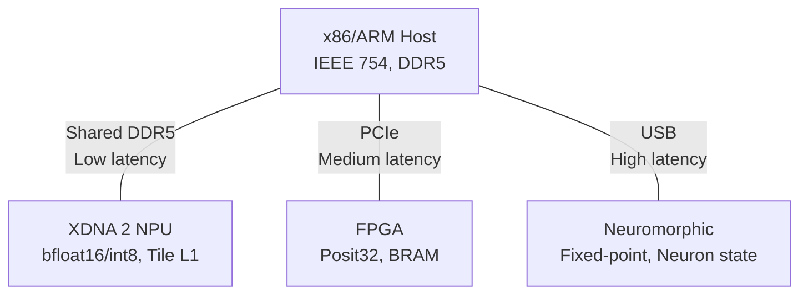

## The Multi-Target Problem

A computation that spans multiple hardware targets requires the compiler to make representation, allocation, and scheduling decisions that differ per target. A gravitational force calculation that runs on an x86 host, an FPGA accelerator, and a neuromorphic processor needs different numeric representations, different memory strategies, and different execution models on each target. The compiler must select these strategies, verify their consistency at target boundaries, and surface the tradeoffs at design time.

The Fidelity framework addresses this through the Program Semantic Graph (PSG), which carries dimensional annotations, coeffect requirements, and target-specific resolution through multi-stage compilation via MLIR. Each target receives a compilation profile that specifies its capabilities, constraints, and the representation selection criteria appropriate to its architecture.

This entry describes the four target profiles currently in the framework's design, with concrete specifications for what the compiler decides at each target and what the engineer sees at design time.

## x86/ARM: Von Neumann Targets

The general-purpose CPU is the default target. Its profile:

**Numeric representation:** IEEE 754 `float64` (or `float32` where precision requirements permit). The representation selection function from [the posit arithmetic entry](/blog/posit-arithmetic-dimensional-type-systems/) evaluates IEEE 754 against other candidates; on CPU targets, IEEE 754 typically wins because the hardware provides native support.

**Quire support:** Software emulation. For posit32, the 512-bit quire occupies 64 bytes on the stack, exactly one cache line. Performance cost is approximately 50 cycles per fused multiply-add operation, dominated by the multi-precision integer arithmetic required to maintain exact accumulation without hardware support.

**Memory model:** Conventional stack/heap with the DMM coeffect discipline. Escape analysis maps to standard allocation decisions:

| Escape Classification | x86/ARM Allocation |
|---|---|
| StackScoped | `memref.alloca` (stack frame) |
| ClosureCapture(\(t\)) | Arena or heap, depending on closure lifetime |
| ReturnEscape | Caller-provided buffer or arena |
| ByRefEscape | Arena with lifetime tracking |

**Compilation path:** PSG → standard MLIR dialects (`arith`, `memref`, `scf`, `linalg`) → LLVM dialect → LLVM IR → native code. The Composer orchestrates this lowering, distributing PSG representations into the appropriate MLIR infrastructure at each stage. Dimensional annotations persist as MLIR attributes through lowering and inform representation selection and transfer fidelity analysis at each stage where they are needed.

**Design-time diagnostic format:**

```
computeForce: float<kg> → float<kg> → float<m> → float<newtons>
  x86_64: float64 → float64 → float64 → float64
    Precision: 1.11e-16 relative error (uniform)
    Allocation: all stack, 32 bytes total
    Cache: 1 line (fits L1)
```

## FPGA: Reconfigurable Fabric

The FPGA target differs from CPU in three fundamental ways: numeric representations are configurable per computation, memory is spatially distributed across the fabric, and execution is inherently parallel at the operation level.

**Numeric representation:** Posit arithmetic implemented in DSP48 slices (on Xilinx targets) or equivalent multiply-accumulate blocks. The representation selection function evaluates posit widths against the dimensional range of each value. For posit32 with es = 2, the dynamic range extends to approximately \(10^{\pm 36}\), with best precision near unity.

**Quire support:** Hardware pipeline. The 512-bit quire is a single wide value mapped to FPGA fabric by the synthesis tool; the exact allocation across flip-flops, LUTs, and DSP slices is a synthesis decision, not a compiler concern. Performance is 1 cycle per FMA, matching the throughput of IEEE 754 multiply-accumulate in equivalent DSP fabric.

**Memory model:** Spatially distributed. Block RAM (BRAM) provides on-chip storage with deterministic latency. The coeffect system tracks BRAM allocation as a capability requirement:

| Memory Region | Capacity (typical) | Latency | Coeffect |
|---|---|---|---|
| Registers | ~600K flip-flops | 1 cycle | StackScoped (pipeline registers) |
| BRAM | 4.9 Mb (Artix-7 100T) | 1-2 cycles | Arena (on-chip scratch) |
| External DDR | 256 MB+ | 10-50 cycles | Heap equivalent (off-chip) |

**Compilation path:** PSG → hardware-oriented MLIR dialects → CIRCT → RTL → synthesis and place-and-route. The Composer lowers PSG representations into CIRCT's RTL infrastructure, with dimensional annotations guiding representation selection at the hardware dialect boundary.

**Cross-target transfer:** Values moving between FPGA and host CPU cross a PCIe boundary. The BAREWire protocol handles encoding and transport. DTS verifies transfer fidelity: posit32 → float64 is lossless; float64 → posit32 incurs precision loss quantified by the dimensional range analysis.

**Design-time diagnostic format:**

```
computeForce: float<kg> → float<kg> → float<m> → float<newtons>
  xilinx: posit32 → posit32 → posit32 → posit32
    Precision: ~1.5e-9 in [0.01, 100], ~3.9e-3 at extremes
    Quire: 512-bit fabric pipeline
    Dynamic range: [1e-36, 1e36] ✓ covers [1e-2, 1e25]
    BRAM: 0 (all values in pipeline registers)
    Transfer → x86_64: posit32 → float64, fidelity 1.0 (lossless)
```

## NPU: Spatial Dataflow (XDNA 2)

AMD's XDNA 2 NPU, present in Strix Halo processors, represents a spatial dataflow architecture. AI Engine tiles are arranged in a two-dimensional grid with explicit, programmer-managed data movement via DMA and configurable interconnect [4]. This architecture differs from both Von Neumann (sequential instruction stream) and FPGA (reconfigurable fabric) in that computation is spatially mapped: operations are assigned to specific tiles, and data flows between tiles through configured routes.

**Numeric representation:** The XDNA 2 tiles support `bfloat16`, `int8`, and `int4` natively. Posit support would require soft implementation within the tile's compute resources, which is not efficient given the tile's fixed datapath. The representation selection function on this target evaluates the native formats against dimensional range requirements and selects accordingly.

**Memory model:** Hierarchical and explicit. Each tile has local memory (L1, 64 KB typical), with DMA-managed transfers between tiles and to/from shared DDR5.

| Memory Region | Scope | Latency | Management |
|---|---|---|---|
| Tile L1 | Per-tile, 64 KB | 1 cycle | Programmer-managed |
| Tile-to-tile | DMA configured | 2-5 cycles | Route configuration |
| Shared DDR5 | System-wide | 50-100 cycles | DMA transfers |

**Compilation path:** PSG → AIE dialect (via MLIR-AIE [5]) → tile mapping and route configuration → binary for XDNA 2 runtime. The Composer lowers PSG representations into the AIE dialect, where tile assignment and DMA route configuration occur.

**The set-constraint problem:** Mapping operations to tiles requires co-locating sets of operations, configuring sets of DMA routes, and partitioning sets of columns into spatial workload contexts. These are constraints over *sets* of nodes, not binary relationships. The [DTS/DMM paper's future work](/publications/dts-dmm/) identifies this as the motivation for a Program Hypergraph (PHG) generalization that would make set-constraints first-class.

In the cohomological framing developed in the [compilation sheaf design document](/docs/design/categorical-foundations/the-compilation-sheaf/), the tile-mapping problem is an \(H^0\) computation on the hypergraph poset: does a global section of the co-location sheaf exist that satisfies all joint constraints simultaneously? A graph (1-dimensional cell complex) can carry only \(H^0\) and \(H^1\) of a sheaf, while a hypergraph treated as a bipartite poset (vertices below their incident hyperedges) is a higher-dimensional cell complex whose cohomology lives in degrees a graph cannot represent. Joint resource constraints in kernel fusion and spatial tile placement generate cocycles in those higher degrees, which is the categorical reason binary edges are insufficient. The new algorithm for computing sheaf cohomology on arbitrary finite posets (arXiv:2502.15476) provides the infrastructure the PHG solver would use to determine whether a consistent tile assignment exists and to identify the obstruction class when it does not.

**Cross-target transfer:** Values cross the shared DDR5 boundary between the NPU and the host CPU. This boundary is lower-latency than PCIe (shared memory, no serialization) but introduces coherency considerations that the coeffect system must track.

## Neuromorphic: Event-Driven Computation

Neuromorphic targets (Intel Loihi 2 is the reference architecture in our analysis) operate on different principles from the targets above. Computation is event-driven: neurons fire when their membrane potential crosses a threshold, and the resulting spikes propagate through a configured network topology. There is no instruction stream, no program counter, and no conventional memory hierarchy.

**Numeric representation:** Fixed-point for neuron state variables. Membrane potentials, synaptic weights, and spike timing variables use integer or fixed-point representations with bit widths determined by the neuromorphic core's datapath. The representation selection function evaluates `fixed<24,signed>` and similar formats against dimensional range requirements.

**Quire support:** Not available. Neuromorphic cores lack the accumulator width required for exact posit accumulation. This is a capability coeffect failure: computations that require exact accumulation cannot target neuromorphic hardware. The design-time diagnostic is explicit:

```
✗ Capability failure: exact accumulation requires quire support
  Target loihi2 does not provide sufficient accumulator width
  Available alternatives: x86_64 (software quire), xilinx (hardware quire)
```

**Memory model:** Distributed neuron state. Each neuromorphic core maintains local state for its assigned neurons. There is no shared memory in the conventional sense; communication occurs through spike events.

**Cross-target transfer:** Values cross a USB boundary between the neuromorphic device and the host (for development configurations like the Kapoho Bay USB form factor). This is the highest-latency, lowest-bandwidth boundary in the system, and the coeffect system must account for it when computing transfer costs.

## The Transfer Boundary Summary



Each boundary has a distinct transfer cost, bandwidth constraint, and precision conversion profile. The coeffect system tracks all three, and the language server displays the composite picture for any computation that spans targets:

| Boundary | Interconnect | Bandwidth | Latency | Precision Conversion |
|---|---|---|---|---|
| CPU ↔ NPU | Shared DDR5 | High | Low | float64 ↔ bfloat16 (lossy both directions) |
| CPU ↔ FPGA | PCIe | Medium | Medium | float64 ↔ posit32 (lossless FPGA→CPU; lossy CPU→FPGA) |
| CPU ↔ Neuromorphic | USB | Low | High | float64 ↔ fixed24 (lossy, range-dependent) |

The compiler would resolve these boundaries during MLIR lowering, using the dimensional range analysis to determine whether a specific precision conversion is acceptable for the computation's requirements. The [DTS/DMM paper](/publications/dts-dmm/) formalizes this as cross-target transfer fidelity analysis (Section 4.4), and the [posit arithmetic entry](/blog/posit-arithmetic-dimensional-type-systems/) provides the detailed example for the CPU ↔ FPGA case.

In sheaf-theoretic terms, each transfer boundary is a *structure map* between stalks of the cross-target compilation sheaf. A lossless transfer (posit32 → float64) is an isomorphism: the structure map preserves all the information at the source stalk in the target stalk, and the inverse structure map exists. A lossy transfer (float64 → posit32) is a structure map with a non-trivial kernel: information about the source stalk that does not survive into the target stalk, quantified by the dimensional range analysis. The fidelity score is a measure of how much of the source stalk the structure map preserves. This framing makes precise what the score is computing: not "quality" in the abstract, but the kernel size of a specific stalk-to-stalk homomorphism.

Each lowering pass within a single target is itself an application of Hoare's *consequence rule* over the compilation sheaf's annotations. If the precondition (the stalk at the higher-level dialect) is preserved by the lowering pass, and the postcondition (the stalk at the lower-level dialect) is implied by what the higher-level dialect promised, then the lowering is sound and the dual-pass discharge confirms it. The [decidability sweet spot document](/docs/internals/verification/decidability-sweet-spot/) develops this Hoare-logic reading of the dual-pass architecture in detail.

## The Information Accrual Principle

Section 6.6 of the DTS/DMM paper formalizes an observation that underlies the multi-target compilation strategy: each compilation stage has strictly more information than its predecessor.

\[I_{\text{source}} \subset I_{\text{PSG}} \subset I_{\text{MLIR}} \subset I_{\text{MLIR-opt}} \subset I_{\text{target}} \subset I_{\text{native}}\]

At the source level, the compiler knows types and dimensions. At the PSG level, it additionally knows coeffects, escape classifications, and saturated annotations. At the MLIR level, it knows the full program structure in SSA form. At the target-specific MLIR level, it knows the hardware's capabilities, memory topology, and datapath widths.

The principle: decisions that can be deferred to later stages should be, because later stages have strictly more information. Representation selection is deferred to the target-specific MLIR stage because that is where the target's numeric capabilities are known. Allocation strategy is deferred to MLIR emission because that is where the target's memory topology is known. Cache alignment is determined during final lowering because that is where microarchitectural parameters are available.

DTS annotations survive through the early stages precisely to enable these late-stage decisions. Had dimensions been erased at the source level (as in F#'s Units of Measure), representation selection and transfer fidelity analysis would be impossible at the point where they can be made with full context.

The information accrual principle is the *monotone sheaf condition* on the compilation poset. A sheaf in which stalks can only grow (or remain the same) as one moves up the base poset is a monotone sheaf, and the structure maps of such a sheaf are inclusions or refinements rather than arbitrary morphisms. The Fidelity compilation sheaf is monotone in this sense: each lowering pass adds annotations rather than removing them, and the structure map at each edge of the compilation poset is an inclusion of the prior stalk into the next. The [compilation sheaf design document](/docs/design/categorical-foundations/the-compilation-sheaf/) treats the dual-pass architecture as the witnessing mechanism for global sections of this monotone sheaf, and the consequence rule applied at every lowering pass is what makes the verification compose across the pipeline.

## Current Status

The x86/ARM target compiles through the full LLVM pipeline. The FPGA target compiles through CIRCT for RTL generation. The XDNA 2 and neuromorphic targets are at the design stage; the MLIR-AIE infrastructure [5] exists for XDNA 2 targeting, and the coeffect profiles described here reflect the architectural specifications from published documentation [4].

The PHG generalization required for efficient spatial dataflow mapping is deferred to a subsequent paper and implementation cycle. The current PSG handles multi-target compilation through binary edges with per-target reachability bitvectors (Section 4.3 of DTS/DMM), which is sufficient for targets with independent compilation paths but does not natively express the set-constraints that spatial tile mapping requires.

## References

[4] A. Rico, S. Pareek, J. Cabezas, D. Clarke, et al., "AMD XDNA NPU in Ryzen AI Processors," *IEEE Micro*, vol. 44, no. 6, pp. 73-83, 2024.

[5] AMD/Xilinx, "MLIR-AIE: An MLIR-based toolchain for AMD AI Engines," github.com/Xilinx/mlir-aie, 2024.
