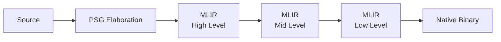

## Why a Sheaf

The Fidelity framework's verification story has, until this entry, been told in two registers. The first register is operational: the Program Semantic Graph (PSG) computes annotations during elaboration, the dual-pass architecture re-verifies them at each MLIR lowering, and the reconciliation tool checks the binary against a certificate produced at the end of the pipeline. The second register is logical: the four-tier Hoare correspondence assigns each verification obligation to a decidable fragment (Gaussian elimination over \(\mathbb{Z}^n\) at Tier 1, QF_LIA via Z3 at Tier 2, the restricted probabilistic fragment at Tier 3, probabilistic relational Hoare logic at Tier 4).

These two registers describe the same architecture, and neither, on its own, explains *why the architecture composes*. The operational story takes compositionality as a design assumption ("the dual-pass keeps things consistent"). The logical story takes it as a proof rule ("the consequence rule applies at each lowering"). Both are correct, and both elide the underlying structure that makes them correct simultaneously.

That structure is a sheaf. The compilation pipeline carries a cellular sheaf whose stalks are the annotation bundles produced by elaboration, whose structure maps are the lowering passes, and whose global sections are exactly the certificates the pipeline emits. The dual-pass architecture is the witnessing mechanism for a global section of this sheaf. The tier architecture is a graduated refinement of the stalk category over a fixed base poset.

This document makes that framing precise and uses it to sharpen four claims that the operational and logical accounts could only gesture at: why the dual-pass works, why the tiers compose, why the Program Hypergraph (PHG) requires hyperedges rather than binary edges, and what a "conservative" range finding actually is.

## The Compilation Poset

A sheaf needs a base. The base in this case is the partial order of compilation stages:

This is a finite poset. Each node is a compilation stage, and each edge is a lowering pass. The order is the temporal order of compilation: source precedes elaboration, elaboration precedes high-level MLIR, and so on, down to the binary. This poset is the Hasse diagram of the base category for the compilation sheaf. Everything that follows is structure attached to it.

## Stalks: The Annotation Bundles

At each node of the compilation poset, the framework attaches a set of values: the *stalk* at that node. For the PSG node, the stalk is the bundle of annotations elaboration produces (dimensional vectors in \(\mathbb{Z}^n\), escape classifications, grade assignments in the Clifford algebra, coeffect requirements). For the high-level MLIR node, the stalk is the same data translated into MLIR attributes attached to operations. For the native binary node, the stalk is the residual evidence (assume intrinsics, alignment guarantees, the absence of bounds checks at sites where bounds were proved).

The stalk category changes with the tier. At Tier 1, the stalk values live in the category of finitely generated abelian groups and group homomorphisms: \(\mathbb{Z}^n\) vectors and dimensional consistency relations. At Tier 2, the stalks live in the category of QF_LIA constraint systems and their satisfying assignments. At Tier 3, the stalks live in a category of distributions whose support is defined by QF_LIA constraints over abelian subgroups. At Tier 4, the stalks live in a category of pairs of program memories with pRHL judgments between them.

The compilation poset is the same at every tier; the stalks above it differ. This is the precise statement that the tiers are different sheaves over a shared base, and it is the cohomological version of the four-tier Hoare correspondence.

## Structure Maps: The Lowering Passes

For each ordered pair \(s_1 < s_2\) of compilation stages, the sheaf provides a *structure map* \(D(s_1 < s_2)\) sending stalk values at \(s_1\) to stalk values at \(s_2\). These structure maps are the lowering passes: the translation of PSG annotations into MLIR attributes, the propagation of MLIR attributes through dialect lowerings, the materialization of MLIR attributes as LLVM metadata in the binary.

The defining axiom of a sheaf is the compositionality equation: for any chain \(s_0 < s_1 < s_2\),

\[D(s_0 < s_1) \,;\, D(s_1 < s_2) \;=\; D(s_0 < s_2).\]

In the framework's terms: lowering from PSG to mid-level MLIR via the high-level dialect must produce the same annotations as lowering directly from PSG to mid-level MLIR. This is the property the dual-pass architecture *enforces*. Each lowering pass is required to preserve the annotations of the stage above it, and the Z3 re-discharge at each pass is the local check that compositionality holds across that edge of the compilation poset.

A theorem about finite posets makes this enforcement strategy efficient. To verify that a global section exists, it suffices to check the structure-map equations on the edges of the Hasse diagram; transitivity propagates through compositionality. The dual-pass architecture's computational cost is therefore proportional to the number of lowering passes, not to the number of pairs of compilation stages, and this is a categorical fact rather than an engineering optimization.

## Global Sections and the Certificate

A *global section* of a sheaf is an assignment of one stalk value to each node of the base poset such that, for every ordered pair \(s_1 < s_2\), the structure map sends the value at \(s_1\) to the value at \(s_2\). In the compilation sheaf, a global section is what the verification certificate records: a consistent set of annotations at every compilation stage, compatible with every lowering pass.

This identification has a sharp edge worth stating explicitly. A global section certifies that *consistent annotations exist*. It does not, by itself, certify that the binary realizes those annotations; that is the reconciliation tool's job. The global section is a *necessary* condition for the binary to be correct with respect to the source-level specification. Sufficiency requires the additional check that the binary is a faithful implementation of the section. The reconciliation tool, in sheaf-theoretic terms, verifies that the binary and the certificate are witnesses to the same global section over the same base poset.

This is the categorical version of the consequence rule applied at each lowering, and it is also the categorical reason the framework's dual-pass architecture cannot be replaced by a single end-of-pipeline check. A single check at the binary stage would verify only the stalk at the bottom of the poset, leaving the structure maps that connect it to the source unverified. A break in the structure-map chain (a lowering pass that silently changes a dimensional annotation, an MLIR transformation that drops a coeffect attribute) would be invisible. The dual-pass is the witness that no such break occurs.

## Tiers as Stalk-Category Refinements

With the sheaf in place, the four-tier Hoare correspondence reads as follows.

**Tier 1** is the abelian-group sheaf. Stalks are \(\mathbb{Z}^n\) vectors (dimensional types, grade assignments, escape lattice elements). Structure maps are abelian group homomorphisms. The global section problem reduces to a system of linear equations over \(\mathbb{Z}\), decided in polynomial time by Gaussian elimination. There is no annotation cost because parametricity over the abelian-group structure makes the result a free theorem in Wadler's sense; consistency follows from the type structure alone, with no property the engineer must declare.

**Tier 2** is the QF_LIA sheaf over the same base poset. Stalks now include inequality constraints (bounds, ranges, bit patterns), and the structure maps must preserve these constraints across lowering. The decision procedure is Z3, sound and complete on QF_LIA. The global section problem is no longer linear; it is the satisfiability of a constraint system over the integers, which Z3 discharges. The annotation cost at this tier is modest: range declarations and mid-computation assertions narrow the postcondition at branch joins so that the structure-map equations remain satisfiable through the lowering.

**Tier 3** is a sheaf whose stalk category includes uniform distributions over lattice cosets. The structure maps now relate distributions, and the lowering from PSG to MLIR must preserve not only the support of the distribution but the acceptance probability of any rejection-sampling loop. The decision procedure is the restricted probabilistic fragment of Z3, decidable because the distributions live in the abelian-group fragment that Tiers 1 and 2 already handle. Tier 3 establishes that a rejection-sampling loop terminates with probability 1, a claim that is logically distinct from the Tier 2 claim that the loop's exit condition entails the desired bound.

**Tier 4** is a relational sheaf. Stalks are pairs of program memories (one for the real program, one for the simulated program), and structure maps preserve pRHL judgments between them. The discharge is no longer a Z3 query; it is a derivation in the pRHL rule language, type-checked by the Composer's pRHL type checker against a foundational rule library proved once in Rocq. Z3 still handles the arithmetic leaves of the derivation, while the structural pRHL proof is verified by the type checker. The trusted computing base for Tier 4 includes Rocq's kernel as a foundational library dependency; for Tiers 1 through 3 it does not.

The four tiers are four sheaves over the same compilation poset. The base poset (source, PSG, MLIR levels, binary) is what the framework keeps constant. The stalk category is what the engineer's choice of verification tier changes. This is the precise meaning of the framework keeping the QF_LIA theory constant throughout the pipeline: the compilation poset is invariant, and that invariance is what makes the consequence rule applicable at every tier boundary and every lowering pass.

## The PHG as a Cellular Sheaf on a Hypergraph

The Program Hypergraph extends the PSG with hyperedges: joint constraints linking three or more nodes. Co-location constraints for spatial tile placement, k-ary geometric product constraints in Clifford algebra computation, kernel fusion's joint resource constraints. The PHG inflection-point argument observes that these constraints cannot be decomposed into binary edges without losing information.

The cellular-sheaf framing turns this engineering observation into a categorical impossibility. A graph is a 1-dimensional cell complex, and the cohomology of a sheaf on a graph lives in degrees 0 and 1. A hypergraph, treated as a bipartite poset where vertex \(v\) is below hyperedge \(h\) when \(v \in h\), is a cell complex of higher dimension whose sheaf cohomology lives in degrees that a graph cannot represent.

The joint resource constraints in kernel fusion generate cocycles of degree higher than 1. They are obstructions to extending local consistency at individual operations to global consistency across the fused kernel. A graph-based representation cannot carry these obstructions because the relevant cohomology groups do not exist on a 1-dimensional complex. The PHG is the minimal cell complex on which the joint constraints' cohomology is non-trivial. Hyperedges are the only structure on which the obstruction classes can live.

This sharpens the inflection-point argument. The previous statement was that binary edges become inadequate when constraints are k-ary. The cohomological statement is that binary edges are incapable of representing the obstruction classes that k-ary joint constraints generate, because the cohomology groups in which those obstructions live do not exist on a 1-dimensional cell complex.

## Conservative Findings as Uncharacterized Cohomology

When the Tier 2 range analysis returns a conservative bound (a loop's output range that interval arithmetic alone cannot tighten further), the operational story has called this a "limitation of the analysis." The cohomological story is more precise: the analysis has detected that the global section problem for this sheaf has a non-trivial \(H^1\) obstruction that the current stalk category cannot resolve.

The resolution is to refine the stalk category, moving the problem from the Tier 2 sheaf to the Tier 3 sheaf, where the stalks include the distributional information that kills the obstruction. In practice this means invoking a Tier 3 lemma from `Fidelity.Lemmas.Mathematics`, proved once in Rocq, that supplies the cocycle witness. The conservative diagnostic is therefore an honest acknowledgment that the relevant lemma is not yet in the library. The framework's response is to add the lemma.

The space of conservative findings is exactly the space of obstruction classes for which no witness has yet been added to the library. The obstruction is an element of a cohomology group; the lemma is the witness that kills it; the library is the catalog of witnesses available to the compiler.

## Three Sheaves, Three Hoare Logics

The four-tier correspondence describes Hoare logic over the values a program computes. Two recent Hoare-logic variants describe orthogonal axes:

- **Access Hoare logic** [(Beckmann & Setzer, arXiv:2511.01754)](https://arxiv.org/abs/2511.01754) reasons about *who may execute*: capabilities, access rights, authorization invariants.
- **Symmetry Hoare logic** [(Mehta & Hsu, OOPSLA '25, arXiv:2509.00587)](https://arxiv.org/abs/2509.00587) reasons about *under what transformations a program is invariant*: group actions, equivariance, conservation laws.

In the sheaf framing these are *different sheaves over the same compilation poset*, with different stalk categories, rather than new tiers added to the existing four. Access Hoare logic is the sheaf whose stalks are capability lattices and whose structure maps preserve access discipline through lowering. Symmetry Hoare logic is the sheaf whose stalks carry group actions and whose structure maps are equivariant.

The compilation poset is shared across all three sheaves. The framework verifies a program by checking that global sections exist for whichever sheaves the engineer's domain requires: the four-tier functional sheaf for correctness, the access sheaf for authorization, the symmetry sheaf for conservation laws and equivariance. The dual-pass architecture witnesses each of these global sections by the same mechanism: local structure-map equations checked at the edges of the compilation poset, with compositionality propagating the guarantee through the rest. The PSG and PHG are committed to the base poset over which any number of compatible sheaves can live.

## What This Reframes

The cohomological framing does not change the framework's implementation. It changes what the implementation is *about*.

The dual-pass architecture is the witnessing mechanism for global sections of the compilation sheaf, and the local-edge-check strategy is forced by the finite-poset cohomology theorem.

The tier architecture is a graduated refinement of the stalk category over a fixed base poset, with each tier corresponding to a categorically natural choice of stalks (abelian groups, QF_LIA models, distributions over lattice cosets, relational pRHL judgments).

The PHG is the minimal cell complex on which the cohomology groups carrying joint-constraint obstructions are non-trivial.

Conservative findings are uncharacterized obstruction classes awaiting witnesses from the lemma library.

The verification certificate is a global section of the compilation sheaf, and the reconciliation tool's job is to check that the binary is a faithful realization of that section.
