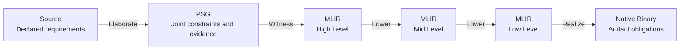

## Why a Sheaf

When our compiler proves that a buffer access is within bounds, we want that result to remain meaningful after the buffer acquires a physical layout and the access becomes a native instruction. The facts change vocabulary along the way. A source-level index may become an address calculation, and its safety depends on the selected layout as well as the original range.

We are designing our compilation sheaf around this continuity: each compilation stage has a space of facts, and each lowering step has a declared interpretation of those facts at the next stage. A compatible assignment across the stages records how one program's evidence survives those translations. This gives us a way to organize the preservation obligations in [Conformance §6](/spec/draft/conformance/#6-the-preservation-obligation-through-lowering), with checks located at the transformations that could affect a property.

Our [Fixed-Point Scaffolding preprint](https://arxiv.org/abs/2606.02854) studies this continuity across compilation stages. For an engineer extending the compiler, the useful questions are concrete: which facts does this pass consume, how does it translate them, and what justifies the resulting operation? The appeal of the sheaf account is that we can describe continuity across the pipeline while checking the particular transformations responsible for preserving it.

## The Compilation Poset

A selected lowering route gives us an ordered sequence of stages:

```mermaid
graph LR
    SRC["Source<br>Declared requirements"] -->|Elaborate| PSG["PSG<br>Joint constraints and evidence"]
    PSG -->|Witness| HI["MLIR<br>High Level"]
    HI -->|Lower| MID["MLIR<br>Mid Level"]
    MID -->|Lower| LO["MLIR<br>Low Level"]
    LO -->|Realize| NAT["Native Binary<br>Artifact obligations"]
```

The arrows form the Hasse diagram of this finite order: they show adjacent stages, with the longer translations obtained by composition. Source order within a program and dependencies among its operations are separate structures carried at these stages.

Our target pipelines can offer several routes between representations. To describe those routes by a poset, we must establish that their translations agree under the chosen semantic interpretation. Keeping the routes explicit is useful while establishing that agreement. The diagrams may contain different intermediate operations even when their interpretations coincide.

## Stalks: The Annotation Bundles

A *stalk* is the space of facts available at one stage. A particular program supplies a value in that space. At our PSG stage, that value includes source types and their dimensional identities. Range refinements refer to the relevant bindings, while layout constraints connect those bindings to the selected target.

These facts have different mathematical representations. Dimensional exponents use the free abelian group \(\mathbb Z^n\) over the declared base measures. Escape classifications use an ordered domain. A range may be represented by an interval or by a predicate that retains relationships between values. Probability models add weights to a support. Our joint constraint mechanism needs the connections between these domains without identifying them with one another.

We place platform and BAREWire facts into that mechanism before the middle end witnesses a memory operation. BAREWire's local memory layouts determine physical access requirements. Its IPC and network contracts also describe representation boundaries, where a codec may relate the local value to a different wire format. The [dimensional architecture](/spec/draft/ntu-dimensional-architecture/) specifies this upstream settlement of source and platform facts.

At later stages, a fact may appear as an operation attribute or as evidence associated with a lowering decision. For the binary, the relevant observations include instruction behavior and the realized layout. An instruction's absence, such as an eliminated bounds check, requires a justification tied to that access.

## Structure Maps: The Lowering Passes

Write \(D_{s,t}\) for the translation of facts from stage \(s\) to stage \(t\). The maps obey identity and composition laws:

\[
D_{s,s}=\mathrm{id}, \qquad
D_{t,u}\circ D_{s,t}=D_{s,u}.
\]

These laws concern the selected interpretation of a lowering. For example, translating a bounds fact through two dialect conversions must agree with the interpretation of their composite. The compiler must also connect that interpretation to the operations those conversions actually produce.

A pass can supply a preservation theorem that covers the affected property. Otherwise, we require validation of its result at that edge. Rechecking an arithmetic formula is useful only with the corresponding state mapping and operation semantics: an unbounded integer addition and a machine addition with overflow can have different behavior even when the printed formulas resemble one another.

Once the maps satisfy the functor laws, checking one candidate assignment on every adjacent edge establishes compatibility throughout a finite stage order. This is the cover-edge result in [Remark 2.19 of *Sheaf theory: from deep geometry to deep learning*](https://arxiv.org/html/2502.15476#S2.SS3). The checks must use the same assignment at shared stages. Their cost still depends on the obligations and evidence at each edge.

Information can be released after the obligations that need it have been discharged, provided the remaining representation preserves their required consequences. A dimensional annotation may guide representation selection and then give way to a checked physical operation. Its release needs a traceable justification, and later passes remain responsible for the properties they could perturb. Ordinary executable code need not retain every source annotation as runtime metadata.

## Global Sections and the Certificate

A compatible family \(x_s\), with \(D_{s,t}(x_s)=x_t\), is a *global section*. Our intended certificate records such compatibility for the prescribed source facts and the observed lowering results, together with the evidence needed to justify the translations.

The source requirements and the actual artifacts fix what this certificate must describe. On the simple chain above, total maps can propagate a starting annotation into a compatible family, but we still have to show that each annotation describes the code produced at that stage. For the buffer example, the certificate must connect the original bounds and layout to the particular address calculation in the resulting program.

Our proof-carrying PSG is the canonical home for joint constraints and their evidence. The separate ledger serves as a temporary reconciliation scaffold: we compare it with graph-carried facts and with the lowered artifact while validating that mechanism. Witnesses observe the settled facts. They must report a missing dimensional or layout fact at the point that requires it.

A certificate should identify the property and the exact artifact to which it applies. It also records the selected target and platform declaration. Each obligation has a tier and an evidence form, with the assumptions and proof dependencies needed to interpret the result. A solver verdict has different trust requirements from an independently replayed proof. The frontend's interpretation and the boundary mappings remain part of that account unless separately justified.

## Tiers as Evidence Domains {#tiers-as-stalk-category-refinements}

Our four tiers organize the reasoning available for an obligation. The same program may use several, with an established result from one becoming a premise for another.

| Tier | Typical obligation | Evidence carried forward |
|---|---|---|
| 1 | Dimensional equality and declared algebraic structure | A kinded substitution or derivation under the declared laws |
| 2 | Range, layout, or arithmetic conditions in a supported fragment | The checked condition and its assumptions, with the analysis result or available solver proof |
| 3 | A parameterized domain or system property | A checked library theorem instance, its model and discharged premises |
| 4 | A relational property of executions or compilation | A derivation in the applicable relational logic and evidence for its leaves |

For dimensional inference, integer exponents require integer-preserving solving, including divisibility conditions. Grade and escape information have their own rules. Arithmetic obligations may use cvc5 or a sound specialized analysis. The selected theory determines which conditions a procedure can establish and at what cost.

Tier 3 supports parameterized domain and system results, including resource/protocol invariants and probabilistic results such as almost-sure termination under stated assumptions about a loop's trials. Tier 4 extends the library workflow to relational judgments. Probabilistic relational Hoare logic, pRHL, relates distributions of executions. A compiler-relational logic relates source and target computations under specified semantics. Rocq is a proof assistant in which authors can establish the soundness of those rules or prove reusable domain theorems.

We intend application developers to receive automatic coverage wherever the available rules and libraries cover their program, including Tier 4. Domain authors provide the reusable proofs. The compiler instantiates them and checks their premises at each application. The accepted proof and the conditions of each application remain available to later lowering checks. [Proof Composition and Tooling](/docs/internals/verification/proof-composition-and-tooling/) records the library opportunities and integration requirements. A Rocq-founded theorem retains that dependency at any tier; imported evidence is used as a checked lemma under the permitted foundation, never as a new axiom.

## Duality and Mode Translations {#the-duality-dimension-as-a-stalk-refinement}

Our [Negative and Fractional Types preprint](https://arxiv.org/abs/2606.04352) explores resource structures for quantum and AI applications. In the current manuscript, we propose value-indexed fractional operations with matching-resource conditions. Compact duality requires the corresponding evaluation and coevaluation laws in a suitable semantic model. We need explicit interpretations of these structures through lowering.

Measure exponents remain a separate algebraic choice. An inverse measure subtracts integer exponents. Permitting rational powers would extend that measure algebra explicitly. Neither resource modalities nor compact duals automatically make that extension.

A change of reasoning mode also needs a translation between judgments. For instance, passing from a probability distribution to its support retains possible outcomes while releasing their weights. An adjunction between suitable modes supplies unit and counit laws, which are weaker than an invertible round trip. Our [mode-shift account](/docs/internals/verification/mode-shifts/) describes how the translated judgment can support a later proof. [A Triangle Without Mystery](/blog/a-triangle-without-mystery/) places these connections alongside the encoding and composition disciplines behind the design.

## Joint Constraints and Incidence Structure {#the-phg-as-a-cellular-sheaf-on-a-hypergraph}

Our Program Hypergraph makes a constraint's participants explicit. A fused kernel's capacity requirement can depend on every buffer resident together. Three buffers of four units each fit pairwise within a capacity of ten, while their combined requirement is twelve. Checking those pairwise capacity inequalities would accept a placement that violates the joint requirement.

A hyperedge can retain the aggregate predicate and its participant identities. An auxiliary constraint node in an ordinary graph can also retain that same relation. We favor first-class joint constraints because subsequent placement and proof passes need their full scope and provenance. The representation must preserve a shared buffer's identity wherever the buffer participates.

For a sheaf model, the vertex-to-hyperedge membership relation gives a two-level poset. Hyperedge size does not increase its cohomological dimension: its normalized Roos complex has no terms above degree one. [Construction D.23](https://arxiv.org/html/2502.15476#A4.SS5) gives this complex explicitly. The engineering benefit here is faithful carriage of the joint predicate.

## Range Refinement {#conservative-findings-as-uncharacterized-cohomology}

A sound interval bound can overestimate the values a computation can reach. With nonnegative `offset` and `count`, consider an access guarded by `offset + count <= length`. Recording separate intervals for `offset` and `count` can lose the relationship that justifies the access. Our PSG should retain the guard and its binding identities so the range analysis can use that relationship at the operation.

A more precise transfer rule or an applicable library lemma can refine the bound. Its premises remain attached to the derived fact. Facts about immutable values remain available across delayed demand. A captured reference to mutable storage requires revalidation of facts that depend on its contents when those contents can change. The relevant lifetime is the lifetime of the evidence's premises.

During editing, an unresolved obligation can remain pending until the boundary that requires a decision. At representation selection, an empty coverage set requires a hard error under [Numeric Selection](/spec/draft/numeric-selection/) and [Conformance §5](/spec/draft/conformance/#5-the-diagnostic-obligation). Refining an overestimate may establish coverage. Choosing an uncovered representation would violate the contract.

We are also interested in whether cohomological diagnostics can help locate failures of compatibility across analyses. To make such a diagnostic useful to an engineer, we need a proved correspondence between the computed class and the program property it reports. Ordinary sheaf cohomology uses suitable abelian coefficients, such as modules, with the hypotheses needed for its construction. General constraint sets and distributions require additional structure for that interpretation. [Appendix C of the sheaf survey](https://arxiv.org/html/2502.15476#A3) develops the mathematical requirements.

## Multiple Analyses and Shared Premises {#three-sheaves-three-hoare-logics}

The same compilation stages can support several kinds of reasoning. [Access Hoare Logic](https://arxiv.org/abs/2511.01754), by Beckmann and Setzer, concerns access security. [A Hoare Logic for Symmetry Properties](https://arxiv.org/abs/2509.00587), by Mehta and Hsu, reasons about program symmetries expressed through group actions. These are useful sources for domain-specific judgments and their preservation rules.

We can organize such analyses over a common stage order while retaining each analysis's interpretation. Combining them also requires tracking shared premises. A representation change can alter layout, which can change the alignment condition used by a memory proof. A permission fact can restrict which operation is legal at that address. The joint mechanism must reconsider the affected obligations when one of those facts changes.

Independent analyses can run separately when their assumptions justify that independence. Where an analysis imports another's result, the dependency belongs in the graph. Similarly, translating a judgment between modes and then lowering the program requires an agreement law whenever we intend the opposite order to yield the same judgment. The [mode-shift account](/docs/internals/verification/mode-shifts/) describes these two directions of translation.

## Reusable Evidence {#what-this-reframes}

An engineer should be able to use a proved library operation without reconstructing its domain proof at every call. In our intended editing workflow, a lemma application instantiates the theorem's parameters and dispatches its premises. The resulting evidence remains associated with the relevant region of the PSG. Folding its display in the editor changes the view, while dependency changes trigger the required revalidation.

A short application can reconstruct evidence relative to an established library, a concrete example of [description length relative to supplied context](https://homepages.cwi.nl/~paulv/papers/info.pdf). Our [deferred inference account](/blog/deferred-inference/) also distinguishes exact admissibility from selection among the admissible choices. A Bayesian model can rank those choices when its evidence and probability model are supplied, while dimensional contradictions and unmet range obligations retain their diagnostic force.

For a new lowering pass, we require a declared interpretation of the affected facts and evidence relating its result to that interpretation. Once the pass justifies a metadata release, downstream checks follow the surviving obligations through to the artifact. The engineer implementing the pass gets a concrete boundary to review. The application developer gets to keep using the checked library operation as its implementation changes beneath them.
