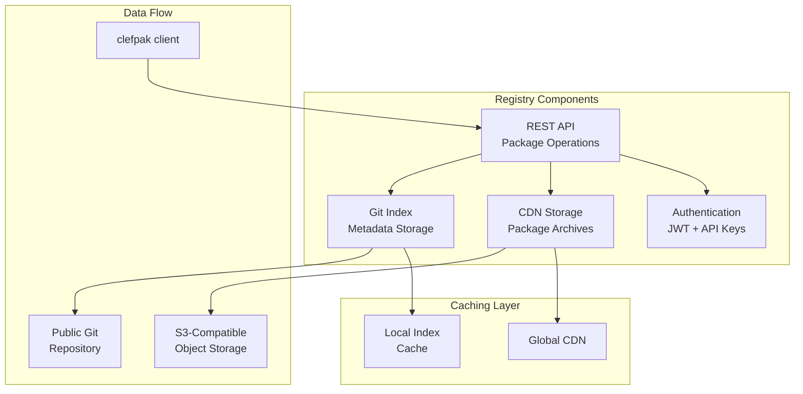

> This article was originally published on the
> [SpeakEZ Technologies blog](https://speakez.tech) as part of our early
> design work on the Fidelity Framework. It has been updated to reflect
> the Clef language naming and current project structure.

The journey from managed code to native compilation in Clef represents a significant architectural shift. As the Fidelity Framework charts a course toward bringing Clef to new levels of hardware/software co-design, we face a fundamental question: how do we distribute and manage packages in a world where the comfortable-yet-constraining assumptions afforded in the .NET ecosystem no longer hold? This article explores ClefPak, a forward-looking package management system that reimagines Clef code distribution for the age of multi-platform native compilation.

## One Size No Longer Fits All

To understand why ClefPak represents such a departure from .NET package management, we must first examine the assumptions that underpin systems like NuGet. In the .NET ecosystem, package distribution has always been straightforward: compile your library once, package the resulting assembly, and distribute it to developers who reference it in their projects. This model works because the Common Language Runtime provides a relatively consistent foundation, a contract that ensures your compiled code will run identically whether on a developer's laptop or a production server. But with that comes a "devil's bargain" of sorts - you have to take *all* of the bits of a dependency, not just the bits *that are necessary*. There's some thought being put into alleviating that issue in .NET, but "tree shaking" in any assembly-managed package system is always like "pushing the toothpaste back into the tube".

Native compilation pivots away from this limited exchange of convenience for monolithic assets. When the Fidelity Framework compiles Clef code for different targets, it's not merely translating to different instruction sets. Each platform may demand different approaches to memory management, calling conventions, and optimization strategies. Consider the vast differences between compilation targets:

- An ARM Cortex-M4 microcontroller operates with kilobytes of RAM, no memory management unit, and requires static allocation strategies
- An NVIDIA GPU demands SIMT (Single Instruction, Multiple Thread) execution models with specialized memory hierarchies
- An x86-64 processor with AVX-512 extensions offers complex vector operations and sophisticated caching systems

Pre-compiled binaries optimized for one of these targets would be not just suboptimal but completely unusable on another. Targeting these platforms directly is something that the .NET ecosystem cannot contemplate without significant re-engineering - and in effect - compromise. This realization led us to a radical rethinking of package distribution, drawing inspiration from an unexpected source: Rust's Cargo system. It led us to the realization that we could in effect provide the fulfillment of what Bjarne Stroustrup refers to as "only pay for what you use".

## Lessons from Cargo

The Rust community faced similar challenges when designing Cargo. Their solution is elegant: instead of distributing compiled binaries, distribute source code. In many ways it's an "originalist" notion drawing from C. Let the compiler see the entire program, including all dependencies, and optimize holistically for the specific target platform. This approach enables optimizations that would be impossible with pre-compiled binaries, such as cross-package inlining, whole-program optimization, and platform-specific memory layouts.

ClefPak adopts this philosophy while carefully preserving the Clef development experience. The system maintains familiar conventions and idioms that Clef developers expect while fundamentally reimagining the underlying distribution mechanism. This balance between innovation and familiarity guides every design decision in the ClefPak architecture.

## Familiar Names, New Capabilities

The foundation of any package management system lies in its package format. ClefPak introduces two key formats that will define how Clef packages are specified and distributed in the native compilation era.

### The .fidproj Format

The `.fidproj` format serves as the package manifest, deliberately echoing the familiar `.fsproj` naming convention while departing radically from MSBuild's XML-based approach. Instead, ClefPak takes another lesson from Rust to use TOML (Tom's Obvious, Minimal Language) for its clarity and human readability. When developers open a `.fidproj` file, they'll find a clean, intuitive structure that describes their project or package:

```toml
# RobotController.fidproj - A complete package specification
[package]
name = "robot_controller"
version = "1.2.0"
authors = ["Engineering Team <team@robotics.com>"]
description = "High-performance robot control algorithms"
license = "MIT OR Apache-2.0"
repository = "https://github.com/robotics/controller"
keywords = ["robotics", "control-systems", "real-time"]

[dependencies]
# Version specifications follow semantic versioning conventions
fsil = "1.0.0"                    # Exact version requirement
alloy = "^0.5.0"                  # Compatible releases (>=0.5.0, <0.6.0)
math_algorithms = "~0.3.2"        # Minimal updates only (>=0.3.2, <0.4.0)

# Feature-gated dependencies will activate only when specific features are enabled
[dependencies.neural_net]
version = "2.1.0"
features = ["cuda", "inference_only"]
optional = true

# Platform-specific dependencies will be included only for matching targets
[target.'cfg(target_arch = "aarch64")'.dependencies]
arm_neon_intrinsics = "0.4.0"

[target.'cfg(target_family = "wasm")'.dependencies]
wasm_bindgen = "0.2.0"

[features]
default = ["std"]
std = ["alloy/std", "fsil/std"]
embedded = ["alloy/no_std", "static_alloc"]
gpu_acceleration = ["neural_net", "cuda_kernels"]
```

This format captures everything needed to build reproducibly across different platforms. The semantic versioning support will enable precise dependency specifications, while conditional dependencies and features will allow packages to adapt to their compilation environment. Platform-specific sections will ensure that ARM-specific optimizations don't bloat WebAssembly builds, and GPU acceleration code doesn't burden embedded deployments.

### The .fidpkg Archive Format

When developers package their projects for distribution, ClefPak will create `.fidpkg` archives. Unlike NuGet's `.nupkg` files that contain compiled assemblies, these archives will contain the complete source code necessary for compilation:

```
robot_controller-1.2.0.fidpkg/
├── RobotController.fidproj     # The package manifest
├── src/                        # All source files
│   ├── lib.fs                  # Library entry point
│   ├── Control/
│   │   ├── PID.fs             # PID controller implementation
│   │   └── Kalman.fs          # Kalman filter algorithms
│   └── Hardware/
│       └── Actuators.fs       # Hardware abstraction layer
├── platform/                   # Platform-specific configurations
│   ├── cuda.toml              # GPU-specific settings
│   └── embedded.toml          # Embedded platform constraints
├── CHECKSUM                    # SHA-256 for integrity verification
└── SIGNATURE.asc               # Optional cryptographic signature
```

This source-first approach will enable the Composer compiler to perform whole-program optimization, seeing not just your code but all dependencies together. The compiler will be able to inline functions across package boundaries, eliminate dead code paths completely, and generate platform-specific memory layouts that would be impossible with pre-compiled binaries.

## Command-Line Interface

The `clefpak` command provides a clear interface for scripts and documentation, while remaining concise for interactive development.

### Proposed Commands and Workflows

Right now we're imagining the command structure will follow familiar patterns that developers expect from modern package managers, while introducing capabilities specific to multi-platform compilation:

```bash
# Creating and managing packages
clefpak new my_project [--lib | --bin]       # Create a new package
clefpak init [--lib | --bin]                 # Initialize in existing directory
clefpak build [--release] [--target <triple>] # Build the package
clefpak check                                # Verify without building
clefpak clean                                # Remove build artifacts

# Managing dependencies
clefpak add <package> [--version <ver>] [--features <f1,f2>]
clefpak remove <package>
clefpak update [package]                       # Update dependencies
clefpak tree                                   # Visualize dependency tree

# Working with packages
clefpak package [--verify]                   # Create .fidpkg archive
clefpak publish [--registry <url>]           # Publish to registry
clefpak search <query>                       # Search available packages
clefpak yank <package> <version>             # Mark version as yanked
```

This is a topic of some debate, and we expect the command set and discussion around its extension to continue as the system reaches more contributors in the community.

### Platform-Specific Compilation

One of ClefPak's most powerful features will be its ability to target radically different platforms from the same source code. The `--target` flag would be used to enable developers to bring package components into projects for everything from microcontrollers to GPUs:

```powershell
# Target x86-64 with advanced vector extensions
clefpak build --target x86_64-unknown-linux-gnu --features avx512

# Compile for NVIDIA GPUs via PTX intermediate representation
clefpak build --target nvptx64-nvidia-cuda --features gpu_kernels

# Build for ARM Cortex-M4 embedded systems
clefpak build --target thumbv7em-none-eabihf --release

# Generate WebAssembly for browser deployment
clefpak build --target wasm32-unknown-unknown --features web_bindings
```

Each target will trigger different optimization strategies in the Composer compiler. In this speculative example an embedded build would aggressively minimize code size and use static allocation, while the GPU build will generate kernels optimized for parallel execution. The x86-64 build will leverage advanced vector instructions, and the WebAssembly build will generate code compatible with browser sandboxing requirements. It's a fanciful notion but the idea of this is *not* to suggest it's a concrete use case, but rather to show the expansive possibilities beyond current conventions.

## Building clefpak.dev for the Community

The ClefPak registry at clefpak.dev will serve as the community hub for package discovery and distribution.



Our current registry designs would incorporate several features that address the unique challenges of source distribution. The current thinking is that the package index will be stored in a Git repository, providing transparency and enabling offline operation. Package archives will be content-addressed using SHA-256 hashes, ensuring integrity and preventing tampering. A global CDN will ensure fast downloads regardless of geographic location, while incremental synchronization will minimize bandwidth usage for frequent users.

The registry design should also support federation, though we're still working on the details on how that could and *should* operate. The goal is to allow organizations to run private registries that can optionally upstream to the public registry. This design will enable corporate users to maintain private packages while still benefiting from the public ecosystem. We have some specific designs around this that embrace our own security-as-first-class-consideration perspective, and so more considered design work is scheduled when we arrive at that point in the platform roadmap.

## Integration with F# Language Features

One of ClefPak's key design goals is preserving the Clef development experience while enabling new capabilities. We plan to implement a new reference resolution provider that recognizes the "clefpak:" symbol. The system will support familiar reference syntax with natural extensions for source-based packages:

```fsharp
// ClefPak references in Clef scripts will feel familiar yet powerful
#r "clefpak: robot_controller, 1.2.0"
#r "clefpak: alloy, ^0.5.0, features: embedded"
#r "git: https://github.com/ml/neural-net, branch: experiments"
#r "path: ../local_package"

// Conditional compilation will enable multi-platform packages
#if FIDELITY_TARGET_GPU
open NeuralNet.CUDA
let acceleratedCompute = CudaKernels.matrixMultiply
#else
open NeuralNet.CPU
let acceleratedCompute = CpuImplementation.matrixMultiply
#endif
```

This integration will enable sophisticated scenarios. The compiler will see all source code together, enabling cross-package inlining and whole-program optimization. Platform-specific code paths will be resolved at compile time, completely eliminating unused code from the final binary. Link-time optimization will work across package boundaries, producing binaries as efficient as manually integrated C++ projects.

## Compilation Pipeline Integration

Perhaps the most innovative aspect of ClefPak will be its deep integration with the Composer compiler's MLIR pipeline. Rather than treating package management and compilation as separate concerns, ClefPak will generate compilation contexts that directly feed into platform-specific optimization pipelines:

```fsharp
// ClefPak will generate compilation contexts tailored to each platform
let compilePackage (resolution: PackageResolution) (target: CompilationTarget) =
    // Collect all source files in dependency order
    let sourceFiles =
        resolution.Packages
        |> List.collect (fun pkg -> pkg.SourceFiles)
        |> List.map (fun src ->
            { Path = src.Path
              Package = src.Package
              Features = resolution.EnabledFeatures.[src.Package] })

    // Generate platform-specific MLIR pipeline
    let mlirPipeline =
        match target with
        | GPU cuda ->
            MLIRPipeline.create()
            |> MLIRPipeline.addDialect "gpu"
            |> MLIRPipeline.addPass "gpu-kernel-outlining"
            |> MLIRPipeline.addPass "gpu-to-nvvm"
        | CPU x86_64 ->
            MLIRPipeline.create()
            |> MLIRPipeline.addDialect "vector"
            |> MLIRPipeline.addPass "affine-vectorize"
            |> MLIRPipeline.addPass "vector-to-llvm"
        | Embedded arm ->
            MLIRPipeline.create()
            |> MLIRPipeline.addPass "inline-all"
            |> MLIRPipeline.addPass "mem2reg"

    // Compile with platform-optimized pipeline
    Composer.compile sourceFiles mlirPipeline target
```

This integration will enable platform-specific optimization passes while maintaining a unified compilation model. The theory goes that GPU targets would receive kernel outlining and NVVM conversion, CPU targets benefit from vectorization passes, and embedded targets would see aggressive inlining and memory optimization. All of this should happen transparently, with developers simply specifying their target platform. it's an ambitious goal, but one that we believe has merit in pursuing to push the boundaries in balancing tooling versus developer cognitive burden.

## Performance Implications

Source-based distribution isn't just a philosophical choice, it will enable concrete performance improvements that are impossible with binary distribution. By giving the compiler visibility into all code, including dependencies, ClefPak will unlock several categories of optimization:

**Cross-Package Inlining** will allow small functions from dependencies to be inlined directly at call sites, eliminating function call overhead entirely. This is particularly valuable for abstraction-heavy functional code where many operations are small but frequently called.

**Monomorphization** will specialize generic functions for their concrete usage types, eliminating the overhead of runtime type dispatch. A generic sorting function used only with integers will compile to integer-specific machine code.

**Whole-Program Devirtualization** will resolve virtual function calls statically when the compiler can prove which implementation will be called. This transforms indirect calls into direct calls, enabling further optimization.

**Custom Calling Conventions** will allow the compiler to use platform-optimal calling conventions between functions, even across package boundaries. Register allocation and parameter passing will be optimized holistically.

**Layout Optimization** will enable data structures to be reorganized for optimal cache usage on the target platform. What works best for an x86-64's complex cache hierarchy may differ dramatically from what's optimal for an embedded system's simple memory architecture.

We expect ClefPak-built applications to be consistent with performance of C/C++ codebases using this approach, all while maintaining all of F#'s safety and expressiveness advantages.

## A Format for the Future

The ClefPak package management system represents more than a technical solution to distribution challenges, it embodies a vision for the future of Clef development. By embracing source-based distribution, we're not just solving today's multi-platform compilation challenges; we're creating a foundation that can evolve with the changing landscape of computing architectures.

As quantum computing, neuromorphic processors and other novel architectures emerge, ClefPak's source-based approach will adapt with the advances in MLIR and LLVM "backend" development. In this unique model, the same package that compiles to current architectures will be able to target future platforms without modification, with the compiler handling platform-specific optimizations transparently.

This design is currently in internal development within the Fidelity Framework project, with careful attention being paid to every architectural decision. In the near future, we plan to open the project to the community, inviting contributions and feedback from the broader F# and MLIR/LLVM communities. The combination of F#'s expressive power and ClefPak's distribution model promises to unlock new possibilities for systems programming, embedded development, and high-performance computing that were previously the exclusive domain of lower-level languages.

The journey from managed code to native compilation is not just a technical transition, it's an opportunity to reimagine what's possible when a language and its tooling evolve together. ClefPak represents our commitment to making that journey not just possible, but pleasant and productive for every Clef developer ready to explore new frontiers in technology.
