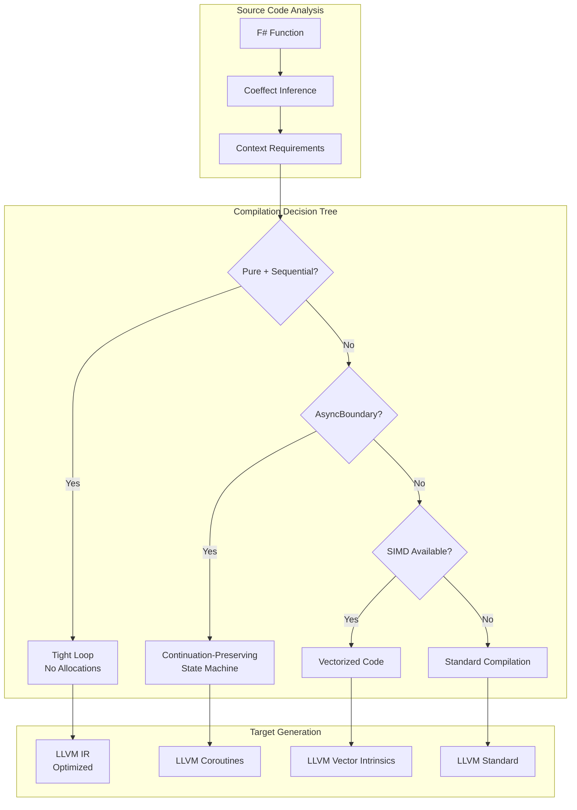
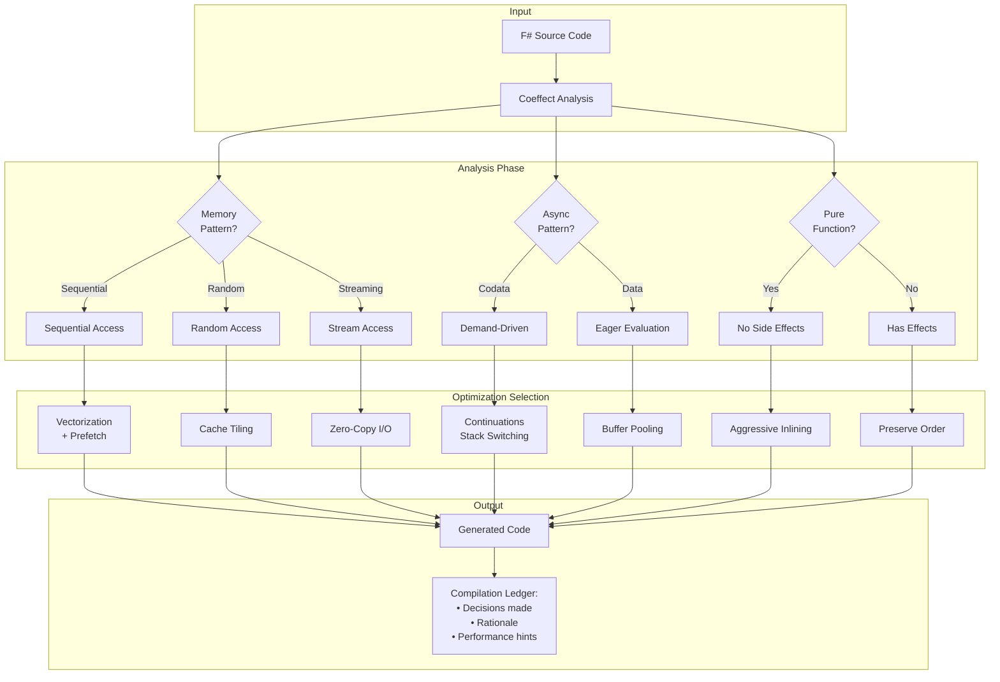

> This article was originally published on the
> [SpeakEZ Technologies blog](https://speakez.tech) as part of our early
> design work on the Fidelity Framework. It has been updated to reflect
> the Clef language naming and current project structure.

Modern async and parallel programming presents an engineering challenge: we need both the performance of low-level control and the safety of high-level abstractions. Nearly 20 years ago, the .NET ecosystem pioneered the `async`/`await` syntactic pattern, making concurrent code accessible to millions of developers and influencing other technology stacks in following years. However, this pattern comes with tradeoffs - runtime machinery that, while powerful, can become opaque when we need to understand or optimize workload behavior.

Composer explores a fresh perspective in that design space: what if we could preserve F#'s elegant async abstractions while compiling them to transparent, predictable machine code? By applying mathematical concepts from programming language theory - specifically **coeffects** (tracking what code needs from its context) and **codata** (recognizing demand-driven computation patterns) - the Composer compiler design aims to transform high-level F# async code into efficient implementations tailored for speed and safety.

We want to emphasize that this approach isn't about replacing existing solutions. It's about exploring how functional programming principles can drive compiler design to achieve new levels of performance and observability without compromise.

## The Engineering Challenge

Consider a typical F# async workflow that processes sensor data:

```fsharp
let processSensorStream (sensor: ISensor) (cancellationToken: CancellationToken) = async {
    let buffer = Array.zeroCreate 1024

    while not cancellationToken.IsCancellationRequested do
        let! bytesRead = sensor.ReadAsync(buffer, 0, buffer.Length)

        if bytesRead > 0 then
            let data = buffer |> Array.take bytesRead
            let processed = transformData data

            do! writeToDatabase processed
        else
            break
}
```

In traditional compilation, this innocent-looking code generates a complex web of runtime machinery that becomes effectively invisible during execution:

### .NET's Opacity Problem

**Hidden State Machines**: The .NET compiler transforms each `async` block into an opaque state machine class within the Common Language Runtime (CLR). These generated types aren't part of source code, making them difficult to profile or debug. When performance problems arise, you're left guessing which state transitions are causing bottlenecks.

**Allocation Mysteries**: Every `let!` and `do!` potentially creates:

- Task objects hidden in heap allocations you can't inspect
- Continuation delegates capturing local state
- Boxing of value types in generic contexts
- Internal queue nodes in the thread pool

These allocations happen deep in runtime code, invisible to standard memory profilers. You can see total memory pressure, but correlating it back to specific async operations becomes significant detective work.

**Scheduling Black Boxes**: The .NET thread pool decides when and where your continuations run based on heuristics that preclude direct inspection:

- Work-stealing algorithms with unpredictable CPU cache effects
- Timer queues managed by internal data structures
- I/O completion ports handled by the OS with no visibility

When latency spikes occur, determining whether the cause was scheduling delay, queue congestion, or actual work becomes nearly impossible without considerable effort using specialized tracing.

**Context Capture Overhead**: The `SynchronizationContext` and `ExecutionContext` flow through async calls, carrying security, culture, and synchronization state. This ambient data:

- Gets captured and restored at every await point
- Adds memory overhead you cannot measure directly
- Introduces performance costs that vary by environment
- Creates coupling to runtime implementation details

In practice, this means your async operation that takes 10ms in development might take 50ms or more in production due to different synchronization contexts. Memory that appears as "framework overhead" in profilers could be these hidden context captures. Most critically, you have no way to opt out of this overhead when you know it's unnecessary - the runtime decides for you.

### Debugging Challenges

When the above sensor processing code exhibits problems in production:

- Stack traces show framework internals, not your logical flow
- Memory dumps reveal generated classes with cryptic names
- Performance profiles highlight symptoms (GC pressure) not causes
- Concurrency bugs hide in the gaps between state machine transitions

> The fundamental issue: **the runtime owns your program's execution model**, and it provides limited windows into its decision-making process.

### The Composer Alternative

The Composer compiler design aspires to a different goal: analyze what your source code needs from its environment at compile time, then generate the most efficient implementation for the target hardware. By making the implicit explicit, our approach aims to transcend .NET's runtime opacity to create a new level of compile-time and runtime transparency.

## Coeffects: Tracking Context Requirements

Traditional effect systems track what code *does* to its environment - does it perform I/O, throw exceptions, or mutate state? Coeffects flip this around to track what code *needs* from its environment - does it require network access, specific memory patterns, or the ability to suspend execution?

In mathematical notation:

\[f : \Gamma @ R \vdash \tau\]

The \(R\) represents the coeffect - the resources and context required by \(f\) to produce a value of type \(\tau\) from context \(\Gamma\). This isn't just academic notation; it's the foundation for making principled compilation decisions.

### Practical Coeffect Tracking

Composer's emergent design is considering incorporation of context requirements as first-class citizens in its type system:

```fsharp
type ContextRequirement =
    | Pure                           // No external dependencies
    | AsyncBoundary                 // Requires suspension/resumption capability
    | ResourceAccess of Set<Resource>  // Files, network, memory-mapped regions
    | MemoryPattern of AccessPattern   // Sequential, random, streaming
    | HardwareFeature of Feature      // SIMD, GPU, specialized instructions
```

These annotations will be derived from and flow through the Program Hypergraph (PHG), enabling sophisticated analysis. Consider a case showing how this may work in practice:

```fsharp
// The compiler would infer: Pure @ Sequential
let sumArray (arr: float[]) =
    arr |> Array.fold (+) 0.0

// The compiler would infer: AsyncBoundary @ Network @ Streaming
let downloadData (url: string) = async {
    let! response = httpClient.GetAsync(url)
    return! response.Content.ReadAsStreamAsync()
}

// The compiler would infer: Pure @ Parallel @ SIMD
let matrixMultiply (a: Matrix) (b: Matrix) =
    Matrix.multiply a b
```

Each coeffect annotation is designed to guide compilation strategy:



The coeffect system's ability to track resource access patterns directly addresses what we call the 'byref problem' in traditional .NET. By making memory access patterns explicit at compile time, Composer can generate code that uses direct memory references safely - something impossible in systems where garbage collection can move memory unpredictably. This coeffect-driven approach enables the capability-based memory management that BAREWire implements, separating buffer lifetime from access permissions.

### Coeffects Enable Optimization Transparency

Unlike traditional compilers that make optimization decisions based on heuristics, Composer's currently proposed coeffect system is designed to make these decisions based on explicit and predictable factors:

```fsharp
// Developer will be able to see exactly why this compiles to a tight loop
let processData (data: float[]) =
    data
    |> Array.map (fun x -> x * 2.0 + 1.0)
    |> Array.filter (fun x -> x > threshold)

// And why this will preserve suspension capability
let processFiles (files: string list) = async {
    for file in files do
        use! stream = File.OpenReadAsync(file)
        let! content = readFullyAsync stream
        do! processContent content
}
```

## Codata: Demand-Driven Patterns

While data represents values we can construct and examine, codata represents computations defined by how they're consumed. This distinction, rooted in category theory, has profound implications for how we compile async and streaming code.

### The Data/Codata Duality in Practice

Consider these contrasting approaches:

```fsharp
// Data: Eager, space-consuming, all-at-once
type EagerList<'T> =
    | Nil
    | Cons of 'T * EagerList<'T>

// Codata: Lazy, space-efficient, on-demand
type Stream<'T> = unit -> StreamCell<'T>
and StreamCell<'T> =
    | SNil
    | SCons of 'T * Stream<'T>
```

The eager list must materialize all elements immediately. The stream produces elements only when requested. This isn't just about memory usage; it fundamentally changes how the compiler can optimize the code.

#### The Idiomatic F# Trap

Most F# developers naturally reach for familiar patterns that inadvertently create expensive computations:

```fsharp
// Natural but expensive: Creates all intermediate collections
let processLargeDataset (data: float[]) =
    data
    |> Array.map (fun x -> x * 2.0)        // Allocates new array
    |> Array.filter (fun x -> x > 100.0)   // Another allocation
    |> Array.map (fun x -> Math.Sqrt x)    // Yet another allocation
    |> Array.sum                           // Finally consumes

// Space-efficient alternative: Single pass, no intermediate arrays
let processLargeDatasetEfficient (data: float[]) =
    data
    |> Array.sumBy (fun x ->
        let doubled = x * 2.0
        if doubled > 100.0 then Math.Sqrt doubled else 0.0)
```

The first pattern feels more composable and readable, following the natural F# style of building pipelines. Yet it allocates three intermediate arrays that might never be needed again.

> For a million-element array, that's 24MB of unnecessary allocations.

Part of this is about growing accustomed to functional patterns that take advantage of these features. And in some cases we hope to provide custom analyzers that will provide helpful prompting where applicable.

#### Recognizing the Shift to Codata Thinking

Recognizing when to shift from data (eager) to codata (lazy) patterns. While Composer's design philosophy encourages this shift through type system guidance, we're still working on how this will work in practice:

```fsharp
// The compiler will recognize this pattern and suggest optimization
let analyzeTimeSeries (readings: float[]) =
    readings
    |> Array.map normalizeReading      // Analyzer: "Consider Seq or AsyncSeq"
    |> Array.filter outlierDetection   // Multiple intermediate arrays detected
    |> Array.windowed 10              // Memory pressure warning
    |> Array.map calculateMovingAvg
    |> Array.toList                   // Final materialization

// Codata version - same logic, radically different performance
let analyzeTimeSeriesCodata (readings: float[]) =
    readings
    |> Seq.map normalizeReading       // No allocation
    |> Seq.filter outlierDetection    // Still no allocation
    |> Seq.windowed 10               // Sliding window, constant memory
    |> Seq.map calculateMovingAvg
    |> Seq.toList                    // Only allocates final result
```

The codata version maintains the same idiomatic F# pipeline style but with fundamentally different execution semantics. Each element flows through the entire pipeline before the next begins, maintaining a constant memory footprint. This of course opens opportunities for parallelism and other features to take advantage of targeted hardware, and is a source of research as we work to bring these algorithms into practice.

#### When Eager is Right, When Lazy is Right

To our point above, the shift isn't absolute. Sometimes eager evaluation is correct:

```fsharp
// Eager is right: Need random access or multiple traversals
let correlationMatrix (data: float[][]) =
    let normalized = data |> Array.map normalize  // Need to traverse multiple times
    Array.init data.Length (fun i ->
        Array.init data.Length (fun j ->
            correlation normalized.[i] normalized.[j]))

// Lazy is right: Single-pass transformations
let streamingStats (data: seq<float>) =
    data
    |> Seq.scan (fun (sum, count) x -> (sum + x, count + 1)) (0.0, 0)
    |> Seq.map (fun (sum, count) -> sum / float count)
    |> AsyncSeq.ofSeq
    |> AsyncSeq.bufferByTime (TimeSpan.FromSeconds 1.0)
```

Our expectation is that the Composer compiler's coeffect analysis will help identify these patterns, providing gentle guidance toward more efficient alternatives while preserving F#'s natural programming style.

#### Design-Time Analyzer Guidance

Custom analyzers will be crucial for guiding developers toward efficient patterns. The analyzer could detect:

```fsharp
// Analyzer detects: Multiple intermediate array allocations
let processData (data: float[]) =
    data
    |> Array.map (fun x -> x * 2.0)      // 💡 Fidelity: "3 intermediate arrays allocated"
    |> Array.filter (fun x -> x > 100.0)  // Suggestion: "Consider Seq for single-pass"
    |> Array.map sqrt                     // Quick Fix: "Convert to Seq pipeline"
```

The analyzer would provide contextual hints:

- **Multiple traversals detected**: "Array is appropriate here - data accessed multiple times"
- **Single-pass pattern**: "Consider Seq or AsyncSeq to eliminate intermediate allocations"
- **Large collection warning**: "Array allocation >10MB detected - consider streaming"

With coeffect annotations, the analyzer could even show memory impact:

```fsharp
// Analyzer overlay: "Memory: ~24MB intermediate, ~8MB final"
// Coeffects: DataDriven @ Eager @ MemoryPressure(High)
```

This design-time feedback would help developers internalize the data/codata distinction naturally, making efficient patterns second nature over time.

### Recognizing Codata Patterns

Composer's architecture will identify codata patterns in F# async sequences and generators:

```fsharp
// Will be recognized as codata: infinite sequence, demand-driven
let sensorReadings (sensor: ISensor) (ct: CancellationToken) = asyncSeq {
    let mutable lastReading = 0.0
    while not ct.IsCancellationRequested do
        let! reading = sensor.ReadAsync()
        // Smooth readings with exponential moving average
        lastReading <- 0.1 * reading + 0.9 * lastReading
        yield lastReading
}

// Consumer controls the pace - only takes what it needs
let consumer = async {
    let mutable count = 0
    let cts = new CancellationTokenSource()
    for reading in sensorReadings sensor cts.Token do
        do! processReading reading
        count <- count + 1
        if count >= 1000 then
            cts.Cancel() // Signal to the producer to stop
            return ()
}
```

The compiler design aims to recognize this producer-consumer pattern and generate code that:
- Never buffers more than one value
- Suspends the producer when the consumer isn't ready
- Resumes exactly where it left off
- Uses no heap allocations for the streaming machinery

### Codata Enables Natural Backpressure

Traditional async enumeration often involves hidden buffering and complex cancellation logic. Codata patterns are designed to compile to natural backpressure:

```fsharp
// Multiple stages of transformation, all demand-driven
let pipeline =
    rawSensorData
    |> AsyncSeq.map validate
    |> AsyncSeq.filter (fun x -> x.IsValid)
    |> AsyncSeq.scan aggregate initialState
    |> AsyncSeq.bufferByTime (TimeSpan.FromSeconds 1.0)
    |> AsyncSeq.map computeStatistics
```

Each stage will pull from the previous only when ready, creating a self-regulating pipeline without explicit coordination.

## Mathematical Foundations

The algorithms underlying Composer's design provide rigorous foundations for practical optimization decisions. For those interested, it's worthwhile to explore the key formalisms that enable hardware-aware compilation.

### Coeffect Algebras and Context Composition

Coeffects form a semilattice structure that enables compositional analysis. Given two computations with coeffects, we can determine the coeffect of their composition:

\[\frac{\Gamma @ R_1 \vdash e_1 : \tau_1 \quad \Gamma, x:\tau_1 @ R_2 \vdash e_2 : \tau_2}{\Gamma @ R_1 \sqcup R_2 \vdash \text{let } x = e_1 \text{ in } e_2 : \tau_2}\]

where \(\sqcup\) represents the least upper bound operation. In plain language, this means "when we combine two computations, the resources required are the combination of resources needed by each computation."

In practical terms:

\[\begin{align}
\text{Pure} \sqcup \text{Pure} &= \text{Pure} \\
\text{Pure} \sqcup \text{AsyncBoundary} &= \text{AsyncBoundary} \\
\text{ResourceAccess}(S_1) \sqcup \text{ResourceAccess}(S_2) &= \text{ResourceAccess}(S_1 \cup S_2)
\end{align}\]

This mathematical structure will ensure that:
- Coeffect inference is deterministic and complete
- Composition preserves safety properties
- The compiler can make optimal decisions based on combined requirements

### The Comonad Structure of Context

Coeffects arise naturally from the comonadic structure of context-dependent computation. A comonad \(W\) provides:

\[\begin{align}
\epsilon &: W\,\tau \to \tau \quad &\text{(extract)} \\
\delta &: W\,\tau \to W\,(W\,\tau) \quad &\text{(duplicate)} \\
\text{fmap} &: (\tau_1 \to \tau_2) \to W\,\tau_1 \to W\,\tau_2 \quad &\text{(functor map)}
\end{align}\]

For async computations, the comonad tracks suspension capability:

\[W_{\text{async}}\,\tau = \text{SuspensionContext} \to (\tau + \text{Continuation})\]

This formalism will directly inform code generation:
- \(\epsilon\) determines where we can safely extract pure values
- \(\delta\) shows where context must be preserved across suspension points
- \(\text{fmap}\) indicates when transformations can be fused

### Codata as Final Coalgebras

Codata structures are formally defined as final coalgebras. For a functor \(F\), the final coalgebra \(\nu F\) represents the largest fixed point:

\[\nu F = \{x \mid x \cong F(x)\}\]

For streams, the functor is \(F(X) = 1 + A \times X\), giving us:

\[\text{Stream}\,A = \nu X. 1 + A \times X\]

The coalgebra structure \(\alpha : \text{Stream}\,A \to 1 + A \times \text{Stream}\,A\) defines the observation:

```fsharp
type StreamObs<'a> =
    | Done
    | Yield of 'a * Stream<'a>
```

This mathematical view reveals why codata will compile efficiently:
- Observations are the only operations (no hidden state)
- Memory requirements are predictable (one element at a time)
- Composition preserves the coalgebraic structure

This mathematical guarantee of single-element observation creates natural synchronization points with Fidelity's broader memory architecture. Each yield in a codata structure represents not just a suspension point but a resource lifetime boundary - precisely where RAII principles ensure deterministic cleanup. When combined with BAREWire's memory-mapped I/O, these yield points become optimal locations for resource acquisition and release, enabling zero-copy streaming between processes while maintaining memory safety through hardware protection rather than runtime checks.

### Delimited Continuations and Stack Calculus

The theoretical foundation for zero-copy async comes from delimited continuations. In the \(\lambda_{\text{cont}}\) calculus:

\[\frac{\Gamma \vdash e : \tau \quad \Gamma, k : \tau \to \sigma \vdash e' : \sigma}{\Gamma \vdash \text{shift}\,k\,\text{ in }\,e' : \sigma}\]

This translates to stack manipulation operations:

\[\begin{align}
\text{capture} &: \text{Stack} \to \text{Continuation} \\
\text{restore} &: \text{Continuation} \to \text{Stack} \to \text{Stack} \\
\text{switch} &: \text{Continuation} \to \text{Continuation} \to \text{unit}
\end{align}\]

In WAMI's implementation:
- \(\text{capture}\) becomes a stack pointer save
- \(\text{restore}\) becomes a stack pointer restore
- \(\text{switch}\) becomes an atomic pointer swap

No heap allocation required; just pointer arithmetic.

### Parametricity and Free Theorems

Composer's design will also leverage parametricity to derive optimization theorems. For a polymorphic function:

\[f : \forall \alpha. F[\alpha] \to G[\alpha]\]

The parametricity theorem gives us a free theorem about \(f\)'s behavior. For async sequences:

\[\forall \alpha, \beta. \forall g : \alpha \to \beta. \text{map}\,g \circ f_\alpha = f_\beta \circ \text{map}\,g\]

This will mean:
- Map fusion is always valid
- Order of operations can be rearranged
- The compiler can pipeline transformations

These theorems show a path to optimizations that would be unsound in languages without parametric polymorphism.

#### Network-Transparent Optimization via Inet Dialect

The real power emerges when parametricity meets MLIR's Inet dialect. Consider a distributed pipeline:

```fsharp
// Data flows across process boundaries
let processRemoteData =
    remoteSource
    |> AsyncSeq.map validate      // Could run locally
    |> AsyncSeq.map transform     // Or remotely
    |> AsyncSeq.filter predicate  // Or split across nodes
```

Parametricity guarantees that these transformations can be safely relocated across network boundaries. The Inet dialect will leverage this to:

- **Fuse operations before transmission**: Send `validate >> transform` as a single remote operation
- **Push filters upstream**: Move predicates closer to data sources to reduce network traffic
- **Preserve correctness**: The free theorem ensures behavior remains identical regardless of where operations execute

#### Massive Parallelism Through Accelerator Backends

Perhaps most excitingly, parametricity opens the door to transparent GPU and accelerator deployment. When the compiler can prove that operations are pure and data-parallel:

```fsharp
// Parametric operations automatically eligible for GPU execution
let processImages =
    images
    |> Array.map (fun img -> img |> resize |> blur |> normalize)
    |> Array.map detectFeatures
    |> Array.filter (fun features -> features.Length > threshold)
```

The free theorems guarantee that this can be safely transformed into:

- **CPU parallel operations** via SIMD vectorization, multi-threading, and process distribution
- **GPU kernels** via MLIR's GPU dialect
- **TPU operations** via MLIR's TensorFlow backends
- **Custom ASIC deployments** via specialized MLIR targets

The mathematical guarantee means Composer can automatically:

- Batch pure operations into single kernel launches
- Fuse map operations to minimize memory transfers
- Partition work across heterogeneous accelerators
- All while preserving exact F# semantics

This isn't speculative optimization - it's mathematically sound transformation, enabling a single F# expression to compile to efficient code whether targeting a CPU, GPU cluster, or custom silicon.

## Hardware-Aware Code Generation

The combination of coeffect analysis and codata recognition will enable Composer to choose optimal compilation strategies for different hardware targets. This design philosophy embraces hardware diversity - the same F# code will compile differently based on deployment context.

### Native Code via LLVM

For native targets, Composer's architecture leverages LLVM's optimization infrastructure while preserving F#'s semantics:

#### Pure Computations

When coeffects indicate pure, data-driven computation:

```fsharp
// Coeffects: Pure + Sequential + NoAllocation
// Blur a single pixel using a 2x2 kernel (simplified Gaussian blur)
let inline blurPixel2x2 (img: float[]) (width: int) (idx: int) =
    // Using width parameter for stride calculation
    let tl = img.[idx]                // top-left
    let tr = img.[idx + 1]            // top-right
    let bl = img.[idx + width]        // bottom-left (using width as stride)
    let br = img.[idx + width + 1]    // bottom-right

    // Simple box blur: average of 4 pixels
    (tl + tr + bl + br) * 0.25
```

This function exemplifies pure computation - it reads from immutable input, performs arithmetic operations, and returns a result with no side effects. The coeffect system recognizes this purity and enables aggressive optimization. When processing an entire image, this function would be called in a tight loop, and the compiler can inline it completely.

The design targets compilation to:
```armasm
blurPixel2x2:
    ; x0 = img pointer, x1 = width, x2 = idx
    lsl     x3, x1, #3           ; x3 = width * 8 (bytes per float64)
    add     x4, x0, x2, lsl #3   ; x4 = img + idx*8 (base address)

    ldr     d0, [x4]             ; Load top-left
    ldr     d1, [x4, #8]         ; Load top-right (next element)
    ldr     d2, [x4, x3]         ; Load bottom-left (width stride)
    add     x5, x4, x3           ; Calculate bottom-right address
    ldr     d3, [x5, #8]         ; Load bottom-right

    fadd    d4, d0, d1           ; Add top pixels
    fadd    d5, d2, d3           ; Add bottom pixels
    fadd    d4, d4, d5           ; Sum all four
    fmul    d0, d4, #0.25        ; Multiply by 0.25 (average)
    ret
```

Notice how the pure functional F# code compiles directly to efficient assembly with no allocations, no function call overhead, and optimal use of floating-point registers. The purity guarantee allows the compiler to vectorize this operation across multiple pixels when used in a larger image processing pipeline.

#### Async Computations

When coeffects indicate suspension points, the compiler will utilize LLVM coroutine intrinsics:

```fsharp
// Coeffects: AsyncBoundary + ResourceAccess
let processNetworkStream = async {
    let buffer = Array.zeroCreate 4096
    let! bytesRead = stream.ReadAsync(buffer)
    let processed = transform buffer bytesRead
    do! writeResult processed
}
```

The planned compilation approach would use LLVM coroutine intrinsics (future work, not yet implemented):
```llvm
// Proposed: LLVM IR for async continuations (design phase)
define i8* @processNetworkStream() {
entry:
    %hdl = call i8* @llvm.coro.begin(...)
    %suspend = call i8 @llvm.coro.suspend(...)
    switch i8 %suspend, label %suspend [i8 0, label %resume
                                       i8 1, label %cleanup]
resume:
    ; Continuation after async operation
    ; Stack and registers restored exactly
cleanup:
    ; Deterministic resource cleanup
}
```

These continuation points integrate naturally with Fidelity's actor-based memory model. When an async operation suspends at a continuation boundary, it aligns with actor message boundaries - the precise moments when Prospero can coordinate memory management decisions. This alignment isn't coincidental; it emerges from recognizing that both async operations and actor systems are fundamentally about managing computational boundaries.

### WebAssembly via WAMI

The WAMI (WebAssembly Machine Interface) backend represents a fundamental shift in how we think about compiling functional abstractions. By preserving delimited continuations (dcont) through every stage of compilation - from F# source to WebAssembly machine code - WAMI enables something previously thought impossible: first-class control flow at the hardware level.

#### The Delimited Continuation Advantage

Traditional compilation destroys the high-level structure of control flow, replacing elegant async/await or yield patterns with opaque state machines. WAMI takes a radically different approach:

```fsharp
// Codata pattern: infinite generator
let fibonacci = seq {
    let mutable (a, b) = (0L, 1L)
    while true do
        yield a
        a, b <- b, a + b
}
```

This will compile to WAMI's DCont dialect:

```wasm
(func $fibonacci_generator (param $cont i32) (result i32)
    (local $a i64) (local $b i64) (local $temp i64)

    ;; Initialize state
    (local.set $a (i64.const 0))
    (local.set $b (i64.const 1))

    (loop $generate
        ;; Yield current value using stack switching
        (suspend $yield_tag
            (local.get $a))

        ;; Calculate next value
        (local.set $temp (i64.add (local.get $a) (local.get $b)))
        (local.set $a (local.get $b))
        (local.set $b (local.get $temp))

        (br $generate)))
```

#### Why This Matters: True Zero-Copy Suspension

The `suspend` instruction isn't a compiler trick or runtime simulation - it's a real machine-level operation that:

1. **Captures the current stack**: The entire computation state, including all locals and the instruction pointer
2. **Packages it as a first-class value**: This continuation can be stored, passed around, or resumed
3. **Requires zero heap allocation**: Everything lives in the WASM linear memory stack

Compare this to traditional approaches:

```csharp
// Traditional: Heap-allocated state machine
class FibonacciEnumerator : IEnumerator<long> {
    private int state = 0;
    private long a = 0, b = 1, current;

    public bool MoveNext() {
        switch (state) {
            case 0: current = a; state = 1; return true;
            case 1: /* compute next */; return true;
        }
    }
}
```

The traditional approach allocates objects, switches on integers, and loses all connection to the original control flow. WAMI preserves the mathematical essence of the continuation.

#### Engineering Benefits of Machine-Level Continuations

**1. Debugging Transparency**: When you pause in a debugger, you see the actual suspended computation, not a synthetic state machine:
```
Stack frame: fibonacci_generator
  $a: 34
  $b: 55
  Suspended at: yield point
  Continuation: can be inspected/resumed
```

**2. Composition Without Overhead**: Multiple generators can compose without intermediate allocations:
```fsharp
let composed =
    fibonacci
    |> Seq.map (fun x -> x * x)
    |> Seq.filter (fun x -> x % 2L = 0L)
    |> Seq.take 100
```

Each stage suspends and resumes directly, passing values through registers, not heap-allocated queues.

**3. Predictable Performance**: The cost model is transparent:
- Suspend: Save stack pointer + registers (< 10 instructions)
- Resume: Restore stack pointer + registers (< 10 instructions)
- No GC pressure, no allocation, no hidden costs

#### Theoretical Foundation Meets Practice

The ability to preserve delimited continuations to the machine level validates decades of programming language theory. What Danvy and Filinski described mathematically in 1990, WAMI implements mechanically in 2025:

\[\langle E[\text{shift}\,k.e] \rangle \leadsto \langle e[k \mapsto \lambda x.\langle E[x] \rangle] \rangle\]

This isn't just notation - it's exactly what the `suspend` instruction does:
- E is the evaluation context (the stack)
- shift k.e is the suspend point
- λx.⟨E[x]⟩ is the captured continuation

The theoretical and practical have converged: mathematical abstractions compile to efficient machine operations without semantic loss. This is the promise of WAMI - not just better performance, but faithful preservation of our functional programming abstractions all the way to the "machine" level.

### Optimization Decision Transparency

Unlike traditional compilers where optimization decisions are opaque, Composer's design will provide its reasoning through detailed compilation telemetry:



This is a significant forward-looking design goal. But we're putting the foundations in place to help make this a reality as this novel compiler takes shape.

## Deterministic Resource Management

Traditional .NET async code faces challenges with resource cleanup timing due to the interaction between `IDisposable`, finalizers, and garbage collection. Composer's approach seeks to remedy this architectural friction but associating resource lifetime to continuation boundaries using a resource calculus based on linear types.

### Linear Resource Tracking

Resources in Composer will follow linear typing discipline, ensuring each resource is used exactly once:

\[\frac{\Gamma, r : \text{Resource}[\tau] \vdash e : \sigma \quad r \in \text{used}(e)}{\Gamma \vdash \text{use}\,r = \text{acquire}() \text{ in } e : \sigma}\]

The type system enforces:
- \(\text{acquire} : \text{unit} \to \text{Resource}[\tau]\) produces a linear resource
- \(\text{release} : \text{Resource}[\tau] \to \text{unit}\) consumes it exactly once
- No duplication: \(\text{Resource}[\tau] \not\to \text{Resource}[\tau] \times \text{Resource}[\tau]\)
- No dropping: \(\text{Resource}[\tau] \not\to \text{unit}\)

This linear resource tracking forms the foundation for Fidelity's complete memory model. While stack-only allocation demonstrates that functional programming doesn't need managed runtimes, the linear type discipline enables sophisticated patterns like arena allocation and actor-based memory management. Each resource's deterministic lifetime - enforced through linear types - becomes a building block for larger architectural patterns where entire actor arenas follow the same RAII principles at a coarser granularity.

This mathematical guarantee translates to deterministic cleanup in generated code without putting a continuous burden on the developer to explicitly declare it at every termination point:

```fsharp
let processMultipleFiles (files: string list) = async {
    for file in files do
        // Resource coeffect tracked through type system
        use! handle = openFileAsync file
        let! data = handle.ReadAllAsync()

        // Nested resource with guaranteed ordering
        use! compressor = createCompressor()
        let! compressed = compressor.CompressAsync(data)

        do! saveCompressed file compressed
        // Compressor released here, at continuation boundary
    // File handle released here, at continuation boundary
}
```

The compiler will generate cleanup code at precise continuation points:

- Resources are released in reverse acquisition order
- Cleanup happens deterministically, not dependent on GC
- The generated code includes cleanup in the state machine itself
- Exception paths guarantee cleanup through compiler-generated finally blocks

### Memory-Mapped Resources and Zero-Copy I/O

For resources that support memory mapping (via BARE protocol integration with our patent-pending BAREWire implementation), Composer's design will enable true zero-copy async I/O:

```fsharp
// Coeffects: AsyncBoundary + MemoryMapped + ZeroCopy
let processLargeFile (path: string) = async {
    // Memory maps the file, no copying
    use! mapped = MemoryMappedFile.OpenAsync(path)

    // Creates a view, still no copying
    let! view = mapped.CreateViewAsync(offset, length)

    // Process directly on mapped memory
    let result = processInPlace view

    // View released, mapping released, deterministic
    return result
}
```

The zero-copy async I/O enabled by memory mapping extends naturally to cross-process scenarios through Reference Sentinels. When processes share memory-mapped regions, the codata streaming patterns ensure that only one element at a time needs to be accessible, while Sentinels provide rich state information about process availability. This combination enables true zero-copy communication across process boundaries with deterministic cleanup when processes terminate.

## Real-World Benefits

This mathematical foundation will translate to concrete engineering advantages that matter in production systems:

### 1. Predictable Performance Profiles

Developers will be able to reason about performance characteristics at compile time:

```fsharp
// This WILL compile to a tight loop:
let fastPath data = Array.map transform data

// This WILL preserve suspension points:
let asyncPath data = async {
    let! processed = remoteProcess data
    return processed
}
```

No more guessing whether the JIT will inline, whether allocations will trigger GC, or whether the thread pool will introduce latency.

### 2. Stack-Based Async Patterns

Codata compilation is designed to eliminate allocation overhead in streaming scenarios:

```fsharp
// Traditional: Allocates tasks, delegates, and buffers
let traditional = async {
    let! batches =
        source
        |> AsyncSeq.bufferByCount 100
        |> AsyncSeq.map process
        |> AsyncSeq.toListAsync
    return batches
}

// Composer: Will compile to stack-based state machine
let efficient =
    source
    |> AsyncSeq.bufferByCount 100
    |> AsyncSeq.map process
    |> AsyncSeq.fold accumulate initial
```

Early benchmarks suggest potential for 10-100x reduction in allocation rates for streaming workloads.

### 3. Transparent Cross-Platform Deployment

The architecture enables the same F# code to compile optimally for different targets:

```fsharp
// Cloud server: Will compile to LLVM with coroutines
// Browser: Will compile to WAMI with stack switching
// Embedded: Will compile to interrupt-driven state machine
let universalAsync = async {
    let! sensor = readSensor()
    let processed = computeResult sensor
    do! transmitResult processed
}
```

Each platform will receive an implementation suited to its constraints, all from the same source.

### 4. Debugging and Profiling Transparency

Unlike opaque runtime machinery, Composer's generated code is designed to be debuggable:

- Stack traces will show your actual call flow
- Memory profilers will see your allocations, not framework overhead
- CPU profiles will map directly to your source code
- Continuation points will be visible in tooling

## Academic Foundations and Innovation

The theoretical underpinnings of Composer's design draw from several areas of programming language research:

**Coeffect Systems** (Petricek et al., 2014) formalized context-dependent computation, providing the mathematical framework for tracking what programs need from their environment. Composer extends this work by using coeffects to drive compilation decisions, a novel application that bridges theory and practice.

**Codata and Demand-Driven Computation** has roots in Turner's work on total functional programming (1995) and was further developed by Danielsson et al. (2006). The observation that codata patterns map naturally to continuation-based compilation strategies represents an original contribution of the Composer design.

**Delimited Continuations** (Danvy and Filinski, 1990) provide the theoretical foundation for WAMI's stack switching implementation. By recognizing async/await as a syntax for delimited continuations, Composer achieves zero-copy context switching without runtime support.

The integration of these concepts - using coeffects to identify codata patterns and compiling them via delimited continuations - represents a novel synthesis that will enable hardware-aware functional programming. We believe that this will enable new opportunities for the F# language and for new ecosystems to emerge that provide ample opportunity to confidently produce efficient, transparent workloads for high reliability systems.

## Looking Forward: The Future of Functional Systems Programming

Our "virtual whiteboard" session in the blog post demonstrates that functional programming abstractions need not come at the cost of performance or transparency. By embracing mathematical foundations, we envision building a robust framework that:

- Makes optimization decisions explicit and predictable
- Generates code competitive with hand-written C
- Preserves high-level abstractions without runtime overhead
- Targets diverse hardware from a single source

This approach points toward a future where the boundaries between systems programming and functional programming dissolve. Where async operations become as transparent as synchronous mechanisms. Where the same elegant F# code runs efficiently on everything from embedded devices to data center scaled server clusters. There are still significant engineering challenges to overcome and new opportunities to discover, but we're confident in the theoretical and technological path we've chosen.

The algorithmic foundations of coeffects and codata don't exist in isolation - they form the theoretical backbone for Fidelity's complete approach to systems programming. From solving the byref problem through capability-based memory management, to enabling RAII-based actor systems with deterministic cleanup, to supporting zero-copy cross-process communication through memory mapping and Reference Sentinels, these concepts enable a unified architecture. The same mathematical principles that guide compilation decisions also inform memory management strategies, creating a coherent system where theory and practice reinforce each other.

The marriage of formalism and pragmatism in Composer's design philosophy shows that we don't have to choose between abstraction and performance, between safety and efficiency, between portability and optimization. Through coeffects and codata, we have all that is needed to achieve these lofty goals - functional programming that truly understands the hardware on which it runs.

As we continue developing Composer and the broader Fidelity framework, we're not just building a new compiler; we're exploring how functional programming principles can fundamentally reshape our approach to systems programming. The journey from abstraction to engineering result is not just possible - it's a clear, opportunity-rich path forward for the next generation of hardware-software co-design.
