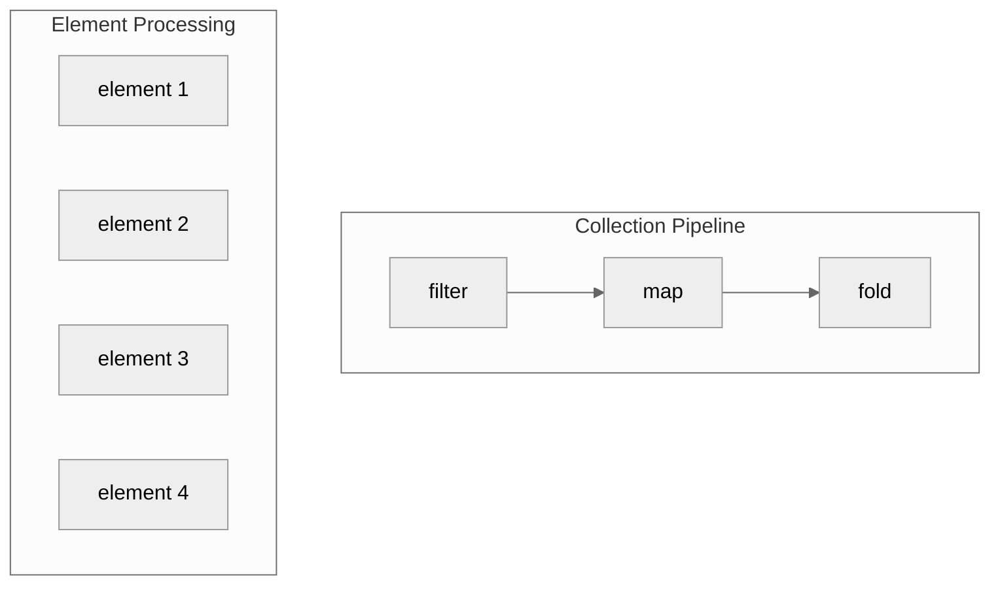
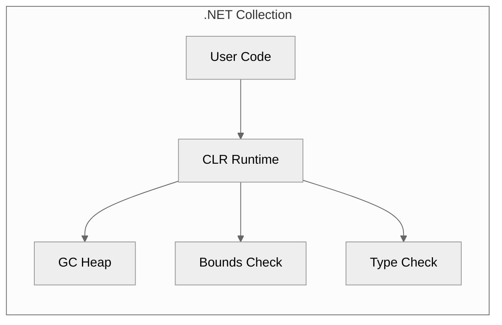
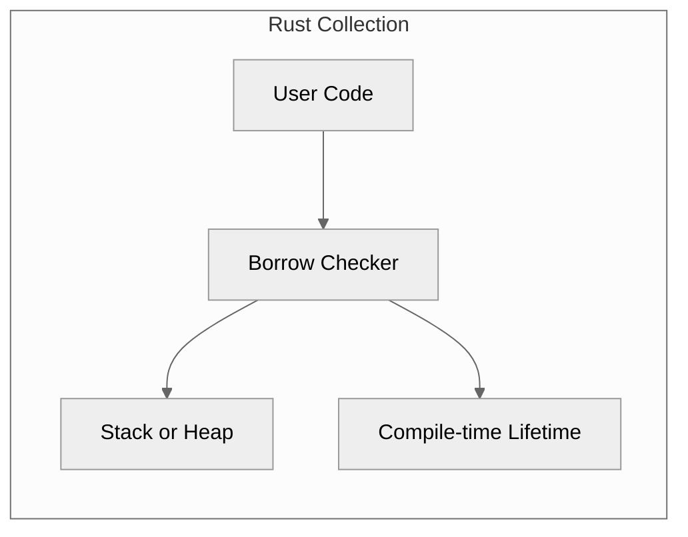
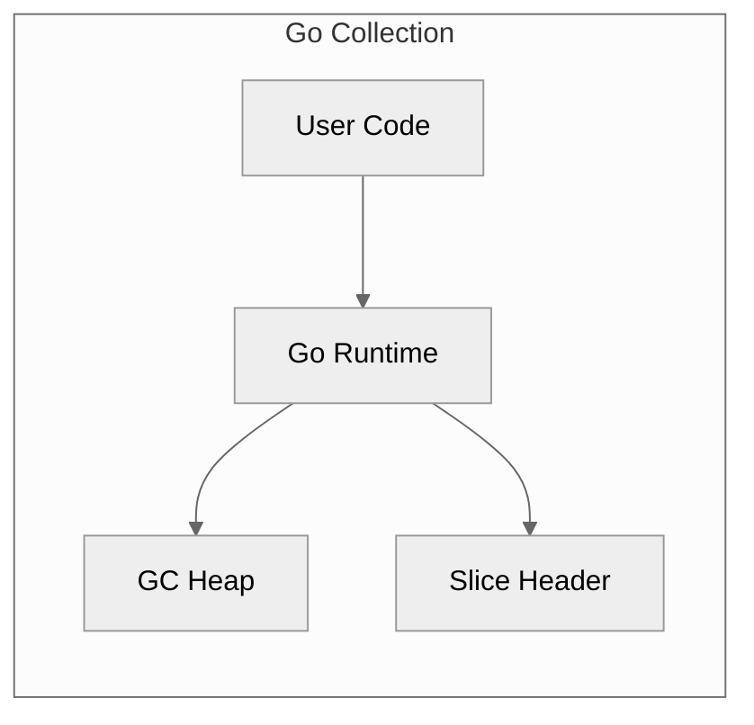
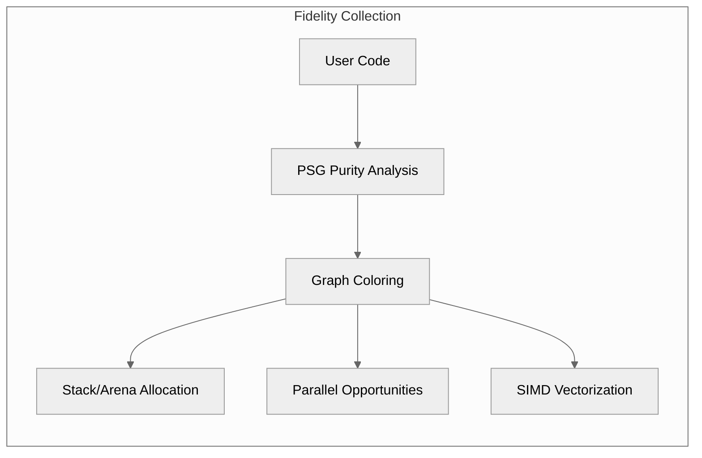
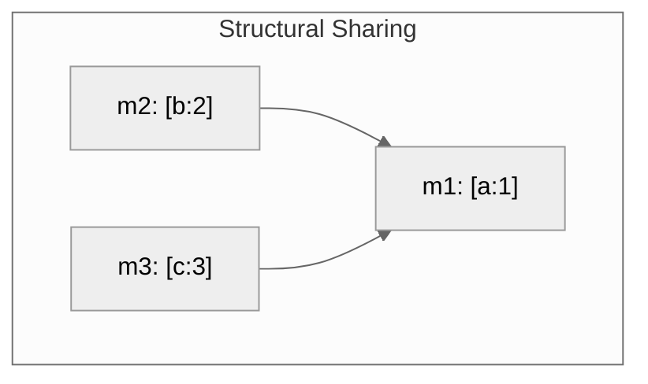
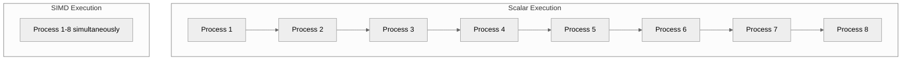
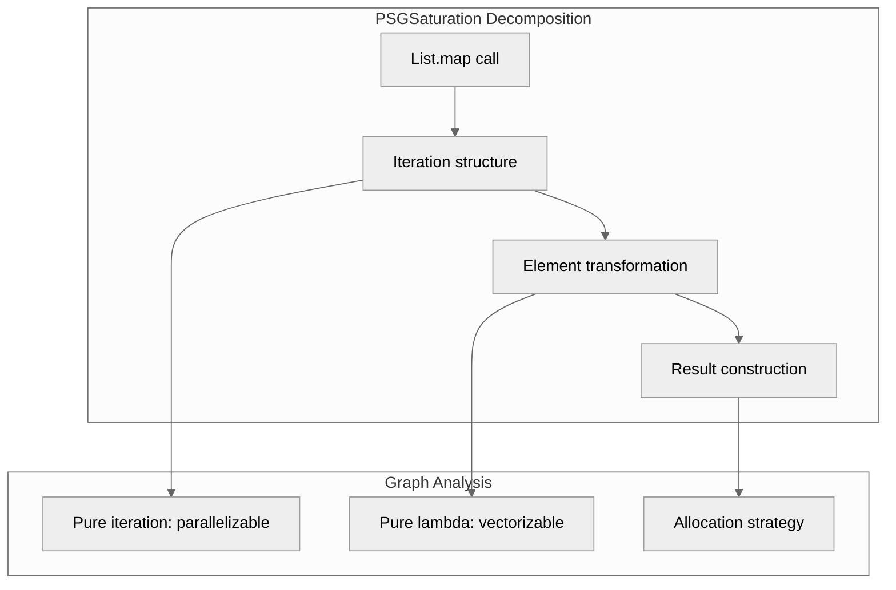
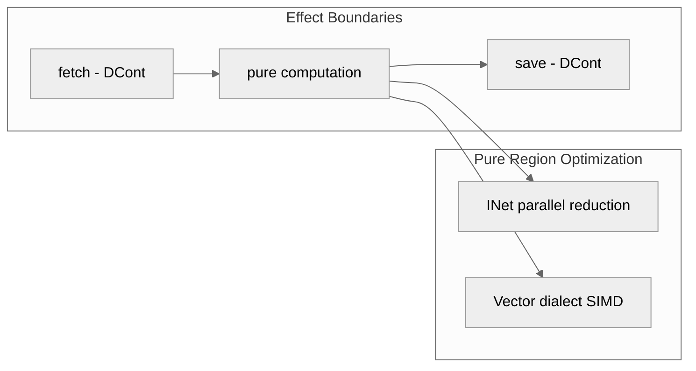

> This article was originally published on the
> [SpeakEZ Technologies blog](https://speakez.tech) as part of our early
> design work on the Fidelity Framework. It has been updated to reflect
> the Clef language naming and current project structure.

Every .NET developer knows collections. `List<T>`, `Dictionary<K,V>`, arrays. They're the bread and butter of everyday programming. You iterate, filter, map, and fold without thinking twice. But what if I told you that underneath these pedestrian operations lies something profound? Something that could unlock automatic parallelization and SIMD vectorization without a single template metaprogramming nightmare or `std::enable_if` in sight?

Welcome to the quiet revolution happening in Fidelity's Composer compiler, where Clef collections reveal their true nature: pure lambda calculus, ready for acceleration.

## The Purity Hiding in Plain Sight

Consider this utterly ordinary Clef code:

```fsharp
let results =
    data
    |> List.filter (fun x -> x > threshold)
    |> List.map (fun x -> x * 2)
    |> List.fold (+) 0
```

To most .NET developers, this is just a collection pipeline. Filter some things, transform the rest, sum them up. Nothing special.

But look closer. Each of these operations is **referentially transparent**. Given the same inputs, they always produce the same outputs with no side effects. The `filter` doesn't mutate `data`. The `map` creates new values. The `fold` accumulates without touching external state.

This isn't an accident. It's lambda calculus in disguise.

## Why Purity Matters: The Graph Coloring Connection

In a [previous exploration of graph coloring](https://speakez.tech/blog/speed-and-safety-with-graph-coloring/), we discussed how the Composer compiler analyzes code to discover hidden parallelism. The key insight: operations that don't interfere with each other can be assigned the same "color" and executed simultaneously.



Pure operations, by definition, don't interfere with anything. They're the ultimate parallelization candidates.

When the compiler sees `List.map (fun x -> x * 2) data`, it recognizes:
- Each element transformation is independent
- No element depends on any other element's result
- The operation is embarrassingly parallel

The same `map` that looks sequential in your source code can become a parallel scatter across CPU cores or a vectorized SIMD operation. Automatically. Without any special syntax or attributes.

## How Languages Handle Dynamic Collections

The challenge of dynamic collections appears across all systems languages. Each ecosystem has made different tradeoffs between safety, performance, and ergonomics.

### .NET: Runtime Verification

The .NET ecosystem relies heavily on the CLR's managed runtime for collection safety:

```csharp
var list = new List<int> { 1, 2, 3 };
list.Add(4);  // Runtime bounds checking, GC allocation

// LINQ provides functional-style operations
var doubled = list.Select(x => x * 2).ToList();
```



The CLR guarantees memory safety through garbage collection and runtime verification. This works well for most applications but introduces unpredictable latency from GC pauses and prevents the compiler from making strong optimization guarantees.

### Rust: Ownership Types

Rust takes a fundamentally different approach through its ownership system:

```rust
let mut vec = vec![1, 2, 3];
vec.push(4);  // Ownership tracked at compile time

// Iterators are lazy, zero-cost abstractions
let doubled: Vec<_> = vec.iter().map(|x| x * 2).collect();
```



Rust's borrow checker enforces memory safety at compile time through ownership and borrowing rules. This eliminates runtime overhead but requires the programmer to explicitly reason about lifetimes. The resulting code is both safe and efficient, but the learning curve is steep.

### Go: Simplicity with Runtime Support

Go opts for simplicity with a runtime garbage collector:

```go
slice := []int{1, 2, 3}
slice = append(slice, 4)  // May reallocate, GC manages memory

// No built-in map/filter - manual loops
doubled := make([]int, len(slice))
for i, v := range slice {
    doubled[i] = v * 2
}
```



Go provides memory safety through garbage collection like .NET, but with a simpler type system. The tradeoff is less expressive power for collection operations. There's no built-in support for functional transformations, pushing that complexity to user code.

### Clef with Fidelity: Compile-Time Purity Analysis

Fidelity takes yet another path. We preserve Clef's functional semantics while analyzing purity at compile time:

```fsharp
let data = [1; 2; 3]
let extended = 4 :: data  // Structural sharing, no mutation

// Functional operations preserve purity
let doubled = data |> List.map (fun x -> x * 2)
```



The key difference: Fidelity doesn't just verify safety. It discovers optimization opportunities from purity. Where Rust tracks ownership and .NET tracks references, Fidelity tracks **referential transparency**.

## Structural Sharing: Immutability Without the Cost

"But wait," says the skeptical .NET developer, "immutable collections are slow! All that copying!"

Here's where Clef's collection design reveals its elegance. Consider:

```fsharp
let m1 = Map.add "a" 1 Map.empty
let m2 = Map.add "b" 2 m1
let m3 = Map.add "c" 3 m1
```

How many tree nodes were allocated? Not three complete trees. The maps share structure:



This **structural sharing** means immutability doesn't require full copies. You pay only for the path that changes. And crucially, because the original is never modified, `m1` remains pure. This enables all the parallel and vectorized optimizations we discussed.

This is the "only pay for what you use" philosophy applied to functional data structures. The same principle that drives [Baker's approach to memory management](/docs/design/baker-saturation-engine/) applies here: don't pay for what you don't need.

## The C++ Contrast: Complexity vs. Clarity

To achieve similar optimization potential in C++, you'd venture into template metaprogramming territory:

```cpp
template<typename InputIt, typename OutputIt, typename UnaryOperation,
         typename = std::enable_if_t<
             std::is_same_v<
                 typename std::iterator_traits<InputIt>::iterator_category,
                 std::random_access_iterator_tag>>>
constexpr OutputIt transform_parallel(InputIt first, InputIt last,
                                       OutputIt d_first, UnaryOperation op) {
    // ... several hundred lines of SFINAE and concept constraints
}
```

The C++ approach demands you explicitly encode parallelization potential in the type system through increasingly baroque template machinery. It's powerful, but the cognitive overhead is immense.

Clef's approach? Write normal code. Let the compiler discover the purity. Get the parallelization for free.

```fsharp
let doubled = List.map (fun x -> x * 2) data  // That's it. That's the code.
```

The purity is *intrinsic* to the operation, not bolted on through type gymnastics.

## From Referential Transparency to SIMD

In our exploration of [referential transparency as a compilation strategy](https://speakez.tech/blog/seeking-referential-transparency/), we showed how pure code regions can target different execution models. But there's an optimization opportunity even closer to the metal: SIMD vectorization.

Consider array operations:

```fsharp
let doubled = Array.map (fun x -> x * 2) data
```

A naive compilation produces a scalar loop:
```
for i in 0..length-1:
    result[i] = data[i] * 2
```

But because the operation is pure and element-independent, the compiler can emit MLIR's vector dialect:

```mlir
%data_vec = vector.load %data[%i] : vector<8xi32>
%two = arith.constant dense<2> : vector<8xi32>
%result_vec = arith.muli %data_vec, %two : vector<8xi32>
vector.store %result_vec, %result[%i] : vector<8xi32>
```

Eight elements processed per instruction. No template metaprogramming. No explicit SIMD intrinsics. Just pure operations, automatically vectorized.



This isn't theoretical. It's the explicit design goal of Fidelity's approach to collection operations. We don't rely on LLVM's `-O3` auto-vectorization lottery. The structure that enables vectorization is preserved in the IR itself.

## PSGSaturation: Only Pay for What You Use

The compilation strategy connects directly to how [Baker's incremental approach](/docs/design/baker-saturation-engine/) informs Composer's design. Just as Baker doesn't copy an entire heap when a single object changes, PSGSaturation doesn't instantiate a complete collection implementation when you only use a subset of operations.

When you write:

```fsharp
let doubled = List.map (fun x -> x * 2) data
```

PSGSaturation doesn't pull in the entire `List` module. It decomposes the `map` operation into its algorithmic essence:



The semantic graph captures exactly what the operation needs. Nothing more. Alex witnesses this graph and generates MLIR that matches the actual requirements. If you never call `List.fold`, you don't pay for fold machinery.

This is the "only pay for what you use" principle extended from memory management to semantic analysis.

## The Compositional Advantage

Pure operations compose. When you chain collection operations:

```fsharp
data
|> Seq.filter isValid
|> Seq.map transform
|> Seq.take 100
|> Seq.fold combine initial
```

Each stage maintains purity. The entire pipeline is a composition of pure functions, which means:

1. **Lazy evaluation** - Nothing computes until `fold` demands it
2. **Fusion potential** - Adjacent operations can merge into single passes
3. **Parallel boundaries** - The compiler knows exactly where parallelism is safe

Compare this to imperative code where each loop iteration might mutate shared state, access global variables, or perform I/O. The compiler must assume the worst and serialize everything.

## The Road Ahead: DCont and INet Dialects

Today, Composer emits standard MLIR dialects for collection operations. But the architecture preserves degrees of freedom for future optimization.

When the Delimited Continuations (DCont) dialect is integrated into our MLIR scheme, effectful boundaries will be explicit:

```fsharp
let process = async {
    let! data = fetchAsync()           // Effect boundary: DCont
    let result = List.map transform data  // Pure: parallelizable
    do! saveAsync result               // Effect boundary: DCont
}
```

When the Interaction Net (INet) dialect is in the picture, pure regions will compile to parallel reduction networks. This is the mathematical dual of the lambda calculus itself, executing in parallel wherever data dependencies permit.



The pedestrian collection code written for WREN stack apps will some day automatically benefit from these optimizations. No code changes required.

## Collect Yourself: The Takeaway

The next time you write a `map`, `filter`, or `fold`, remember: you're not just processing data. You're hinting at pure lambda calculus in disguise. Each operation is a building block that the compiler can analyze, parallelize, and vectorize. The question is whether your framework and the underlying hardware can support it.

This is where theory meets practice. [Graph coloring](https://speakez.tech/blog/speed-and-safety-with-graph-coloring/) isn't an abstract mathematical curiosity. It's how we discover which operations can run simultaneously. [Referential transparency](https://speakez.tech/blog/seeking-referential-transparency/) isn't a functional programming talking point. It's the property that makes optimization *provably correct*. [Baker's incremental approach](/docs/design/baker-saturation-engine/) isn't just about marshaling memory. It's a philosophy that permeates how we think about paying only for what we actually use.

These theoretical foundations become crucial engineering decisions. The expressive design that makes Clef code pleasant to reason about is the same purity that enables the compiler to generate efficient parallel code. The structural sharing that makes immutable collections practical is the same sharing that preserves optimization opportunities.

This is the Fidelity promise: write clear, idiomatic Clef code. Get performance that rivals hand-optimized C++. Pay only for what you use.

No template metaprogramming required. No SFINAE. No concept constraints. Just collections, doing what they've always done, finally recognized for what they truly are.

Pure functions, all the way down.
