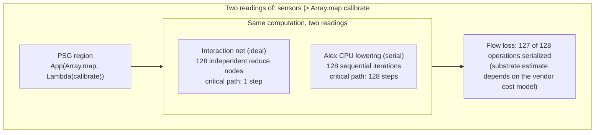

Flow loss is the data-flow parallelism a program contains that a CPU has to serialize when it runs. Because a Clef program's data-flow structure is carried directly in the graph, and the control-flow lowering to a CPU is one derived reading of it, the parallelism a control-flow architecture gives up relative to spatial hardware is a delta the graph-native representation is positioned to expose rather than something a profiler reconstructs after the fact. We have found no representative implementation of this comparison in the standing literature we have reviewed, and the reason is structural: a conventional control-flow language has to recover a data-flow graph from imperative code by heroic analysis before it can even ask the question.

In our Fidelity framework the program does not need to be recovered. Our Program Semantic Graph (PSG) carries the dependency structure directly, and for pure regions that structure lowers to an interaction net, the model where computation is local graph rewriting and independent redexes can fire at once. Two redexes in different subtrees fire together; a third opens only after one of them completes. That is the ideal parallel form. The serial form is what Alex, our Composer middle-end, emits when the same region targets a Von Neumann CPU: a single instruction stream that visits those independent operations one after another. Both forms describe the same computation. The distance between them is what we call flow loss.

## The Delta Between Two Representations

The grounds for computing the delta are already in the pipeline. Alex witnesses the PSG and selects a lowering lane per region by its effect and data-dependency shape, the same classification documented in [the DCont/Inet duality](/docs/design/concurrency/dcont-inet-duality/). A region that sequences effects threads delimited continuations; a region of independent pure work parallelizes, dense rectangular work on the tensor path and irregular reduction on interaction nets. When Alex identifies pure code, [interaction nets become the top-level representation](/docs/internals/concepts/seeking-referential-transparency/) for that region, and confluence licenses the all-at-once reading as a property of the rule system rather than an obligation each program carries.

So the ideal parallel reading and the serial CPU reading are not two separate compilations of the same source. They are two readings available within the same pipeline: the interaction-net reduction potential the PSG exposes for a pure region, and the sequential instruction stream Alex produces for the CPU target. Flow loss analysis is designed to compare those two readings and report the difference. The interaction-net representation is real for the pure lane today; the part still being built is the analysis pass that reads both and reports their delta as a metric, so the numbers below describe what that pass is designed to surface rather than output it produces in a shipping build.

## Metrics

### Parallelism Ratio

How many operations could fire at once on a data-flow fabric against how many the CPU visits in sequence. A function with two hundred independent operations collapsed onto one thread reads very differently from a function whose work is a deep dependency chain. The ratio gives a direct sense of how much a region stands to gain from spatial hardware before any code is moved.

### Critical Path Against Total Work

The longest dependency chain against the total operation count. This is the standard span-versus-work measure from parallel computing. A ratio near 1.0 means the computation is inherently sequential and little is lost to a CPU. A ratio near 0.01 means roughly ninety-nine percent of the work could run concurrently on a spatial architecture. The critical path length also sets the floor on a data-flow fabric: it is the minimum depth the computation cannot collapse, the longest chain of dependencies that has to resolve in order, which is what makes it the bridge to substrate-specific cycle estimates.

Critical-path length comes from a walk of the PSG dependency edges, where the longest chain of dependent nodes is the path. That walk is the primary mechanism, and it rests only on structure the PSG already carries. A height-typed incremental DAG, a construct we are designing as part of the broader incremental-compilation direction, would give the same figure directly without re-walking, since its height counts that same longest chain. The walk is what flow loss reads today; the typed-height shortcut is the optimization that direction would add.

### Serialization Points

Source locations where the lowering introduced an ordering the data-flow graph does not require. Each one can be annotated with the count of independent operations that were placed in sequence, which gives a concrete target for anyone restructuring a hot region for spatial hardware. These are informational, not errors. A serialization point on a CPU build is the expected outcome of running data-flow work on a control-flow machine.

### Memory Movement Overhead

Data that would stay local to a processing element on a spatial architecture but has to traverse the cache hierarchy on a CPU. The dimensional types are what would make this quantifiable: memory space and access pattern are explicit, so a streaming access that would be a zero-cost channel on a CGRA can be distinguished from a cache-dependent load on a CPU at the type level. Our coeffect system already tracks these access patterns at compile time, and the escape classification it rests on is a working compiler pass, so this metric reuses information the pipeline computes for other reasons rather than introducing a new analysis. The formalization of escape classes and their allocation strategies is described in [memory safety as coeffect algebra](/docs/internals/verification/memory-coeffect-algebra/).

### Substrate Comparison Estimates

Given a cost model for a specific architecture, the delta can be stated in concrete units rather than ratios: a subgraph that the model estimates at a few dozen reduction cycles on a spatial fabric against a few thousand instruction cycles on a CPU. The cost models come from outside our framework. A hardware vendor with a published timing model for their architecture supplies the substrate side, and the analysis is designed to map the interaction-net structure onto it. The CPU side is what Alex already emits.

The reading labelled ideal is the interaction-net potential the PSG exposes. The reading labelled serial is the instruction sequence Alex produces for a CPU. Flow loss is the gap between them, and on this region the gap is the whole width of the array.

## Where the Inputs Come From

Flow loss rests on infrastructure that partly exists and is partly designed, and the split matters for reading the metrics honestly.

- Our PSG supplies the data-flow graph: node count, edge structure, and the dependency chains the ratios are computed over. This is real and is what Alex witnesses today.
- The interaction-net representation supplies the ideal parallel reading for pure regions. The representation is real for that lane; confluence is what makes the all-at-once reading sound.
- The PSG dependency edges supply critical-path length: the longest chain through them is the path, and the walk needs nothing the graph does not already carry. A height-typed incremental DAG would supply the same figure without re-walking, but that construct is part of the incremental-compilation direction still in design, so the walk is the mechanism flow loss reads today.
- Escape analysis and our coeffect system supply the memory-movement information. Escape classification is a working pass; the broader coeffect-driven memory optimizations are still in design.
- Alex's CPU output supplies the serial instruction sequence. This is the operational native-lowering path.

The flow loss computation compares the interaction net's reduction potential against the CPU's instruction stream. Both readings live inside the same compilation pipeline, which is the property that makes the comparison a natural pipeline operation rather than a separate tool that has to rebuild the graph from machine code.

## What the Analysis Points At

The spatial hardware where the serialized parallelism would be recovered is real for two targets. Our compiler lowers natively to the FPGA through CIRCT and to the NPU through MLIR-AIE, shown in [HelloArty](https://github.com/FidelityFramework/HelloArty) and [HelloNappy](https://github.com/FidelityFramework/HelloNappy); the FPGA path is walked end to end in [FPGA and hardware inference](/blog/fpga-and-hardware-inference/), down to bit-width reduction and post-route timing. On those targets the operations a CPU sequences run in parallel across the fabric, which is the gain flow loss quantifies.

Other architectures are prospective targets the analysis is designed to inform rather than results we show. A RISC-V mesh such as Tenstorrent's Wormhole, a runtime-reconfigurable dataflow part such as NextSilicon's Maverick, and wafer-scale spatial designs such as Cerebras each exploit data-flow parallelism that a CPU serializes, and the [target-architectures compilation strategy](/docs/design/categorical-foundations/target-architectures-compilation-strategy/) sets out how their cost models would slot into the comparison. The CPU is not deficient here. It is a control-flow architecture, and the serialization cost flow loss reports is the price of running data-flow work on a machine built to step through one instruction at a time.

None of this requires the CPU to be the wrong choice. A region with a parallelism ratio near 1.0 is inherently sequential, and flow loss confirms that the CPU lowering gives up nothing. The metric is as useful for ruling spatial hardware out of a region as for arguing it in.

## A Note on Surfacing

These numbers are meant to be read where code is written. Our [Atelier workshop](/docs/tooling/atelier-the-fidelity-workshop/) is the environment that would render flow loss over the PSG view and inline at serialization points, which is its own subject; the analysis described here is the compiler capability meant to produce the numbers, independent of how any editor draws them.

The direction we are building toward is a compiler that holds the ideal parallel form and the serial lowering side by side and tells you the distance between them, so that the cost a control-flow target imposes is a figure you can read off the graph rather than a property you infer from a benchmark after the run. That comparison falls out of the graph-native representation, and extending it from the pure interaction-net lane across the rest of the lowering paths is the work we will keep building toward as the rest of the Composer compiler comes into place.
