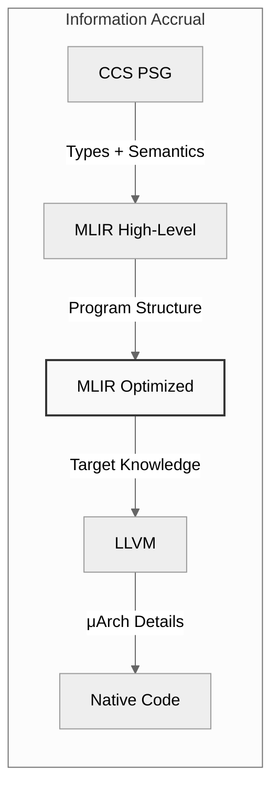
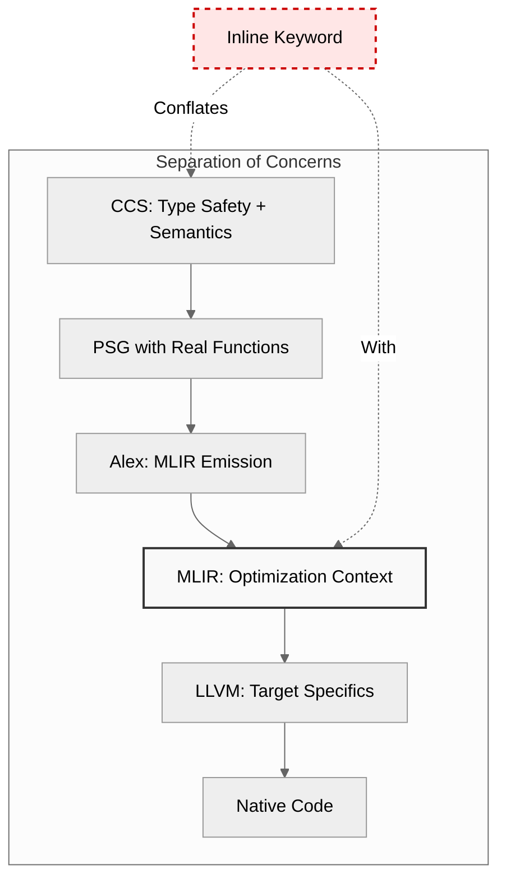

> This article was originally published on the
> [SpeakEZ Technologies blog](https://speakez.tech) as part of our early
> design work on the Fidelity Framework. It has been updated to reflect
> the Clef language naming and current project structure.

The `inline` keyword occupies a peculiar space in the programmer's toolkit. It began life as a compiler hint in C, suggesting that a function might benefit from inline expansion. Over decades, it evolved into `AggressiveInlining` in C#, a performance directive in C++, and a type system requirement in F#. Each incarnation reflects a different philosophy about who should make optimization decisions: the programmer or the compiler.

For Clef developers working with the Fidelity Framework, `inline` serves dual masters. It's mandatory for Statically Resolved Type Parameters (SRTP), enabling generic programming with duck-typed constraints. But it's also cargo-culted as a performance optimization, scattered liberally through codebases under the assumption that if `FSharp.Core` uses it, so should everyone else.

The [F# documentation warns against this pattern](https://learn.microsoft.com/en-us/dotnet/fsharp/language-reference/functions/inline-functions):

> "Overuse of inline functions can cause your code to be less resistant to changes in compiler optimizations... you should avoid using inline functions for optimization unless you have tried all other optimization techniques."

Yet the pattern persists. Why? Because the costs remain hidden in the managed runtime. Code bloat gets absorbed by the garbage collector. Compilation slowdowns become part of the background noise. Performance impacts surface only under profiling, and profiling happens rarely.

In native compilation, these costs become explicit. When targeting MLIR and LLVM without a managed runtime, every optimization decision carries weight. This is the story of how Fidelity's approach to `inline` emerged from fixing a real compiler bug, and why treating it as a semantic tool rather than a performance directive leads to better code on modern architectures.

## The .NET Inline Culture: A Hidden Tax

The F# ecosystem inherited SRTP from the ML family, where it enables powerful generic programming without runtime type information. Consider this canonical example:

```fsharp
let inline add x y = x + y
```

The signature isn't `'a -> 'b -> 'c`. It's actually `^a -> ^b -> ^c` with an implicit constraint that `^a` supports the `(+)` operator with `^b`, yielding `^c`. This flexibility enables writing generic numeric code that works across integers, floats, decimals, and any custom type implementing addition.

But here's the critical detail: SRTP only works at `inline` definitions. The type system can only resolve these constraints when it can see the concrete types at call sites. This makes `inline` mandatory for the semantics of the language, not optional for performance.

### The Documentation Says One Thing, Codebases Do Another

The official guidance is clear. [O'Reilly's "F# High Performance"](https://www.oreilly.com/library/view/f-high-performance/9781786468079/) states:

> "Making a function inline can sometimes improve performance, but that is not always the case. Therefore, you should also use performance measurements to verify that making any given function inline does in fact have a positive effect."

Yet survey any significant F# codebase and you'll find `inline` sprinkled liberally through utility functions, platform abstractions, and performance-sensitive paths. The rationale is intuitive: inlining eliminates function call overhead. The compiler expands the function body at each call site, removing the indirection.

What developers don't see:

**Code Bloat**: Every call site duplicates the entire function body in IL, increasing assembly size and degrading instruction cache locality.

**Compilation Penalties**: Heavy SRTP usage creates "significant F# compilation performance decreases" as the compiler instantiates each unique type combination.

**Debugging Nightmares**: Complete loss of source information, broken stack traces, and code coverage failures. When a function is inlined, its stack frame disappears, taking diagnostic information with it.

**Optimization Fragility**: Code becomes "less resistant to changes in compiler optimizations" because you've locked in early binding decisions that prevent later optimization passes from restructuring the computation.

In .NET, these costs get absorbed by the runtime infrastructure. The JIT might optimize some of it away. The garbage collector handles the extra allocations from closure creation. The managed heap hides the memory impact. For developers, `inline` feels free because the costs are socialized across the entire runtime.

## Fable's Struggle: When Inline Semantics Don't Transfer

The Fable compiler (F# to JavaScript) reveals just how complex inline semantics become when targeting alternative runtimes. Fable must:

1. **Serialize inline expressions** alongside compiled output because JavaScript can't distribute pure .dll files
2. **Extract witnesses** from FCS (F# Compiler Services) for SRTP constraint solutions
3. **Implement custom SRTP resolution** for incomplete witness information
4. **Couple to compiler versions** for precompiled libraries because inline semantics change across F# releases

> "Unfortunately the way to resolve SRTPs is different in Fable and the F# compiler... there are still lot of code fragments where Fable is not able to resolve trait calls."

This isn't a criticism of Fable. It's an observation about the fundamental challenge: **inline couples your compilation strategy to your execution model**. When .NET compiles F#, it has full type information, JIT compilation, and runtime reflection. When Fable targets JavaScript, it has none of these. The semantic gap makes full inline preservation intractable.

The lesson: inline isn't just a performance hint. It's deeply embedded in the architecture of the compilation pipeline and the assumptions about the target runtime.

## MLIR: A Different Foundation Changes Everything

The Fidelity Framework and its compiler don't target JavaScript or the .NET CLR. They target MLIR, which then lowers to LLVM and multiple backend architectures. This changes the entire optimization landscape.

### Block Arguments vs PHI Nodes: Structural Preservation

From the [MLIR Rationale](https://mlir.llvm.org/docs/Rationale/Rationale/):

> "MLIR uses **block arguments** instead of PHI nodes. An alternative design is to use PHI nodes in blocks (like LLVM does) but this would create complications when predecessors are unwind blocks."

This architectural choice has profound implications for how functions compile and optimize. Consider what happens in LLVM IR when you inline a function with complex control flow:

```llvm
; Complex PHI web after inlining
bb1:
  %x = phi i32 [%a, %entry], [%b, %loop]
  %y = phi i32 [%c, %entry], [%d, %loop]
  ; Inlined function body created complex PHI relationships
  ; Optimizer must reconstruct the original function structure
```

PHI nodes encode control flow merge points by listing each predecessor and its corresponding value. When you inline functions, these PHI webs become tangled, making it harder for subsequent optimization passes to understand the original semantic structure.

MLIR's block arguments preserve function call structure:

```mlir
^bb1(%x: i32, %y: i32):
  // Clean parameter passing
  // Optimizer sees the function structure clearly
```

Parameters flow through blocks naturally, maintaining the function abstraction. This means:

1. **The optimizer sees real function calls** with proper calling conventions
2. **Inlining decisions happen with full program context**, not during source compilation
3. **Cross-function optimization works naturally** because functions remain first-class in the IR
4. **Target-specific calling conventions** can be applied (CPU register passing vs GPU thread mapping)

### The Optimization Window: When More Information Means Better Decisions

Consider this simple Clef code:

```fsharp
let write (s: string) : unit =
    let _ = Sys.write STDOUT s
    ()

let main argv =
    Console.write "Hello, World!"
    0
```

If `Console.write` is marked `inline`, CCS (Clef Compiler Services) expands it during Program Semantic Graph (PSG) construction. This happens:

- Before type checking completes
- Before coeffect analysis runs
- Before MLIR sees the code
- Before the target architecture is known

The optimization decision gets made with the **least** amount of information possible.

Now consider what MLIR sees when `Console.write` is a real function:

```mlir
func.func @Console.write(%arg0: !fidelity.memref<?xi8>) {
  %stdout = arith.constant 1 : i32
  call @Sys.write(%stdout, %arg0) : (i32, !fidelity.memref<?xi8>) -> i32
  return
}

func.func @main(%argv: !fidelity.memref<?x!fidelity.memref<?xi8>>) -> i32 {
  %str = memref.get_global @str_12345 : !fidelity.memref<14xi8>
  call @Console.write(%str) : (!fidelity.memref<?xi8>) -> ()
  %c0 = arith.constant 0 : i32
  return %c0 : i32
}
```

The MLIR inliner can now:

- See that `Console.write` is a trivial wrapper around a single call
- Know that `main` is the entry point with no recursive calls
- Inline it with full context about the calling environment
- Apply target-specific optimization (inline on x86_64 for reduced overhead)
- Optimize the call chain to `Sys.write` directly

At each stage of compilation, we have **more** information:



**Early inline = optimization with minimal context.**
**Late inline = optimization with maximal context.**

## The Bug That Revealed the Architecture

This policy didn't emerge from pure design thinking. It came from fixing a real compilation failure during the memref transition, when Fidelity moved string representations from `TypeLayout.FatPointer` to `TypeLayout.Opaque`.

HelloWorld compilation failed with:

```
[ERROR] Node 478 (Literal) in SSA lookup
String literal: No SSAs assigned
```

Investigation revealed a structural problem:

1. `Console.write` was marked `inline` in the platform library
2. During PSG construction, CCS expanded `Console.write` inline at the call site
3. This created a **spurious VarRef wrapper**:
   - Parameter binding pointed directly to the Literal argument
   - `VarRef("s")` was created when the function body referenced the parameter
   - **Architecture violation**: `VarRef → Literal` (should be `VarRef → Binding`)
4. The spurious VarRef was never visited during SSA assignment traversal
5. Result: "No SSAs assigned" error

The fix was simple: remove `inline` from `Console.write`.

The insight was profound: **inline in platform libraries was creating PSG structure violations**.

This led to a broader realization. Platform libraries should use real functions unless the specification **mandates** inline for semantic reasons (SRTP or escape analysis). Let's examine both.

## Mandatory Inline Case 1: SRTP (Type System Requirement)

From the F# specification:

> "A type inference variable `^typar` [...] **unless the definition is marked `inline`**."

This is non-negotiable. Without `inline`, the compiler cannot generalize statically resolved type parameters:

```fsharp
// REQUIRED: inline for SRTP
let inline add x y = x + y  // ^a -> ^b -> ^c with (+) constraint
```

The type system needs to see the concrete types at each call site to resolve which `(+)` operator to invoke. This is **semantic inline**: the keyword changes the meaning of the program, not just its performance characteristics.

## Mandatory Inline Case 2: Escape Analysis (Memory Safety)

From the Clef specification:

> "When a function allocates memory via `NativePtr.stackalloc` and returns a pointer, the pointer becomes invalid when the function returns (the stack frame is deallocated). Marking the function `inline` causes CCS to expand the function body at the call site, **lifting the allocation to the caller's frame**."

```fsharp
// REQUIRED: inline for memory safety
let inline readln () : string =
    let buffer = NativePtr.stackalloc<byte> 256
    let len = readLineInto buffer 256
    NativeStr.fromPointer buffer len
    // Without inline: buffer is deallocated, pointer dangles
    // With inline: allocation lifted to caller's frame, pointer valid
```

This is **safety inline**: without it, you get undefined behavior. The pointer escapes the stack frame, creating a use-after-free vulnerability.

### The Long-Term Vision: Automatic Escape Detection

Currently, `inline` is required for escape analysis because CCS doesn't have automatic escape detection. The roadmap includes an EscapeAnalysis nanopass that will:

- Detect which allocations escape their scope
- Generate stack allocation for local-only variables
- Generate arena allocation for escaping references
- **Eliminate most manual `inline` for memory safety**

When this lands, developers write:

```fsharp
let mutable x = 0
```

The compiler infers whether it needs stack or arena allocation based on escape analysis. The `inline` keyword remains for SRTP only - its original semantic purpose.

For progress on this vision, see [Managed Mutability](/blog/managed-mutability/).

## Discouraged Inline: Performance Optimization

For everything else - platform libraries without SRTP, user code optimization, generic abstractions - Fidelity discourages `inline`.

### Platform Libraries: ERROR (CCS2001)

```fsharp
// ERROR: CCS2001
let inline write (s: string) : unit =
    let _ = Sys.write STDOUT s
    ()
```

Why error? Because:
- No SRTP (no `^T` type parameters)
- No stack allocation (no escape analysis requirement)
- Multi-target compilation needs real functions for MLIR optimization

**Fix**: Remove `inline`

```fsharp
// Correct
let write (s: string) : unit =
    let _ = Sys.write STDOUT s
    ()
```

### User Code Optimization: WARNING (CCS2002)

```fsharp
// WARNING: CCS2002
let inline computeIntensive x y z =
    // 50 lines of complex math
    ...
```

Why warn? Because:
- MLIR can inline this better with full context
- Code bloat and compile-time cost for unclear benefit
- Should measure performance before adding `inline`

## The Modern Alternative: Static Abstract Members

F# 7.0 introduced Static Abstract Members, which eliminate most non-safety inline needs:

### Old Pattern (SRTP + inline)

```fsharp
let inline add x y = x + y  // ^a -> ^b -> ^c

// REQUIRED: inline for generalization
// DOWNSIDE: Code duplication at every call site
```

### New Pattern (Static Abstract Members)

```fsharp
type IAddable<'T> =
    static abstract member (+) : 'T * 'T -> 'T

let add<'T when 'T :> IAddable<'T>> (x: 'T) (y: 'T) =
    'T.(+)(x, y)

// NO inline required!
// BENEFIT: Real function, MLIR can inline with context
```

### Comparison

| Feature | SRTP + inline | Static Abstract Members |
|---------|---------------|------------------------|
| Inline required | Yes | No |
| Performance | Best (fully inlined) | Excellent (may inline) |
| Code size | Larger (duplication) | Smaller |
| Recursion support | No | Yes |
| MLIR optimization | Limited | Full |
| Debugging | Poor (no frames) | Good (real functions) |

**Recommendation**: Use Static Abstract Members for generic code. Save `inline` for SRTP interop with existing libraries and escape analysis.

## The Bigger Picture: Trusting the Optimizer

There's a deeper architectural principle at work here: **separation of concerns**. Traditional systems programming conflates two fundamentally different responsibilities - ensuring programs are correct and making them fast. The `inline` keyword exemplifies this conflation, asking the compiler to make optimization decisions during the phase where it should be focused on correctness.

Consider what the compiler is actually good at. Type checking and inference happen at compile time because that's when you have access to the complete type system and can reason about type relationships. Memory safety guarantees through escape analysis similarly require understanding the full scope and lifetime of allocations. Semantic correctness - verifying that the program means what you intend - demands analyzing the complete structure before execution. The compiler's expertise lies in transforming high-level intent into correct, well-formed intermediate representation.

The optimizer operates in a different domain entirely. By the time optimization passes run, correctness has been established. Now the focus shifts to performance: making inlining decisions based on complete call graphs and actual usage patterns, eliminating dead code that provably never executes, propagating constants through the computation, and specializing for specific targets. A function that should inline on a CPU with deep pipelines might need to remain separate on a GPU where minimizing register pressure matters more. These decisions require information the compiler simply doesn't have during initial compilation.

The `inline` keyword forces the compiler to make optimization decisions prematurely. You're asking it to inline code before it knows whether that function gets called once or ten thousand times, before it knows the target architecture's cache characteristics, before it can see the full program structure that might enable better optimizations. It's asking the wrong component to make the decision at the wrong time.

MLIR's architecture deliberately separates these concerns:



At each stage of this pipeline, the intermediate representation accumulates information that makes optimization decisions progressively better. When CCS constructs the Program Semantic Graph, it's focused on preserving Clef's semantics - currying, pattern matching, type inference. It has no idea whether you're targeting an x86_64 server, an ARM mobile device, or a GPU compute kernel. Making inlining decisions at this stage means committing to a strategy before knowing the battlefield.

Alex witnesses the PSG and emits MLIR, but it still operates without complete context. It can see individual functions and their immediate call relationships, but it doesn't know whether this particular function sits in a hot loop that gets called millions of times or appears in error handling code that rarely executes. The calling patterns that determine optimal inlining strategy remain opaque.

By the time MLIR's optimization passes run, the picture clarifies dramatically. The optimizer sees the complete program structure, understands call frequencies through profiling information, and knows the target architecture. It can make informed tradeoffs: inline this small function because it's called in a tight loop, but keep that larger function separate because it's rarely used and inlining would bloat the instruction cache.

LLVM's backend optimization goes further still, with detailed knowledge of the target microarchitecture. It knows cache line sizes, pipeline depths, branch predictor characteristics, and SIMD instruction availability. The optimization decisions at this level can be exquisitely tuned to the specific CPU model, not just the general architecture family.

This progression reveals the fundamental question: **why would you inline at CCS level** when MLIR has exponentially more information to work with?

## The Mathematical Insight: Optimization Windows

Let \(I\) represent the information available for optimization decisions, and \(Q\) represent the quality of optimization decisions. The relationship is not linear:

$$Q(I) = \log(1 + I)$$

Early optimization with minimal context \((I_{early} \approx 0)\) yields:

$$Q(I_{early}) = \log(1 + 0) = 0$$

Late optimization with full context \((I_{late} \gg I_{early})\) yields:

$$Q(I_{late}) = \log(1 + I_{late})$$

The delta in decision quality grows logarithmically with additional information:

$$\Delta Q = Q(I_{late}) - Q(I_{early}) = \log(1 + I_{late})$$

This formalizes the intuition: **optimization decisions improve dramatically when you defer them until more information is available**.

## The Policy in Practice: Diagnostic Codes

Fidelity implements this policy through analyzer diagnostics:

### Decision Matrix

| Use Case | Policy | Diagnostic | Rationale |
|----------|--------|------------|-----------|
| Generic math with `^T` | Allow | None | SRTP mandatory (spec) |
| Stack alloc + pointer return | Allow | None | Escape analysis mandatory (spec) |
| Platform lib without mandatory | Error | CCS2001 | Multi-target architecture |
| User optimization | Warning | CCS2002 | MLIR optimization preferred |
| Static Abstract Members | Prefer | None | F# 7+ pattern, no inline needed |

### Quick Fix Suggestions

For CCS2002 warnings, the analyzer suggests refactoring to Static Abstract Members:

```fsharp
// Before (warning)
let inline compute x y = x * x + y * y

// Suggested fix
type IComputable<'T> =
    static abstract member (*) : 'T * 'T -> 'T
    static abstract member (+) : 'T * 'T -> 'T

let compute<'T when 'T :> IComputable<'T>> (x: 'T) (y: 'T) =
    'T.(+)('T.(*)(x, x), 'T.(*)(y, y))
```

## Multi-Target Flexibility: Why Real Functions Matter

One of Fidelity's design goals is targeting diverse hardware: CPUs, GPUs, TPUs, NPUs, and microcontrollers. Each platform has radically different optimization profiles:

**CPU**: Preserve stack frames for debugging, moderate inlining for instruction cache

**GPU**: Aggressive inlining to minimize divergence across thread warps, eliminate function call overhead in kernels

**TPU**: Preserve functions for operator fusion, let the XLA compiler handle specialization

**Microcontroller**: Balance code size (flash is limited) against speed (no instruction cache)

When you use `inline` in Clef source, you're making the inlining decision **before knowing the target**. MLIR's multi-level IR allows each backend to make optimal choices:

```mlir
// High-level MLIR (target-agnostic)
func.func @process(%data: memref<?xf32>) {
  call @transform(%data) : (memref<?xf32>) -> ()
  return
}

// CPU backend: might preserve function call
// GPU backend: likely inlines into kernel
// μC backend: decides based on code size constraints
```

Real functions in MLIR preserve **optimization flexibility** across targets. Early inlining in Clef source **commits** to a single strategy for all platforms.

## Lessons from the Research

The journey to this policy involved extensive research into .NET patterns, Fable's challenges, OCaml's arity handling, and MLIR's optimization architecture.

> ***Getting*** inline - truly understanding ***when*** and ***why*** to use the keyword - requires recognizing what the Fidelity Framework and its compiler are optimizing for.

It's not .NET's managed heap and JIT compilation. It's not JavaScript's dynamic runtime. It's MLIR's multi-target compilation with block arguments and deferred optimization.

The architectural choice is deliberate: real functions in the PSG, witnessed as `func.func` and `func.call` in MLIR, optimized by backends with full program context. When SRTP requires `inline` for type system correctness, we use it. When escape analysis requires it for memory safety, we use it. Everything else takes advantage of the full gamut that MLIR offers.

The CCS2001 error for platform libraries isn't bureaucracy. It's preventing the PSG structure violations we encountered during the memref transition, where premature inlining created spurious VarRef wrappers that broke SSA assignment. The fix wasn't to patch around inline. It was to remove inline and let the architecture work as designed.

The CCS2002 warning for user code optimization is an invitation to understand the compilation model. You're not targeting a JIT that needs hints about hot paths. You're targeting an optimizer that sees megabytes of IR, knows your hardware architecture, and can make inlining decisions based on actual call graphs and target constraints. For generic code, simply using static abstract members will go a long way toward avoiding unnecessary inline dependencies.

Fidelity's path forward treats `inline` as a semantic tool for type system requirements and memory safety, nothing more. The compiler ensures correctness. The optimizer handles performance. Understanding this separation - *getting* inline - means writing Clef that compiles to efficient native code across CPUs, GPUs, and microcontrollers without compromising the expressiveness that makes concurrent functional programming so incredibly powerful.

---

## Related Reading

### Clef Design Series

- [Arity On The Side of Caution](/docs/design/arity-on-the-side-of-caution/) - How Fidelity tracks function arity for native compilation
- [Baker: Saturation Engine](/docs/design/baker-saturation-engine/) - Saturation engine for expanding high-level constructs

### External References

- [F# Inline Functions - Microsoft Learn](https://learn.microsoft.com/en-us/dotnet/fsharp/language-reference/functions/inline-functions)
- [F# Static Abstract Members - Microsoft Learn](https://learn.microsoft.com/en-us/dotnet/fsharp/whats-new/fsharp-7#static-abstract-members)
- [MLIR Rationale](https://mlir.llvm.org/docs/Rationale/Rationale/)
- [Fable Compiler](https://fable.io/)

---

*This policy emerged from real compiler development - fixing a bug during the memref transition led to fundamental insights about inline semantics, MLIR optimization, and multi-target compilation. Sometimes the best architectural decisions come not from first principles, but from solving concrete problems and generalizing the lessons learned.*
