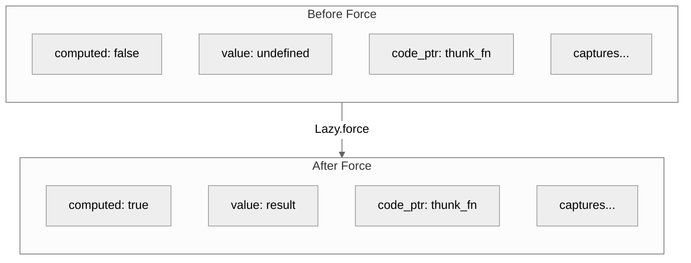
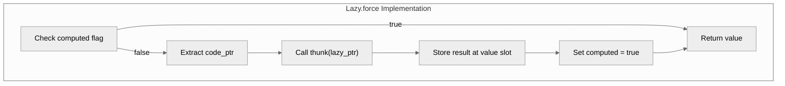

> This article was originally published on the
> [SpeakEZ Technologies blog](https://speakez.tech) as part of our early
> design work on the Fidelity Framework. It has been updated to reflect
> the Clef language naming and current project structure.

There are only two hard things in computer science: cache invalidation and naming things. Phil Karlton's quip has aged well, but the functional programming community might add a corollary: sometimes the name we pick makes things harder than they need to be.

Consider "lazy evaluation." Henderson and Morris coined the term in their [1976 POPL paper](https://dl.acm.org/citation.cfm?id=811543), and it stuck. But "lazy" may be the least apt term in computing. A lazy evaluator isn't lounging around avoiding work; it's *poised*, ready to spring into action the instant a value is demanded. "Call-by-need" captures this better: computation happens precisely when needed, not before, not after. The lazy evaluator is the most *attentive* mechanism imaginable, tracking exactly which expressions remain unevaluated and responding immediately when circumstances change. That we named this disciplined, demand-driven approach after a vice rather than a virtue tells you something about how we think about work.

The irony deepens when you consider that Haskell, the language that made laziness famous, is named after Haskell Curry, a mathematician whose prodigious output in combinatory logic was anything but lazy. The [History of Haskell](https://www.microsoft.com/en-us/research/wp-content/uploads/2016/07/history.pdf) paper is even titled "Being Lazy with Class," a pun that works on multiple levels.

But this isn't mere wordplay. How you choose to be lazy has profound implications for the work you can get done with a computer. Lazy evaluation enables infinite data structures, separates the *description* of computation from its *execution*, and lets you express algorithms that would otherwise require careful manual orchestration. Get it right, and your code becomes more expressive, more composable, more amenable to optimization. Get it wrong, and you're debugging space leaks at 2 AM wondering why your "efficient" program just consumed all available memory.

Haskell makes laziness seem like an easy choice. Every expression is deferred until needed, memoized automatically, and the programmer writes code as though evaluation order does not matter. This simplicity hides a sophisticated runtime system that manages thunk allocation, blackholing to prevent re-entry, and garbage collection of evaluation chains. Scala offers `lazy val` with similar ergonomics but different tradeoffs. C++ provides `std::function` and manual thunks. Rust developers reach for `OnceCell` or `Lazy<T>` from external crates. Each approach reflects choices about when computation happens, where deferred values live in memory, and what the cost model looks like.

> And those choices are ***never*** free.

Deferring computation means the computation must be *represented*: closures allocated, pointers followed, cache lines loaded when the bill comes due. A system optimized for lazy evaluation shifts pressure from compute and memory capacity toward memory bandwidth and cache coherence. Whether that trade favors your workload depends on access patterns that a language specification will not likely discuss.

The .NET implementation of F# occupies an interesting position in this landscape. It provides `Lazy<'T>` as a library type backed by the .NET runtime. You write `lazy expr` and receive a thunk that the garbage collector manages. Forcing the value is thread-safe. Memoization happens automatically. The API is clean, the semantics are well-defined, and the implementation benefits from decades of runtime engineering.

The question for native compilation is direct: how do you preserve these semantics without a garbage collector, without runtime thread synchronization primitives, without the machinery that makes managed lazy evaluation work transparently?

## The Anatomy of a Thunk

Before examining implementation strategies, we should be precise about what lazy evaluation requires. A thunk is a suspended computation: code that will produce a value when demanded but has not yet executed. The thunk must capture any variables from its defining environment that the computation will need. When forced, the thunk executes once, produces its result, and (in memoizing implementations) stores that result for subsequent accesses.

This description reveals three distinct concerns:

**Closure capture**: The thunk is fundamentally a closure. It closes over variables from its environment. Everything we explored in [Gaining Closure](/docs/design/gaining-closure/) about flat closures, capture semantics, and memory safety applies directly.

**Deferred execution**: Unlike an ordinary closure that executes when called, a thunk execution is controlled by a forcing operation. The thunk must know whether it has been evaluated.

**Memoization state**: For thunks that memoize, the structure must hold both the computation and its eventual result. The representation changes from "unevaluated code with captures" to "evaluated value."



## The Language Spectrum

Different languages make different choices about these concerns. Understanding the spectrum clarifies what Fidelity's approach optimizes for.

### Haskell: Pervasive Laziness

Haskell commits fully to lazy evaluation. Every binding is potentially a thunk. The runtime manages a heap of thunks with sophisticated support for garbage collection of evaluation chains, blackholing to handle recursive thunks safely, and selector thunks that avoid space leaks in pattern matching.

This pervasive laziness enables consistent expression of 'infinite' data structures, demand-driven computation, and separation of concerns between producing and consuming values. The cost is runtime complexity: the GHC runtime is substantial, and reasoning about space behavior requires understanding evaluation order.

For developers comfortable with lazy semantics, Haskell provides a succinct experience. The language does not distinguish between lazy and strict evaluation at the type level; everything is lazy by default, with explicit strictness annotations where needed.

### Scala: Explicit Lazy Vals

Scala takes a more selective approach. Expressions are strict by default; laziness is opt-in through `lazy val`. The JVM runtime provides thread safety and garbage collection, but the programmer chooses where deferred evaluation applies.

```scala
lazy val expensive: Int = {
  println("Computing...")
  42
}
```

This explicitness has pedagogical value. Developers know which computations are deferred because they marked them as such. The cost is verbosity when lazy semantics are actually wanted pervasively.

### Rust: Library-Level Laziness

Rust provides no built-in lazy evaluation. Developers use library types like `once_cell::Lazy` or the standard library's `OnceLock` (stabilized in Rust 1.70). These types handle thread synchronization and ensure single initialization, but memory management follows Rust's ownership rules.

```rust
use once_cell::sync::Lazy;

static EXPENSIVE: Lazy<i32> = Lazy::new(|| {
    println!("Computing...");
    42
});
```

The Rust approach prioritizes zero-cost abstractions and explicit control. Lazy values are possible but not privileged. The developer sees exactly what synchronization and allocation occur.

### F# (.NET): Runtime-Backed Laziness

F# provides `Lazy<'T>` through .NET's `System.Lazy<T>`. The syntax is clean:

```fsharp
let expensive = lazy (
    printfn "Computing..."
    42
)
```

Forcing uses `Lazy.force expensive` or `expensive.Value`. Thread safety is configurable. Memoization is automatic. The garbage collector handles memory.

This works well in the .NET ecosystem. For native compilation, every aspect of this implementation becomes a question: Where does the thunk live? What ensures thread safety? How is memoization state represented?

## Fidelity's Approach: Extended Flat Closures

Our implementation builds directly on the flat closure architecture described in [Gaining Closure](/docs/design/gaining-closure/), itself an extension of techniques pioneered in Standard ML compilers. A lazy value is a flat closure with additional fields for memoization state.

| Lazy<T> | | | | |
|:---:|:---:|:---:|:---:|:---:|
| computed: i1 | value: T | code_ptr: ptr | cap_0 | cap_1 ... |
| [0] | [1] | [2] | [3] | [4] |

The structure is self-contained. No pointers to outer environments. No heap allocation beyond the lazy value itself. No garbage collector involvement.

### The Thunk Calling Convention

When the thunk executes, it receives a pointer to the full lazy struct. This design decision deserves explanation.

An alternative would pass captured values as function parameters. The thunk would have signature `(cap_0, cap_1, ...) -> T`, and the forcing code would extract captures and pass them. This works but creates complexity at call sites: the caller must know how many captures exist and their types.

Instead, Fidelity's thunks have uniform signature `(ptr<Lazy>) -> T`. The thunk receives a pointer to its containing structure and extracts its own captures at known offsets. The forcing code is simple: extract the code pointer, call it with the struct pointer, store the result.



### Capture Analysis: The Subtle Challenge

A lazy expression may reference variables from multiple scopes: local bindings, function parameters, module-level definitions.

> The most technically demanding aspect of lazy implementation is not the runtime mechanics but the compile-time analysis that determines what to capture.

Consider:

```fsharp
let sideEffect msg = Console.writeln msg

let lazyAdd a b = lazy (sideEffect "Computing..."; a + b)
```

What should the lazy expression capture? The parameters `a` and `b` must be captured; they are local to `lazyAdd` and will not exist when the thunk eventually executes. But `sideEffect` is a module-level function; it has a stable address and should be referenced directly, not captured.

This distinction is crucial. Capturing module-level bindings would:
- Increase closure size unnecessarily
- Create type mismatches when the captured representation differs from the reference representation
- Potentially cause semantic errors if the capture mechanism assumes certain properties

The Fidelity compiler performs binding classification during semantic analysis. Each binding carries metadata indicating whether it was defined at module scope or within a function body. Capture analysis consults this metadata and excludes module-level bindings from the capture set.

```fsharp
// In capture analysis:
if binding.IsModuleLevel then
    None  // Reference by address, not capture
else
    Some { Name = name; Type = binding.Type; ... }
```

This analysis happens upstream in CCS (Clef Compiler Services), not downstream in code generation. By the time Alex generates MLIR, the semantic graph contains definitive capture information. There is no guessing, no heuristics, no runtime discovery.

## The Coeffect Model

Fidelity's compiler architecture separates analysis from generation. We explored this in [Gaining Closure](/docs/design/gaining-closure/) as the "photographer principle": coeffects are computed before code generation begins; witnesses observe these coeffects during MLIR emission.

For lazy values, the coeffect is `LazyLayout`: a pre-computed structure describing everything about a specific lazy expression's representation.

```fsharp
type LazyLayout = {
    LazyNodeId: NodeId
    CaptureCount: int
    Captures: CaptureSlot list
    LazyStructType: MLIRType  // { i1, T, ptr, cap_0, cap_1, ... }
    ElementType: MLIRType     // T
    // ... SSA slots for construction ...
}
```

When the zipper encounters a lazy expression during code generation, it looks up the `LazyLayout` and emits exactly the operations that layout specifies. No dynamic analysis, no conditional logic based on expression structure, no special cases.

This separation has practical benefits beyond architectural cleanliness. Different optimization passes can reason about lazy layouts without understanding MLIR emission. Testing can verify layout computation independently. The compiler stages compose cleanly.

## Memoization: Current and Future

The current Fidelity implementation provides pure thunk semantics: forcing a lazy value always executes the computation. This is semantically correct for pure computations; if the function has no side effects, executing it multiple times produces the same result.

```fsharp
let expensive = lazy (
    Console.writeln "Computing..."  // Side effect
    42
)

let v1 = Lazy.force expensive  // Prints "Computing..."
let v2 = Lazy.force expensive  // Prints "Computing..." again
```

True memoization, where the result is computed once and cached, requires mutation of the lazy struct. The `computed` flag must transition from false to true; the `value` slot must store the result. In a single-threaded context, this is straightforward. With concurrency, it requires synchronization.

Our roadmap includes memoizing lazy values once the arena-based memory model is complete. Arena allocation provides the stable memory locations that memoization requires; the lazy struct lives in the arena and can be mutated safely. Thread synchronization will use compare-and-swap operations similar to what .NET's `Lazy<T>` employs.

For now, the pure thunk semantics validate the architecture. Memoization is an optimization that builds on correct foundations.

## SSA Complexity: The Real Work

Much of the implementation challenge lies not in the conceptual model but in the SSA (Static Single Assignment) accounting. Creating a lazy value requires multiple MLIR operations:

1. Allocate an undefined struct of the appropriate type
2. Insert the `false` constant at the computed slot
3. Insert the address of the thunk function at the code pointer slot
4. Insert each captured value at its slot
5. The result is the fully initialized lazy struct

Each step produces an SSA value. The final insert operation produces the lazy struct that subsequent code references. This chain must be computed before code generation begins so that dependent operations know which SSA identifier to reference.

The Fidelity approach computes all SSA assignments in a dedicated nanopass. Lazy expressions receive SSA slots for each construction step. Thunk bodies receive SSA slots for extracting captures from the struct pointer. Force operations receive SSA slots for the result value. Everything is determined before the zipper begins its traversal.

This is not glamorous work. It is bookkeeping at scale. But it is the bookkeeping that enables clean code generation: the witness layer observes pre-computed coeffects and emits operations without runtime decisions.

## The Developer Experience

From the F# developer's perspective, lazy evaluation in Fidelity looks familiar:

```fsharp
let simple = lazy 42
let v1 = Lazy.force simple  // 42

let x = 10
let y = 20
let sum = lazy (x + y)
let v2 = Lazy.force sum  // 30

let lazyAdd a b = lazy (a + b)
let result = lazyAdd 15 25
let v3 = Lazy.force result  // 40
```

The syntax is standard F#. The semantics match expectations. What differs is entirely beneath the surface: stack-allocated flat closures, explicit capture analysis, deterministic memory layout, no runtime dependencies.

This continuity is intentional. Fidelity preserves F# idioms at the source level while providing native semantics at the binary level. A developer familiar with F# lazy evaluation can write the same patterns; the compiler handles the translation.

## Building Blocks for Sequences

Lazy evaluation is not an isolated feature. It is infrastructure for higher-level abstractions.

F# sequences (`seq { }`) are fundamentally lazy. They produce values on demand, maintain state between iterations, and compose through operations like `map`, `filter`, and `take`. Under the hood, sequences are state machines that yield values one at a time.

Our implementation of sequences will build on the lazy machinery established here. The flat closure architecture handles captured state. The coeffect model handles layout computation. The thunk calling convention handles deferred execution. Sequences add iteration control on top of these foundations.

Similarly, asynchronous workflows involve suspended computations that resume when results are available. The LLVM coroutine infrastructure we plan to leverage shares conceptual territory with thunks: code that pauses and resumes, with state preserved across suspension points.

The lazy implementation validates architectural choices that these more complex features will depend on.

## Performance Characteristics

Fidelity's lazy values have predictable performance characteristics:

| Operation | Cost |
|-----------|------|
| Creating a lazy value | Stack allocation + N field writes (N = capture count) |
| First force (non-memoizing) | Indirect call + capture extraction |
| Subsequent forces (non-memoizing) | Same as first force |
| Memory per lazy value | sizeof(i1) + sizeof(T) + sizeof(ptr) + captures |

There is no heap allocation, no garbage collector involvement, no synchronization overhead in the current implementation. The closure is flat; access is direct. The thunk call is indirect (through the code pointer) but predictable.

Compare with managed lazy evaluation, where creating a lazy value may allocate a heap object, forcing may involve thread synchronization, and memory pressure depends on GC behavior. The Fidelity approach trades some runtime sophistication for predictability.

For systems programming contexts, embedded targets, and performance-sensitive applications, this predictability has value. You can reason about the cost of lazy evaluation without carrying the "belt and suspenders" cognitive burden of a managed runtime system. You only "pay" for what you use.
## Related Work

The implementation draws from several research traditions:

The MLKit compiler's treatment of closures and region-based memory management informed our flat closure approach. Tofte and Birkedal's work on region inference demonstrates that sophisticated memory management is possible without garbage collection for a significant class of programs.

GHC's thunk representation influenced our understanding of lazy evaluation challenges. The [GHC Commentary on Evaluation](https://gitlab.haskell.org/ghc/ghc/-/wikis/commentary/rts/storage/heap-objects) provides detailed documentation of how a production lazy language handles thunks at scale.

Standard ML of New Jersey's closure conversion, documented in Appel's "Compiling with Continuations," establishes the foundations for flat closure representations that Fidelity builds upon.

## A Foundation, Not a Destination

Lazy evaluation in Fidelity is not a checkbox feature added for completeness. It is infrastructure that validates architectural decisions and enables future capabilities. The flat closure model scales. The coeffect approach composes. The SSA discipline holds.

When sequences arrive, they will build on this foundation. When async workflows arrive, they will build on this foundation. The patterns established here, capture analysis, layout computation, uniform calling conventions, repeat throughout the Fidelity framework.

Making lazy work is hard. Making it work without a runtime is harder. Making it compose with everything else the compiler must do is the real challenge. That composition is what the Fidelity architecture was designed to target from day one.

## Related Reading

For more on the Fidelity framework and native Clef compilation:

- [Gaining Closure](/docs/design/gaining-closure/) - MLKit-style flat closures in Fidelity
- [From IL to NTU](/docs/design/il-to-ntu/) - The Native Type Universe architecture
- [The Return of the Compiler](https://speakez.tech/blog/the-return-of-the-compiler/) - Why managed runtimes face architectural limits
- [Why Clef Fits MLIR](/docs/design/why-clef-fits-mlir/) - SSA form and functional compilation
- [Absorbing Alloy](/docs/design/absorbing-alloy/) - The native standard library comes home
