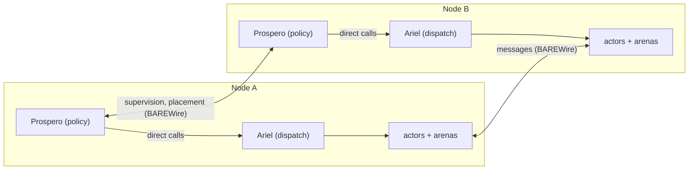

Our actor system has gone by two names for some time. Olivier is the actor runtime, and defines what an actor is. Prospero is the supervisor, and decides what should happen: restart strategies, arena lifecycles, placement. The component that makes those decisions happen in time, the one that selects which ready actor runs next and delivers each resume, has until now been billed as part of Prospero. The billing was accurate as far as it went: modes of scheduling, how dispatch is provided per target, vary independently of anything the actor model assumes. On that recognition we moved the component to formal standing, with its own name, Ariel, and its own contract in the specification: the [Scheduler Contract](/spec/draft/scheduler-contract/).
The one-sentence version of the constellation: Olivier defines what an actor is, Prospero decides what should happen, and Ariel makes it happen in time.

## Why the Scheduler Earns a Name

Our compiler work already decides most of what a scheduler in other systems has to discover at runtime. [Region classification](/docs/design/concurrency/dcont-inet-duality/) determines what can run in parallel. Escape analysis determines where values live. The [wait classification](/spec/draft/synchronous-rpc-liveness/) determines which calls suspend and which do not. All of that is eligibility, and eligibility is derivable from program structure. Order under scarcity is a different question. Which ready actor runs next, what happens at saturation, whose delivery is admitted when capacity is tight: these decisions depend on runtime facts no compile-time analysis sees.

For a while our working assumption was that the scheduler would fall out of that principled structure, and on the smallest target it nearly does. The [DCont representation](/spec/draft/dcont-representation/) establishes that on a single-core freestanding target the suspend/resume semantics become the cooperative scheduler, with resume as the scheduling event and the interrupt-to-continuation binding as dispatch. Obligations changed our position. Three now point at the scheduler by name:

1. The [deadlock-freedom obligation](/docs/design/concurrency/deadlock-freedom-as-an-obligation/) discharges acyclicity of the wait-for relation as a Tier 2 rank constraint. Acyclicity rules out the cycle. Turning "no cycle" into "the reply arrives" requires fairness, which is a premise about dispatch. A premise in a discharge must cite a named contract, and "whatever fell out of the structure" is not citable.
2. Supervision must keep working at saturation. A restart that competes with the traffic jam it is meant to clear is a restart that fails exactly when it is needed. That is a capacity-separation property of dispatch, and [Weaving the Braid](/blog/weaving-the-braid/) already hinted at its native realization: Prospero on an elevated thread.
3. Deterministic simulation, the replay discipline that makes an actor system testable seed-for-seed, is a property of whoever interprets suspension and resumption. That interpreter is the scheduler.

Three obligations, one unnamed component. Prospero became a real component in our design history by the same route, when we assigned it sentinels and lifetime management. The scheduler has now crossed that threshold, and earns the standing that comes with it.

The boundary sits where the premise dependency runs. Prospero's guarantees, supervision under load and deterministic reclamation among them, are theorems whose premises are fairness, turn atomicity, and control-plane capacity. Those premises are Ariel's contract. The provider of premises and its most demanding client belong on opposite sides of a specification boundary, so the earlier framing in [RAII in Olivier and Prospero](/docs/design/memory/raii-in-olivier-and-prospero/), that Prospero serves as more than a scheduler, still stands, and the scheduler beneath it is now bound by its own contract.

One more rule comes from the same place the names do. In the play, Ariel acts only on Prospero's instruction and is visible to no one else on the island. As architecture: no user-facing API. Actors never address the scheduler. Its clients are Prospero and our Composer compiler, and the contract makes that normative.

## The Six Clauses

The [Scheduler Contract](/spec/draft/scheduler-contract/) states the normative text. In brief:

1. **Fairness.** Every ready actor is dispatched within a finite number of scheduling events. This is the premise the deadlock discharge would utilize.
2. **Turn discipline.** A turn, one resume to the next suspension, runs to completion. A turn budget may apply, and exhausting it is a fault escalated to Prospero, never a scheduling event. Preemption in this system belongs above the turn, at actor-lifecycle granularity, as supervision policy.
3. **Control-plane immunity.** Supervision, timers, and reference-state maintenance stay executable when every bounded data-plane resource is exhausted.
4. **Admission.** Delivery is accepted or refused, refusals are observable, and a receiver's backpressure never becomes growth in the sender's memory.
5. **Determinism mode.** The scheduler interprets suspension and resumption, so a conforming implementation may substitute its sources of time, completion, and arrival. Scripted sources give a simulated implementation, which doubles as the conformance harness and the replay mechanism.
6. **Assumption manifest and authority.** Each implementation publishes which clauses it discharges itself and which it assumes from its substrate, along with its authority position.

One further reading of the contract comes from outside the Erlang and Akka traditions that supplied the actor vocabulary. The [Three-Layer Actor Contract](/docs/design/concurrency/the-three-layer-actor-contract/) calls the wait-for edge the projection of the session edge onto the liveness question, and the same shape holds one axis over. The pure fraction of an actor system is its behaviors, pure functions from state and message to effects, and that fraction projects onto a runtime incremental graph. Actor state is a memoized node value, message receipt is an input change, and the articulation of actor references is the dependency structure. Our [incremental computation](/spec/draft/incremental-computation/) spec already places demand registration for actor-based nodes with Prospero, and the determinism clause admits a stabilization pass in dependency order as a conforming dispatch discipline. The projection yields two resources with no seat in any mailbox tradition: demand, under which an effect-free actor nobody observes is never dispatched, and cutoff, under which an unchanged derived state wakes no dependents. The proposed `Dormant` state reads naturally under the same projection, since hydration is a memo restore and restart is invalidation followed by recompute.

## One Contract Over Many Assumption Sets

Implementations of the contract differ by how much of it they must discharge themselves, and multi-targeting the scheduler is a matter of tracking that difference. The freestanding profile, the [pure-Clef unikernel](/docs/internals/hardware/fidelity-on-mcu/) our Post-Quantum Credential work targets at the reset vector, assumes nearly nothing: a hardware timer and interrupt delivery. Every other clause it discharges itself, which is why it is the profile where the contract is auditable end to end, a property the credential's trusted-computing-base argument depends on. On a single-core target the elevated-thread framing raises a concrete question: with one hardware thread, what does Prospero elevate onto? The elevation is the interrupt controller's. Ariel's dispatch loop runs in Thread mode as the lowered continuation surface, and the control plane runs in Handler mode at reserved exception priorities. There the timer tier enforces turn budgets and expires supervised timeouts, and the fault handlers provide last-resort recovery. The Cortex-M33 sharpens the separation in hardware, with distinct stack pointers for the two modes and stack-limit registers standing in for the guard pages an MMU-less part cannot have. Recovery from a turn that exhausts its budget is deterministic for a memory-model reason: a turn's allocations are already escape-classified, so discarding it is a stack reset plus an arena release, with no unwinding pass. Little of the classic deadlock question remains at this tier, because the acyclicity obligation discharges before the image exists. The runtime tier owns budget enforcement and the supervised timeouts of the `Unresolved` residue. One ordering obligation follows, stated in the contract in the same witness style as the clock bring-up in [Fidelity on MCU](/docs/internals/hardware/fidelity-on-mcu/): the control-plane tier is armed before the first turn dispatches. No turn before the watchdog. This is the single-core notch point of the same programming model our [unikernel entry](/blog/getting-to-the-heart-of-unikernels/) places on one spectrum with the eight-core container build.

A microVM profile assumes vCPU progress against a quota it can name from the deployment specification. A container profile makes the same assumption about carrier-thread progress, against a budget it can only observe. At the hosted tier, fairness is inherited wholesale from the OS or managed runtime, with ordering and admission provided above it. The simulated profile assumes nothing and scripts everything.

The trusted-base table in [Weaving the Braid](/blog/weaving-the-braid/) laid these assumptions out per target before the component had a name. The assumption manifest is that table made a published artifact, one per implementation, and our Composer is being designed to emit the companion capacity manifest a freestanding image provisions from, so the mailbox depths and pool sizes in a boot image derive from escape classification and arena extents rather than developer guesses.

In our current design thinking the manifest is an ordinary Clef value. Its map carries the four dispatch clauses the contract's profile table partitions. Determinism mode is a matter of which sources an implementation interprets, which the profile field already names, and the sixth clause is this record itself. The exposure axis is expressed by which clauses read `Discharged` and which read `Assumed`:

```fsharp
type ClauseId =                     // the four dispatch clauses the manifest partitions
    | Fairness                      // §3: a ready actor is dispatched within finitely many events
    | TurnDiscipline                // §4: turns run to completion; budget exhaustion is a fault
    | ControlPlaneImmunity          // §5: supervision stays executable at saturation
    | Admission                     // §6: accept or refuse; refusal is observable

type Discharge =
    | Discharged                    // this implementation discharges the clause itself
    | Assumed of substrate: string  // discharged by the substrate this string names

type Profile   = Freestanding | MicroVm | Container | Hosted | Simulated
type Authority = Sovereign | Federated | Replicated

type AssumptionManifest = {
    Profile:   Profile
    Authority: Authority
    Clauses:   Map<ClauseId, Discharge>
}

// assumed beneath the clauses: a hardware timer, interrupt delivery
let freestanding = {
    Profile   = Freestanding
    Authority = Sovereign
    Clauses   =
        [ Fairness,             Discharged   // the interrupt-to-continuation binding is dispatch
          TurnDiscipline,       Discharged
          ControlPlaneImmunity, Discharged   // Handler mode, armed before the first turn
          Admission,            Discharged ] // capacities from the compiler's manifest
        |> Map.ofList
}
```

A hosted instance of the same type would read `Fairness, Assumed "the OS scheduler"`, and the difference between those two values is the difference between an auditable trusted base and a borrowed one.

## Dispatch Never Crosses a Latency Domain

Authority is the second axis, and one rule bounds it: a turn-granularity dispatch decision never crosses a latency domain. Within one domain, a package directing an accelerator fabric or a performance-core cluster directing an efficiency-core cluster, federation is legitimate and asymmetric. The parent grants a budget and a region and holds the subordinate to the same contract it answers to itself. Federation is contract recursion. The parent never dispatches the subordinate's turns, and the schedulers coordinate over BAREWire through ordinary structured messages on the type-informed fabric, because a privileged channel between schedulers would breach shared-nothing at the layer that enforces it.

Across a distribution boundary the scheduler replicates rather than spans. Each node runs a sovereign Ariel, and what crosses the wire is supervision and placement, Prospero's concerns, handled with deadlines and escalation in the same posture as the `Unresolved` wait class:



No edge connects A1 to A2.

## Preemption Above the Turn

The system's concurrency character follows from turn discipline: optimistic and cooperative below the turn, preemptive above it. Within a turn nothing interrupts an actor, and the single-logical-thread guarantee rests on that. Above the turn, Prospero keeps the remedies, and they operate at lifecycle granularity: retire the actor, release its arena as a unit, restart from known state. The actor-reference sentinel makes lifecycle-granularity preemption safe to perform. A reference into a retired actor reads `ActorTerminated` rather than dangling, so any holder of the reference observes the death instead of corrupting through it. The reference states our design documents give the sentinel are `Valid`, `ActorTerminated`, `ProcessUnavailable`, and `Unknown`.

## Accountability Replaces Meta-Supervision

One question follows every supervision tree: who watches the watchers? The contract's answer splits watching into two roles that the regress conflates. Enforcement escalates strictly outward, from the timer tier through the supervision tree to a terminus that is never software: the hardware watchdog on the freestanding profile, armed before the first turn, or the substrate's supervisor on hosted profiles. Recording needs no watcher at all. Ariel and the control plane write into a bounded flight-recorder ring, wait-free and outside the message fabric, so observation is never load, and a non-authoritative telemetry actor drains the ring as an ordinary demand-driven node: unobserved, it is never dispatched; dead, it costs visibility and nothing else. A last-words region survives reset so that bring-up reads the record of the previous run before the tree is armed. Durable persistence beyond that region belongs to our [Modular Blob Storage](/spec/draft/modular-blob-storage/) abstraction, so the scheduler contract holds no storage commitments of its own. On the credential device, a fault record sealed into an MBS slot is testimony with the same atomicity and custody properties as the identities the store exists to hold.

## The Dormant Frontier

A fifth reference state is proposed in an informative section of the contract: `Dormant`, an actor whose identity is current and whose execution state is at rest.

```fsharp
type ReferenceState =
    | Valid              // live actor, current identity
    | Dormant            // proposed: identity current, execution at rest
    | ActorTerminated    // a restart re-minted identity; failure is observable here
    | ProcessUnavailable
    | Unknown
```

The design intent is that a message sent to a dormant actor is admitted at the actor's own mailbox, because the mailbox precedes the actor, and admission raises a control-plane doorbell to the resident Prospero, which decides hydration under a budget symmetric with its restart budget and hands the initialization turn to its local Ariel. The supervisor holds the doorbell and never the mail. Routing data-plane messages through the control plane would convert Prospero into a queue, and the contract's third clause exists to keep those planes apart.

Identity fixes the semantics. Hydration preserves the actor's identity, so the sleep is a scheduling delay rather than an observable event, while restart after a fault re-mints identity so that failure stays visible to every reference holder. Systems that blur that line, treating a fresh activation and a crash recovery as the same transparent event, surrender the visibility that supervision depends on. Passivated state rests as a BAREWire layout that hydration maps back by construction, and on the freestanding profile hydration only activates capacity the build already provisioned. In the wire-crossing case, a sender holding a dormant reference to an actor whose home is another node, these pieces compose without the sender observing or orchestrating any of it. That reach of the design holds the most open questions, and we are taking some care to treat the referential-transparency and supervision-visibility consequences properly before any of it hardens into normative text.

---

## Related Reading

### Clef Design Documents

- [Deadlock Freedom as an Obligation](/docs/design/concurrency/deadlock-freedom-as-an-obligation/) - The acyclicity discharge whose fairness premise this contract names
- [The Three-Layer Actor Contract](/docs/design/concurrency/the-three-layer-actor-contract/) - Data, protocol, and liveness at the Olivier boundary. This document specifies the substrate those contracts execute on
- [RAII in Olivier and Prospero](/docs/design/memory/raii-in-olivier-and-prospero/) - Actor-scoped arenas, sentinels, and deterministic lifetimes under Prospero
- [The DCont/Inet Duality](/docs/design/concurrency/dcont-inet-duality/) - The lowering lanes whose sequential lane Ariel dispatches
- [Fidelity on MCU](/docs/internals/hardware/fidelity-on-mcu/) - The freestanding target where the contract's assumption set is nearly empty

### Specification

- [Scheduler Contract](/spec/draft/scheduler-contract/) - The normative six-clause contract and the proposed dormant-reference section
- [Synchronous RPC and Wait Classification](/spec/draft/synchronous-rpc-liveness/) - Tell adds no wait-for edge. Only a synchronous reply-wait creates one
- [DCont Representation](/spec/draft/dcont-representation/) - Resume as the scheduling event, and the single-core reduction the contract names
