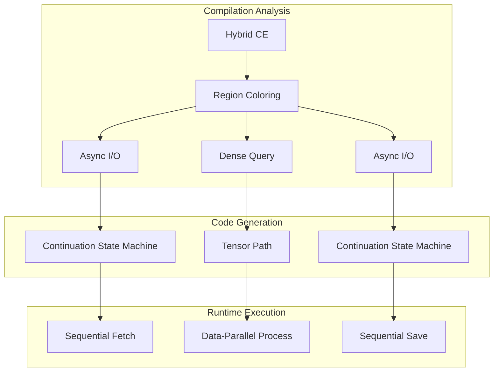

Clef's computation expressions give a unified syntax for control flow that would otherwise be written as explicit branching. Beneath that syntax sits a mathematical structure most compilers do not exploit. A region that threads each step through the result of the last must sequence, and a region whose steps have no such dependency can run them together. That partition between dependency-carrying and independent work is what our Fidelity framework reads off the source to choose a compilation strategy, and we are designing a compilation path around it to reach zero-cost computation graphs. The dependent side lowers through delimited continuations. The independent side lowers to a parallel target, and which target depends on the shape of the work.

The spine of this is the monad/applicative axis. A monad sequences because the second effect can depend on the first value, which is the DCont case. An applicative composes independent effects and is therefore parallelizable, which is the Inet and tensor case. McBride and Paterson named that distinction in [*Applicative programming with effects*](https://www.staff.city.ac.uk/~ross/papers/Applicative.html), and it is the precise account of what the compiler is partitioning.

This builds on the architectural foundations we've established across the Fidelity framework - from [coeffect analysis for context-aware compilation](/docs/internals/mlir/context-aware-compilation/) to [continuation preservation](/docs/design/concurrency/the-continuation-preservation-paradox/), and from the [reactive programming model](/blog/fidelityrx-native-reactivity/) to [referential transparency](/docs/internals/concepts/seeking-referential-transparency/).

## A Principled Start

Beneath the syntax, computation expressions are a specific pattern of function composition. The problem they solve is a familiar one: repetitive code patterns that obscure the essential logic.

Consider processing data with error handling. Without computation expressions, we're forced to write explicit branching at every step:

```fsharp
// Explicit error handling - the pattern dominates the logic
let divideNumbers init x y z =
    let a = init |> divideBy x
    match a with
    | None -> None      // Bail out on error
    | Some a' ->        // Continue with success
        let b = a' |> divideBy y
        match b with
        | None -> None  // Bail out again
        | Some b' ->    // Continue again
            let c = b' |> divideBy z
            match c with
            | None -> None
            | Some c' -> Some c'  // Finally!
 
```

The actual logic - dividing numbers in sequence - is buried under error-handling boilerplate. Computation expressions let us avoid this pattern:

```fsharp
// Same logic, but the pattern is hidden
let divideNumbers init x y z = maybe {
    let! a = init |> divideBy x
    let! b = a |> divideBy y
    let! c = b |> divideBy z
    return c
}
```

The `let!` is syntactic sugar for a specific pattern of function composition. When we write `let! x = expr in body`, the compiler transforms it into `builder.Bind(expr, fun x -> body)`. That transformation is the point: computation expressions thread continuations through a computation.

## The Continuation Connection

The continuation pattern is already there in ordinary code. Every `let` binding can be rewritten as a function application:

```fsharp
// A normal let binding
let x = 42 in
let y = 43 in
x + y

// Can be rewritten using continuations
42 |> (fun x ->
    43 |> (fun y ->
        x + y))
```

This transformation from `let` to continuation-passing is the foundation for how computation expressions work. The `let!` in a computation expression makes the pattern explicit and interceptable:

```fsharp
// The maybe builder intercepts at each continuation point
type MaybeBuilder() =
    member _.Bind(m, continuation) =
        match m with
        | None -> None                // Short-circuit
        | Some x -> continuation x    // Continue

// Each let! becomes a Bind call
maybe {
    let! x = someOption    // Bind(someOption, fun x -> ...)
    let! y = otherOption   // Bind(otherOption, fun y -> ...)
    return x + y           // Return(x + y)
}
```

## The Fork: Sequential vs Parallel

Once we recognize computation expressions as continuation structures, we face a compilation decision a conventional compiler does not make. Some computations require sequential threading of continuations, where each step depends on the previous one. Others impose no such dependencies, so all operations could in principle execute at once.

This distinction determines the compilation strategy for the whole expression. As we explored in our [coeffects and codata analysis](/docs/internals/concepts/coeffects-and-codata/), different computational patterns call for different execution strategies. The independent side splits once more by the shape of the work, which gives three lowering lanes rather than two.

### Three Lowering Lanes

The unit of analysis is the region, classified by its effect and data dependency rather than by the computation expression keyword. Our [Program Hypergraph](/docs/design/structure-and-performance/coupling-and-cohesion/) records that classification as a coloring pass over the graph, the same pass that licenses the interaction-net breakout. Three lanes come out of it.

- **Sequential effects lower through DCont.** A region whose steps depend on prior results, or that touches the world, captures its continuation at each suspension point and resumes when the result arrives. This is the dependency-carrying lane.
- **Regular data-parallel work lowers to the tensor path.** Dense, statically shaped, rectangular work, map and filter and reduce and scan over arrays, is SIMD and SIMT data parallelism. It lowers through the standard arithmetic and tensor dialects and the GPU dialect to NVVM for NVIDIA targets and the AMDGPU backend for AMD, with MLIR-AIE carrying NPU targets. Its iterations are independent by construction, so there is no graph rewriting to coordinate.
- **Irregular higher-order reduction lowers to interaction nets.** Recursive functions over trees and graphs, symbolic reduction, and sharing-sensitive computation whose shape is data-dependent are the genuine interaction-net workload. The region lowers through the portable dialects to LLVM, and the LLVM NVPTX and AMDGPU backends generate the GPU code. The actor layer orchestrates the CPU-to-GPU boundary with zero-copy BAREWire transport and re-bootstraps the computation graph as new redexes become available.

The flat map-and-filter query is the case that least needs interaction nets. Dense data parallelism falls out as the rectangular, degenerate case and is handled by the tensor path. Interaction nets are the lowering for the irregular reductions where the rewrite shape is not known until the data arrives.

Because the independent side admits an ideal parallel reading and the CPU lowering serializes it, the gap between the two is itself a figure the graph makes available. [Flow loss analysis](/docs/design/structure-and-performance/flow-loss-analysis/) is what reads that gap, quantifying how much of a region's data-flow parallelism a control-flow target gives up.

### Sequential Patterns: The DCont Path

When operations must happen in sequence, because each depends on the previous result or involves effects, we need delimited continuations. These capture "the rest of the computation" at specific points:

```fsharp
// Sequential: each step depends on the previous
let processOrder order = async {
    let! inventory = checkInventory order.Items    // Must complete first
    let! pricing = calculatePricing order          // Needs inventory
    let! shipping = estimateShipping order         // Needs pricing
    return combinedResult inventory pricing shipping
}
```

Our Composer compiler is designed to recognize this pattern and saturate it on the Program Semantic Graph as a continuation state machine: an aggregate recording the delimiter (the CE block itself), each suspension point with its state index, the set of values live across suspensions, and the per-suspension resume code. No special operation carries that aggregate into the IR. The witness emits it in the portable dialects as an ordinary function whose entry loads the state index and switches to the matching resume block, with the live values held in a state record:

```mlir
// The state-machine shape the aggregate lowers to (portable dialects; sketch)
func.func @processOrder_resume(%state: memref<?xi8>, %value: index) -> i1 {
    %idx = memref.load %state[%c0] : memref<?xi8>
    cf.switch %idx : i32, [
      default: ^done,
      0: ^afterInventory,   // store %value, advance index, request pricing
      1: ^afterPricing,     // store %value, advance index, request shipping
      2: ^afterShipping     // combine and finish
    ]
}
```

Each suspension point captures "the rest of the computation" as a state index and a resume block. In this design async operations run without allocating Tasks or using thread pools, and on a single-core target the suspend and resume semantics is itself the cooperative scheduler, with no separate dispatch machinery (the reduction is developed in [platform-aware continuation compilation](/docs/design/concurrency/delimited-continuations/#platform-aware-continuation-compilation)). The LLVM coroutine intrinsics remain available to that lowering as an optimization it may select per call site, never a form the middle end commits to. Where these effectful regions cross actor boundaries through synchronous reply, their liveness is a separate obligation, the acyclicity check we develop in [deadlock freedom as an obligation](/docs/design/concurrency/deadlock-freedom-as-an-obligation/).

### Regular Data-Parallel: The Tensor Path

The simplest independent case is a query over dense, rectangular data:

```fsharp
// Pure query: every row checked and transformed independently
let analysis = query {
    for sale in sales do
    where (sale.Amount > 1000.0)
    select (sale.Region, sale.Amount * 1.1)
}
```

Here there is no need for sequential continuations and no need for interaction nets. Every filter check and every projection is a lane in a SIMD or SIMT computation over a statically shaped array. This is the tensor path, lowering through the standard arithmetic and tensor dialects:

```mlir
// Tensor path: dense data parallelism, independent lanes
func.func @analysis(%sales: tensor<?x!sale>) -> tensor<?x!proj> {
  %mask = tosa.greater %amounts, %threshold : tensor<?xf64>
  %proj = linalg.map { extract_region_amount } ins(%sales) outs(%init)
  %out  = tensor.gather %proj, %mask
  return %out : tensor<?x!proj>
}
```

The loop and lane structure comes from the `affine`, `scf`, and `vector` dialects, and the GPU dialect carries it to NVVM or the AMDGPU backend. Independence here is trivial: the iterations do not interact, so confluence is immediate and there is no rewrite to schedule.

### Irregular Reduction: The Inet Path

Interaction nets apply to a different kind of work. A recursive reduction over a tree, where the shape of the rewrite is not known until the data arrives, has parallelism that is real but not rectangular. Two redexes in different subtrees can fire at once, and a third opens up only after one of them completes.

```fsharp
// Irregular: the reduction shape depends on the data
let rec eval expr =
    match expr with
    | Lit n        -> n
    | Add (a, b)   -> eval a + eval b      // both subtrees reduce independently
    | Let (x, e, b) -> eval (subst x (eval e) b)   // sharing through subst
 
```

This lowers to an interaction net, the model where computation is local graph rewriting and the agents make copying and discarding explicit. Lafont's symmetric interaction combinators give the vocabulary: a constructor agent builds structure, a duplicator agent copies it, and an eraser agent discards it. An active pair is two agents connected at their principal ports, and reducing it is the application of one interaction rule. The eraser realizes weakening, and same-symbol annihilation realizes the trace, which places the rule system at the compact-closed level rather than at plain graph rewriting. The model needs no continuation capture, no sequencing, and no central scheduler.

In our design the net has three residences, and an IR is none of them. The rule system is design-time structure: which agent pairs interact, and what each rewrite produces, is settled on our Program Hypergraph during saturation, where the independence of distinct active pairs is exactly the multi-way fact the hyperedges carry. Each rule's right-hand side compiles as an ordinary function over node records, emitted in the portable dialects like any other function. The net itself is runtime data: agent nodes and their port wiring as plain records, with a worklist of active pairs that the compiled rule kernels consume. What HVM encodes as a runtime's interpretive machinery, and what an IR dialect would encode as custom operations, both land here as the ordinary trio of design-time structure, compiled functions, and runtime data.

What licenses running every active pair at once is strong confluence: Lafont's one-step diamond. Any two distinct active pairs are independent, and reducing them in either order yields the same net. That is the theorem behind "all at once," and it holds with no coordination because the rules are local. Confluence is established once over the rule system, in the same character as the abstraction theorem that makes our Tier 1 dimensional content free by parametricity. It is a property of the logic, not an obligation a program incurs.

## The Pattern Behind the Fork

This is the monad/applicative axis read through the compiler. The classifier is the region's dependency structure, and the computation expression keyword is only a hint at it.

**Effectful computations** sequence operations through time. They interact with the world, maintain state, or depend on previous results, which is the monadic case where the second effect can depend on the first value. These map to delimited continuations (DCont). As we explored in [continuation preservation](/docs/design/concurrency/the-continuation-preservation-paradox/), these patterns can survive surprisingly deep into the compilation pipeline.

**Independent computations** introduce no effects and no sequential dependencies, which is the applicative case where independent effects compose. These parallelize, and the parallel target depends on shape: dense rectangular work to the tensor path, irregular reduction to interaction nets. Our work on [referential transparency](/docs/internals/concepts/seeking-referential-transparency/) shows how the compiler identifies these pure regions.

Computation expressions encode a default classification in their structure, and the coloring pass refines it from the region's actual dependencies:

```fsharp
// Async CE → sequential effects → DCont
let fetchData() = async {
    let! response = Http.get url
    let! parsed = parseResponse response
    return parsed
}

// Query CE → dense, rectangular → tensor path
let queryData() = query {
    for item in items do
    where (predicate item)
    select (transform item)
}

// State CE → sequential state threading → DCont
let stateful() = state {
    let! current = getState
    do! setState (current + 1)
    return current
}

// Recursive reduction over a tree → irregular → Inet
let rec size tree =
    match tree with
    | Leaf _      -> 1
    | Node (l, r) -> size l + size r
```

## Upward Migration

The design did not start here. Earlier framing in this corpus placed each regime in a custom MLIR dialect: a DCont dialect carrying shift and reset as operations, and an Inet dialect carrying agents and rewrite rules, with the dialect work of Kang et al. and of Coll as the standing art for encoding either regime at the IR level. Working through what those dialects would actually do changed the position. A DCont dialect earns its place through its transformation passes, frame elimination by the left identity law and continuation fusion by associativity, and every one of those rewrites is available earlier, on the saturated graph, where the classification that justifies it already resides. An Inet dialect earns its place by carrying rules to a lowering pass that compiles them, and the rules are already design-time structure the hypergraph holds. Each dialect is a waystation that re-encodes what the graph has settled, transforms it with less context than the graph had, and then lowers to the same place.

So the concepts were elevated into native expression on our Program Semantic Graph and its hypergraph extension. The sequential regime is the continuation state machine aggregate, saturated with its suspension points, state indices, and capture set. The independent regime is the rule system and the independence structure the hyperedges carry, with rule bodies compiled as ordinary functions. The monad laws still do their work, as saturation rewrites over the aggregate. The confluence theorem still does its work, discharged once over the rule system. What is gone is the representation hop between the graph and the primitives.

The witness emits the same MLIR primitive operations a transformed DCont or Inet dialect — the retired framing — would have rendered at the end of its own pass pipeline. A shift and reset chain, after frame elimination and fusion, bottoms out as a function, a switch over a state index, and loads and stores against a state record. A rule set, after compilation, bottoms out as kernel functions and a worklist loop. Those are the forms the witness now produces directly from the saturated aggregates, in the portable dialects the pipeline already carries for closures, unions, and sequences. The terminal vocabulary is identical. The route to it is one hop shorter, and the transformations that justified the dialects run where the most context lives.

The discipline that keeps this from concentrating pressure on the traversal is the same transport rule the hypergraph work states for every multi-way fact. A joint fact, the capture set of a continuation or the independence of a set of redexes or the co-location of operations bound for one tile, is discharged once at saturation, as a solver query over an enumerated set. Its consequence reaches emission as codata on the nodes it governs, or as a reified annotation of the kind a co-location constraint becomes for the spatial targets. The traversal that witnesses the graph never re-derives a joint fact at focus time. What accumulates as the language grows is a dispatch table of local recipes, one per saturated aggregate kind, and a recipe reads its aggregate the way the closure witness reads a capture layout, without computing it. The standing law: a construct whose witnessing appears to need cross-node context is under-saturated, and the remedy is a richer saturated aggregate or a reified annotation, never a smarter traversal.

## Compilation Strategies

Each lane compiles to a different cost profile:

### DCont Compilation: Stack-Based Async

Traditional async compilation creates numerous heap allocations:

```fsharp
// Traditional: AsyncBuilder, Task objects, closures
let traditional() = async {
    let! data = fetchData()
    let! result = process data
    return result
}
// Allocates: AsyncBuilder (~64 bytes)
//           Task per operation (~128 bytes each)
//           Closure per continuation (~48 bytes each)
// Total: ~350+ bytes of heap allocation
 
```

Our DCont compilation is designed to eliminate these heap allocations, as we detailed in our exploration of [deterministic memory patterns](/docs/design/memory/beyond-zero-allocation/) and [platform-aware continuation compilation](/docs/design/concurrency/delimited-continuations/#platform-aware-continuation-compilation):

```fsharp
// Fidelity: Stack-based continuations
let optimized() = async {
    let! data = fetchData()
    let! result = process data
    return result
}
// Compiles to:
// - Stack frame for continuation state (0 heap bytes)
// - Direct function calls (no indirection)
// - Inline continuation code (no closures)
// Total: 0 bytes of heap allocation
 
```

The continuation state machine preserves that structure on the graph itself, where the monad-law rewrites run during saturation, and the witness emits the settled form in the portable dialects, keeping execution stack-based with no heap allocations.

### Tensor-Path Compilation: Data Parallelism

Traditional query compilation creates sequential operations:

```fsharp
// Traditional: Sequential iteration with allocations
let traditional = query {
    for x in data do
    where (x.Value > 100)
    select (x.Value * 2)
}
// Executes: One element at a time
//          Iterator objects allocated
//          Delegate allocations for predicates
 
```

The dense, rectangular query is the tensor-path case, and the design aims to compile it to independent lanes:

```fsharp
// Fidelity: data-parallel lanes
let optimized = query {
    for x in data do
    where (x.Value > 100)
    select (x.Value * 2)
}
// Compiles to:
// - Filtering and projection across independent lanes
// - tensor/linalg algebra, vector/scf loop structure
// - GPU dialect to NVVM or AMDGPU; MLIR-AIE for NPU
// - Zero intermediate allocations
 
```

On a GPU, the target is thousands of elements processed in a single cycle. On a CPU, it is full SIMD utilization. The irregular reductions that need interaction nets are a separate lane, covered above.

## Hybrid Patterns

Real applications often mix sequential and parallel patterns. Our Composer compiler is designed to handle these together, using our [Program Hypergraph architecture](/docs/design/structure-and-performance/coupling-and-cohesion/) to identify boundaries between pure and effectful regions:

```fsharp
let hybridWorkflow data = async {
    // Sequential: async I/O (DCont)
    let! rawData = fetchFromDatabase()

    // Parallel: pure transformation (tensor path)
    let processed = query {
        for row in rawData do
        where (isValid row)
        select (transform row)
    }

    // Sequential: async I/O (DCont)
    do! saveToDatabase processed
}
```

The compiler is designed to identify the boundaries and generate code suited to each region:



## The Mathematical Foundation

The spine is the monad/applicative axis, and the mathematics on each side tells us when these transformations preserve semantics and where they pay off. The sequential side is monadic. The independent side is applicative, and its operational guarantee on the interaction-net lane is a confluence theorem.

### Monads and Sequential Composition

Delimited continuations form a monad, the mathematical structure for sequential composition. The monadic laws guarantee that our transformations preserve program semantics:

The **left identity** law \(\text{return } a \text{ >>= } f \equiv f(a)\) allows us to eliminate unnecessary continuation frames:

```fsharp
// Before: Unnecessary frame
async.Return(42) |> async.Bind(processValue)

// After: Direct call
processValue(42)
```

The **associativity** law \((m \text{ >>= } f) \text{ >>= } g \equiv m \text{ >>= } (\lambda x. f(x) \text{ >>= } g)\) enables continuation fusion:

```fsharp
// Before: Separate continuations
let! temp = operation1()
let! result = operation2(temp)

// After: Fused continuation
let! result = operation1() >>= operation2
```

### Compact-Closed Structure and Parallel Composition

Interaction nets sit at the compact-closed level, where the symmetric monoidal structure exhibits a duality: every object has a dual, with the unit and counit morphisms connecting them. In Lafont's combinators the eraser realizes weakening and same-symbol annihilation realizes the trace, which is the Geometry-of-Interaction reading. Our [negative and fractional type work](https://arxiv.org/abs/2606.04352) develops the same compact-closed promotion of the graph semantics from the type side, so the algebra the runtime rewrites and the algebra the types track are the same structure.

The monoidal laws are bookkeeping that lets the compiler regroup and reorder. Associativity \((a \otimes b) \otimes c \equiv a \otimes (b \otimes c)\) redistributes work across cores, and braiding \(a \otimes b \equiv b \otimes a\) reorders independent operations for locality. They say work can be rearranged. They do not say it can run at once. The crossing this axis does not describe, the observable order when a `bind` threads a spawned result back through what follows, is treated as a proposed non-abelian sheaf in [the braid as a fourth sheaf](/docs/design/categorical-foundations/braid-as-a-fourth-sheaf/), where the abelian reordering here is the free projection and only the crossing raises an obligation.

Strong confluence, Lafont's one-step diamond, is the property that permits simultaneous reduction. If a net contains two distinct active pairs, reducing either one leaves the other available, and the two orders converge on the same net:

```
        N
       / \
   r₁ /   \ r₂
     /     \
    N₁      N₂
     \     /
   r₂ \   / r₁
       \ /
        N'
```

Independence is structural, a consequence of the rules being local to a pair of agents, so no scheduler and no coordination is needed to exploit it. This is the operational content of "the pure side parallelizes for free," and the free-ness is the confluence theorem, proved once over the rule system rather than per program.

## Two Axes

Lowering and soundness are separate questions. Producing the Inet graph is unconditional codegen on the compilation axis: the region is colored independent, and the rewrite emits. Whether running that graph is correct is verification-axis work, and it divides. Confluence is discharged once at the rule-system level, a property of the logic rather than of any program. The per-program supervision obligations, placement, resource bounds, and non-interference for regions that touch shared state, are Tier 2 and above.

For pure regions the "parallel for free" claim lives on the proof axis at Tier 1: the iterations are independent by referential transparency, and parametricity makes that independence a property of the type and not of the particular function, so the rewrite is correct by construction. For regions that touch shared state the independence is not free, and the obligation is a non-interference property to discharge at Tier 2 or to leave sequential.

## Performance Impact

The compilation strategy is projected to change the cost profile of these patterns. The table mixes two kinds of claim, and the right-hand column says which: a lowering claim is a property of the emitted code, and a parallelism claim is a discharged property of the transformation.

| Pattern | Traditional F# | Fidelity | Kind of claim |
|---------|---------------|----------|---------------|
| Async operations | ~350 bytes/operation | 0 heap bytes | lowering: stack-based continuations |
| Dense query | Sequential, allocating | Data-parallel lanes, zero-alloc | lowering + parallelism discharged at Tier 1 |
| State computations | Object allocations | Stack-based | lowering: stack-based state |
| List comprehensions | Iterator objects | Direct generation | lowering: no iterator objects |

These improvements compound. A workflow that mixes async I/O with data processing stands to gain on both sides at once: the async lowering removes the heap traffic, and the pure region parallelizes under a Tier 1 guarantee.

## Custom Computation Expressions

The classification extends to custom computation expressions. Library authors can hint at the intended compilation strategy. This applies to the framework's [intrinsic reactive model](/blog/fidelityrx-native-reactivity/), where multicast observables map to the parallel side and unicast observables map to delimited continuations:

```fsharp
[<CompileTo(ComputationPattern.Parallel)>]
type QueryBuilder() =
    member _.For(source, body) = ...      // Dense: tensor path
    member _.Where(source, pred) = ...    // Parallel filtering
    member _.Select(source, proj) = ...   // Parallel mapping

[<CompileTo(ComputationPattern.Sequential)>]
type AsyncBuilder() =
    member _.Bind(m, f) = ...            // Will compile to DCont
    member _.Return(x) = ...             // Continuation reset
 
```

The compiler is designed to respect these hints and to check that they match the actual computation patterns.

## Future Directions

As the programming language community embraces algebraic effects, this partition becomes even more relevant. Algebraic effects are essentially typed delimited continuations, making the DCont path natural for effectful computations. Pure computations remain effect-free, taking the tensor path when dense and the interaction-net path when their reduction is irregular.

Future computation expressions could explicitly declare their effect signatures:

```fsharp
// Explicit effect declarations guide compilation
let workflow = async<Effects = {IO; State}> {
    // Compiler knows: needs DCont for effects
    let! data = readFile "input.txt"
    return data
}

let pureWorkflow = query<Effects = Pure> {
    // Compiler guarantees: parallel target
    // Compile error if effects detected
    for x in data do
    select (transform x)
}
```

The independent side stays deterministic in its operational lowering. Where a computation is genuinely nondeterministic, that outcome is modeled in the verification layer rather than the runtime dynamics. Our [tier architecture](/docs/internals/verification/) represents it as a restricted probabilistic fragment at Tier 3, with the distributions living over the same abelian structure the lower tiers already handle, and as relational judgments at Tier 4 when the property relates two runs. Keeping the lowering deterministic is what lets cut elimination stay execution: the net reduces, and the modeling of chance sits in the proof obligation, not in the reduction.

## Structural Lowering

The path from computation expressions to machine code rests on recognizing the structure already present in the code. Sequential patterns that thread continuations map to delimited continuations. Independent patterns parallelize, dense rectangular work through the tensor path and irregular reduction through interaction nets.

This approach treats computation expressions as compile-time specifications rather than runtime abstractions that add overhead. The builder pattern becomes a source of compilation guidance instead of a runtime object model. For the developer, this means writing ordinary Clef code and getting the performance the structure allows. For the library author, it opens up domain-specific languages without runtime penalties.

On the interaction-net side, HVM and [HVM2](https://github.com/HigherOrderCO/HVM) are the prior art for parallel interaction-net runtimes, including on GPU. The difference is where the cost of soundness is paid. HVM pays it dynamically: the scheduling and the bookkeeping that keep parallel reduction correct run in a runtime host. Our design discharges that cost at compile time as a tier obligation and emits lean kernels through the LLVM GPU backends, with the actor layer orchestrating the boundary. The interaction-net evaluation model is shared. The placement of the soundness work is the difference.

The patterns we work with in expressive programming, monads for sequencing and applicatives for parallelism, are the same structures that tell the compiler how to lower the code. We are early in building this compilation path. The three-lane split routes sequential effects, dense data parallelism, and irregular reduction to different targets off one classification. We have found no other representative implementation of it in the standing literature we have reviewed. It is the direction we will keep developing as the rest of the Composer compiler comes into place.
