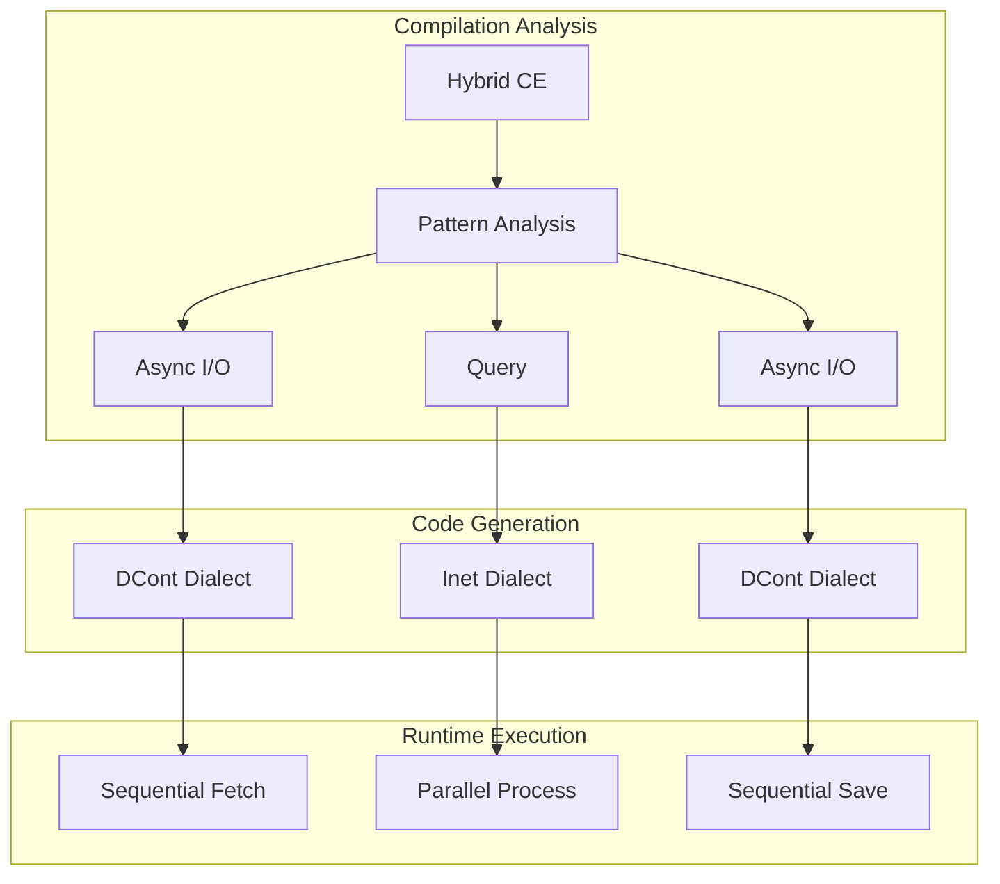

Clef's computation expressions give a unified syntax for control flow that would otherwise be written as explicit branching. Beneath that syntax sits a mathematical structure most compilers do not exploit. In our Fidelity framework we treat most computation expressions as decomposing into one of two patterns: delimited continuations for sequential effects, or interaction nets for parallelism. We read this as a duality in the structure of the computation, and we are designing a compilation path around it to reach zero-cost computation graphs.

This builds on the architectural foundations we've established across the Fidelity framework - from our [coeffect analysis for context-aware compilation](https://speakez.tech/blog/context-aware-compilation/) to our [exploration of continuation preservation](https://speakez.tech/blog/the-continuation-preservation-paradox/), and from our [reactive programming model](https://speakez.tech/blog/alloyrx-native-reactivity-in-fidelity/) to our [approach to referential transparency](https://speakez.tech/blog/seeking-referential-transparency/).

## A Principled Start

To understand how computation expressions compile to optimal machine code, we need to first understand what they actually are beneath the syntax. Let's begin with a problem every developer faces: repetitive code patterns that obscure the essential logic.

Consider processing data with error handling. Without computation expressions, we're forced to write explicit branching at every step:

```fsharp
// Explicit error handling - the pattern dominates the logic
let divideNumbers init x y z =
    let a = init |> divideBy x
    match a with
    | None -> None      // Bail out on error
    | Some a' ->        // Continue with success
        let b = a' |> divideBy y
        match b with
        | None -> None  // Bail out again
        | Some b' ->    // Continue again
            let c = b' |> divideBy z
            match c with
            | None -> None
            | Some c' -> Some c'  // Finally!
```

The actual logic - dividing numbers in sequence - is buried under error-handling boilerplate. Computation expressions let us avoid this pattern:

```fsharp
// Same logic, but the pattern is hidden
let divideNumbers init x y z = maybe {
    let! a = init |> divideBy x
    let! b = a |> divideBy y
    let! c = b |> divideBy z
    return c
}
```

The `let!` is syntactic sugar for a specific pattern of function composition. When we write `let! x = expr in body`, the compiler transforms it into `builder.Bind(expr, fun x -> body)`. That transformation is the point: computation expressions thread continuations through a computation.

## The Continuation Connection

To see why this matters for compilation, let's make the continuation pattern explicit. Every `let` binding can be rewritten as a function application:

```fsharp
// A normal let binding
let x = 42 in
let y = 43 in
x + y

// Can be rewritten using continuations
42 |> (fun x ->
    43 |> (fun y ->
        x + y))
```

This transformation from `let` to continuation-passing is the foundation for how computation expressions work. The `let!` in a computation expression makes the pattern explicit and interceptable:

```fsharp
// The maybe builder intercepts at each continuation point
type MaybeBuilder() =
    member _.Bind(m, continuation) =
        match m with
        | None -> None                // Short-circuit
        | Some x -> continuation x    // Continue

// Each let! becomes a Bind call
maybe {
    let! x = someOption    // Bind(someOption, fun x -> ...)
    let! y = otherOption   // Bind(otherOption, fun y -> ...)
    return x + y           // Return(x + y)
}
```

Once computation expressions are read as continuations, the question becomes what happens when we compile these patterns. This is where our Fidelity framework's approach diverges from a conventional compiler.

## The Fork: Sequential vs Parallel

Once we recognize computation expressions as continuation structures, we face a compilation decision. Some computations require sequential threading of continuations, where each step depends on the previous one. Others carry no such dependencies, so all operations could in principle execute at once.

This distinction determines the compilation strategy for the whole expression. As we explored in our [coeffects and codata analysis](/docs/design/coeffects-and-codata/), different computational patterns call for different execution strategies:

### Sequential Patterns: The DCont Path

When operations must happen in sequence, because each depends on the previous result or involves effects, we need delimited continuations. These capture "the rest of the computation" at specific points:

```fsharp
// Sequential: each step depends on the previous
let processOrder order = async {
    let! inventory = checkInventory order.Items    // Must complete first
    let! pricing = calculatePricing order          // Needs inventory
    let! shipping = estimateShipping order         // Needs pricing
    return combinedResult inventory pricing shipping
}
```

Our Composer compiler is designed to recognize this pattern and lower it to MLIR's DCont dialect:

```mlir
// DCont: explicit continuation capture and resumption
dcont.func @processOrder(%order: !order) -> !result {
    %k1 = dcont.shift {
        %inventory = call @checkInventory(%order.items)
        dcont.resume %k1 %inventory
    }

    %k2 = dcont.shift {
        %pricing = call @calculatePricing(%order, %inventory)
        dcont.resume %k2 %pricing
    }

    %k3 = dcont.shift {
        %shipping = call @estimateShipping(%order, %pricing)
        dcont.resume %k3 %shipping
    }

    %result = call @combine(%inventory, %pricing, %shipping)
    dcont.reset %result
}
```

Each `dcont.shift` captures the continuation at that point, "the rest of the computation," so the operation can suspend and later resume. In this design async operations run without allocating Tasks or using thread pools.

### Parallel Patterns: The Inet Path

But what about computations with no sequential dependencies? Consider a query over pure data:

```fsharp
// Pure query: all operations could happen simultaneously
let analysis = query {
    for sale in sales do
    where (sale.Amount > 1000.0)
    select (sale.Region, sale.Amount * 1.1)
}

// Every sale can be checked and transformed independently
// No operation depends on another's result
```

Here there is no need for sequential continuations. Every filter check and every projection could happen at once. Our Composer compiler is designed to recognize this pattern and lower it to interaction nets:

```mlir
// Inet: parallel graph reduction
inet.func @analysis(%sales: !inet.wire<array>) -> !inet.wire<array> {
    // All operations happen in parallel
    %filtered = inet.parallel_filter @check_amount %sales
    %projected = inet.parallel_map @extract_region_amount %filtered

    inet.return %projected
}
```

Interaction nets are a model where computation happens through local graph reductions that can all occur at once. The model carries no continuation capture, no sequencing, and no waiting; each reduction proceeds in parallel.

## The Pattern Behind the Fork

This distinction between DCont and Inet tracks a duality in the computation itself:

**Effectful computations** need to sequence operations through time. They interact with the world, maintain state, or depend on previous results. These naturally map to delimited continuations (DCont), which provide explicit control over execution order. As we explored in [continuation preservation](https://speakez.tech/blog/the-continuation-preservation-paradox/), these patterns can survive surprisingly deep into the compilation pipeline.

**Pure computations** have no effects and no sequential dependencies. Every sub-computation can happen independently. These naturally map to interaction nets (Inet), which maximize parallelism through simultaneous graph reduction. Our work on [referential transparency](https://speakez.tech/blog/seeking-referential-transparency/) shows how the compiler identifies these pure regions.

Computation expressions already encode this distinction in their structure, and the compiler reads it from there:

```fsharp
// Async CE → Sequential effects → DCont
let fetchData() = async {
    let! response = Http.get url
    let! parsed = parseResponse response
    return parsed
}

// Query CE → Pure parallel → Inet
let queryData() = query {
    for item in items do
    where (predicate item)
    select (transform item)
}

// State CE → Sequential state threading → DCont
let stateful() = state {
    let! current = getState
    do! setState (current + 1)
    return current
}

// List CE → Pure generation → Inet
let cartesian() = list {
    for x in xs do
    for y in ys do
    yield (x, y)
}
```

## Making It Concrete: Compilation Strategies

Let's trace how these different patterns compile to see the performance implications:

### DCont Compilation: Stack-Based Async

Traditional async compilation creates numerous heap allocations:

```fsharp
// Traditional: AsyncBuilder, Task objects, closures
let traditional() = async {
    let! data = fetchData()
    let! result = process data
    return result
}
// Allocates: AsyncBuilder (~64 bytes)
//           Task per operation (~128 bytes each)
//           Closure per continuation (~48 bytes each)
// Total: ~350+ bytes of heap allocation
```

Our DCont compilation is designed to eliminate these heap allocations, as we detailed in our exploration of [deterministic memory patterns](/docs/design/beyond-zero-allocation/) and [the full Frosty experience](https://speakez.tech/blog/the-full-frosty-experience/):

```fsharp
// Fidelity: Stack-based continuations
let optimized() = async {
    let! data = fetchData()
    let! result = process data
    return result
}
// Compiles to:
// - Stack frame for continuation state (0 heap bytes)
// - Direct function calls (no indirection)
// - Inline continuation code (no closures)
// Total: 0 bytes of heap allocation
```

The DCont dialect is meant to preserve the continuation structure in MLIR, which leaves room for optimization while keeping execution stack-based with no heap allocations.

### Inet Compilation: Parallelism

Traditional query compilation creates sequential operations:

```fsharp
// Traditional: Sequential iteration with allocations
let traditional = query {
    for x in data do
    where (x.Value > 100)
    select (x.Value * 2)
}
// Executes: One element at a time
//          Iterator objects allocated
//          Delegate allocations for predicates
```

Our Inet compilation design aims to enable parallel execution of these operations:

```fsharp
// Fidelity: Parallel execution
let optimized = query {
    for x in data do
    where (x.Value > 100)
    select (x.Value * 2)
}
// Compiles to:
// - All filtering happens simultaneously
// - All projections happen simultaneously
// - Direct compilation to SIMD/GPU operations
// - Zero intermediate allocations
```

On a GPU, the target is thousands of elements processed in a single cycle. On a CPU, it is full SIMD utilization.

## Hybrid Patterns

Real applications often mix sequential and parallel patterns. Our Composer compiler is designed to handle these together, using our [Program Hypergraph architecture](https://speakez.tech/blog/coupling-and-cohesion/) to identify boundaries between pure and effectful regions:

```fsharp
let hybridWorkflow data = async {
    // Sequential: async I/O (DCont)
    let! rawData = fetchFromDatabase()

    // Parallel: pure transformation (Inet)
    let processed = query {
        for row in rawData do
        where (isValid row)
        select (transform row)
    }

    // Sequential: async I/O (DCont)
    do! saveToDatabase processed
}
```

The compiler is designed to identify the boundaries and generate code suited to each region:



## The Mathematical Foundation

This DCont/Inet duality is grounded in category theory, and the mathematics is what tells us when these transformations preserve semantics and where they pay off.

### Monads and Sequential Composition

Delimited continuations form a monad, the mathematical structure for sequential composition. The monadic laws guarantee that our transformations preserve program semantics:

The **left identity** law \(\text{return } a \text{ >>= } f \equiv f(a)\) allows us to eliminate unnecessary continuation frames:

```fsharp
// Before: Unnecessary frame
async.Return(42) |> async.Bind(processValue)

// After: Direct call
processValue(42)
```

The **associativity** law \((m \text{ >>= } f) \text{ >>= } g \equiv m \text{ >>= } (\lambda x. f(x) \text{ >>= } g)\) enables continuation fusion:

```fsharp
// Before: Separate continuations
let! temp = operation1()
let! result = operation2(temp)

// After: Fused continuation
let! result = operation1() >>= operation2
```

### Symmetric Monoidal Categories and Parallel Composition

Interaction nets form a symmetric monoidal category, the mathematical structure for parallel composition. The laws guarantee safe parallelization:

The **parallel associativity** law \((a \otimes b) \otimes c \equiv a \otimes (b \otimes c)\) allows work redistribution across cores:

```fsharp
// Grouping parallel operations for optimal hardware utilization
let filterAll data =
    // Can regroup without changing semantics
    parallel [(filter1; filter2); filter3] data
    // is equivalent to
    parallel [filter1; (filter2; filter3)] data
```

The **braiding** law \(a \otimes b \equiv b \otimes a\) enables operation reordering for locality:

```fsharp
// Reordering pure operations for better cache behavior
query {
    for item in data do
    where (predicate item)
    select (transform item)
}
// Can execute in either order:
// filter-then-map OR map-then-filter
```

These laws are what let the compiler reorder and regroup operations while preserving correctness.

## Performance Impact

The DCont/Inet compilation strategy is projected to change the cost profile of these patterns:

| Pattern | Traditional F# | Fidelity | Improvement |
|---------|---------------|----------|-------------|
| Async operations | ~350 bytes/operation | 0 bytes | ∞ |
| Query operations | Sequential, allocating | Parallel, zero-alloc | 10-100x |
| State computations | Object allocations | Stack-based | 50x |
| List comprehensions | Iterator objects | Direct generation | 20x |

These improvements compound. A workflow that mixes async I/O with data processing stands to gain on both sides at once: the async overhead is removed and the pure operations are parallelized.

## Custom Computation Expressions

The DCont/Inet duality extends to custom computation expressions. Library authors can hint at the intended compilation strategy. This carries over to domain-specific languages like our [Rx reactive framework](https://speakez.tech/blog/alloyrx-native-reactivity-in-fidelity/), where multicast observables map to interaction nets and unicast observables map to delimited continuations:

```fsharp
[<CompileTo(ComputationPattern.Parallel)>]
type QueryBuilder() =
    member _.For(source, body) = ...      // Will compile to Inet
    member _.Where(source, pred) = ...    // Parallel filtering
    member _.Select(source, proj) = ...   // Parallel mapping

[<CompileTo(ComputationPattern.Sequential)>]
type AsyncBuilder() =
    member _.Bind(m, f) = ...            // Will compile to DCont
    member _.Return(x) = ...             // Continuation reset
```

The compiler is designed to respect these hints and to check that they match the actual computation patterns.

## Future Directions: Algebraic Effects and Beyond

As the programming language community embraces algebraic effects, the DCont/Inet duality becomes even more relevant. Algebraic effects are essentially typed delimited continuations, making the DCont path natural for effectful computations. Pure computations remain effect-free, making the Inet path optimal.

Future computation expressions could explicitly declare their effect signatures:

```fsharp
// Explicit effect declarations guide compilation
let workflow = async<Effects = {IO; State}> {
    // Compiler knows: needs DCont for effects
    let! data = readFile "input.txt"
    return data
}

let pureWorkflow = query<Effects = Pure> {
    // Compiler guarantees: Inet compilation
    // Compile error if effects detected
    for x in data do
    select (transform x)
}
```

## Structure Is Compilation Strategy

The path from computation expressions to machine code rests on recognizing the mathematical structure already present in the code. Sequential patterns that thread continuations map to delimited continuations (DCont). Parallel patterns with no dependencies map to interaction nets (Inet).

This approach treats computation expressions as compile-time specifications rather than runtime abstractions that carry overhead. The builder pattern becomes a source of compilation guidance instead of a runtime object model. For the developer, this means writing ordinary Clef code and getting the performance the structure allows. For the library author, it opens up domain-specific languages without runtime penalties.

The patterns we work with in expressive programming, monads for sequencing and applicatives for parallelism, are the same structures that tell the compiler how to lower the code. We are early in building this compilation path, and we have found no other representative implementations of the DCont/Inet split in the standing literature we have reviewed. It is the direction we will keep developing as the rest of the Composer compiler comes into place.
