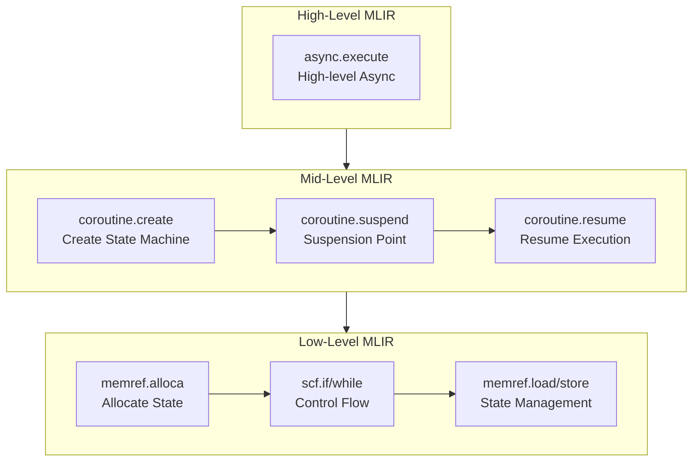

> This article was originally published on the
> [SpeakEZ Technologies blog](https://speakez.tech) as part of our early
> design work on the Fidelity Framework. It has been updated to reflect
> the Clef language naming and current project structure.

We have been working on the Fidelity framework for a while, and it's been a journey to find the right balance of familiar conventions with new capabilities. Nowhere is that more apparent than in the async/task/actor models for concurrent programming.

## The Iceberg Model: Familiar on the Surface, Revolutionary Underneath

Think of Fidelity's concurrency model as an iceberg. Above the waterline, it looks remarkably similar to what you already know:

```fsharp
// This should look pretty familiar to F# developers
let processData = async {
    let! data = fetchDataAsync()
    let transformed = transform data
    do! saveResultAsync transformed
    return transformed
}
```

But beneath the surface? That's where everything changes. Instead of relying on the CLR's thread pool and garbage collector, Fidelity compiles your async code directly to native machine code through MLIR's progressive lowering pipeline, preserving semantic structure at each transformation pass until it reaches LLVM and ultimately the target hardware.

This compilation approach shares philosophical ground with Rust's zero-cost async, which also compiles to state machines without runtime overhead. Both Rust and Fidelity reject the managed runtime model in favor of compile-time transformation. However, the two approaches start from different foundations and consequently solve different problems well. Rust's async builds on its ownership model, providing memory safety but requiring careful attention to lifetimes across await points. Fidelity's async builds on delimited continuations, making control flow structure explicit in the semantic graph. Neither approach is universally superior; they represent different design tradeoffs that continue to evolve as both ecosystems mature.

## Core Libraries in the Fidelity Framework

The Fidelity Framework includes several key libraries for concurrency, which we'll explore in a logical order:

1. **CCS Intrinsics**: Automatic static resolution of functions and types
2. **BAREWire**: Zero-copy memory protocol for efficient data handling
3. **Frosty**: Advanced async library that replaces .NET's Task
4. **Olivier**: Actor model implementation with Erlang-inspired semantics
   - **Prospero**: Scheduling, orchestration and heap management via RAII
5. **Alex**: Transformation of Clef code to MLIR operations


## CCS Intrinsics: Automatic Static Resolution

CCS, drawing on principles from the elegant fsil library for automatic inlining of Clef select functions within .NET, provides native static resolution of functions and types as compiler intrinsics:

```fsharp
// Regular Clef function that CCS automatically optimizes
let processData (items: 'T[]) =
    items |> Array.map transformItem |> Array.sum
// No explicit inline keyword needed

// Yet this compiles to the same efficient code as if you had written:
let inline processData (items: 'T[]) = ...
```

CCS analyzes your code during compilation and automatically applies static resolution. This gives you the performance benefits of manually inlined code without littering your codebase with `inline` keywords. As a building block for the entire Fidelity framework, CCS's static resolution enables efficient compilation across all libraries.

## BAREWire: Efficient Memory Protocol

BAREWire provides a high-performance protocol for memory management and cross-process communication:

```fsharp
// Define a BAREWire message schema
let messageSchema =
    BAREWire.schema {
        field "id" BAREWireType.Int64
        field "payload" BAREWireType.String
        field "timestamp" BAREWireType.Double
    }

// Send message across process boundaries
let sendMessage (target: ProcessId) (message: Message) =
    // Zero copy where possible
    BAREWire.sendMessage target messageSchema message
```

BAREWire enables zero-copy operations when possible and efficient serialization when necessary, providing optimal performance regardless of process boundaries. This library forms the foundation for efficient memory handling throughout the Fidelity Framework.

### Solving the byref Problem

One pernicious issue in .NET's memory model is "the byref problem". In the CLR, byref pointers cannot escape the stack frame where they're created, and you can't store them in heap-allocated objects. This creates a significant limitation when working with performance-critical code that needs direct memory access.

BAREWire solves this with its type-safe memory model:

```fsharp
// Create a memory-mapped buffer with static lifetime
let buffer = BAREWire.createBuffer<float> 1024

// Get direct access to the buffer with type safety
let span = buffer.AsSpan()

// Work with the span directly without copying
for i = 0 to span.Length - 1 do
    span[i] <- float i * 2.0

// Share the buffer with another process
let sharedBuffer = buffer.Share(targetProcess)

// No need to copy the data - targetProcess gets direct access
BAREWire.sendBuffer targetProcess sharedBuffer
```

The magic is in how BAREWire separates buffer lifetime from access permissions. Unlike the CLR where lifetime and access are tightly coupled through the garbage collector, BAREWire uses a capability-based model:

1. **Buffer Ownership**: Explicit lifetime management without GC intervention
2. **Buffer Capabilities**: Type-safe permissions that can be passed between components
3. **Memory Protection**: Hardware-enforced boundaries that prevent invalid access

This means you can have multiple components access the same memory without copying, while still maintaining memory safety guarantees. For .NET developers accustomed to constant serialization and defensive copying, this represents a significant performance improvement.

Rust achieves similar zero-copy goals through its ownership model, and the comparison is instructive. Rust's approach verifies at compile time that references do not outlive their referents and that mutable access is exclusive. This works well within a single address space but requires careful design when crossing process boundaries; Rust IPC libraries typically serialize data or use unsafe blocks for shared memory. BAREWire's capability model takes a different approach: rather than tracking reference lifetimes, we track access permissions that can be explicitly transferred. Both approaches provide memory safety without garbage collection; they differ in what the type system tracks and how cross-boundary sharing is expressed.

## Frosty Async

Building on the foundation provided by CCS intrinsics and BAREWire, Frosty is our advanced library. Frosty builds on lessons learned from [IcedTasks](https://github.com/TheAngryByrd/IcedTasks), an innovative F# library created by Jimmy Byrd, but here we reimplemented without .NET Task dependencies for native compilation:

```fsharp
// Creating a cold task (doesn't start until someone subscribes)
let coldAsync = Frosty.startCold (fun () ->
    calculateSomething()
)

// Creating a hot task (starts immediately)
let hotAsync = Frosty.startHot (fun () ->
    calculateSomething()
)

// Composing tasks with a computation expression (looks like async!)
let combinedAsync = frosty {
    let! result1 = firstAsync
    let! result2 = secondAsync
    return result1 + result2
}
```

Through the CCS intrinsics described above, these computation expressions are transformed at compile time into continuation-passing style, then progressively lowered to optimal machine code for your target platform. No thread pool, no runtime overhead - just direct control flow that the hardware understands.

## Platform Configuration: Just Below the Waterline

For .NET developers accustomed to letting the runtime handle everything, the Fidelity Framework offers a simple compromise - just dip your toes below the waterline with minimal configuration:

```fsharp
let platformConfig =
    PlatformConfig.Default
    |> PlatformConfig.withExecutionModel ExecutionModel.WorkStealing
    |> PlatformConfig.withMemoryStrategy MemoryStrategy.RegionBased

// Apply the configuration
Fidelity.configurePlatform platformConfig
```

This small step "into the waters beneath the semantic surface" gives you control over aspects of the computation graph that are normally hidden deep in the CLR's implementation. Want cooperative multitasking for embedded systems with limited resources? Or work-stealing schedulers for server applications that need to maximize throughput? Perhaps you need deterministic memory management for real-time systems? All of these become configurable options rather than fixed runtime behaviors.

It's this minimal configuration - the only visible difference from standard Clef development - that unlocks the entire power of the Fidelity Framework. By making just a few explicit choices about execution and memory models, you gain access to capabilities that simply aren't possible in a traditional runtime environment, all while keeping your application lightweight and the code very close to an idiomatic experience.

The beauty of this is that your core application logic remains unchanged regardless of the target platform. The same business logic can run efficiently on an embedded device or a high-performance server - only the platform configuration changes to match the environment's capabilities and constraints.

## Olivier: Complete Actor System

Olivier is the actor model implementation in Fidelity, providing an Erlang-inspired message-passing concurrency system:

```fsharp
type CounterMessage =
    | Increment
    | Decrement
    | GetCount of AsyncReplyChannel<int>

module StandardActor =
    let createCounter() =
        MailboxProcessor.Start(fun inbox ->
            let rec loop count = async {
                let! msg = inbox.Receive()
                match msg with
                | Increment ->
                    return! loop (count + 1)
                | Decrement ->
                    return! loop (count - 1)
                | GetCount replyChannel ->
                    replyChannel.Reply count
                    return! loop count
            }
            loop 0
        )

    let counter = createCounter()
    counter.Post(Increment)
    let result = counter.PostAndReply(GetCount)

type CounterActorMessage =
    | Increment
    | Decrement
    | GetCount of IActorRef

type CountResponse = CountValue of int

module Fidelity =
    let createCounterBehavior() = actor {
        let mutable count = 0

        let rec loop() = async {
            let! msg = Actor.receive()

            match msg with
            | Increment ->
                count <- count + 1
                return! loop()

            | Decrement ->
                count <- count - 1
                return! loop()

            | GetCount replyTo ->
                replyTo <! CountValue count
                return! loop()
        }

        loop()
    }


    let system = Olivier.createSystem "counter-system"
    let counterActor = Olivier.spawn system "counter" createCounterBehavior

    counterActor <! Increment

    let requester = Olivier.spawn system "requester" (fun () -> actor {
        let replyPromise = Promise<int>()

        counterActor <! GetCount(Actor.self())

        let! CountValue value = Actor.receive()
        replyPromise.Complete(value)

        return replyPromise.Value
    })
```

Olivier draws primary inspiration from Erlang's OTP framework for its message-passing semantics and fault tolerance principles. The Olivier library contains everything needed for actor-based concurrency, including the Prospero library described next.

## Prospero: Scheduling Within Olivier

Prospero is the scheduling and orchestration library contained within Olivier, handling the actor lifecycle and distribution:

```fsharp
let system = Olivier.createSystem "my-system"

let schedulerConfig =
    SchedulerConfig.create()
    |> SchedulerConfig.withWorkerCount 4
    |> SchedulerConfig.withPriorities ["critical"; "normal"; "background"]

let configuredSystem = system |> Olivier.configureScheduler schedulerConfig

let clusterConfig =
    ClusterConfig.create()
    |> ClusterConfig.withSeedNodes ["akka.tcp://system@node1:2552"]
    |> ClusterConfig.withRoles ["worker"]

let distributedSystem = configuredSystem |> Olivier.withClustering clusterConfig

let userRegion =
    Olivier.Sharding.start distributedSystem "user"
        (fun id -> userActorFactory id)
        (fun msg -> extractEntityId msg)
        (fun id -> extractShardId id)
```

While Prospero offers Akka.NET compatibility for clustering, its primary role is scheduling and orchestration within the Olivier actor model. It manages message delivery, supervision hierarchies, and actor lifecycle events within the system. And by extension of its role as actor supervisor, it also marshals the heap allocations for those actors as well.

Here's a simplified example of how an async function might look in MLIR:



Each level gets closer to the metal, with more explicit control over memory and execution. This is the nanopass philosophy in action - small, composable transformations that preserve semantic information while progressively lowering abstraction. By the time we reach the lowest level, we have a representation that maps directly to native code for any target platform, with the original program structure still intact for optimization.

## Alex: Where Clef Meets MLIR

Alex handles the critical transformation of Clef code into MLIR operations within the compilation pipeline.

```fsharp
// You never need to interact with this directly
// It's part of the compilation pipeline
let mlirTransform = mlir {
    // Clef async/task code gets transformed to MLIR operations
    // These are then lowered through MLIR dialects and ultimately to machine code
    yield MLIRPrimitives.async_execute
    yield MLIRPrimitives.coroutine_suspend
    yield MLIRPrimitives.control_flow
}
```

Consider how Clef represents function composition, pattern matching, and higher-order functions. These structures map naturally to MLIR's region-based operations and SSA (Static Single Assignment) form. For example, a Clef pattern match translates cleanly to MLIR's scf.if and scf.match operations, preserving both the logical structure and optimization opportunities.

Particularly fascinating is how Clef's computation expressions, the foundation of async workflows, correspond directly to MLIR's structured control flow. Computation expressions are *continuations in disguise* - when you write `let! x = expr in body`, the compiler transforms it into a `Bind` operation that threads the continuation through the computation. Alex leverages this by using **delimited continuations** via `shift` and `reset` operators, which create explicit continuation boundaries that correspond exactly to SSA's basic block boundaries. This isn't coincidence - it's the same mathematical structure expressed directly at the semantic level.

Where .NET's compiler stops at creating state machines that still require runtime support, Alex uses these delimited continuations to capture "the rest of the computation" at specific points, allowing operations to suspend and resume without allocating Tasks or using thread pools. Each `shift` captures the continuation, each `reset` delimits its scope, and these map directly to MLIR's DCont dialect operations, preserving the precise control flow structure all the way to hardware-optimized instructions.

Rust's async transformation also produces state machines, and C++20 coroutines follow a similar pattern. The key difference lies in when control flow structure becomes explicit. In Rust and C++, async transformation occurs after type checking; the compiler must reconstruct control flow from imperative code. In Fidelity, delimited continuations make control flow explicit in the source semantics, which the compiler preserves through MLIR lowering. This is not a criticism of the Rust or C++ approaches, which work well within their design constraints. Rather, it illustrates how different starting points lead to different compilation strategies, with Fidelity's concurrent foundation enabling analysis that imperative foundations make more difficult.

This alignment between Clef and MLIR represents years of parallel evolution in programming language design. While developed separately, both embody similar principles around composition, immutability, and explicit data flow - principles that ultimately lead to more optimizable code. When you write Clef code, you're writing in the same structure that optimizing compilers target. Alex simply connects these kindred spirits, enabling Clef code to bypass the runtime entirely and speak directly to the hardware in its native tongue.

## Clef Unleashed

The Fidelity Framework represents nothing less than the liberation of Clef from the constraints of the runtime environment. By maintaining the elegant, expressive syntax that Clef developers love while revolutionizing what happens beneath the surface, we've created something truly transformative.

When you write code in the Fidelity Framework, you're no longer limited by garbage collection pauses, thread pool configurations, or runtime overhead. Instead, your Clef code flows through a progressive lowering pipeline - from computation expressions to continuations, through CCS intrinsics, BAREWire, Frosty, Olivier, and finally Alex - emerging as lean, efficient machine code precisely tailored to your target hardware, with semantic intent preserved at every step.

This isn't just a performance upgrade, it's a fundamental expansion of what's possible. The same Clef code that powers your server applications can now run directly on embedded devices. The actor model concepts you apply in distributed systems can scale down to real-time applications. The memory safety you depend on remains rock-solid, but without the overhead of a runtime or monolithic garbage collector.

We built the Fidelity Framework because we believe Clef deserves to run everywhere, at peak efficiency, without compromise. The language's inherent clarity, safety, and expressiveness shouldn't be limited to environments that can support a heavy runtime. Now, you have more choices than ever.

Join us in exploring what Clef can achieve when truly unleashed. The possibilities are only limited by your imagination (and the device you're running on).
