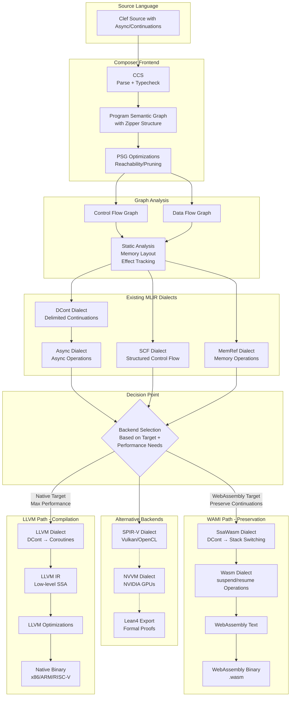
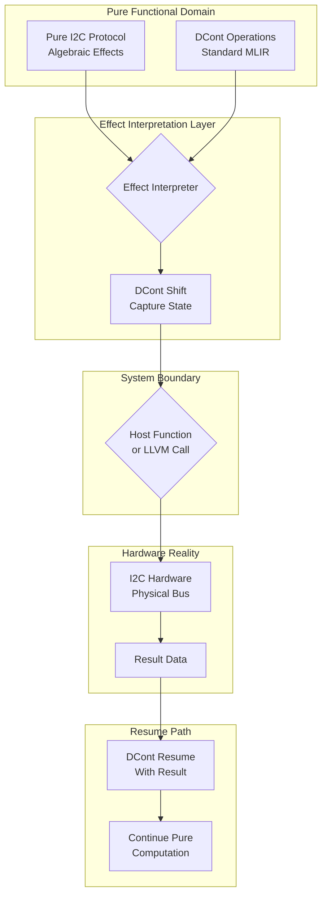
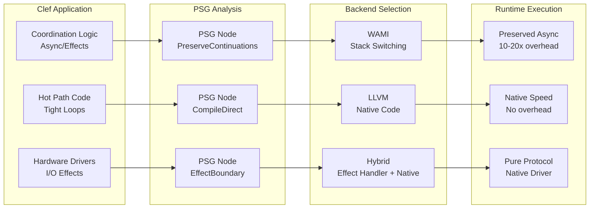

> This article was originally published on the
> [SpeakEZ Technologies blog](https://speakez.tech) as part of our early
> design work on the Fidelity Framework. It has been updated to reflect
> the Clef language naming and current project structure.

When we set out to build Composer, we faced a fundamental question that cuts to the heart of functional systems programming: how far down the compilation stack can we preserve the elegant abstractions that make [the Clef language](https://clef-lang.com) powerful? Specifically, can delimited continuations - the theoretical foundation for async/await, generators, and algebraic effects - survive the journey from high-level Clef through MLIR's SSA form to executable code? And perhaps more importantly, should they?

This isn't just an academic exercise. The answer determines whether we can build truly functional device drivers, whether async code can run without heap allocation, and whether Clef can genuinely compete with C for embedded systems. It's a question that forces us to confront the tension between abstraction and performance, between mathematical elegance and hardware reality.

## The Preservation Boundary

Let's start with a fundamental observation: abstractions have lifespans in a compiler. They're born in the source language, live through various intermediate representations, and eventually die when they meet the harsh reality of hardware. The question is not whether delimited continuations will eventually be lowered to something else - they must be. The question is: how long can we keep them alive, and what benefits do we gain from their longevity?

In Composer's architecture, delimited continuations begin life as first-class citizens in our Program Hypergraph (PHG):

```fsharp
type PSGNode =
    | DelimitedContinuation of {
        Reset: PSGNode           // The delimiter boundary
        Shift: PSGNode           // The capture point
        Context: ZipperContext   // Full surrounding context
        Metadata: ContinuationMetadata
    }
    | Async of {
        Body: PSGNode
        Continuations: Map<SuspendPoint, ContinuationCapture>
        ResourceTracking: RAIIContext
    }
```

At this level, we have complete semantic information. The bidirectional zipper structure allows us to navigate and transform the continuation while preserving its full context. This is delimited continuations in their purest form - mathematical objects with precise semantics.

## The Fork(s) in the Road: WAMI vs LLVM

As we lower from PSG through MLIR, we reach a critical decision point. This is where the paths diverge dramatically, and our choice determines not just performance characteristics but the very nature of what survives to runtime.



This diagram reveals the crucial architectural decision: Composer leverages existing MLIR dialects, particularly the DCont (delimited continuation) dialect. We preserve the art that exists - no reinventing wheels. The PSG transforms Clef into these standard dialects, then we choose whether to preserve continuations (WAMI) or compile them away (LLVM).

The PSG (and PHG that will follow it in a future revision) maintains full semantic information about continuations, effects, and resource lifetimes, which maps cleanly to existing MLIR dialects like DCont, Async, SCF, and MemRef. This allows us to make an informed decision at the last possible moment about whether to preserve these abstractions (WAMI path) or compile them away for performance (LLVM path).

### The WAMI Path: Semantic Preservation

WAMI's Stack Switching proposal represents something remarkable - delimited continuations as a first-class WebAssembly feature. When we compile through WAMI, our continuations map almost directly:

```fsharp
// In your Clef source
let processAsync() = async {
    let! data = readSensor()
    let! result = transform data
    return result
}

// In PSG representation
DelimitedContinuation {
    Reset = AsyncBoundary
    Shift = ReadSensorSuspendPoint
    Context = TransformContinuation
}

// Maps to existing DCont dialect in MLIR
dcont.shift @readSensor : !dcont.cont {
    // This preserves the semantic structure
    dcont.suspend %sensor_read
}

// Which WAMI preserves as
ssawasm.suspend $sensor_read
// The continuation structure is preserved!
```

WAMI's suspend/resume operations **are** delimited continuations at the IR level. We're not losing the abstraction; we're mapping it to an equivalent abstraction in the target platform. This is preservation in the truest sense.

### The LLVM Path: Semantic Compilation

LLVM takes a different approach. It has no notion of delimited continuations, so we must compile them away:

```fsharp
// The same Clef source compiles to a state machine
type ProcessAsyncStateMachine = struct
    val mutable state: int
    val mutable data: SensorData
    val mutable result: ProcessedResult

    member this.MoveNext() =
        match this.state with
        | 0 -> // Initial state
            readSensorAsync(&this.data)
            this.state <- 1
        | 1 -> // After sensor read
            transformAsync(this.data, &this.result)
            this.state <- 2
        | 2 -> // Complete
            setResult(this.result)
end
```

Here, the delimited continuation semantics are "compiled away" into state machines. The abstraction is lost at the IR level, replaced by explicit state management. This is compilation in its traditional sense - high-level constructs become low-level implementations.

## The Preservation Paradox

This brings us to the paradox: WAMI preserves our abstractions beautifully but runs on a virtual machine with inherent overhead. LLVM compiles our abstractions away but produces native code with optimal performance. Which path serves our goal of functional systems programming better?

The answer, surprisingly, might be "both."

## Building Pure Functional Hardware Drivers

The real test of our approach comes when we need to touch hardware. How do we maintain functional purity while reading from an I2C sensor or writing to SPI? The answer lies in treating hardware access as algebraic effects, with delimited continuations as the implementation mechanism.

### Capabilities as Effects

In our PSG, hardware capabilities become effect types:

```fsharp
// Pure functional protocol description
type I2CEffect<'a> =
    | Start of addr: int7 * next: I2CEffect<'a>
    | Write of data: byte * next: I2CEffect<'a>
    | Read of count: int * cont: (byte[] -> I2CEffect<'a>)
    | Stop of result: 'a

// This remains pure through compilation
let readTemperatureSensor =
    Start(0x44,
        Write(0xE0uy,  // Command: read temperature
            Read(2, fun data ->
                let temp = (int data.[0] <<< 8) ||| int data.[1]
                Stop(float temp / 100.0))))
```

This protocol description is purely functional. It describes **what** to do without **doing** it. The delimited continuation machinery lets us suspend at each effect point.

### The System Boundary

Drivers become **effect interpreters** at the system boundary, using standard MLIR patterns:



```fsharp
// Single interpretation point - the only place purity meets reality
let interpretI2C protocol =
    shift (fun k ->
        match protocol with
        | Start(addr, next) ->
            // Only here do we touch hardware
            HardwareEffect(I2CStart addr, fun () ->
                k (interpretI2C next))
        | Write(data, next) ->
            HardwareEffect(I2CWrite data, fun () ->
                k (interpretI2C next))
        | Read(count, cont) ->
            HardwareEffect(I2CRead count, fun bytes ->
                k (interpretI2C (cont bytes)))
        | Stop result ->
            k result)
```

With WAMI, these effects map beautifully to host functions:

```fsharp
// The effect suspends the continuation
HardwareEffect(I2CRead count, continuation)
    ↓
// WAMI preserves this as
ssawasm.suspend $i2c_read
    ↓
// Host performs I/O and resumes with result
ssawasm.resume %continuation (result)
```

The continuation structure is preserved throughout! The host environment handles the actual hardware interaction, but the functional structure remains intact.

### Selective Compilation: The Best of Both Worlds

The solution to our paradox might be selective compilation based on performance requirements:



```fsharp
// Performance-critical tight loops via LLVM
[<CompileDirect>]
let processBuffer (data: Span<byte>) =
    // This needs maximum performance
    for i in 0 .. data.Length - 1 do
        data.[i] <- lookup.[int data.[i]]

// Coordination logic preserves continuations via WAMI
[<PreserveContinuations>]
let orchestrateProcessing() = async {
    let! rawData = Sensor.readAsync()
    processBuffer rawData  // Calls into LLVM-compiled code
    let! result = analyze rawData
    do! Logger.writeAsync result
}
```

This hybrid approach gives us native performance where it matters while preserving elegant async coordination where it helps.

## Architectural Principles

From this analysis, several principles emerge for building a functional systems programming platform:

### 1. Preserve Until Necessary
Keep abstractions alive as long as they provide value. Delimited continuations offer elegant composition and automatic resource management - preserve them until performance demands otherwise.

### 2. Explicit Boundaries
Make the purity/effect boundary explicit and minimal. One interpretation point is easier to audit than effects scattered throughout the codebase.

### 3. Selective Lowering
Not all code needs maximum performance. Use native compilation for hot paths and preserved abstractions for coordination logic.

### 4. Effects as Protocols
Model hardware interactions as pure protocol descriptions. This enables testing, simulation, and reasoning without touching actual hardware.

## The Deeper Insight

The continuation preservation paradox reveals something profound about systems programming. We've been trained to think that low-level programming requires low-level thinking - that to be fast, we must abandon our abstractions. But what if that's not true?

What if we can preserve our high-level constructs exactly as far as they're useful, then compile them away exactly where performance demands? What if we can have mathematical elegance in our coordination logic while still achieving native performance in our hot paths?

This is the promise of Composer with selective compilation. By supporting both WAMI (preservation) and LLVM (compilation) backends, we can choose the right tool for each part of our system. Delimited continuations can survive all the way to WebAssembly when that serves our needs, or compile to efficient state machines when performance is critical.

## Practical Implications

For embedded developers, this architecture enables something previously thought impossible: purely functional device drivers with predictable performance. Your sensor reading logic remains functional and testable:

```fsharp
let readMultipleSensors() = async {
    // These operations happen concurrently via continuations
    let! temp = Temperature.readAsync()
    let! humidity = Humidity.readAsync()
    let! pressure = Pressure.readAsync()

    return {
        Temperature = temp
        Humidity = humidity
        Pressure = pressure
    }
}
```

While the actual hardware access compiles to efficient native code. No heap allocations, no runtime overhead, just clean functional code that performs like C.

## The Art of Compilation

Building Composer has taught us that compilation is not just about lowering abstractions - it's about preserving them exactly as long as they provide value. Delimited continuations can survive surprisingly deep in the compilation stack, deeper than traditional wisdom would suggest.

With WAMI, they survive essentially unchanged into the runtime. With LLVM, they compile away but leave behind efficient implementations. Both paths have their place in a functional systems programming toolkit.

The good news is that we don't have to choose globally. By making preservation decisions locally based on performance requirements, we can build systems that are both elegant and efficient. Hardware drivers can be purely functional. Async code can run without allocation. Clef can compete with C for embedded systems.

This is the promise of preservation-aware compilation: keeping the best of functional programming while achieving the performance of systems programming. The continuation preservation paradox isn't a problem to solve - it's a design space to explore.

In Composer, delimited continuations survive as far as they need to. No further, but crucially, no less.
