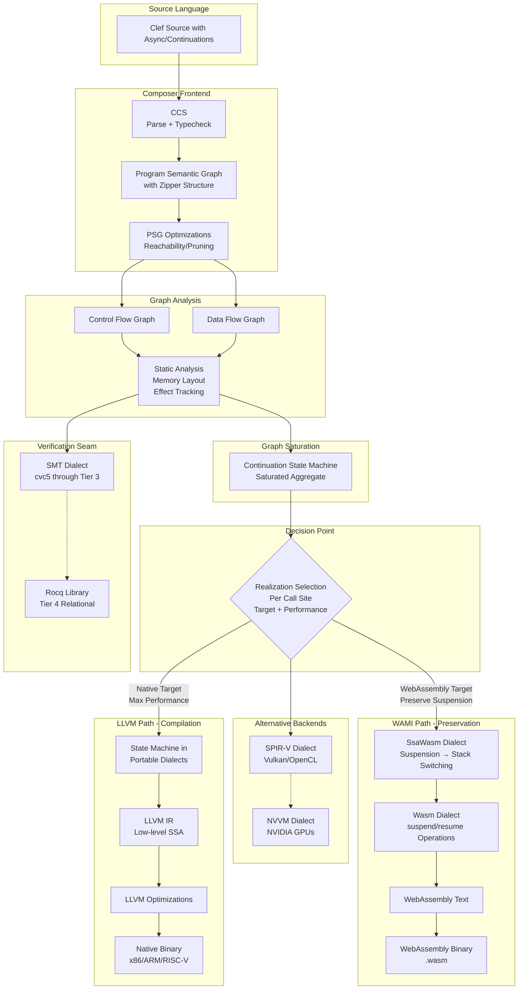
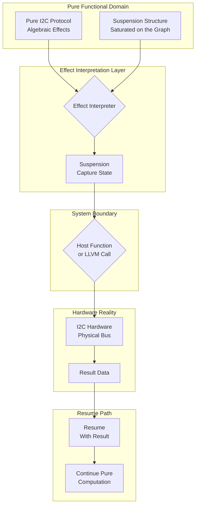
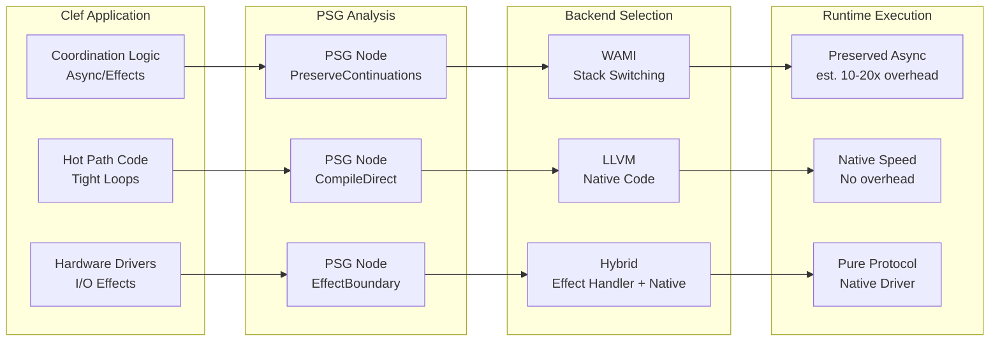

As we design Composer, we keep returning to one question: how far down the compilation stack can we preserve the abstractions that [our Clef language](https://clef-lang.com) is built on? Delimited continuations are the theoretical foundation for async/await, generators, and algebraic effects. We want to know whether they can survive the journey from high-level Clef through MLIR's SSA form to executable code, and whether they should.

The answer shapes whether we can build functional device drivers, whether async code can run without heap allocation, and whether Clef can compete with C for embedded systems. It forces a choice between abstraction and performance, between the mathematical structure of the source and the hardware it has to run on.

## The Preservation Boundary

Abstractions have lifespans in a compiler. They exist in the source language, persist across intermediate representations, and are lowered at the hardware boundary. Delimited continuations will be lowered eventually. That part is not in question. What we want to know is how far down the stack we can preserve them, and what that preservation buys us.

In our Composer architecture, delimited continuations appear as first-class citizens in our Program Hypergraph (PHG):

```fsharp
type PSGNode =
    | ContinuationStateMachine of {
        Delimiter: PSGNode              // the reset boundary: the CE block itself
        SuspendPoints: SuspendPoint list // each capture site with its state index
        CaptureSet: NodeId list         // values live across suspensions
        ResumeBlocks: PSGNode list      // per-suspension resume code
        Context: ZipperContext          // full surrounding context
        Metadata: ContinuationMetadata
    }
// async, actor receive, and generator regions all saturate to this one aggregate
```

At this level, we hold the full semantic information. The bidirectional zipper structure lets us navigate and transform the continuation while preserving its surrounding context. The continuation is still a mathematical object here, with the precise semantics the source assigned it, and saturation settles it into the aggregate above before any emission runs.

## The Fork(s) in the Road: WAMI vs LLVM

As we lower from our PSG through MLIR, we reach a decision point. The paths diverge here, and the choice determines both the performance characteristics and what survives to runtime.


```mermaid
flowchart TD
    subgraph "Source Language"
        FS[Clef Source with Async/Continuations]
    end

    subgraph "Composer Frontend"
        FS --> FCS[CCS<br/>Parse + Typecheck]
        FCS --> PSG[Program Semantic Graph<br/>with Zipper Structure]
        PSG --> PSGOPT[PSG Optimizations<br/>Reachability/Pruning]
    end

    subgraph "Graph Analysis"
        PSGOPT --> CFG[Control Flow Graph]
        PSGOPT --> DFG[Data Flow Graph]
        CFG --> ANALYSIS[Static Analysis<br/>Memory Layout<br/>Effect Tracking]
        DFG --> ANALYSIS
    end

    subgraph "Graph Saturation"
        ANALYSIS --> AGG[Continuation State Machine<br/>Saturated Aggregate]
    end

    subgraph "Decision Point"
        AGG --> DECIDE{Realization Selection<br/>Per Call Site<br/>Target + Performance}
    end

    subgraph "Alternative Backends"
        DECIDE --> SPIRV[SPIR-V Dialect<br/>Vulkan/OpenCL]
        SPIRV -.-> NVVM[NVVM Dialect<br/>NVIDIA GPUs]
    end

    subgraph "Verification Seam"
        ANALYSIS --> SMT[SMT Dialect<br/>cvc5 through Tier 3]
        SMT -.-> ROCQ[Rocq Library<br/>Tier 4 Relational]
    end

    subgraph "WAMI Path - Preservation"
        DECIDE -->|WebAssembly Target<br/>Preserve Suspension| SSAWASM[SsaWasm Dialect<br/>Suspension → Stack Switching]
        SSAWASM --> WASM[Wasm Dialect<br/>suspend/resume Operations]
        WASM --> WAT[WebAssembly Text]
        WAT --> WBIN[WebAssembly Binary<br/>.wasm]
    end

    subgraph "LLVM Path - Compilation"
        DECIDE -->|Native Target<br/>Max Performance| STATE[State Machine in<br/>Portable Dialects]
        STATE --> LLVMIR[LLVM IR<br/>Low-level SSA]
        LLVMIR --> OPT[LLVM Optimizations]
        OPT --> NATIVE[Native Binary<br/>x86/ARM/RISC-V]
    end
```

Composer had considered using a 'DCont' delimited continuation dialect in MLIR for continuations, but quickly realized that a specific MLIR dialect is not required. Our designs resolve them in native expression on the graph, the story [The DCont/Inet Duality](/docs/design/concurrency/dcont-inet-duality/#upward-migration) tells in full. The saturated aggregate retains the full semantic information about continuations, effects, and resource lifetimes, which is what lets us defer the preserve-or-compile decision to the correct stage of lowering: each call site selects its realization via joint resolution in the graph. Once witnessed to direct MLIR ops, the MiddleEnd's form and the target's own suspension primitive are the sole concern in lowering.

### The WAMI Path: Semantic Preservation

The Stack Switching proposal for WebAssembly brings delimited continuations in as a first-class feature. On the WAMI path we envision, Clef continuations would map onto it almost directly:

```fsharp
// Clef source
let processAsync() = async {
    let! data = readSensor()
    let! result = transform data
    return result
}

// PSG representation (saturated aggregate)
ContinuationStateMachine {
    Delimiter = AsyncBoundary
    SuspendPoints = [ ReadSensorSuspendPoint, 0 ]
    ResumeBlocks = [ TransformContinuation ]
}

// preserved on the WAMI path
ssawasm.suspend $sensor_read
```

The suspend/resume operations in the Stack Switching proposal are delimited continuations at the IR level. The mapping runs directly from the graph aggregate to the platform construct, with no intermediate encoding, and preserves the abstraction on a target that offers an equivalent one.

### The LLVM Path: Semantic Compilation

LLVM takes a different approach. It has no notion of delimited continuations, so we must compile them away:

```fsharp
// the same Clef source, compiled to a state machine
type ProcessAsyncStateMachine = struct
    val mutable state: int
    val mutable data: SensorData
    val mutable result: ProcessedResult

    member this.MoveNext() =
        match this.state with
        | 0 -> // Initial state
            readSensorAsync(&this.data)
            this.state <- 1
        | 1 -> // After sensor read
            transformAsync(this.data, &this.result)
            this.state <- 2
        | 2 -> // Complete
            setResult(this.result)
end
```

Here the delimited continuation semantics compile away into state machines, the abstraction does not survive the IR level, and explicit state management takes its place. This is compilation in the traditional sense, where high-level constructs become low-level implementations.

## The Preservation Paradox

The WAMI path preserves our abstractions but runs on a virtual machine that carries its own overhead. The LLVM path compiles those abstractions away and produces native code. Which one serves functional systems programming better?

The answer may be "both," and the elevation of the continuation into the graph is why "both" is coherent: the structure is held once, above every IR, and each call site selects the realization its target serves best. Nothing preserves the continuation inside the IR because nothing needs to.

## Building Pure Functional Hardware Drivers

The approach gets tested when we need to touch hardware. How do we maintain functional purity while reading from an I2C sensor or writing to SPI? We treat hardware access as algebraic effects, with delimited continuations as the implementation mechanism.

### Capabilities as Effects

In our PSG, hardware capabilities become effect types:

```fsharp
// Pure functional protocol description
type I2CEffect<'a> =
    | Start of addr: int7 * next: I2CEffect<'a>
    | Write of data: byte * next: I2CEffect<'a>
    | Read of count: int * cont: (byte[] -> I2CEffect<'a>)
    | Stop of result: 'a

let readTemperatureSensor =
    Start(0x44,
        Write(0xE0uy,  // command: read temperature
            Read(2, fun data ->
                let temp = (int data.[0] <<< 8) ||| int data.[1]
                Stop(float temp / 100.0))))
```

This protocol description is purely functional. It describes **what** to do without **doing** it. The delimited continuation machinery lets us suspend at each effect point.

### The System Boundary

Drivers become **effect interpreters** at the system boundary, using the same suspension machinery:


```mermaid
flowchart TD
    subgraph "Pure Functional Domain"
        PURE[Pure I2C Protocol<br/>Algebraic Effects]
        CONT[Suspension Structure<br/>Saturated on the Graph]
    end

    subgraph "Effect Interpretation Layer"
        PURE --> INT{Effect Interpreter}
        CONT --> INT
        INT --> SHIFT[Suspension<br/>Capture State]
    end

    subgraph "System Boundary"
        SHIFT --> HOST{Host Function<br/>or LLVM Call}
    end

    subgraph "Hardware Reality"
        HOST --> I2C[I2C Hardware<br/>Physical Bus]
        I2C --> RESULT[Result Data]
    end

    subgraph "Resume Path"
        RESULT --> RESUME[Resume<br/>With Result]
        RESUME --> CONT2[Continue Pure<br/>Computation]
    end
```

```fsharp
// the single interpretation point
let interpretI2C protocol =
    shift (fun k ->
        match protocol with
        | Start(addr, next) ->
            // Only here do we touch hardware
            HardwareEffect(I2CStart addr, fun () ->
                k (interpretI2C next))
        | Write(data, next) ->
            HardwareEffect(I2CWrite data, fun () ->
                k (interpretI2C next))
        | Read(count, cont) ->
            HardwareEffect(I2CRead count, fun bytes ->
                k (interpretI2C (cont bytes)))
        | Stop result ->
            k result)
```

On the WAMI path, these effects map onto host functions:

```fsharp
// the effect suspends the continuation
HardwareEffect(I2CRead count, continuation)
    // ↓
// preserved on the WAMI path
ssawasm.suspend $i2c_read
    // ↓
// host performs I/O and resumes with the result
ssawasm.resume %continuation (result)
```

The continuation structure survives this path. The host environment handles the hardware interaction while the functional structure stays intact.

### Selective Compilation

The way out of the paradox we see is selective compilation, driven by the performance requirements of each part of the program:


```mermaid
flowchart LR
    subgraph "Clef Application"
        COORD[Coordination Logic<br/>Async/Effects]
        HOT[Hot Path Code<br/>Tight Loops]
        HW[Hardware Drivers<br/>I/O Effects]
    end

    subgraph "PSG Analysis"
        COORD --> PSG1[PSG Node<br/>PreserveContinuations]
        HOT --> PSG2[PSG Node<br/>CompileDirect]
        HW --> PSG3[PSG Node<br/>EffectBoundary]
    end

    subgraph "Backend Selection"
        PSG1 --> WAMI[WAMI<br/>Stack Switching]
        PSG2 --> LLVM[LLVM<br/>Native Code]
        PSG3 --> HYBRID[Hybrid<br/>Effect Handler + Native]
    end

    subgraph "Runtime Execution"
        WAMI --> EXEC1[Preserved Async<br/>est. 10-20x overhead]
        LLVM --> EXEC2[Native Speed<br/>No overhead]
        HYBRID --> EXEC3[Pure Protocol<br/>Native Driver]
    end
```

```fsharp
// tight loop, compiled native via LLVM
[<CompileDirect>]
let processBuffer (data: Span<byte>) =
    for i in 0 .. data.Length - 1 do
        data.[i] <- lookup.[int data.[i]]

// coordination, continuations preserved via WAMI
[<PreserveContinuations>]
let orchestrateProcessing() = async {
    let! rawData = Sensor.readAsync()
    processBuffer rawData  // calls into the LLVM-compiled path
    let! result = analyze rawData
    do! Logger.writeAsync result
}
```

This hybrid approach gives us native performance in the tight loop while preserving the async coordination structure where its cost is warranted.

## Architectural Principles

A few principles for building a functional systems programming platform come out of this:

### 1. Preserve Until Necessary
Keep abstractions alive as long as they provide value. Delimited continuations give us composition and automatic resource management, so we retain them until performance demands otherwise.

### 2. Explicit Boundaries
Make the purity/effect boundary explicit and minimal. One interpretation point is easier to audit than effects scattered throughout the codebase.

### 3. Selective Lowering
Not all code needs maximum performance. Use native compilation for hot paths and preserved abstractions for coordination logic.

### 4. Effects as Protocols
Model hardware interactions as pure protocol descriptions. This enables testing, simulation, and reasoning without touching actual hardware.

## The Unforced Trade

Low-level programming is assumed to require low-level thinking: speed costs you your abstractions. We are designing Composer on the premise that the trade is not forced.

We can preserve high-level constructs as far as they are useful, and compile them away where performance demands. The coordination logic keeps its mathematical structure while the hot paths run at native speed.

This is what we are designing toward with selective compilation. By supporting both a WAMI (preservation) backend and an LLVM (compilation) backend, Composer can pick the right path for each part of a program. Delimited continuations can survive all the way to WebAssembly when that serves the design, or compile to efficient state machines when the path is performance-critical.

## Practical Implications

For embedded developers, this architecture is meant to enable purely functional device drivers with predictable performance. The sensor reading logic stays functional and testable:

```fsharp
let readMultipleSensors() = async {
    // concurrent reads via continuations
    let! temp = Temperature.readAsync()
    let! humidity = Humidity.readAsync()
    let! pressure = Pressure.readAsync()

    return {
        Temperature = temp
        Humidity = humidity
        Pressure = pressure
    }
}
```

The hardware access underneath compiles to native code, with no heap allocations and no runtime overhead on that path. The functional code at the top is meant to perform like C.

## Preservation-Aware Compilation

Designing Composer has shifted how we think about compilation. Compilation here holds abstractions as long as they provide value, as much as it lowers them. Delimited continuations can survive further down the compilation stack than the usual rules of thumb suggest.

On the WAMI path they survive into the runtime largely unchanged. On the LLVM path they compile away and leave behind efficient implementations. Both belong in a functional systems programming toolkit.

The decision does not have to be global. By making each preservation choice locally, against the performance requirements of that code, we keep hardware drivers functional. Async code runs without allocation, and Clef comes within reach of C for embedded work. This per-call-site choice is the same inferred-with-override discipline the framework uses elsewhere: the compiler infers a default, the developer reads it where it surfaces, and an annotation overrides it at the one site that needs steering. Escape classification assigns it to every mutable binding in [managed mutability](/docs/design/language/managed-mutability/), and the [wait classification for deadlock freedom](/docs/design/concurrency/deadlock-freedom-as-an-obligation/) assigns it to every synchronous RPC. Preservation is that discipline one axis over, on the lowering choice.

This is where we are taking the design. The continuation preservation paradox is the question that shapes the next stretch of work on Composer, and the per-call-site preservation choice is the part of the answer we will keep building toward as the rest of the toolchain comes into place.
