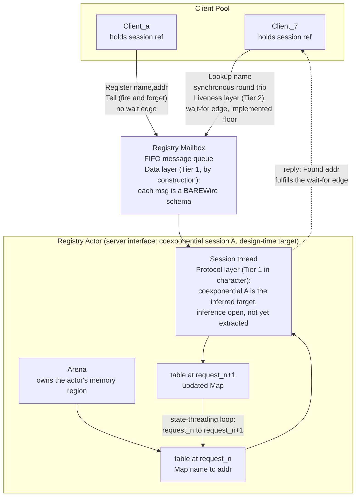

The boundary between Olivier actors is often described as if it carried a single obligation, the integrity of the message contract that BAREWire enforces. That description is incomplete. The actor boundary already carries two obligations in the present architecture, a data contract discharged at Tier 1 and a liveness contract discharged at Tier 2, and it has room for a third that sits between them and is not yet first class. That third layer is the protocol, the session type of the conversation a channel conducts over its lifetime. A session type is a linear-logic account of who may say what, and when, over a channel. The shape an Olivier actor needs is a stateful server that threads state across a growing pool of clients, and the connective that types it has a name in the recent literature: the coexponential of Qian, Kavvos, and Birkedal. Naming the layer is the work here. It rides the tier architecture the other two layers already use, so it asks for no new verification machinery, and reconstructing the session type automatically is still an open issue we will keep working as time and engineering allow. What is stated here is our current understanding, and we expect it to develop as the details of implementation emerge.

This is a proof-theory-heavy entry, and placing it in "Concurrency" rather than "Verification" is a deliberate choice. Clef is a concurrent language first, so a precise account of how the actor mechanism is designed matters on both mathematical and *mechanical* grounds. The harder half of the task is placing that mechanism on a range of hardware substrates. What follows is one way to deliver a well-formed distributed compute model onto any substrate that can support it, without giving up the computational integrity claims the framework makes.

## What the boundary carries today

[Actor-scoped RAII](/docs/design/memory/raii-in-olivier-and-prospero/#cross-process-references-with-raii) drives the memory-safety axis to the floor, and the [deadlock-freedom obligation](/docs/design/concurrency/deadlock-freedom-as-an-obligation/) handles the liveness axis for the statically resolvable fragment. Read together with the BAREWire contract, the inter-actor boundary already spans two tiers.

The **data contract** is the BAREWire message schema. Field shapes, dimensional metadata, and the graph-integrity proof that the schema survives elaboration are Tier 1 obligations over the abelian structure, free in the sense [the decidability sweet spot](/docs/internals/verification/decidability-sweet-spot/) develops: the dimensional constraints map to a fragment a solver settles in microseconds, and the proof is the elaboration byproduct rather than a separate annotation. This is the layer most readily associated with "the actor contract," and it is real, but it types one message at a time.

The **liveness contract** is deadlock freedom. A synchronous reply expectation contributes a wait-for hyperedge on the joint-constraint axis, and acyclicity of the wait-for relation is a Tier 2 obligation, a rank constraint in the same [QF_LIA fragment](/docs/internals/verification/decidability-sweet-spot/) the interval and bound checks use, discharged by the same solver path. This is a property of the boundary, not of the code inside any one actor, and it already lives above Tier 1.

The layer between them is the gap. BAREWire types the payload of a single message. Deadlock freedom constrains who waits on whom. Neither types the **conversation**: the order in which messages may be sent, the choices a participant may offer or select, and the way a stateful server evolves as it serves successive requests. That conversation is what the session type governs.

## The three-layer contract

The boundary is three contracts stacked on one channel.

| Layer | Content | Object | Tier placement |
|-------|---------|--------|----------------|
| Data | payload schema, dimensional metadata | BAREWire schema | Tier 1, by construction |
| Protocol | message ordering, choice, state threading | session type (coexponential for stateful pools) | Tier 1 in character; invariants at Tier 2; probabilistic or relational guarantees at Tier 3 or 4 |
| Liveness | progress, absence of deadlock | wait-for relation | Tier 2, a projection of the protocol layer |

The middle row is the one to develop. It slots into the existing machinery as richer labeling on an axis the framework already carries, and the bottom row is a shadow the middle row casts.

## Protocol fidelity is a Tier-1-character property

The protocol layer does not belong at Tier 2 alongside liveness, and the reason is the structure-and-content division the architecture runs on. Session fidelity is a by-construction property. The interface type of an actor entails the theorem "every conversation this actor conducts respects protocol S," and the proof of that theorem is the typing derivation, established once over the type system. This is the same shape as the parametric argument that makes dimensional consistency free, the algebraic structure [the double-annotation discovery](/docs/internals/verification/double-annotation-discovery/) surfaced: the type carries the structure, the program satisfies the theorem, and the proof is a separate object the type system supplies rather than a solver obligation the compiler dispatches per program.

So a session-typed actor interface carries protocol fidelity as a free property of its type, in the linear fragment, with no sum-valued semantics and no costructural rule in the operational calculus. The session type is structure. Protocol fidelity is the content it entails. The typing derivation is the proof. The lowering stays deterministic.

This placement is what keeps the protocol layer compatible with the compilation model. Cut elimination remains execution to a single artifact, because the session structure is carried at the type level and discharged by typing, rather than denoted as a superposition in the dynamics.

## The coexponential as the stateful-server connective

The multiplicative and additive connectives of classical linear logic type a bounded conversation: `A ⊗ B` and `A ⅋ B` for parallel exchange, `A ⊕ B` and `A & B` for internal and external choice. On their own they do not type a server that serves an unbounded and dynamically determined number of clients while threading state from one client interaction to the next. The standard exponential `!A` gives repetition without shared state, because contraction and weakening produce independent copies.

Qian, Kavvos, and Birkedal introduce the coexponentials `¡A` and `¿A` for this case. The coexponential is defined by a fixpoint isomorphism that unfolds a server into a choice between termination and a further client interaction that carries the server's state forward and provides for additional clients. The exact form of the isomorphism, and the orientation convention that fixes whether the connective decorates the client behavior or the pool that holds the clients, are taken from the paper; the two coexponentials are De Morgan duals, `(¡A)⊥ = ¿(A⊥)`, so the negation one expects on the consumer interface appears on the dual connective and is carried implicitly through cut.

This is the type theory of the stateful Olivier actor. An actor owns an arena, receives client requests serialized through its mailbox, and threads the arena state from one request to the next. That is a server holding a pool of clients and evolving state across their interactions, which is what the coexponential types. The correspondence matters for two reasons. It gives the stateful-actor pattern a proof-theoretic account inside the linear fragment, and it does so without any differential or sum-based machinery, which is the closer fit for the framework than any account that puts nondeterminism into the operational dynamics.

## A worked example: the registry server

A registry actor is one stateful server holding a registration table and threading that state forward across a pool of clients, each sending and receiving on its own session. Most of the traffic is asynchronous, but one leg runs synchronously: the client that issues a `Lookup` and blocks until the server answers. That single synchronous call is the wait-for edge the liveness layer ranks.

```fsharp
type RegistryMsg =
    | Register of name: string * addr: int        // tell: no reply
    | Lookup of name: string * replyTo: IActorRef // reply via the client's inbox
    | Tally of replyTo: IActorRef

type RegistryReply = Found of int | Count of int

let createRegistryBehavior() = actor {
    let rec loop (table: Map<string, int>) = async {   // state threads through the loop
        let! msg = Actor.receive()
        match msg with
        | Register (name, addr) ->
            return! loop (table.Add(name, addr))       // new table, no reply edge
        | Lookup (name, replyTo) ->
            replyTo <! Found (table |> Map.tryFind name |> Option.defaultValue -1)
            return! loop table                         // reply edge, table unchanged
        | Tally replyTo ->
            replyTo <! Count table.Count
            return! loop table
    }
    loop Map.empty
}

let system = Olivier.createSystem "registry-system"
let registry = Olivier.spawn system "registry" createRegistryBehavior

let client = Olivier.spawn system "client-7" (fun () -> actor {
    let replyPromise = Promise<int>()
    registry <! Register("svc-auth", 8443)             // fire-and-forget tell
    registry <! Lookup("svc-auth", Actor.self())       // self() is the reply channel
    let! Found addr = Actor.receive()                  // take the reply off the inbox
    replyPromise.Complete(addr)
    return replyPromise.Value
})
```

The state thread, `return! loop newTable`, is what the coexponential types: each request hands the table to the handling of the next. The reply is an ordinary message send back on the `IActorRef` the client passed as `Actor.self()`, which keeps the operational lowering deterministic. The wait-for relationship that the `Lookup` round trip induces is what Tier 2 ranks for acyclicity, and nothing in this code asserts a session type was reconstructed by the solver.

The diagram reads the three contracts off the same boxes and arrows. Every message arrow carries our BAREWire payload, and the data layer types that payload at each endpoint. The direction and ordering of the arrows is the protocol layer, the coexponential session structure the server and clients share, drawn as the design-time target it is rather than an extracted fact. The liveness layer lives on the one back-edge from a blocked client to the server it waits on, the place a cycle would deadlock and where the acyclic wait-for rank has to hold.



## How it rides the existing architecture

The protocol layer introduces no new verification axis. It is richer labeling on structures the framework already carries.

**Joint-constraint axis.** The session type of an actor interface is a hyperedge on the same joint-constraint axis that already holds region, lifetime, and wait-for edges. The wait-for edge is the projection of the session edge onto the liveness question. In session-typed process calculi, deadlock freedom is a corollary of typing; the framework currently extracts the lightweight slice of that corollary, the wait-for rank, without imposing full session typing. The protocol layer names the fuller object the slice is taken from.

**Tier ladder and mode shifts.** The graduated structure the framework uses for intra-actor computation applies unchanged to the protocol layer. The protocol shape is free at Tier 1 by typing. An invariant the server maintains across requests, for example that an accumulated counter stays within a range, is a Tier 2 obligation in QF_LIA. A probabilistic guarantee about the server's evolution, or a relational guarantee such as observational equivalence of two client orderings or a leakage bound across the client pool, is reached by [a mode shift](/docs/internals/verification/mode-shifts/) to Tier 3 or Tier 4, where the distribution lives over the abelian carrier or the relational judgment is checked against the pRHL library. The shift carries the obligation that the lower-tier structure admits the higher-tier refinement, and a round trip cancels, so the protocol layer reuses that discipline without adding to it. The trusted-base discontinuity is unchanged: Z3 alone through Tier 3, Rocq at Tier 4.

**BAREWire realization.** BAREWire carries the payload at Tier 1, and the session type governs the sequence those payloads form. Over a websocket or a network channel, the session type is the protocol the BAREWire transport realizes. The data contract and the protocol contract are two layers of one wire format, the first typing each message and the second typing the exchange. Both survive lowering for the same reason the dimensional and memory properties do, the property carried to the target rather than asserted at the source, which is the bar [from proofs to silicon](/docs/internals/verification/proofs-to-silicon/) sets through MLIR translation validation.

## The three obligations at the seam

The three obligations reach the compiler as attributes on the MLIR the seam reads. The data layer is settled by dimensional typing, so it arrives discharged at Tier 1 with no proof code to write. The protocol layer is settled by elaboration of the session structure at design time, discharged structurally rather than by a verification tier. The liveness layer emits an acyclic wait-for rank as a QF_LIA goal that Z3 discharges at Tier 2. Inferring the coexponential session type itself stays a design-time concern marked open, so the seam reads a checked annotation rather than a solved one.

The lowering below is the order-and-inventory system from [deadlock freedom as an obligation](/docs/design/concurrency/deadlock-freedom-as-an-obligation/), carrying all three attributes on one behavior.

```mlir
// illustrative dialect; op and attribute names are still settling
dcont.func @order attributes {
    verif.obligation = #tier1.barewire_schema,   // data
    session = #session.coexp_proposed            // protocol: proposed shape, inference open
} {
    %r = dcont.suspend_on_reply %callee : !actor.ref<"inventory">
        { rpc.wait_edge = #wait<from = "order", to = "inventory"> }   // liveness
}

module @order_system attributes { verif.obligation = #tier2.acyclic_wait } {
  // actor behaviors and their suspend_on_reply ops
}

%edges = collect rpc.wait_edge in @order_system
smt.assert (forall (u v) (=> (wait %u %v) (lt (rank %u) (rank %v))))
smt.check   // sat: acyclic. unsat: the core is the cycle, reported as CCS8031
 
```

The data attribute carries no arithmetic to the solver, because the schema property is the elaboration byproduct. The session attribute carries the protocol shape as type-level structure that typing checks, not as a goal the solver reconstructs. Only the liveness layer becomes an SMT goal, the same acyclic-wait rank the deadlock-freedom obligation discharges, so the protocol layer adds two attributes to the seam and one of them never leaves the front end.

## Inference, not annotation

The deadlock-freedom design declined the full session-typing disciplines of CP and Priority CP because their costs, the tree restriction and pervasive priority annotation, are the ceremony the framework refuses on principle. The protocol layer respects that decision. The rule is the one already applied to [escape classification](/docs/internals/verification/memory-coeffect-algebra/) and to wait classification: the session type is inferred from actor behavior and surfaced only when inference needs help, never hand-written in the manner of GV.

The coexponential supplies the semantic target for that inference. It says what a stateful-server interface means, so that the compiler has something definite to reconstruct. The developer writes ordinary actor code, the analysis infers the session structure as it infers escape kind and wait class, and the inferred type is displayed when a conflict or an ambiguity needs developer attention. The protocol layer is a citizen of the same inferred-with-override regime as the rest of the boundary, not a new annotation burden.

## One type theory across both frameworks

The coexponential server is not specific to native Olivier. A Cloudflare Durable Object, a single stateful instance serving many edge clients over a persistent connection, is a coexponential server in the same sense. The unified-actor work already bridges Olivier actors and Durable Objects on the premise that both execute the same continuation-based pattern. The protocol layer sharpens that premise: both are stateful servers holding a client pool, both are typed by the coexponential, and both carry BAREWire on the wire. The protocol layer is therefore shared type theory across Clef-native concurrency and Fidelity.CloudEdge, and developing it pays into both at once.

## Open problems and honest scope

The coexponential calculus is recent. Qian, Kavvos, and Birkedal established the connectives and their cut-elimination in 2021. Two things are not established.

The first is inference. Reconstructing a coexponential session type from actor behavior, without developer annotation, is not a solved problem, and the inferred-with-override posture this note requires depends on it. The fragment that can be inferred cheaply, and the fragment that requires developer assistance or falls back to the wait-for slice already in place, is the boundary to map. This is the same shape of question the deadlock-freedom work answered for the wait-for relation, now asked of the richer object.

The second is the relationship between the protocol layer and the liveness slice already implemented. The wait-for analysis is sound and present in the design; the protocol layer is the object it projects from. The development preserves the wait-for analysis as the floor, available whenever the fuller session type is not inferred, so that declining to reconstruct the protocol never weakens the liveness guarantee.

Nothing here moves the decidability of any tier. The protocol shape is free by typing, its invariants are ordinary Tier 2 obligations, and its probabilistic or relational guarantees are the existing Tier 3 and Tier 4 machinery reached by the existing mode shift. What is new is the layer itself and its connection to the rest of the architecture, not a decision procedure.

## A proof-carrying account of shared state inside linear logic

The protocol layer is where the framework's position on shared mutable state becomes constructive. The coexponential types a stateful server serving an unbounded client pool, which is the shared-state pattern that motivates richer logics, and it does so inside the linear fragment, with no sums, no costructural rule in the dynamics, and no departure from the discipline the rest of the architecture holds. Placed at the actor boundary and inferred rather than annotated, it gives the framework a proof-carrying account of shared state that integrates with the tiers, rides the joint-constraint axis, and keeps the operational layer deterministic. The sum, where it is wanted at all, stays in the verification tiers as a distribution over the abelian carrier, not in the operational calculus. This is the design we will keep building toward as the actor runtime matures and the inference question comes into focus.

---

## Related Reading

### Clef Design Documents

- [Deadlock Freedom as an Obligation](/docs/design/concurrency/deadlock-freedom-as-an-obligation/) - The liveness layer, the wait-for relation, and the inferred-with-override discipline this note extends
- [The DCont/Inet Duality](/docs/design/concurrency/dcont-inet-duality/) - The compilation lanes the actor boundary lowers through
- [Delimited Continuations](/docs/design/concurrency/delimited-continuations/) - The continuation structure under async, actors, and RPC
- [Transparent Verification](/docs/internals/verification/) - The four-tier architecture, the abelian carrier, and the mode-shift discipline

### External References

- [Client-Server Sessions in Linear Logic](https://dl.acm.org/doi/10.1145/3473567), Qian, Kavvos, Birkedal (ICFP 2021) - The coexponentials `¡A` and `¿A` and their cut-elimination
- [Propositions as Sessions](https://homepages.inf.ed.ac.uk/wadler/papers/propositions-as-sessions/propositions-as-sessions.pdf), Wadler (ICFP 2012) - Session types in correspondence with Classical Linear Logic
- [Better Late Than Never: A Fully-Abstract Semantics for Classical Processes](https://arxiv.org/abs/1811.02209), Kokke, Montesi, Peressotti (POPL 2019) - HCP and deadlock freedom by typing
- [Prioritise the Best Variation](https://arxiv.org/abs/2103.14466), Kokke, Dardha - Priority-based deadlock freedom for cyclic topologies
