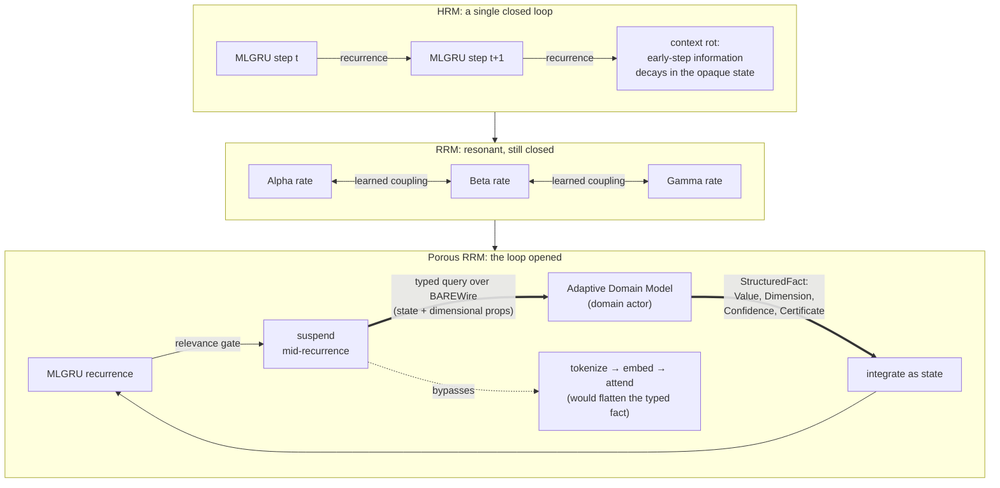

From our design perspective, the failure people call a context problem is a property of one recurrence, not a law of cognition. A single recurrent loop processing a long input has to fit every commitment it has made into one state vector, and as the sequence runs the early commitments decay against the later ones. The recurrence entry names that decay precisely: it is [context rot](), the degradation of early-step information across a long closed loop. A direct token-based model exhibits the same decay for the same reason, and an entire industry has grown up to slow it.

We read context rot as a consequence of holding everything in a closed loop. The cure our design pursues is to open the loop so that anything which can be consulted is never held, and anything which can be summarized exactly is never re-attended.

## The progression the architecture follows

Our recurrence design moves through three stages, set out in full in [Typed Recurrence and Categorical Control of Inference](). The Hidden Recurrent Model is the baseline. A single recurrent loop, an MLGRU in the [matmul-free lineage](https://arxiv.org/abs/2406.02528) our design follows, processes input sequentially with an opaque hidden state, and the loop is closed: it must encode every piece of reasoning, including any domain knowledge it needs, inside its own recurrence. Context rot lives here, in the state vector forced to hold what a long sequence keeps adding to it.

Our Resonant Recurrent Model adds structure inside that loop. The recurrence runs at N resonant levels with learned coupling between them, so information circulates at several timescales at once, the Alpha, Beta, and Gamma rates. This organizes the computation into interacting temporal scales and mitigates the decay within the loop, and the loop stays closed to external state. It is the bounded recurrence our [sub-quadratic generator]() carries: a complex-rotational state that summarizes the past instead of re-attending to it, and the type discipline is designed to keep its decomposition exact through training. A bounded recurrence has nothing to evict, because the state already is the summary the past was compressed into.

Our Porous Recurrent Model opens the loop. At designated steps the MLGRU suspends mid-recurrence, emits a typed query to a domain-specific actor, an Adaptive Domain Model, and integrates the typed response as intermediate state before resuming. The query is not "process this text" but a request for the posterior over a domain question given the current recurrent state and its dimensional properties. The response re-enters the loop as a StructuredFact carrying typed Value, Dimension, Confidence, and Certificate fields, and it crosses over BAREWire, the structured contract both the recurrence and the actor were built to interpret, so the fact arrives with its dimensional annotations intact. It bypasses the tokenization, embedding, and attention path entirely, the path that would have flattened its typed structure into a stream. The model no longer encodes all domain knowledge in its weights; it consults a typed specialist and integrates the answer under dimensional and coeffect constraints.



The shape of one designated step, in the section's illustrative idiom. The Clef here is illustrative of the idiom rather than a finalized API surface, and the four StructuredFact fields are fixed by the recurrence entry.

```fsharp
// The fact an Adaptive Domain Model returns into the recurrence.
// It crosses BAREWire as typed structure: the Dimension and Certificate
// would not survive a tokenize-embed-attend round trip.
type StructuredFact<[<Measure>] 'Dim> =
    { Value      : float<'Dim>            // dimensioned, e.g. mol/L or USD
      Dimension  : DimensionalType<'Dim>  // the DTS annotation, checked at the fabric
      Confidence : Interval               // the ADM's Bayesian posterior, not a softmax
      Certificate: PhgCertificate }       // the actor's discharged structural proof

// A typed query carries the recurrent state and its dimensional properties,
// not a tokenized prompt.
type DomainQuery = { State : RecurrentState; Props : DimensionalType list }

// One designated step of the porous loop: advance the resonant recurrence,
// and on a relevance gate suspend, consult a typed actor over BAREWire,
// integrate the returned fact as intermediate state, resume.
let porousStep (mlgru: MLGRU) (adm: DomainActor) (h: RecurrentState) : RecurrentState =
    if not (mlgru.IsDesignatedStep h) then
        mlgru.Advance h                       // closed-loop advance, as in the RRM
    else
        let query = { State = h; Props = mlgru.DimensionalProps h }
        let fact  = BAREWire.consult adm query  // typed in, typed out; a mismatch
                                                // surfaces at the message fabric
        mlgru.IntegrateAndResume (h, fact)      // grounded state re-enters under
                                                // dimensional and coeffect constraints
```

The integration of a StructuredFact is independently supported by what the lineage already measures. The [λ-RLM framework](https://arxiv.org/abs/2603.20105) of Roy et al., titled for solving long-context rot with the lambda calculus, ties the recursion of an LLM externally with a fixed-point combinator and invokes the neural oracle only on bounded subproblems. It outperforms standard recursive LLM approaches in 29 of 36 model-task comparisons, with accuracy gains up to 21.9 points and latency reductions up to 4.1x, which establishes that typed structural control around neural inference produces measurable gains. Its combinators decompose problems by size, by Split, Map, and Reduce, and the work it leaves open is the one our porous loop is designed for: a query decomposed by domain semantics, answered by a domain-specialized posterior, integrated as typed state. Our consultation fills exactly the gap where structural decomposition has no mechanism for domain-specific posterior distributions.

## The industry working on the closed loop from outside

The compression literature is careful engineering aimed at the same decay, approached from the surface of a token-based model rather than from its recurrence. [LLMLingua](https://github.com/microsoft/LLMLingua) and its successors score each token with a small language model and drop the ones it reads as low-information, up to twentyfold. Gist-token methods fine-tune the model to fold a prompt into a handful of learned vectors. On the cache side, StreamingLLM keeps a few attention-sink tokens and a sliding recent window and evicts the middle, the Heavy-Hitter Oracle keeps the tokens with the most accumulated attention and discards the rest, and a run of quantizers squeezes the key-value cache to a fraction of its bits. [Headroom](https://github.com/chopratejas/headroom) sits in front of the stack as a proxy, compressing logs and JSON and tool output and stashing the originals in a side cache the model can ask for back.

These approaches share three properties. Each works from the outside in, on the stream or the cache, after the architecture has already committed to tokenizing everything and attending across all of it. Each guesses what matters, by perplexity, by attention mass, by a learned mask, and a guess can drop the load-bearing token; there is by now a literature on when it does. And each pays for recall with loss or with a side cache: the dropped tokens are gone, or the originals sit in a store the model has to round-trip to reach. They mitigate context rot at the layer where the flat stream already exists, which is the only layer available to a model whose loop stays closed.

| Technique | What it acts on | How it guesses importance | What our porous design holds instead |
| --- | --- | --- | --- |
| [LLMLingua](https://github.com/microsoft/LLMLingua) and successors | the token stream | per-token perplexity from a small LM | no stream between nodes; BAREWire carries typed values |
| Gist tokens | the prompt | learned vectors folding the prompt | a StructuredFact already is the compact typed form |
| StreamingLLM | the key-value cache | attention sinks plus a sliding window | a bounded resonant recurrence has nothing to evict |
| Heavy-Hitter | the key-value cache | accumulated attention mass | the recurrence already summarizes the past it kept |
| KV quantizers | the cache bits | uniform bit reduction | our b-posit substrate concentrates precision near where activations sit, with the quire carrying the tails |
| [Headroom](https://github.com/chopratejas/headroom) | logs, JSON, tool output | proxy compression with side-cache recall | a typed query to an actor; recall is consultation, not a fetch |

The right-hand column is not a competitor on the same axis. Each entry settles by construction the question the technique to its left settles by heuristic. Where context still has to be held inside a node, the bounded recurrence holds it, and a state from further back is recovered by the [reversible core]() running its typed adjoint backward to the exact earlier value, so recall is a recomputation guaranteed by type rather than a fetch from a store or an entry that was evicted and is gone. Where context can be answered elsewhere, the [constellation]() routes the work to a typed domain model that answers over its own structure, so the language node holds intent and a few typed handles rather than the whole working set of every task at once.

## Reaching the design by adaptation

An organization arrives at this design across the [adoption gradient](), rung by rung. At the first rung the porous node is still a rented, token-based model running a closed loop, and the token tax is real; this is exactly where the compression tooling does honest work, easing the load of a component on its way out. Each rung sheds more of the closed token-based representation: a model grounded in a bounded recurrent state, then a built node whose traffic between actors is typed and whose recurrence can suspend to consult. The change is a walk rather than a jump, and each step rides on the efficiency the one beneath it already produced.

The practical payoff is what a practitioner can rely on rather than measure. A recall that the type discipline recovers exactly does not drift silently mid-context, so long-range behavior stops being a thing validated empirically after training and becomes a thing the construction carries. A domain answer that arrives as a StructuredFact with a Certificate is checked at the message fabric, so a dimensional mismatch surfaces structurally, at design time, rather than as a degraded output discovered downstream. And a constellation that distributes work across typed actors holds far less in any one loop, so the decay that long context produces in a closed recurrence has less to act on. The mechanism underneath those guarantees is one our work shares with the field, the sub-quadratic recurrence the [state-space lineage]() converged on, typed so its structure is a fact rather than an aspiration.

The compression ecosystem is a fair measure of the problem: a large and inventive field, all of it aimed at making a flat token stream cheaper to carry. From our design perspective the stream is the representation to give up rather than the one to optimize. Our attention is a layer down, in a recurrence that opens to consult a typed specialist rather than swelling to hold everything itself: a context that is terse because it is structured, recalled because it is reversible, and divided because it is typed. We think that is where the durable answer to context lives, in the shape of the computation rather than in any pass run over its output, and it is the design we will keep building toward as the rest of the constellation comes into place.
