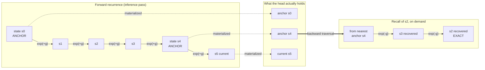

The negative and fractional types were developed for a concrete purpose: reasoning about memory, lifetimes, and reversible allocation in our Clef memory model. A negative type, in that setting, is the additive adjoint of a value, the formal trace of something given back, and the discipline lets the compiler reason about allocation and reclamation as exact inverses rather than as a runtime bookkeeping convention.

The claim here is larger than the engineering use that follows from it. A type that expresses exact reversibility is not only a memory-management construct. It is a statement about computation, that a step can be undone exactly, and a learned model is full of steps. The negative type has a second reading, as a design-time assertion that a piece of a model's computation is reversible with proven exactness, and under that reading a line of work the field has not pursued becomes available: using type theory at construction rather than after the fact: shaping what the model is by making reversibility a property the type system carries and the compiler exploits.

The engineering payoff below, a recurrent cache that is partly virtual, is real and worth having, but it is the first instance of the idea, not its boundary. The idea points at a useful exertion of type theory into model building, a place where a type-theoretic contribution does work that statistical machine learning has no other way to do. The field has reversible architectures, built by convention and trusted by construction. It does not have a type discipline that makes reversibility a proven, compiler-exploitable property of a model's internals.

## The Cost of Recall

Recurrent and cache-augmented sequence models hold a memory of earlier hidden states so that a long context stays available for recall. As the sequence proceeds, checkpoints of hidden states accumulate and the effective memory grows with sequence length. The cost being managed is storage. Holding every hidden state across a long context is expensive, and the question is which states to keep.

This is an inference-time concern, and it differs from training-time activation checkpointing. The [forward-mode article]() discussed the activation tape that reverse-mode training stores and forward-mode avoids. That is a training concern, recovered in a structured backward sweep. Inference recall is different: there is no backward gradient pass, so the only requirement is to recover an earlier hidden state when the current computation needs to attend to it. The access pattern is arbitrary, since the current token may need a state from far back, or several scattered states, depending on what it attends to.

## Recomputation in Place of Storage

If the recurrent state transition is reversible, the earlier states need not be stored at all. The model holds the current state, and a state from some steps back is reconstructed by applying the inverse transition that many times. This is the established reversible-computing answer to a storage-versus-recomputation tradeoff, and the substitution itself is prior art from the reversible-residual and reversible-RNN literature. What our framework adds is a type discipline and an exactness guarantee.

A [CRATE-style layer]() is a residual block, a gradient step on the coding rate added back to its input, and a residual block is the form that admits a reversible variant. Where the block's step carries a typed adjoint, the layer would run backward as well as forward, which is what turns the storage-versus-recomputation tradeoff above into exact recall.

The negative type is the additive adjoint that carries the backward transition as a first-class construct. The same machinery our memory model uses for inferring lifetimes and reasoning about reversible allocation supplies, here, an inverse transition that exists by the type discipline rather than by architectural convention:

```fsharp
// Reconstruct a state k steps back by running the typed adjoint k times, storing nothing.
let reconstruct (current: HiddenState) (k: int) (step: ReversibleTransition) : HiddenState =
    let inverse = Negative.adjoint step    // the backward transition, type-informed
    Seq.fold (fun s _ -> inverse s) current (Seq.replicate k ())
```

Because the access pattern is arbitrary, reversibility does not eliminate the cache; it changes the operating point. Recovering a state a few steps back is cheap. Recovering one far back costs many inverse applications. The natural structure is hybrid: store sparse anchor checkpoints, and reconstruct the states between them by running the adjoint from the nearest anchor. This is the sparse-anchor-plus-reconstruction pattern of gradient checkpointing, transposed to inference recall and powered by the negative-type adjoint rather than by recomputation from a stored input.

## Verified-exact reconstruction

The reversible-architecture literature builds models reversible by construction and trusts the construction. Our framework is designed to do more: the state transition is typed so that its adjoint exists and the round trip is the identity, with that obligation discharged through the verification machinery. Under that discipline, a reconstructed state is required to be the exact earlier state, not an approximation.

The purpose of the cache is fidelity of recall. If a reconstructed state drifts from the true earlier state, the recall is silently corrupted, and the model continues producing plausible output from a wrong state, which is the kind of error that does not announce itself. A verified-exact reconstruction would remove that failure mode by construction, and it is a stronger guarantee than architectural reversibility, because the property carried is the exactness of the round trip, not merely its existence.

The exactness depends on the arithmetic, which is where this article rejoins the [architecture article](). A reversible transition is reversible in exact arithmetic and not under rounding, because the forward and inverse operations do not round to inverse results. The quire and [b-posit discipline](https://arxiv.org/abs/2603.01615) that keeps the rate objective sharp is the same discipline that makes the round trip exact rather than approximately reversible, because exact accumulation is what closes the gap between exact-arithmetic reversibility and machine reversibility. The reversibility guarantee is conditional on the same substrate the rest of the section already committed to.

## Store versus reconstruct as a compile-time placement decision

We treat how much of the cache to materialize versus reconstruct on demand as a compile-time decision rather than a runtime heuristic: it is a coeffect the compiler resolves, in the way our memory model resolves where values live. On a memory-constrained inference target, an edge accelerator, the intended behavior is to store sparse anchors and reconstruct aggressively through the adjoint, spending compute to save memory. A memory-rich target inverts the balance: store densely, reconstruct little, spend memory to save compute. The escape and lifetime discipline that already decides placement extends with a store-versus-recompute axis for the recurrent cache, resolved against the target's memory hierarchy and the model's recall-distance profile.

This is the layer the model-architecture literature does not reach. A published cache mechanism proposes a cache and ways to manage it at the model layer. The placement of that cache, the operating point between storage and reconstruction, and the per-target variation of that operating point are compilation concerns, and they are our framework's heterogeneous-targeting claim applied to the inference cache. A reversible model variant compiled through our framework would have a cache that is partly virtual: reconstructed on demand with verified fidelity, and placed at the operating point each target's memory hierarchy dictates.

## The binding constraint

Only the reversible part of a transition can be reconstructed this way. A transition that discards information, a lossy nonlinearity or a dimension-reducing projection, has no adjoint, and the prior state cannot be recovered by running backward. This is the constraint the reversible-architecture literature lives under, and our framework does not relax it. Recurrent models compress context precisely through lossy operations, so a published cache-augmented model is not reversible, and this machinery does not extract reversibility from a model that was not built to have it.

The substitution applies to a model designed to be reversible in Clef, where the state transition is kept information-preserving so the adjoint exists, and whatever representational cost that constraint imposes is accepted in exchange for the virtual-cache and verified-recall benefits. Whether a usefully expressive recurrent model can be kept reversible enough for its recall to be reconstructable is the open question, and it is the same question the reversible-architecture literature wrestles with. The framework does not lower that price. It would make the reversibility a verified property and exploit it for placement once paid.

## The Shared Generator

There is a connection here to the sub-quadratic thread the [constellation article]() develops. A model is sub-quadratic when it summarizes the past in a recurrent state instead of re-attending to every earlier token, and the summary is produced by a state transition that is the exponential of a generator. A model is reversible when that state transition has an exact adjoint, the exponential of the negated generator. The two properties are read off the same object: a transition built from a graded one-parameter-group generator is sub-quadratic because it is a recurrence, and reversible because the generator negates. The decay-and-rotation generator that gives the linear-attention and state-space families their sub-quadratic cost is, when it is information-preserving, the reversible transition this article reconstructs from.

The field's sub-quadratic models drift because their generator's grade structure is not held exact through training, as the constellation article argues. That same unheld generator is also not cleanly reversible, because floating-point forward and inverse steps do not compose to the identity. [Mamba-3](https://arxiv.org/abs/2603.15569) reintroduced complex-valued state transitions precisely because the rotational dynamics they provide add expressivity, and a rotation is the one transition that is exactly invertible by negating its angle. The newest models are therefore moving toward generators that are, in principle, cleanly reversible, while still computing them in arithmetic that does not preserve the round trip. Typing the generator buys three things at once from one construction: the sub-quadratic cost, because it is a recurrence; the exact structure, because the grade decomposition holds through training; and the verified reversibility this article needs for inference-time recall, because the adjoint is exact. Sub-quadratic, structurally exact, and reversible are three consequences of one typed generator. The hardware payoff would compound accordingly: a model linear in context, sparse in structure, and able to trade stored state for recomputed state against each target's memory hierarchy.

## The Cost of Drift

Set the algebraic framing aside for what reversibility buys in practice, a consequence larger than the storage saving that motivated it. A sub-quadratic model works by compressing the entire past into a fixed-size [recurrent state](/docs/design/categorical-foundations/structured-recurrence/). When a later token needs something from earlier in the sequence, the model is relying on that state to still faithfully contain it. In the ordinary construction there is no way to check: the state is whatever the recurrence produced, recall is whatever the state yields, and if the state has quietly drifted from what the earlier tokens actually established, the model produces a confident answer from a corrupted memory with no recourse to correct it. This is the failure mode that makes long-context behavior in these models hard to trust, and it is invisible precisely because the model never reconstructs the earlier state to compare against.

A reversible, verified transition changes the kind of guarantee available. Because the transition has an exact adjoint, an earlier state is not merely *estimated* from the current one. It is *recovered*, and recovered to the exact value it held, with the round-trip identity discharged rather than assumed. This moves the reliability of long-range recall from a property one hopes the training instilled to a property the construction guarantees, and it limits drift not by training against it but by making the backward step exact.

### Two senses of reversible

The claim has two senses that are easy to conflate. There is *structural* reversibility, a static property carried in the type strata: the negative type is the adjoint of the transition, and the type system certifies that an inverse exists and that the round trip is the identity. And there is the *runtime traversal mechanism* itself: an attention head whose state actually steps backward, in real arithmetic on real hardware, to reconstruct an earlier value during inference. The first is a guarantee about the program. The second is a thing the program does. The framework's contribution is to make the second sound by discharging the first, but they are not the same claim.

Structurally, the transition and its adjoint are a typed pair. The forward step advances the state. The backward step is the adjoint, and the type discipline certifies they compose to the identity:

```fsharp
// Structural reversibility: the type strata carry the adjoint as a first-class
// pair, and the round-trip obligation is discharged once, statically.
type ReversibleStep<'State> =
    { forward  : 'State -> 'State
      backward : 'State -> 'State          // the negative-type adjoint
      // Discharged at compile time: backward (forward s) = s, exactly.
      roundTrip : RoundTripWitness<'State> }

// For a generator-based head the pair is the exponential and its negation,
// which is why a rotational (complex) transition inverts cleanly: negate the angle.
let stepFromGenerator (g: GradedGenerator<Bivector>) : ReversibleStep<HeadState> =
    { forward   = applyExp g                 // exp(+g): advance one position
      backward  = applyExp (Generator.negate g)   // exp(-g): retreat one position
      roundTrip = Verifier.dischargeRoundTrip g }  // exp(-g) ∘ exp(+g) = id
 
```

The runtime traversal is where this becomes a mechanism rather than a guarantee. An attention head carrying a reversible recurrence holds its current state and can run the backward step to reach an earlier one, on demand, during inference. The traversal is the forward recurrence's mirror, and it is the same arithmetic substrate that makes it exact rather than approximately reversible:

```fsharp
// Runtime traversal: step the head's state backward to an earlier position.
let recallAt (head: ReversibleHead) (current: HeadState) (stepsBack: int) : HeadState =
    // Each backward application reverses one position of the recurrence.
    let step = head.reversibleStep
    let rec retreat state n =
        if n = 0 then state
        else retreat (step.backward state) (n - 1)
    retreat current stepsBack
```

### Runtime Behavior of a Reversible Head

The mechanism's behavior at runtime determines whether the guarantee is worth its cost. A reversible head does not store the full history of its states. It stores the current state and, by the [placement decision]() the compiler makes, a sparse set of anchor states. Recall of an earlier position runs the backward step from the nearest anchor, so the runtime cost of a recall is the number of backward steps from that anchor, traded against the memory the anchors would otherwise occupy.

We are early in this design, and the runtime traversal as we currently conceive it would run as follows. The forward recurrence advances the head state position by position, materializing an anchor only at a chosen stride. When a later position needs to recall an earlier state, the head retreats from the nearest anchor by running the backward step, reconstructing the intervening states exactly rather than reading them from a store that was never kept:



In our reversible attention heads, this means a recall is not a memory lookup but a short backward recurrence, executed in the same head that runs the forward pass, on the same b-posit and quire arithmetic. The substrate carries the exactness: a backward step in IEEE-754 would not land on the forward step's inverse, and the reconstructed state would drift from the true one, which would defeat the purpose; the quire's exact accumulation is what makes `backward (forward s)` equal to `s` on the machine and not merely in the idealized algebra. The diagram's two anchors and three-step retreat are the operating point the compiler chose. A memory-richer target would place anchors more densely and retreat fewer steps; a memory-poorer one would place them sparsely and retreat more. The recall is exact wherever on that spectrum the target sits.

A reversible head trades compute for trust: where an ordinary head reads whatever its single state yields, a reversible head may run several backward steps to reconstruct the state it needs, and it accepts the constraint that its transition be information-preserving, which the [binding constraint]() section above states is not free. What the trade buys is the thing the ordinary attention head cannot offer: a recall that is provably the value the head held, on hardware, at inference time, rather than an estimate the model hopes is faithful. For an attention mechanism meant to carry information across a long context, the difference between "the state probably still contains this" and "the state provably still contains this" is the difference between a mechanism you must validate empirically and one whose recall is correct by the same discipline that bounds the rest of the constellation. Reliability stops being a thing measured after training and becomes a thing built into the traversal, the posture our framework takes everywhere else, now brought to the places a sub-quadratic model is most likely to fail silently.

## One Generator on Both Sides

The reversible core connects to the positional-encoding structure the constellation article isolates. The [constellation article]() showed that the admissible positional encodings are one-parameter subgroups, the exponential of a graded generator, with the antisymmetric part a rotor and the defective part a translator. A reversible state transition is itself a one-parameter-group action when it is the exponential of a generator, and its inverse is the exponential of the negated generator. The reversibility this article relies on is therefore the same group-theoretic object the positional-encoding analysis isolated: where the transition is built from graded generators, the adjoint is exact and grade-preserving by the same algebra that keeps the positional-encoding generator inside its admissible decomposition.

The typed positional encoding the constellation article develops and the reversible core this article develops look like two applications of one structure. A transition built from graded one-parameter-group generators would be simultaneously that encoding and that reversible core. Whether the two coincide in a usable architecture is a discovery question, and it is the question this frontier turns on: our framework's type machinery, held back from the language model's bulk by the scope rule of the scaffold article, applies at exactly the point the algebra admits it: the graded generator that is at once an encoding and an adjoint.

## The frontier

This is a design theory with one instance worked through. The instance, a verified-reversible cache placed by the compiler against a target's memory hierarchy, is enough to show the idea is not vacuous: the work it would do is checkable. The worked instance demonstrates the idea without bounding it. The contribution is the reframing of a type, from a memory-management construct into a design-time assertion about reversible computation inside a model, and the claim that this reframing opens a useful and largely unexplored line of work.

The field has spent its type-theoretic energy on verification after the fact, checking that a trained artifact has properties it was hoped to have. The negative type belongs at construction instead: shaping what a model is by carrying a proven property, exact reversibility, through the type system and into the compiler's placement decisions. That is a different relationship between type theory and machine learning than the field currently has, and it is the relationship the [ADM program](https://arxiv.org/abs/2603.18104), collected in [A Deeper Dive](), argues for, here pushed one step past the typed domain models into the internals of a learned transition. A type theory built for memory turns out to have something exact and useful to say about the computation a model performs. The type-theoretic contribution to this field has barely been started.

Our framework's reading of [*Principles and Practice of Deep Representation Learning*](https://ma-lab-berkeley.github.io/deep-representation-learning-book/) diverges furthest from the common one here. The book's §6, on consistent and self-consistent representations, is the closest the book comes to reversibility: closed-loop transcription and autoencoding both turn on a representation that can be carried forward and recovered. The common reading treats that recovery as an approximate reconstruction trained to be good enough, a reconstruction loss minimized. Our framework reads it differently, asking for the round trip to be *exact by type*, the negative type's adjoint discharged to identity, which is a property §6's autoencoding objective approaches asymptotically and never asserts. Where the book trains toward self-consistency, the framework types it. That is the same alignment-and-divergence the rest of the section describes, carried into the one corner of the book that already gestures at reversibility, and it is why this frontier is continuous with the program rather than a departure from it.

## A Research Agenda

These open questions are the shape of that frontier, an agenda to pursue.

Whether a recurrent transition can be kept reversible enough to be reconstructable while remaining expressive enough to be useful, and what representational cost the constraint imposes, is the question that decides how far the design theory reaches into real architectures. Reversible-architecture work faces this same open question. Our framework's contribution is to prove reversibility as a property, not to reduce its representational cost.

Whether the quire-and-b-posit discipline makes the round trip exact for the transitions of interest, or whether additional discipline is needed at the hidden-state arithmetic, is the substrate question continuous with the [architecture article's]() posit-taper experiment. The two share an apparatus, because both ask how exactness behaves under the framework's numerics during real computation.

Whether the store-versus-reconstruct operating point can be derived from the target memory hierarchy and a recall-distance profile, or must be tuned empirically, is the compilation question, and it is where the design theory meets the heterogeneous-targeting claim the rest of the framework already makes.

And whether a transition built from graded one-parameter-group generators serves at once as positional encoding and reversible core is the question that would unify this article with the constellation keystone, and the one most worth chasing, because a positive answer would mean a single typed object is doing double duty as the structure attention needs and the structure reversibility needs. That would be the clearest evidence yet that the type-theoretic frame captures the actual structure of a model rather than describing it from outside.

For the practical counterpart to this theoretical material, how an organization works with a model that exists today and adapts toward one built to fit the constellation, see [*Adapting Inference on a Gradient*]().
