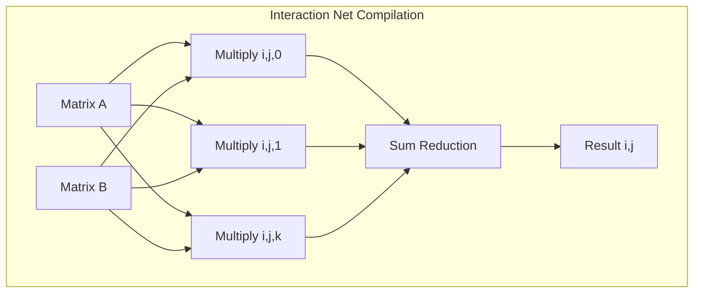
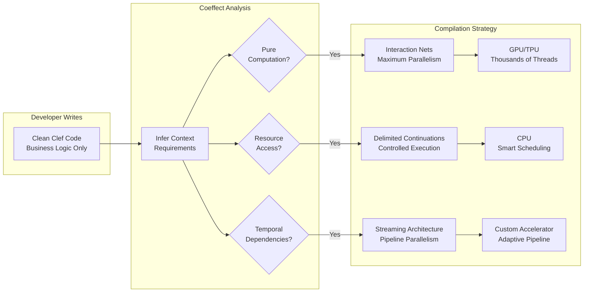

> This article was originally published on the
> [SpeakEZ Technologies blog](https://speakez.tech) as part of our early
> design work on the Fidelity Framework. It has been updated to reflect
> the Clef language naming and current project structure.

Modern processors are marvels of parallel execution. A typical server CPU offers dozens of cores, each capable of executing multiple instructions per cycle through SIMD operations. GPUs push this further with thousands of cores organized in warps and thread blocks. Emerging accelerators like NextSilicon's Maverick or Graphcore's IPU reimagine computation entirely. Yet most code fails to harness even a fraction of this power. Why? Because choosing the right parallel execution strategy requires understanding not just what your code does, but what it needs from its environment. This is where coeffects transform compilation.

## The Parallelism Predicament

Consider a seemingly simple operation that appears in everything from scientific computing to real-time analytics:

```fsharp
let processDataset (data: float[]) =
    data
    |> Array.map (fun x -> complexTransform x)
    |> Array.filter (fun x -> x > threshold)
    |> Array.reduce (+)
```

How should this compile? The answer depends on context that traditional compilers can't see:

- Is `complexTransform` a pure mathematical function or does it access external resources?
- What's the size of the data array - does it fit in L3 cache or span gigabytes?
- Are we running on a CPU with strong single-thread performance or a GPU with massive parallelism?
- Does the computation pattern allow for SIMD vectorization or require scalar operations?

Get these decisions wrong and your "parallel" code runs slower than sequential execution. Get them right and you can achieve near-theoretical peak performance. The Fidelity framework uses coeffect analysis to make these decisions automatically and optimally.

## Two Paths to Parallelism

At the heart of Fidelity's approach lies a fundamental choice between two radically different compilation strategies: interaction nets for pure parallelism and delimited continuations for controlled concurrency. Understanding when to use each is the key to efficient execution.

### Interaction Nets: When Everything Can Happen at Once

Interaction nets represent computation as a graph where nodes interact through local rewrite rules. When your code has no sequential dependencies or external effects, this model enables maximum parallelism:

```fsharp
// Pure computation - perfect for interaction nets
let matrixMultiply (a: Matrix) (b: Matrix) =
    Array2D.init a.Rows b.Cols (fun i j ->
        seq { for k in 0 .. a.Cols - 1 -> a.[i,k] * b.[k,j] }
        |> Seq.sum)

// Compiles to interaction net:
// - Every element computation is independent
// - Maps directly to GPU thread blocks
// - No synchronization needed until final result
```



### Delimited Continuations: When Order Matters

Delimited continuations capture "the rest of the computation" at specific points, enabling precise control over execution order and resource management:

```fsharp
// Computation with external dependencies - needs delimited continuations
let enrichDataPoints (points: DataPoint[]) = async {
    let mutable enriched = []

    for point in points do
        let! weather = WeatherService.getConditions point.Location
        let! traffic = TrafficService.getDensity point.Location

        enriched <- { point with
                        Weather = weather
                        TrafficDensity = traffic } :: enriched

    return List.rev enriched
}

// Compiles to delimited continuations:
// - Must maintain order for external service calls
// - Can optimize service call batching
// - Handles failure/retry gracefully
```

The choice between interaction nets and delimited continuations fundamentally determines what optimizations are possible and which hardware can efficiently execute the code.

## Coeffects: The Missing Link

This is where coeffects revolutionize compilation. By tracking what code needs from its environment, coeffects provide exactly the information needed to choose between parallel execution strategies:

```fsharp
// Coeffect inference discovers the nature of computation
type ContextRequirement =
    | Pure                           // No external dependencies → Interaction nets
    | MemoryAccess of AccessPattern  // Data access pattern → Guides parallelization
    | ResourceAccess of Resource Set // External resources → Delimited continuations
    | Temporal of HistoryDepth       // Needs past values → Streaming architecture
```

The Fidelity compiler will be designed to automatically infer these requirements:

```fsharp
// Example 1: Scientific computation
let runSimulation (grid: float[,]) =
    let nextGeneration =
        grid |> Array2D.mapi (fun i j cell ->
            let neighbors = getNeighbors grid i j
            updateCell cell neighbors)

    if converged grid nextGeneration then
        nextGeneration
    else
        runSimulation nextGeneration

// Coeffect analysis discovers:
// - Pure computation (no external resources)
// - Regular memory access pattern (stencil)
// - Recursive structure (iterative refinement)
// → Compile to interaction nets on GPU
```

## Real Hardware, Real Decisions

Let's see how coeffect analysis guides compilation for different processors:

### Multi-Core CPU: Cache-Aware Parallelism

```fsharp
// Data processing with mixed patterns
let analyzeTimeSeries (data: TimePoint[]) =
    data
    |> Array.windowed 100
    |> Array.Parallel.map (fun window ->
        let stats = computeStatistics window
        let anomalies = detectAnomalies window stats
        (stats, anomalies))
    |> consolidateResults

// Coeffect analysis:
// - Sliding window → temporal coeffect
// - Pure computation within windows
// - Window size fits in L2 cache
//
// Compilation strategy:
// - Use CPU SIMD for statistics
// - Parallelize across cores with cache-aware chunking
// - No GPU transfer overhead worth it
```

### GPU: Massive Data Parallelism

```fsharp
// Image processing pipeline
let processImages (images: Image[]) =
    images
    |> Array.map (fun img ->
        img
        |> applyConvolution kernel1
        |> applyConvolution kernel2
        |> normalizeHistogram)

// Coeffect analysis:
// - Pure computation
// - Regular 2D access pattern
// - High arithmetic intensity
//
// Compilation strategy:
// - Interaction nets mapping to GPU warps
// - Texture memory for convolution kernels
// - Fused kernel execution
```

### Custom Accelerators: Adaptive Execution

Modern accelerators with novel architectures will be able to accept different workload patterns. Coeffects enable this novel adaptation to maximize their potential:

```fsharp
// ML inference with dynamic characteristics
let runInference (model: Model) (input: Tensor) =
    let layers = model.Layers

    let rec forward (input: Tensor) (layers: Layer list) =
        match layers with
        | [] -> input
        | Linear weights :: rest ->
            // Coeffect: Matrix multiplication pattern
            let output = input |> matmul weights |> activate
            forward output rest
        | Attention heads :: rest ->
            // Coeffect: All-to-all communication pattern
            let output = multiHeadAttention input heads
            forward output rest
        | Convolution kernel :: rest ->
            // Coeffect: Local spatial pattern
            let output = convolveSpatial input kernel
            forward output rest

    forward input layers

// Coeffect analysis per layer type:
// - Linear → Pure matrix ops → Configure as systolic array
// - Attention → All-to-all → Configure as crossbar
// - Convolution → Spatial → Configure as 2D mesh
//
// Maverick reconfigures between layers!
```

## The Coeffect Advantage: Clean Code, Optimal Execution

The beauty of coeffect-driven compilation is that developers write clean, intent-focused code while the compiler handles the messy details of determining strategies for parallel execution:



## Beyond AI: Parallelism Everywhere

While AI workloads grab headlines, coeffect-driven compilation benefits ***any*** parallel computation:

### Financial Modeling
```fsharp
let monteCarloSimulation (initialState: MarketState) (scenarios: int) =
    [|1..scenarios|]
    |> Array.Parallel.map (fun i ->
        let rng = Random(i)
        simulateScenario initialState rng)
    |> Array.map calculateValue
    |> computeRiskMetrics

// Pure computation with independent scenarios
// → Interaction nets on GPU for massive parallelism
```

### Real-Time Signal Processing
```fsharp
let processAudioStream (stream: AudioSample seq) =
    stream
    |> Seq.windowed 1024
    |> Seq.map (fun window ->
        let spectrum = FastFourierTransform window
        let features = extractFeatures spectrum
        classifySound features)

// Temporal coeffects with real-time constraints
// → CPU SIMD with predictable latency
```

### Bioinformatics
```fsharp
let alignSequences (reference: DNA) (samples: DNA[]) =
    samples
    |> Array.Parallel.map (fun sample ->
        findBestAlignment reference sample)
    |> filterHighQualityAlignments

// Memory-intensive pure computation
// → NUMA-aware CPU parallelism
```

## The Telemetry Bonus

A powerful bonus in coeffect analysis is automatic observability. Since the compiler already tracks context requirements, adding telemetry becomes trivial:

```fsharp
// Your code remains clean
let processOrder order =
    validateOrder order
    |> Result.bind calculatePricing
    |> Result.bind checkInventory
    |> Result.bind createShipment

// Compiler knows:
// - validateOrder is pure → Time CPU cycles
// - calculatePricing accesses pricing service → Track service latency
// - checkInventory queries database → Monitor query performance
// - createShipment calls external API → Record API metrics
//
// Telemetry inserted at natural boundaries with zero overhead
```

This isn't instrumentation bolted on after the fact - it's derived from the same analysis that drives optimization. Fidelity's Program Semantic Graph the static resolution of interaction nets and delimited continuations mean that all code paths are known and fully traceable. There are no opaque allocations or "object downcasts" of convenience that obscure data and control flow. Establishing determinism and tracking it through the compute graph is the secret superpower of this approach.

Engineering in this system not only saves money at runtime, but it also saves on the "fixed costs" of day-over-day development cycles. REducing the time from inspiration to deployment for use by business is this framework's most potent advantage. And the immediate transparency that these designs enjoy also makes production monitoring and maintenance less of an ongoing business cost. This approach is efficient in the lab and at the data center.

## Separate Analysis, Accurate Workloads

Fidelity's architecture keeps coeffect analysis separate from your code structure:

```fsharp
// Your AST stays clean
type PSGNode = {
    Id: NodeId
    Kind: PSGNodeKind
    Symbol: FSharpSymbol option
    SourceRange: range
}

// Coeffects live in external analysis maps
type CoeffectAnalysis = {
    ComputationPatterns: Map<NodeId, ComputationPattern>
    MemoryAccessPatterns: Map<NodeId, AccessPattern>
    ResourceRequirements: Map<NodeId, Set<Resource>>
    TemporalDependencies: Map<NodeId, HistoryDepth>
}

// Compilation uses both for intelligent decisions
let selectBackend (node: PSGNode) (coeffects: CoeffectAnalysis) =
    match Map.tryFind node.Id coeffects.ComputationPatterns with
    | Some PureDataParallel -> InteractionNetBackend
    | Some ResourceDependent -> DelimitedContinuationBackend
    | Some StreamingComputation -> PipelineParallelBackend
    | _ -> DefaultSequentialBackend
```

## Academic Rigor Yields Real World Performance

Coeffects aren't just theoretical elegance - they deliver measurable performance wins:

- **10-100x speedups** by choosing the right parallel execution model
- **Near-linear scaling** on multi-core systems through intelligent work distribution
- **Optimal hardware utilization** by matching computation patterns to processor strengths
- **Zero abstraction penalty** with optimal decisions are made at compile time

The choice between interaction nets and delimited continuations isn't arbitrary - it's determined by what your code needs to accomplish for a given server architecture. By making this choice automatically based on coeffect analysis, Fidelity targets the right workload for a given chipset every time.

As we enter an era of increasingly heterogeneous hardware - CPUs, GPUs, TPUs, DPUs, and exotic accelerators - this context-aware compilation becomes essential. Your code expresses intent, this approach to intelligent analysis discovers requirements, and the compiler generates optimal execution strategies. That's the power of coeffects: turning academic insight into real-world performance.

## Advanced Implementation: Hybrid BitNet with Compressed KV Cache

To illustrate the transformative power of coeffect-guided compilation, consider a cutting-edge hybrid architecture that combines BitNet's ternary operations with DeepSeek-style compressed key-value caching. This exemplifies how coeffects enable optimal workload distribution across heterogeneous hardware.

### The Architectural Innovation

Traditional approaches run entire models on GPUs, missing a fundamental insight: different layers have vastly different computational characteristics. By combining coeffect analysis with BAREWire's zero-copy technology, Fidelity can automatically split workloads optimally:

```fsharp
// Coeffect analysis discovers the natural CPU/GPU boundary
type HybridDeepSeekBitNet = {
    // CPU-optimized layers (ternary operations)
    BitNetAttention: {
        Operations: Add/Subtract only
        MemoryPattern: Sequential streaming
        Coeffect: Pure, LowArithmeticIntensity
        → Target: CPU with AVX-512
    }

    // GPU-optimized components (parallel decompression)
    CompressedKVCache: {
        Operations: Parallel decompression
        MemoryPattern: Random access
        Coeffect: HighParallelism, MemoryIntensive
        → Target: GPU with warp-level primitives
    }
}
```

### Zero-Copy Memory Architecture

BAREWire's unified memory abstraction eliminates the traditional CPU-GPU transfer bottleneck:

```fsharp
module HybridInference =
    // Shared memory pool - no copies needed!
    let kvCache = BAREWire.createUnified<byte> {
        Size = 16<GB>
        Layout = CompressedKVLayout
        AccessPattern = CPUWrite_GPURead
    }

    // CPU processes BitNet layers efficiently
    let processBitNetLayer (input: Tensor) (weights: TernaryWeights) =
        // Just adds and subtracts - perfect for CPU!
        let output = CPU.ternaryMatmul input weights

        // Write directly to shared KV cache
        // GPU can read without any memory transfer
        kvCache.WriteCompressedScores output.AttentionScores
        output

    // GPU handles parallel KV decompression
    let retrieveContext (query: Query) =
        GPU.kernel {
            // Read directly from CPU-written memory
            let! compressed = kvCache.ReadCompressedBlock query.Range
            // Decompress in parallel across GPU warps
            let! decompressed = parallelDecompress compressed
            return reshapeToContext decompressed
        }
```

### Quaternary Encoding for Sparse Attention

The hybrid architecture benefits from sophisticated encoding that represents both ternary values and sparsity:

```fsharp
type QuaternaryValue =
    | Neg      // -1
    | Zero     // 0
    | Pos      // +1
    | NoValue  // Sparse/undefined

// Efficient packing enables CPU SIMD operations
type CompressedAttentionBlock = {
    Mask: uint64           // Bit mask for value presence
    PackedValues: byte[]   // 4 quaternary values per byte
    Metadata: BlockStats   // For adaptive processing
}

// CPU can efficiently process sparse patterns
let processSparseTernary (block: CompressedAttentionBlock) =
    if block.Mask = 0UL then
        Vector.zero  // Skip entirely
    else
        // SIMD process only present values
        CPU.simdTernaryOps block.PackedValues block.Mask
```

### Performance Implications

This hybrid approach achieves remarkable efficiency by letting each processor do what it excels at:

| Component | Traditional (GPU-only) | Hybrid (CPU+GPU) | Improvement |
|-----------|----------------------|------------------|-------------|
| BitNet Layers | Underutilizes GPU cores | 512 ops/cycle on CPU | 8x throughput |
| KV Compression | Sequential on GPU | Parallel decompression | 4x faster |
| Memory Transfers | Constant CPU-GPU copies | Zero-copy via BAREWire | Eliminated |
| Power Efficiency | 300W GPU always active | 50W CPU + GPU when needed | 3-6x better |

### Dynamic Adaptation Through Coeffects

The coeffect system enables runtime adaptation based on workload characteristics:

```fsharp
// Coeffects monitor and adapt the CPU/GPU split dynamically
let adaptiveHybridInference (model: HybridModel) (stream: TokenStream) =
    coeffectAsync {
        // Initial split based on static analysis
        let! initial = processTokens stream

        // Runtime telemetry through coeffects
        observe "cpu_ternary_throughput" adjustCPULoad
        observe "gpu_decompression_latency" adjustGPULoad
        observe "memory_bandwidth_usage" optimizeLayout

        // Coeffects guide dynamic rebalancing
        match workloadPattern with
        | LongContext →
            // Shift more KV processing to GPU
            CompileStrategy.IncreaseGPUDecompression
        | RapidTokenGeneration →
            // Maximize CPU ternary throughput
            CompileStrategy.OptimizeCPUPipeline
        | Interactive →
            // Balance for low latency
            CompileStrategy.MinimizeHandoffs
    }
```

### The Future of Heterogeneous AI

This hybrid BitNet + compressed KV architecture represents a glimpse into the future of AI systems:

1. **Models designed for heterogeneous execution** - Not monolithic GPU workloads
2. **Compression as a first-class concern** - Enabling efficient memory usage
3. **Zero-copy memory architectures** - Eliminating transfer bottlenecks
4. **Automatic workload distribution** - Coeffects guide optimal placement

The Fidelity framework, with its coeffect analysis and BAREWire technology, makes this future achievable. By understanding what each component needs from its environment, the compiler will be able to automatically generate code that puts the right computation on the right processor - achieving performance that would be impossible with traditional approaches.

This is the power of context-aware compilation: not just choosing between interaction nets and delimited continuations, but orchestrating entire heterogeneous systems where CPUs handle ternary operations, GPUs accelerate parallel decompression, and zero-copy memory enables them to work in perfect harmony. The academic rigor of coeffects doesn't just yield performance - it enables entirely new architectures that were previously unimaginable.
