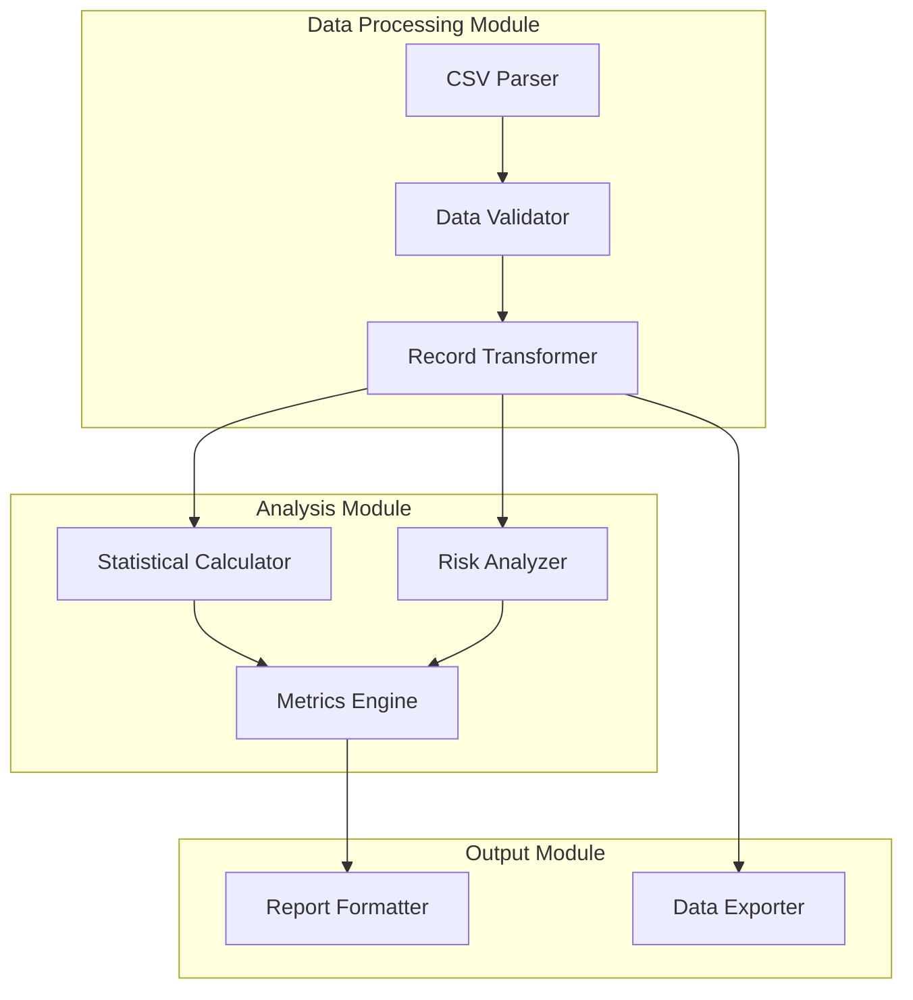
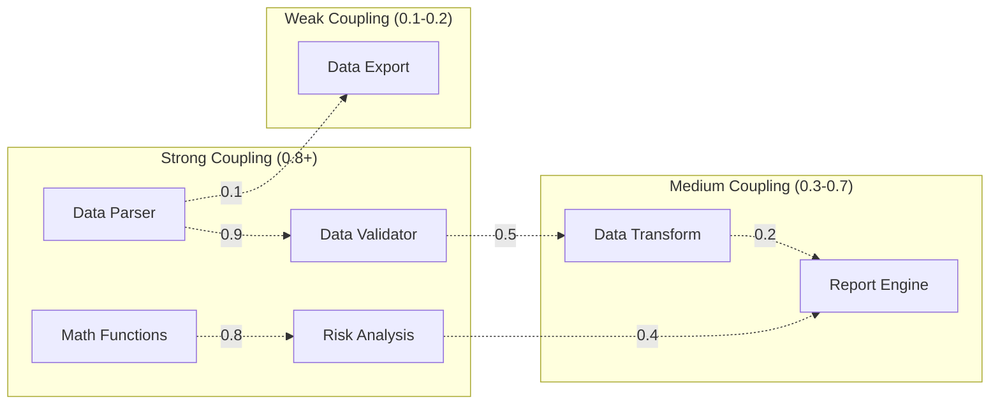
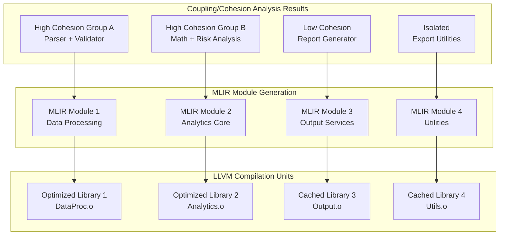

> This article was originally published on the
> [SpeakEZ Technologies blog](https://speakez.tech) as part of our early
> design work on the Fidelity Framework. It has been updated to reflect
> the Clef language naming and current project structure.

Software tools face an eternal tension: wait to build fast executables or speed up workflow at the cost of the end result. Traditional approaches have forced developers to choose between aggressive optimization (and long compilation cycles) that produces efficient code versus rapid compilation cycles often yield code bloat. What if we could have both? Or rather, what if we could have the choice *that matters* **when** it matters **most**? The answer lies in understanding something most programmers miss about functional programming:

> There's a secret lurking in FP: *structure **is** speed*.

The Composer compiler leverages one aspect of this insight through coupling and cohesion analysis integrated directly into our unique design of a Program Semantic Graph. By understanding the relationships between different parts of your program, Composer will have the ability to assist the developer in making intelligent decisions about compilation boundaries that maximize both development velocity and runtime performance.

## Coupling and Cohesion in Software

Before diving into compilation implications, let's establish what coupling and cohesion mean in the context of software architecture. These concepts, borrowed from traditional software engineering, take on new significance when viewed through the lens of compiler optimization.

**Cohesion** measures how closely related the responsibilities within a single module or component are to each other. High cohesion means that everything in a module works together toward a common purpose. In functional programming, this often manifests as functions that operate on the same data types or participate in the same data transformation pipeline.

**Coupling** measures how much one module depends on another. Low coupling means that modules can be understood and modified independently. High coupling means that changes in one module frequently require changes in another.

Consider a simple example from data processing. Functions that parse CSV files, validate data formats, and transform records into internal representations naturally exhibit high cohesion - they all serve the purpose of data ingestion. Meanwhile, these data processing functions might have low coupling to the user interface code that displays results - they can be developed and tested independently.

## The Compilation Challenge

Traditional compilers treat all code somewhat uniformly during compilation. A C++ compiler might compile each source file separately, then link everything together. This approach works, but it misses opportunities for optimization that arise from understanding program structure.

Modern languages with more sophisticated type systems and module systems provide richer information that compilers can exploit. However, most compilation strategies still focus primarily on local optimizations within functions or modest inter-procedural analysis within small scopes.

Functional programming languages offer something different: they encourage programming patterns that create natural organizational boundaries. Pure functions don't have hidden dependencies. Immutable data structures create predictable sharing patterns. Higher-order functions create clear abstraction layers. These patterns aren't just good software engineering - they provide valuable hints about program structure that a compiler can use to make optimization decisions.

## Program Semantic Graph as Optimizer

Our original concept for the Program Semantic Graph was to create a form of "glue" layer between the various components in the symbolic and typed representations that F# Compiler Services produce. The goal of Fidelity framework (and indeed the reason for the framework's name) is to preserve types through compilation. This key precept spans everything from physics-aware calculations to memory layout for rapid zero-copy mechanics between computation units. The "tree shaking" that we perform to eliminate unused code from library source code means that only the necessary code is involved in compilation. This in itself is a form of optimization. Since we're not bound to .NET's (or java's) assembly method of application component inclusion we can build lean binaries. The PS²G is the final result of that "reachability analysis" in the computation graph that is then transformed to MLIR's front end.

But in that process we *also* found this key opportunity to optimize the compilation process from a developer perspective. With all of this symbolic and semantic information we could use that to find "natural boundaries" in code that would help to shape *how* the compiler could organize units of compilation, and make the build-over-build ergonomics of working in the Fidelity framework much better for the developer.

## PS²G as Architectural Map

The Program Semantic Graph in Composer serves as more than just an intermediate representation - it functions as an architectural map of your entire program. Think of it like a blueprint that shows not just what each room contains, but how people move between rooms, which areas are used frequently together, and which sections could be renovated independently.



Traditional compiler intermediate representations focus on control flow and data dependencies within relatively small scopes. The PS²G takes a broader view, maintaining semantic information about relationships between modules, types, functions, and data structures throughout the entire program. This global perspective enables analysis techniques that would be impossible with more limited representations.

As we're still in early design stages with this feature area, we envision that the PS²G represents these relationships through semantic units that align with garden-variety program organization:

```fsharp
type SemanticUnit =
    | Module of FSharpEntity
    | Namespace of string
    | FunctionGroup of FSharpMemberOrFunctionOrValue list
    | TypeCluster of FSharpEntity list
```

As the PS²G is constructed from F# source code, it preserves the rich type information and functional programming patterns that exist in the original source. Module boundaries become first-class entities in the graph. Function composition chains become visible as connected subgraphs. Data transformation pipelines emerge as clear patterns that can be analyzed and optimized as units.

## Coupling Analysis

Our ideas in the context of compilation involves understanding how different parts of your program depend on each other and using that information to make intelligent decisions about compilation units and optimization strategies.

The analysis quantifies these relationships through coupling measurements that capture both strength and dependency types:

```fsharp
type Coupling = {
    From: SemanticUnit
    To: SemanticUnit
    Strength: float  // 0.0 to 1.0
    Dependencies: SymbolRelation list
}
```

Consider a typical Clef application that processes financial data. Coupling analysis reveals patterns that file-based organization might obscure:



This coupling information becomes invaluable for making compilation decisions. Strongly coupled components benefit from being compiled together, enabling aggressive inter-procedural optimization, function inlining, and specialized code generation. Weakly coupled components can be compiled separately, enabling parallel compilation and incremental rebuilds when only some parts of the system change. Preventing the cumulative slow-down of whole-program compilation is a quality-of-life matter for development that often determine a framework's viability.

Fortunately MLIR lends itself to this type of approach. Components with strong coupling can be placed in the same MLIR module, where the intermediate representation can preserve high-level relationships while progressively lowering to efficient machine code. Components with weak coupling could be compiled to separate MLIR modules with well-defined interfaces, enabling independent optimization and caching strategies.

## Cohesion as a Guide for Optimization

Cohesion analysis reveals which parts of a larger program naturally belong together and can be optimized as units. High cohesion indicates opportunities for aggressive optimization, while low cohesion suggests boundaries where more conservative approaches might be appropriate.

The analysis measures how closely related the responsibilities within a semantic unit are to each other:

```fsharp
type Cohesion = {
    Unit: SemanticUnit
    Score: float  // 0.0 to 1.0
    InternalRelations: int
    ExternalRelations: int
}
```

In functional programming, high cohesion often emerges naturally from data-driven design. Functions that operate on the same discriminated union type exhibit natural cohesion - they understand the same data structures and often participate in the same pattern matching logic. Functions in a data transformation pipeline show cohesion through their shared purpose and sequential relationships.

The compiler can exploit this cohesion information in several ways. Highly cohesive function groups become candidates for aggressive inlining and specialization. For instance, memory layout decisions can co-locate data structures that are always used together. Perhaps most importantly, cohesion analysis guides the granularity of compilation units. Functions with high cohesion benefit from being compiled together because the compiler can see their interactions and optimize across function boundaries. Functions with low cohesion can be compiled separately without losing optimization opportunities.

## MLIR Integration and Modular Compilation

The marriage of coupling and cohesion analysis with MLIR's capabilities creates opportunities for sophisticated compilation strategies that adapt to program structure. MLIR's multi-level approach means that high-level relationships discovered through coupling analysis can be preserved and utilized throughout the compilation process.

The analysis results could directly inform MLIR module organization, creating compilation boundaries that align with program architecture:



When strongly coupled components are compiled into the same MLIR module, the compiler can maintain high-level information about their relationships even as it progressively lowers through different dialects. Function composition chains can be represented directly in high-level MLIR dialects, then optimized as units before being lowered to more traditional representations.

### Preserving Verification

The progressive lowering through MLIR dialects also enables verification at multiple levels. High-level invariants derived from functional programming patterns can be verified at the functional dialect level. Memory safety properties can be verified at intermediate levels. Finally, traditional optimizations can be applied at the LLVM dialect level with confidence that higher-level properties have been preserved.

### Cache on Hand

This approach also enables sophisticated caching strategies. Compilation units identified through coupling and cohesion analysis can be cached independently. When only weakly coupled components change, strongly coupled components can reuse their cached compilation results. When interface boundaries identified through coupling analysis remain stable, downstream components can avoid recompilation entirely.

## Beyond Hello World

These concepts might seem abstract when applied to simple programs, but they become crucial as applications grow in complexity. A moderate application - perhaps a command-line tool that processes files and generates reports - begins to show interesting coupling patterns. File parsing logic couples strongly with data validation. Report formatting couples weakly with core processing logic. These patterns quickly gain meaning in the day-of-the-life of a developer who has to produce work quickly. Having a nuanced compilation strategy is not just a technical flex, it's a bottom-line business impact.

The coupling and cohesion analysis in Composer intends to scale with program complexity. Simple programs benefit from the "tree shaking" of the PS²G process. Complex programs would benefit further from sophisticated compilation strategies that would be impossible without understanding program structure.

A large application - perhaps a distributed actor system with multiple services and sophisticated error recovery - exhibits rich coupling and cohesion patterns that become essential for managing compilation complexity. Without intelligent analysis of these patterns, compilation times become prohibitive and optimization opportunities are missed. Our compilation strategy opens doors for new, bold projects to be approached with confidence. And as with many functional programs, refactoring becomes a fearless proposition. Less technical debt means better efficiency, security and a lower total cost of ownership.

## The Architectural Advantage

Functional programming's emphasis on clear abstractions, explicit dependencies, and structured data creates natural architectural boundaries that traditional imperative languages struggle to maintain. These boundaries aren't just helpful for human reasoning about code - they provide valuable information that enables sophisticated automation around tooling and build processes.

When functions are 'pure', the compiler can reason about their behavior without worrying about hidden side effects. When data structures are immutable, sharing and caching strategies become more permissive. When module boundaries are respected, compilation units can be optimized independently with confidence. Sophisticated architectures become more manageable, and development teams can engage at the speed of business.

> The natural structure that emerges from good functional programming practices becomes the foundation for efficient, scalable compilation strategies. It adapts **to** your program's actual architecture instead of fighting *against* it.

This approach represents a fundamental shift in how we think about compilation. Instead of treating compilation as a burden to force code through a series of opaque generic optimizations, the Fidelity framework creates a build process that understands your program's architecture and adapts its strategies accordingly. And the tooling and visibility into the process means you will be in complete control of that optimization at all times.

## The Road Ahead

Even our simplest examples - those fundamental hello world programs that validate basic compilation infrastructure - are designed with this broader architectural vision in mind. The Program Semantic Graph construction, the coupling and cohesion analysis, and the MLIR integration strategies all scale from trivial examples to complex applications.

This represents more than just an engineering optimization. It suggests a new model for how programming languages and compilation systems can work together. When the language encourages patterns that create natural program structure, and the compiler understands and leverages that structure to its advantage, the result is a development experience that provides both rapid iteration during development and efficient execution in production.

This is a clear example where the abstraction of category theory translates directly to meaningful business velocity. We envision a future where organizations that harness these breakthroughs will ship more reliable software in shorter cycles, slash infrastructure costs through superior performance, and outmaneuver competitors still trapped in the false choice between development speed and system efficiency. The mathematical elegance that guides our architectural decisions today will become tomorrow's competitive advantage in the marketplace.
