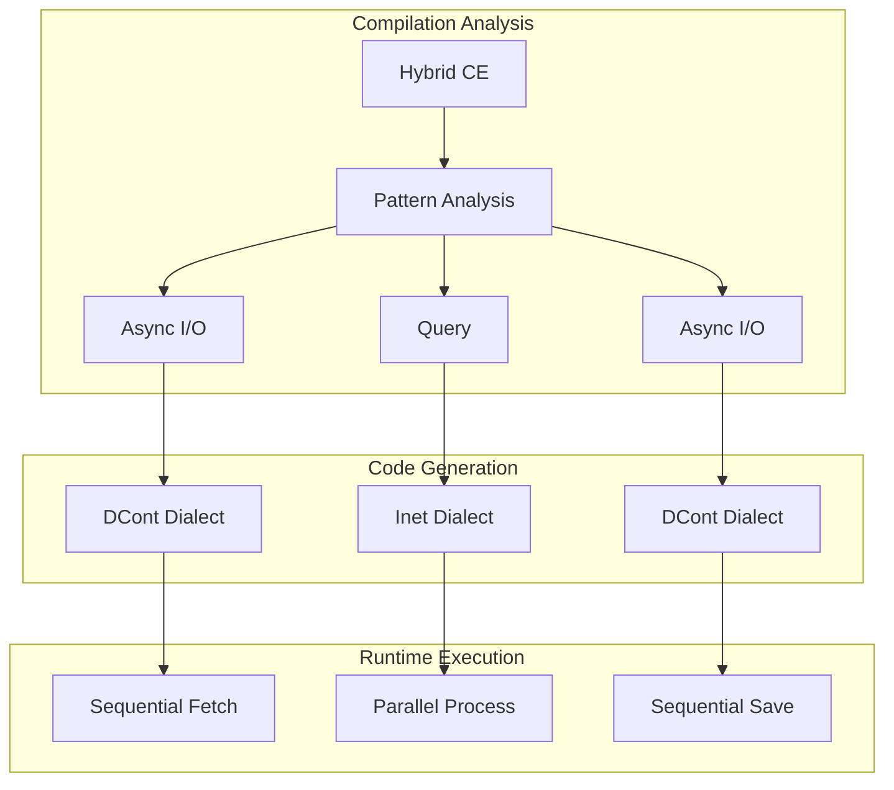

> This article was originally published on the
> [SpeakEZ Technologies blog](https://speakez.tech) as part of our early
> design work on the Fidelity Framework. It has been updated to reflect
> the Clef language naming and current project structure.

Clef's computation expressions represent one of the language's crown jewels - a unified syntax that makes complex control flow feel as natural as writing straight-line code. Yet beneath this syntactic elegance lies a mathematical structure that most compilers never fully exploit. In the Fidelity framework, we highlight that most CEs naturally decomposes into one of two fundamental patterns: delimited continuations for sequential effects, or interaction nets for true parallelism. This isn't just optimization; it's a recognition of an essential duality that enables us to develop a compilation path that yields true *zero-cost* computation graphs.

This builds on the architectural foundations we've established across the Fidelity framework - from our [coeffect analysis for context-aware compilation](https://speakez.tech/blog/context-aware-compilation/) to our [exploration of continuation preservation](https://speakez.tech/blog/the-continuation-preservation-paradox/), and from our [reactive programming model](https://speakez.tech/blog/alloyrx-native-reactivity-in-fidelity/) to our [approach to referential transparency](https://speakez.tech/blog/seeking-referential-transparency/).

## A Principled Start

To understand how computation expressions compile to optimal machine code, we need to first understand what they actually are beneath the syntax. Let's begin with a problem every developer faces: repetitive code patterns that obscure the essential logic.

Consider processing data with error handling. Without computation expressions, we're forced to write explicit branching at every step:

```fsharp
// Explicit error handling - the pattern dominates the logic
let divideNumbers init x y z =
    let a = init |> divideBy x
    match a with
    | None -> None      // Bail out on error
    | Some a' ->        // Continue with success
        let b = a' |> divideBy y
        match b with
        | None -> None  // Bail out again
        | Some b' ->    // Continue again
            let c = b' |> divideBy z
            match c with
            | None -> None
            | Some c' -> Some c'  // Finally!
```

The actual logic - dividing numbers in sequence - is buried under error-handling boilerplate. Computation expressions let us avoid this pattern:

```fsharp
// Same logic, but the pattern is hidden
let divideNumbers init x y z = maybe {
    let! a = init |> divideBy x
    let! b = a |> divideBy y
    let! c = b |> divideBy z
    return c
}
```

The point worth unpacking here is that `let!` isn't magic - it's syntactic sugar for a very specific pattern of function composition. When we write `let! x = expr in body`, the compiler transforms it into `builder.Bind(expr, fun x -> body)`. This transformation reveals something profound: computation expressions are fundamentally about threading continuations through a computation.

## The Continuation Connection

To see why this matters for compilation, let's make the continuation pattern explicit. Every `let` binding can be rewritten as a function application:

```fsharp
// A normal let binding
let x = 42 in
let y = 43 in
x + y

// Can be rewritten using continuations
42 |> (fun x ->
    43 |> (fun y ->
        x + y))
```

This transformation from `let` to continuation-passing isn't just a curiosity - it's the foundation for how computation expressions work. The `let!` in a computation expression makes this pattern explicit and interceptable:

```fsharp
// The maybe builder intercepts at each continuation point
type MaybeBuilder() =
    member _.Bind(m, continuation) =
        match m with
        | None -> None                // Short-circuit
        | Some x -> continuation x    // Continue

// Each let! becomes a Bind call
maybe {
    let! x = someOption    // Bind(someOption, fun x -> ...)
    let! y = otherOption   // Bind(otherOption, fun y -> ...)
    return x + y           // Return(x + y)
}
```

This revelation - that computation expressions are continuations in disguise - leads to a deeper question: what happens when we compile these patterns? This is where the Fidelity framework's unique approach emerges.

## Fundamental Fork: Sequential vs Parallel

Once we recognize computation expressions as continuation structures, we face a crucial compilation decision. Some computations require sequential threading of continuations - each step depends on the previous one. Others have no such dependencies - all operations could theoretically execute simultaneously.

This isn't a minor optimization detail; it's a fundamental distinction that determines the entire compilation strategy. As we explored in our [coeffects and codata analysis](/docs/design/coeffects-and-codata/), different computational patterns require different execution strategies:

### Sequential Patterns: The DCont Path

When operations must happen in sequence - because each depends on the previous result or involves effects - we need delimited continuations. These capture "the rest of the computation" at specific points:

```fsharp
// Sequential: each step depends on the previous
let processOrder order = async {
    let! inventory = checkInventory order.Items    // Must complete first
    let! pricing = calculatePricing order          // Needs inventory
    let! shipping = estimateShipping order         // Needs pricing
    return combinedResult inventory pricing shipping
}
```

The Composer compiler recognizes this pattern and compiles it to MLIR's DCont dialect:

```mlir
// DCont: explicit continuation capture and resumption
dcont.func @processOrder(%order: !order) -> !result {
    %k1 = dcont.shift {
        %inventory = call @checkInventory(%order.items)
        dcont.resume %k1 %inventory
    }

    %k2 = dcont.shift {
        %pricing = call @calculatePricing(%order, %inventory)
        dcont.resume %k2 %pricing
    }

    %k3 = dcont.shift {
        %shipping = call @estimateShipping(%order, %pricing)
        dcont.resume %k3 %shipping
    }

    %result = call @combine(%inventory, %pricing, %shipping)
    dcont.reset %result
}
```

Each `dcont.shift` captures the continuation at that point - literally "the rest of the computation" - allowing the operation to suspend and later resume. This is how async operations work without allocating Tasks or using thread pools.

### Parallel Patterns: The Inet Path

But what about computations with no sequential dependencies? Consider a query over pure data:

```fsharp
// Pure query: all operations could happen simultaneously
let analysis = query {
    for sale in sales do
    where (sale.Amount > 1000.0)
    select (sale.Region, sale.Amount * 1.1)
}

// Every sale can be checked and transformed independently
// No operation depends on another's result
```

Here, there's no need for sequential continuations. Every operation - every filter check, every projection - could happen simultaneously. The Composer compiler recognizes this pattern and compiles to interaction nets:

```mlir
// Inet: parallel graph reduction
inet.func @analysis(%sales: !inet.wire<array>) -> !inet.wire<array> {
    // All operations happen in parallel
    %filtered = inet.parallel_filter @check_amount %sales
    %projected = inet.parallel_map @extract_region_amount %filtered

    inet.return %projected
}
```

Interaction nets are a model where computation happens through local graph reductions that can all occur simultaneously. There's no continuation capture, no sequencing, no waiting - just pure parallel execution.

## The Deeper Pattern Emerges

This distinction between DCont and Inet isn't arbitrary. It reflects a fundamental duality in computation itself:

**Effectful computations** need to sequence operations through time. They interact with the world, maintain state, or depend on previous results. These naturally map to delimited continuations (DCont), which provide explicit control over execution order. As we explored in [continuation preservation](https://speakez.tech/blog/the-continuation-preservation-paradox/), these patterns can survive surprisingly deep into the compilation pipeline.

**Pure computations** have no effects and no sequential dependencies. Every sub-computation can happen independently. These naturally map to interaction nets (Inet), which maximize parallelism through simultaneous graph reduction. Our work on [referential transparency](https://speakez.tech/blog/seeking-referential-transparency/) shows how the compiler identifies these pure regions.

Computation expressions already encode this distinction in their structure. The compiler just needs to recognize it:

```fsharp
// Async CE → Sequential effects → DCont
let fetchData() = async {
    let! response = Http.get url
    let! parsed = parseResponse response
    return parsed
}

// Query CE → Pure parallel → Inet
let queryData() = query {
    for item in items do
    where (predicate item)
    select (transform item)
}

// State CE → Sequential state threading → DCont
let stateful() = state {
    let! current = getState
    do! setState (current + 1)
    return current
}

// List CE → Pure generation → Inet
let cartesian() = list {
    for x in xs do
    for y in ys do
    yield (x, y)
}
```

## Making It Concrete: Compilation Strategies

Let's trace how these different patterns compile to see the performance implications:

### DCont Compilation: Stack-Based Async

Traditional async compilation creates numerous heap allocations:

```fsharp
// Traditional: AsyncBuilder, Task objects, closures
let traditional() = async {
    let! data = fetchData()
    let! result = process data
    return result
}
// Allocates: AsyncBuilder (~64 bytes)
//           Task per operation (~128 bytes each)
//           Closure per continuation (~48 bytes each)
// Total: ~350+ bytes of heap allocation
```

Fidelity's DCont compilation eliminates all heap allocations, as we detailed in our exploration of [deterministic memory patterns](/docs/design/beyond-zero-allocation/) and [the full Frosty experience](https://speakez.tech/blog/the-full-frosty-experience/):

```fsharp
// Fidelity: Stack-based continuations
let optimized() = async {
    let! data = fetchData()
    let! result = process data
    return result
}
// Compiles to:
// - Stack frame for continuation state (0 heap bytes)
// - Direct function calls (no indirection)
// - Inline continuation code (no closures)
// Total: 0 bytes of heap allocation
```

The DCont dialect preserves the continuation structure in MLIR, allowing optimizations while maintaining stack-based execution with no heap allocations.

### Inet Compilation: Massive Parallelism

Traditional query compilation creates sequential operations:

```fsharp
// Traditional: Sequential iteration with allocations
let traditional = query {
    for x in data do
    where (x.Value > 100)
    select (x.Value * 2)
}
// Executes: One element at a time
//          Iterator objects allocated
//          Delegate allocations for predicates
```

Fidelity's Inet compilation design aims to enable true parallelism:

```fsharp
// Fidelity: Parallel execution
let optimized = query {
    for x in data do
    where (x.Value > 100)
    select (x.Value * 2)
}
// Compiles to:
// - All filtering happens simultaneously
// - All projections happen simultaneously
// - Direct compilation to SIMD/GPU operations
// - Zero intermediate allocations
```

On a GPU, this means thousands of elements processed in a single cycle. On a CPU, it could means full SIMD utilization.

## Hybrid Patterns: The Best of Both Worlds

Real applications often mix sequential and parallel patterns. The Fidelity compiler will make every effort to deal with these seamlessly, leveraging our [Program Hypergraph architecture](https://speakez.tech/blog/coupling-and-cohesion/) to identify boundaries between pure and effectful regions:

```fsharp
let hybridWorkflow data = async {
    // Sequential: async I/O (DCont)
    let! rawData = fetchFromDatabase()

    // Parallel: pure transformation (Inet)
    let processed = query {
        for row in rawData do
        where (isValid row)
        select (transform row)
    }

    // Sequential: async I/O (DCont)
    do! saveToDatabase processed
}
```

The compiler automatically identifies the boundaries and generates optimal code for each region:



## The Mathematical Foundation

This DCont/Inet duality isn't arbitrary - it's grounded in category theory. Understanding the mathematics reveals why these transformations are always safe and when they provide maximum benefit.

### Monads and Sequential Composition

Delimited continuations form a monad, the mathematical structure for sequential composition. The monadic laws guarantee that our transformations preserve program semantics:

The **left identity** law \(\text{return } a \text{ >>= } f \equiv f(a)\) allows us to eliminate unnecessary continuation frames:

```fsharp
// Before: Unnecessary frame
async.Return(42) |> async.Bind(processValue)

// After: Direct call
processValue(42)
```

The **associativity** law \((m \text{ >>= } f) \text{ >>= } g \equiv m \text{ >>= } (\lambda x. f(x) \text{ >>= } g)\) enables continuation fusion:

```fsharp
// Before: Separate continuations
let! temp = operation1()
let! result = operation2(temp)

// After: Fused continuation
let! result = operation1() >>= operation2
```

### Symmetric Monoidal Categories and Parallel Composition

Interaction nets form a symmetric monoidal category, the mathematical structure for parallel composition. The laws guarantee safe parallelization:

The **parallel associativity** law \((a \otimes b) \otimes c \equiv a \otimes (b \otimes c)\) allows work redistribution across cores:

```fsharp
// Grouping parallel operations for optimal hardware utilization
let filterAll data =
    // Can regroup without changing semantics
    parallel [(filter1; filter2); filter3] data
    // is equivalent to
    parallel [filter1; (filter2; filter3)] data
```

The **braiding** law \(a \otimes b \equiv b \otimes a\) enables operation reordering for locality:

```fsharp
// Reordering pure operations for better cache behavior
query {
    for item in data do
    where (predicate item)
    select (transform item)
}
// Can execute in either order:
// filter-then-map OR map-then-filter
```

These mathematical guarantees mean the compiler can aggressively reorder and regroup operations while preserving correctness.

## Performance Impact

The DCont/Inet compilation strategy yields dramatic performance improvements:

| Pattern | Traditional F# | Fidelity | Improvement |
|---------|---------------|----------|-------------|
| Async operations | ~350 bytes/operation | 0 bytes | ∞ |
| Query operations | Sequential, allocating | Parallel, zero-alloc | 10-100x |
| State computations | Object allocations | Stack-based | 50x |
| List comprehensions | Iterator objects | Direct generation | 20x |

More importantly, these improvements compound. A workflow mixing async I/O with data processing sees both elimination of async overhead AND massive parallelization of pure operations.

## Custom Computation Expressions

The DCont/Inet duality extends to custom computation expressions. Library authors can hint at the intended compilation strategy. This becomes particularly powerful when building domain-specific languages like our [Alloy.Rx reactive framework](https://speakez.tech/blog/alloyrx-native-reactivity-in-fidelity/), where multicast observables naturally compile to interaction nets while unicast observables require delimited continuations:

```fsharp
[<CompileTo(ComputationPattern.Parallel)>]
type QueryBuilder() =
    member _.For(source, body) = ...      // Will compile to Inet
    member _.Where(source, pred) = ...    // Parallel filtering
    member _.Select(source, proj) = ...   // Parallel mapping

[<CompileTo(ComputationPattern.Sequential)>]
type AsyncBuilder() =
    member _.Bind(m, f) = ...            // Will compile to DCont
    member _.Return(x) = ...             // Continuation reset
```

The compiler respects these hints while verifying they match the actual computation patterns.

## Future Directions: Algebraic Effects and Beyond

As the programming language community embraces algebraic effects, the DCont/Inet duality becomes even more relevant. Algebraic effects are essentially typed delimited continuations, making the DCont path natural for effectful computations. Pure computations remain effect-free, making the Inet path optimal.

Future computation expressions could explicitly declare their effect signatures:

```fsharp
// Explicit effect declarations guide compilation
let workflow = async<Effects = {IO; State}> {
    // Compiler knows: needs DCont for effects
    let! data = readFile "input.txt"
    return data
}

let pureWorkflow = query<Effects = Pure> {
    // Compiler guarantees: Inet compilation
    // Compile error if effects detected
    for x in data do
    select (transform x)
}
```

## Structure Is Compilation Strategy

The journey from computation expressions to optimal machine code isn't about clever optimization tricks - it's about recognizing the mathematical structure already present in our code. Sequential patterns that thread continuations naturally compile to delimited continuations (DCont). Parallel patterns with no dependencies naturally compile to interaction nets (Inet).

This approach transforms computation expressions from runtime abstractions with overhead into compile-time specifications that generate optimal code. The builder pattern evolves from a runtime object model into a compilation guidance system. For developers, this means writing natural Clef code while getting optimal performance. For library authors, it enables rich domain-specific languages without runtime penalties. For the ecosystem, it demonstrates that expressive programming can achieve systems-level performance without abandoning its key ergonomics.

The DCont/Inet duality reveals a deep truth: the patterns we love in expressive programming - monads for sequencing, applicatives for parallelism - aren't arbitrary abstractions. They're fundamental computational structures that, when recognized by the compiler, can guide the generation of optimal code. In Fidelity, computation expressions aren't optimized away; they're transformed into their natural machine-level representations, achieving zero-cost abstractions that live up to the hype.
