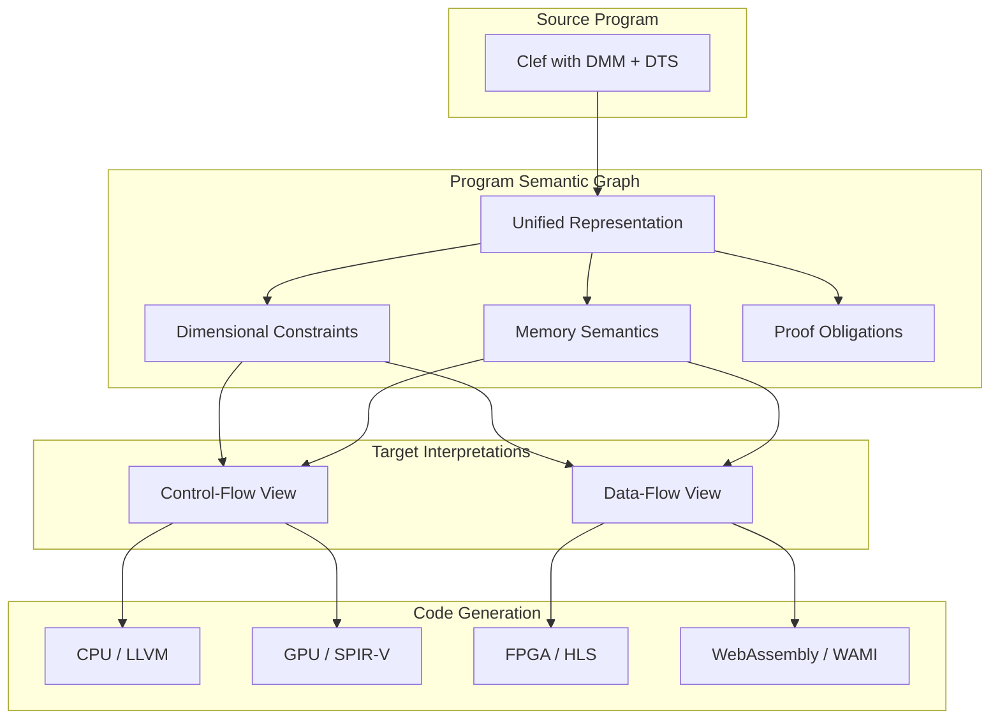

> This article was originally published on the
> [SpeakEZ Technologies blog](https://speakez.tech) as part of our early
> design work on the Fidelity Framework. It has been updated to reflect
> the Clef language naming and current project structure.

Two capabilities define the architectural foundation of the Fidelity framework:
- Deterministic Memory Management (DMM)
- Dimensional Type System (DTS)

While each addresses distinct engineering challenges, their real power emerges from a unifying insight: memory semantics and physical semantics are both dimensions. They survive compilation the same way, constrain code generation the same way, and enable verification the same way. This cohesion creates capabilities that no other toolchain provides.

This document explores why these systems belong together, how they enable hardware-aware compilation from a single source, and what this means for developers building systems that interface with physical reality.

## The Era of Managed Assumptions

To understand why DMM and DTS matter now, we must understand the constraints that shaped the previous generation of language design.

When Java, C#, Python, and F# emerged, the computing landscape looked fundamentally different. RAM was measured in single-digit megabytes. "Hardware" meant x86, perhaps SPARC. The operating system itself competed with applications for scarce resources. A single CPU with a single floating-point unit defined the execution model. In that context, language designers made reasonable engineering tradeoffs: erase type information early to reduce memory pressure, let garbage collectors handle memory so developers could focus on business logic, and treat the runtime as a trusted intermediary between programmer intent and machine execution.

Python's lineage illustrates this particularly well. ABC was a teaching language at CWI Amsterdam in the 1980s. Python emerged in 1991 as Guido van Rossum's scripting tool. NumPy arrived in 2005 to give researchers fast arrays. PyTorch and TensorFlow followed a decade later. At every step, the assumption was consistent: a knowledgeable human supervises the computation. The professor knows that column three contains velocity in meters per second. The graduate student knows which tensor axis represents batch versus sequence. The researcher validates results against physical intuition before publication.

> Back then, the code was a calculator, not a specification.

Dimensional semantics lived in lab notebooks, paper appendices, comments, and **in the *researcher's head***. This worked for its intended purpose: quick iteration on numerical experiments where humans closed the loop on correctness.

Year later, that stack emerged to become the foundation for autonomous vehicle perception, robotic surgery systems, industrial process control, drug discovery pipelines, and power grid management. Systems where no human supervises each inference. Where the model runs millions of times without a domain expert checking outputs. Where a dimensional error doesn't produce a bad plot; it produces a wrong action in the physical world.

We've used illustrative historical examples in other blog posts to outline where that can go wrong. The Mars Climate Orbiter disintegrated in 1999 because one team used pound-force seconds while another expected newton-seconds.[^1] The Ariane 5 rocket exploded in 1996 because a 64-bit floating-point value was converted to a 16-bit signed integer without range checking.[^2] These failures occurred in systems built with extraordinary care by talented engineers. The tooling simply couldn't catch dimensional and type errors that humans missed.

The managed runtime generation optimized for different concerns: developer productivity, rapid iteration, web services at scale. Dimensional constraints left to documentation and testing made sense for those domains. But the systems we build today increasingly interface with physical reality, and the tools we inherited were never designed to verify physical consistency.

## The Clef Position

The Fidelity framework addresses this gap through Clef, a concurrent systems language that targets MLIR and native executables rather than the .NET Common Language Runtime.

This distinction matters. Clef is to F#'s compiler heritage what [Chris Lattner's Mojo](/blog/musing-on-mojo/) intended to be to Python. In our case, we started from a foundation that didn't require splitting the language into two function types to achieve systems programming performance.

### F# already has:

**Computation expressions** that directly encode monadic and categorical patterns. Where other languages require complex type gymnastics to express effectful composition, F# makes it natural.

**Active patterns** that recognize and destructure complex patterns without verbose visitor hierarchies.

**Quotations** that preserve type-carrying structure for compile-time analysis and transformation.

**MailboxProcessor** that provides underpinnings for actor-based concurrency as a core language feature.

**Units of Measure** that express dimensional constraints at the type level with zero runtime cost.

**Statically Resolved Type Parameters** that enable compile-time specialization without source-level duplication.

These aren't incidental features; they form a coherent toolkit for expressing the kinds of abstractions that systems programming requires. The beauty is that these come from a 25-year long track record of success. The syntax remains largely unchanged. The semantics are preserved. The idioms work the same way. What changes is what survives "in the machinery" through our innovative compilation pathway.

In standard F#, Units of Measure erase before IL generation because the .NET BCL and CLR cannot represent dimensional metadata. The `inline` keyword is opt-in because aggressive inlining conflicts with the CLR JIT's assumptions. Both features are held out as optional features by platform constraints, not design flaws.

Clef has no such constraints. It targets MLIR, not IL. Dimensional types don't erase; they flow through the [Program Semantic Graph](/docs/design/program-semantic-graph/) to inform code generation. Memory lifetimes are tracked through [coeffect analysis](/docs/design/coeffects-and-codata/), as opposed to being relegated to a managed runtime. The result is native executables that preserve the semantic richness of the source language.

## Deterministic Memory Management

DMM in Fidelity draws from C++'s RAII patterns while expressing them through F# idioms. Resources have deterministic lifetimes. Cleanup happens at precise points in the program, not whenever a garbage collector decides to run. Memory allocation strategies are explicit and verifiable.

Consider a function that processes sensor data:

```fsharp
let processSensorBatch (sensors: Span<SensorReading>) (output: Span<ProcessedData>) =
    for i in 0 .. sensors.Length - 1 do
        output.[i] <- transform sensors.[i]
```

In a managed runtime, this code depends on the garbage collector to eventually reclaim any intermediate allocations. The timing is unpredictable. Memory pressure can cause GC pauses at inopportune moments. The developer has limited visibility into when and why allocations occur.

In Fidelity, the same code compiles with explicit memory semantics. The `Span` types carry lifetime information. The compiler verifies that `output` outlives the write operations. No intermediate allocations occur because the transformation happens in place. The generated code is predictable, auditable, and free of GC pauses.

This matters for real-time systems where latency spikes are unacceptable. It matters for embedded systems where memory is constrained. It matters for safety-critical systems where every allocation must be accounted for. It also happens to support large server platform work, as recent industry event have raised the spectre of "memory pressure" once again imposing a significant design constraint.

### Arena Allocation and Lifetime Tracking

Fidelity supports multiple allocation strategies through its memory model:

```fsharp
// Arena allocation for batch processing
use arena = Arena.create (megabytes 16)
let buffer = Arena.alloc<float> arena 1024
let result = processInArena buffer
// Arena released here, all allocations freed together

// Stack allocation for small, short-lived data
let localBuffer = stackalloc<float> 64
let localResult = processLocal (Span localBuffer)
// Stack frame cleanup, zero overhead

// Reference-counted allocation for shared ownership
let shared = RefCount.create initialValue
let reference = RefCount.share shared
// Released when last reference drops
```

The allocation strategy is not a type parameter that forces source-level duplication. **It flows through the coeffect system**, resolved at call sites, verified at compile time. A function that operates on `Span<float>` works with arena-allocated, stack-allocated, or reference-counted memory. The proofs verify that the allocation strategy satisfies the function's requirements. The compiler generates appropriate code for each call site.

## The Dimensional Type System

DTS makes dimensional constraints intrinsic to the type system. This extends F#'s Units of Measure from an erasable annotation to a preserved semantic property that survives compilation.

To situate this precisely: the type-theoretic spectrum runs from simple types at one end to Martin-Lof's intuitionistic type theory (MLTT) at the other. MLTT provides full dependent types with propositions-as-types; the foundation for Agda, Coq, Lean, and the theoretical ancestor of F\*. In that lineage, any proposition can be expressed as a type, and any proof is a program. The power is immense; the cost is that type checking can require arbitrary computation, and solver interaction may not terminate.

DTS occupies a specific, well-understood position on this spectrum:

| System | Expressiveness | Decidability | Survives Compilation |
|--------|---------------|-------------|---------------------|
| Simple types (Hindley-Milner) | Type structure only | Always decidable | Erased |
| Phantom types / F# UoM | Type-level tags, abelian group algebra | Always decidable | Erased |
| Refinement types (Liquid Haskell) | Predicates from decidable SMT theories | Always decidable | Erased |
| **DTS (Fidelity)** | **Predicates from decidable SMT theories** | **Always decidable** | **Preserved** |
| Dependent types (F\*, Agda, Coq) | Arbitrary propositions-as-types | May not terminate | N/A (extraction) |

In their original form, F#'s Units of Measure (including the FSharp.UMX extension library) are phantom type parameters. They constrain the type checker but erase before code generation because the .NET runtime cannot represent them. By contrast, our DTS materializes these phantom types as structured refinements that persist through the compiler's intermediate representation. The pivotal restriction, inherited from the Liquid Haskell tradition, is that each dimensional category maps to a decidable SMT theory: physical unit algebra maps to abelian group theory, memory space compatibility to enum sorts, width constraints to bitvector theory, and so on. Because each theory is decidable, the solver always terminates with a definitive answer; no fuel heuristics, no "unknown" results, no divergence.

The deliberate tradeoff: DTS gives up MLTT's full propositions-as-types in exchange for guaranteed decidability and the ability to preserve type information through compilation to multiple hardware targets. This is not a limitation but a design choice rooted in the observation that systems programming constraints: physical units, memory access modes, wire layouts, substrate compatibility, are inherently structured and finite. They do not require the full power of dependent types. They require the solver to always say yes or no.

### Samples of Dimensions in Fidelity

**Intrinsic Memory semantics**: ReadOnly, WriteOnly, Peripheral, Stack, Arena. Making memory access patterns explicit at the type level.

**Intrinsic Tensor indices**: batch, channel, height, width. Distinguishing axes that shape-only systems conflate.

**Abstract measures**: tokens, embeddings, attention heads. The vocabulary of machine learning architectures.

**Physical units**: meters, seconds, joules, amperes. The vocabulary of engineering and physics.

**Financial units**: USD, EUR, basis points, annualized rates. The vocabulary of quantitative finance.

**Domain identifiers**: customerId, orderId, sessionId. Preventing the common bug of passing the wrong ID to an API.

These dimensions don't erase after type checking. They flow through the [Program Semantic Graph](/docs/design/program-semantic-graph/) and inform code generation for any target. Eventually they *are* erased, as a ***zero cost*** abstraction, but not until after they have provided all of information needed for an efficient, safe and fast compute graph.

```fsharp
// Physical computation with verified dimensions
let computeDisplacement
    (velocity: float<meters/seconds>)
    (time: float<seconds>)
    : float<meters> =
    velocity * time  // Compiler verifies: (m/s) * s = m

// Attempting to add incompatible dimensions fails at compile time
let invalid = velocity + time  // Error: cannot add meters/seconds to seconds

// Memory-mapped peripheral with dimensional semantics
type TemperatureSensor = {
    Address: nativeint
    Access: ReadOnly
    Value: float<celsius>
}

let readTemperature (sensor: TemperatureSensor) : float<celsius> =
    // Compiler knows: read-only peripheral access returning celsius
    MemoryMapped.read sensor.Address
```

The practical consequence: when you write `velocity * time`, the compiler doesn't just check that you're multiplying two floats. It verifies that the dimensional algebra produces meters. When you read from a peripheral register, the compiler knows the access pattern and the unit of the returned value. This information guides code generation for the target architecture.

## The Unifying Insight

DMM and DTS appear to address different concerns: memory management and unit safety. The architectural insight that makes Fidelity coherent is recognizing they're the same mechanism.

A pointer to peripheral memory at address `0x40000000` has dimensional properties:

```fsharp
type PeripheralRegister<[<Measure>] 'unit> = {
    Address: nativeint
    Access: AccessMode      // ReadOnly | WriteOnly | ReadWrite
    Alignment: int<bytes>   // Dimensional: memory layout
    Value: float<'unit>     // Dimensional: physical meaning
}

let temperatureSensor : PeripheralRegister<celsius> = {
    Address = 0x40000000n
    Access = ReadOnly
    Alignment = 4<bytes>
    Value = 0.0<celsius>
}
```

The `ReadOnly` access mode is a dimension. The `4<bytes>` alignment is a dimension. The `celsius` unit is a dimension. They all constrain how the compiler generates code for this memory location. They all survive to inform register selection, barrier insertion, and instruction scheduling on the target hardware.

This unification enables the [Program Semantic Graph](/docs/design/program-semantic-graph/) to represent both control-flow (for CPU/sequential targets) and data-flow (for FPGA/spatial targets) interpretations of the same source program. Dimensional constraints are invariant across both interpretations. The pivot between representations preserves semantic meaning because dimensions survive the transformation.



## Coeffects: The Resolution Mechanism

A reasonable objection to this architecture concerns code duplication. If allocation strategies are part of the type, does every function need separate versions for arena, stack, and reference-counted memory?

The answer is no. Allocation strategy is a coeffect, not a type parameter.[^3]

Traditional effect systems track what code does to its environment: performs I/O, throws exceptions, mutates state. Coeffects flip this to track what code needs from its environment: network access, specific memory patterns, suspension capability. This distinction enables allocation-agnostic source code with call-site resolution.

```fsharp
// The function signature expresses requirements, not strategies
let inline processData (input: Span<float>) (output: Span<float>) =
    for i in 0 .. input.Length - 1 do
        output.[i] <- transform input.[i]
    // Implicit requirements:
    //   - input: ReadCapability, Lifetime(L_function)
    //   - output: WriteCapability, Lifetime(L_function)

// Call sites provide capabilities through allocation strategy
let arenaInput = Arena.allocSpan<float> arena 1000
let stackOutput = stackalloc<float> 1000

processData arenaInput (Span stackOutput)
// Compiler verifies:
//   - Arena satisfies ReadCapability ✓
//   - Arena lifetime ⊇ function scope ✓
//   - Stack satisfies WriteCapability ✓
//   - Stack lifetime ⊇ function scope ✓
```

The function `processData` is written once. At each call site, the compiler determines the allocation strategy from context, verifies that the strategy satisfies the function's requirements, and generates specialized code. No source-level duplication. No runtime dispatch. All verification happens at compile time.

The coeffect system in Fidelity tracks these contextual requirements through the Program Semantic Graph:

```
Function: processData
├── Parameter: input
│   ├── Type: Span<float>
│   ├── Requirement: ReadCapability
│   └── Requirement: Lifetime(L_function)
├── Parameter: output
│   ├── Type: Span<float>
│   ├── Requirement: WriteCapability
│   └── Requirement: Lifetime(L_function)
└── Proof Obligations:
    ├── input.Lifetime ⊇ L_function
    └── output.Lifetime ⊇ L_function
```

This approach draws from Koka's effect system[^4] and Rust's lifetime elision, adapting these ideas to our dimensional type system and MLIR's compilation model.

## Proofs and Verification

For safety-critical systems, decidable verification matters. MISRA guidelines, DO-178C certification, and similar standards require traceable reasoning about program behavior. The question arises: if allocation strategy is resolved at call sites, how do proofs remain decidable?

The crux of our position: proofs constrain abstract requirements, not concrete implementations.

| Abstract Requirement | Proof Obligation | Arena | RefCount | Stack |
|---------------------|------------------|-------|----------|-------|
| Outlives scope L | Lifetime ⊇ L | ✓ | ✓ | ✓ |
| Mutable access | WriteCapability | ✓ | ✓ | ✓ |
| No aliased writes | Uniqueness | Checkable | Checkable | Guaranteed |
| Thread-safe | SyncCapability | ✗ | ✓ | ✓ |

A function requiring `WriteCapability` and `Lifetime(L)` can be called with any allocation strategy that provides those capabilities. The proof verifies the abstract requirements. The compiler verifies that each call site's allocation strategy satisfies those requirements. Both verifications happen at compile time.

This approach integrates with Z3 and cvc5 for SMT solving, as described in [Proof-Aware Compilation](/docs/design/proof-aware-compilation/). The [compilation ledger](/docs/design/coeffects-and-codata/) records each verification decision: which requirements a function has, which capabilities a call site provides, why the capabilities satisfy the requirements.

```fsharp
// SMT specification for verified memory operation
[<SMT Requires("writable(output) && length(output) >= length(input)")>]
[<SMT Ensures("forall i. i < length(input) ==> output[i] = transform(input[i])")>]
let processData (input: Span<float>) (output: Span<float>) =
    for i in 0 .. input.Length - 1 do
        output.[i] <- transform input.[i]
```

The proof obligations are allocation-agnostic. Whether `output` lives in an arena, on the stack, or in reference-counted memory, the proof that every element is correctly transformed remains valid.

## Differentiation Through Scope

Other projects also target MLIR. Modular's Mojo compiles Python-syntax code through MLIR to optimized machine code. The question naturally arises: what distinguishes Fidelity's approach?

The answer lies in scope, not competition. Modular has built excellent infrastructure for composing expert-written kernels for ML inference. Their graph compiler operates on tensor graphs that are already dataflow representations. When they fuse `matmul+bias+relu` into a single kernel, they're optimizing arithmetic on tensors of shape `[batch, sequence, hidden]`. This is valuable work that serves the ML inference use case well.

What Modular cannot preserve is dimensional semantics, because those semantics were never in Python or PyTorch to begin with. When Chris Lattner says "we're not an AI compiler, we're throwing that concept away,"[^5] he's being precise about their scope: kernel infrastructure for experts who carry domain knowledge in their heads.

Fidelity addresses a different problem. The [Program Semantic Graph](/docs/design/program-semantic-graph/) represents general Clef programs with control flow, recursion, closures, and pattern matching. Via the equivalence between SSA and functional programming established by Appel[^6], the same structure can be interpreted as control-flow graph (for CPU/sequential targets) or dataflow graph (for FPGA/spatial targets). Dimensional constraints are invariant across both interpretations.

This isn't criticism. Different solution spaces require different architectures. But the asymmetry is worth noting: Fidelity's PSG can represent tensor computations and lower them through MLIR to optimized kernels. That's just dataflow with arithmetic, which the graph handles natively and with extreme efficiency. The reverse isn't true. Modular cannot reconstruct the semantic information it never had: dimensional constraints, physical invariants, or the control-flow/dataflow duality that enables targeting other advanced accelerators. They do their thing well. We can do their thing *and* everything else that our innovations make possible.

This matters concretely. A physics-dependent neural network built with other tools may produce outputs that fit training data. But lurking behind the scenes are violations of conservation of energy, impossible accelerations, and mixed reference frames. This is "AI hallucination" in a nutshell. No standard compiler catches these errors because dimensional information was never encoded. Fidelity changes this: auto-differentiation respects dimensional constraints, gradients carry physical units, and loss functions are verified for dimensional consistency. The training dynamics stay grounded in physical reality because the type system won't allow otherwise.

## The Ada/VHDL Heritage

This approach isn't novel. Ada understood that physical types guide compilation. VHDL understood that timing constraints in nanoseconds affect synthesis decisions.

Ada's type system supports dimensional analysis through derived types:

```ada
type Meters is new Float;
type Seconds is new Float;
type Meters_Per_Second is new Float;

function "/" (Left : Meters; Right : Seconds) return Meters_Per_Second;
```

VHDL's physical types carry units through synthesis:

```vhdl
type TIME is range implementation_defined
    units
        fs;
        ps = 1000 fs;
        ns = 1000 ps;
        us = 1000 ns;
        ms = 1000 us;
        sec = 1000 ms;
    end units;
```

These languages emerged in contexts where software controlled hardware directly: avionics, telecommunications, industrial control. The engineers who designed them understood that dimensional information serves dual purposes: correctness verification and synthesis guidance. Timing constraints in VHDL don't just verify that a design meets specifications; they inform the synthesizer's routing and resource allocation decisions.

The managed runtime generation largely abandoned this discipline. Reasonable enough for web services and business applications where meters per second don't matter. But as software increasingly interfaces with physical systems, the Ada/VHDL insight becomes relevant again.

Fidelity restores that discipline in a modern functional language, with the added capability that dimensions guide code generation for any target: CPU, GPU, FPGA, spatial accelerator. The comparison point isn't Python or C#; it's Ada and VHDL, languages that understood what systems programming requires.

## Adoption and Innovation Budget

Every framework asks developers to learn something new. The question is whether the learning investment yields proportionate capability. Fidelity's approach minimizes the innovation budget while maximizing the capability payoff.

For F# developers, the language is familiar. Computation expressions work the same way. Active patterns work the same way. Units of Measure work the same way, except now they don't erase. The new learning is understanding what compilation to native code means: deterministic memory lifetimes, explicit allocation strategies, preservation of dimensional information through to machine code.

The verification depth is opt-in. Most code needs no SMT proofs. Developers add verification where the domain demands it: safety-critical paths, regulatory requirements, high-assurance components. The framework handles everything from casual tooling to the most stringent certification requirements.

```fsharp
// Simple code: no proofs needed
let average (values: float[]) =
    values |> Array.average

// Safety-critical code: full verification
[<SMT Requires("length(values) > 0")>]
[<SMT Ensures("result >= min(values) && result <= max(values)")>]
let verifiedAverage (values: float[]) =
    values |> Array.average
```

The same language, the same idioms, different levels of assurance based on the application's requirements.

## The Multi-Stack Reality

Modern systems don't run on single architectures. A robotics application might process sensor data on an FPGA, run inference on a GPU, execute control logic on a CPU, and communicate over a network. Current practice requires different languages, different toolchains, and manual coordination at every boundary.

Fidelity's unified representation enables a completely new set of options for designers, integrators and decision-makers. For the first time, the same elegant Clef semantics can compile to appropriate code for each target. Dimensional constraints verified once apply across all targets. Memory semantics appropriate to each platform are generated from the same source.

```fsharp
// Single source, multiple targets
let processAndControl (sensor: SensorInput<celsius>) =
    // Runs on FPGA: signal processing
    let filtered = lowPassFilter sensor.Signal

    // Runs on GPU: inference
    let prediction = neuralPredict filtered

    // Runs on CPU: control logic
    let command = computeControl prediction

    // Dimensional consistency verified across all stages
    // Memory semantics appropriate to each target
    command
```

This is the promise of DMM and DTS together: a coherent foundation for systems that span architectural boundaries while maintaining semantic consistency throughout. Not through magic, but through simply preserving the information that makes consistency verifiable.

## Conclusion

The Fidelity framework bets on a specific thesis: that preserving semantic information through compilation yields capabilities worth the engineering investment. The ***zero-cost*** abstraction that enables these capabilities are potentially industry-changing. DMM provides deterministic memory management that makes resource lifetimes explicit and verifiable. DTS provides dimensional types that survive compilation to inform code generation in a way that has never existed before. Together, they enable hardware-aware compilation from a single source with verified consistency across targets.

While this might not right approach for every domain, it has a high degree of reach. Web services don't need meters per second verified at compile time, but both .NET and Fable compiled versions of F# can handle that domain admirably. Business applications don't need deterministic microsecond-level resource cleanup, but F# has handled that efficiently for a generation. The tooling that exists serves those domains well.

And while we see the Fidelity framework as a general systems platform that can span from the server to the microcontroller, we see particular strength in targeting systems that interface with physical reality. The language is concise and familiar. The compilation target is native code via MLIR. The semantic information that previous models would discard now survives to do mission-critical work.

The multi-stack world is here. The question is whether our tools will rise to meet it.

---

[^1]: Stephenson, A. G., et al. ["Mars Climate Orbiter Mishap Investigation Board Phase I Report."](https://llis.nasa.gov/llis_lib/pdf/1009464main1_0641-mr.pdf) NASA, November 10, 1999. The report identified the root cause as failure to convert English units to metric units in ground-based software.

[^2]: Lions, J. L. ["ARIANE 5 Flight 501 Failure Report."](https://www.esa.int/esapub/bulletin/bullet89/dalma89.htm) European Space Agency, July 1996. The report details how a 64-bit to 16-bit conversion overflow caused the guidance system failure.

[^3]: Petricek, Tomas, Dominic Orchard, and Alan Mycroft. ["Coeffects: A calculus of context-dependent computation."](https://doi.org/10.1145/2628136.2628160) ACM SIGPLAN Notices 49.9 (2014): 123-135. This paper formalizes how coeffects track what computations require from their context.

[^4]: Leijen, Daan. ["Koka: Programming with row polymorphic effect types."](https://doi.org/10.4204/EPTCS.153.8) Electronic Proceedings in Theoretical Computer Science 153 (2014): 100-126. Koka's effect system demonstrates how effect tracking enables compiler optimization without runtime overhead.

[^5]: Lattner, Chris. [High Performance AMD GPU Programming with Mojo](https://youtu.be/liR2Pn5Zp9g?si=ToZNniDyFvl_X-G0), 2025. In discussing Modular's approach to ML compilation, Lattner explicitly distinguished their kernel-infrastructure focus from traditional AI compiler approaches.

[^6]: Appel, Andrew W. ["SSA is functional programming."](https://doi.org/10.1145/278283.278285) ACM SIGPLAN Notices 33.4 (1998): 17-20. This paper establishes the equivalence between SSA form and functional programming, enabling the dual interpretation central to Fidelity's Program Semantic Graph.
