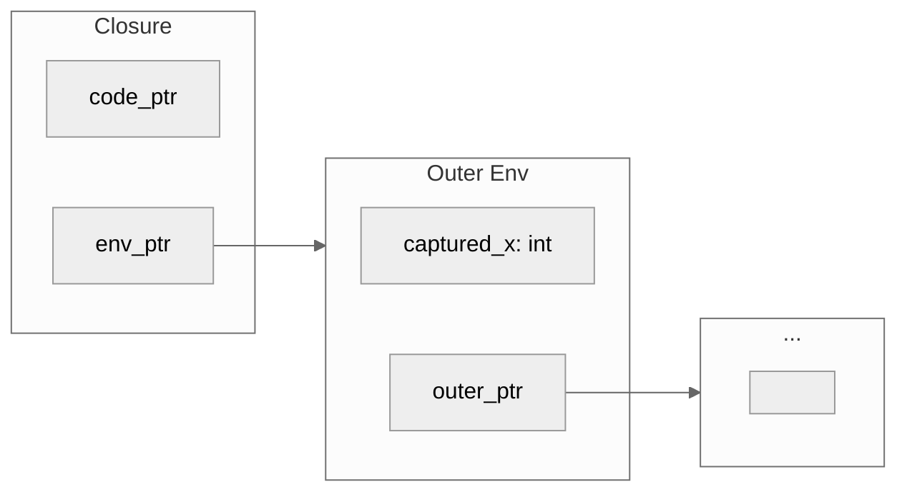
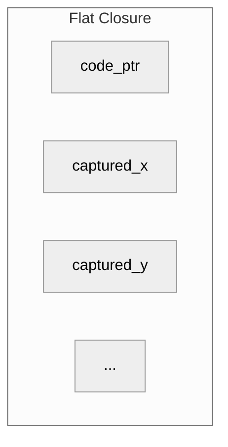

> This article was originally published on the
> [SpeakEZ Technologies blog](https://speakez.tech) as part of our early
> design work on the Fidelity Framework. It has been updated to reflect
> the Clef language naming and current project structure.

Every language that supports first-class functions faces the same question: where do captured variables live? Whether you're writing Rust closures that require explicit lifetime annotations, Go functions that capture by reference and cause subtle bugs, or Python lambdas that surprise you with late binding that can corrupt your expected state, you've encountered the closure problem. JavaScript developers know the classic loop-variable trap. C# developers have watched the compiler generate mountains of hidden classes. The syntax varies; the underlying tension is universal. Fidelity's approach to this problem draws from decades of compiler research, specifically the Standard ML tradition and the MLKit project's "flat closure" representation, to generate native code that is both memory-safe and runtime-free.

When a function captures variables from its enclosing scope, those variables must live somewhere; they many times persist beyond the stack frame that created them. In managed runtime environments, this is straightforward: the garbage collector handles everything. In native compilation without a runtime, the question becomes much more nuanced, more subtle, more architectural.

## The Closure Problem in Native Compilation

Consider a simple counter factory in Clef:

```fsharp
let makeCounter (start: int) : (unit -> int) =
    let mutable count = start
    fun () ->
        count <- count + 1
        count
```

This function returns a lambda that captures `count`, a mutable variable. Each call to `makeCounter` should produce an independent counter with its own state. When invoked, each counter should increment its own captured value.

In .NET, this works transparently. The runtime allocates a heap object to hold captured variables, and garbage collection ensures that object lives as long as any closure references it. The developer writes the code; the runtime handles memory.

Native compilation has no such luxury. Without garbage collection, the compiler must decide at compile time where captured variables live, how closures reference them, and how memory is reclaimed. This is not merely an implementation detail; it is an architectural decision that affects correctness, performance, and memory safety.

## Two Schools: Linked vs Flat

The academic literature presents two fundamental approaches to closure representation. Understanding both clarifies why Fidelity chose the path it did.

### Linked Closures

The traditional approach, dating to early Lisp implementations and formalized in Cardelli's 1983 work, uses linked environment chains. Each closure contains a pointer to its immediately enclosing environment, which may itself contain pointers to outer environments.



This representation is simple to implement. Creating a closure requires only storing a pointer to the current environment. Variable access follows the chain to find the appropriate binding.

The problem emerges in the presence of garbage collection, or more precisely, in its absence. Linked closures keep entire environment chains alive. A closure that captures only one variable from an outer scope nonetheless prevents that entire outer environment from being reclaimed. In systems programming contexts, this "space leak" is unacceptable.

### Flat Closures

The alternative, developed by Appel and Shao in their 1992 work on Standard ML of New Jersey and refined in the MLKit compiler project, is the flat closure. All captured variables are copied directly into the closure structure itself.



No pointers to outer environments. No chains to traverse. Each closure is self-contained.

The trade-off is creation cost: building a flat closure requires copying all captured values rather than storing a single pointer. For closures that capture many large values, this could be expensive. In practice, most closures capture few values, and the flat representation fits in a single cache line. The access pattern is dramatically better: direct offset rather than pointer chasing.

More importantly for Fidelity's purposes, flat closures are "safe for space" in the formal sense defined by Shao and Appel. A closure holds references only to what it actually uses. When the closure becomes unreachable, all captured values become unreachable. There is no hidden retention of environment chains.

## The MLKit Heritage

The MLKit compiler, developed at the IT University of Copenhagen, pioneered region-based memory management for Standard ML. Rather than garbage collection, MLKit statically infers memory regions and their lifetimes. Values are allocated into regions; entire regions are deallocated at once when their lifetime ends.

Closures in MLKit use the flat representation precisely because it integrates cleanly with region analysis. A flat closure's lifetime is straightforward: it lives in some region, and when that region is reclaimed, the closure and its captured values go with it. Linked closures would complicate this analysis by creating cross-region references that might extend lifetimes unexpectedly.

The MLKit approach influenced our design significantly. While Fidelity's current implementation uses stack allocation and explicit region management rather than MLKit's full region inference, the flat closure representation enables future adoption of more sophisticated region-based schemes. The architecture does not paint us into a corner.

## Capture Semantics: ByValue and ByRef

A critical detail distinguishes Fidelity's closure implementation: the handling of mutable captures. This section summarizes key points; for a deeper treatment of reference semantics in native compilation, see [ByRef Resolved](/docs/design/byref-resolved/).

When a closure captures an immutable binding, the value is copied into the closure structure. This is straightforward; the closure receives its own copy, and modifications to the original binding (were they possible) would not affect the closure's copy.

Mutable bindings require different treatment. A mutable variable captured by multiple closures must share state; all closures must see the same value. Copying the value would break this contract.

The solution is to capture mutable bindings by reference. The closure stores a pointer to the original variable's storage location, not a copy of its value.

```fsharp
let makeCounter (start: int) =
    let mutable count = start
    fun () ->
        count <- count + 1
        count
```

In the generated code, `count` lives in stack memory allocated by `makeCounter`. The returned closure contains a pointer to that memory location. When the closure increments `count`, it does so through that pointer, mutating the original storage.

This raises an immediate question: what happens when `makeCounter` returns? The stack frame is gone; the pointer dangles.

The answer lies in how Fidelity handles closure lifetimes. When a mutable capture escapes its defining scope (as it does when returned from `makeCounter`), the compiler hoists that storage to a location with appropriate lifetime. In current implementation, this means arena allocation. The captured variable lives in the arena until the arena is released, ensuring the pointer remains valid as long as any closure references it.

## Null Avoidance in MLIR Lowering

The Fidelity framework's commitment to null-free computation extends through the entire compilation pipeline, including closure representation. This is not a surface-level API decision; it is a structural property of the generated code.

Consider the MLIR generated for a flat closure:

```mlir
// Closure struct type: { ptr<fn>, ptr<i32> }
%env_alloca = llvm.alloca %one x !llvm.struct<(ptr, ptr)> : (i64) -> !llvm.ptr
%count_addr = llvm.getelementptr %env_alloca[0, 1] : (!llvm.ptr) -> !llvm.ptr
llvm.store %count_ptr, %count_addr : !llvm.ptr, !llvm.ptr
%code_addr = llvm.getelementptr %env_alloca[0, 0] : (!llvm.ptr) -> !llvm.ptr
llvm.store %fn_ptr, %code_addr : !llvm.ptr, !llvm.ptr
```

Every field is initialized. The code pointer is never null; it points to the closure's implementation function. Captured value pointers are never null; they point to valid storage. There is no "uninitialized closure" state, no sentinel values, no null checks at call sites.

This property propagates through LLVM lowering to the final native code. The binary contains no null pointer checks for closure invocation. The type system, through CCS and Alex, has guaranteed at compile time that closures are well-formed. The runtime cost of this safety is zero.

Compare this with managed runtime implementations, where closure objects may be null, where captured variable references may be null, where every access potentially requires defensive checking. The overhead accumulates invisibly, scattered across the codebase in null guards that the JIT may or may not optimize away.

## The Two-Pass Architecture

Implementing flat closures in the Composer compiler required careful orchestration. The challenge stems from a circular dependency: closure layout depends on SSA (Static Single Assignment) identifiers for captured variables, but SSA assignment traditionally precedes structural analysis.

The solution is a two-pass architecture in the Alex preprocessing phase.

**Pass 1: Capture Identification** runs before SSA assignment. It traverses the Program Semantic Graph (PSG), identifies lambda nodes, and marks which variables each lambda captures. This pass also determines capture semantics: ByValue for immutable bindings, ByRef for mutable bindings.

**SSA Assignment** then runs with awareness of captures. Variables that are captured by reference receive additional SSA identifiers for their addresses, not just their values.

**Pass 2: Closure Layout** runs after SSA assignment. With SSA identifiers now available, this pass computes the concrete layout of each closure's environment structure: field offsets, struct types, and the synthetic SSA identifiers for environment allocation and field access.

This separation respects the Composer principle that the PSG should be complete before witnessing. The Zipper and witness system observe pre-computed coeffects; they do not compute structure during code generation. Closure layout is data flowing through the pipeline, not logic embedded in MLIR emission.

## The Familiar Surface

All of this complexity exists beneath a familiar API. Clef developers write closures exactly as they would for .NET:

```fsharp
let greetAlice = makeGreeter "Alice"
let greetBob = makeGreeter "Bob"
Console.writeln (greetAlice "Hello, ")   // "Hello, Alice"
Console.writeln (greetBob "Welcome, ")   // "Welcome, Bob"
```

The syntax is unchanged. The semantics are unchanged. What differs is the underlying representation: stack-allocated flat closures instead of heap-allocated reference types, explicit lifetime management instead of garbage collection, zero runtime overhead instead of GC pause potential.

This is the Fidelity promise: familiar Clef idioms at design time, native performance at runtime. The compiler handles the translation; the developer writes the code they already know.

## Toward Heterogeneous Futures

The flat closure architecture is not merely an optimization for today's hardware. It positions Fidelity for the heterogeneous computing landscape that we explored in "The Return of the Compiler," where managed runtimes built in the 1990s struggle to address modern accelerator architectures.

Flat closures have deterministic size and layout. They can be serialized without runtime metadata. They can be copied between memory spaces without GC coordination. These properties matter when targeting GPUs, FPGAs, or specialized accelerators where managed runtime assumptions simply do not hold.

The MLKit research that informs our approach was itself motivated by similar concerns: how to bring functional programming to environments where garbage collection is impractical or impossible. Three decades later, that research finds new relevance as computation moves beyond the CPU-centric model that managed runtimes assume.

## Basis in Proven Research

Fidelity's closure implementation builds on decades of research. The key sources include:

Appel and Shao's 1992 paper "Callee-save Registers in Continuation-passing Style" introduced the flat closure representation that eliminates environment chains. Their subsequent work on space efficiency formalized the safety properties that flat closures provide.

Tofte and Talpin's 1997 paper "Region-Based Memory Management" established the theoretical foundation for the MLKit compiler's approach, demonstrating that static analysis could replace garbage collection for a significant class of programs.

The MLKit compiler itself, documented in "Programming with Regions in the MLKit" (Elsman, 2021), provides a production-quality implementation of these ideas for Standard ML.

More recently, Perconti and Ahmed's 2019 paper "Closure Conversion is Safe for Space" provides formal verification that flat closure representations maintain the asymptotic space bounds of the original program, a property that linked closures cannot guarantee.

This body of work demonstrates that Fidelity's approach is not experimental; it is the application of well-established techniques to Clef compilation. The novelty lies in the integration: bringing these ideas into a pipeline that preserves Clef semantics while targeting MLIR and native code.

## What Comes Next

Our current ramp-up of Fidelity framework validates closures: counter factories, greeting generators, accumulators, range checkers. Each "hello world" check verifies different aspects of capture semantics and closure invocation. When these samples pass, Fidelity will have shown that Clef closures compile correctly without runtime dependencies.

But closures are foundational, not final. Higher-order functions build on closures. Sequences and lazy evaluation depend on them. The concurrent async machinery we have initially planned, using LLVM coroutines rather than managed task infrastructure, will use closures for callback representation.

The flat closure architecture supports this progression. Its space efficiency means that closure-heavy code patterns (common in functional programming) do not incur memory pressure. Its null-free representation means that closure-based APIs do not require defensive coding. Its deterministic layout means that closures integrate cleanly with the region-based memory model that Fidelity will adopt for more sophisticated scenarios.

Gaining closure, in both senses, opens the path forward.

## Related Reading

For more on the Fidelity framework and native Clef compilation:

- [ByRef Resolved](/docs/design/byref-resolved/) - Reference semantics in native Clef compilation
- [Clef: From IL to NTU](/docs/design/il-to-ntu/) - The Native Type Universe architecture
- [The Return of the Compiler](https://speakez.tech/blog/the-return-of-the-compiler/) - Why managed runtimes are becoming vestigial
- [Absorbing Alloy](/docs/design/absorbing-alloy/) - The native standard library comes home
- [Memory Management By Choice](/docs/design/native-memory-management/) - BAREWire and region-based memory
