> This article was originally published on the
> [SpeakEZ Technologies blog](https://speakez.tech) as part of our early
> design work on the Fidelity Framework. It has been updated to reflect
> the Clef language naming and current project structure.

The industry is witnessing an unprecedented \$4 billion investment to finally set aside the 80-year-old Harvard/Von Neumann computer design pattern. Companies like NextSilicon, Groq, and Tenstorrent are building novel, alternative architectures that eliminate the traditional bottlenecks between memory and program execution. Yet compiler architectures remain trapped in antiquated patterns - forcing stilted relationships into artificial constructions, obscuring the natural alignment with the emerging dominance of dataflow patterns. What if targeting both traditional and revolutionary architectures lies not in choosing sides, but in recognizing that programs are "hypergraphs" by nature? The evolution from our Program Semantic Graph (PSG) to a Program Hypergraph (PHG) isn't just nomenclature - it's the architectural insight that will enable Fidelity to produce efficient workflows for everything from LLVM-targeted CPUs to photonic processors that promise to revolutionize throughput and efficiency.

But there's a deeper vision: what if this hypergraph could transform into a learning system? The future design of a full-fledged temporal graph could improve design and efficiency with each application, or even with each iteration. This isn't speculative - it's the natural evolution of combining recursion schemes, bidirectional zippers, and event-sourced compilation telemetry. These are all well-established algorithmic tools that are finally meeting their moment with today's new Cambrian explosion of modern compute hardware. Within the Fidelity framework we can revolutionize efficiency and safety in the "old guard" architectures while seamlessly profiling and targeting new architectures from the same principled framework.

## The Unified Compilation Vision

In its final future representation, the PHG design would enable a unified compilation strategy that adapts seamlessly across the traditional and new processor spectrum:

```mermaid
graph TD
    subgraph "Program Hypergraph Core"
        PHG[Unified PHG Representation<br/>Multi-way relationships preserved]
    end

    subgraph "Gradient-Based Analysis"
        PHG --> GRADIENT[Zipper Graph Traversal]
        GRADIENT --> VN[Harvard/Von Neumann<br/>Emphasis]
        GRADIENT --> HYBRID[Hybrid<br/>Balance]
        GRADIENT --> DATAFLOW[Dataflow<br/>Emphasis]
    end

    subgraph "Architecture-Specific Generation"
        VN --> LLVM[LLVM IR<br/>Control Flow + Caching<br/>Sequential Optimization]
        HYBRID --> MIXED[Heterogeneous<br/>CPU Control + GPU Data<br/>Balanced Execution]
        DATAFLOW --> SPATIAL[Spatial Kernels<br/>Streaming Pipelines<br/>Graph Computing]
    end

    subgraph "Target Architectures"
        LLVM --> CPU[x86/ARM/RISC-V<br/>Traditional Processors]
        MIXED --> CPUGPU[CPU+GPU Systems<br/>Heterogeneous Platforms]
        SPATIAL --> POSTVM[Groq/Tenstorrent/E1<br/>Post-Von Neumann]
    end
```



## The Decomposition Challenge

Traditional compiler intermediate representations don't create cruft because of inherent complexity - they falter because they **decompose multi-way relationships into artificially disconnected operations**. Consider how async code with delimited continuations naturally creates rich, multi-way dependencies that current IRs must awkwardly represent through opaque state machines. This isn't computational convenience. It's a gravitational well of cruft, inefficiency, and increasing surface area for potential vulnerabilities and errors from which it can be a nightmare to recover.

Traditional graphs force us to create:

- Auxiliary "join" nodes to merge multiple inputs
- Artificial "split" nodes to distribute outputs
- Property lists and metadata to track what should be intrinsic relationships

This stilted decomposition doesn't just lose semantic information - it **obscures the fundamental shift from control-flow to data-flow** that defines the continuum from "Modified Harvard" or "Von Neumann" to next generation processor architectures. Traditional compiler representations emphasize control flow (sequential instruction execution, branching, state machines and memory-compute separation) which aligns perfectly with the Modified Harvard/Von Neumann architectural assumptions. But as we've seen with the advent of AI and high performance computing taking center stage, new processors will process in terms of data flow - their natural representation - where computation is spatially adjacent to data, multiple operations proceed simultaneously with fewer processor wait cycles and less heat dissipation burden.

The real issue is that these "old school" Harvard/Von Neumann assumptions cannot capture the simultaneity and spatial locality that these new architectures exploit. When we force multi-way data flow relationships into standard control flow, we lose the semantic richness needed to generate truly efficient code. The beauty of this future-forward posture of the PHG within the Composer compiler is that it can take ***the same application code*** and articulate it for traditional control flow (CFG) instructions to all of the standard targets people have known for decades. And what's more, when new hybrid systems emerge, the Fidelity framework would be able to address each type of processor in the most efficient way using the same code base. No duplicate staffing plans. No new languages or APIs for teams to learn. No expensive or risky technical hoops to jump through.

## Time-Tested Math Meets The Latest Hardware

Before diving into the mathematical notation below, let's be clear: **you don't need to understand these formulas to benefit from this approach**. Just as you don't need to understand the mathematics of B-trees to use a database, or the intricacies of TCP/IP to build web applications, these mathematical foundations work quietly behind the scenes. The formulas represent well-established algorithms - some dating back to the 1960s and 70s - that have been waiting decades for the right systems and compilation frameworks to unleash their full potential.

Think of these equations as the "engine specifications" of our compiler. Most drivers never read their car's technical manual, yet they benefit from centuries of accumulated automotive engineering every time they turn the key. Similarly, these algorithmic frameworks have natural affinities that have existed for decades - we're simply bringing them together in a way that modern hardware can finally fully utilize to benefit the speed and efficiency that the emerging business landscape demands.

### Hypergraph Partitioning with Learning

Here we show how the partitioning problem becomes "adaptive". This formula, rooted in graph theory work from the 1970s, essentially asks: "How do we split up a complex program into chunks that different processors can handle efficiently?"

\[
\text{cut}_t(P) = \sum_{e \in E} w_t(e) \cdot |\{V_i : V_i \cap e \neq \emptyset\}|
\]

In plain English: the subscript \(t\) represents time - meaning the compiler gets smarter with each compilation. The \(w_t(e)\) represents learned weights - think of these as the compiler saying "last time I compiled similar code, this strategy worked well, so let's favor it again." This isn't new math - it's the same partitioning problem computer scientists have studied since the dawn of parallel computing. We're just adding a learning component that remembers what worked before.

### Temporal Coeffect Propagation

This notation, based on type theory from the 1980s, tracks what your code needs from its environment over time:

\[
\Gamma @ R_t \vdash e : \tau
\]

Don't let the symbols intimidate you - this simply means: "Given some context (\(\Gamma\)) and requirements that evolve over time (\(R_t\)), we can prove that expression \(e\) has type \(\tau\)."

In practical terms, it's the compiler keeping track of questions like: "Does this function need network access? Does it require specific hardware features? Have we seen similar patterns before?" The mathematical notation just makes these informal questions precise and verifiable. The \(@\) symbol (pronounced "at") has been used in coeffect systems to indicate "in the context of" - it's not exotic, just specialized notation that's become standard in this field.

### Parametric Learning

Free theorems, discovered in the 1980s by Philip Wadler, tell us that certain program transformations are always safe. This formula extends that insight with learning:

\[
\forall \alpha, \beta. \forall g : \alpha \to \beta. \text{map}\,g \circ f_\alpha = f_\beta \circ \text{map}\,g + \epsilon_t
\]

The symbols translate to something quite intuitive: "For any types \(\alpha\) and \(\beta\), and any function \(g\) that converts between them, we can rearrange our operations (the map compositions) and the result will be the same, with learned adjustments (\(\epsilon_t\))."

This is like saying that whether you translate a document then format it, or format it then translate it, you should get the same result - and over time, the compiler learns which order is faster for different types of documents. The \(\epsilon_t\) represents those learned optimizations - small adjustments based on real-world performance data.

### Why These Tested Concepts Matter Now

These mathematical frameworks aren't empty exercises - they're tested axioms that have been waiting for their moment in broad-based systems development:

- **Hypergraph partitioning** has been used in VLSI chip design since the 1970s
- **Coeffect systems** emerged from decades of research in context-aware computing
- **Free theorems** have been a cornerstone of functional programming optimization since the 1980s

What's new isn't the math - it's that modern hardware architectures finally have the architectures that these algorithms were designed to exploit. And with MLIR providing a common compilation framework, we can finally bring these time-tested approaches together in a practical system.

**The bottom line for developers**: You write normal Clef code. The compiler uses these mathematical frameworks - refined over decades by some of the brightest minds in computer science - to transform your code into highly optimized executables. You don't need to understand the math any more than you need to understand semiconductor physics to use a computer. But knowing that these foundations exist, and that they're based on decades of proven research rather than trendy new ideas, should give you confidence that this approach is both principled and practical.

Now let's see how these mathematical foundations enable something truly exciting: a compiler that learns and improves over time.

## The PHG as a Learning System

Here's where our vision extends beyond older styles of compilation: the Program Hypergraph doesn't just represent a single compilation - it evolves across compilations, learning from each pass in the compilation process. This transforms the PHG from a data structure into a temporal graph that not only improves with experience but can serve to create optimization patterns for mapping application structure to new architectures.

### Temporal Hypergraph Architecture

```fsharp
// The PHG evolves into a learning system
type TemporalProgramHypergraph = {
    Current: ProgramHypergraph
    History: TemporalProjection list
    LearnedPatterns: CompilationKnowledge
    RecursionSchemes: SchemeLibrary
}

and TemporalProjection = {
    Timestamp: DateTime
    GraphSnapshot: ProgramHypergraph
    CompilationDecisions: Decision list
    PerformanceMetrics: Metrics
    ZipperTraversalPaths: ZipperPath list  // How we navigated
}

and CompilationKnowledge = {
    OptimizationPatterns: Map<PatternFingerprint, OptimizationStrategy>
    CoeffectPropagation: Map<NodeSignature, CoeffectSet>
    HyperedgeFormation: Map<RelationshipPattern, HyperedgeType>
}
```

Compilation patterns repeat - not just within a single program, but across compilation iterations as code evolves. A temporal graph would over time serve to recognize and optimize these patterns.

## Recursion and Bidirectional Zippers

The foundation for navigating this temporal hypergraph comes from recursion schemes combined with bidirectional zippers. This isn't just about traversing the current graph for a given compilation pass - it's about learning optimal traversal patterns over time.

### Recursion Schemes for Hypergraph Transformation

```fsharp
// Recursion schemes that understand hyperedges
type PHGRecursionScheme<'a, 'b> =
    | Catamorphism of (PHGHyperedge -> 'a list -> 'a)  // Bottom-up
    | Anamorphism of ('b -> PHGHyperedge)              // Top-down
    | Hylomorphism of (PHGHyperedge -> 'a list -> 'a) * ('b -> PHGHyperedge)  // Both
    | Paramorphism of (PHGHyperedge * ProgramHypergraph -> 'a)  // With history

// Hyperedge-aware recursion preserves multi-way relationships
let rec cataHypergraph (f: PHGHyperedge -> 'a list -> 'a) (phg: ProgramHypergraph) : 'a =
    match phg with
    | HyperedgeNode hyperedge ->
        let childResults =
            hyperedge.Participants
            |> Set.map (fun p -> cataHypergraph f p)
            |> Set.toList
        f hyperedge childResults
    | SimpleNode node ->
        f (promoteToHyperedge node) []
```

### The Temporal Zipper

The bidirectional zipper becomes even more powerful when it can traverse not just the current graph, but also its temporal projections:

```fsharp
type TemporalZipper<'a, 'b> = {
    Focus: PHGNode
    SpatialContext: PHGContext     // Current graph position
    TemporalContext: TemporalContext  // Position in time
    RecursionScheme: PHGRecursionScheme<'a, 'b>  // Current traversal
    TraversalMemory: TraversalHistory
}

and TemporalContext =
    | Present of currentVersion: int
    | Past of version: int * projection: TemporalProjection
    | Comparing of current: PHGNode * past: PHGNode list

and TraversalHistory = {
    VisitedPatterns: Set<PatternFingerprint>
    SuccessfulTransformations: Map<PatternFingerprint, Transformation>
    OptimalPaths: Map<CompilationGoal, ZipperPath>
}

// Navigate through time and space
let temporalNavigation (zipper: TemporalZipper) =
    match zipper.RecursionScheme with
    | Catamorphism f ->
        // Bottom-up traversal comparing with past compilations
        let pastResults =
            zipper.TemporalContext
            |> getHistoricalCompilations
            |> List.map (fun past -> past.OptimizationUsed)

        // Learn: did these optimizations work well before?
        let decision =
            match analyzePastSuccess pastResults with
            | HighConfidence strategy -> ReuseStrategy strategy
            | LowConfidence -> ExploreNewStrategy
            | NoHistory -> DefaultStrategy

        applyWithHistory f decision zipper.Focus

    | Paramorphism f ->
        // Access both current and historical structure
        let historicalContext = gatherTemporalContext zipper
        f (zipper.Focus, historicalContext)
```

## Graph Coloring Across Time: Learning Parallelization Patterns

The temporal aspect makes graph coloring even more powerful - we learn which colorings led to successful parallelization:

```fsharp
// Temporal graph coloring with learning
type TemporalColoring = {
    CurrentColoring: Map<NodeId, Color>
    HistoricalColorings: Map<CompilationId, ColoringResult>
    LearnedConstraints: ColoringConstraint list
    HeuristicPredictor: PatternPredictor option
}

and ColoringResult = {
    Coloring: Map<NodeId, Color>
    ParallelizationAchieved: float  // 0.0 to 1.0
    RuntimePerformance: PerformanceMetrics
    HyperedgeUtilization: Map<HyperedgeId, float>
}

let evolveColoring (phg: ProgramHypergraph) (history: TemporalColoring) =
    // Extract structural features from the hypergraph
    let features = extractHypergraphFeatures phg

    // Use historical success to guide coloring
    let successfulPatterns =
        history.HistoricalColorings
        |> Map.filter (fun _ result ->
            result.ParallelizationAchieved > 0.8)
        |> Map.map (fun _ result -> result.Coloring)

    match history.HeuristicPredictor with
    | Some predictor ->
        // GNN predicts optimal coloring based on structure
        let predictedColoring = predictor.Predict(features, successfulPatterns)
        applyLearnedColoring phg predictedColoring
    | None ->
        // Bootstrap: explore to gather training data
        experimentalColoring phg
```

## Event-Sourced Compilation Intelligence

Building on the event-sourcing architecture, each compilation would become a learning opportunity:

```sql
-- Extended event schema for temporal learning
CREATE TABLE compilation_events.learning_events (
    event_id UUID PRIMARY KEY,
    event_type VARCHAR, -- 'hyperedge_recognized', 'optimization_applied'
    timestamp TIMESTAMP DEFAULT now(),

    -- Hypergraph evolution
    hyperedge_fingerprint VARCHAR,
    hyperedge_type VARCHAR,
    participant_count INTEGER,

    -- Recursion scheme application
    scheme_type VARCHAR, -- 'catamorphism', 'anamorphism', 'hylomorphism'
    zipper_path JSON,    -- Path through hypergraph
    transformation_result JSON,

    -- Learning feedback
    compilation_time_ms INTEGER,
    runtime_improvement_percent FLOAT,
    memory_reduction_bytes BIGINT,
    parallelization_achieved FLOAT,

    -- Temporal linking
    previous_compilation_id UUID,
    pattern_similarity_score FLOAT
);

-- Query: Find successful hyperedge patterns
CREATE VIEW successful_hyperedge_patterns AS
SELECT
    hyperedge_fingerprint,
    hyperedge_type,
    AVG(runtime_improvement_percent) as avg_improvement,
    COUNT(*) as usage_count,
    AVG(parallelization_achieved) as avg_parallelization
FROM compilation_events.learning_events
WHERE event_type = 'optimization_applied'
  AND runtime_improvement_percent > 10
GROUP BY hyperedge_fingerprint, hyperedge_type
HAVING COUNT(*) > 5;
```

## Multi-Way Learning in Action

Consider how a proposed temporal hypergraph would transform our understanding of concurrent data processing:

```fsharp
let analyzeStreams (streams: AsyncSeq<DataPoint> array) = async {
    // Multiple input streams with different rates
    let! correlatedData =
        streams
        |> Array.map (AsyncSeq.scan accumulateMetrics initialState)
        |> AsyncSeq.mergeChoice  // Multi-way merge operation
        |> AsyncSeq.bufferByCount windowSize
        |> AsyncSeq.mapAsync analyzeWindow
        |> AsyncSeq.toArrayAsync

    // Results flow to multiple concurrent consumers
    let! analysisResults = [|
        async { return detectPatterns correlatedData }
        async { return computeStatistics correlatedData }
        async { return generateAlerts correlatedData }
        async { return updateModels correlatedData }
    |] |> Async.Parallel

    return analysisResults
}
```

In the temporal PHG representation, this becomes a learning opportunity:

```fsharp
let streamAnalysisHypergraph =
    let currentHyperedges = [
        AsyncConcurrency {
            Triggers = {stream1_node; stream2_node; stream3_node}
            Coordinator = merge_coordinator_node
            Continuations = {buffer_node; analysis_node}
            ExecutionModel = DelimitedContinuation
        }

        DataflowComputation {
            Inputs = {correlated_data_node}
            Operation = analysis_kernel_node
            Outputs = {patterns_node; stats_node; alerts_node; models_node}
            LocalityHints = StreamingDataflow
        }
    ]

    // Learn from history
    let historicalPatterns =
        queryTemporalDatabase "stream_merge_pattern"
        |> List.map (fun past -> past.OptimizationStrategy)

    // Apply learned optimizations
    let optimizedHyperedges =
        match findBestHistoricalMatch historicalPatterns with
        | Some strategy when strategy.SuccessRate > 0.9 ->
            applyLearnedStrategy currentHyperedges strategy
        | _ ->
            // New pattern - learn from this compilation
            recordForLearning currentHyperedges
```

## Pattern-Based Heuristic Architecture for Hypergraphs

The hypergraph structure naturally maps to graph heuristic networks, with hyperedges enabling richer message passing:

```fsharp
// GNN-compatible hypergraph representation
type HeuristicPHG = {
    // Node feature vectors derived from compilation patterns
    NodeFeatures: Map<NodeId, Vector<float32>>

    // Hyperedge signatures capture multi-way relationships
    HyperedgeSignatures: Map<HyperedgeId, Vector<float32>>

    // Attention weights for compilation contexts
    PriorityWeights: CompilationPriorities
}

and CompilationPriorities = {
    CoeffectWeights: Matrix<float32>      // Context requirement priorities
    TemporalWeights: Matrix<float32>      // Historical pattern importance
    StructuralWeights: Matrix<float32>    // Graph topology significance
    HyperedgeWeights: Matrix<float32>     // Multi-way relationship importance
}

// Message passing through hyperedges
let propagateHeuristicPatterns (phg: HeuristicPHG) =
    // Hyperedges enable richer pattern propagation than binary edges
    phg.HyperedgeSignatures
    |> Map.map (fun hyperedgeId signature ->
        let participants = getParticipants hyperedgeId

        // Gather patterns from all participants
        let patterns =
            participants
            |> Set.map (fun p -> phg.NodeFeatures.[p])
            |> Set.toList

        // Aggregate through the hyperedge (not just pairwise!)
        let aggregated =
            HyperedgeAggregation.compute patterns signature

        // Update all participants simultaneously
        participants |> Set.iter (fun p ->
            let newFeature =
                updateFeature phg.NodeFeatures.[p] aggregated
            phg.NodeFeatures.[p] <- newFeature))
```

## Practical Benefits of Temporal Hypergraphs

This isn't just theoretical - the temporal hypergraph provides concrete compilation improvements:

### 1. Incremental Compilation Intelligence

```fsharp
// The compiler learns which hyperedges change together
let predictRecompilationScope (change: CodeChange) (history: TemporalPHG) =
    // Find hyperedges affected by similar changes in the past
    let affectedHyperedges =
        history.LearnedPatterns.HyperedgeFormation
        |> Map.filter (fun pattern _ ->
            patternOverlapsChange pattern change)

    // Proactively recompile predicted dependencies
    let recompilationUnits =
        affectedHyperedges
        |> Map.map (fun _ hyperedge ->
            hyperedge.Participants)
        |> Set.unionMany

    scheduleIncrementalCompilation recompilationUnits
```

### 2. Architecture-Specific Learning

```fsharp
// Learn which hyperedge patterns map best to each architecture
let learnArchitectureMapping (phg: TemporalProgramHypergraph) =
    phg.History
    |> List.groupBy (fun proj -> proj.TargetArchitecture)
    |> Map.map (fun arch projections ->
        // Find patterns that worked well for this architecture
        projections
        |> List.filter (fun p -> p.PerformanceMetrics.Success)
        |> List.map (fun p -> extractHyperedgePatterns p.GraphSnapshot)
        |> consolidatePatterns)
```

### 3. Optimization Strategy Evolution

```fsharp
// Evolve compilation strategies based on hyperedge patterns
let evolveOptimization (hyperedge: PHGHyperedge) (history: CompilationHistory) =
    let fingerprint = computeHyperedgeFingerprint hyperedge

    match history.TryFind fingerprint with
    | Some previousOptimizations ->
        // Weight by historical success and recency
        previousOptimizations
        |> List.map (fun opt ->
            let recencyWeight = computeRecency opt.Timestamp
            let successWeight = opt.PerformanceGain
            (opt, recencyWeight * successWeight))
        |> List.sortByDescending snd
        |> List.head
        |> fst
    | None ->
        // New hyperedge pattern - explore multiple strategies
        ExperimentalOptimization hyperedge
```

## The Evolving Compiler

Our future plans to evolve from Program Semantic Graph to temporal Program Hypergraph represents more than an architectural upgrade - it's a fundamental reimagining of what a compiler can be. Instead of a static transformation engine, we envision a learning system that improves with every compilation. This is an ambitious vision that will require a great deal of disciplined engineering, but the foundations are in place to make this vision a reality.

By combining:

- **Hypergraphs** for natural multi-way relationships
- **Recursion schemes** for principled transformation
- **Bidirectional zippers** for intelligent traversal
- **Temporal learning** for continuous improvement
- **Graph heuristic networks** for pattern recognition

We create a compiler that doesn't just preserve semantics - it learns them. It doesn't just optimize code - it learns how to improve outcomes. It doesn't just target architectures - it learns which patterns work best for each class of processor. The foundations exist today: MLIR provides the infrastructure, Clef provides the semantic richness, and the mathematical frameworks provide the rigor. What we're adding is the temporal dimension - the ability for the compiler to learn from its own experience.

As processors become more diverse and specialized, as the gap between Von Neumann and post-Von Neumann architectures widens, this learning capability becomes essential. The compiler that can adapt, learn, and evolve will be the one that bridges these architectural divides. The Program Hypergraph isn't just a data structure - it's a growing, learning representation of computational patterns. Each compilation makes it smarter. Each optimization teaches it something new. Each architecture it targets expands its knowledge.

This is the future of compilation: not just transforming code, but learning how to transform it better with every iteration. The temporal Program Hypergraph makes this future possible, turning the compiler from a tool into an intelligent partner in the development process. Yes, we're hyping hypergraphs - but for good reason. They're not just the next step in compiler design; they're the bridge between where computing has been and where it's boldly going.
