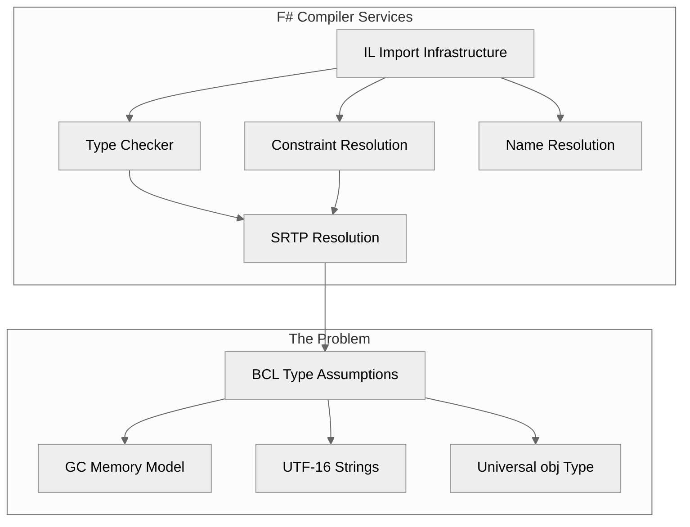
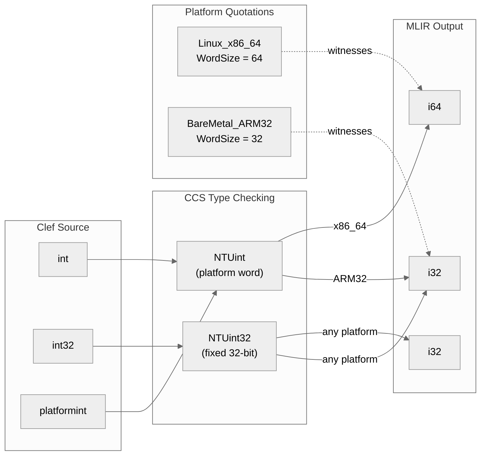
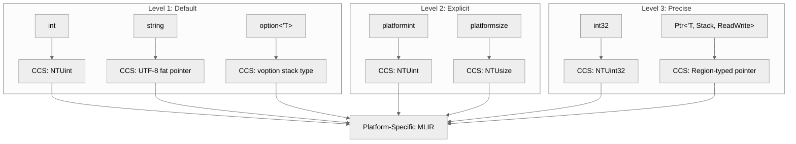
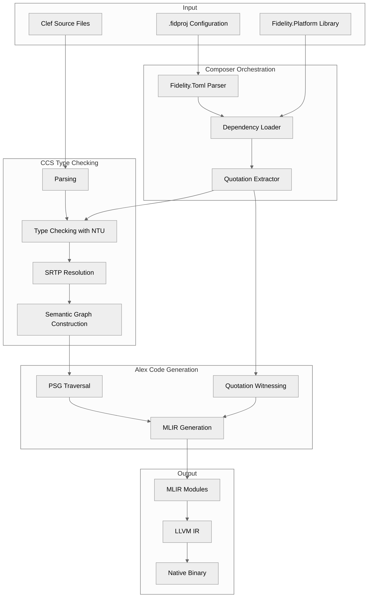

> This article was originally published on the
> [SpeakEZ Technologies blog](https://speakez.tech) as part of our early
> design work on the Fidelity Framework. It has been updated to reflect
> the Clef language naming and current project structure.

When we began designing the Fidelity framework, we encountered a fundamental architectural question that would shape every subsequent decision: how do you build a type system that serves both the embedded developer programming a Cortex-M0 with 32 kilobytes of RAM and the systems architect deploying across a cluster of 64-bit servers? The conventional answer has been to accept fragmentation, to maintain separate type representations for each target, or to impose a lowest-common-denominator abstraction that satisfies neither scenario well.

We chose a different path. The Native Type Universe (NTU) represents our answer to this challenge, a type architecture where platform awareness flows through the compilation pipeline as structured metadata, where type identity and type width are separated by design, and where the compiler retains full control over memory layout decisions until the final lowering stage.

This document traces the evolution from IL-based type assumptions to the NTU architecture, explaining why this transformation was necessary, how it was accomplished, and what it enables for hardware-software co-design across the computing spectrum.

## The IL Assumption: A Pervasive Constraint

The F# compiler, through F# Compiler Services (FCS), was designed with a reasonable assumption for its time: all F# programs target the .NET Common Language Runtime. This assumption manifests not as a single configuration option but as a structural property that permeates the entire type-checking infrastructure.

Consider what happens when FCS encounters a string literal:

```fsharp
let greeting = "Hello, World!"
```

Deep within the type checker, in `CheckExpressions.fs`, this literal is assigned the type `System.String`. Not because the programmer requested it, but because FCS hardcodes this mapping:

```fsharp
// FCS CheckExpressions.fs ~line 7342
TcPropagatingExprLeafThenConvert cenv overallTy g.string_ty env m ...
```

The `g.string_ty` reference points to a type constructor that assumes UTF-16 encoding, garbage collection, and the entire memory model of the CLR. For managed runtime deployments, this is correct and efficient. For native compilation targeting diverse hardware, it becomes a fundamental obstacle.

### The Cascade Effect

Our initial approach was surgical: identify the specific locations where BCL types were hardcoded and replace them with native equivalents. This strategy encountered a sobering reality. A cascade deletion analysis revealed that 3.2 megabytes of code across 59 files in the FCS middle-end depended, directly or transitively, on the assumption that types could originate from .NET assemblies.

The affected code included the core type inference machinery:

- `ConstraintSolver.fs` for type unification
- `NameResolution.fs` for symbol lookup
- `CheckExpressions.fs`, `CheckPatterns.fs`, and `CheckDeclarations.fs` for type checking
- Supporting infrastructure including `infos.fs`, `TypeHierarchy.fs`, and `AccessibilityLogic.fs`

The IL import assumption was not a surface-level configuration. It was a load-bearing wall.



This analysis led to a pivotal decision: the type-checking layer must be rebuilt for the native type universe, not pruned from the existing implementation. What emerged is CCS, Clef Compiler Services, a purpose-built type checker that makes no assumptions about runtime representation.

## The Native Type Universe: First Principles

The native type universe begins with three foundational concepts inherited from the ML family of languages: products, sums, and functions. Every composite type derives from these primitives.

### Products: Tuples and Records

A tuple combines multiple values into a single compound value. In the native type universe, tuples have deterministic memory layout without runtime headers:

```fsharp
let coordinates: float * float * float = (1.0, 2.0, 3.0)
```

Memory layout (64-bit platform):
```
┌──────────┬──────────┬──────────┐
│ float64  │ float64  │ float64  │
└──────────┴──────────┴──────────┘
   8 bytes    8 bytes    8 bytes  = 24 bytes total
```

Records extend this with named fields while preserving contiguous allocation:

```fsharp
type SensorReading = {
    Temperature: float32
    Pressure: float32
    Timestamp: int64
}
```

For those accustomed to relying on managed runtime machinery, the absence of object headers and vtable pointers may seem limiting. In practice, it enables the compiler to make precise memory layout decisions that translate directly to efficient machine code.

### Sums: Discriminated Unions

Discriminated unions represent choice among alternatives:

```fsharp
type Message =
    | Ping
    | Data of payload: array<byte>
    | Error of code: int * message: string
```

The native representation uses a tag byte followed by the payload:

```
┌──────────┬─────────┬────────────────────────────────────┐
│ Tag (i8) │ padding │ Payload (size of largest variant)  │
└──────────┴─────────┴────────────────────────────────────┘
```

This follows the algebraic data type tradition from ML and OCaml, with one significant refinement: tag values are deterministic based on declaration order (0, 1, 2, ...), enabling predictable serialization and cross-process communication.

### Functions: First-Class with Inline Semantics

Functions in the native type universe are first-class values that compile to efficient representations based on usage context:

| Context | Representation |
|---------|----------------|
| Known call site | Direct call, no indirection |
| Inline function | Inlined at call site |
| First-class value | Function pointer |
| Captures environment | Closure structure |

The default behavior leans toward transparency: most functions are considered inline candidates unless they are recursive or explicitly marked opaque. This aligns with how software engineers with low-level or systems programming experience expect compilation to work, where function call overhead is understood and controlled.

## The NTU Architecture: Type Identity Without Width Assumptions

The central innovation of NTU is the separation of type identity from type width. In managed runtime environments, `int` typically means a specific bit width, often 32 bits. In native compilation across diverse platforms, this assumption becomes problematic.

Consider a platform binding function:

```fsharp
let write (fd: int) (buffer: nativeptr<byte>) (count: int) : int = ...
```

On a 64-bit Linux system, the system call expects 64-bit arguments. On a 32-bit embedded target, it expects 32-bit arguments. If `int` has a fixed meaning, cross-platform compilation requires conditional code paths, platform-specific type aliases, or manual width annotations.

NTU takes a different approach, inspired by the F* programming language and its treatment of platform-dependent values. Type width becomes an *erased assumption*, metadata that guides type checking but does not participate in type identity.

### The NTUKind System

Internally, CCS categorizes numeric types using a discriminated union:

```fsharp
type NTUKind =
    // Platform-dependent (resolved via quotations)
    | NTUint      // Platform word, signed
    | NTUuint     // Platform word, unsigned
    | NTUnint     // Native int (pointer-sized signed)
    | NTUunint    // Native uint (pointer-sized unsigned)
    | NTUptr      // Pointer to type
    | NTUsize     // size_t equivalent
    | NTUdiff     // ptrdiff_t equivalent

    // Fixed width (platform-independent)
    | NTUint8 | NTUint16 | NTUint32 | NTUint64
    | NTUuint8 | NTUuint16 | NTUuint32 | NTUuint64
    | NTUfloat32 | NTUfloat64
```

The key distinction is between platform-dependent types (the first group) and fixed-width types (the second group). When a developer writes `int` in Clef source code, CCS maps it to `NTUint`, a platform word with width determined by the target platform. When a developer writes `int32`, CCS maps it to `NTUint32`, which is always 32 bits regardless of platform.

### Type Identity Enforcement

CCS enforces type identity strictly:

```fsharp
// Type error: NTUint and NTUint64 are distinct types
let x: int64 = 42  // Error: expected int64, got int

// Correct: explicit conversion
let x: int64 = int64 42
```

This may seem restrictive, but it prevents a class of subtle bugs where width assumptions leak across platform boundaries. The error message surfaces at compile time, where it can be addressed, not at runtime on a specific platform configuration where debugging is more difficult.

### Width Resolution via Quotations

Platform width information flows into the compilation pipeline through quotation-based platform bindings:

```fsharp
// From Fidelity.Platform/Linux_x86_64/Platform.fs
let platform: Expr<PlatformDescriptor> = <@
    { Architecture = X86_64
      OperatingSystem = Linux
      WordSize = 64
      TypeLayouts = Map.ofList [
          "int", { Size = 8; Alignment = 8 }
          "int32", { Size = 4; Alignment = 4 }
          "nativeint", { Size = 8; Alignment = 8 }
      ] }
@>
```

The Clef quotation syntax (`<@ ... @>`) creates a structured representation of the expression that can be inspected and transformed. CCS receives these quotations as parameters and attaches them to the semantic graph. Alex, the code generation component, witnesses these quotations when producing MLIR, resolving `NTUint` to `i64` on 64-bit platforms and `i32` on 32-bit platforms.



## Platform Predicates: Conditional Compilation Without Preprocessor

Beyond type width, platforms differ in capabilities. A desktop x86-64 processor may support AVX-512 vector instructions. An ARM Cortex-A may support NEON. An embedded Cortex-M0 may have neither. Traditional approaches handle this through preprocessor conditionals or runtime feature detection. NTU introduces platform predicates as a more principled alternative.

### Abstract Propositions

Platform predicates are abstract boolean propositions that are known at compile time but not evaluated during type checking:

```fsharp
// From Fidelity.Platform/Linux_x86_64/Capabilities.fs
module Capabilities =
    let fits_u32: Expr<bool> = <@ true @>
    let fits_u64: Expr<bool> = <@ true @>
    let has_avx512: Expr<bool> = <@ false @>
    let has_avx2: Expr<bool> = <@ true @>
    let has_neon: Expr<bool> = <@ false @>
```

Application code can branch on these predicates:

```fsharp
let vectorAdd (a: array<float>) (b: array<float>) : array<float> =
    if Platform.has_avx512 then
        vectorAdd_avx512 a b
    elif Platform.has_avx2 then
        vectorAdd_avx2 a b
    elif Platform.has_neon then
        vectorAdd_neon a b
    else
        vectorAdd_scalar a b
```

CCS processes this code without knowing the predicate values. It type-checks all branches, ensuring that each implementation has compatible signatures. Alex then evaluates the predicates against the target platform and eliminates dead branches.

The compiled output on an x86-64 platform without AVX-512 contains only the AVX2 implementation. The binary includes no runtime checks, no dispatch tables, and no code for unavailable instruction sets.

### Predicate Implications

Some predicates have logical implications:

- `fits_u64` implies `fits_u32`
- `has_avx512` implies `has_avx2`
- `has_avx2` implies `has_sse42`

CCS can use these implications to simplify constraint checking. If the platform declares `fits_u64 = true`, operations requiring 32-bit word support are implicitly permitted.

This approach borrows from the F* programming language, where platform-dependent properties are expressed as erased propositions that guide compilation without introducing runtime overhead.

## Memory Regions: Type-Level Memory Safety

Native compilation requires explicit attention to where data resides in memory. The managed runtime provides a uniform heap with garbage collection. Native environments expose a heterogeneous memory landscape: stack, heap, memory-mapped peripherals, DMA-accessible regions, flash storage.

NTU extends the type parameter system to track memory regions:

```fsharp
type Ptr<'T, 'Region, 'Access>
```

This is not a new syntax; it leverages Clef's existing type parameter mechanism. What changes is the semantic interpretation. The `'Region` and `'Access` parameters carry compile-time information about memory placement and access permissions.

### Built-in Memory Regions

| Region | Description | Volatile | Cacheable |
|--------|-------------|----------|-----------|
| `Stack` | Thread-local, automatic lifetime | No | Yes |
| `Arena` | Bulk allocation, batch deallocation | No | Yes |
| `Peripheral` | Memory-mapped I/O | Yes | No |
| `Sram` | General-purpose RAM | No | Yes |
| `Flash` | Read-only program storage | No | Yes |

### Access Kinds

| Kind | Read | Write | CMSIS Equivalent |
|------|------|-------|------------------|
| `ReadOnly` | Yes | No | `__I` |
| `WriteOnly` | No | Yes | `__O` |
| `ReadWrite` | Yes | Yes | `__IO` |

### Compile-Time Safety

With region and access information in the type, CCS can prevent entire categories of errors:

```fsharp
// Compile-time error: cannot write to ReadOnly pointer
let writeToFlash (p: Ptr<byte, Flash, ReadOnly>) =
    Ptr.write p 0uy  // Error: write requires ReadWrite access

// Compile-time error: cannot pass Peripheral pointer where Stack expected
let processBuffer (p: Ptr<int, Stack, ReadWrite>) = ...
let gpioReg: Ptr<uint32, Peripheral, ReadWrite> = ...
processBuffer gpioReg  // Error: region mismatch
```

For software engineers with low-level or systems programming experience, this provides familiar hardware register semantics with compile-time verification. For those accustomed to managed environments, it introduces explicit memory reasoning in a controlled way, guided by the type system.

### The Peripheral Region

Memory-mapped I/O requires special handling. Reads and writes must occur in program order without optimization. The compiler cannot cache values in registers, cannot reorder operations, and cannot eliminate "redundant" accesses.

When CCS encounters a `Peripheral` region type, it propagates this information to Alex, which emits appropriate MLIR operations:

```mlir
// Peripheral access generates volatile operations
%value = llvm.load volatile %ptr : !llvm.ptr -> i32
llvm.store volatile %new_value, %ptr : i32, !llvm.ptr
```

The memory barrier and ordering semantics are derived from the type, not from annotations scattered throughout the code.

## The Semantic Alias Layer

The NTU architecture operates at multiple levels of abstraction. CCS uses the `NTU` prefix internally. Application developers should not need to think in these terms. Our original Alloy library provided semantic aliases that bridged this gap:

```fsharp
type platformint = int    // CCS interprets as NTUint
type platformuint = uint  // CCS interprets as NTUuint
type platformsize = unativeint  // CCS interprets as NTUsize
```

This created three levels of developer experience:

**Level 1 (Default)**: Standard Clef type names. The developer writes `int`, and CCS handles platform-appropriate representation internally.

**Level 2 (Explicit)**: Semantic aliases. The developer writes `platformint` to signal awareness of platform-dependent width.

**Level 3 (Precise)**: Fixed-width types and explicit memory regions. The developer uses `int32`, `int64`, and region-typed pointers for full control.

Most application code operates at Level 1. Library code providing platform bindings typically operates at Level 2. Hardware interface code operates at Level 3.



We have since "retired" the separate Alloy library and have simply migrated it into the Clef project as intrinsic compiler machinery.

## The Fidelity.Platform Monorepo: Structured Platform Bindings

Platform-specific information resides in a dedicated repository structure:

```
~/repos/Fidelity.Platform/
├── Linux_x86_64/
│   ├── Types.fs           # Type layout quotations
│   ├── Platform.fs        # Platform descriptor
│   ├── Capabilities.fs    # Platform predicates
│   ├── MemoryRegions.fs   # Region definitions
│   ├── Syscalls.fs        # System call conventions
│   └── Fidelity.Platform.Linux_x86_64.fsproj
├── Linux_ARM64/
├── BareMetal_ARM32/
└── ...
```

Each platform provides a complete set of quotations that Alex consumes during code generation. Adding a new platform means creating a new directory with appropriate definitions, not modifying the compiler itself.

This structure supports hardware-software co-design workflows where target platforms may not exist yet during initial development. A team designing an FPGA-based accelerator can define their platform bindings before silicon is available, enabling software development against accurate type signatures.

## String Encoding: A Case Study in Native Semantics

The treatment of strings illustrates how NTU departs from managed runtime assumptions.

### The BCL Model

In .NET, `System.String` is:
- UTF-16 encoded
- Immutable
- Heap-allocated with garbage collection
- Interned for constant literals
- Null-terminated internally (for interop convenience)

This design reflects the Windows platform heritage and optimizes for scenarios common in desktop application development.

### The Native Model

In the native type universe, `string` is a fat pointer:

```
┌─────────────────┬─────────────────┐
│ ptr: *u8        │ len: usize      │
└─────────────────┴─────────────────┘
     8 bytes           8 bytes       = 16 bytes (64-bit)
```

This representation is:
- UTF-8 encoded
- Immutable (by convention, enforced by access kinds)
- Stack or arena allocated (no garbage collection required)
- Length-prefixed (no null terminator)
- Zero-copy sliceable (substrings reference original data)

The UTF-8 encoding aligns with web standards, Unix conventions, and interoperability requirements. The fat pointer representation enables efficient slicing without allocation. The explicit length avoids the security issues and performance costs of null-terminated strings.

### API Consequences

The null-free philosophy extends to string operations:

| BCL Pattern | Native Pattern |
|-------------|----------------|
| `s.IndexOf(c)` returns -1 on failure | `String.indexOf c s` returns `voption<int>` |
| `s.Substring(i, len)` throws on invalid range | `String.slice i len s` returns `voption<string>` |
| `s[i]` throws on out-of-bounds | `String.tryItem i s` returns `voption<char>` |
| `String.IsNullOrEmpty(s)` | `String.isEmpty s` (no null possible) |

The shift from exceptions and sentinel values to option types makes error handling explicit in the type signature. This is not merely a stylistic preference; it enables the compiler to verify exhaustive handling of failure cases.

## The Option Type: Stack Allocation by Default

The option type transformation demonstrates how NTU rethinks fundamental abstractions.

### The BCL Model

In .NET F#, `option<'T>` is a reference type. `None` is represented by `null`. `Some x` allocates a heap object containing `x`. This design integrates with the garbage collector and supports patterns common in managed code.

### The Native Model

In NTU, `option<'T>` has `voption` (value option) semantics:

```
┌──────────┬────────────────────┐
│ Tag (i8) │ Payload: 'T        │
└──────────┴────────────────────┘
   1 byte     sizeof<'T>         + alignment padding
```

Key properties:
- Stack allocated (no heap involvement)
- No null values (`None` is tag 0, not a null pointer)
- Deterministic layout for serialization
- No garbage collection overhead

For performance-sensitive code paths, this transformation eliminates allocation pressure. A loop that creates millions of option values no longer creates millions of heap objects. The type system continues to enforce safe usage; the representation changes.

## The `obj` Elimination: No Universal Base Type

Perhaps the most significant philosophical departure is the elimination of `obj` (System.Object).

In managed runtimes, `obj` serves as:
- Universal base type for inheritance
- Container for heterogeneous collections
- Enabler of runtime reflection
- Escape hatch for type system limitations

In native compilation without garbage collection, these use cases require different solutions:

| Managed Pattern | Native Pattern |
|-----------------|----------------|
| `List<obj>` for heterogeneous data | Discriminated union with explicit cases |
| Boxing primitives | No boxing; values stay in native representation |
| Runtime reflection | Compile-time metaprogramming |
| SRTP via runtime dispatch | SRTP resolved statically at compile time |

The absence of `obj` is not a limitation but a design choice. Every type in NTU has a known size and layout at compile time. There is no "any type" escape hatch because native compilation requires deterministic memory representation.

This has practical consequences. Code that relies on boxing or dynamic type tests must be restructured. SRTP constraints must resolve statically. The benefit is that the resulting code is amenable to ahead-of-time compilation, aggressive inlining, and precise memory management.

## Statically Resolved Type Parameters: Native Resolution

Clef supports Statically Resolved Type Parameters (SRTPs) for ad-hoc polymorphism:

```fsharp
let inline add (x: ^T) (y: ^T) : ^T =
    (^T : (static member (+) : ^T * ^T -> ^T) (x, y))
```

This constraint says: "Type `^T` must have a static member `(+)` with the specified signature." At each call site, the constraint is resolved to a concrete implementation.

### The FCS Approach

In standard F#, SRTP resolution occurs during type checking, with the resolved implementation recorded in the typed tree. Code generation then emits a direct call to the resolved method.

The challenge for native compilation is that FCS's SRTP machinery assumes BCL method tables. Searching for `(+)` on `int` finds `System.Int32.op_Addition`. This method does not exist in the native type universe.

### The CCS Approach

CCS resolves SRTPs against a native witness hierarchy:

```fsharp
type NativeOps =
    static member (+) (a: int, b: int) : int =
        // Native addition, no BCL involvement
        ...
```

When CCS encounters an SRTP constraint, it searches the witness hierarchy starting from the constrained types. Resolution produces a reference to a native implementation, not a BCL method.

The semantic graph records this resolution as `WitnessResolution` metadata:

```fsharp
type WitnessResolution = {
    TraitName: string
    WitnessType: NativeType
    ArgTypes: NativeType list
    ReturnType: NativeType
}
```

Alex uses this metadata to emit direct calls to the resolved implementation. No virtual dispatch, no method tables, no runtime overhead.

## The Pipeline: From Source to Native Binary

The complete compilation pipeline demonstrates how NTU integrates with other Fidelity components:



### Composer: Orchestration Layer

Composer handles all I/O operations:
- Parsing `.fidproj` configuration files using Fidelity.Toml
- Resolving dependencies (platform bindings, other libraries)
- Loading platform libraries and extracting quotations
- Invoking CCS with appropriate parameters

This separation ensures that CCS remains a pure compiler service with no file system access.

### CCS: Type Checking Layer

CCS receives source files and platform context as parameters:
- Parses Clef syntax into AST
- Type-checks against NTU type constructors
- Resolves SRTP constraints against native witnesses
- Constructs the semantic graph with types attached

The output is a `SemanticGraph` with NTU type annotations, SRTP resolutions, and platform quotation metadata.

### Alex: Code Generation Layer

Alex traverses the semantic graph using a zipper pattern:
- Witnesses platform quotations to resolve NTU types
- Generates MLIR operations for each semantic node
- Produces platform-specific MLIR dialects

The MLIR output then flows through standard LLVM infrastructure to produce native binaries.

## Hardware-Software Co-Design: The Broader Vision

The NTU architecture positions Fidelity for hardware-software co-design scenarios that are becoming increasingly important.

### Heterogeneous Computing

Modern systems combine diverse processing elements:
- CPUs with varying instruction set extensions
- GPUs for parallel workloads
- NPUs for machine learning inference
- FPGAs for custom acceleration
- Domain-specific accelerators

NTU's quotation-based platform bindings can express the capabilities and constraints of each element. A single codebase can target multiple elements, with platform predicates controlling which code paths are compiled for each target.

### Embedded and Edge Systems

Resource-constrained environments benefit from NTU's approach:
- Explicit memory regions map to physical memory topology
- Stack allocation reduces memory pressure
- Platform predicates eliminate unused code
- Deterministic layouts enable efficient serialization

A sensor fusion application can share code between a Cortex-M4 edge device and an x86 server, with platform-appropriate implementations selected at compile time.

### Future Hardware Architectures

The NTU design accommodates hardware that does not yet exist:
- Platform bindings can be defined before silicon
- Type-level constraints document hardware contracts
- Quotation-based metadata is extensible

Teams developing custom accelerators can define their platform bindings early, enabling parallel hardware and software development.

## A New Universe

The journey from IL-based type assumptions to the Native Type Universe represents more than a technical migration. It reflects a fundamental rethinking of how type systems can serve diverse deployment targets, and how the Clef language is uniquely positioned to deliver on this vision.

The key insights that emerged:

**Type identity and type width are separable concerns.** By treating width as erased metadata, NTU enables type-safe cross-platform development without conditional compilation clutter.

**Platform awareness belongs in structured metadata, not scattered annotations.** Quotation-based platform bindings centralize platform-specific information while keeping the type checker platform-agnostic.

**The compiler should control memory layout until the last possible moment.** Region types, access kinds, and platform predicates carry semantic information through the pipeline, enabling informed code generation decisions.

**Native compilation need not sacrifice expressiveness.** The same Clef language that developers use for managed runtime applications works for embedded systems, with the type system adapted to the constraints of each environment.

The Fidelity framework, built on these foundations, aims to bridge the gap between high-level concurrent programming and the demands of hardware-software co-design. The NTU architecture is a key ingredient in that vision: flexible type machinery that adapts to the target while preserving the semantic guarantees that make correct-by-construction software development possible.

## Related Reading

For more on the Fidelity framework and native Clef compilation:

- [Memory Management by Choice](https://speakez.tech/blog/memory-management-by-choice/) - BAREWire and the three-level approach to memory control
- [Why Clef Fits MLIR](/docs/design/why-clef-fits-mlir/) - SSA form and functional compilation
- [Baker: Saturation Engine](/docs/design/baker-saturation-engine/) - Type correlation with dual-tree zippers
- [Absorbing Alloy](/docs/design/absorbing-alloy/) - The native standard library comes home
- [Hello World Goes Native](/docs/design/hello-world-goes-native/) - A practical walkthrough of native Clef compilation
