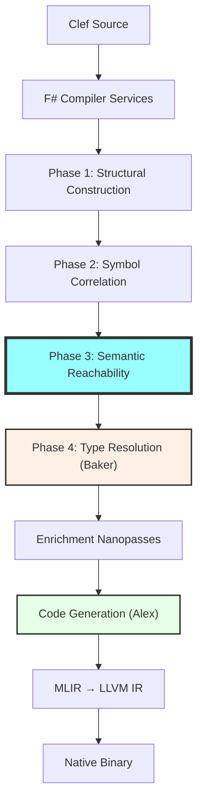

> This article was originally published on the
> [SpeakEZ Technologies blog](https://speakez.tech) as part of our early
> design work on the Fidelity Framework. It has been updated to reflect
> the Clef language naming and current project structure.

When we set out to design the Composer compiler for the Fidelity Framework, one of our core goals was to produce truly minimal native executables. In the world of traditional .NET development, your "Hello World" application carries the weight of the entire runtime and referenced assemblies, resulting in deployments measured in megabytes. For embedded systems, high-frequency trading platforms, or any scenario where every byte matters, this overhead is unacceptable. Our solution involves a principled approach: semantic reachability analysis that operates on the Program Semantic Graph (PSG), narrowing the compilation scope to only what's actually needed while preserving the rich type information required by subsequent compiler phases.

## Concrete Example: HelloWorld with Alloy

Consider a simple Fidelity application using the Alloy standard library:

```fsharp
module Examples.HelloWorldDirect

open Alloy

[<EntryPoint>]
let main argv =
    Console.WriteStr "Hello, World!"
    Console.WriteStrLn ""
    0
```

The Alloy library contains thousands of functions across console I/O, memory management, UTF-8 text processing, buffer handling, and more. Yet tree shaking ensures this simple program includes only:

- `Console.WriteStr` and `Console.WriteStrLn` from `Alloy.Console`
- The underlying system call wrappers these functions use
- `NativeStr` type definition (Alloy's native string representation)

Everything else in Alloy - the `ReadLine` functions, the `stackBuffer` allocator, the UTF-8 encoding utilities, the Result combinators - is eliminated because our semantic reachability analysis determines they're never called from `main`.

## Tree Shaking Through Type-Preserving Analysis

Tree shaking is a form of dead code elimination that removes unused code from your final executable. The name comes from the mental model of shaking a tree to make dead branches fall off, leaving only the living, connected parts. What makes Composer's approach unique is how we leverage Clef's rich type system throughout the reachability analysis, enabling optimizations impossible with traditional approaches.

Consider how our type-aware analysis surpasses traditional dead code elimination:

```fsharp
// Type with complex generic constraints
type IProcessor<'T when 'T :> IComparable<'T> and 'T : struct> =
    abstract Process : 'T -> 'T

// Multiple implementations
type IntProcessor() =
    interface IProcessor<int> with
        member _.Process x = x * 2

type FloatProcessor() =
    interface IProcessor<float> with
        member _.Process x = x * 1.5

type DateProcessor() =
    interface IProcessor<DateTime> with
        member _.Process x = x.AddDays(1.0)

// Your application only uses int processing
let result = IntProcessor().Process(42)
```

Traditional tree shaking might struggle to determine which processor implementations are actually used. Composer's type-preserving analysis traces the exact type instantiations through your program, determining that only `IProcessor<int>` and `IntProcessor` are needed. The `FloatProcessor` and `DateProcessor`, along with their associated type specializations, are eliminated entirely.

This precision stands in contrast to the challenges facing .NET's Native AOT compilation. While Microsoft has made significant progress with ahead-of-time compilation in .NET 8 through 10, their approach must contend with the runtime's historical reliance on reflection and dynamic code generation. Generic type instantiation presents particular difficulties - the AOT compiler cannot always determine which `ILogger<T>` instantiations an application will request through dependency injection, leading to either over-inclusion of code or runtime failures. Attributes like `RequiresDynamicCodeAttribute` and `DynamicallyAccessedMembers` help developers annotate their code for trimming compatibility, but these are fundamentally workarounds for a system not designed with static analysis as a fundamental tenet.

> The Fidelity framework will never have to contend with these legacy challenges.

By building on Clef's type system and Alloy's deterministic foundations, the compiler constructs a complete dependency graph at compile time. There's no reflection to defeat tree shaking, no dynamic instantiation to second-guess. The analysis is correct by construction.

Consider a typical Clef utility library with generic functions and type specializations:

```fsharp
module Collections =
    // Generic tree structure with many operations
    type Tree<'T> =
        | Leaf of 'T
        | Node of Tree<'T> * 'T * Tree<'T>

    let rec map f tree = // ... implementation
    let rec fold f acc tree = // ... implementation
    let rec filter pred tree = // ... implementation
    let rec height tree = // ... 15 lines
    let rec balance tree = // ... 30 lines
    let rec traverse order tree = // ... 25 lines
    // ... 20 more tree operations

module Algorithms =
    // Specialized implementations for different types
    let inline sort< ^T when ^T : comparison> (items: ^T list) =
        // ... 40 lines of optimized sorting

    let sortInts = sort<int>  // Specialized for integers
    let sortFloats = sort<float>  // Specialized for floats
    let sortStrings = sort<string>  // Specialized for strings
    // ... more specializations

// Your application
open Collections
let myTree = Node(Leaf 1, 2, Leaf 3)
let doubled = map ((*) 2) myTree
```

With Composer's type-aware tree shaking, we analyze not just function calls but type instantiations. We determine that:
- Only `Tree<int>` is used, not `Tree<'T>` for other types
- Only `map` is called on trees; `fold`, `filter`, `balance`, etc. are eliminated
- The generic `sort` function is never instantiated, so all specializations are removed

Early prototypes show 70-90% size reductions for generic-heavy libraries, far exceeding what traditional tree shaking achieves.

### The Structural Advantage Over Assembly-Based Compilation

These results highlight a fundamental architectural advantage that Composer holds over approaches constrained by assembly-based compilation. When .NET's Native AOT compiles an application, it operates on IL assemblies - an intermediate representation designed for runtime flexibility, not static optimization. The assembly format preserves information needed for reflection, dynamic loading, and JIT compilation, but obscures the precise dependency relationships that enable aggressive tree shaking.

Consider what happens when .NET Native AOT encounters a generic type like `List<T>`. The IL contains a single generic definition, but the runtime may instantiate it with dozens of different type arguments. The AOT compiler must make conservative assumptions: if `List<int>` appears anywhere in reachable code, it generates specialized code for that instantiation. But determining *all* possible instantiations requires whole-program analysis that the assembly format makes difficult. The compiler cannot easily distinguish between `List<Customer>` that's actually constructed and `List<Customer>` that merely appears in a type signature but is never instantiated.

Composer operates upstream of this problem. By analyzing Clef source through FCS before any lowering to intermediate representations, we have access to the full semantic context: which generic instantiations are actually constructed, which type parameters flow through which call sites, and crucially, which paths through the code are actually reachable. The PSG captures these relationships directly rather than reconstructing them from assembly metadata.

The practical impact extends beyond binary size. .NET applications targeting Native AOT frequently encounter trimming warnings - indications that the compiler cannot prove certain code paths are safe to remove. Developers must annotate their code with attributes like `[DynamicallyAccessedMembers]` or maintain XML configuration files listing types that must be preserved. These are fundamentally workarounds for information that was available at compile time but lost during the lowering to IL.

Composer's approach eliminates this entire category of problems. Since tree shaking operates on the semantic graph before any information is discarded, there are no trimming warnings to suppress, no runtime directive files to maintain, no surprising `MissingMethodException` errors in production.

> The analysis is complete because it operates on complete information, leading to a common phrase in the lab "correct by construction."

## Soft-Delete Reachability: The Nanopass Approach

An architectural element that differentiates Composer from traditional compilation approaches is *soft-delete* reachability rather than hard deletion. When we determine a node is unreachable, we don't remove it from the Program Semantic Graph - we mark it with `IsReachable = false`. This preserves structural integrity for [Baker's two-tree zipper](/docs/design/baker-saturation-engine/) traversal, where unreachable nodes still provide traversal context that keeps analysis aligned during PSG construction. Without this context, the zipper's simultaneous traversal of the AST and typed tree could lose synchronization when encountering nodes that exist in one tree but not the other.



The critical boundary is Phase 3 - reachability analysis. Everything before Phase 3 operates on the full library graph (including all of Alloy, FSharp.Core, and user code). Everything from Phase 3 onward operates on the *narrowed* graph - only the code actually reachable from entry points. This scope narrowing is what makes expensive operations like SRTP resolution and type overlay practical.

1. **Type Specialization Tracking**: We trace which generic instantiations are actually used
2. **Interface Implementation Analysis**: We determine which interface methods are called
3. **Discriminated Union Usage**: We identify which union cases appear in pattern matches
4. **Static Member Resolution**: We track which static members and type extensions are referenced

This direct analysis enables cross-cutting optimizations. When we determine a type is unused, we can eliminate:
- The type definition itself
- All methods and properties on that type
- Any type extensions defined for it
- Generic specializations involving that type
- Pattern match cases for that type's constructors

## Type-Directed Reachability Analysis

The heart of effective tree shaking lies in precise reachability analysis. Our type-preserving approach goes beyond simple function-call tracking to understand the rich relationships in Clef code:

```fsharp
// Semantic reachability context - tracks what's actually used
type SemanticReachabilityContext = {
    ReachableFunctions: Set<string>
    TypeInstantiations: Map<string, Set<string>>
    UsedUnionCases: Map<string, Set<string>>
    CalledInterfaceMethods: Map<string, Set<string>>
    EntryPoints: FSharpSymbol list
}

// Two-level reachability: symbol-level and node-level
let analyzeReachability (psg: ProgramSemanticGraph) (entryPoints: FSharpSymbol list) =
    // Phase 1: Symbol-level reachability - which functions are called?
    let reachableSymbols =
        entryPoints
        |> List.fold (fun acc entry ->
            transitiveClosureFrom entry psg.CallGraph
            |> Set.union acc) Set.empty

    // Phase 2: Node-level reachability - mark all nodes in reachable functions
    psg.Nodes
    |> Seq.iter (fun node ->
        let isReachable =
            reachableSymbols.Contains(node.ContainingSymbol.FullName)
        node.IsReachable <- isReachable)

    { ReachableFunctions = reachableSymbols
      TypeInstantiations = collectTypeInstantiations psg reachableSymbols
      UsedUnionCases = collectUnionCaseUsage psg reachableSymbols
      CalledInterfaceMethods = collectInterfaceCalls psg reachableSymbols
      EntryPoints = entryPoints }
```

This sophisticated analysis handles Clef's advanced type system features:

### Discriminated Union Optimization

When analyzing discriminated unions, we track not just type usage but individual case usage:

```fsharp
type Command =
    | Start of ProcessInfo          // Used in pattern matches
    | Stop of ProcessId             // Used in pattern matches
    | Pause of ProcessId * Duration // Never constructed or matched
    | Resume of ProcessId           // Never constructed or matched
    | Status of ProcessId           // Used only in construction, never matched
    | Restart of ProcessInfo        // Never used at all

// Analysis determines:
// - Pause, Resume, Restart can be eliminated entirely
// - Status needs constructor but not pattern match code
// - Only Start and Stop need full support
```

The memory layout analyzer integrates with tree shaking to optimize union storage based on actual usage patterns. If certain cases are eliminated, the union's memory layout can be optimized accordingly.

### Generic Specialization Tracking

Clef's inline functions and SRTP (Statically Resolved Type Parameters) create specialized code for each type instantiation. Our analysis tracks these precisely:

```fsharp
let inline sumBy< ^T, ^U when ^T : (member Length : int)
                          and ^U : (static member (+) : ^U * ^U -> ^U)
                          and ^U : (static member Zero : ^U)>
    (projection: 'a -> ^U) (collection: ^T) =
    // ... implementation

// Used with int arrays and float lists
let intSum = sumBy id [|1; 2; 3|]
let floatSum = sumBy (fun x -> x * 2.0) [1.0; 2.0; 3.0]

// Analysis generates exactly two specializations:
// sumBy<int[], int> and sumBy<float list, float>
// No generic version is retained
```

### Library Boundary Classification

Composer's reachability analysis understands the layered architecture of a Fidelity application. Code is classified into distinct library boundaries:

```fsharp
type LibraryCategory =
    | UserCode        // Application code - most aggressive elimination
    | AlloyLibrary    // Fidelity standard library
    | FSharpCore      // F# runtime support
    | Other of string // Third-party libraries
```

This classification enables targeted optimization strategies. User code receives the most aggressive pruning since we have complete visibility. Alloy library functions can be eliminated with confidence because we understand their semantic contracts. FSharp.Core functions require more conservative analysis due to their foundational role in Clef semantics.

The result is a library-aware pruning analysis:

```fsharp
type LibraryAwareReachability = {
    BasicResult: ReachabilityResult
    LibraryCategories: Map<string, LibraryCategory>
    PruningStatistics: PruningStatistics
    MarkedPSG: ProgramSemanticGraph
}
```

## Integration with Memory Layout Analysis

One unique aspect of Composer's tree shaking is its deep integration with memory layout analysis. As we eliminate code, we simultaneously optimize memory layouts:

```fsharp
// Before tree shaking
type LargeRecord = {
    Field1: int          // Used
    Field2: string       // Never accessed
    Field3: DateTime     // Never accessed
    Field4: decimal      // Used
    Field5: int64        // Never accessed
    Nested: NestedType   // Never accessed
}

// After integrated analysis
// Memory layout optimized from 64 bytes to 16 bytes
// Only Field1 and Field4 remain, optimally packed
```

This integration enables sophisticated optimizations:

1. **Field Elimination**: Unused record fields are removed entirely
2. **Layout Compaction**: Remaining fields are reordered for optimal packing
3. **Alignment Optimization**: Alignment requirements are recalculated based on remaining fields
4. **Inline Expansion**: Small types may be inlined when usage patterns permit

## Platform-Specific Tree Shaking

The Fidelity Framework's multi-platform nature adds another dimension to tree shaking. Our analysis understands platform constraints and optimizes accordingly:

```fsharp
// Platform-aware analysis configuration
type TreeShakingConfig = {
    Platform: TargetPlatform
    MemoryConstraints: MemoryConstraints
    EnabledFeatures: Set<FeatureFlag>
    MaxStackDepth: int option
}

// Different platforms eliminate different code
[<PlatformSpecific>]
module Graphics =
    [<Desktop>]
    let renderOpenGL() = // ... 500 lines

    [<Mobile>]
    let renderMetal() = // ... 400 lines

    [<Embedded>]
    let renderFramebuffer() = // ... 100 lines

    [<All>]
    let renderText(text: string) = // ... kept on all platforms
```

When compiling for an embedded target, the OpenGL and Metal renderers are eliminated before MLIR generation even begins. This platform-aware elimination combines with type analysis - if the embedded platform never uses certain types, their definitions and all associated code are removed.

## Developer Experience: Understanding Elimination

The enhanced tree shaking provides rich diagnostics that include type information:

```text
=== Composer Semantic Reachability Analysis ===
Source: HelloWorldDirect.fs
Target: cortex-m4
Entry point: Examples.HelloWorldDirect.main

Pruning Statistics:
  Total symbols:      1,247
  Reachable symbols:    23
  Eliminated symbols: 1,224 (98.2%)
  Computation time:     12ms

Library Breakdown:
  UserCode:     3 reachable /    3 total (100.0%)
  AlloyLibrary: 8 reachable /  412 total (  1.9%)
  FSharpCore:  12 reachable /  832 total (  1.4%)

Reachable Symbol Summary:
  User code:
    - Examples.HelloWorldDirect.main
    - <Module>.main$cont@7

  Alloy.Console:
    - WriteStr
    - WriteStrLn
    - writeToStdout (internal)

  Alloy.NativeTypes:
    - NativeStr (type definition)
    - toByteSpan

Type Analysis:
  Generic instantiations used: 2 (from 156 possible)
  Union cases reachable: 0 (Result<_,_> eliminated entirely)
  Interface dispatch sites: 0 (no virtual calls)

PSG Nodes:
  Total:     4,892
  Marked reachable: 156
  Elimination rate: 96.8%
```

These diagnostics integrate with IDE support to provide real-time feedback. Developers can see which types and methods would be included in each platform target, enabling informed architectural decisions during development.

## Advanced Optimization Through Type Information

The type-preserving pipeline enables sophisticated optimizations beyond simple elimination:

### Devirtualization Through Type Analysis

When tree shaking determines that an interface has only one implementation in use, virtual calls can be devirtualized. At the MLIR level, Composer emits interface dispatch operations that mlir-opt and LLVM optimize into direct calls:

```mlir
// Before devirtualization: Interface dispatch in MLIR
%obj_ref = memref.alloca() : memref<1x!processor.interface>
%arg = arith.constant 42 : i32
func.call @IProcessor.Process(%obj_ref, %arg) : (memref<1x!processor.interface>, i32) -> ()

// After tree-shaking analysis determines single implementation:
// LLVM backend generates direct call (no vtable lookup)
// call void @IntProcessor.Process(ptr %obj, i32 %arg)
```

### Memory Layout Specialization

Types used only in specific contexts can have their layouts optimized:

```fsharp
// Original generic type
type Option<'T> =
    | Some of 'T
    | None

// After analysis: Option<int> used only in non-null contexts
// Optimized to unwrapped int with sentinel value for None
// Reduces memory usage and eliminates pointer indirection
```

## The Road Ahead

Tree shaking in the restructured Composer compiler represents a fundamental shift in how we think about dead code elimination. By preserving type information throughout the compilation pipeline, we enable optimizations that were previously impossible:

1. **Incremental Compilation**: Type-aware dependency tracking enables precise incremental builds
2. **Link-Time Type Optimization**: Cross-module type specialization and elimination
3. **Profile-Guided Type Specialization**: Runtime profiling informs which generic instantiations to optimize
4. **Formal Verification Integration**: Eliminated code paths reduce the verification burden

The integration with our broader tooling ecosystem leverages this type information. The Fidelity VS Code extension will show not just which functions are included, but which types, which generic instantiations, and which pattern match cases made it into your binary. This visibility transforms tree shaking from a black-box optimization into a transparent, predictable process.

## A New Paradigm for Concurrent Functional Compilation

The journey from traditional tree shaking to type-aware elimination represents more than an incremental improvement; it's a fundamental rethinking of how concurrent functional languages can be compiled. For years, the rich type systems that make languages like Clef so expressive have been seen as a compile-time feature that largely disappears during code generation. Composer's approach inverts this, making types the central pillar of our optimization strategy.

What we're building goes beyond eliminating unused functions. By tracking type instantiations, interface implementations, and union case usage, we can eliminate entire categories of code that traditional approaches must preserve "just in case." When your embedded system uses only three cases of a twenty-case discriminated union, why should the binary include code for the other seventeen? When your application uses a generic collection only with integers, why preserve the infrastructure for arbitrary type parameters?

This transformation enables Clef in domains where it was previously impractical. Embedded systems with kilobytes of flash storage become viable targets. High-frequency trading systems can eliminate every microsecond of virtual dispatch overhead. WebAssembly modules can achieve sizes competitive with hand-written JavaScript. The same Clef code that expresses your domain elegantly can compile to binaries that meet the strictest size and performance requirements.

## Type-Driven Future

Looking ahead, type-aware tree shaking is just the beginning of what's possible when we preserve type information throughout compilation. The same infrastructure that enables precise dead code elimination can power:

- **Type-Specialized Memory Pools**: Allocators optimized for exactly the types your program uses
- **Automatic Data Structure Selection**: Choosing optimal collections based on usage patterns
- **Cross-Language Type Optimization**: Eliminating FFI overhead when types align perfectly
- **Verification-Guided Elimination**: Using formal proofs to enable more aggressive optimization

As we continue developing these capabilities, we're guided by a simple principle: a language's type system should be its greatest optimization asset, not a compile-time burden to be discarded. The Fidelity Framework, with Composer at its heart, demonstrates that Clef's expressive types can drive unprecedented optimization while maintaining the safety and clarity that make concurrent functional programming so powerful.

The future we're building is one where choosing Clef means choosing both elegance and efficiency. Tree shaking exemplifies this vision - leveraging every bit of type information to produce binaries that are not just functional, but optimal. As we realize this vision of type-preserving compilation, we're proving that functional programming's abstractions can be truly zero-cost. The Fidelity Framework represents more than a new compiler; it's a demonstration that type safety and raw performance are not opposing forces, but complementary aspects of a modern compilation strategy.

---

**Cross-References:**

- [Baker: Saturation Engine](/docs/design/baker-saturation-engine/) - Type resolution and the zipper-based correlation pipeline
- [Absorbing Alloy](/docs/design/absorbing-alloy/) - The native standard library absorbed into CCS
- [Hello World Goes Native](/docs/design/hello-world-goes-native/) - Sample programs demonstrating native compilation
- [Why Clef Fits MLIR](/docs/design/why-clef-fits-mlir/) - The theoretical foundation connecting functional programming to modern compilation
- [Nanopass Navigation](/docs/design/nanopass-navigation/) - The compilation phase architecture
