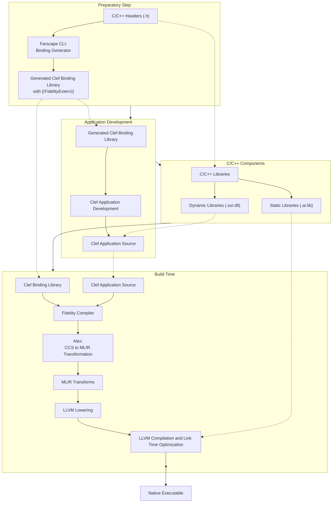
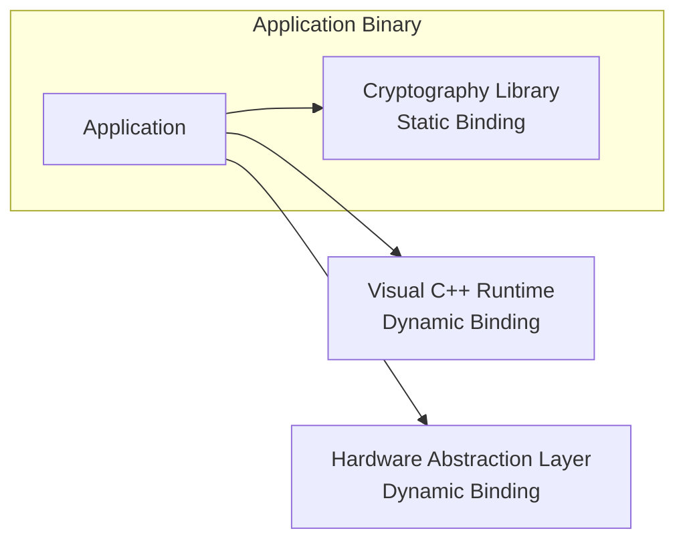

> This article was originally published on the
> [SpeakEZ Technologies blog](https://speakez.tech) as part of our early
> design work on the Fidelity Framework. It has been updated to reflect
> the Clef language naming and current project structure.

At the intersection of two powerful but largely separate computing paradigms stands the Fidelity framework, a revolutionary approach to systems programming that re-imagines what's possible when functional programming meets direct native compilation. For decades, developers have been forced into an artificial choice: embrace the productivity and safety of managed runtimes like .NET and the JVM while accepting their performance limitations, or pursue the raw efficiency of direct compilation while shouldering the burden of manual memory management and more complex development workflows.

The Fidelity framework aims to shatter this false dichotomy by bringing Clef's elegant type system, pattern matching, and functional composition directly to native code through MLIR without a runtime dependency. Unlike existing cross-compilation approaches that force compromises, Fidelity seeks to introduce innovations unseen in either ecosystem: a region-based memory management system designed to provide memory safety without garbage collection, BAREWire zero-copy serialization with compile-time verification, and platform-specific optimization through functional composition rather than conditional compilation.

This document explores one cornerstone of this vision: Fidelity's hybrid library binding architecture. Through its Farscape binding generator and Alex MLIR transformation components, Fidelity is designed to create a seamless pathway from Clef to native code that preserves the language's functional paradigm while providing systems-level control over library integration. This approach would enable developers to make intentional choices about static and dynamic linking strategies while maintaining a consistent development experience, effectively bridging the gap between high-level abstractions and hardware-specific optimizations across diverse computing environments.

## Clef as a Systems Programming Language

The computing world has long existed in fragmented, specialized territories with different programming approaches dictated more by historical accident than technical necessity. Embedded systems developers write in C, server developers gravitate to Java or C#, data scientists use Python, and mobile developers work with Swift or Kotlin. This fragmentation creates artificial barriers that force teams to master multiple languages or make compromises that aren't technically required.

The Fidelity framework boldly challenges this status quo with a question: What if a single language could effectively target the entire computing spectrum without compromise? It aims to fulfill that promise *not* through a lowest common denominator approach, but through an adaptive compilation strategy that brings the full expressive power of functional programming to every deployment target.

Clef serves as the perfect foundation for this vision. Already incorporating the best ideas from ML, OCaml, and other influences while maintaining an elegant pragmatism, Clef offers:

- A powerful type system with inference that catches errors at compile time
- Pattern matching and discriminated unions for expressing complex domain logic
- Immutability by default for safer concurrency
- Computation expressions for elegant domain-specific languages
- Interoperability with existing codebases and libraries
- Built-in concurrency primitives for modern parallel and distributed workloads

What Fidelity envisions is a direct compilation pathway that would enable Clef to freely explore new domains:

- Compilation directly to native code via MLIR/LLVM
- Platform-specific memory management without garbage collection
- Fine-grained control over resource allocation
- Zero-cost abstractions optimal runtime efficiency with maximal safety
- Direct interoperability with native libraries for instant access to a huge cross-section of capabilities

The result could be a language that deploys anywhere, from tiny microcontrollers with kilobytes of RAM to massive distributed systems spanning thousands of servers, while maintaining the same core programming model.

### The Library Binding Challenge

In the journey to make Clef a true systems programming language, one of the most significant challenges is effective integration with existing native libraries. This isn't merely a technical problem of function calling conventions and memory layouts, it's a architectural decision that affects everything from deployment simplicity to security posture to performance characteristics.

- **Static linking**: Incorporates library code directly into the executable, creating self-contained applications but increasing size and complicating updates
- **Dynamic linking**: Loads libraries at runtime, enabling sharing and updates but introducing deployment dependencies and potential compatibility issues

This seeming "binary" choice, if one were made to the exclusion of the other in all cases, would fail to address the nuanced requirements of modern systems that often span multiple computing environments with different constraints. An embedded component might require static linking for reliability, while a desktop application might benefit from dynamically linked system components.

What's needed is an approach that elegantly spans these two choices, allowing developers to make intentional, fine-grained decisions about binding strategies while maintaining a consistent programming model.

### The Hybrid Approach

Fidelity introduces a hybrid binding architecture designed to fundamentally change how developers integrate with native libraries. Rather than forcing wholesale decisions about linking strategies at project inception, it would enable binding decisions to be made at build time based on deployment requirements, while preserving a consistent development experience.

This architecture is built around three core principles:

1. **Unified Programming Interface**: Developers work with a consistent Clef API regardless of the underlying binding mechanism, eliminating the cognitive overhead of different programming models.

2. **Declarative Binding Configuration**: Binding strategies are specified declaratively through functional configuration, enabling different strategies for different libraries and deployment targets.

3. **Progressive Optimization**: Development builds can use dynamic binding for faster iteration, while release builds can selectively apply static binding where it provides maximum benefit.

This approach represents a paradigm shift in how we think about library integration, moving from monolithic, project-wide decisions to fine-grained, intentional choices that could adapt to the specific requirements of each component and deployment environment.

## System Architecture

### Core Components

The Fidelity framework's hybrid binding architecture is built around a carefully orchestrated pipeline designed to transform Clef code into native executables while preserving binding intent throughout the process. This architecture doesn't merely bridge existing technologies—it represents a fundamental rethinking of how compilation pipelines could adapt to diverse deployment requirements.



Each component in this pipeline has been designed with a specific purpose that looks beyond "garden variety" compilation choices.

### The Role of Farscape CLI

Farscape represents an approach to generating bindings for native libraries that goes beyond traditional binding generators. Where conventional tools produce simple mechanical translations, Farscape is designed to create truly idiomatic Clef interfaces that feel natural to Clef developers while maintaining full fidelity with the underlying C/C++ APIs.

Named in homage to the science fiction series exploring traversal between worlds, Farscape lives up to its namesake by creating bridges between disparate programming paradigms. It uses clang's two-pass parsing strategy (JSON AST extraction + macro extraction) with XParsec parser combinators for post-processing, but its true innovation lies in how it transforms these into Clef code that respects both languages' idioms.

Consider the challenge of mapping C's error-code-based error handling to Clef's more expressive result types:

```fsharp
// Platform.Bindings pattern (BCL-free) - Alex provides MLIR emission
module Platform.Bindings.MyLib =
    let libraryFunction (input: nativeint) (outputParam: nativeint) : int =
        Unchecked.defaultof<int>

// Farscape generated idiomatic wrapper
let performOperation (input: NativeStr) : Result<int, ErrorCode> =
    use output = NativePtr.stackalloc<int> 1
    let resultCode = Platform.Bindings.MyLib.libraryFunction input.Pointer (NativePtr.toNativeInt output)
    if resultCode = 0 then Ok (NativePtr.read output)
    else Error (enum<ErrorCode> resultCode)
```

This transformation doesn't just make the API more pleasant to use—it could fundamentally reduce the likelihood of errors by enforcing Clef's stronger type safety while maintaining the full capabilities of the underlying C library.

Furthermore, Farscape's generated bindings use the Platform.Bindings pattern (BCL-free), enabling both static linking and dynamic loading approaches. Alex provides platform-specific MLIR emission for each binding, laying the groundwork for the hybrid binding strategy that follows.

### The Role of Our Alex Library

If Farscape creates the bridge between languages, Alex is the engine designed to transform how those bridges function at compile time. Named as a playful reference to the famous drawing that looks like either a duck or a rabbit based on the viewer's perspective, Alex would perform a critical role in the Fidelity compilation pipeline: the transformation of Clef Compiler Services (CCS) AST to MLIR representations that can be further lowered to efficient native code.

Alex's approach is inspired by LicenseToCIL's type-safe operation composition system, but extended to the more complex domain of direct MLIR generation. This isn't a mere mechanical translation—it's a sophisticated transformation designed to preserve the semantic intent of Clef code while enabling platform-specific optimizations.

For binding strategies, Alex works in concert with a preprocessing nanopass that resolves platform decisions before witnessing begins:

```fsharp
// PlatformBindingResolution nanopass — runs before Alex witnessing
// Resolves each opaque extern node to a concrete binding strategy
let resolvePlatformBindings (psg: PSG) (configuration: ProjectConfiguration) : PSG =
    let externNodes = findExternNodes psg

    externNodes |> List.fold (fun graph extern ->
        let strategy =
            match configuration.GetBindingStrategy extern.Library with
            | BindingStrategy.Static -> ExternCall.Static extern.Library extern.Symbol
            | BindingStrategy.Dynamic -> ExternCall.Dynamic extern.Library extern.Symbol

        // Attach resolved strategy as coeffect on the extern node
        graph |> attachCoeffect extern.NodeId strategy
    ) psg

// Alex receives resolved extern nodes — no configuration lookup needed
// Each extern node already carries its resolved ExternCall coeffect
let witnessExternCall (node: PSGNode) : MLIR<Val> = mlir {
    match node.Coeffect with
    | ExternCall.Dynamic (library, symbol) ->
        // Emit external func decl + call site for dynamic linking
        return! emitDynamicCall library symbol node.Signature
    | ExternCall.Static (library, symbol) ->
        // Emit direct function reference for static linking with LTO
        return! emitStaticCall library symbol node.Signature
}
```

This separation is architecturally significant: the PlatformBindingResolution nanopass resolves all platform decisions *before* Alex begins witnessing. Alex never queries configuration — it simply emits what the resolved extern node tells it to. This means witnesses remain pure transformations from PSG semantics to MLIR, with no runtime-mode branching.

Alex's witnessing extends beyond binding strategies to encompass the entire spectrum of Clef features, from closures to pattern matching to computation expressions — all translated into MLIR representations that preserve their semantic intent while enabling efficient native code generation.

### Compilation Pipeline

The full compilation pipeline represents a seamless integration of these components into a coherent whole designed to transform Clef source to optimized native code:

- **Clef Source Code**: Developers write code using the Farscape-generated bindings, expressing their intent in idiomatic Clef without concern for the underlying binding mechanism.

- **Clef Compilation**: The Clef compiler processes the source code into an abstract syntax tree, applying its rich type system to catch errors early.

- **Quotation Extraction (CCS)**: CCS recognizes `[<FidelityExtern>]` attributed binding declarations during quotation extraction. The `Unchecked.defaultof<T>` body is never processed — CCS emits an opaque extern node in the PSG carrying (library, symbol) metadata.

- **PSG Saturation (Baker)**: The extern node is a leaf with no body to saturate. Baker passes it through intact with its metadata alongside the rest of the reachable graph.

- **Platform Binding Resolution**: A preprocessing nanopass resolves each extern node's binding strategy based on build configuration, attaching `ExternCall` coeffects (static or dynamic) before witnessing begins.

- **MLIR Witnessing (Alex)**: Alex receives resolved extern nodes and emits the appropriate MLIR — `fidelity.binding_strategy` and `fidelity.library_name` attributes on external function declarations for dynamic binding, or direct function references for static linking.

- **MLIR to LLVM Lowering**: The MLIR is progressively lowered through dialects until it reaches LLVM IR, with appropriate linkage directives for both static and dynamic libraries.

- **Native Code Generation**: The final compilation step produces platform-specific executable code that incorporates the chosen binding strategies.

This pipeline carries binding intent as metadata through every stage — from Clef attribute to PSG node to MLIR attribute to LLVM linkage directive — preserving the developer's original intent and the semantic integrity of the Clef language.

## Binding Strategies

### Static Binding

Static binding prioritizes predictability, performance, and security through self-contained applications. In the Fidelity framework, static binding would incorporate library code directly into the application executable, creating a unified whole where the boundaries between application and library code disappear at runtime.

#### Advantages

The benefits of static binding extend beyond the commonly cited performance improvements:

- **Performance**: Eliminating the runtime binding overhead is just the beginning. Static binding enables whole-program optimization where the compiler can inline library functions, eliminate unused code paths, and apply cross-module optimizations that would be impossible with dynamic libraries. For performance-critical embedded systems or high-throughput servers, these optimizations can translate to significant efficiency gains.

- **Deployment Simplicity**: In a world of increasingly complex deployment environments, from containerized microservices to edge devices with limited connectivity, the ability to deploy a single, self-contained executable simplifies operations dramatically. There's no need to ensure compatible library versions are available on the target system or worry about ABI compatibility.

- **Security**: Static binding reduces the attack surface of applications by eliminating the opportunity for dynamic library substitution attacks. When all code is bound at compile time, there's no possibility for an attacker to inject malicious libraries through the dynamic loading process. For security-critical applications like financial systems or infrastructure components, this security posture can be a decisive advantage.

- **Offline Operation**: For embedded systems that operate in environments without traditional filesystems or for air-gapped systems that run in isolated environments, static binding enables completely self-contained operation without external dependencies.

These advantages make static binding particularly valuable for specific categories of applications where predictability and self-containment outweigh flexibility.

#### Implementation Approach

Fidelity's implementation of static binding is designed to depart from traditional approaches in a crucial way: it preserves the same developer experience regardless of the binding strategy. Here's how the process works:

1. Farscape generates `[<FidelityExtern>]` attributed binding declarations that carry library name and symbol metadata, ensuring developers have a familiar and idiomatic Clef API.

2. CCS recognizes the attribute during quotation extraction and emits an opaque extern node in the PSG. The declaration's `Unchecked.defaultof<T>` body is never processed.

3. The PlatformBindingResolution nanopass resolves each extern node's binding strategy based on build configuration, and Alex emits the appropriate MLIR — direct LLVM dialect calls for static binding or external function declarations for dynamic binding.

4. For static binding, the LLVM linker incorporates the library code into the final executable, applying whole-program optimization through LTO where possible.

This approach contrasts with traditional binding generators that often require developers to write different code for static and dynamic binding scenarios. By maintaining a consistent API regardless of the underlying binding mechanism, Fidelity enables developers to focus on their application logic rather than binding details.

### Dynamic Binding

Dynamic binding represents an alternative philosophy of software deployment, one that prioritizes flexibility, resource sharing, and independent evolution of components. In the Fidelity framework, dynamic binding would load library code at runtime, establishing a clear boundary between the application and its dependencies.

#### Advantages

The advantages of dynamic binding include:

- **Resource Sharing**: In environments where multiple applications use the same libraries, particularly large system components like GUI frameworks or cryptographic libraries, dynamic binding enables sharing a single copy of the library in memory.

- **Update Flexibility**: Dynamic binding enables libraries to be updated independently of applications, allowing security patches and performance improvements to be applied without recompiling the entire application stack. In environments with stringent update procedures or where continuous deployment isn't feasible, this independence can be crucial for maintaining system security and stability.

- **Memory Efficiency**: Dynamic binding allows for more efficient memory usage by only loading the specific library components that are actually needed during execution. For applications with large dependencies that are only partially utilized, this selective loading can reduce memory pressure significantly.

- **Platform Integration**: For libraries that are an integral part of the operating system or platform, like windowing systems, hardware abstraction layers, or system services, dynamic binding enables applications to adapt to the specific environment in which they're running, taking advantage of platform-specific optimizations and capabilities.

These advantages make dynamic binding particularly valuable for applications that operate in diverse or evolving environments where flexibility outweighs the benefits of self-containment.

#### Implementation Approach

Fidelity's implementation of dynamic binding uses `[<FidelityExtern>]` attributed binding declarations with dynamic library resolution, providing enhanced safety and flexibility:

1. Farscape generates `[<FidelityExtern>]` attributed binding declarations that carry library name and symbol metadata. Layer 2 idiomatic wrappers provide additional safety and error handling around the raw declarations.

2. The `[<FidelityExtern>]` attribute flows through CCS as an opaque extern node and Baker passes it through as a leaf — identical to the static path. The PlatformBindingResolution nanopass resolves the node to dynamic binding based on build configuration.

3. Alex emits MLIR with `fidelity.binding_strategy = "dynamic"` and `fidelity.library_name` attributes on external function declarations. The linker auto-collects appropriate flags (`-lc`, `-lwayland-client`, etc.).

4. At runtime, the platform's dynamic linker resolves the external symbols against the target system's native libraries.

This approach provides the flexibility of dynamic binding while mitigating many of its traditional drawbacks through Farscape's Layer 2 safety wrappers and compile-time type verification.

### Hybrid Scenario

The true power of Fidelity's binding architecture emerges in hybrid scenarios that combine static and dynamic binding within the same application. This isn't merely a technical trick—it's a fundamental rethinking of how Clef applications could interface with external code, enabling developers to make intentional, fine-grained decisions about binding strategies based on the specific requirements of each component.

Consider a security-focused embedded application that needs to balance performance, security, and integration with hardware:



In this scenario:

- The cryptographic library is statically linked to ensure security and eliminate the possibility of library substitution attacks.
- System redistributables like the Visual C++ Runtime are dynamically linked because they're shared by multiple applications and receive regular security updates.
- The hardware abstraction layer is also dynamically linked.

This hybrid approach represents the best of both worlds—gaining the security and performance benefits of static linking where they matter most, while maintaining the flexibility and resource sharing of dynamic linking where appropriate.

What makes this approach novel is that it doesn't require developers to write different code for different binding strategies. The same Clef code works regardless of whether a library is statically or dynamically linked, with the binding decisions made declaratively through configuration rather than embedded in the code itself.

## Technical Implementation

### Project Configuration

At the heart of Fidelity's hybrid binding architecture is a declarative configuration system designed to enable developers to specify binding strategies without modifying their code. This system leverages TOML (Tom's Obvious, Minimal Language) for its human-readable syntax and structured data model, creating a clear separation between binding intent and implementation.

```toml
[package]
name = "secure_embedded_app"
version = "0.1.0"

[dependencies]
# Cryptographic library - statically bound
crypto_lib = { version = "1.2.0", binding = "static" }

# STM32L4 HAL - dynamically bound
stm32l4_hal = { version = "2.1.5", binding = "dynamic" }

# Default binding strategy for unspecified dependencies
[binding]
default = "dynamic"

[profiles.development]
# Development builds use dynamic binding for faster iteration
binding.default = "dynamic"
binding.overrides = { crypto_lib = "dynamic" }

[profiles.release]
# Release builds use static binding where possible
binding.default = "dynamic"
binding.overrides = { crypto_lib = "static" }
```

This configuration approach draws inspiration from Rust's Cargo system but extends it with binding-specific capabilities that address the unique challenges of Clef systems programming:

1. **Library-Specific Binding Strategies**: Rather than making monolithic project-wide decisions, developers can specify binding strategies on a per-library basis, enabling fine-grained control over the application's interaction with external code.

2. **Profile-Based Configuration**: Different build profiles can specify different binding strategies, enabling dynamic binding during development for faster iteration and selective static binding for release builds where performance and security are paramount.

3. **Default Strategy with Overrides**: The combination of a default strategy with specific overrides creates a configuration approach that scales from simple applications to complex systems with dozens of dependencies without becoming unwieldy.

This declarative approach represents a shift in how we think about binding strategies, moving from implementation details embedded in code to architectural decisions expressed through configuration. This separation would enable the same codebase to adapt to different deployment scenarios without modification.

### Farscape Binding Generation

The binding generation process is the foundation of Fidelity's hybrid binding architecture. Farscape generates a single set of bindings that work identically with both static and dynamic linking — the binding strategy is resolved downstream in the compilation pipeline, not in the generated code.

Farscape's Moya project system organizes library decompositions through `.moya.toml` files that declare headers, namespace groupings, and function assignments. A single Moya project can reference multiple C headers (e.g., `unistd.h` and `fcntl.h` for IO operations), with Farscape merging and deduplicating declarations across headers automatically. This produces clean, non-overlapping Clef modules from the natural structure of the C library.

```fsharp
// Layer 1: FidelityExtern binding declarations (BCL-free)
module Platform.Bindings.Crypto =
    /// int crypto_hash(const void* data, size_t length, void* output)
    [<FidelityExtern("crypto", "crypto_hash")>]
    let hash (data: nativeint) (length: nativeint) (output: nativeint) : int32 =
        Unchecked.defaultof<int32>

// Layer 2: Idiomatic Clef wrapper (generated by WrapperCodeGenerator)
module Crypto =
    /// Computes a secure hash of the provided data
    let computeHash (data: NativeStr) : Result<NativeArray<byte>, int> =
        let output = NativePtr.stackalloc<byte> 32
        let result = Platform.Bindings.Crypto.hash data.Pointer (nativeint data.Length) (NativePtr.toNativeInt output)
        if result = 0l then Ok (NativeArray.fromPtr output 32)
        else Error (int result)
```

The layered architecture of the generated bindings provides clean separation:

1. **Platform Bindings Layer (Layer 1)**: `[<FidelityExtern>]` attributed binding declarations that carry library name and symbol metadata. These flow through CCS as opaque extern nodes in the PSG, providing the typed interface to native code.

2. **Idiomatic Wrapper Layer (Layer 2)**: Clef functions that wrap the binding declarations with idiomatic error handling, resource management, and type conversions, providing a natural and safe API for Clef developers. Farscape generates these automatically through its WrapperCodeGenerator.

This separation creates a clean abstraction boundary that enables the binding strategy to be changed without affecting the developer-facing API. The PlatformBindingResolution nanopass resolves binding strategy on the extern nodes, while the developer-facing wrapper layer remains unchanged.

Farscape's binding generation goes beyond mere function mapping to address the full spectrum of interoperability challenges:

- **Memory Management**: Compile-time resource tracking for strings and buffers, preventing memory leaks regardless of binding strategy.

- **Error Handling**: Conversion of C-style error codes to idiomatic Clef Result types, making error handling natural and type-safe.

- **Type Safety**: Mapping of C types to appropriate Clef types with proper nullability and optionality, catching type errors at compile time.

- **Documentation**: Preservation of C/C++ documentation as Clef XML docs, ensuring the developer experience includes the full context of the original API.

### From Extern Node to MLIR

The heart of Fidelity's hybrid binding architecture lies in how binding intent flows through the nanopass pipeline and arrives at Alex already resolved. By the time Alex witnesses an extern node, the PlatformBindingResolution nanopass has already attached a concrete `ExternCall` coeffect — Alex's job is purely to emit the corresponding MLIR.

```fsharp
// Alex witness for extern nodes — receives already-resolved binding intent
let witnessExternNode (node: PSGNode) : MLIR<Val> = mlir {
    let extern = node.ExternCall  // (library, symbol) + resolved strategy

    match extern.Strategy with
    | ExternCall.Dynamic ->
        // Emit external func decl + call site with binding metadata
        let! func = declareExternalFunc extern.Symbol extern.Signature
        return! emitCall func node.Arguments
    | ExternCall.Static ->
        // Emit direct function reference for LTO inlining
        let! func = declareStaticFunc extern.Symbol extern.Signature
        return! emitCall func node.Arguments
}
```

- For dynamic binding, Alex emits an external function declaration with `fidelity.binding_strategy` and `fidelity.library_name` MLIR attributes. The platform's dynamic linker resolves the symbol at load time.
- For static binding, Alex emits a direct function reference that LLVM's link-time optimizer can inline across module boundaries.

The separation between resolution (nanopass) and emission (Alex) is architecturally significant. Alex never queries build configuration — it witnesses what the PSG tells it. This keeps witnesses pure and composable, and means binding strategy changes never require modifications to Alex's witnessing logic.

Alex's witnessing preserves the semantic intent of the original code, ensuring that error handling, resource management, and other aspects of the API contract remain consistent regardless of the binding strategy.

### MLIR Generation with Binding Intent

The next step in the compilation pipeline is the generation of MLIR, where binding intent would be preserved through metadata that guides subsequent processing. This preservation enables the later stages of the pipeline to make appropriate decisions about how to handle external function calls.

```mlir
// For statically bound functions (direct references)
func.func private @crypto_hash(%arg0: !llvm.ptr<i8>, %arg1: i64) -> !llvm.ptr<i8> attributes {
  llvm.linkage = #llvm.linkage<external>,
  fidelity.binding_strategy = "static",
  fidelity.library_name = "crypto_lib"
}

// For dynamically bound functions (FidelityExtern with dynamic strategy)
func.func private @GPIO_Init(%arg0: !llvm.ptr<i8>, %arg1: !llvm.ptr<i8>) -> i32 attributes {
  llvm.linkage = #llvm.linkage<external>,
  fidelity.binding_strategy = "dynamic",
  fidelity.library_name = "stm32l4_hal"
}
```

MLIR attributes capture binding intent in a way that can be processed by subsequent stages of the compilation pipeline. This approach leverages MLIR's extensibility to create a binding-aware intermediate representation that would carry more semantic information than traditional IRs.

This preservation of binding intent enables powerful transformations during the MLIR lowering process:

1. **Function Inlining**: For statically bound functions, the lowering process can apply aggressive inlining across module boundaries, eliminating the function call overhead entirely where appropriate.

2. **Link-Time Optimization**: The binding information guides link-time optimization, enabling whole-program optimization for statically bound components while preserving the separation for dynamically bound elements.

3. **Platform-Specific Adaptation**: The binding information can inform platform-specific code generation strategies, such as using direct syscalls on certain platforms or dynamic loading on others.

By carrying binding intent through the MLIR representation, Fidelity could enable a more nuanced compilation process that adapts to the specific requirements of each component and deployment environment.

### Platform Library Handling

An important aspect of Fidelity's binding architecture is its handling of platform-native libraries — the standard C library (libc, libSystem, ucrt), system services, and hardware abstraction layers that form the foundation of every target platform. These components are intrinsic to the platform and require specialized treatment in the binding strategy.

```fsharp
// Platform library classification — resolved during PlatformBindingResolution
type PlatformLibrary =
    | SystemLibrary of name: string    // libc, libSystem, ucrt — always dynamic
    | VendorLibrary of name: string    // HAL, device drivers — platform-provided
    | ApplicationLibrary of name: string  // user libraries — strategy from config

// The nanopass resolves platform libraries to always-dynamic binding
let resolveLibraryStrategy (library: string) (config: ProjectConfiguration) =
    match classifyLibrary library with
    | SystemLibrary _ ->
        // Platform standard libraries are always dynamically linked
        // They are part of the target OS and guaranteed present
        ExternCall.Dynamic library
    | VendorLibrary _ ->
        // Vendor libraries follow platform conventions
        ExternCall.Dynamic library
    | ApplicationLibrary _ ->
        // Application libraries respect the configured strategy
        match config.GetBindingStrategy library with
        | Static -> ExternCall.Static library
        | Dynamic -> ExternCall.Dynamic library
```

This classification recognizes the practical reality of native platforms:

1. **Platform Libraries Are Always Dynamic**: The standard C library and OS services are part of the target platform itself. On Linux, applications link against the system's libc; on macOS, against libSystem; on Windows, against ucrt. These are resolved by the platform's dynamic linker and are guaranteed to be present on any conforming system.

2. **Vendor Libraries Follow Platform Conventions**: Hardware abstraction layers and device drivers are provided by the platform vendor and follow that platform's linking conventions.

3. **Application Libraries Respect Configuration**: Libraries that the application brings — cryptographic implementations, protocol handlers, domain-specific code — are where the static/dynamic decision matters and where the build configuration applies.

### Build Pipeline Integration

The binding architecture is designed to be fully integrated into the Composer compiler's build pipeline, creating a seamless process from source code to native executable that adapts to the configured binding strategies. This integration ensures that binding decisions propagate through the entire compilation process, affecting everything from AST transformation to MLIR generation to linking. The result would be a native executable that embodies the configured binding strategies, combining statically and dynamically linked components as specified.

This integration aims to be seamless: binding decisions wouldn't require special tooling or workflow changes—they'd simply be another aspect of the compilation process that adapts to the configuration. This seamless integration would enable developers to focus on their application logic rather than binding mechanics.

## Practical Examples

### Embedded Security Example

The hybrid binding architecture would reveal its power in real-world scenarios where different components have different requirements. Consider an embedded security application targeting a constrained microcontroller, where memory efficiency, performance, and security are critical concerns.

```fsharp
open CryptoLib
open STM32L5.HAL

let secureBootSequence () =
    // Verify firmware signature (using statically linked crypto library)
    let firmwareHash = Crypto.computeHash(FirmwareImage.data)
    let isValid = Crypto.verifySignature(firmwareHash, FirmwareImage.signature)

    if isValid then
        // Initialize hardware (using dynamically linked HAL)
        GPIO.initialize()
        LED.setColor(LedColor.Green)
        true
    else
        LED.setColor(LedColor.Red)
        false
```

In this scenario, the binding configuration might look like:

```toml
[dependencies]
crypto_lib = { version = "1.2.0", binding = "static" }
stm32l4_hal = { version = "2.1.5", binding = "dynamic" }

[binding]
default = "static"  # Default to static for embedded
```

This configuration reflects the different requirements of each component:

- The cryptographic library is statically linked for security (preventing library substitution attacks) and performance (enabling inlining and other optimizations).
- The hardware abstraction layer is dynamically linked because it interfaces directly with hardware that might vary between device revisions, requiring adaptation without recompilation.

What's remarkable is that the application code remains the same regardless of these binding decisions, the developer works with a consistent, idiomatic Clef API while the underlying binding mechanics adapt to the configuration.

### Cross-Platform Application Example

The hybrid binding architecture also shines in cross-platform scenarios, where different platforms have different libraries and requirements. Consider a desktop application targeting Windows, macOS, and Linux with platform-specific components.

```toml
# Example binding configuration in project file
[dependencies]
core_algorithm = { version = "1.0.0", binding = "static" }
ui_toolkit = { version = "2.1.0", binding = "dynamic" }
platform_services = { version = "0.5.0", binding = "dynamic" }

[platform.windows]
platform_services = { version = "0.5.0-windows" }

[platform.macos]
platform_services = { version = "0.5.0-macos" }
```

This configuration reflects a common pattern in cross-platform applications:

- The core algorithm library is statically linked for consistent performance across platforms and to eliminate a deployment dependency.
- A UI toolkit is dynamically linked because it's a large, frequently updated component shared by multiple applications.
- Platform-specific services use platform-specific versions, dynamically linked to integrate with the operating system.

Again, the developer's application code remains consistent across platforms, using the same Clef API regardless of the underlying binding mechanics. This consistency dramatically simplifies cross-platform development, enabling a single codebase to target multiple platforms without platform-specific code paths.

## Advanced Topics

### Closures and Static Binding

One of the most challenging aspects of direct native compilation for functional languages is handling closures, functions that capture variables from their surrounding environment. This challenge becomes particularly acute with static binding, where the closure's captured environment must be properly managed without a garbage collector.

Fidelity aims to address this challenge through a region-based stack allocation system that would preserve the safety and expressiveness of Clef closures without requiring a runtime.

```fsharp
let createCounter initialValue =
    let count = initialValue
    // Closure that captures count
    fun () ->
        let newCount = count + 1
        count <- newCount
        newCount
```

Alex would transform this to use stack regions when compiled with static binding:

```fsharp
// Conceptual layout for static binding
type CounterEnvironment = {
    mutable count: int
}

let counterImpl (env: nativeptr<CounterEnvironment>) : int =
    let currentCount = NativePtr.read env
    let newCount = currentCount + 1
    NativePtr.write env newCount
    newCount

let createCounter(initialValue: int) =
    let region = StackRegion.create sizeof<CounterEnvironment>

    // Allocate environment in the region
    let env = StackRegion.allocate<CounterEnvironment> region
    NativePtr.write env { count = initialValue }

    // Create function that encapsulates the environment pointer
    let counter = {
        Function = counterImpl
        Environment = env
        Region = region
    }

    counter
```

This approach would preserve the semantic behavior of the original closure while eliminating the need for garbage collection:

1. **Region-Based Allocation**: Captured variables are allocated in memory regions with controlled lifetimes, providing memory safety without garbage collection.

2. **Environment Encapsulation**: The closure's environment is explicitly represented and passed to the implementation function, making the captures explicit.

3. **Lifetime Management**: The region's lifetime is tied to the closure itself, ensuring that captured variables remain valid as long as the closure exists.

This approach could enable the full expressiveness of Clef closures in statically linked code, without requiring the overhead of a garbage collector. It represents an effort to bring functional programming patterns to systems applications where traditional runtime approaches aren't feasible. For a deeper exploration of closure representation in Fidelity, see [Gaining Closure](/docs/design/gaining-closure/).

### BAREWire Integration

Fidelity's binding architecture is designed to integrate deeply with BAREWire, the framework's zero-copy serialization system. This integration would enable efficient, type-safe communication between components, regardless of their binding strategy.

```fsharp
let messageSchema = BAREWire.schema {
    field "id" BAREWireType.UInt32
    field "timestamp" BAREWireType.UInt64
    field "payload" (BAREWireType.Array(BAREWireType.UInt8, 256))
    alignment 8  // Ensure proper memory alignment
}

let processMessage (buffer: AlignedBuffer<byte>) =
    // Create a zero-copy view over the buffer
    use msgView = BAREWire.createView<Message> buffer

    // Process fields directly without copying
    let id = msgView.Id
    let timestamp = msgView.Timestamp

    // Pass to C library function (statically bound)
    CLibrary.processMessageData(buffer.GetPointer(), buffer.Length)
```

This integration aims to provide several unique capabilities:

1. **Zero-Copy Interoperability**: Data can be passed between Clef code and native libraries without copying, reducing memory pressure and improving performance.

2. **Type-Safe Serialization**: The BAREWire schema ensures type safety between Clef code and native libraries, catching errors at compile time rather than runtime.

3. **Memory Layout Control**: Explicit control over memory layout ensures compatibility with native libraries that expect specific struct layouts.

This integration is particularly valuable for performance-critical applications that process large amounts of data, enabling efficient communication between components regardless of their binding strategy.

### Platform-Specific Binding Strategies

Different platforms have different considerations for binding strategies, influencing how libraries should be integrated. Fidelity addresses this through platform-specific binding configurations designed to adapt to the unique characteristics of each environment.

```fsharp
let configureBindingStrategy (platformType: PlatformType) =
    match platformType with
    | PlatformType.Embedded ->
        {
            DefaultStrategy = BindingStrategy.Static
            ExceptionList = ["hardware_hal"; "device_drivers"]  // Dynamic
            OptimizationGoal = OptimizationGoal.Size
            AllowCrossCompilation = true
        }

    | PlatformType.Mobile ->
        {
            DefaultStrategy = BindingStrategy.Dynamic
            PriorityStaticList = ["crypto"; "core_algorithms"]  // Static
            OptimizationGoal = OptimizationGoal.Balanced
            AllowCrossCompilation = true
        }

    | PlatformType.Server ->
        {
            DefaultStrategy = BindingStrategy.Dynamic
            PriorityStaticList = ["performance_critical"]  // Static
            OptimizationGoal = OptimizationGoal.Performance
            AllowCrossCompilation = false
        }
```

This approach recognizes that different environments have different priorities:

- **Embedded Systems**: Prioritize static binding for predictability and self-containment, with exceptions for hardware interfaces.
- **Mobile Devices**: Balance static and dynamic binding, using static for performance-critical or security-sensitive components and dynamic for platform integration.
- **Server Systems**: Prioritize dynamic binding for flexibility and resource sharing, with static binding reserved for the most performance-critical components.

By adapting binding strategies to each platform's characteristics, Fidelity aims to enable efficient targeting of diverse environments without compromising on performance or compatibility.

## Development Workflow

### Library Binding Workflow

The development workflow for using native libraries in Fidelity is designed to be intuitive and familiar to Clef developers, while providing the flexibility needed for systems programming.

1. **Generate Bindings**: Use Farscape to generate Clef bindings for the C/C++ library
   ```bash
   farscape generate --header library.h --library library_name
   ```

2. **Add to Project**: Include the generated bindings in the Clef project
   ```bash
   fargo add library_name
   ```

3. **Configure Binding Strategy**: Specify binding strategy in project configuration
   ```toml
   [dependencies]
   library_name = { version = "1.0.0", binding = "static" }
   ```

4. **Use Consistent API**: Write code using the library's Clef API
   ```fsharp
   open LibraryName

   // Use library functions
   let result = Library.someFunction(arg1, arg2)
   ```

5. **Build for Development**: Use dynamic binding for faster iteration
   ```bash
   fargo build --profile development
   ```

6. **Build for Release**: Use configured binding strategies for optimized builds
   ```bash
   fargo build --profile release
   ```

This workflow maintains a clean separation between binding intent and implementation, enabling developers to focus on their application logic while the binding mechanics adapt to the configuration. The consistency of the API regardless of binding strategy would allow the same code to be used across different deployment scenarios without modification.

### Development-Time vs. Build-Time Binding

A key innovation in Fidelity's approach is the separation between development-time and build-time binding decisions. This separation acknowledges that the optimal binding strategy during development may differ from the one used in production.

- **Development Time**: During development, dynamic binding provides faster compilation and easier debugging, enabling rapid iteration. Changes to the application code don't require recompiling the libraries, and debugging tools can see across the function call boundary more easily.

- **Build Time**: For production builds, the configured binding strategies are applied based on performance, security, and deployment requirements. Static binding may be used for performance-critical or security-sensitive components, while dynamic binding is reserved for platform integration or frequently updated libraries.

- **CI/CD Pipeline**: In continuous integration environments, different binding strategies can be applied for different build targets, dynamic for debugging builds, static for release builds, and specific combinations for particular deployment environments.

This separation creates a more productive development experience while still enabling optimal production builds. Developers could focus on their application logic during development, with the binding mechanics automatically adapting to the appropriate strategy at build time.

## Performance Considerations

### Static Binding Performance Benefits

Static binding can provide significant performance benefits in certain scenarios, particularly for performance-critical applications or constrained environments.

- **Elimination of PLT/GOT Overhead**: Dynamic binding requires the Procedure Linkage Table and Global Offset Table to resolve function addresses at runtime, introducing overhead for each function call. Static binding eliminates this overhead, enabling direct function calls with minimal indirection.

- **Whole-Program Optimization**: Static binding enables the compiler to see across module boundaries, enabling optimizations like function inlining, constant propagation, and dead code elimination that wouldn't be possible with dynamic binding.

- **Cold Start Performance**: Dynamic binding requires loading and resolving libraries at startup, introducing latency before the application can begin execution. Static binding eliminates this latency, enabling faster startup times.

- **Cache Coherency**: Static binding places related code closer together in memory, improving instruction cache utilization and reducing cache misses during execution.

These benefits can be particularly significant for embedded systems, real-time applications, or performance-critical servers where every nanosecond of latency matters.

### Dynamic Binding Advantages

Dynamic binding provides different advantages that can be valuable in certain scenarios:

- **Memory Sharing**: Multiple applications can share the same library in memory, reducing the overall memory footprint in environments with many concurrent applications.

- **Smaller Binary Size**: While static binding reduces the total memory footprint at runtime, it typically increases the size of the executable file itself. For deployment scenarios where binary size is critical, dynamic binding can provide smaller executables.

- **Update Flexibility**: Dynamic binding enables libraries to be updated independently of applications, allowing security patches and performance improvements to be applied without recompiling the entire application stack.

- **Plugin Architecture**: Dynamic binding enables runtime loading of components, supporting plugin architectures and dynamic extensibility that wouldn't be possible with static binding.

These advantages make dynamic binding particularly valuable for desktop applications, systems with memory constraints, or dependencies that require frequent updates which avoids redeployment.

### Optimization Strategies

Fidelity is designed to employ several optimization strategies to maximize performance regardless of binding approach:

- **Link-Time Optimization**: For statically linked components, link-time optimization enables aggressive cross-module optimizations like function inlining, constant propagation, and dead code elimination.

- **Profile-Guided Optimization**: Using execution profiles to identify hot paths and optimize them aggressively, regardless of binding strategy.

- **Inlining Across Boundaries**: For performance-critical functions, Fidelity could selectively inline across binding boundaries, even with dynamic binding, by generating specialized versions of the code.

- **Vectorization**: SIMD optimization is applied where supported by the target platform, enabling efficient parallel processing regardless of binding strategy.

These optimization strategies ensure that both static and dynamic binding approaches can achieve optimal performance for their respective scenarios, reducing the performance gaps while preserving each approach's unique advantages.

## Security Implications

### Static Binding Security Benefits

Static binding provides several security advantages that can be crucial for certain applications:

- **Reduced Attack Surface**: Dynamic binding introduces the possibility of dynamic library substitution attacks, where an attacker replaces a legitimate library with a malicious one. Static binding eliminates this attack vector by incorporating the library code directly into the executable.

- **Zero-Copy Reduces Memory Exposure**: Using a zero-copy approach means that critical elements in the computation graph are only written one time. Fewer copies mean fewer things to clean up at runtime, reducing risk of data exposure as well as making for a faster execution path.

- **Supply Chain Security**: Static binding enables verification of library code at build time, reducing the risk of supply chain attacks that target dependencies.

- **Immutable Binary**: Statically linked executables are more resistant to tampering, as the library code is an integral part of the binary rather than a separate component that could be modified.

- **Fixed Versions**: Static binding ensures that the application uses exactly the version of the library that was verified during development, eliminating the risk of compatibility issues or security regressions from newer versions.

These security benefits make static binding particularly valuable for security-critical applications like financial systems, infrastructure components, or applications handling sensitive data.

### Dynamic Binding Security Considerations

Dynamic binding introduces security considerations that must be addressed:

- **Path Security**: Ensuring libraries are loaded from trusted locations to prevent library substitution attacks.

- **Version Verification**: Checking library versions at runtime to ensure compatibility and prevent the use of versions with known vulnerabilities.

- **Integrity Verification**: Validating library signatures where possible to ensure the integrity of dynamically loaded code.

- **Dependency Management**: Tracking and updating dependencies for security patches, particularly for libraries that handle sensitive operations like cryptography or network communication.

Fidelity aims to address these considerations through enhanced runtime checks and verification mechanisms, reducing the security risks associated with dynamic binding.

### Recommended Security Practices

For security-critical applications, the recommended practices include:

1. Use static binding for security-critical components (crypto, authentication, authorization) to eliminate the risk of library substitution attacks.

2. Employ runtime integrity checking for dynamically loaded libraries, validating signatures or checksums before execution.

3. Implement defense-in-depth with multiple verification mechanisms, creating layers of security that protect against different attack vectors.

4. Follow platform-specific security best practices for library loading, particularly on platforms with specialized security mechanisms like code signing or secure boot.

These practices could create a robust security posture that balances the flexibility of dynamic binding with the security benefits of static binding, enabling applications to meet their security requirements while maintaining deployment flexibility.

## Future Developments

### Compiler Evolution

Fidelity's binding architecture will continue to evolve to address emerging requirements and opportunities:

- **Automatic Binding Strategy Selection**: Future versions will incorporate heuristics to determine optimal binding strategies based on library characteristics, usage patterns, and deployment targets, reducing the need for manual configuration.

- **Hybrid Function Selection**: Rather than binding entire libraries statically or dynamically, future versions will support more granular decisions at the function level, enabling selective static binding of performance-critical functions while keeping others dynamic.

- **Profile-Guided Binding**: Integration with profile-guided optimization to inform binding decisions based on actual execution patterns, targeting static binding for hot paths while keeping cold code dynamic.

- **Incremental Static Linking**: Combining benefits of both approaches with partial static linking, where frequently called functions are statically linked while rarely used ones remain dynamic.

These innovations aim to further refine the binding architecture, enabling even more nuanced decisions that optimize for the specific characteristics of each application and deployment environment.

### Tooling Improvements

Future tooling improvements will focus on enhancing the developer experience and providing deeper insights into binding decisions:

- **Binding Analysis Tools**: Visualization tools for dependency relationships and binding decisions, enabling developers to understand and optimize the binding architecture of their applications.

- **Performance Impact Estimation**: Predictive tools that estimate the performance impact of different binding strategies, helping developers make informed decisions about their binding configuration.

- **Automated Security Analysis**: Tools that identify potential security issues in binding patterns, recommending improvements to enhance the application's security posture.

- **Cross-Platform Testing**: Automated testing across different platforms to validate binding strategies in diverse environments, ensuring consistent behavior regardless of the deployment target.

These tooling improvements would enhance the developer experience, making binding decisions more transparent and accessible while providing the insights needed for optimization.

### Standards and Integration

Work is ongoing to improve standards compatibility and integration with existing ecosystems:

- **C++ Standard Compatibility**: Enhanced support for modern C++ features like templates, RAII, and overloaded operators, enabling more natural bindings for C++ libraries.

- **IDE Support**: Enhanced developer experience in common Clef editors such as VSCode and JetBrains Rider with binding-aware code completion, error checking, and visualization tools.

These integration efforts would make Fidelity's binding architecture more accessible to developers across different ecosystems, enabling broader adoption and integration with existing workflows.

## Conclusion

The Fidelity framework's approach to library binding represents a paradigm shift in how we think about integrating native libraries with high-level languages. By separating binding intent from implementation, it aims to enable developers to make intentional, fine-grained decisions about binding strategies while maintaining a consistent programming model.

This balanced approach combines the best aspects of static and dynamic linking, providing the performance and security benefits of static binding where they matter most, while maintaining the flexibility and resource sharing of dynamic binding where appropriate. The result would be a more versatile architecture that adapts to diverse deployment requirements without compromising on developer experience.

What makes this approach compelling is not just its technical capabilities, but its potential impact on the development process. By removing the artificial boundary between "systems programming" and "high-level programming," it could enable developers to harness the full expressive power of Clef across the entire computing spectrum, from tiny embedded devices to massive distributed systems.

As the Fidelity ecosystem continues to evolve, the binding architecture remains a cornerstone of its vision. This approach represents a potential paradigm shift in systems programming—one that aims to dissolve traditional boundaries between environments while preserving the precision, expressiveness, and elegance that defines Clef as a programming language.

---

## Related Design Documents

- [Gaining Closure](/docs/design/gaining-closure/): How MLKit-style flat closures bring Clef memory safety to native compilation
- [Baker: The Saturation Engine](/docs/design/baker-saturation-engine/): Type resolution and the zipper-based correlation pipeline
- [Context-Aware Compilation](/docs/design/context-aware-compilation/): How coeffects guide optimization across heterogeneous hardware
- [Nanopass Navigation](/docs/design/nanopass-navigation/): The nanopass architecture underlying the compilation pipeline
- [Getting Inline](/docs/design/getting-inline/): How Fidelity handles inlining for native compilation
- [Fidelity on STM32](/docs/design/fidelity-on-stm32/): Embedded deployment targeting constrained microcontrollers
- [Native Memory Management](/docs/design/native-memory-management/): Memory management across the computing spectrum
