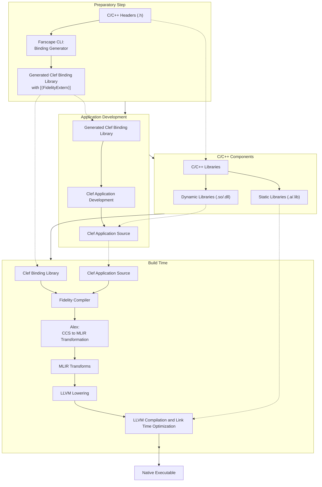
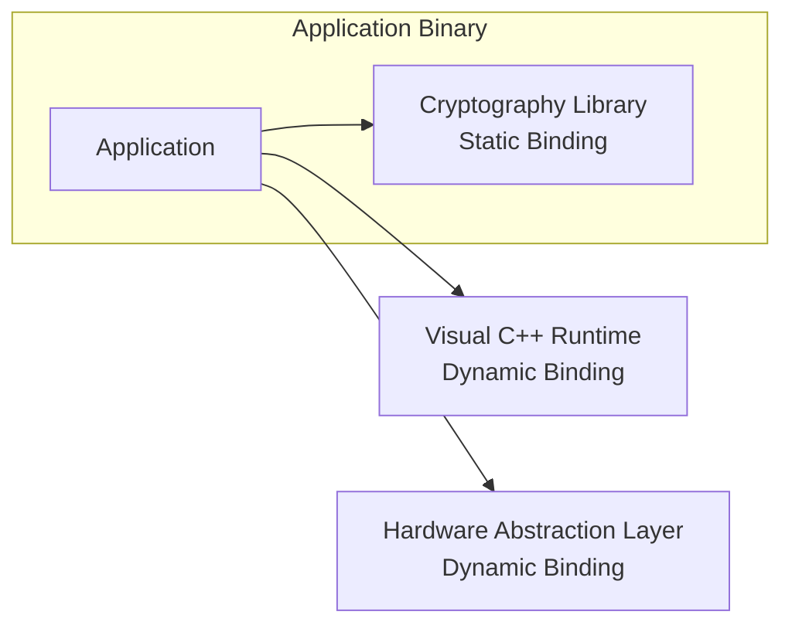

Our Fidelity framework sits at the intersection of two computing approaches that have stayed largely separate: functional programming and direct native compilation. For decades the choice between them has read as a fixed trade. A managed runtime like .NET or the JVM brings productivity and safety while accepting a performance cost. Direct compilation brings raw efficiency while carrying manual memory management and a more involved development workflow.

We treat that trade as a design choice rather than a law. Our Fidelity framework brings Clef's type system, pattern matching, and functional composition directly to native code through MLIR with no runtime dependency. Where existing cross-compilation approaches force compromises, we are building toward a few capabilities we have not found together in either ecosystem: a region-based memory management system that provides memory safety without garbage collection, our BAREWire zero-copy serialization with compile-time verification, and platform-specific optimization through functional composition rather than conditional compilation.

This document covers one part of that work: our hybrid library binding architecture. Through our Farscape binding generator and our Alex MLIR transformation, we intend a path from Clef to native code that keeps the language's functional model while giving systems-level control over library integration. The aim is to let developers make intentional choices about static and dynamic linking while keeping a consistent development experience, across diverse computing environments and their differing hardware constraints.

## Clef as a Systems Programming Language

The computing world has split into specialized territories, and the split often follows historical accident more than technical necessity. Embedded systems developers write in C, server developers gravitate to Java or C#, data scientists use Python, and mobile developers work with Swift or Kotlin. The result forces teams to master several languages, or to accept compromises that are not technically required.

We start our Fidelity framework from a different question. Can a single language target the whole computing spectrum without that compromise? Our answer is not a lowest-common-denominator language. It is an adaptive compilation strategy that carries functional programming to every deployment target.

Clef gives us the foundation for that work. Descended from F#, it draws on ML, OCaml, and related lineages, and it offers:

- A type system with inference that catches errors at compile time
- Pattern matching and discriminated unions for expressing domain logic
- Immutability by default for safer concurrency
- Computation expressions for domain-specific languages
- Interoperability with existing codebases and libraries
- Built-in concurrency primitives for parallel and distributed workloads

What we intend to add is a direct compilation path that lets Clef reach into new domains:

- Compilation directly to native code via MLIR/LLVM
- Platform-specific memory management without garbage collection
- Fine-grained control over resource allocation
- Zero-cost abstractions that pair runtime efficiency with safety
- Direct interoperability with native libraries for access to a wide cross-section of existing capabilities

The target is a language that deploys from microcontrollers with kilobytes of RAM to distributed systems spanning thousands of servers, while keeping the same core programming model.

### The Library Binding Challenge

In making Clef a systems programming language, one of the harder problems is integration with existing native libraries. The problem reaches past function calling conventions and memory layouts. It is an architectural decision that affects deployment simplicity, security posture, and performance.

- **Static linking**: Incorporates library code directly into the executable, creating self-contained applications but increasing size and complicating updates
- **Dynamic linking**: Loads libraries at runtime, enabling sharing and updates but introducing deployment dependencies and potential compatibility issues

Picking one of these for every case across an application misses the requirements of systems that span several computing environments with different constraints. An embedded component might require static linking for reliability, while a desktop application might benefit from dynamically linked system components.

We want an approach that spans both choices, so developers can make fine-grained decisions about binding strategies while keeping a consistent programming model.

### The Hybrid Approach

Our hybrid binding architecture changes where the linking decision is made. Rather than forcing wholesale decisions about linking strategy at project inception, it defers binding decisions to build time, based on deployment requirements, while keeping a consistent development experience.

This architecture rests on three principles:

1. **Unified Programming Interface**: Developers work with a consistent Clef API regardless of the underlying binding mechanism, eliminating the cognitive overhead of different programming models.

2. **Declarative Binding Configuration**: Binding strategies are specified declaratively through functional configuration, enabling different strategies for different libraries and deployment targets.

3. **Progressive Optimization**: Development builds can use dynamic binding for faster iteration, while release builds can selectively apply static binding where it provides maximum benefit.

This moves library integration from monolithic, project-wide decisions to fine-grained choices that adapt to the requirements of each component and deployment environment.

## System Architecture

### Core Components

Our hybrid binding architecture is built around a pipeline that transforms Clef code into native executables while carrying binding intent through every stage. The pipeline bridges existing technologies, and it also reworks how a compilation pipeline adapts to diverse deployment requirements.


```mermaid
flowchart TB
    %% Optimize for narrow blog format with vertical flow

    %% --- First section: Preparatory Step ---
    subgraph ps["Preparatory Step"]
        direction TB
        CHeaders["C/C++ Headers (.h)"] --> Farscape["Farscape CLI:<br>Binding Generator"]
        Farscape --> FSharpLib["Generated Clef Binding Library<br>with [⟨FidelityExtern⟩]"]
    end

    %% --- Second section: Application Development ---
    subgraph ad["Application Development"]
        direction TB
        FSharpLib2["Generated Clef Binding Library"] --> DevProcess["Clef Application Development"]
        DevProcess --> AppCode["Clef Application Source"]
    end

    %% --- Third section: C/C++ Components ---
    subgraph cc["C/C++ Components"]
        direction TB
        CLib["C/C++ Libraries"] --> StaticLib["Static Libraries (.a/.lib)"]
        CLib --> DynamicLib["Dynamic Libraries (.so/.dll)"]
    end

    %% --- Fourth section: Build Time with invisible node to help align ---
    subgraph bt["Build Time"]
        direction TB
        FSharpLib3["Clef Binding Library"] & AppCode2["Clef Application Source"] --> FidelityCompiler["Fidelity Compiler"]
        FidelityCompiler --> Alex["Alex:<br>CCS to MLIR Transformation"]
        Alex --> MLIR["MLIR Transforms"]
        MLIR --> LLVMDialect["LLVM Lowering"]
        LLVMDialect --> LLVMFrontend["LLVM Compilation and Link Time Optimization"]
        %% Add a center anchor point at the bottom of Build Time
        LLVMFrontend --> btExit([" "])
        classDef invisible fill:none,stroke:none
        class btExit invisible
    end

    %% Native Executable positioned directly under Build Time
    btExit --> NativeCode["Native Executable"]

    %% --- Main vertical flow ---
    ps --> ad --> cc --> bt

    %% --- Cross-connections ---
    CHeaders -.-> CLib
    FSharpLib -.-> FSharpLib2
    FSharpLib -.-> FSharpLib3
    AppCode -.-> AppCode2
    StaticLib -.-> LLVMFrontend
    DynamicLib -.-> AppCode
```

Each component in this pipeline has a specific purpose beyond ordinary compilation choices.

### The Role of Farscape CLI

Our Farscape generates bindings for native libraries. Where conventional tools produce mechanical translations, Farscape generates idiomatic Clef interfaces that read naturally to Clef developers while keeping fidelity with the underlying C/C++ APIs.

Named in homage to the science fiction series about traversal between worlds, Farscape builds bridges between disparate programming models. It uses clang's two-pass parsing strategy (JSON AST extraction plus macro extraction) with XParsec parser combinators for post-processing, and the part we have not seen elsewhere is how it transforms these into Clef code that respects both languages' idioms.

Consider the challenge of mapping C's error-code-based error handling to Clef's more expressive result types:

```fsharp
// Platform.Bindings pattern (BCL-free) - Alex provides MLIR emission
module Platform.Bindings.MyLib =
    let libraryFunction (input: nativeint) (outputParam: nativeint) : int =
        Unchecked.defaultof<int>

// Farscape generated idiomatic wrapper
let performOperation (input: NativeStr) : Result<int, ErrorCode> =
    use output = NativePtr.stackalloc<int> 1
    let resultCode = Platform.Bindings.MyLib.libraryFunction input.Pointer (NativePtr.toNativeInt output)
    if resultCode = 0 then Ok (NativePtr.read output)
    else Error (enum<ErrorCode> resultCode)
```

This transformation makes the API more pleasant to use, and it reduces the likelihood of errors by enforcing Clef's type safety while keeping the capabilities of the underlying C library.

Farscape's generated bindings use the Platform.Bindings pattern (BCL-free), which supports both static linking and dynamic loading. Our Alex provides platform-specific MLIR emission for each binding, which sets up the hybrid binding strategy that follows.

### The Role of Our Alex Library

If Farscape builds the bridge between languages, our Alex is the part that transforms how those bridges function at compile time. Named after the drawing that reads as either a duck or a rabbit depending on the viewer, Alex carries a central role in our compilation pipeline: it transforms the Clef Compiler Services (CCS) AST into MLIR representations that lower to native code.

Alex's approach draws on LicenseToCIL's type-safe operation composition, extended to direct MLIR generation. The transformation preserves the semantic intent of Clef code while enabling platform-specific optimizations.

For binding strategies, Alex works in concert with a preprocessing nanopass that resolves platform decisions before witnessing begins:

```fsharp
// PlatformBindingResolution nanopass: runs before Alex witnessing
// resolves each opaque extern node to a concrete binding strategy
let resolvePlatformBindings (psg: PSG) (configuration: ProjectConfiguration) : PSG =
    let externNodes = findExternNodes psg

    externNodes |> List.fold (fun graph extern ->
        let strategy =
            match configuration.GetBindingStrategy extern.Library with
            | BindingStrategy.Static -> ExternCall.Static extern.Library extern.Symbol
            | BindingStrategy.Dynamic -> ExternCall.Dynamic extern.Library extern.Symbol

        // resolved strategy as coeffect on the extern node
        graph |> attachCoeffect extern.NodeId strategy
    ) psg

// each extern node already carries its resolved ExternCall coeffect
let witnessExternCall (node: PSGNode) : MLIR<Val> = mlir {
    match node.Coeffect with
    | ExternCall.Dynamic (library, symbol) ->
        // external func decl + call site for dynamic linking
        return! emitDynamicCall library symbol node.Signature
    | ExternCall.Static (library, symbol) ->
        // direct function reference for static linking with LTO
        return! emitStaticCall library symbol node.Signature
}
```

This separation matters for the design. The PlatformBindingResolution nanopass resolves all platform decisions *before* Alex begins witnessing. Alex never queries configuration. It emits what the resolved extern node tells it to emit. Witnesses stay pure transformations from PSG semantics to MLIR, with no runtime-mode branching.

Alex's witnessing extends beyond binding strategies to the full range of Clef features, from closures to pattern matching to computation expressions. Each translates into MLIR that preserves its semantic intent while enabling native code generation.

### Compilation Pipeline

The full compilation pipeline integrates these components into one path from Clef source to optimized native code:

- **Clef Source Code**: Developers write code using the Farscape-generated bindings, expressing their intent in idiomatic Clef without concern for the underlying binding mechanism.

- **Clef Compilation**: The Clef compiler processes the source code into an abstract syntax tree, applying its rich type system to catch errors early.

- **Quotation Extraction (CCS)**: CCS recognizes `[<FidelityExtern>]` attributed binding declarations during quotation extraction. The `Unchecked.defaultof<T>` body is never processed. CCS emits an opaque extern node in the PSG carrying (library, symbol) metadata.

- **PSG Saturation (Baker)**: The extern node is a leaf with no body to saturate. Baker passes it through intact with its metadata alongside the rest of the reachable graph.

- **Platform Binding Resolution**: A preprocessing nanopass resolves each extern node's binding strategy based on build configuration, attaching `ExternCall` coeffects (static or dynamic) before witnessing begins.

- **MLIR Witnessing (Alex)**: Alex receives resolved extern nodes and emits the appropriate MLIR. For dynamic binding, it emits `fidelity.binding_strategy` and `fidelity.library_name` attributes on external function declarations. For static linking, it emits direct function references.

- **MLIR to LLVM Lowering**: The MLIR is progressively lowered through dialects until it reaches LLVM IR, with appropriate linkage directives for both static and dynamic libraries.

- **Native Code Generation**: The final compilation step produces platform-specific executable code that incorporates the chosen binding strategies.

This pipeline carries binding intent as metadata through every stage, from Clef attribute to PSG node to MLIR attribute to LLVM linkage directive. The developer's original intent and the semantic integrity of the Clef code carry through with it.

## Binding Strategies

### Static Binding

Static binding prioritizes predictability, performance, and security through self-contained applications. In our Fidelity framework, static binding incorporates library code directly into the application executable, so the boundaries between application and library code disappear at runtime.

#### Advantages

The benefits of static binding extend beyond the commonly cited performance improvements:

- **Performance**: Eliminating the runtime binding overhead is just the beginning. Static binding enables whole-program optimization where the compiler can inline library functions, eliminate unused code paths, and apply cross-module optimizations that would be impossible with dynamic libraries. For performance-critical embedded systems or high-throughput servers, these optimizations can translate to significant efficiency gains.

- **Deployment Simplicity**: In a world of increasingly complex deployment environments, from containerized microservices to edge devices with limited connectivity, the ability to deploy a single, self-contained executable simplifies operations dramatically. There's no need to ensure compatible library versions are available on the target system or worry about ABI compatibility.

- **Security**: Static binding reduces the attack surface of applications by eliminating the opportunity for dynamic library substitution attacks. When all code is bound at compile time, there's no possibility for an attacker to inject malicious libraries through the dynamic loading process. For security-critical applications like financial systems or infrastructure components, this security posture can be a decisive advantage.

- **Offline Operation**: For embedded systems that operate in environments without traditional filesystems or for air-gapped systems that run in isolated environments, static binding enables completely self-contained operation without external dependencies.

These advantages make static binding particularly valuable for specific categories of applications where predictability and self-containment outweigh flexibility.

#### Implementation Approach

Our static binding departs from traditional approaches in one way: it keeps the same developer experience regardless of the binding strategy. The process works as follows:

1. Farscape generates `[<FidelityExtern>]` attributed binding declarations that carry library name and symbol metadata, so developers work with an idiomatic Clef API.

2. CCS recognizes the attribute during quotation extraction and emits an opaque extern node in the PSG. The declaration's `Unchecked.defaultof<T>` body is never processed.

3. The PlatformBindingResolution nanopass resolves each extern node's binding strategy based on build configuration. Alex then emits the appropriate MLIR: direct LLVM dialect calls for static binding, or external function declarations for dynamic binding.

4. For static binding, the LLVM linker incorporates the library code into the final executable, applying whole-program optimization through LTO where possible.

This contrasts with traditional binding generators, which often require developers to write different code for static and dynamic binding. By keeping a consistent API regardless of the binding mechanism, our framework lets developers focus on application logic rather than binding details.

### Dynamic Binding

Dynamic binding takes a different approach to deployment, one that prioritizes flexibility, resource sharing, and independent evolution of components. In our Fidelity framework, dynamic binding loads library code at runtime, which sets a clear boundary between the application and its dependencies.

#### Advantages

The advantages of dynamic binding include:

- **Resource Sharing**: In environments where multiple applications use the same libraries, particularly large system components like GUI frameworks or cryptographic libraries, dynamic binding enables sharing a single copy of the library in memory.

- **Update Flexibility**: Dynamic binding enables libraries to be updated independently of applications, allowing security patches and performance improvements to be applied without recompiling the entire application stack. In environments with stringent update procedures or where continuous deployment isn't feasible, this independence can be crucial for maintaining system security and stability.

- **Memory Efficiency**: Dynamic binding allows for more efficient memory usage by only loading the specific library components that are actually needed during execution. For applications with large dependencies that are only partially utilized, this selective loading can reduce memory pressure significantly.

- **Platform Integration**: For libraries that are an integral part of the operating system or platform, like windowing systems, hardware abstraction layers, or system services, dynamic binding enables applications to adapt to the specific environment in which they're running, taking advantage of platform-specific optimizations and capabilities.

These advantages make dynamic binding particularly valuable for applications that operate in diverse or evolving environments where flexibility outweighs the benefits of self-containment.

#### Implementation Approach

Our dynamic binding uses `[<FidelityExtern>]` attributed binding declarations with dynamic library resolution:

1. Farscape generates `[<FidelityExtern>]` attributed binding declarations that carry library name and symbol metadata. Layer 2 idiomatic wrappers add error handling around the raw declarations.

2. The `[<FidelityExtern>]` attribute flows through CCS as an opaque extern node, and Baker passes it through as a leaf, identical to the static path. The PlatformBindingResolution nanopass resolves the node to dynamic binding based on build configuration.

3. Alex emits MLIR with `fidelity.binding_strategy = "dynamic"` and `fidelity.library_name` attributes on external function declarations. The linker auto-collects appropriate flags (`-lc`, `-lwayland-client`, etc.).

4. At runtime, the platform's dynamic linker resolves the external symbols against the target system's native libraries.

This gives the flexibility of dynamic binding while reducing several of its traditional drawbacks through Farscape's Layer 2 safety wrappers and compile-time type verification.

### Hybrid Scenario

Our binding architecture is built for hybrid scenarios that combine static and dynamic binding within the same application. The point is to let developers make fine-grained decisions about binding strategy based on the requirements of each component, rather than committing the whole application to one strategy.

Consider a security-focused embedded application that needs to balance performance, security, and integration with hardware:


```mermaid
flowchart LR
    App["Application"]
    App --> VCRT["Visual C++ Runtime<br>Dynamic Binding"]
    App --> HAL["Hardware Abstraction Layer<br>Dynamic Binding"]
    App --> Crypto["Cryptography Library<br>Static Binding"]

    subgraph "Application Binary"
        App
        Crypto
    end
```

In this scenario:

- The cryptographic library is statically linked to ensure security and eliminate the possibility of library substitution attacks.
- System redistributables like the Visual C++ Runtime are dynamically linked because they're shared by multiple applications and receive regular security updates.
- The hardware abstraction layer is also dynamically linked.

This hybrid approach takes the security and performance of static linking where they matter most, and the flexibility and resource sharing of dynamic linking where those matter more.

The approach does not require developers to write different code for different binding strategies. The same Clef code works whether a library is statically or dynamically linked, with the binding decisions made declaratively through configuration rather than embedded in the code. We have found no other representative implementation of this in the standing literature we have reviewed.

## Technical Implementation

### Project Configuration

At the center of our hybrid binding architecture is a declarative configuration system that lets developers specify binding strategies without modifying their code. It uses TOML (Tom's Obvious, Minimal Language) for its human-readable syntax and structured data model, which separates binding intent from implementation.

```toml
[package]
name = "secure_embedded_app"
version = "0.1.0"

[dependencies]
# Cryptographic library - statically bound
crypto_lib = { version = "1.2.0", binding = "static" }

# STM32L4 HAL - dynamically bound
stm32l4_hal = { version = "2.1.5", binding = "dynamic" }

# Default binding strategy for unspecified dependencies
[binding]
default = "dynamic"

[profiles.development]
# Development builds use dynamic binding for faster iteration
binding.default = "dynamic"
binding.overrides = { crypto_lib = "dynamic" }

[profiles.release]
# Release builds use static binding where possible
binding.default = "dynamic"
binding.overrides = { crypto_lib = "static" }
```

This configuration approach draws inspiration from Rust's Cargo system but extends it with binding-specific capabilities that address the unique challenges of Clef systems programming:

1. **Library-Specific Binding Strategies**: Rather than making monolithic project-wide decisions, developers can specify binding strategies on a per-library basis, enabling fine-grained control over the application's interaction with external code.

2. **Profile-Based Configuration**: Different build profiles can specify different binding strategies, enabling dynamic binding during development for faster iteration and selective static binding for release builds where performance and security are paramount.

3. **Default Strategy with Overrides**: The combination of a default strategy with specific overrides creates a configuration approach that scales from simple applications to complex systems with dozens of dependencies without becoming unwieldy.

This declarative approach moves binding strategy from implementation detail embedded in code to an architectural decision expressed through configuration. The same codebase then adapts to different deployment scenarios without modification.

### Farscape Binding Generation

The binding generation process is the foundation of our hybrid binding architecture. Farscape generates a single set of bindings that work identically with both static and dynamic linking. The binding strategy is resolved downstream in the compilation pipeline, not in the generated code.

Farscape's Moya project system organizes library decompositions through `.moya.toml` files that declare headers, namespace groupings, and function assignments. A single Moya project can reference multiple C headers (e.g., `unistd.h` and `fcntl.h` for IO operations), with Farscape merging and deduplicating declarations across headers automatically. This produces clean, non-overlapping Clef modules from the natural structure of the C library.

```fsharp
// Layer 1: FidelityExtern binding declarations (BCL-free)
module Platform.Bindings.Crypto =
    /// int crypto_hash(const void* data, size_t length, void* output)
    [<FidelityExtern("crypto", "crypto_hash")>]
    let hash (data: nativeint) (length: nativeint) (output: nativeint) : int32 =
        Unchecked.defaultof<int32>

// Layer 2: Idiomatic Clef wrapper (generated by WrapperCodeGenerator)
module Crypto =
    /// Computes a secure hash of the provided data
    let computeHash (data: NativeStr) : Result<NativeArray<byte>, int> =
        let output = NativePtr.stackalloc<byte> 32
        let result = Platform.Bindings.Crypto.hash data.Pointer (nativeint data.Length) (NativePtr.toNativeInt output)
        if result = 0l then Ok (NativeArray.fromPtr output 32)
        else Error (int result)
```

The layered architecture of the generated bindings provides clean separation:

1. **Platform Bindings Layer (Layer 1)**: `[<FidelityExtern>]` attributed binding declarations that carry library name and symbol metadata. These flow through CCS as opaque extern nodes in the PSG, providing the typed interface to native code.

2. **Idiomatic Wrapper Layer (Layer 2)**: Clef functions that wrap the binding declarations with idiomatic error handling, resource management, and type conversions, providing a natural and safe API for Clef developers. Farscape generates these automatically through its WrapperCodeGenerator.

This separation creates a clean abstraction boundary that enables the binding strategy to be changed without affecting the developer-facing API. The PlatformBindingResolution nanopass resolves binding strategy on the extern nodes, while the developer-facing wrapper layer remains unchanged.

Farscape's binding generation goes beyond mere function mapping to address the full spectrum of interoperability challenges:

- **Memory Management**: Compile-time resource tracking for strings and buffers, preventing memory leaks regardless of binding strategy.

- **Error Handling**: Conversion of C-style error codes to idiomatic Clef Result types, making error handling natural and type-safe.

- **Type Safety**: Mapping of C types to appropriate Clef types with proper nullability and optionality, catching type errors at compile time.

- **Documentation**: Preservation of C/C++ documentation as Clef XML docs, ensuring the developer experience includes the full context of the original API.

### From Extern Node to MLIR

The center of our hybrid binding architecture is how binding intent flows through the nanopass pipeline and arrives at Alex already resolved. By the time Alex witnesses an extern node, the PlatformBindingResolution nanopass has attached a concrete `ExternCall` coeffect, so Alex's job is to emit the corresponding MLIR.

```fsharp
let witnessExternNode (node: PSGNode) : MLIR<Val> = mlir {
    let extern = node.ExternCall  // (library, symbol) + resolved strategy

    match extern.Strategy with
    | ExternCall.Dynamic ->
        // external func decl + call site with binding metadata
        let! func = declareExternalFunc extern.Symbol extern.Signature
        return! emitCall func node.Arguments
    | ExternCall.Static ->
        // direct function reference for LTO inlining
        let! func = declareStaticFunc extern.Symbol extern.Signature
        return! emitCall func node.Arguments
}
```

- For dynamic binding, Alex emits an external function declaration with `fidelity.binding_strategy` and `fidelity.library_name` MLIR attributes. The platform's dynamic linker resolves the symbol at load time.
- For static binding, Alex emits a direct function reference that LLVM's link-time optimizer can inline across module boundaries.

The separation between resolution (nanopass) and emission (Alex) matters for the design. Alex never queries build configuration. It witnesses what the PSG tells it. This keeps witnesses pure and composable, and binding strategy changes never require modifications to Alex's witnessing logic.

Alex's witnessing preserves the semantic intent of the original code, ensuring that error handling, resource management, and other aspects of the API contract remain consistent regardless of the binding strategy.

### MLIR Generation with Binding Intent

The next step in the compilation pipeline generates MLIR, where binding intent is carried as metadata that guides later processing. That metadata lets the later stages decide how to handle external function calls.

```mlir
// For statically bound functions (direct references)
func.func private @crypto_hash(%arg0: !llvm.ptr<i8>, %arg1: i64) -> !llvm.ptr<i8> attributes {
  llvm.linkage = #llvm.linkage<external>,
  fidelity.binding_strategy = "static",
  fidelity.library_name = "crypto_lib"
}

// For dynamically bound functions (FidelityExtern with dynamic strategy)
func.func private @GPIO_Init(%arg0: !llvm.ptr<i8>, %arg1: !llvm.ptr<i8>) -> i32 attributes {
  llvm.linkage = #llvm.linkage<external>,
  fidelity.binding_strategy = "dynamic",
  fidelity.library_name = "stm32l4_hal"
}
```

MLIR attributes capture binding intent in a form that later stages of the pipeline can process. This uses MLIR's extensibility to create a binding-aware intermediate representation that carries more semantic information than traditional IRs.

Carrying binding intent this way enables several transformations during the MLIR lowering process:

1. **Function Inlining**: For statically bound functions, the lowering process can apply aggressive inlining across module boundaries, eliminating the function call overhead entirely where appropriate.

2. **Link-Time Optimization**: The binding information guides link-time optimization, enabling whole-program optimization for statically bound components while preserving the separation for dynamically bound elements.

3. **Platform-Specific Adaptation**: The binding information can inform platform-specific code generation strategies, such as using direct syscalls on certain platforms or dynamic loading on others.

By carrying binding intent through the MLIR representation, our compilation process can adapt to the requirements of each component and deployment environment.

### Platform Library Handling

Our binding architecture handles platform-native libraries with care: the standard C library (libc, libSystem, ucrt), system services, and hardware abstraction layers that form the foundation of every target platform. These components are intrinsic to the platform and need their own treatment in the binding strategy.

```fsharp
// platform library classification, resolved during PlatformBindingResolution
type PlatformLibrary =
    | SystemLibrary of name: string    // libc, libSystem, ucrt: always dynamic
    | VendorLibrary of name: string    // HAL, device drivers: platform-provided
    | ApplicationLibrary of name: string  // user libraries: strategy from config

// The nanopass resolves platform libraries to always-dynamic binding
let resolveLibraryStrategy (library: string) (config: ProjectConfiguration) =
    match classifyLibrary library with
    | SystemLibrary _ ->
        // Platform standard libraries are always dynamically linked
        // They are part of the target OS and guaranteed present
        ExternCall.Dynamic library
    | VendorLibrary _ ->
        // Vendor libraries follow platform conventions
        ExternCall.Dynamic library
    | ApplicationLibrary _ ->
        // Application libraries respect the configured strategy
        match config.GetBindingStrategy library with
        | Static -> ExternCall.Static library
        | Dynamic -> ExternCall.Dynamic library
```

This classification recognizes the practical reality of native platforms:

1. **Platform Libraries Are Always Dynamic**: The standard C library and OS services are part of the target platform itself. On Linux, applications link against the system's libc; on macOS, against libSystem; on Windows, against ucrt. These are resolved by the platform's dynamic linker and are guaranteed to be present on any conforming system.

2. **Vendor Libraries Follow Platform Conventions**: Hardware abstraction layers and device drivers are provided by the platform vendor and follow that platform's linking conventions.

3. **Application Libraries Respect Configuration**: Libraries that the application brings (cryptographic implementations, protocol handlers, domain-specific code) are where the static/dynamic decision matters and where the build configuration applies.

### Build Pipeline Integration

Our binding architecture is designed to integrate into the Composer compiler's build pipeline, so the path from source code to native executable adapts to the configured binding strategies. Binding decisions propagate through the whole compilation process, from AST transformation to MLIR generation to linking. The result is a native executable that combines statically and dynamically linked components as specified.

We intend this integration to need no special tooling or workflow changes. Binding decisions become another aspect of the compilation process that adapts to the configuration, and developers can stay focused on application logic rather than binding mechanics.

## Practical Examples

### Embedded Security Example

The hybrid binding architecture shows its value in scenarios where different components have different requirements. Consider an embedded security application targeting a constrained microcontroller, where memory efficiency, performance, and security are critical concerns.

```fsharp
open CryptoLib
open STM32L5.HAL

let secureBootSequence () =
    // Verify firmware signature (using statically linked crypto library)
    let firmwareHash = Crypto.computeHash(FirmwareImage.data)
    let isValid = Crypto.verifySignature(firmwareHash, FirmwareImage.signature)

    if isValid then
        // Initialize hardware (using dynamically linked HAL)
        GPIO.initialize()
        LED.setColor(LedColor.Green)
        true
    else
        LED.setColor(LedColor.Red)
        false
```

In this scenario, the binding configuration might look like:

```toml
[dependencies]
crypto_lib = { version = "1.2.0", binding = "static" }
stm32l4_hal = { version = "2.1.5", binding = "dynamic" }

[binding]
default = "static"  # Default to static for embedded
```

This configuration reflects the different requirements of each component:

- The cryptographic library is statically linked for security (preventing library substitution attacks) and performance (enabling inlining and other optimizations).
- The hardware abstraction layer is dynamically linked because it interfaces directly with hardware that might vary between device revisions, requiring adaptation without recompilation.

The application code stays the same regardless of these binding decisions. The developer works with a consistent, idiomatic Clef API while the underlying binding mechanics adapt to the configuration.

### Cross-Platform Application Example

The hybrid binding architecture also fits cross-platform scenarios, where different platforms have different libraries and requirements. Consider a desktop application targeting Windows, macOS, and Linux with platform-specific components.

```toml
# Example binding configuration in project file
[dependencies]
core_algorithm = { version = "1.0.0", binding = "static" }
ui_toolkit = { version = "2.1.0", binding = "dynamic" }
platform_services = { version = "0.5.0", binding = "dynamic" }

[platform.windows]
platform_services = { version = "0.5.0-windows" }

[platform.macos]
platform_services = { version = "0.5.0-macos" }
```

This configuration reflects a common pattern in cross-platform applications:

- The core algorithm library is statically linked for consistent performance across platforms and to eliminate a deployment dependency.
- A UI toolkit is dynamically linked because it's a large, frequently updated component shared by multiple applications.
- Platform-specific services use platform-specific versions, dynamically linked to integrate with the operating system.

Again, the developer's application code remains consistent across platforms, using the same Clef API regardless of the underlying binding mechanics. This consistency dramatically simplifies cross-platform development, enabling a single codebase to target multiple platforms without platform-specific code paths.

## Advanced Topics

### Closures and Static Binding

One of the harder parts of direct native compilation for functional languages is handling closures, functions that capture variables from their surrounding environment. This gets acute with static binding, where the closure's captured environment has to be managed without a garbage collector.

We address this with a region-based stack allocation system that keeps the safety and expressiveness of Clef closures without requiring a runtime.

```fsharp
let createCounter initialValue =
    let count = initialValue
    // Closure that captures count
    fun () ->
        let newCount = count + 1
        count <- newCount
        newCount
```

Alex would transform this to use stack regions when compiled with static binding:

```fsharp
// Conceptual layout for static binding
type CounterEnvironment = {
    mutable count: int
}

let counterImpl (env: nativeptr<CounterEnvironment>) : int =
    let currentCount = NativePtr.read env
    let newCount = currentCount + 1
    NativePtr.write env newCount
    newCount

let createCounter(initialValue: int) =
    let region = StackRegion.create sizeof<CounterEnvironment>

    // Allocate environment in the region
    let env = StackRegion.allocate<CounterEnvironment> region
    NativePtr.write env { count = initialValue }

    // Create function that encapsulates the environment pointer
    let counter = {
        Function = counterImpl
        Environment = env
        Region = region
    }

    counter
```

This preserves the semantic behavior of the original closure while removing the need for garbage collection:

1. **Region-Based Allocation**: Captured variables are allocated in memory regions with controlled lifetimes, providing memory safety without garbage collection.

2. **Environment Encapsulation**: The closure's environment is explicitly represented and passed to the implementation function, making the captures explicit.

3. **Lifetime Management**: The region's lifetime is tied to the closure itself, ensuring that captured variables remain valid as long as the closure exists.

This carries the expressiveness of Clef closures into statically linked code, without the overhead of a garbage collector. It brings functional programming patterns to systems applications where traditional runtime approaches are not feasible. For a deeper look at closure representation in our framework, see [Gaining Closure](/docs/design/memory/gaining-closure/).

### BAREWire Integration

Our binding architecture is designed to integrate with our BAREWire zero-copy serialization system. This integration is meant to give type-safe communication between components, regardless of their binding strategy.

```fsharp
let messageSchema = BAREWire.schema {
    field "id" BAREWireType.UInt32
    field "timestamp" BAREWireType.UInt64
    field "payload" (BAREWireType.Array(BAREWireType.UInt8, 256))
    alignment 8  // Ensure proper memory alignment
}

let processMessage (buffer: AlignedBuffer<byte>) =
    // Create a zero-copy view over the buffer
    use msgView = BAREWire.createView<Message> buffer

    // Process fields directly without copying
    let id = msgView.Id
    let timestamp = msgView.Timestamp

    // Pass to C library function (statically bound)
    CLibrary.processMessageData(buffer.GetPointer(), buffer.Length)
```

This integration aims to provide several capabilities:

1. **Zero-Copy Interoperability**: Data can be passed between Clef code and native libraries without copying, reducing memory pressure and improving performance.

2. **Type-Safe Serialization**: The BAREWire schema holds type safety between Clef code and native libraries, catching errors at compile time rather than runtime.

3. **Memory Layout Control**: Explicit control over memory layout keeps compatibility with native libraries that expect specific struct layouts.

This integration matters most for performance-critical applications that process large amounts of data, where it enables efficient communication between components regardless of their binding strategy.

### Platform-Specific Binding Strategies

Different platforms weigh binding strategies differently, which changes how libraries should be integrated. We address this through platform-specific binding configurations that adapt to the characteristics of each environment.

```fsharp
let configureBindingStrategy (platformType: PlatformType) =
    match platformType with
    | PlatformType.Embedded ->
        {
            DefaultStrategy = BindingStrategy.Static
            ExceptionList = ["hardware_hal"; "device_drivers"]  // Dynamic
            OptimizationGoal = OptimizationGoal.Size
            AllowCrossCompilation = true
        }

    | PlatformType.Mobile ->
        {
            DefaultStrategy = BindingStrategy.Dynamic
            PriorityStaticList = ["crypto"; "core_algorithms"]  // Static
            OptimizationGoal = OptimizationGoal.Balanced
            AllowCrossCompilation = true
        }

    | PlatformType.Server ->
        {
            DefaultStrategy = BindingStrategy.Dynamic
            PriorityStaticList = ["performance_critical"]  // Static
            OptimizationGoal = OptimizationGoal.Performance
            AllowCrossCompilation = false
        }
```

This approach recognizes that different environments have different priorities:

- **Embedded Systems**: Prioritize static binding for predictability and self-containment, with exceptions for hardware interfaces.
- **Mobile Devices**: Balance static and dynamic binding, using static for performance-critical or security-sensitive components and dynamic for platform integration.
- **Server Systems**: Prioritize dynamic binding for flexibility and resource sharing, with static binding reserved for the most performance-critical components.

By adapting binding strategies to each platform's characteristics, we aim to target diverse environments without giving up performance or compatibility.

## Development Workflow

### Library Binding Workflow

The development workflow for using native libraries in our framework is designed to read as familiar to Clef developers, while giving the flexibility that systems programming needs.

1. **Generate Bindings**: Use Farscape to generate Clef bindings for the C/C++ library
   ```bash
   farscape generate --header library.h --library library_name
   ```

2. **Add to Project**: Include the generated bindings in the Clef project
   ```bash
   fargo add library_name
   ```

3. **Configure Binding Strategy**: Specify binding strategy in project configuration
   ```toml
   [dependencies]
   library_name = { version = "1.0.0", binding = "static" }
   ```

4. **Use Consistent API**: Write code using the library's Clef API
   ```fsharp
   open LibraryName

   // Use library functions
   let result = Library.someFunction(arg1, arg2)
   ```

5. **Build for Development**: Use dynamic binding for faster iteration
   ```bash
   fargo build --profile development
   ```

6. **Build for Release**: Use configured binding strategies for optimized builds
   ```bash
   fargo build --profile release
   ```

This workflow keeps a clean separation between binding intent and implementation, so developers focus on application logic while the binding mechanics adapt to the configuration. Because the API stays consistent regardless of binding strategy, the same code carries across different deployment scenarios without modification.

### Development-Time vs. Build-Time Binding

Our approach separates development-time from build-time binding decisions. This acknowledges that the best binding strategy during development can differ from the one used in production.

- **Development Time**: During development, dynamic binding provides faster compilation and easier debugging, enabling rapid iteration. Changes to the application code don't require recompiling the libraries, and debugging tools can see across the function call boundary more easily.

- **Build Time**: For production builds, the configured binding strategies are applied based on performance, security, and deployment requirements. Static binding may be used for performance-critical or security-sensitive components, while dynamic binding is reserved for platform integration or frequently updated libraries.

- **CI/CD Pipeline**: In continuous integration environments, different binding strategies can be applied for different build targets, dynamic for debugging builds, static for release builds, and specific combinations for particular deployment environments.

This separation makes development more productive while still allowing optimized production builds. Developers stay focused on application logic during development, and the binding mechanics adapt to the appropriate strategy at build time.

## Performance Considerations

### Static Binding Performance Benefits

Static binding can provide significant performance benefits in certain scenarios, particularly for performance-critical applications or constrained environments.

- **Elimination of PLT/GOT Overhead**: Dynamic binding requires the Procedure Linkage Table and Global Offset Table to resolve function addresses at runtime, introducing overhead for each function call. Static binding eliminates this overhead, enabling direct function calls with minimal indirection.

- **Whole-Program Optimization**: Static binding enables the compiler to see across module boundaries, enabling optimizations like function inlining, constant propagation, and dead code elimination that wouldn't be possible with dynamic binding.

- **Cold Start Performance**: Dynamic binding requires loading and resolving libraries at startup, introducing latency before the application can begin execution. Static binding eliminates this latency, enabling faster startup times.

- **Cache Coherency**: Static binding places related code closer together in memory, improving instruction cache utilization and reducing cache misses during execution.

These benefits can be particularly significant for embedded systems, real-time applications, or performance-critical servers where every nanosecond of latency matters.

### Dynamic Binding Advantages

Dynamic binding provides different advantages that can be valuable in certain scenarios:

- **Memory Sharing**: Multiple applications can share the same library in memory, reducing the overall memory footprint in environments with many concurrent applications.

- **Smaller Binary Size**: While static binding reduces the total memory footprint at runtime, it typically increases the size of the executable file itself. For deployment scenarios where binary size is critical, dynamic binding can provide smaller executables.

- **Update Flexibility**: Dynamic binding enables libraries to be updated independently of applications, allowing security patches and performance improvements to be applied without recompiling the entire application stack.

- **Plugin Architecture**: Dynamic binding enables runtime loading of components, supporting plugin architectures and dynamic extensibility that wouldn't be possible with static binding.

These advantages make dynamic binding particularly valuable for desktop applications, systems with memory constraints, or dependencies that require frequent updates which avoids redeployment.

### Optimization Strategies

We are designing several optimization strategies to keep performance high regardless of binding approach:

- **Link-Time Optimization**: For statically linked components, link-time optimization enables aggressive cross-module optimizations like function inlining, constant propagation, and dead code elimination.

- **Profile-Guided Optimization**: Using execution profiles to identify hot paths and optimize them aggressively, regardless of binding strategy.

- **Inlining Across Boundaries**: For performance-critical functions, we intend to selectively inline across binding boundaries, even with dynamic binding, by generating specialized versions of the code.

- **Vectorization**: SIMD optimization is applied where supported by the target platform, enabling efficient parallel processing regardless of binding strategy.

These optimization strategies ensure that both static and dynamic binding approaches can achieve optimal performance for their respective scenarios, reducing the performance gaps while preserving each approach's unique advantages.

## Security Implications

### Static Binding Security Benefits

Static binding provides several security advantages that can be crucial for certain applications:

- **Reduced Attack Surface**: Dynamic binding introduces the possibility of dynamic library substitution attacks, where an attacker replaces a legitimate library with a malicious one. Static binding eliminates this attack vector by incorporating the library code directly into the executable.

- **Zero-Copy Reduces Memory Exposure**: Using a zero-copy approach means that critical elements in the computation graph are only written one time. Fewer copies mean fewer things to clean up at runtime, reducing risk of data exposure as well as making for a faster execution path.

- **Supply Chain Security**: Static binding enables verification of library code at build time, reducing the risk of supply chain attacks that target dependencies.

- **Immutable Binary**: Statically linked executables are more resistant to tampering, as the library code is an integral part of the binary rather than a separate component that could be modified.

- **Fixed Versions**: Static binding ensures that the application uses exactly the version of the library that was verified during development, eliminating the risk of compatibility issues or security regressions from newer versions.

These security benefits make static binding particularly valuable for security-critical applications like financial systems, infrastructure components, or applications handling sensitive data.

### Dynamic Binding Security Considerations

Dynamic binding introduces security considerations that must be addressed:

- **Path Security**: Ensuring libraries are loaded from trusted locations to prevent library substitution attacks.

- **Version Verification**: Checking library versions at runtime to ensure compatibility and prevent the use of versions with known vulnerabilities.

- **Integrity Verification**: Validating library signatures where possible to ensure the integrity of dynamically loaded code.

- **Dependency Management**: Tracking and updating dependencies for security patches, particularly for libraries that handle sensitive operations like cryptography or network communication.

We aim to address these considerations through runtime checks and verification mechanisms, which reduce the security risks associated with dynamic binding.

### Recommended Security Practices

For security-critical applications, the recommended practices include:

1. Use static binding for security-critical components (crypto, authentication, authorization) to eliminate the risk of library substitution attacks.

2. Employ runtime integrity checking for dynamically loaded libraries, validating signatures or checksums before execution.

3. Implement defense-in-depth with multiple verification mechanisms, creating layers of security that protect against different attack vectors.

4. Follow platform-specific security best practices for library loading, particularly on platforms with specialized security mechanisms like code signing or secure boot.

These practices balance the flexibility of dynamic binding with the security benefits of static binding, so applications can meet their security requirements while keeping deployment flexibility.

## Future Developments

### Compiler Evolution

Fidelity's binding architecture will continue to evolve to address emerging requirements and opportunities:

- **Automatic Binding Strategy Selection**: Future versions will incorporate heuristics to determine optimal binding strategies based on library characteristics, usage patterns, and deployment targets, reducing the need for manual configuration.

- **Hybrid Function Selection**: Rather than binding entire libraries statically or dynamically, future versions will support more granular decisions at the function level, enabling selective static binding of performance-critical functions while keeping others dynamic.

- **Profile-Guided Binding**: Integration with profile-guided optimization to inform binding decisions based on actual execution patterns, targeting static binding for hot paths while keeping cold code dynamic.

- **Incremental Static Linking**: Combining benefits of both approaches with partial static linking, where frequently called functions are statically linked while rarely used ones remain dynamic.

These directions aim to refine our binding architecture toward finer decisions that fit the characteristics of each application and deployment environment.

### Tooling Improvements

Future tooling improvements will focus on enhancing the developer experience and providing deeper insights into binding decisions:

- **Binding Analysis Tools**: Visualization tools for dependency relationships and binding decisions, enabling developers to understand and optimize the binding architecture of their applications.

- **Performance Impact Estimation**: Predictive tools that estimate the performance impact of different binding strategies, helping developers make informed decisions about their binding configuration.

- **Automated Security Analysis**: Tools that identify potential security issues in binding patterns, recommending improvements to enhance the application's security posture.

- **Cross-Platform Testing**: Automated testing across different platforms to validate binding strategies in diverse environments, ensuring consistent behavior regardless of the deployment target.

These tooling improvements would enhance the developer experience, making binding decisions more transparent and accessible while providing the insights needed for optimization.

### Standards and Integration

Work is ongoing to improve standards compatibility and integration with existing ecosystems:

- **C++ Standard Compatibility**: Enhanced support for modern C++ features like templates, RAII, and overloaded operators, enabling more natural bindings for C++ libraries.

- **IDE Support**: Enhanced developer experience in common Clef editors such as VSCode and JetBrains Rider with binding-aware code completion, error checking, and visualization tools.

These integration efforts would make Fidelity's binding architecture more accessible to developers across different ecosystems, enabling broader adoption and integration with existing workflows.

## Conclusion

Our approach to library binding moves the linking decision out of the source and into configuration. By separating binding intent from implementation, it lets developers make fine-grained decisions about binding strategy while keeping a consistent programming model.

The approach takes the performance and security of static binding where they matter most, and the flexibility and resource sharing of dynamic binding where those matter more. The result is an architecture that adapts to diverse deployment requirements while holding the developer experience steady.

The part we keep returning to is the effect on the development process. By removing the boundary between "systems programming" and "high-level programming," the same Clef code reaches across the computing spectrum, from embedded devices to distributed systems, without rewriting for each target.

The binding architecture stays a cornerstone of where we are taking our Fidelity framework. We will keep building it toward dissolving the boundaries between deployment environments while preserving the precision and expressiveness of Clef, and we will report what we learn as the work continues.

---

## Related Design Documents

- [Gaining Closure](/docs/design/memory/gaining-closure/): How MLKit-style flat closures bring Clef memory safety to native compilation
- [Baker: The Saturation Engine](/docs/internals/pipeline/baker-saturation-engine/): Type resolution and the zipper-based correlation pipeline
- [Context-Aware Compilation](/docs/internals/mlir/context-aware-compilation/): How coeffects guide optimization across heterogeneous hardware
- [Nanopass Navigation](/docs/internals/concepts/nanopass-navigation/): The nanopass architecture underlying the compilation pipeline
- [Getting Inline](/docs/design/structure-and-performance/getting-inline/): How Fidelity handles inlining for native compilation
- [Fidelity on STM32](/docs/internals/hardware/fidelity-on-stm32/): Embedded deployment targeting constrained microcontrollers
- [Native Memory Management](/docs/design/memory/native-memory-management/): Memory management across the computing spectrum
